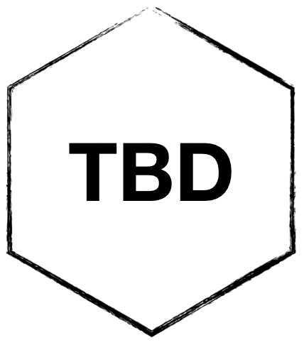

# PSYC 2530 Introductory Cognitive Psychology 

<!-- badges: start -->

<!-- badges: end -->

**Updated for Fall 2022. Prior versions of this courses are archived in the branches of this repository.**

This is the course website for Psyc 2530: Introductory Cognitive Psychology (Fall 2022), taught by Dr. Matthew Crump, at the Department of Psychology, Brooklyn College of CUNY.

Instructor: [Matthew Crump](https://www.crumplab.com) Email: [mcrump\@brooklyn.cuny.edu](mcrump@brooklyn.cuny.edu) (students please put PSYC 2530 in the subject line)

### For students in my class

We will use the resources on this website along with blackboard throughout the semester. This website will always contain the most up-to-date syllabus. The syllabus, textbook, and learning modules, slides, and other resources can all be accessed using the tabs at the top of the page.

Looking forward to meeting you in class!

If you have questions please email me. If you think other students have the same question, then please ask your question on the blackboard discussion board for this course.

### Open-educational resource

This is an open-educational resource that is free to use, share, copy, edit, and remix, with attribution and following this license.

The suite is developed using open-source software (R, RStudio, Bookdown). The source code for this project is available at <https://github.com/CrumpLab/cognition>. These materials are being actively developed. See the [OER development page](articles/oer/oer.html)
