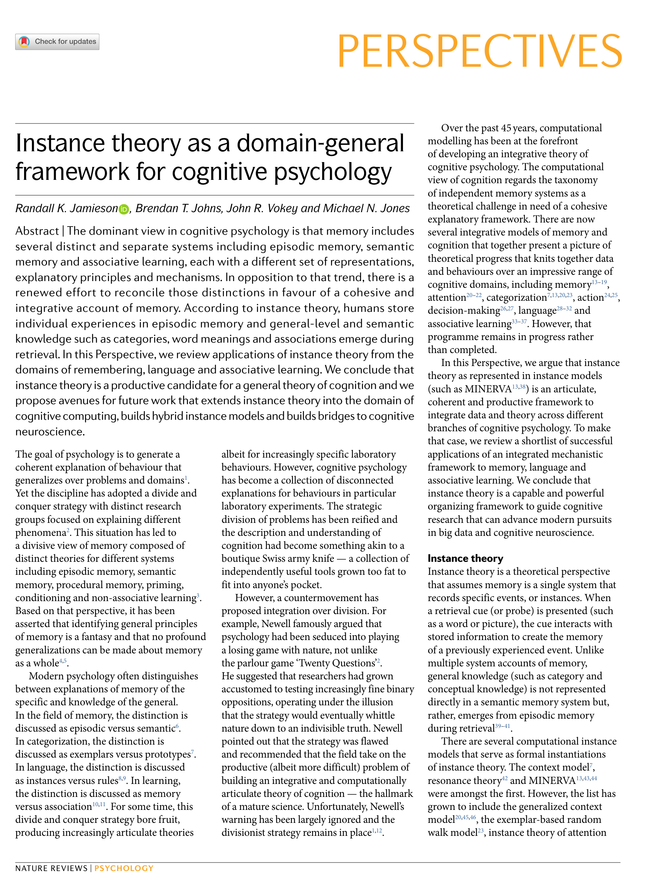
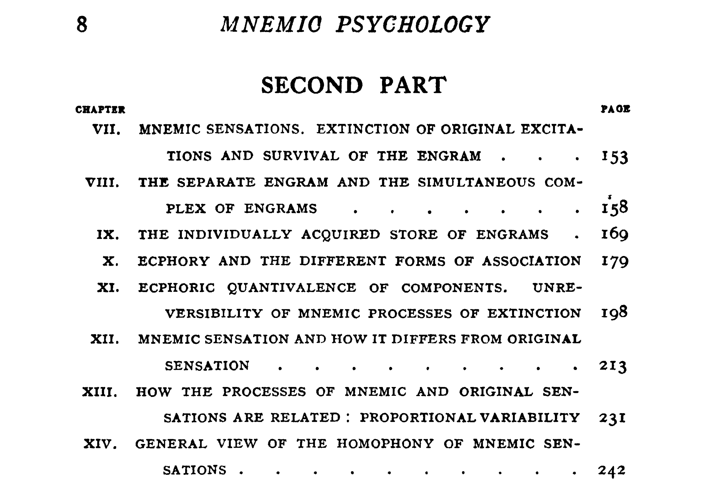
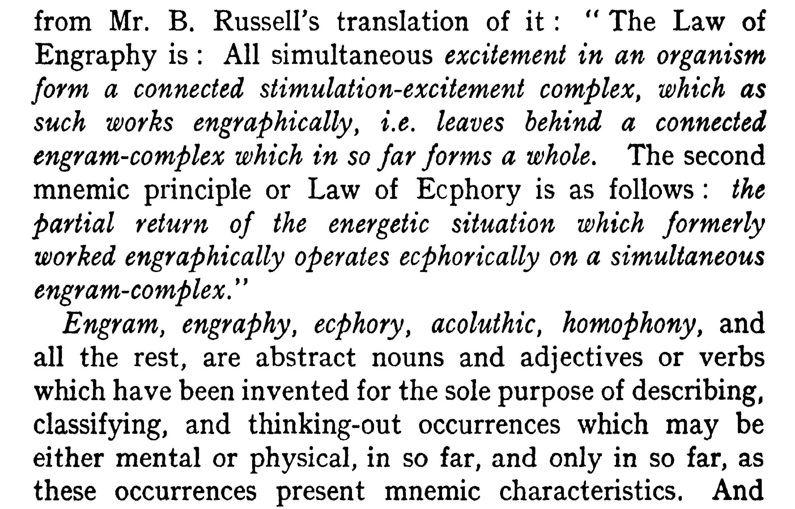
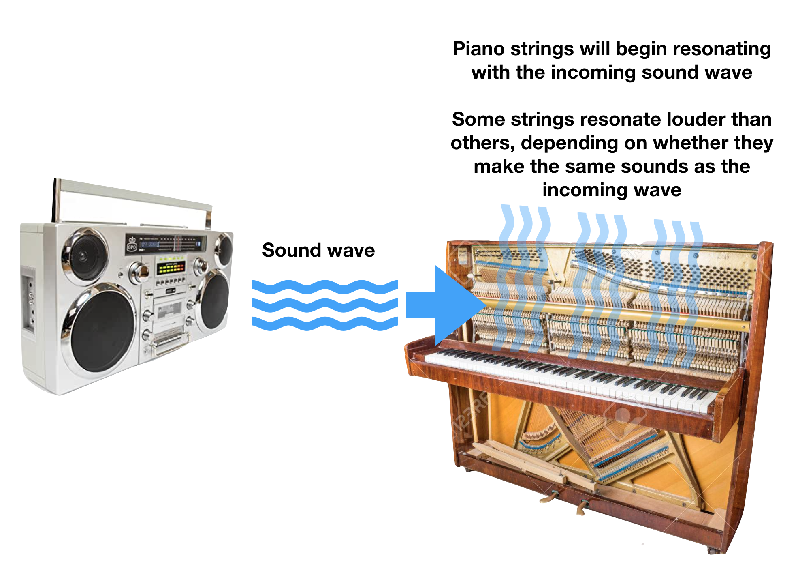
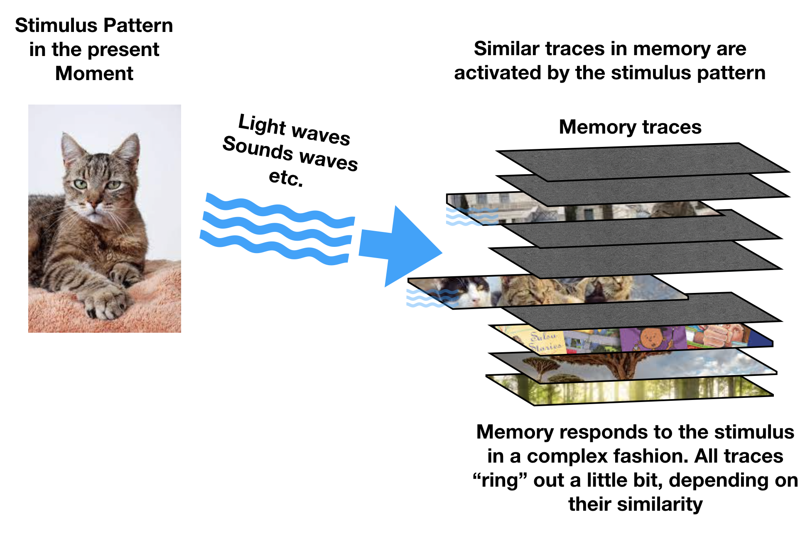
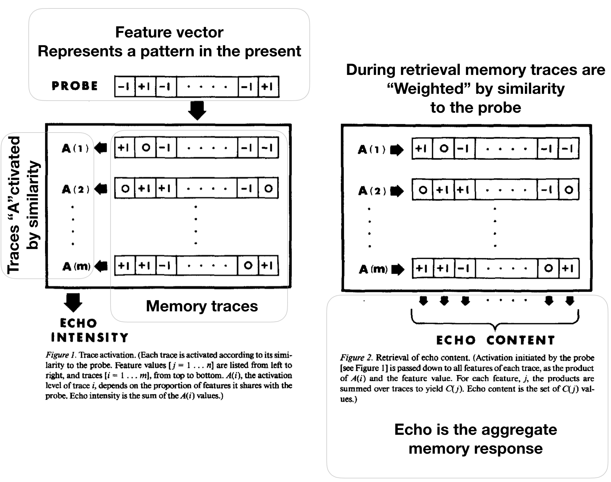
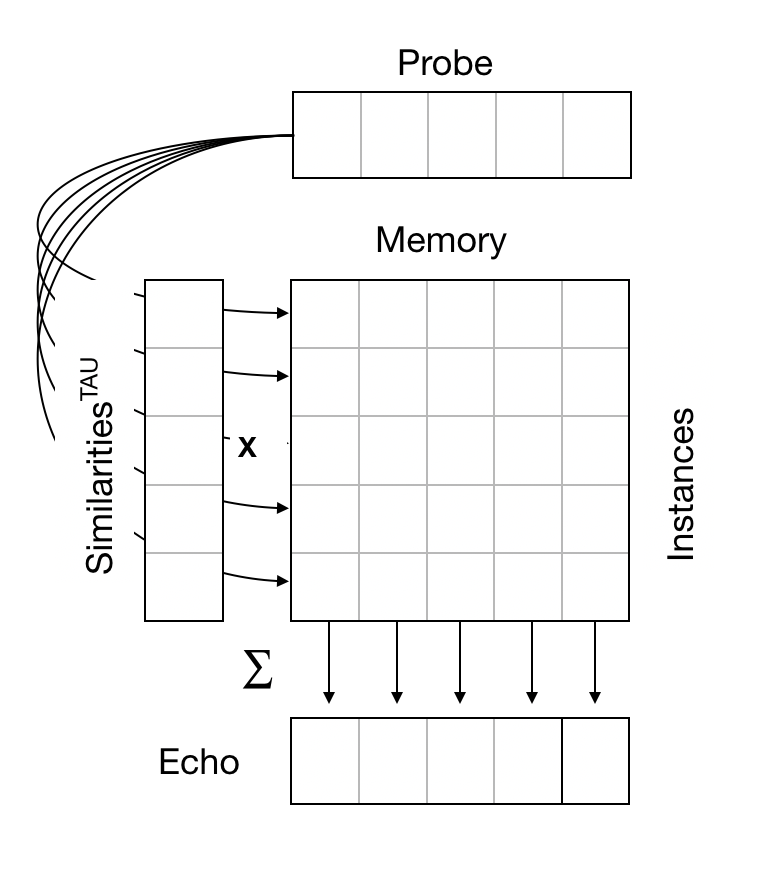

```{r setup, include=FALSE}
knitr::opts_chunk$set(echo = FALSE,
                      fig.align = "center",
                      out.width = "80%")
library(fontawesome)
```

# Overview

1.  A poetic process theory
2.  Principles of instance theory
3.  Implementing the principles computationally
4.  Examining the model

# Jamieson et al. (2022)
  
:::: {.row}
::: {.col-md-6}

The reading for this module is:

Jamieson, R. K., Johns, B. T., Vokey, J. R., & Jones, M. N. (2022). Instance theory as a domain-general framework for cognitive psychology. Nature Reviews Psychology. https://doi.org/10/gpd7zt
:::

::: {.col-md-6}

```{r}

```

:::
::::

# Intuition pump

:::: {.row}
::: {.col-md-6}

Intuition pumps allow thinkers to use their intuition to develop an answer to a problem. - Wikipedia, Dennett

- Instance theory is a productive intuition pump for cognition
- Need ways to develop and formalize the intuitions

:::

::: {.col-md-6}

```{r}

```

:::
::::

# How does some cognitive ability work?

::: row
::: col-md-6
**Domain general explanations**

- emergence from general-purpose perception, attention, learning, and memory processes
- Externally informed through experience with a structured environment
:::

::: col-md-6
**Special system explanations**

- special module with unique processing algorithms
- Internally pre-structured to sense and use signals
:::
:::

# What is instance theory?

1.  A collection of domain-general processing assumptions about how memory functions
2.  Can be formalized computationally
3.  Provides a theoretical basis to evaluate potential functional abilities (and limitations) of episodic memory systems
4.  Can be explanatory and exploratory

# Mnemic Psychology

**Historical Sidenote**

-   Modern instance theory is broadly consistent with Richard Semon's theory of memory developed in Mnemic Psychology (1923)
-   Semon was a German theorist whose ideas were largely forgotten until they were translated to English (mid-century)
-   See Schacter, D. L., Eich, J. E., & Tulving, E. (1978). Richard Semon's theory of memory. *Journal of Verbal Learning and Verbal Behavior, 17(6)*, 721-743.
-   Semon's ideas inspired Hintzman's MINERVA 2

# Poetic Psychology

```{r}

```


# Engram-complex

```{r}

```

# Physical Resonance

```{r, out.width="75%"}

```

# Memory as experiential resonance

```{r, out.width="75%"}

```

# Basic instance theory assumptions

1.  People encode the details of individual experiences
2.  Retrieval is similarity driven.

-   the pattern in the present moment retrieves experiences with similar patterns from the past

# Instance theory primers

-   A collection of related process theories of memory and cognition
-   Different researchers have different versions (broadly similar)
-   Instance theories range in specificity from verbal theories to computational models

# Example verbal instance theories

-   Jacoby, L. L., & Brooks, L. R. (1984). Nonanalytic cognition: Memory, perception, and concept learning. *The Psychology of Learning and Motivation, 18*, 1--47.

-   Kolers, P. A., & Roediger, H. L. (1984). Procedures of mind. *Journal of Verbal Learning and Verbal Behavior, 23(4)*, 425--449.

# Big picture idea

1. Lots of cognitive abilities may be understood in terms of processes involved in **cued-recall**.

# Minerva 2

MINERVA 2 is a global-matching model of memory (Hintzman, 1984,86,88) that can be formally evaluated as a computer algorithm

-   applied across numerous domains

-   Frequency judgments (Hintzman, 1988)
-   False Memory (Arndt, 1998)
-   Selective memory deficits (Curtis & Jamieson, 2019)
-   Age-related memory decline (DRYAD, Benjamin, 2012)
-   Prototype abstraction (Hintzman, 1986)
    

# Minerva 2 continued

-   Artificial Grammar Learning (Jamieson & Mewhort, 2009)
-   Implicit Sequence Learning (Jamieson & Mewhort, 2009b)
-   Judgments of Likelihoods (Dougherty, 1999)
-   Eyewitness identification (Clark, 2003)
-   lexical access (Goldinger, 1998)
-   Associative Learning (MINERVA-AL, Jamieson et al., 2010)
-   Semantic memory (ITS, Jamieson et al, 2018)


# Hintzman (1986)

```{r, out.width="75%"}

```

# MINERVA in Excel
  
Let's look at how the model works

:::: {.row}
::: {.col-md-6}

- Feature vectors
- Encoding
- Retrieval
- Recognition judgments
- Frequency judgments
- Schema abstraction

:::

::: {.col-md-6}

```{r}

```

:::
::::


