```{r setup, include=FALSE}
knitr::opts_chunk$set(echo = FALSE,
                      fig.align = "center",
                      out.width = "80%")
library(fontawesome)
```

# Reminders

Reading is Chapter 8 on [Memory I](https://www.crumplab.com/cognition/textbook/memory-i.html)

#  Roadmap

::: {.pop_box_2} 
1 Questions about memory
:::
::: {.grey_box} 
2 Early memory research
:::
::: {.grey_box} 
3 Memory as information processing
:::
::: {.grey_box} 
4 Multi-store model
:::

#  Questions about memory

::: {.smaller_50}
What is it like for you to remember something from your past? 

How many events from your experience can you remember? 

Why can you remember something from years ago, but forget new information from seconds ago? 

How do you preserve your experiences so that they can be remembered later on? 

Why is it sometimes hard to remember something, but later the answer pops in your head? 

How can you improve your memory?

How can you forget things you don’t want to think about? 

What other animals besides humans have memories? 

How are memories encoded, stored, and retrieved in the brain? 

How do people use their environment to help them remember things?
:::

#  Roadmap

::: {.grey_box} 
1 Questions about memory
:::
::: {.pop_box_2} 
2 Early memory research
:::
::: {.grey_box} 
3 Memory as information processing
:::
::: {.grey_box} 
4 Multi-store model
:::

# Early memory researchers

Hermann Ebbinghaus

Sir Frederick Bartlett

Bluma Zeigarnik

Hedwig von Restorff

# Hermann Ebbinghaus (1850-1909)

:::: {.row}
::: {.col-md-6}

Conducted some of the first experimental investigations of human memory

1885 - english translation from German, "[Memory: A Contribution to Experimental Psychology](https://archive.org/details/memorycontributi00ebbiuoft)"

:::

::: {.col-md-6}

```{r, out.width="100%"}
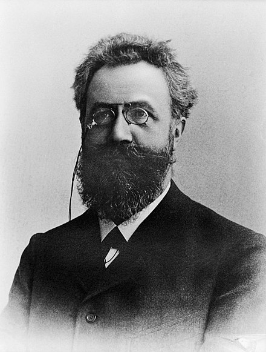
```

:::
::::

# What did Ebbinghaus do?

Systematically measured rates of learning and forgetting

Conducted single-subject research on himself

Invented use of nonsense material (CVC syllables)

# Big Questions

How do people learn new associations?

What happens to new learning with delays between practice? (forgetting)

# Issues

People already have many existing associations from their experience...

How to study learning of new associations?

# Methodological insight

Adopt a task with very little pre-existing familiarity

Ebbinghaus devised a serial learning task to measure how long it took to recite of a list of items from memory. 

He used artificial stimuli so that pre-existing familiarity with the items would not interfere with the learning process. 

# Nonsense syllables

```{r, out.width="100%"}

```

# Ebbinghaus's task

Ebbinghaus' task involved learning lists of nonsense syllables

Two basic phases:

1. Learning phase

2. Re-learning after a delay


# Modern Replication

Murre, J. M. J., & Dros, J. (2015). Replication and Analysis of Ebbinghaus’ Forgetting Curve. PLOS ONE, 10(7), e0120644. https://doi.org/f7vfcn

# one-time perfect

:::: {.row}
::: {.col-md-6}

Learning phase: practice reciting a row until it is recited perfectly one time, then move to next row

:::

::: {.col-md-6}

```{r, out.width="100%"}

```

:::
::::

# Re-learning after delay

In the second phase, each row was re-learned after a delay. The delays were 20 minutes, 1 hour, 9 hours, or 1, 2, 6, or 31 days.

After each delay period, rows were shown again and relearned. 

The number of relearning attempts to get to another “one-time perfect” recitation was also measured.

# Original learning

:::: {.row}
::: {.col-md-6}

How many practice attempts were necessary to memory a row of nonsense syllables?

The blue line shows that an average of 30-32 practice attempts were needed to memorize each row

:::

::: {.col-md-6}

```{r, out.width="100%"}
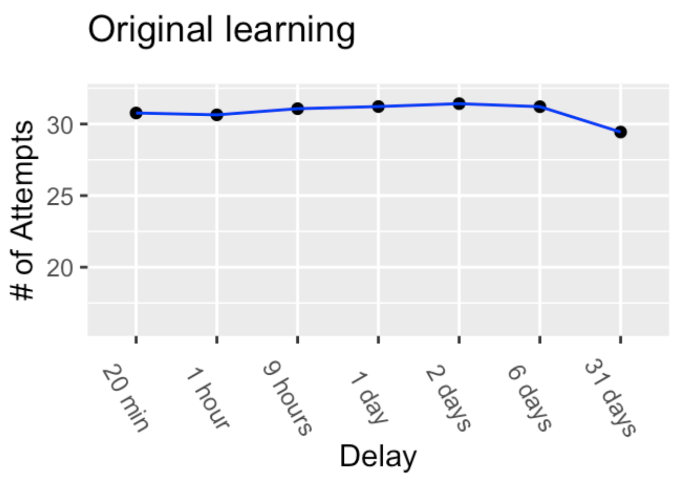
```

Data from Murre & Dros, 2015

:::
::::

# Savings in Re-learning

How many attempts were required to re-learn a list after different delays?

The delays were 20 minutes, 1 hour, 9 hours, or 1, 2, 6, or 31 days.

# Results

```{r}
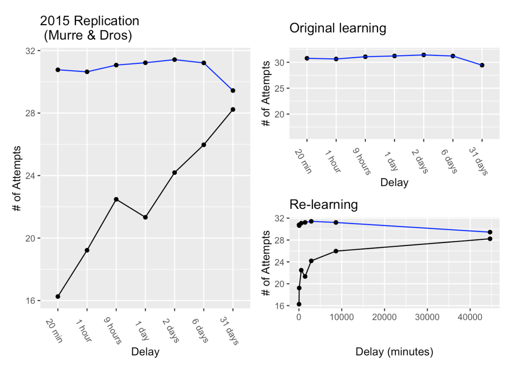
```

# Exponential forgetting

:::: {.row}
::: {.col-md-6}

Ebbinghaus was the first show evidence for exponential forgetting across delays

Most forgetting occurred immediately after learning, and the rate of forgetting slowed down as delay increased

::: {.smaller_50}
> "Exponential forgetting is like going to Las Vegas and spending most of your money on the first day, and then losing the rest of it slowly over the next week."
:::

:::

::: {.col-md-6}

```{r}
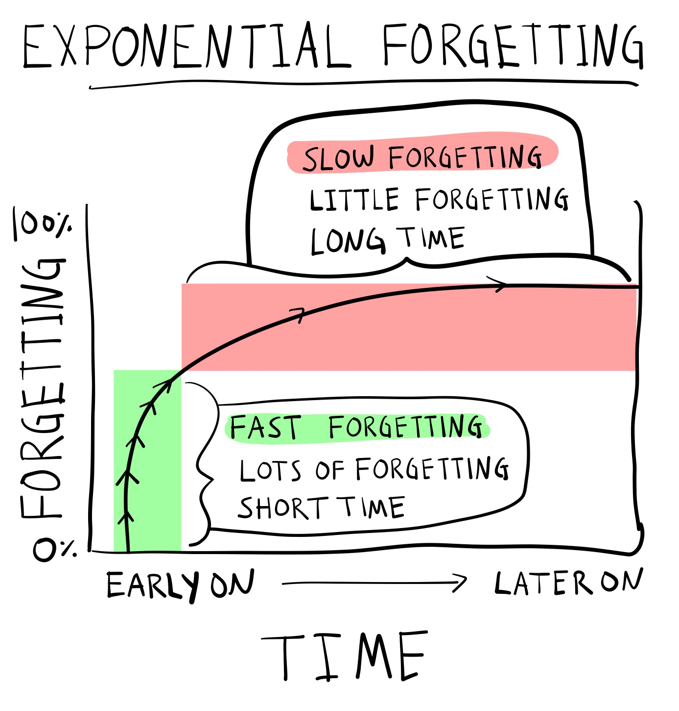
```

:::
::::

# Sir Frederick Bartlett (1886-1969)

:::: {.row}
::: {.col-md-6}

British Psychologist

Published book "Remembering" in 1932

Reconstructionist view of memory

:::

::: {.col-md-6}

```{r, out.width="100%"}
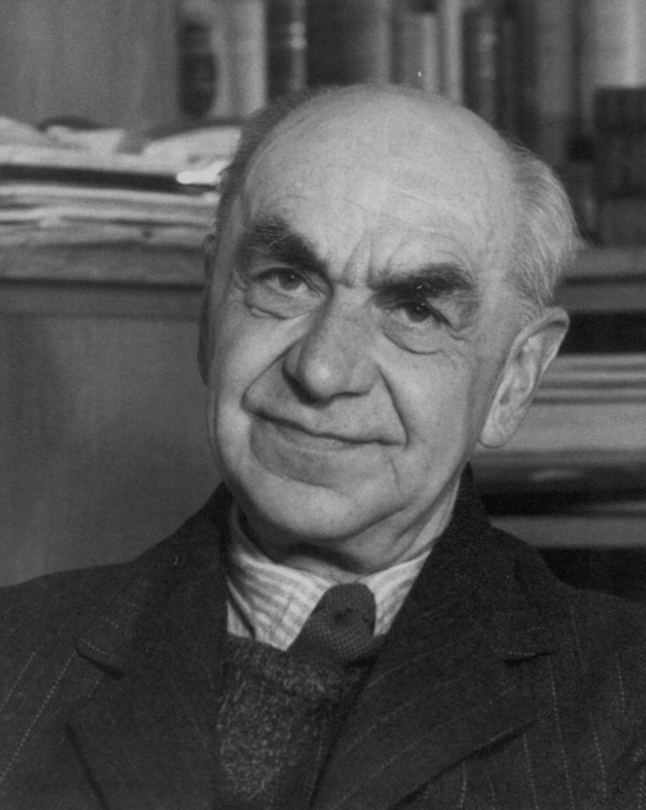
```

:::
::::

# Memory metaphors

1. Memory is a file drawer

2. Memory is a camera

3. Memory is a bent-wire

# Memory as "RE-" Membering

:::: {.row}
::: {.col-md-6}

Memory is "Humpty-Dumpty"

Memory as a process of re-constructing, or actively putting back together 

:::

::: {.col-md-6}

```{r}
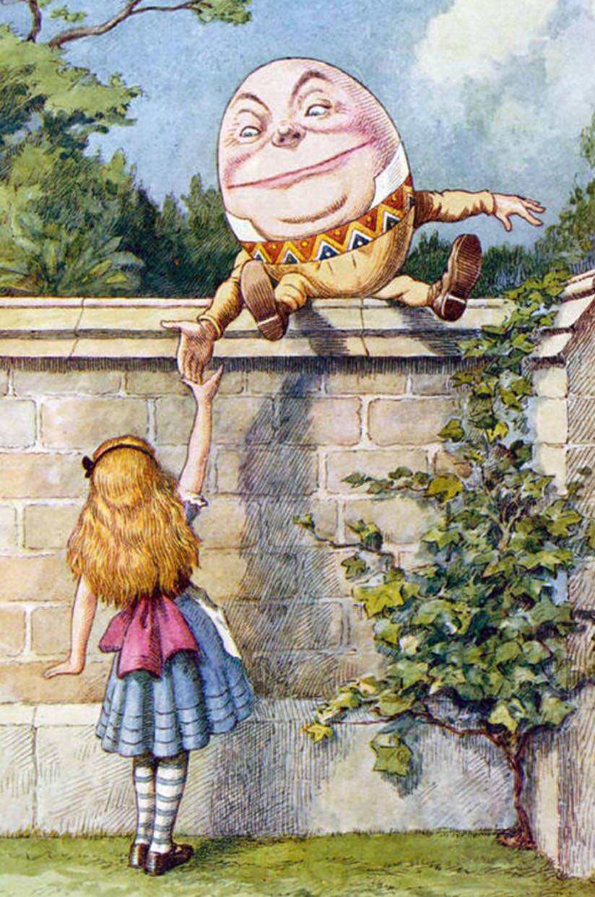
```

:::
::::

# Big questions

How do people reconstruct a prior memory?

How does memory change over successive re-memberings?

# Method of Serial Reproduction

Bartlett conducted experiments that involves two general phases:

1. Encoding/learning of some information

2. Reproduction phases: Had people reproduce the information from memory, many times over

# L'Portraite D'homme

```{r}
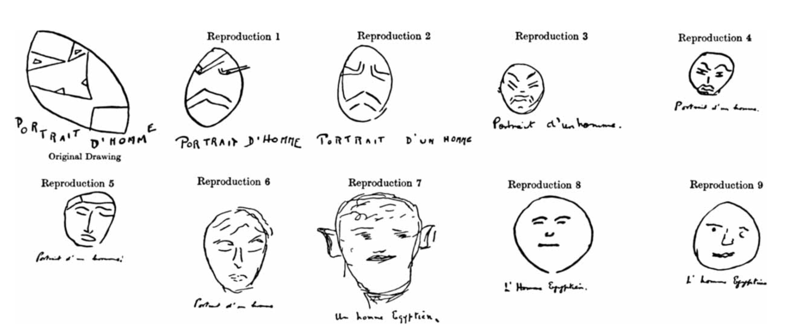
```

# Bartlett's Schemas

Bartlett suggested that remembering processes are guided by general schemas

People may distort their original experiences toward a schema

# Reproducing Bartlett

::: {.smaller_75}
Carbon, C.-C., & Albrecht, S. (2012). Bartlett’s schema theory: The unreplicated “portrait d’homme” series from 1932. Quarterly Journal of Experimental Psychology, 65(11), 2258–2270. https://doi.org/gjs5bh
:::

```{r}
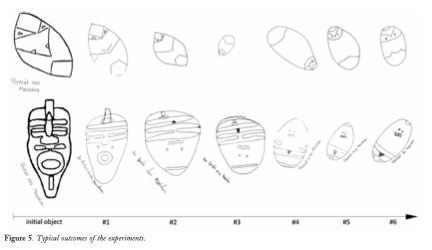
```

# Memory distortions

Although some of Bartlett’s findings may not stand the test of time, there are many reproducible findings showing that memory can be distorted in interesting ways. 

So, even though memory reconstruction may not always head toward a schema, memory does appear to involve some kind of constructive process capable of returning accurate and distorted impressions of past experiences.


# Bluma Zeigarnik (1901-1988)

:::: {.row}
::: {.col-md-6}

Early memory researcher

"to-do" list effect

:::

::: {.col-md-6}

```{r, out.width="100%"}
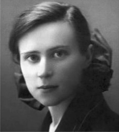
```

:::
::::

# Phenomenon

Zeigarnik investigated an apparent phenomenon showing that uncompleted tasks are remembered better than completed tasks

# Method

Participants were given a variety of tasks that took about 3- 5 minutes to complete (math, drawing, threading a needle).

Manipulation:

Partway through some of the tasks, she interrupted people and asked them to start on a new task. 

At the end of the experiment, the participants had completed some of the tasks, and others remained incomplete.

# Results

Zeigarnik then had participants recall all of the tasks. 

Across several experiments she reliably found that people recalled more of the uncompleted tasks than the completed tasks. 

One explanation was the goal to a complete a task created psychological tension that could only be resolved by completing the task. This goal-based tension is not resolved when a task is interrupted, and leads to differences in memory completed and uncompleted tasks.

# Replication attempts

In 1968, Van Bergen published several replication attempts and found that her participants did not show systematic differences in their memory for completed and uncompleted tasks...


# Hedwig von Restorff (1906-1962)

:::: {.row}
::: {.col-md-6}

Applied Gestalt theory figure/ground concepts to memory

Demonstrated role of distinctiveness in memory

:::

::: {.col-md-6}

```{r, out.width="100%"}
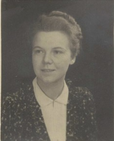
```

:::
::::

# Big Questions

What makes some information more memorable than others?

Is memory better for things that "stand-out" from the background?

# Method

:::: {.row}
::: {.col-md-6}

Tested recall memory for lists of paired items.

Manipulated:

"massed" items (CVC syllables) vs

"isolated" items (unique pairs)

:::

::: {.col-md-6}

```{r}
knitr::include_graphics("../../textbook/imgs/Von_restorff_Stimuli.png")
```

:::
::::

# Counterbalancing

:::: {.row}
::: {.col-md-6}

Counterbalancing is an experimental technique used to control for the role of individual stimuli

Von Restorff counterbalanced the massed and isolated items across lists


:::

::: {.col-md-6}

```{r}
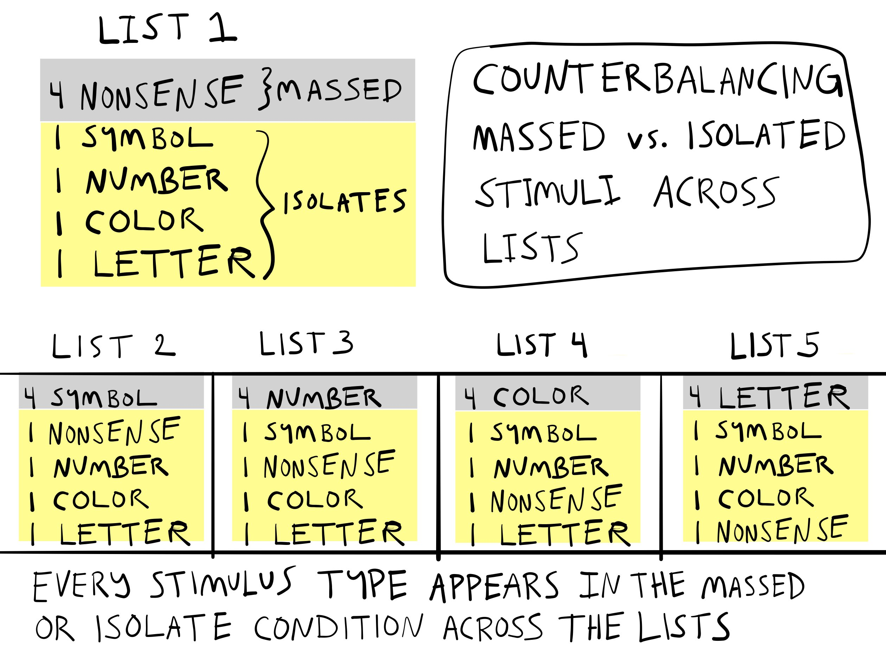
```

:::
::::

# Results

Von Restorff found:

Higher recall of isolated pairs compared to massed pairs...

Regardless of type of material

Important: particular stimuli were more or less memorable, not in and of themselves, but in relation to how distinct they were from other stimuli in the set.

# Distinctiveness effects

..have been replicated many times in many ways since von Restorff


#  Roadmap

::: {.grey_box} 
1 Questions about memory
:::
::: {.grey_box} 
2 Early memory research
:::
::: {.pop_box_2} 
3 Memory as information processing
:::
::: {.grey_box} 
4 Multi-store model
:::

# George Miller (1920-2012)

:::: {.row}
::: {.col-md-6}

Often considered a "founder" of cognitive psychology

Did early work on information processing limitations

Later work on language

:::

::: {.col-md-6}

```{r}
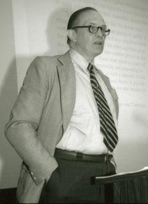
```

:::
::::

# Miller's Magic Number 7

:::: {.row}
::: {.col-md-6}

Reviews evidence showing that absolute magnitude judgments in perception have similar information "channel" capacities

Considers whether perceptual processing limitations apply to immediate memory

:::

::: {.col-md-6}

```{r, out.wisth="100"}
knitr::include_graphics("imgs/Miller_magic7.png")
```

:::
::::

# Miller's Big Question

Are the information channels for perception and memory limited in the same way or different ways?

# Absolute Perceptual Judgment

A method from psychophysics

People are presented with one stimulus at a time from a set of stimuli

Task is to identify (by name or label) the stimulus

# Absolute Pitch

Absolute pitch is a rare musical ability to identify or name individual pitches played on a musical instrument without a reference tone

Most people are not able to name specific pitches

# Pollacks' pitch judgment results

:::: {.row}
::: {.col-md-6}

Pollack presented people with sets of tones (from 2 to 14 different tones)

Subjects had identify the specific tone presented with a number

::: {.smaller_50}
Pollack, I. (1952). The Information of Elementary Auditory Displays. The Journal of the Acoustical Society of America, 24, 745–749.
:::

:::

::: {.col-md-6}

```{r, out.width="100%"}
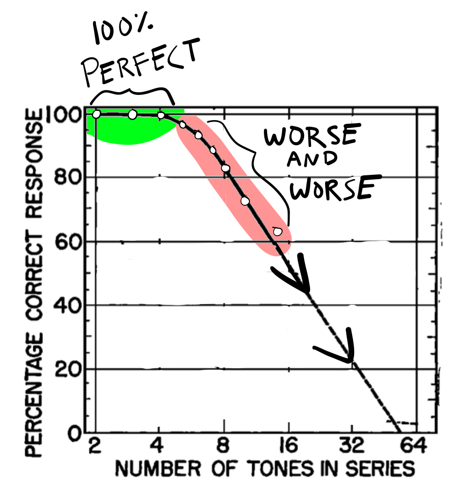
```

:::
::::

# Translation to Channel Capacity

Results from absolute magnitude judgment tasks can be translated from accuracy to amount of information transmitted

:::: {.row}
::: {.col-md-6}

```{r}

```

:::

::: {.col-md-6}

```{r}
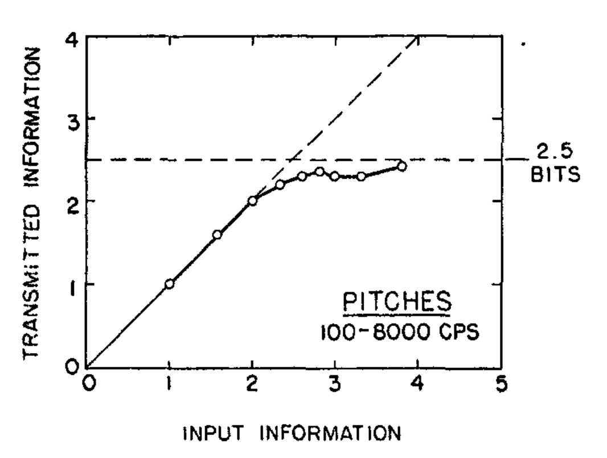
```

:::
::::


# Generalization across perceptual tasks

```{r}
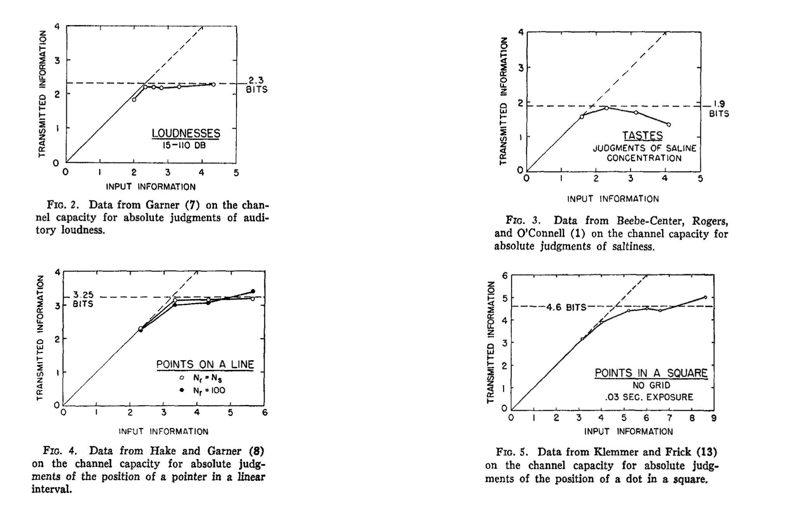
```

# Interim summary

Judgments of absolute magnitude appear to be limited by stimulus set-size, which could be translated to amount of information

Performance was typically near perfect up to around set size of 7, plus or minus 2.

# Generalization to immediate memory span?

Do perceptual judgment limitations also apply to your ability to remember information over the short term?

Is there a relationship to **immediate memory span**?

# How items can memory hold?

Immediate memory span is a way to measure the ability to encode and recall an arbitrary list of items over a short period of time

People can often retain around 7, plus or minus two items

# Immediate memory span and bits

:::: {.row}
::: {.col-md-6}

binary digits : 00010001101110

decimal digits: 17583285647390

letters: abhgkslhjbcksj

letters and digits: 4hsj3hd8fgj3h2g

1000 words: hello dolphin lamp tree plate car ...

:::

::: {.col-md-6}

```{r}
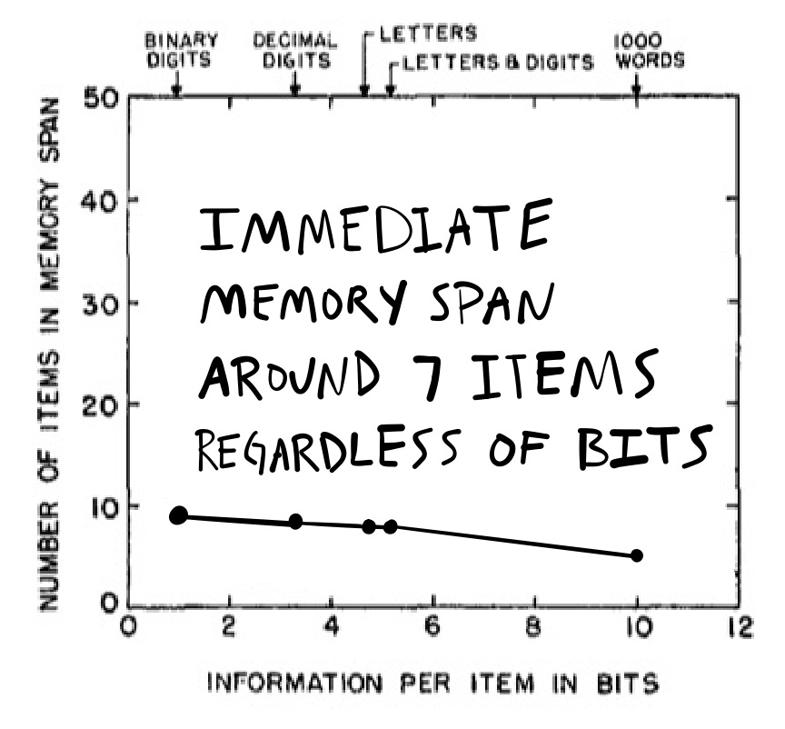
```

:::
::::

# Recoding and Chunking

:::: {.row}
::: {.col-md-6}

Miller suggests that people "recode" information into chunks, and that immediate memory is limited by number of chunks not amount of information in the chunks

:::

::: {.col-md-6}

```{r}
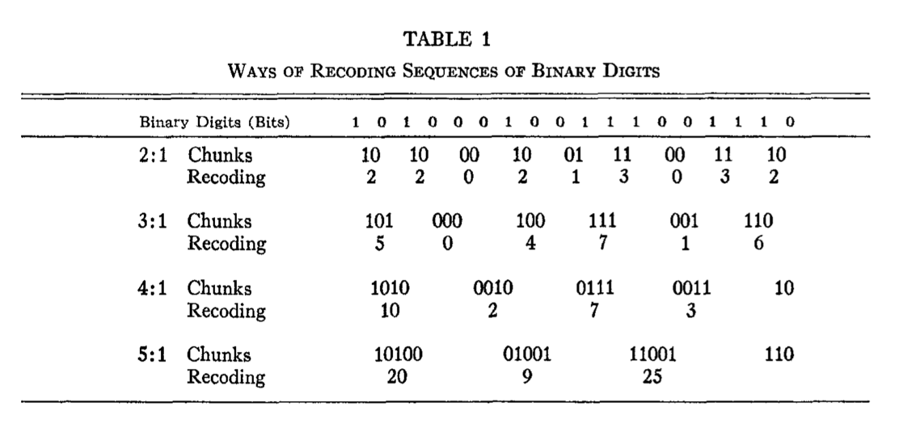
```

:::
::::


#  Roadmap

::: {.grey_box} 
1 Questions about memory
:::
::: {.grey_box} 
2 Early memory research
:::
::: {.grey_box} 
3 Memory as information processing
:::
::: {.pop_box_2} 
4 Multi-store model
:::

# Short vs long-term memory

We have all forgotten something that just happened

We can all remember things from a long time ago

How do we explain the short and long term aspects of memory ability?

# Multi-store model

:::: {.row}
::: {.col-md-6}

Atkinson, R. C., & Shiffrin, R. M. (1968). Human memory: A proposed system and its control processes. In Psychology of learning and motivation (Vol. 2, pp. 89–195). Elsevier.

:::

::: {.col-md-6}

```{r, out.width="100%"}
knitr::include_graphics("../../textbook/imgs/Multi_store_1.jpg")
```

:::
::::

# Rehearsal buffer

:::: {.row}
::: {.col-md-6}

According to the multi-store model, people can consciously rehearse items in a short term buffer

More rehearsal = more transfer to long-term memory

:::

::: {.col-md-6}

```{r}
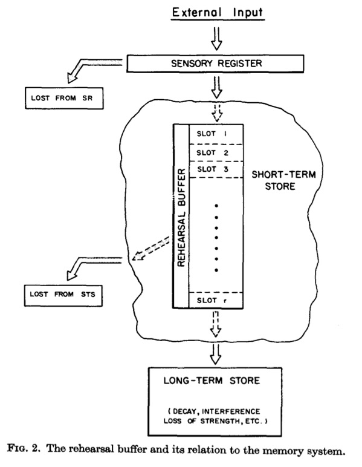
```

:::
::::

# Free recall task

A common memory task procedure

Encoding phase: read a list of words

Recall phase: write down all the words you can recall on a blank sheet of paper

# Serial position curve

:::: {.row}
::: {.col-md-6}

A common finding in free recall tasks

**Primacy effect**: better memory for items presented early in the list

**Recency effect**: better memory for items presented at the end of the list

:::

::: {.col-md-6}

```{r}
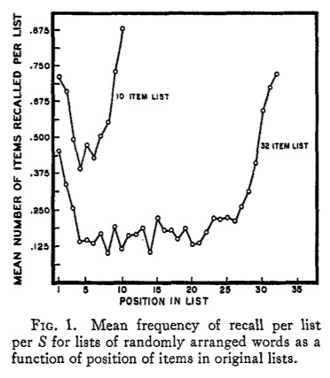
```

::: {.smaller_50}
Deese, J., & Kaufman, R. A. (1957). Serial effects in recall of unorganized and sequentially organized verbal material. Journal of Experimental Psychology, 54(3), 180. https://doi.org/drc265
:::

:::
::::

# Explaining the serial position curve

How does the multi-store model explain the primacy effect?

How does the multi-store model explain the recency effect?

# Testing the rehearsal account

How could we test the hypothesis that the rehearsal is causing the recency effect?

# Manipulating Rehearsal

:::: {.row}
::: {.col-md-6}

Postman & Philips (1965) manipulated whether or not participants did arithmetic problems before a recall test...

Arithmetic problem-solving should make rehearsal difficult

:::

::: {.col-md-6}

```{r}
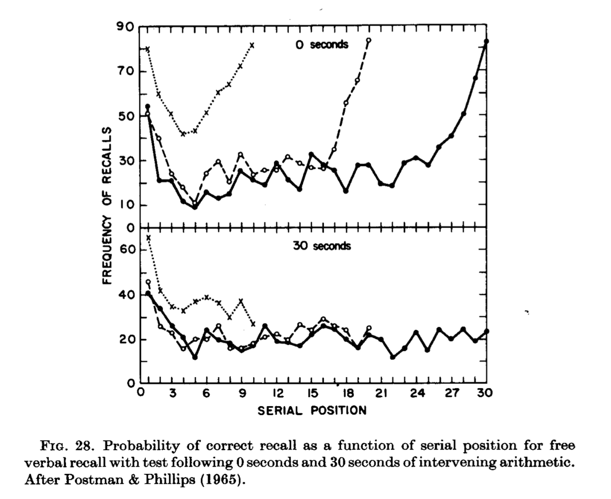
```

:::
::::


# Tzeng 1973

In 1973, Tzeng reported a standard free-recall experiment with a twist. 

His subjects were given four lists of 10 words each. 
The twist was that after hearing each word, subjects spent 20 seconds counting backwards by 3s from a random starting digit. 

Counting backwards by 3s was a very demanding task that should occupy and replace the contents of any short-term rehearsal buffer. 

# Long-term recency

:::: {.row}
::: {.col-md-6}

According to the multi-store model, Tzeng should not have found recency effects in this experiment, but he did.

:::

::: {.col-md-6}

```{r}
knitr::include_graphics("../../textbook/imgs/Tzeng_1973.jpg")
```

:::
::::

# Systems vs strategies


# What's next?

Take the quiz and complete any assignments for the learning module by the due date. 

The next learning module is Memory II.


