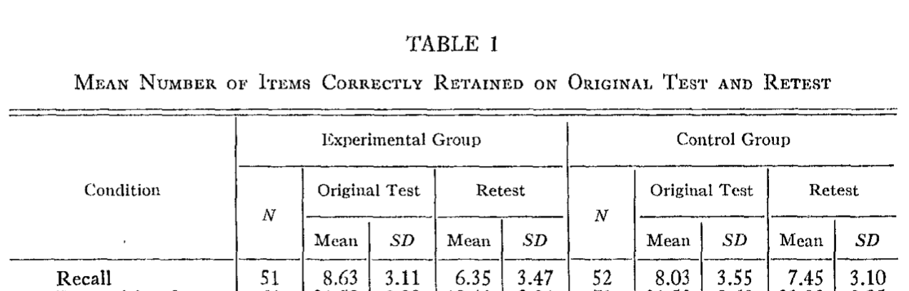

```{r setup, include=FALSE}
knitr::opts_chunk$set(echo = FALSE,
                      fig.align = "center",
                      out.width = "80%")
library(fontawesome)
```

## Reminders from last class

Reading is Chapter 9 on [Memory I](https://www.crumplab.com/cognition/textbook/memory-ii.html)

Quiz 6 is open until Thursday @ 11:59pm

##  Measuring Memory

### 1. Measuring Memory {.bolder}
### 2. Memory Phenomena {.greyout}
### 3. Memory Principles {.greyout}

## Measuring Meory

Memory processes and abilities are measured with memory tasks

Memory tasks are imperfect, and do not necessarily directly measure a memory process

## Recall vs recognition

:::: {.row}
::: {.col-md-6}

**Recall task**

Encoding phase: view a list of items (usually words)

Recall phase: generate as many items from the list as possible (e.g., write down as many words as you can remember)

:::

::: {.col-md-6}

**Recognition task**

Encoding phase: view a list of items (usually words)

Recognition phase: view one item at a time, judge whether the item is OLD or NEW

(old items were presented before, and new items are not presented)

:::
::::

## Recall task performance

Does failing to recall an item mean you don't have a memory for it?


## Recognition task performance

Does near 100% accuracy on a recognition memory test mean you have good memory for the old items?


##  Memory Phenomena

### 1. Measuring Memory {.greyout}
### 2. Memory Phenomena {.bolder}
### 3. Memory Principles {.greyout}

## Memory Phenomena

Memory phenomena are experimental findings showing how some manipulation influences performance in a memory task

Examples:

Ebbinghaus showed manipulations of temporal delay influence forgetting

Von Restorff showed that manipulations of distinctiveness influence recall performance

## Many Memory Phenomena

The textbook reviews several examples of findings that are known to influence memory performance, let's review some of them

## Picture Superiority effect

Gehring, R. E., Toglia, M. P., & Kimble, G. A. (1976). Recognition memory for words and pictures at short and long retention intervals. Memory & Cognition, 4(3), 256–260. https://doi.org/bmxw8f

:::: {.row}
::: {.col-md-6}

```{r, out.width="100%"}
knitr::include_graphics("imgs/Gehring_method.png")
```

:::

::: {.col-md-6}

```{r, out.width="100%"}
knitr::include_graphics("imgs/Gehring_results.png")
```

:::
::::

## Frequency effects

:::: {.row}
::: {.col-md-6}

```{r, out.width="100%"}
knitr::include_graphics("imgs/Frequency_abstract.png")
```

:::

::: {.col-md-6}

```{r, out.width="100%"}
knitr::include_graphics("imgs/Frequency_results.png")
```

:::
::::

## Presentation Rate and Spacing

:::: {.row}
::: {.col-md-6}

The encoding phase varied how long participants viewed each word, and used presentation rates of 1.3, 2.3, and 4.3 seconds.

Repetitions were separated, or spaced out, by 0, 2, 4, 8, 20, or 40 intervening words. 

:::

::: {.col-md-6}

```{r, out.width="100%"}
knitr::include_graphics("../../textbook/imgs/Melton_1970.jpg")
```

Melton, A. W. (1970). The situation with respect to the spacing of repetitions and memory. Journal of Verbal Learning and Verbal Behavior, 9(5), 596–606. https://doi.org/cpd74k

:::
::::

## Retroactive interference

Retroactive interference refers to cases when subsequent learning activities in the future influence prior learning from the past. 

## RI example

:::: {.row}
::: {.col-md-6}

In a first phase (called original learning), subjects encoded 24 nonsense syllables and were then given a memory test. In a second phase (called interpolated learning), subjects in the experimental group were given 24 new nonsense syllables to remember, and subjects in a control group read the New Yorker magazine instead. In the final phase, everyone was retested for the items from the first list.

:::

::: {.col-md-6}

```{r, out.width="100%"}

```

:::
::::

## Pro-active interference

Proactive interference happens when previous learning activities from the past interferes with current learning activities in the present. 

## PI example from Underwood

:::: {.row}
::: {.col-md-6}

Underwood, B. J. (1957). Interference and forgetting. Psychological Review, 64(1), 49–60. https://doi.org/c3vqj9

:::

::: {.col-md-6}

```{r, out.width="100%"}
knitr::include_graphics("../../textbook/imgs/Underwood_1957.png")
```

:::
::::

## Fan effect

Some words co-occur more or less with other words...

The number of associates a word has is called its fan

**Fan effect**: The time to recognize an item increases as its fan, or number of associates, increases

## Fan effect example

:::: {.row}
::: {.col-md-6}

```{r, out.width="100%"}
knitr::include_graphics("../../textbook/imgs/Fan_effect.png")
```

:::

::: {.col-md-6}

```{r, out.width="100%"}
knitr::include_graphics("imgs/Fan_results.png")
```

:::
::::

## Meaningfulness

There are many demonstrations that increasing "meaningfulness" can make information more memorable

## Self-reference effect

The self-reference effect suggests that relating information to yourself can help you remember it better.

Rogers, T. B., Kuiper, N. A., & Kirker, W. S. (1977). Self-reference and the encoding of personal information. Journal of Personality and Social Psychology, 35(9), 677. https://doi.org/cfzwx7

## Self-reference effect example

:::: {.row}
::: {.col-md-6}

```{r, out.width="100%"}
knitr::include_graphics("imgs/Self_Reference_design.png")
```

:::

::: {.col-md-6}

```{r, out.width="100%"}
knitr::include_graphics("imgs/Self_reference_results.png")
```

:::
::::


## Meaningful Context

How well do you think you can understand and remember this paragaph?

> If the ballons popped, the sound wouldn't be able to carry since everything would be too far away from the correct floor. A closed window would also prevent the sound from carrying, since most buildings tend to be well insulated. Since the whole operation depends on a steady flow of electricity, a break in the middle of the wire would also cause problems. Of course, the fellow could shout, but the human voice is not loud enough to carry that far. An additional problem is that a string could break the instrument. Then there could be no accompaniment to the message. It is clear that the best situation would involve less distance. Then there would be fewer potential problems. With face to face contact, the lest number of things could go wrong.

## Bransford and Johnson

Participants read the previous paragraph under different conditions:

:::: {.row}
::: {.col-md-6}

Full context

```{r}
knitr::include_graphics("../../textbook/imgs/Bransford_context.png")
```

:::

::: {.col-md-6}

Full context

```{r}
knitr::include_graphics("../../textbook/imgs/Bransford_partial.png")
```

:::
::::


## Results

Participants who got the full context picture BEFORE they read the paragraph, showed much higher comprehension and recall

```{r, out.width="100%"}
knitr::include_graphics("../../textbook/imgs/Bransford_data.png")
```

## Environmental Context Effects

Godden, D. R., & Baddeley, A. D. (1975). Context-dependent memory in two natural environments: On land and underwater. British Journal of Psychology, 66(3), 325–331. https://doi.org/10.1111/j.2044-8295.1975.tb01468.x


## Design

Divers encoded words either on land or under water

Then they attempted to recall words in the same or different context from where they encoded the words

## Results

```{r}
knitr::include_graphics("../../textbook/imgs/Godden_Baddeley_data.png")
```

## Generation effect

## Testing Effect

## Directed Forgetting


##  Memory Principles

### 1. Measuring Memory {.greyout}
### 2. Memory Phenomena {.greyout}
### 3. Memory Principles {.bolder}


