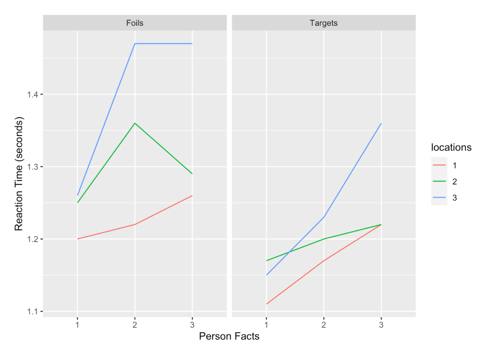
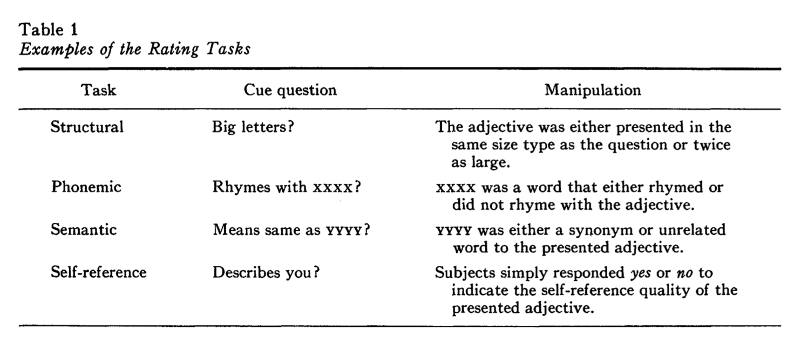
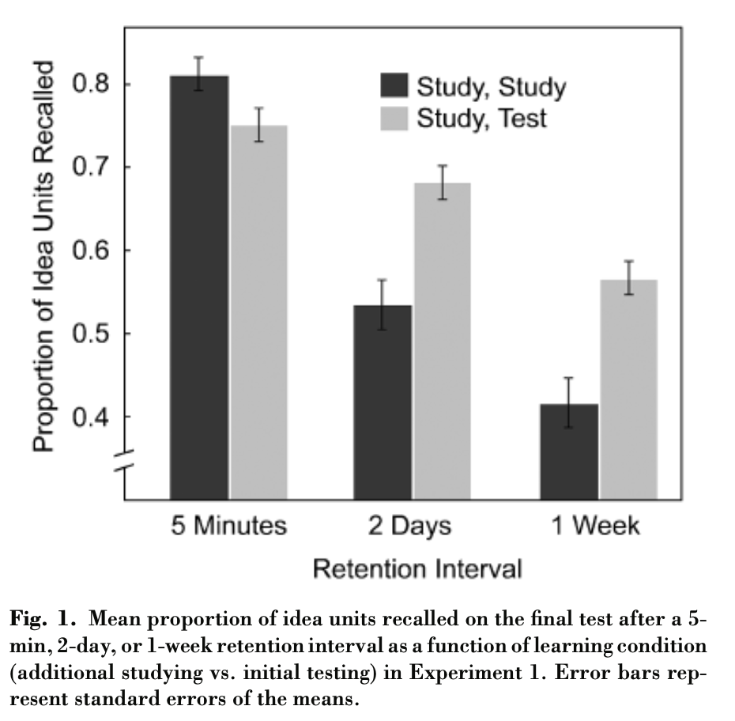
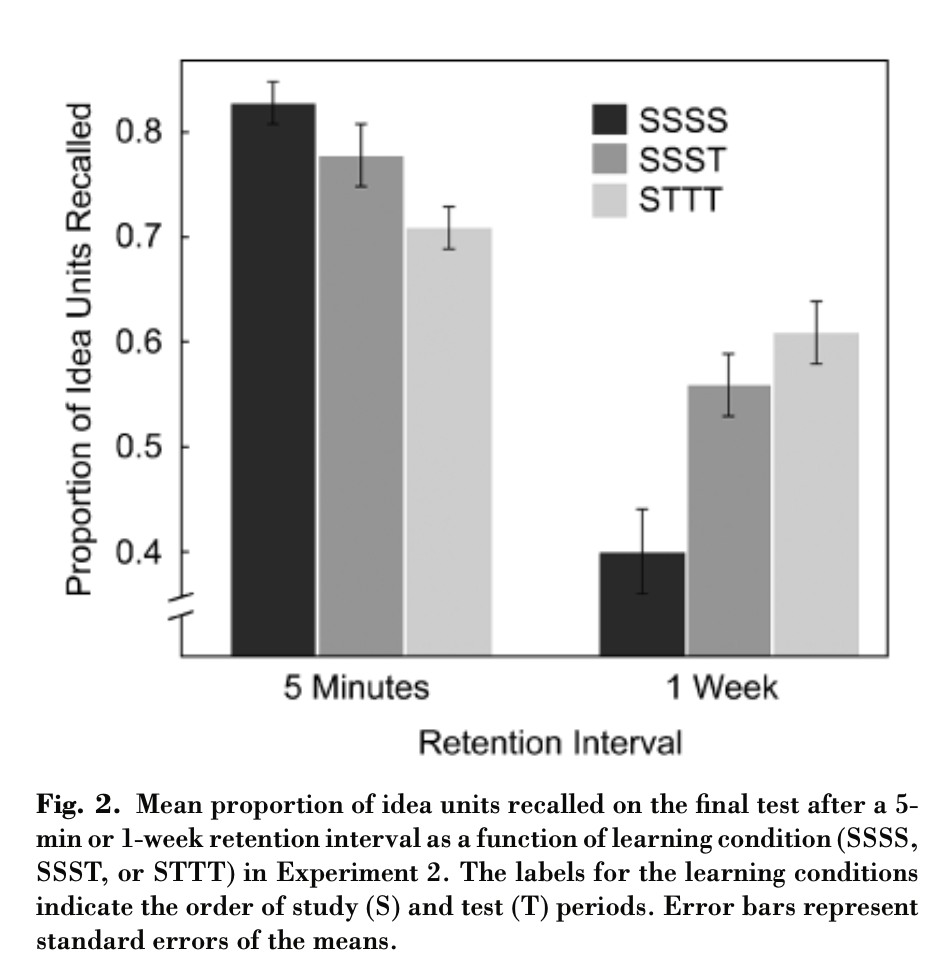

```{r setup, include=FALSE}
knitr::opts_chunk$set(echo = FALSE,
                      fig.align = "center",
                      out.width = "80%")
library(fontawesome)
```

## Reminders from last class

Reading is Chapter 9 on [Memory I](https://www.crumplab.com/cognition/textbook/memory-ii.html)

Quiz 6 is open until Thursday @ 11:59pm

##  Measuring Memory

### 1. Measuring Memory {.bolder}
### 2. Memory Phenomena {.greyout}
### 3. Memory Principles {.greyout}

## Measuring Meory

Memory processes and abilities are measured with memory tasks

Memory tasks are imperfect, and do not necessarily directly measure a memory process

## Recall vs recognition

:::: {.row}
::: {.col-md-6}

**Recall task**

Encoding phase: view a list of items (usually words)

Recall phase: generate as many items from the list as possible (e.g., write down as many words as you can remember)

:::

::: {.col-md-6}

**Recognition task**

Encoding phase: view a list of items (usually words)

Recognition phase: view one item at a time, judge whether the item is OLD or NEW

(old items were presented before, and new items are not presented)

:::
::::

## Recall task performance

Does failing to recall an item mean you don't have a memory for it?


## Recognition task performance

Does near 100% accuracy on a recognition memory test mean you have good memory for the old items?


##  Memory Phenomena

### 1. Measuring Memory {.greyout}
### 2. Memory Phenomena {.bolder}
### 3. Memory Principles {.greyout}

## Memory Phenomena

Memory phenomena are experimental findings showing how some manipulation influences performance in a memory task

Examples:

Ebbinghaus showed manipulations of temporal delay influence forgetting

Von Restorff showed that manipulations of distinctiveness influence recall performance

## Many Memory Phenomena

The textbook reviews several examples of findings that are known to influence memory performance, let's review some of them

## Picture Superiority effect

Gehring, R. E., Toglia, M. P., & Kimble, G. A. (1976). Recognition memory for words and pictures at short and long retention intervals. Memory & Cognition, 4(3), 256–260. https://doi.org/bmxw8f

:::: {.row}
::: {.col-md-6}

```{r, out.width="100%"}
knitr::include_graphics("imgs/Gehring_method.png")
```

:::

::: {.col-md-6}

```{r, out.width="100%"}
knitr::include_graphics("imgs/Gehring_results.png")
```

:::
::::

## Frequency effects

:::: {.row}
::: {.col-md-6}

```{r, out.width="100%"}
knitr::include_graphics("imgs/Frequency_abstract.png")
```

:::

::: {.col-md-6}

```{r, out.width="100%"}
knitr::include_graphics("imgs/Frequency_results.png")
```

:::
::::

## Presentation Rate and Spacing

:::: {.row}
::: {.col-md-6}

The encoding phase varied how long participants viewed each word, and used presentation rates of 1.3, 2.3, and 4.3 seconds.

Repetitions were separated, or spaced out, by 0, 2, 4, 8, 20, or 40 intervening words. 

:::

::: {.col-md-6}

```{r, out.width="100%"}
knitr::include_graphics("../../textbook/imgs/Melton_1970.jpg")
```

Melton, A. W. (1970). The situation with respect to the spacing of repetitions and memory. Journal of Verbal Learning and Verbal Behavior, 9(5), 596–606. https://doi.org/cpd74k

:::
::::

## Retroactive interference

Retroactive interference refers to cases when subsequent learning activities in the future influence prior learning from the past. 

## RI example

:::: {.row}
::: {.col-md-6}

In a first phase (called original learning), subjects encoded 24 nonsense syllables and were then given a memory test. In a second phase (called interpolated learning), subjects in the experimental group were given 24 new nonsense syllables to remember, and subjects in a control group read the New Yorker magazine instead. In the final phase, everyone was retested for the items from the first list.

:::

::: {.col-md-6}

```{r, out.width="100%"}
knitr::include_graphics("imgs/RI_results.png")
```

:::
::::

## Pro-active interference

Proactive interference happens when previous learning activities from the past interferes with current learning activities in the present. 

## PI example from Underwood

:::: {.row}
::: {.col-md-6}

Underwood, B. J. (1957). Interference and forgetting. Psychological Review, 64(1), 49–60. https://doi.org/c3vqj9

:::

::: {.col-md-6}

```{r, out.width="100%"}
knitr::include_graphics("../../textbook/imgs/Underwood_1957.png")
```

:::
::::

## Fan effect

Some words co-occur more or less with other words...

The number of associates a word has is called its fan

**Fan effect**: The time to recognize an item increases as its fan, or number of associates, increases

## Fan effect example

:::: {.row}
::: {.col-md-6}

```{r, out.width="100%"}
knitr::include_graphics("../../textbook/imgs/Fan_effect.png")
```

:::

::: {.col-md-6}

```{r, out.width="100%"}

```

:::
::::

## Meaningfulness

There are many demonstrations that increasing "meaningfulness" can make information more memorable

## Self-reference effect

The self-reference effect suggests that relating information to yourself can help you remember it better.

Rogers, T. B., Kuiper, N. A., & Kirker, W. S. (1977). Self-reference and the encoding of personal information. Journal of Personality and Social Psychology, 35(9), 677. https://doi.org/cfzwx7

## Self-reference effect example

:::: {.row}
::: {.col-md-6}

```{r, out.width="100%"}

```

:::

::: {.col-md-6}

```{r, out.width="100%"}
knitr::include_graphics("imgs/Self_reference_results.png")
```

:::
::::


## Meaningful Context

How well do you think you can understand and remember this paragaph?

> If the ballons popped, the sound wouldn't be able to carry since everything would be too far away from the correct floor. A closed window would also prevent the sound from carrying, since most buildings tend to be well insulated. Since the whole operation depends on a steady flow of electricity, a break in the middle of the wire would also cause problems. Of course, the fellow could shout, but the human voice is not loud enough to carry that far. An additional problem is that a string could break the instrument. Then there could be no accompaniment to the message. It is clear that the best situation would involve less distance. Then there would be fewer potential problems. With face to face contact, the lest number of things could go wrong.

## Bransford and Johnson

Participants read the previous paragraph under different conditions:

:::: {.row}
::: {.col-md-6}

Full context

```{r}
knitr::include_graphics("../../textbook/imgs/Bransford_context.png")
```

:::

::: {.col-md-6}

Full context

```{r}
knitr::include_graphics("../../textbook/imgs/Bransford_partial.png")
```

:::
::::


## Results

Participants who got the full context picture BEFORE they read the paragraph, showed much higher comprehension and recall

```{r, out.width="100%"}
knitr::include_graphics("../../textbook/imgs/Bransford_data.png")
```

## Environmental Context Effects

Godden, D. R., & Baddeley, A. D. (1975). Context-dependent memory in two natural environments: On land and underwater. British Journal of Psychology, 66(3), 325–331. https://doi.org/10.1111/j.2044-8295.1975.tb01468.x


## Design

Divers encoded words either on land or under water

Then they attempted to recall words in the same or different context from where they encoded the words

## Results

```{r}
knitr::include_graphics("../../textbook/imgs/Godden_Baddeley_data.png")
```

## Testing Effect

:::: {.row}
::: {.col-md-6}

There will be some midterm questions about this paper

It is available to read on blackboard

:::

::: {.col-md-6}

Roediger III, H. L., & Karpicke, J. D. (2006). Test-enhanced learning: Taking memory tests improves long-term retention. Psychological Science, 17(3), 249–255. https://doi.org/10/cp47ms


:::
::::

## What is the testing effect?

Better memory for material that was tested and successfully recalled or recognized, compared to material that was not tested

E.g., better later memory for a concept if it was on a quiz, compared to concepts that were not quizzed

## Prior research

Testing effects have usually been obtained for word lists, picture lists, or multiple-choice questions

## Questions

Does the testing effect generalize to more educationally relevant conditions?

Can the testing effect be obtained using prose materials and free-recall tests without feedback?

Will benefits extend beyond restudying the material?


## Experiment 1

Question: will the testing effect occur for prose materials and free-recall tests without feedback?

## Method

120 participants studied two prose passages on "the sun" or "sea otters)

passages were 256 and 275 words in length

each passage was divided into 30 idea units for later scoring

## Design

2 x 3 mixed-factorial design

Learning condition: restudy vs. test

Delay to memory test: 5 min, 2 days, 1 week

## Procedure

Phase 1: a 7 minute period. Participants studied a passage for the first time

Then they either restudied the passage OR were given a recall test to remember as much of the material as they could

FINAL TEST: All participants were given a final recall test after a 5 minute, 2day, or 1 week delay

## Results

```{r}

```

## Experiment 2

What are effects of repeated restudying vs re-testing on memory for the passages?

## Method

"A 3 x 2 between-subjects design was used. Subjects learned one of the two prose passages under one of three conditions (S 5 study, T 5 test): repeated study (SSSS), single test (SSST), or repeated test (STTT). Ninety subjects were given a final recall test following a 5-min retention interval, and 90 took a final test after 1 week. Thirty subjects were assigned to each of the six between-subjects conditions." (Roediger & Karpicke, 2006)

## Results

```{r}

```


##  Memory Principles

### 1. Measuring Memory {.greyout}
### 2. Memory Phenomena {.greyout}
### 3. Memory Principles {.bolder}

## Memory Principles

The following are general principles about memory performance

These are not strong principles in the sense that they always describe how memory works

But, memory performance often generally follows these principles

## Levels of Processing Principle


Principle: The strength, quality, and depth of encoding will determine later memory performance


Craik, F. I., & Lockhart, R. S. (1972). Levels of processing: A framework for memory research. Journal of Verbal Learning and Verbal Behavior, 11(6), 671–684. https://doi.org/10/cpcxr6

## Shallow versus deep encoding

:::: {.row}
::: {.col-md-6}

### Shallow encoding

Brief amount of time

"low-level" processing

Less overall processing of stimulus

**Result = Weak memory trace**


:::

::: {.col-md-6}

### Deep encoding

More time encoding

More meaningful processing

More overall processing

**Result = Strong memory trace**

:::
::::

## Example

:::: {.row}
::: {.col-md-6}

```{r, out.width="100%"}

```

:::

::: {.col-md-6}

```{r, out.width="100%"}
knitr::include_graphics("imgs/Self_reference_results.png")
```

:::
::::

## Cue-dependent memory

**Principle:** Context matters for encoding and retrieval

Cues in the environment can trigger memory retrieval for information previously paired/associated with the cue

## Encoding Specificity Principle

> "In its broadest form the [encoding specificity] principle asserts that only that can be retrieved that has been stored, and that how it can be retrieved depends on how it was stored. In its more restricted senses, the principle becomes less truistic and hence theoretically more interesting. For instance, we assume that what is stored about the occurrence of a word in an experimental list is information about the specific encoding of that word in that context in that situation. This information may or may not include the relation that the target word has with some other word...If it does, that other word may be an effective retrieval cue. If it does not, the other word cannot provide access to the stored information because its relation to the target word is not stored."

Tulving, E., & Thomson, D. M. (1973). Encoding specificity and retrieval processes in episodic memory. Psychological Review, 80(5), 352. https://doi.org/10/cgj2rr

## In other words

The encoding specificity principle suggests that the details of how information was encoded in the first place matter for later memory retrieval.

For example, according to the encoding specificity principle, contextual information present during memory encoding may or may not play help later retrieval; it all, depends on how the contextual information was encoded. 

If some target information was encoded in relation to its context, then contextual cues may be useful for retrieval later on. 

However, if the operations that occurred during encoding did not focus much on contextual information, then contextual cues may not be very useful as retrieval cues later on.

## TIP/TAP

**TIP**: Transfer inappropriate processing 

**TAP**: Transfer appropriate processing

How a person makes use of prior information encoded by memory depends on how the information was encoded in interaction with the demands of present task. 

## Qualifying the previous principles

The TIP/TAP principle further qualifies the preceding principles. For example, memory depends on how deeply you encode information (levels of processing), the context around the encoding episode (context-dependent memory), and how the information is encoded (encoding-specificity principle); but, memory performance will also depend on the nature of the processing required by the retrieval task. 

According to TIP/TAP, previous information becomes more available when retrieval processing conditions match well with encoding processing conditions, and becomes less available when the conditions mismatch. 

## Morris, Bransford and Franks

Demonstrated that the tasks performed at encoding and retrieval can influence memory performance.

## Encoding Phase

Subjects encoded words semantically (in a sentence) to encourage deep processing, or in a rhyming condition to encourage more shallow phonetic processing.

## Retrieval Phase

Two kinds of recognition tests: standard vs rhyming

:::: {.row}
::: {.col-md-6}

Standard

Hear a word a judge OLD vs NEW

:::

::: {.col-md-6}

Rhyming

Hear a cue word (not shown during encoding)

Judge whether they heard a rhyming word during encoding

:::
::::

## Consider?

What would the levels of processing principle predict for memory performance in this experiment?

## The results

:::: {.row}
::: {.col-md-6}

Standard: better memory for semantic encoding than rhyming encoding

Rhyming test: better memory for rhyming encoding than semantic encoding

:::

::: {.col-md-6}

```{r, out.width="100%"}
knitr::include_graphics("../../textbook/imgs/Tip_Tap.png")
```

:::
::::

## Reminder

Midterm is on Monday, November 15th, during class time

Approximately 40 MC questions


