```{r setup, include=FALSE}
knitr::opts_chunk$set(echo = FALSE,
                      fig.align = "center",
                      out.width = "80%")
library(fontawesome)
```

# Reminders from last class

There are no textbook chapter readings for this learning module.

All readings are pdfs available on blackboard.

This is the last learning module before midterm 2.

#  Roadmap

::: {.pop_box_2} 
1 Implicit vs Explicit
:::
::: {.grey_box} 
2 Mere exposure effect
:::
::: {.grey_box} 
3 Testing Explanations
:::

# Implicit vs. Explicit Cognition

Cognitive psychology often distinguishes between implicit and explicit processes.

:::: {.row}
::: {.col-md-6}

```{r}
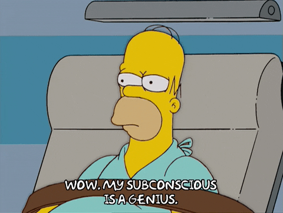
```

:::

::: {.col-md-6}

```{r}
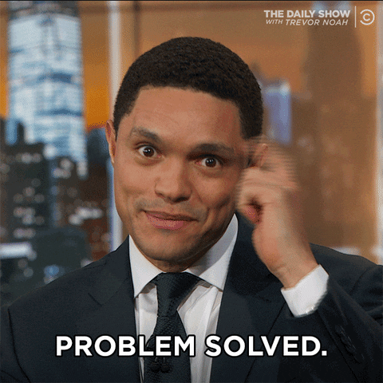
```

:::
::::

# Implicit vs. Explicit Cognition

Here are some features commonly used to distinguish implicit from explicit processes

:::: {.row}
::: {.col-md-6}

**Implicit Processes** 

>- Unaware
>- Automatic
>- fast, effortless


:::

::: {.col-md-6}

**Explicit Processes** 

>- Aware
>- Controlled
>- slow, effortful
>- Strategic, rule-based

:::
::::

# How is the distinction used?

>- The implicit/explicit distinction is used to help describe and classify particular cognitive abilities.

>- Claims about implicit vs. explicit processing are often debated. 

>- Researchers gather evidence to determine whether a particular cognitive phenomena/ability reflects implicit or explicit processing.

# Implicit or explicit?

Consider whether this situation requires implicit or explicit processes?

> A person listens to a song and says they like it.

:::: {.row}
::: {.col-md-6}

**Could be implicit** 

>- automatically get a gut feeling about the song
>- didn't have to "think about it"
>- can't explain why they like it


:::

::: {.col-md-6}

**Could be explicit** 

>- person could have deliberately analyzed the song
>- can provide reasons they like it
>- their preference is based on their reasons

:::
::::

# Implicit or explicit?

Consider whether this situation requires implicit or explicit processes?

> A person makes the next move in a chess match

:::: {.row}
::: {.col-md-6}

**Could be implicit** 

>- could be an expert
>- lots of practice
>- made the move without even thinking about it


:::

::: {.col-md-6}

**Could be explicit** 

>- person could have deliberated
>- thought about the future moves
>- made the move based on explicit reasoning process

:::
::::

# Implicit and Explicit processes

Complex cognitive behavior/abilities can be a mixture of implicit and explicit processes

```{r, out.width="50%"}
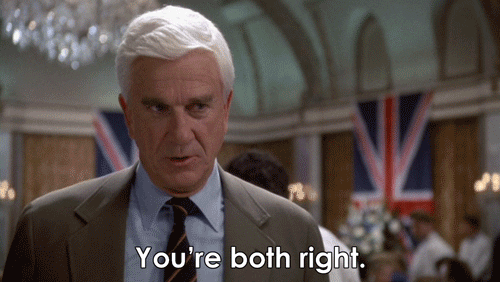
```

# Implicit influences

This module will focus on the mere exposure effect as an example of an implicit influence in cognition.

There are [many others](https://en.wikipedia.org/wiki/Implicit_cognition), here is a short list:

:::: {.row}
::: {.col-md-6}

>- [Implicit learning](https://en.wikipedia.org/wiki/Implicit_learning)
>- [Artificial grammar learning](https://en.wikipedia.org/wiki/Implicit_learning#Artificial_grammar_learning)
>- [False memory](https://en.wikipedia.org/wiki/False_memory)

:::

::: {.col-md-6}

>- [implicit attitudes](https://en.wikipedia.org/wiki/Implicit_attitude)
>- [implicit memory](https://en.wikipedia.org/wiki/Implicit_memory)

:::
::::


#  Roadmap

::: {.grey_box} 
1 Implicit vs Explicit
:::
::: {.pop_box_2} 
2 Mere exposure effect
:::
::: {.grey_box} 
3 Testing Explanations
:::

# Mere exposure effect

:::: {.row}
::: {.col-md-6}

> Repeated exposure to a stimulus enhances positive attitude toward the stimulus

>- The more you see something, the more you will like it

>- Familiarity breeds....liking

:::

::: {.col-md-6}

```{r, out.width="100%"}
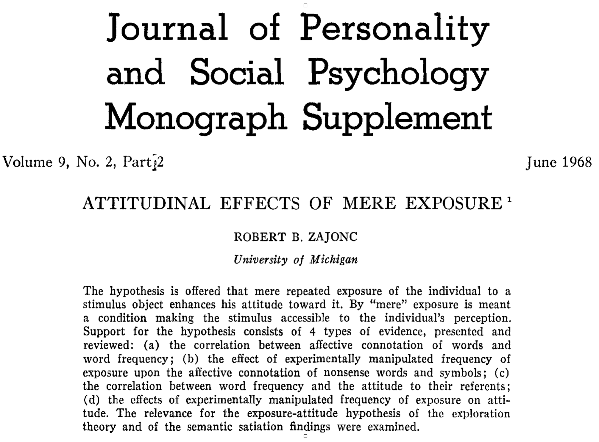
```

:::
::::

# What is the evidence for the mere-exposure effect?

# Preference of words depends on their frequencies

:::: {.row}
::: {.col-md-6}

>- Subjects shown antonym pairs

>- Asked to choose more favorable word

>- Choices were influenced by word-frequency

:::

::: {.col-md-6}

```{r, out.width="70%"}
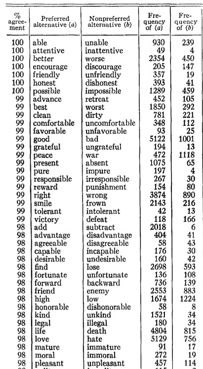
```

:::
::::

# Favorability ratings depend on word frequency

:::: {.row}
::: {.col-md-6}

>- Anderson (1964) showed people adjectives
>- Rate "how much would you would like the person described by this word?"

:::

::: {.col-md-6}

```{r}
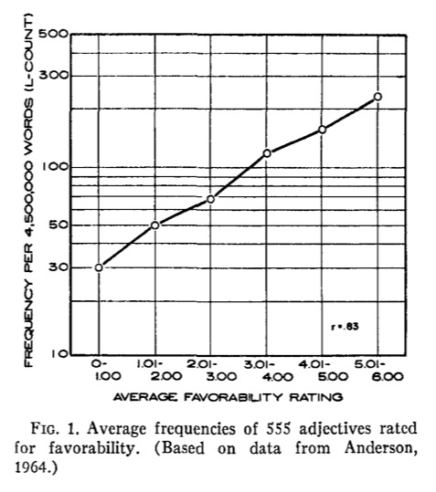
```

::: {.smaller_75}
Ratings were influenced by word frequency (how often words appear in the language) 
:::

:::
::::

# Preference ratings and frequency

```{r, out.width="50%"}
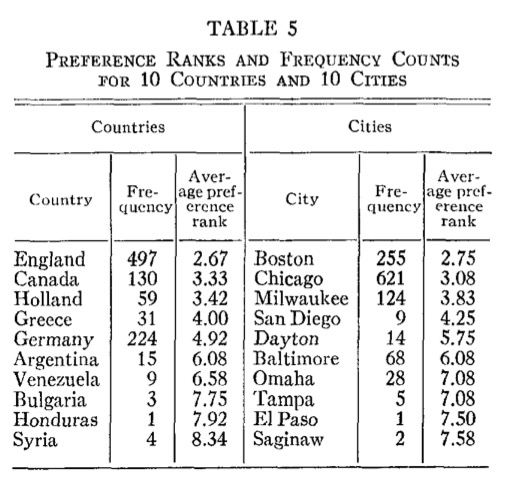
```

# Preference ratings and frequency

```{r, out.width="80%"}
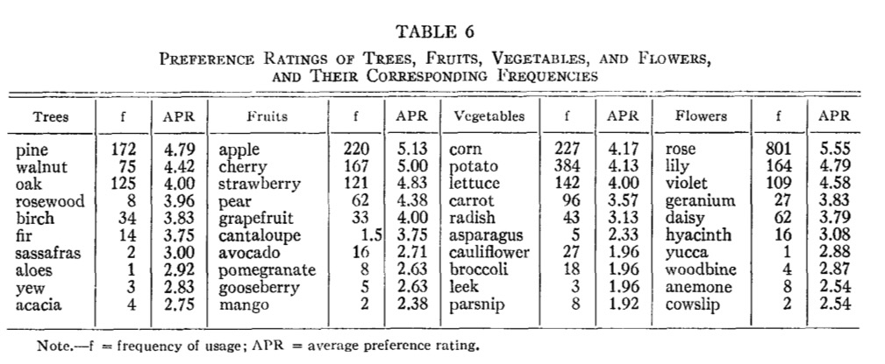
```

# Experimental Evidence

:::: {.row}
::: {.col-md-6}

>- Johnson, Thomson, & Frincke (1960)

::: {.smaller_50}
>- **phase 1**: participants rate pleasantness of nonsense words
>- **phase 2**: pronounce nonwords 1, 2, 5, or 10 times
>- **phase 3**: Re-rate pleasantness of nonsense words
:::

:::

::: {.col-md-6}

```{r}
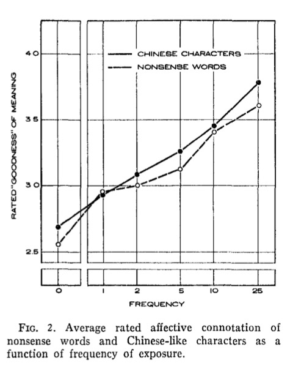
```

>- scroll down for additional results

:::
::::

## more results

```{r}
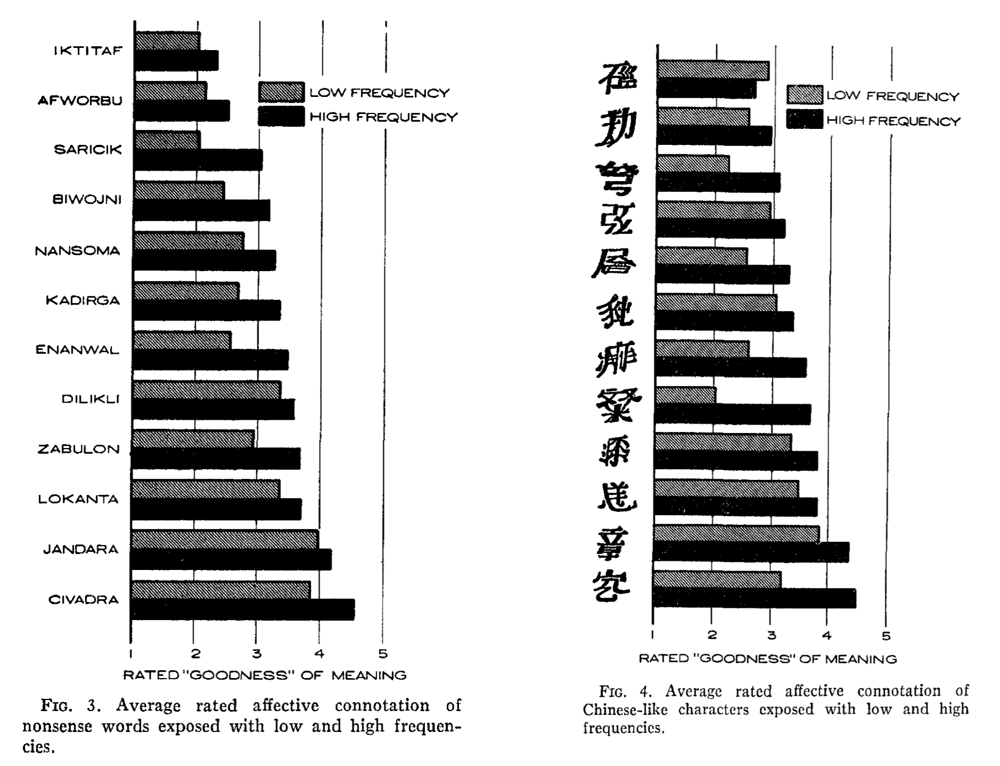
```

# Mere exposure and pictures

```{r}
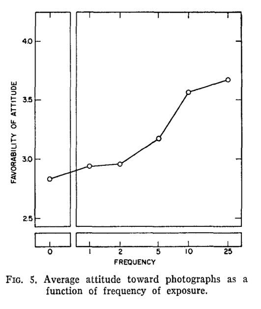
```

# Mere exposure and pictures

```{r}
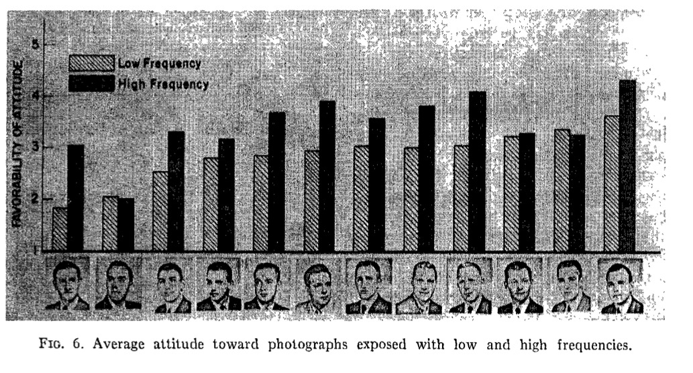
```

# Preference without recognition

```{r}
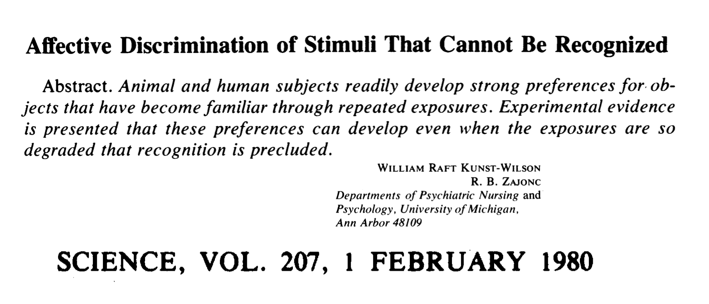
```

## Questions

>- Can the mere-exposure effect occur even for "subliminal" stimuli?
>- If people can't recognize the repeated stimuli, will they still show a preference for them?

## Method

:::: {.row}
::: {.col-md-6}

>- **Phase 1**: Participants viewed a RSVP sequence geometric shapes
>- **Phase 2**:
>- *Recognition test*: Which stimulus was shown before?
>- *Preference test*: Which stimulus do you prefer?

:::

::: {.col-md-6}

```{r, out.width="100%"}
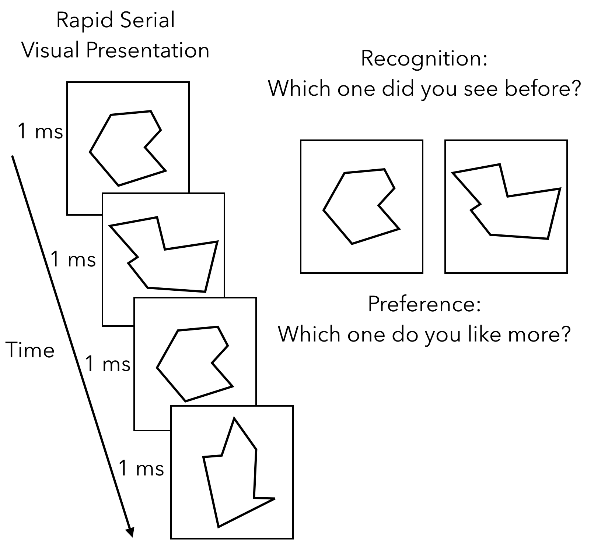
```

:::
::::

## Results

:::: {.row}
::: {.col-md-6}

>- Recognition performance is at chance

>- People prefer the repeated item above chance 

:::

::: {.col-md-6}

```{r}
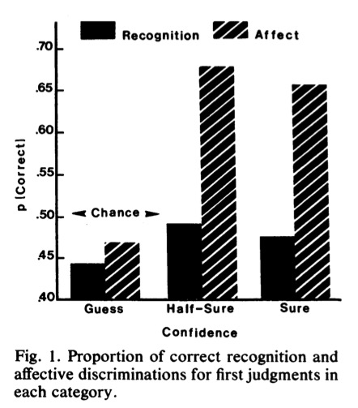
```

:::
::::

# Timecourse of mere-exposure

```{r}
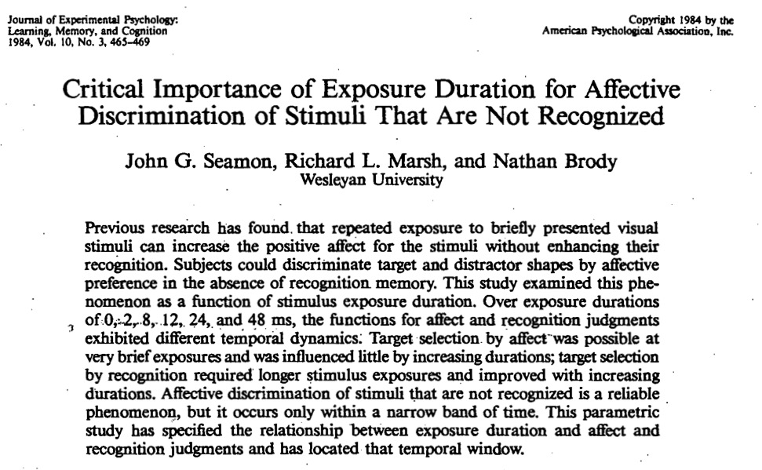
```

## Results

```{r}
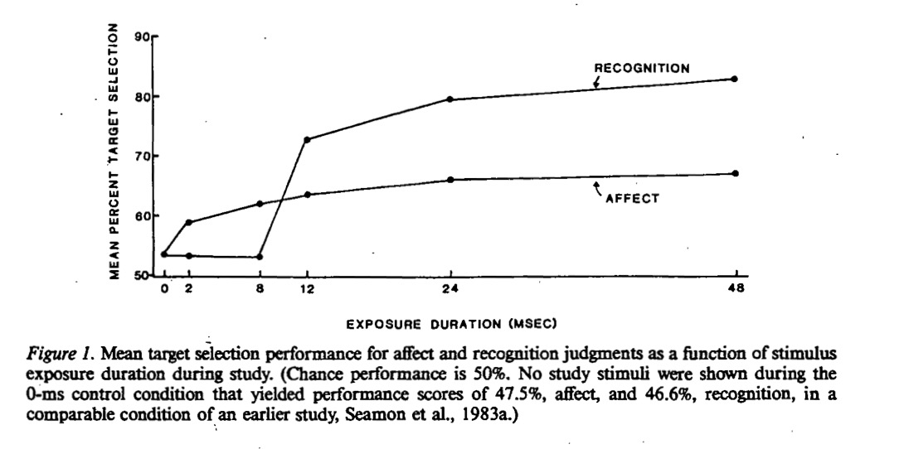
```

# Explanations?

>- We have reviewed some evidence that the mere-exposure effect occurs

>- What does this tell us about cognition?

>- What cognitive processes give rise to the mere-exposure effect?

#  Roadmap

::: {.grey_box} 
1 Implicit vs Explicit
:::
::: {.grey_box} 
2 Mere exposure effect
:::
::: {.pop_box_2} 
3 Testing Explanations
:::

# Explanations?

>- We have reviewed some evidence that the mere-exposure effect occurs

>- What does this tell us about cognition?

>- What cognitive processes give rise to the mere-exposure effect?

# Processing debates

Researchers have proposed multiple theories to explain the mere-exposure effect

>- We will evaluate some of them

>- They are all tentative working hypotheses

>- Ideally, the theory should be clear enough to make predictions that can be evaluated and measured.

# Zajonc's two system account

:::: {.row}
::: {.col-md-6}

>- Proposes two memory systems: regular and emotional

>- Argues against the cognitive stage model (on right)

>- The "emotion memory" system is very fast, and quickly extracts emotional information


:::

::: {.col-md-6}


```{r}
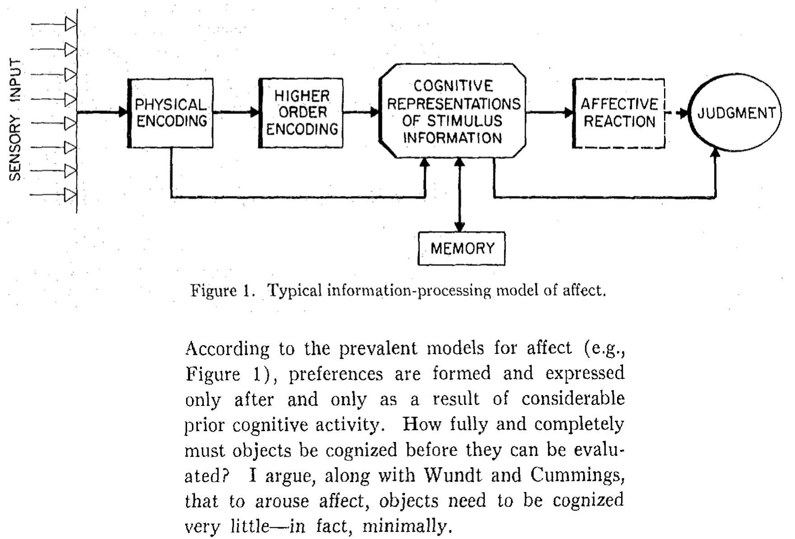
```

::: {.smaller_50}
Zajonc, R. B. (1980). Feeling and thinking: Preferences need no inferences. American psychologist, 35(2), 151.
Chicago	
:::

:::
::::

# Explaining results

>- How does Zajonc's two-system idea explain the pattern of results showing chance recognition performance, but above change preference for briefly presented shapes?

# Familiarity vs. recollection

A different two-system account. 

>- Mere-exposure might reflect familiarity-based processing

:::: {.row}
::: {.col-md-6}

**Familiarity-based**

>- Relies on implicit knowledge
>- Gut-feelings
>- Feelings of fluency

:::

::: {.col-md-6}

**Recollection-based**

>- Relies on explicit memories
>- People can declare, the who, what, when, and where of memories

:::
::::

# Fluency heuristic

>- Some cognitive operations are experienced as easier or more fluent than others

>- People's feeling of familiarity can be influence by [processing fluency](https://en.wikipedia.org/wiki/Processing_fluency)

>- E.g., you might think you saw a word before because it is easy to read, and not because you saw it before

# Is preference just familiarity?

```{r}
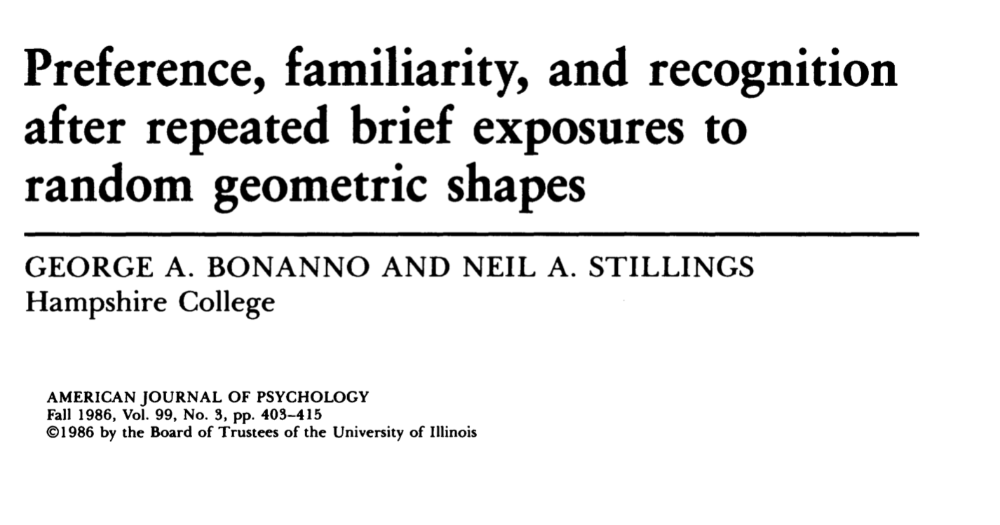
```

## Preference, Familiarity, and Recognition

>- Method: People were shown geometric shapes very rapidly (just like previous study)

>- Preference task: Which shape do you prefer?

>- Recognition task: Which shape did you see before?

>- Familiarity: Which shape feels more familiar?

## Results

```{r}
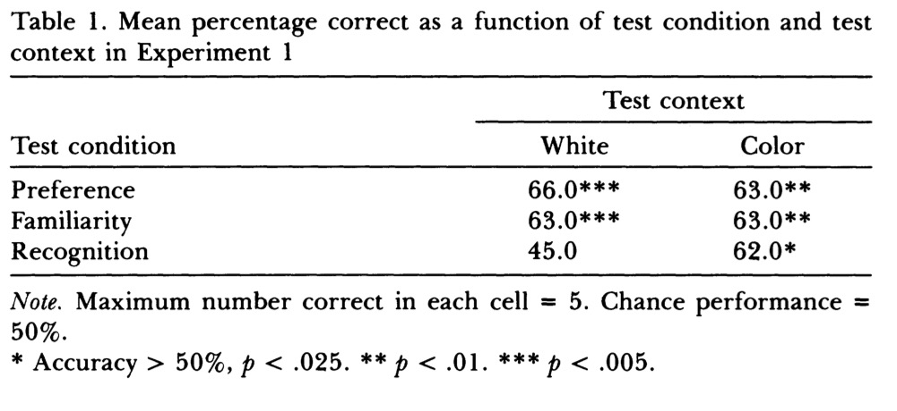
```

## Inference

>- Stimuli are presented too briefly to support recollection
>- Repeated items are "easier" to process
>- The processing fluency associated with the repeated items is mistaken for a feeling of familiarity
>- People have limited familiarity-based access to the briefly presented information

# A Puzzle?

:::: {.row}
::: {.col-md-4}

>- Why don't people use their feeling of familiarity when they are asked to recognize which item they saw?

:::

::: {.col-md-8}
```{r}
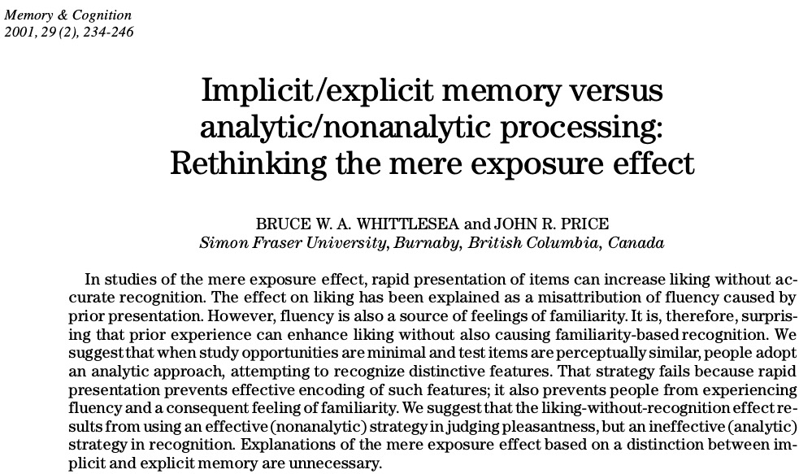
```
:::
::::

## Quote 1

```{r}
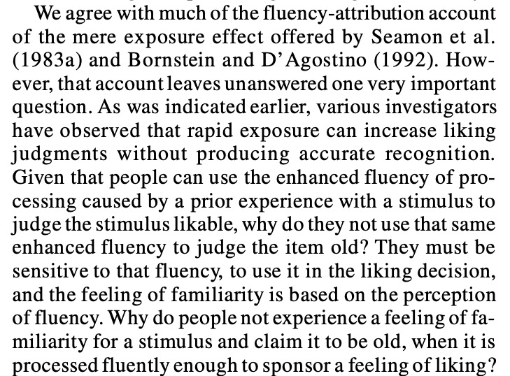
```


## Quote 2

```{r}
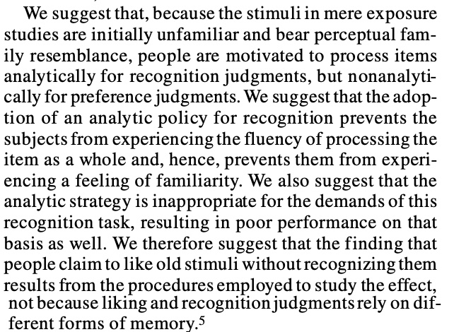
```

## Experiment 1

:::: {.row}
::: {.col-md-6}


```{r, out.width="100%"}
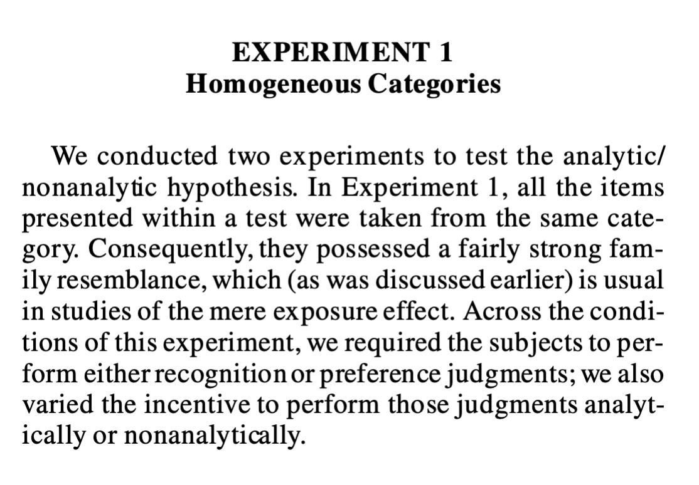
```

:::

::: {.col-md-6}

```{r, out.width="100%"}
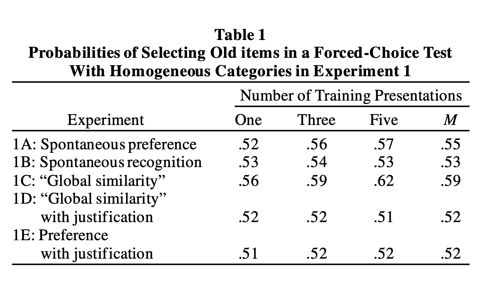
```


:::
::::

## Inferences

>- Analytic mode can cause people to change how they use and evaluate sources of fluency
>- Recognition task demands can prompt people to go into "analytic mode", and search for "evidence" they saw the stimulus
>- Preference judgment tasks encourage people to use "non-analytic mode" and rely on general feelings

>- Mere-exposure effects do not require different kinds of memory systems
>- Results reflect how task demands encourage people to rely on different sources of evidence while making decisions


# What's next

Take the quiz and complete any additional assignments

Next week is midterm 2


