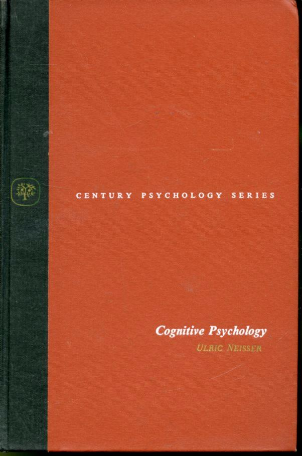
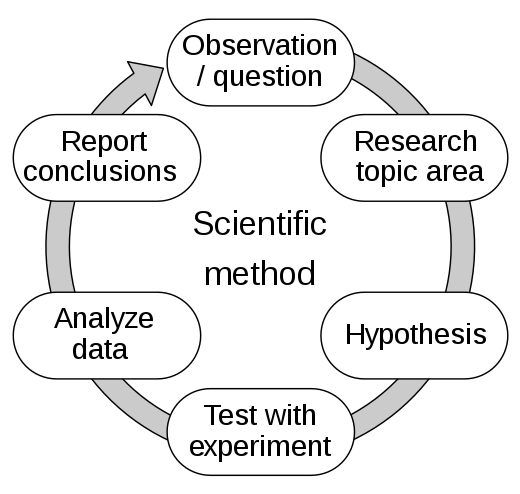
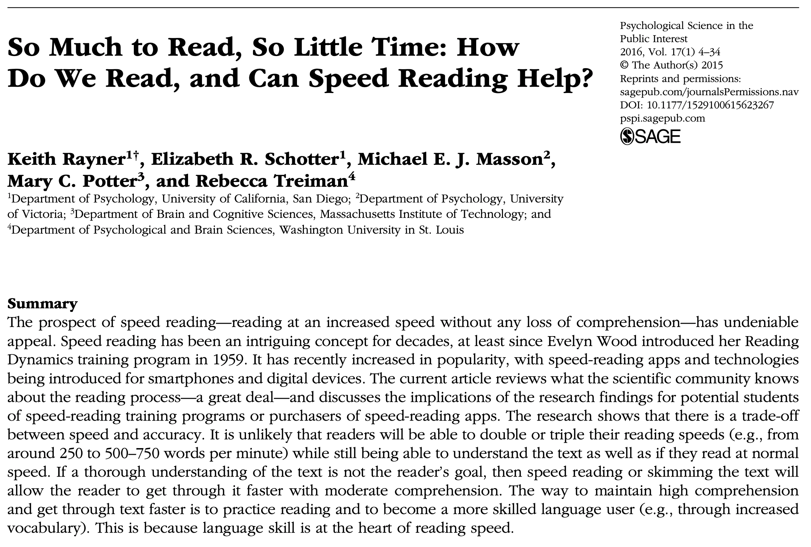
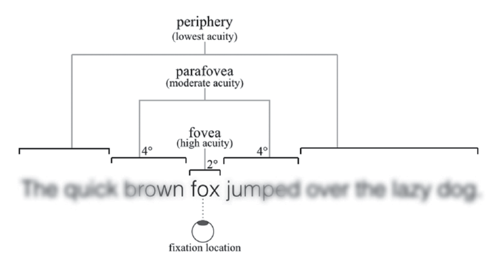
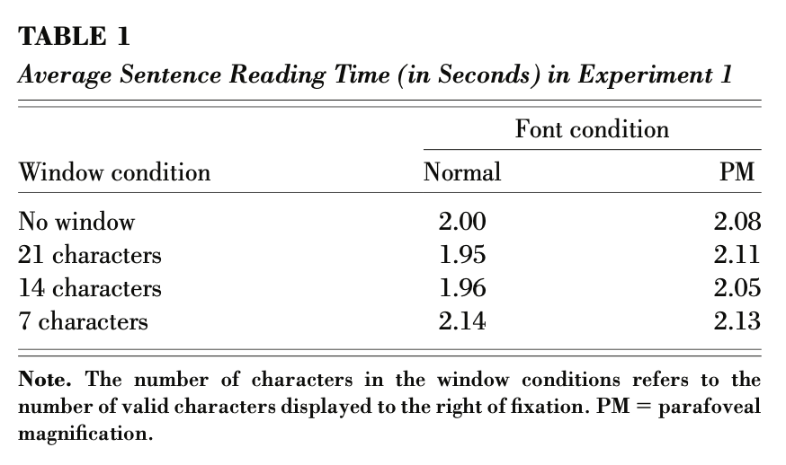

```{r setup, include=FALSE}
knitr::opts_chunk$set(echo = FALSE,
                      fig.align = "center",
                      out.width = "80%")
library(fontawesome)
```

# Reminders

This is the slide deck for Learning Module 1: What is cognition?

The reading is from chapter 1 [What is cognition?](https://www.crumplab.com/cognition/textbook/what-is-cognition.html)

#  Roadmap

::: {.smaller_75}

::: {.pop_box_2} 
1 Questions of Cognition
:::
::: {.grey_box} 
2 Methods
:::
::: {.grey_box} 
3 Findings
:::
::: {.grey_box} 
4 Explanations
:::
::: {.grey_box} 
5 Applications
:::
::: {.grey_box} 
6 Implications
:::
:::

# Instances of Cognition

```{r, out.width="60%"}
knitr::include_graphics("imgs/Cover_art.jpg")
```

# Museum Metaphor

:::: {.row}
::: {.col-md-6}

- Like a museum has many rooms and artifacts, there are a great diversity of ideas, approaches in cognition.

- Museum's are too big to see all in one day, or even a semester, just like cognition

:::

::: {.col-md-6}

```{r, out.width="100%"}
knitr::include_graphics("imgs/Met.jpg")
```


:::
::::

# Tour guide of cognition

```{r, out.width="70%"}
knitr::include_graphics("imgs/the-met_fifth-avenue-map_020516_floor1.jpg")
```

# Questions of Cognition

1. What is cognition?
2. What questions are researchers asking and answering in cognition

# Defining Cognition

:::: {.row}
::: {.col-md-6}

Ulric Neisser defined cognition in 1967 as:

> "...all processes by which the sensory input is transformed, reduced, elaborated, stored, recovered, and used."

This definition is still current, but we will expand on it in this course

:::

::: {.col-md-6}

```{r, out.width="75%"}

```


:::
::::

# Prospects of Cognition

Neisser is also quoted as saying:

> "If X is an interesting or socially important aspect of memory, then psychologists have hardly ever studied X"

Cognition is partly an unfulfilled promise...Lot's of work has been done, there are many more interesting questions to ask...

# Research Questions

Research questions are typically about **how** some cognitive ability works. For example:

1. How do you control body movements, from finger movements to facial expressions? 
2. How do you pay attention or ignore others?
3. How did you forget what you were doing while you were in the middle of doing something? 
4. How can you train your brain to get better at something? 
5. How do you learn to read, and know the meaning of words? How can you read faster?
6. and many more...


# Research Domains

Research questions are often grouped into domains of specialization. Some of the textbook chapters are grouped by domain. Some general domains in cognition include:

> Learning, Memory, Attention, Perception, Reasoning, Categorization, Concept formation, Judgment and decision-making, Language, Semantic knowledge, Skill-acquisition, Music perception, Motor control, Cognitive control, Creativity, Emotion, Object Recognition, Pattern Recognition, Implicit learning, Working Memory, Individual Differences, Consciousness, Mental Imagery, Planning, Statistical Learning...

# Answering research questions?

How do cognitive researchers figure out *how* cognitive abilities work?

```{r, out.width="50%"}
knitr::include_graphics("imgs/questions.jpg")
```


#  Roadmap

::: {.smaller_75}
::: {.grey_box} 
1 Questions of Cognition
:::
::: {.pop_box_2} 
2 Methods
:::
::: {.grey_box} 
3 Findings
:::
::: {.grey_box} 
4 Explanations
:::
::: {.grey_box} 
5 Applications
:::
::: {.grey_box} 
6 Implications
:::
:::

# The research cycle

:::: {.row}
::: {.col-md-6}

The research cycle involves a wide variety of methods--*such as the scientific method*--that researchers use to generate knowledge about cognition.

:::

::: {.col-md-6}

```{r, out.width="75%"}

```


:::
::::

- Let's overview the research cycle with an example from cognitive research on **reading**

# Observation/Question

**QUESTIONS**: How can a person read faster? Are there tricks? Does speed-reading work?

```{r, out.width="70%", fig.align="center"}
knitr::include_graphics("imgs/johnny-johnny5.gif")
```

# Research Topic Area

The background research stage involves finding and reading previous work on your topic:

- Search for papers using [Google Scholar](https://www.scholar.google.com)
- Use the BC library search tool
- Collect and read the papers...
- check out [Zotero](https://www.zotero.org) to help you manage pdfs

# A quick search

Let's search [Google Scholar](https://www.scholar.google.com) for "how to read faster and see what happens"

# Finding the good stuff

Try out different search terms to find prior research that could be highly relevant

- let's search "does speed reading work?"

# Rayner et al. 2016

```{r}

```

# Reading the review

The Rayner et al. (2016) paper provides a very in-depth review of the prior literature on how people read.

- If you wanted to come up with a new hypothesis to test, it would be worth learning what other people already did.

- Let's look at an example of a how a **testable hypothesis** about reading was developed from prior observations

# Prior observation

When reading, your vision is most clear in the middle (where you are foveating), and gets more blurry moving into the periphery. 

```{r, out.width="75%"}

```

(figure from Rayner et al, 2016)

# Hypothesis

It is easy to see words you are looking at, but harder to see other words in the sentence because peripheral vision is blurry

**Hypothesis**: Reading speed depends on visual acuity of peripheral vision

**Inference**: Reading speed should be improved if people could see words in the periphery more clearly

# Experiment

The purpose of an experiment is to create a controlled situation to test the hypothesis.

**Independent variable (IV)**: A manipulation (at least two conditions)

**Dependent variable (DV)**: A measurement, taken under each condition of the manipulation

**Empirical question**: Does the manipulation cause differences in the measurement?

# What manipulation?

What kind of manipulation could improve peripheral vision?

:::: {.row}
::: {.col-md-6}

::: {.pop_box_2}
Control Condition
:::

**IV**: Normal text and reading conditions

---

**DV:** Measure reading ability

:::

::: {.col-md-6}

::: {.pop_box_3}
Experimental condition
:::

**IV:** Change something to improve peripheral vision

---

**DV:** Measure reading ability

:::
::::

# Example manipulation

[Miellet, O'Donnell, and Sereno](https://journals.sagepub.com/doi/10.1111/j.1467-9280.2009.02364.x) (2009) used a parafoveal Magnification manipulation

:::: {.row}
::: {.col-md-6}

::: {.pop_box_2}
Control
:::

**IV**: He could never get rid of the image from his mind

:::

::: {.col-md-6}

::: {.pop_box_3}
Parafoveal Magnification
:::

```{r}
knitr::include_graphics("imgs/Parafoveal.png")
```


:::
::::

# Empirical Question

**Empirical Question:** Will parafoveal magnification change reading ability compared to the control condition?

:::: {.row}
::: {.col-md-6}

::: {.pop_box_2}
Control
:::

**IV**: He could never get rid of the image from his mind

---

**DV:** Measure reading ability

:::

::: {.col-md-6}

::: {.pop_box_3}
Parafoveal Magnification
:::
```{r}
knitr::include_graphics("imgs/Parafoveal.png")
```

---

**DV:** Measure reading ability

:::
::::

# How do we measure reading ability? {.center .middle}

# Reading ability measures

There are many ways to measure aspects of reading

1. Words per minute
2. Memory test: can you remember which words you read
3. Comprehension test: did you understand what you read?
4. Perceptual span: how many letters/words can you see at once

# Measures aren't always perfect

1. A person could "read" really fast (high words per minute), but comprehend nothing of what they read...
    - so what is WPM really measuring?

2. A person could pass a comprehension test without reading based on general knowledge...
    - so what is a comprehension test really measuring?
    
# Measurement creativity

- One ongoing challenge in cognition is to create measures that can be informative about how cognitive abilities work.

- We will see many different kinds of measurements across the course

# So what happened with the reading experiment? {.center .middle}

#  Roadmap

::: {.smaller_75}
::: {.grey_box} 
1 Questions of Cognition
:::
::: {.grey_box} 
2 Methods
:::
::: {.pop_box_2} 
3 Findings
:::
::: {.grey_box} 
4 Explanations
:::
::: {.grey_box} 
5 Applications
:::
::: {.grey_box} 
6 Implications
:::
:::

# Experimental Results

- The research cycle in cognition produces **findings**.

- In an experimental design, findings refer to whether or not the measurement was influenced by the manipulation.

- For example, did the parafoveal magnification technique change reading ability?

# Null results


:::: {.row}
::: {.col-md-6}

Miellet et al. (2009) measured **average sentence reading time**.

They found **null results**. 

The parafoveal magnification (PM) manipulation **did not** change reading time

:::

::: {.col-md-6}

```{r, out.width ="100%"}

```

:::
::::

# Interpreting Data


:::: {.row}
::: {.col-md-6}

Miellet et al. summarized their results in a table.

A general skill for this course is to gain experience interpreting data from experiments 

Data can presented in many different formats, usually tables and graphs

:::

::: {.col-md-6}

```{r, out.width ="100%"}

```

:::
::::

# Drawing Inferences

After results are collected and summarized, a next step is to draw inferences about the hypothesis, and generate more questions.


:::: {.row}
::: {.col-md-6}

::: {.pop_box_2}
Inference
:::

Making peripheral words bigger does not improve reading speed

:::

::: {.col-md-6}

::: {.pop_box_3}
Questions
:::

- Why didn't it work?
    - Make the words even bigger?
- What does this say about how reading works?
- How does reading work?

:::
::::

#  Roadmap

::: {.smaller_75}
::: {.grey_box} 
1 Questions of Cognition
:::
::: {.grey_box} 
2 Methods
:::
::: {.grey_box} 
3 Findings
:::
::: {.pop_box_2} 
4 Explanations
:::
::: {.grey_box} 
5 Applications
:::
::: {.grey_box} 
6 Implications
:::
:::

# Explanations in Cognition

There are many different approaches to explanation in cognition

We will spend the rest of the semester learning about ways that cognitive phenomena are "explained"

# Levels of Analysis

Explanations can take place at different levels

Vision scientist David Marr describes three levels of analysis:

1. Computational
2. Representational/Algorithmic
3. Hardware

# Computational Level

The computational level refers to the **goal** of the process

For example, what are the goals of reading processes?

# Representational level

The representational/algorithmic level refers to the:

1. inputs to a process, 
2. the transformations that modify the inputs (algorithm), and 3. the outputs of the process.

For example, what kind of perceptual information is received for reading purposes, and how perception transformed into semantic knowledge?

# Hardware level

The hardware level refers to how the representations and algorithms are physically instantiated

For example, what are the brain mechanisms of reading and how do they work?

# Explaining reading

Reading is a very interesting and complicated cognitive ability

What would an explanation of reading look like?

What would you want the explanation to be able to do?

# Common answers

A generic answer in cognition to the preceding questions might be:

A theory or explanation of reading should be able to:

 - account for all experimental findings in the reading literature
 - predict the results of new experiments
 - inspire new lines of research
 - generate applications


#  Roadmap

::: {.smaller_75}
::: {.grey_box} 
1 Questions of Cognition
:::
::: {.grey_box} 
2 Methods
:::
::: {.grey_box} 
3 Findings
:::
::: {.grey_box} 
4 Explanations
:::
::: {.pop_box_2} 
5 Applications
:::
::: {.grey_box} 
6 Implications
:::
:::

# Applied Cognition

The research cycle generates more research, and sometimes it also generates real-world **applications**.

Across the semester we will encounter many applications of cognitive research.

# Speed-reading technology?

Not all applications are made equal.

There are many speed-reading methods that claim to improve reading speed.

Unfortunately, according to Rayner et al. (2016), reading research has not shown these methods to be effective

# Sprintreader.com

<http://www.sprintreader.com> is an example of an applied technology that could potentially help people read faster

It uses RSVP (rapid-serial visual presentation)

But..see [Benedetto et al.](https://www.sciencedirect.com/science/article/abs/pii/S0747563214007663) (2015)


#  Roadmap

::: {.smaller_75}
::: {.grey_box} 
1 Questions of Cognition
:::
::: {.grey_box} 
2 Methods
:::
::: {.grey_box} 
3 Findings
:::
::: {.grey_box} 
4 Explanations
:::
::: {.grey_box} 
5 Applications
:::
::: {.pop_box_2} 
6 Implications
:::
:::

# Implications of Cognitive research

- Cognition is connected to many topics in our daily life.

- Cognitive research has the potential to help us understand ourselves, our society, and other cognitive creatures (animals, and even machines)

- Applied cognitive research could help repair cognitive impairments, improve everyday cognition, and lead to useful smart technologies.

# Socio-Historical implications

Psychological and cognitive research has already had implications for society over the last 150 years.

The history shows inequalities in the social benefits and costs of research applications.

We will discuss some of this history across the semester.

# Questions to keep in mind

:::: {.row}
::: {.col-md-6}

::: {.smaller_50}

What are the goals of the cognitive sciences and research in cognitive psychology? 

Who has been involved in setting those goals? 

Are the goals useful?

What kind of questions about cognition have already been asked by researchers? 

What were the scientific as well as social-historical reasons for why those researchers asked those questions? 

What answers were found, and how were they informative or not informative about how cognition works? 

How do the measurements and tools that researchers use to ask questions influence the kind of picture they build about how cognition works? 


:::

:::

::: {.col-md-6}

::: {.smaller_50}

What kinds of questions about cognition are not being asked that should be asked? 

Why are they not being asked? 

What benefits to society have been produced by the cognitive sciences? 

Have the benefits been spread equitably across different groups of people? 

What costs to society have been produced by the cognitive sciences? 

How are the costs shared by society? 

Are there injustices resulting from cognitive science research? 

Have they been adequately addressed? 

How should society decide whether or not to proceed with different kinds of research?

:::

:::
::::


# What's next?

Complete the quiz and/or assignments for this module by the suggested due date.

Then, move on to the next module once it becomes available on Blackboard.


