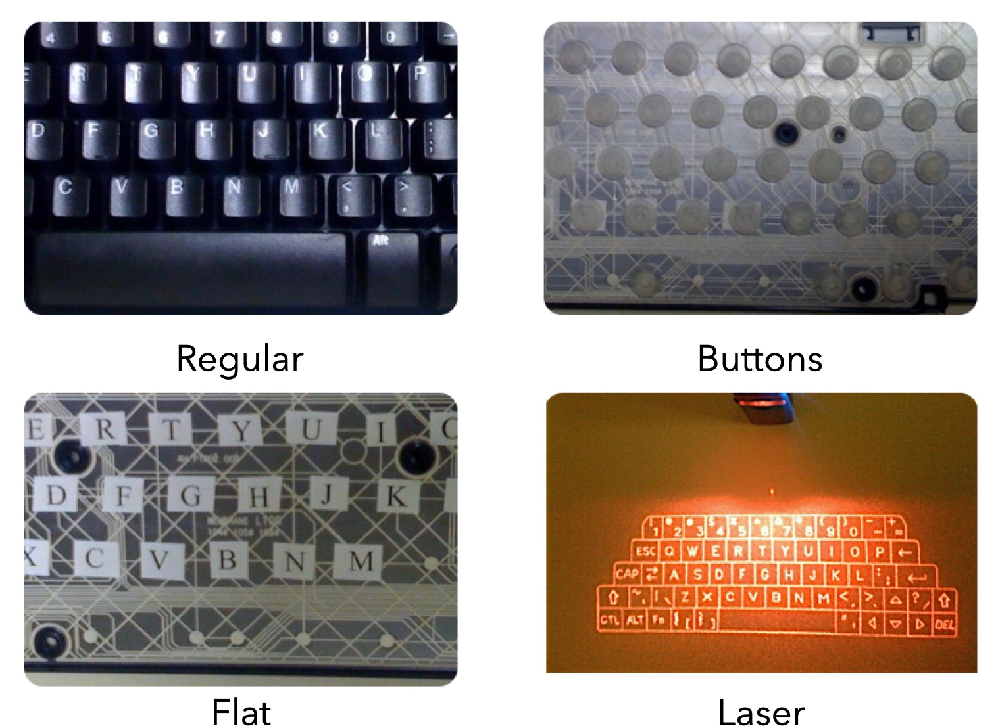
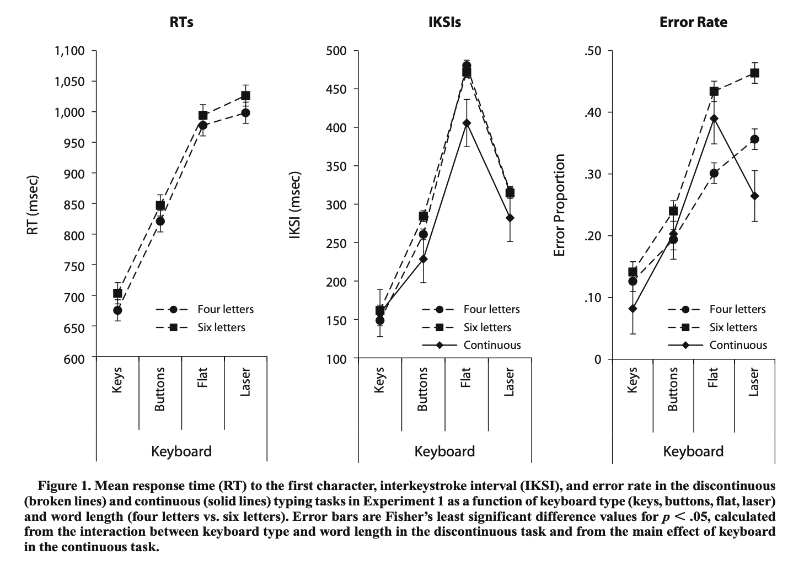

```{r setup, include=FALSE}
knitr::opts_chunk$set(echo = FALSE,
                      fig.align = "center",
                      out.width = "80%")
library(fontawesome)
```

## Reminders

The reading for this slide deck is from chapter 1, from the section on [reading primary research articles](https://www.crumplab.com/cognition/textbook/what-is-cognition.html#reading-primary-research-articles).

##  Reading Primary Research

### 1. Reading Primary Research {.bolder}
### 2. QALMRI {.greyout}

## Breadth vs. Depth

:::: {.row}
::: {.col-md-6}

Textbook gives a bird's eye view of cognition

:::

::: {.col-md-6}

Research articles focus on many important details

:::
::::

## Course Learning Goal

An important learning goal for this course is to give you skills to help you read and interpret primary research articles in psychology.

## How to read journal articles?

##  QALMRI

### 1. Reading Primary Research {.greyout}
### 2. QALMRI {.bolder}

## QALMRI

:::: {.row}
::: {.col-md-6}

QALMRI is an acronym and method for identifying and understanding major components of primary research articles

:::

::: {.col-md-6}


Question

Alternatives

Logic

Methods

Results

Inference

:::
::::


## Example paper

To use QALMRI, we need a paper to read

- Crump, M. J. C., & Logan, G. D. (2010). Warning: This keyboard will deconstruct—The role of the keyboard in skilled typewriting. Psychonomic Bulletin & Review, 17(3), 394–399. https://doi.org/10/d9jmzm

- [Download pdf here](https://link.springer.com/article/10.3758%2FPBR.17.3.394)

## Let's check out the paper


```{r, out.width = "50%"}
knitr::include_graphics("imgs/typing.gif")
```

## Question

Research begins with a question, and the point of research is to answer the question

There are usually at least 2 levels: **big question** and the **specific questions**

Big questions usually take many experiments to answer, small questions are usually the focus of the present research

## Question example

**Big Questions**: How do people control their own body movements? How do people learn to type without thinking about what their fingers are doing?

**Specific Question**: How does tactile feedback from the keyboard influence typing performance?

## Alternatives

Experiments commonly consider at least two alternative hypotheses that about the specific question and explain why they are plausible

When reading a paper or proposing an experiment, attempt to identify the alternatives discussed by authors

## First Alternative Example

- People have an internal cognitive map of the keyboard. The cognitive map represents the location of the keys on a computer, and typists use the internal "mind" map to direct their fingers to appropriate locations while typing.

- Implication: Cognitive map can plan finger movements without need for feedback from fingers

## Second Alternative Example

- People learn associations between the finger movements required for each keystroke and the feel of the keys (tactile, haptic, and proprioceptive feedback). 

- Implication: Feeling the keyboard is important for typing skill, especially for typists who learned to type on keyboards with keys.

## Logic

The logic identifies how the experiment design will allow the experimenter to distinguish between the alternatives

IF alternative 1 (and not 2) is correct, THEN when a particular variable is manipulated, participants behavior should change in a certain way.

There should be separate logic statements for each alternative

## Logic examples

:::: {.row}
::: {.col-md-6}

A1: IF typists use an internal cognitive map that does not require feedback from the keyboard to guide their fingers, THEN typing performance should not be influenced by manipulations that remove tactile feedback, such as typing on keys vs a flat surface.


:::

::: {.col-md-6}

A2: IF typists use feedback from the keyboard to guide their fingers, THEN typing performance should be influenced by manipulations that remove tactile feedback, such as typing on keys vs a flat surface.

:::
::::


## Methods

Identifies the procedures that will be used to implement the logical design

Should state independent variable (what is manipulated) and dependent variable (what is measured)

Describes subjects, how they were divided into groups, materials, stimuli, etc.

## Example Methods

Typists speed and accuracy (DV) were measured on four different keyboards (IV), that systematically removed tactile keyboard.

```{r}

```

## Results

Identifies the outcome or findings from the experiment

Did different groups produce different means? What were they? What was the pattern of results? Were the results reliable?

Graphs, tables, statistics used to show data

## Example Results

Typists were fastest and most accurate on a regular keyboard, and always slower and less accurate on the keyboards with less tactile feedback.

```{r}

```

## Inferences

What can the results of the experiment tells us about the alternatives?

Well designed studies may be able to eliminate one of the alternative hypotheses

## Inferences Example

- Alternative Hypothesis: the internal keyboard map idea suggested that manipulations to the feeling of the keyboard should not influence typing performance. 

- Result: reducing tactile feedback from the keyboard caused slower and more error prone typing.

- Inference: typists do not rely upon an internal map of the keyboard.

## Inferences continued

Any potential problems with the experiment that could have explained the results? Any confounds?

Problems during data collection?

What is the hypothetical next step, if you were to conduct a follow-up, what would it be? 

What next specific question remains unanswered?

What new questions do your results raise?

## QALMRI Summary

**Question**: What was the broad and specific question?

**Alternatives**: What are possible answers, why are they plausible?

**Logic**: If hypothesis 1 was true, what was the predicted outcome? If hypothesis 2 was true, what was the predicted outcome?

**Methods**: What was the experimental design? 

**Result**:What was the pattern of data?

**Inference**: What can be concluded about the hypotheses based on the data?

## What's next?

Continue the readings or watching the mini lectures for this learning module. If you are finished, then complete the assignments for the first module posted on blackboard before the posted due date.


