```{r setup, include=FALSE}
knitr::opts_chunk$set(echo = FALSE,
                      fig.align = "center",
                      out.width = "80%")
library(fontawesome)
```

## Reminders

Read chapter 3 [Eugenics and Psychology](https://www.crumplab.com/cognition/textbook/eugenics-and-psychology.html) from the textbook.

##  Roadmap

### 1. Eugenics Overview {.bolder}
### 2. Galton's Eugenics {.greyout}
### 3. The Eugenics movement {.greyout}
### 4. Influences on society {.greyout}
### 5. Psychology and Eugenics {.greyout}

## "Improving" society

History is full of problematic efforts to "improve" society

- Problems include inequality and injustices

- Not all groups benefit equally from the improvements

- Oppressed groups have been targets of human rights violations in the name of improvement

## Scientific Pollyannaism

:::: {.row}
::: {.col-md-6}

Psychology considers itself a progressive science, but also has a long history of promoting problematic ways to improve society

> Chapter 4 Eugenic Scientific Utopias Filled with Socially Engineered Happy Productive People

[Get a copy from BC Library](https://cuny-bc.primo.exlibrisgroup.com/permalink/01CUNY_BC/ljnr3v/cdi_askewsholts_vlebooks_9783030159825)

:::

::: {.col-md-6}

```{r, out.width ="100%"}
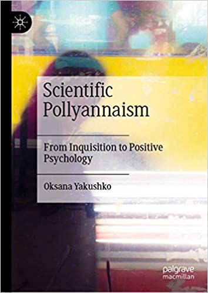
```

:::
::::


## What is/was eugenics?

1. Began as an idea to "improve" society over generational time by breeding humans like other animals
2. Developed into an ideology of socio-cultural purity/supremacy and scientific racism 
3. A highly organized, widespread, and well-accepted worldwide movement
4. A system of oppression that led to many human rights violations and atrocities

## Why are we talking about eugenics?

1. The methods, research questions, and motivations of many early psychologists, including those interested in cognitive abilities were tied up in the eugenics movement
2. Eugenics provides an example of how cognitive and psychological research in general can have long-term negative implications for society

##  Galton's Eugenics

### 1. Eugenics Overview {.greyout}
### 2. Galton's Eugenics {.bolder}
### 3. The Eugenics movement {.greyout}
### 4. Influences on society {.greyout}
### 5. Psychology and Eugenics {.greyout}

## Back to Galton

In 1880, why was Galton so interested in mental imagery?

A quote from his paper:

> The larger object of my inquiry is to elicit facts that shall define the natural varieties of mental disposition in the two sexes and in different races, and afford trustworthy data as to the relative frequency with which different faculties are inherited in different degrees.

## {.nocolor}

```{r}
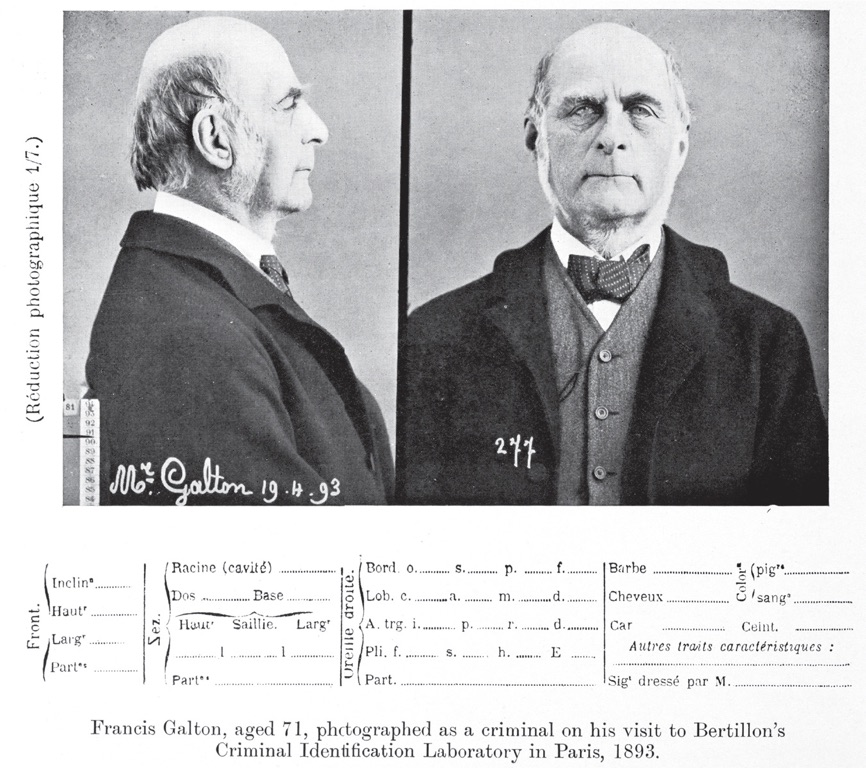
```


## Sir Francis Galton

- An English Victorian era statistician, polymath, sociologist, **psychologist**, anthropologist, **eugenicist**, tropical explorer, geographer, inventor, meteorologist, proto-geneticist, and psychometrician. He was knighted in 1909. (from wikipedia)
- cousin of Charles Darwin
- Proposes Eugenics in: Hereditary talent and character (1865), Hereditary Genius (1869)

## Hereditary talent and character (1865)


:::: {.row}
::: {.col-md-6}

Galton suggests that people could be selectively bred to improve the "stock" of the human race

Focused on the "highest, noble" traits of "civilized" mankind, such as intellect and general intelligence

:::

::: {.col-md-6}

```{r, out.width ="100%"}
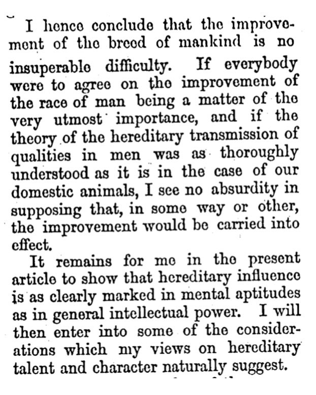
```

:::
::::

## Geneological research

Galton studied genealogies of "Englishmen of distinction" to conclude they had inherited superior traits

```{r, out.width="70%"}
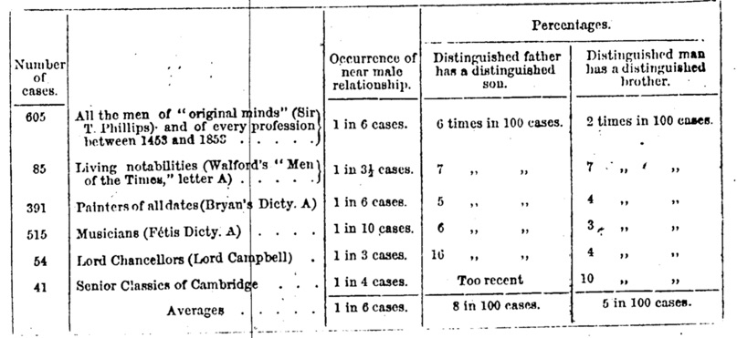
```


## "Civilization" vs. "Barbarians"

- Galton contrasted the "great men of civilized countries" with the "barbarians" and "savages" of "uncivilized countries"

- E.g., American Indians are naturally cold, melancholic, patient and taciturn...contain the minimum of affectionate and social qualities compatible with the continuance of their race

- Invoked fears about "the extent to which moral monstrosities can be bred"

- Advocated that Eugenics become accepted as a worldwide modern religion so that a holy war could be declared against the unfit

##  The Eugenics movement

### 1. Eugenics Overview {.greyout}
### 2. Galton's Eugenics {.greyout}
### 3. The Eugenics movement {.bolder}
### 4. Influences on society {.greyout}
### 5. Psychology and Eugenics {.greyout}


## A timeline of Eugenics

<https://eugenicsarchive.ca/discover/timeline>

```{r, out.width="70%"}
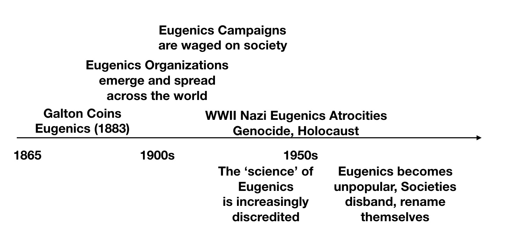
```

## The spread of eugenics

```{r}
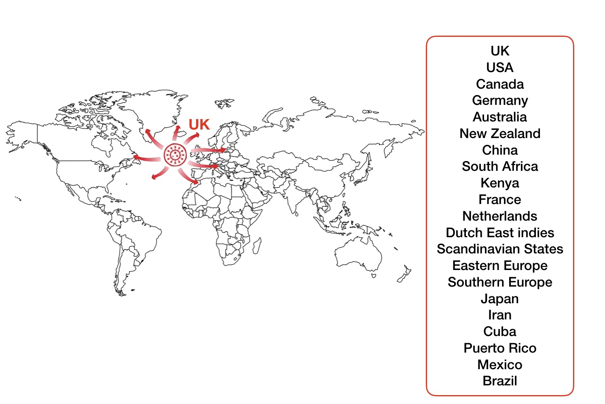
```

## Suggested Reading

:::: {.row}
::: {.col-md-6}

Excellent overview of the formation, development, and nuances of Eugenics movements in many different countries

[Available for download from the BC library](https://cuny-bc.primo.exlibrisgroup.com/permalink/01CUNY_BC/ljnr3v/cdi_askewsholts_vlebooks_9781137286123)

:::

::: {.col-md-6}

```{r, out.width ="70%"}
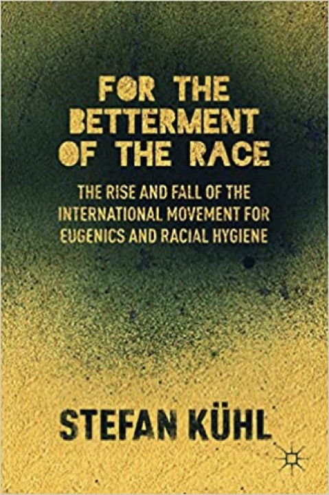
```

:::
::::

## Oxford handbook of Eugenics

:::: {.row}
::: {.col-md-6}

Part I explores national/colonial themes:

Eugenics in Britain: The View from the Metropole

South Asia's Eugenic Past

Eugenics in Australia and New Zealand: Laboratories of Racial Science

Eugenics in China and Hong Kong: Nationalism and Colonialism, 1890s–1940s

South Africa: Paradoxes in the Place of Race

Eugenics in Colonial Kenya

Eugenics in Postcolonial Southeast Asia

German Eugenics and the Wider World: Beyond the Racial State

Eugenics in France and the Colonies

Eugenics in the Netherlands and the Dutch East Indies

The Scandinavian States: Reformed Eugenics Applied

The First-Wave Eugenic Revolution in Southern Europe: Science sans frontières

Eugenics in Eastern Europe, 1870s–1945

Eugenics in Russia and the Soviet Union

Eugenics in Japan: Sanguinous Repair

Eugenics in Interwar Iran

Eugenics and the Jews

Eugenics Policy and Practice in Cuba, Puerto Rico, and Mexico

The Path of Eugenics in Brazil: Dilemmas of Miscegenation

Eugenics in the United States

Eugenics in Canada: A Checkered History, 1850s–1990s

:::

::: {.col-md-6}

```{r, out.width ="70%"}
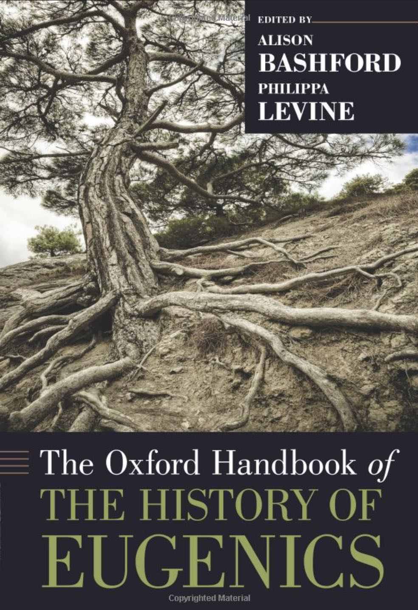
```

:::
::::

## Oxford handbook of Eugenics

:::: {.row}
::: {.col-md-6}

Part II explores transnational themes:

The Darwinian Context: Evolution and Inheritance
*Diane B. Paul and James Moore*

Anthropology, Colonialism, and Eugenics
*Philippa Levine*

Race, Science, and Eugenics in the Twentieth Century
*Marius Turda*

Eugenics and the Science of Genetics
*Nils Roll‐Hansen*

Fertility Control: Eugenics, Neo-Malthusianism, and Feminism
*Susanne Klausen and Alison Bashford*

Disability, Psychiatry, and Eugenics
*Mathew Thomson*

Eugenics and the State: Policy-Making in Comparative Perspective
*Véronique Mottier*

Internationalism, Cosmopolitanism, and Eugenics
*Alison Bashford*

Gender and Sexuality: A Global Tour and Compass
*Alexandra Minna Stern*

Eugenics and genocide
*A. Dirk Moses and Dan Stone*

:::

::: {.col-md-6}

```{r, out.width ="70%"}

```

:::
::::

## Eugenics Journals

A few English language eugenics journals include: 

[The Eugenics Review](https://www.ncbi.nlm.nih.gov/pmc/journals/1186/)

[The Eugenical News](https://archive.org/search.php?query=Eugenical%20News)

[The Journal of Race Development](https://www.jstor.org/journal/jracedeve) (whose first editor was the first president of the American Psychological Association, Granville Stanley Hall)

[Annals of Eugenics](https://onlinelibrary.wiley.com/toc/20501439/1925/1/1) (which was renamed Annals of Human Genetics). 

## Eugenics Record Office

```{r, out.width ="70%"}
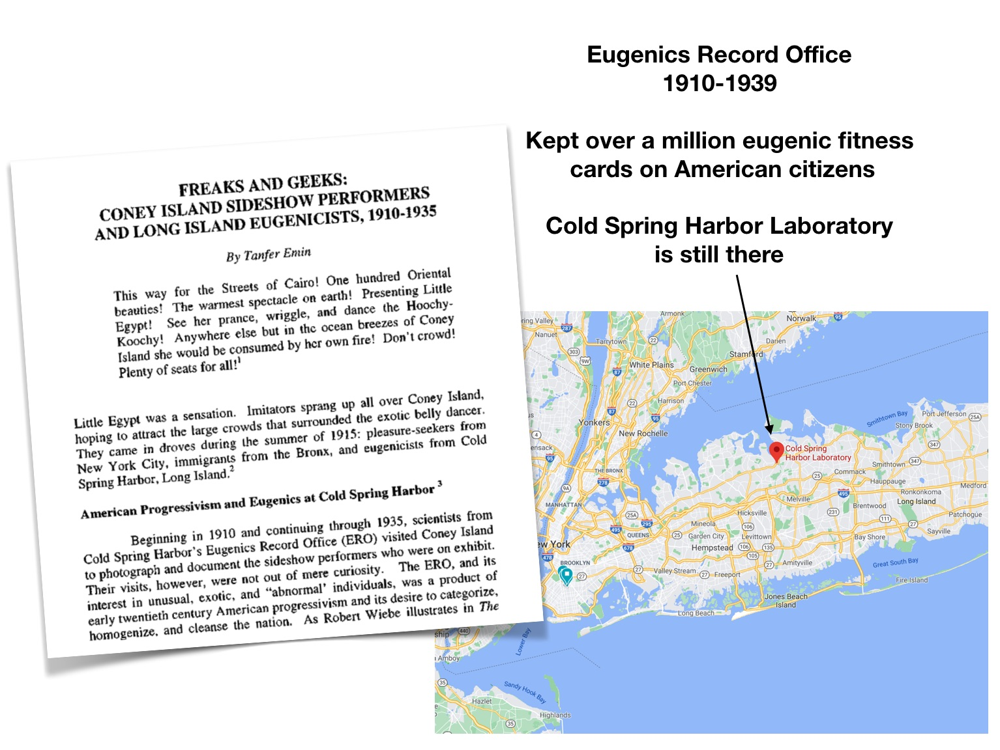
```

## Eugenics Propaganda 

Movies, books, posters, state fairs, trained eugenics promoters, textbooks, etc.

## Tree of eugenics

```{r}
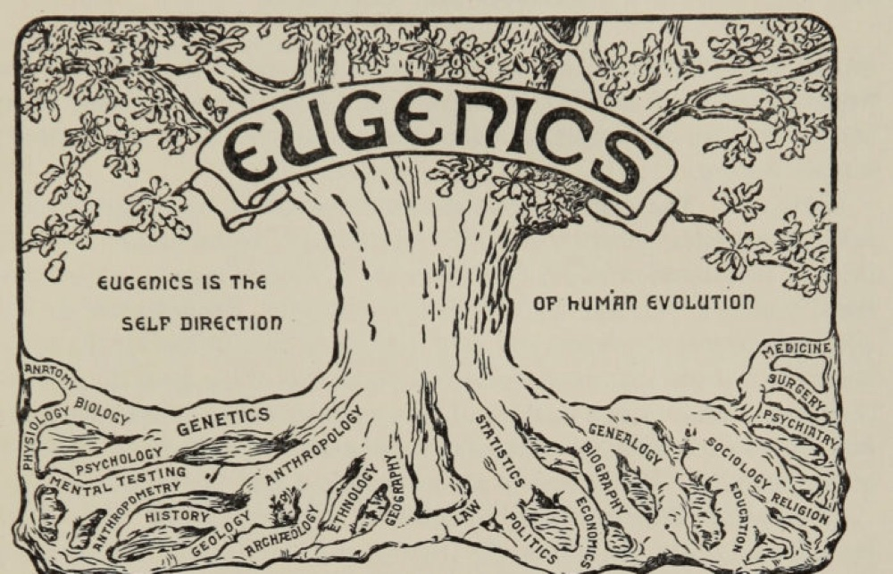
```

## Posters

```{r, out.width="50%"}
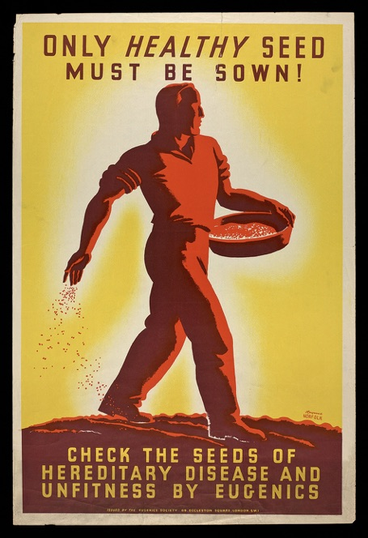
```

## Displays

```{r}
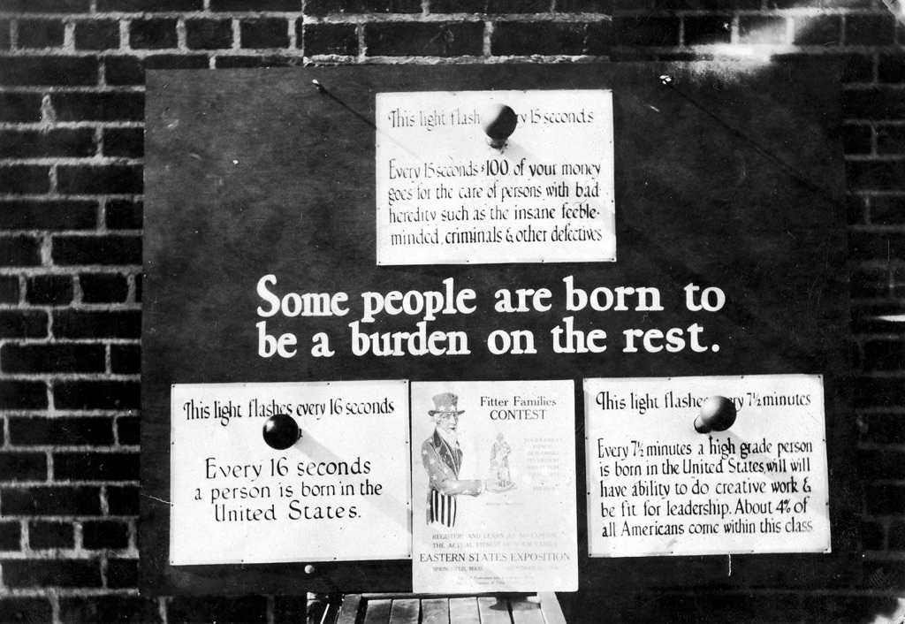
```

## Stoking fear

```{r}
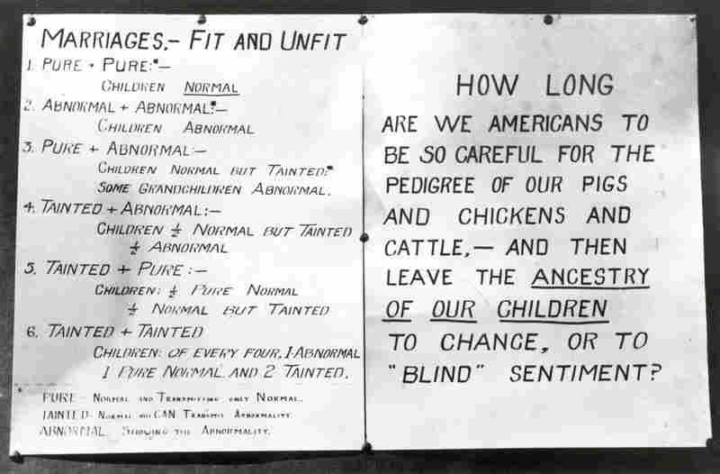
```

## Fitter Families

```{r}
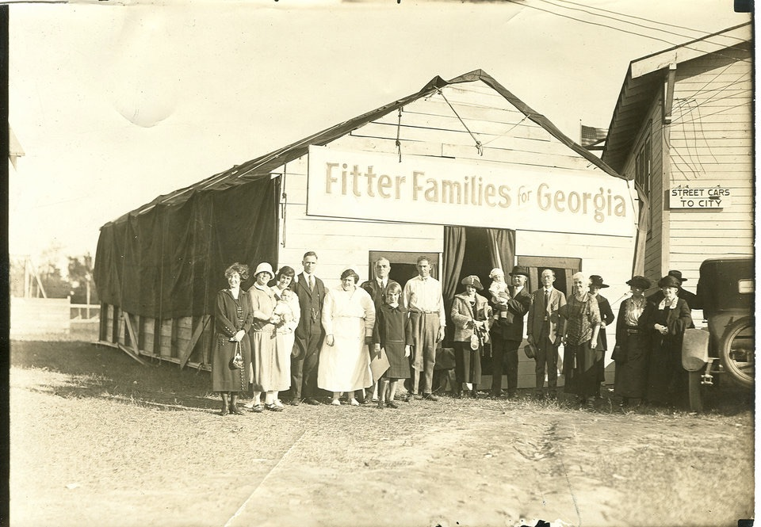
```

## Better Babies

```{r}
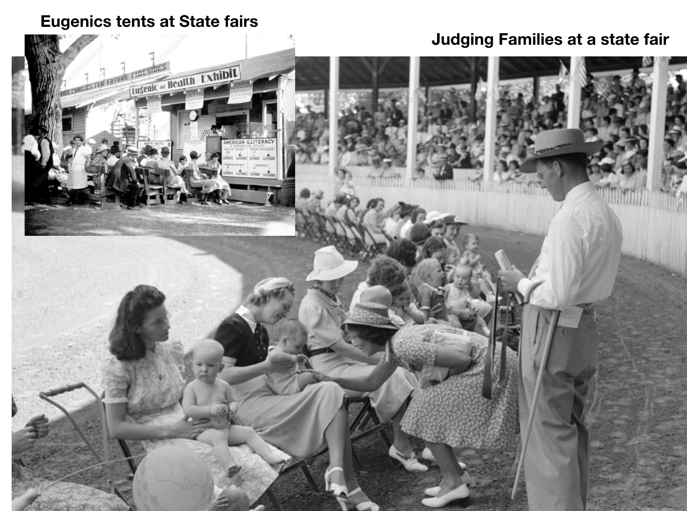
```


## Books

1877, Richard Dugdale, *The Jukes: A study in Crim Pauperism, Disease and Heredity*

<https://eugenicsarchive.ca/discover/timeline/51509ab5a4209be523000006>

1912, Henry Goddard, *The Kallikak Family: A study in the Heredity of Feeble-mindedness*

<https://eugenicsarchive.ca/discover/timeline/53246c10132156674b00025e>

Madison Grant's, *The Passing of the Great Race*

<https://eugenicsarchive.ca/discover/timeline/53eea903803401daea000001>

## Movies

Black Stork (1917)

<https://www.youtube.com/watch?v=CEh2kz26T1k>

Tomorrow's Children (1934) 

<https://www.youtube.com/watch?v=0EVdAOKjR-s&t=96s>


##  Influences on society

### 1. Eugenics Overview {.greyout}
### 2. Galton's Eugenics {.greyout}
### 3. The Eugenics movement {.greyout}
### 4. Influences on society {.bolder}
### 5. Psychology and Eugenics {.greyout}

## Galton's methodical vision

> a brief word to express the science of improving stock, which is by no means confined to questions of judicious mating, but which, especially in the case of man, takes cognizance of all influences that tend in however remote a degree to give to the more suitable races or strains of blood a better chance of prevailing speedily over the less suitable than they otherwise would have had (Galton, 1883, p.17)


## Galton's Anthropometric Lab

:::: {.row}
::: {.col-md-6}

Basic Eugenics Program

**Testing**: Measure everything you can about people to identify their fitness

**Positive eugenics**: Encourage the “good” people to breed

**Negative eugenics**: find ways to stop “unfit” people from breeding, so they eliminate themselves over generational time

:::

::: {.col-md-6}

```{r, out.width ="100%"}
knitr::include_graphics("imgs/anthropometry_lab.jpg")
```

:::
::::

## Karl Pearson

:::: {.row}
::: {.col-md-6}

Statistician who invented the correlation coefficient, Pearson's $r$

Galton's protege, took over the Galton Chair of Eugenics at University of London when Galton died

Founded [Annals of Eugenics](https://onlinelibrary.wiley.com/toc/20501439/1925/1/1)

:::

::: {.col-md-6}

```{r, out.width ="70%"}
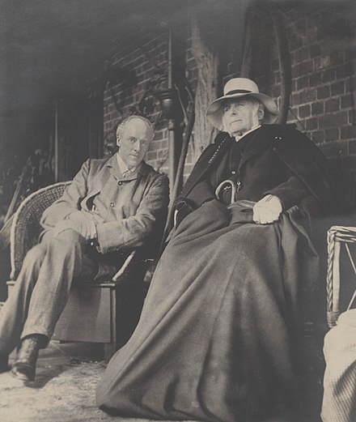
```

:::
::::

## Example of Pearsons Applied Eugenics research

Pearson & Moul (1925)

```{r}
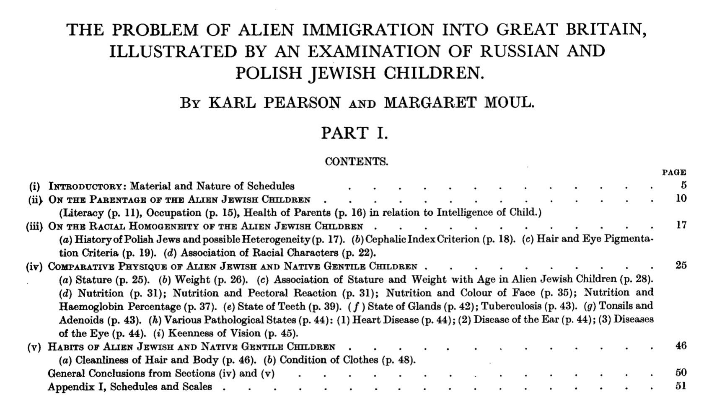
```


## A short list of consequences

- Nazi Atrocities

- Involuntary institutionalization and forced sterilization (Many US States legalized these practices)

- Anti-miscegenation laws and/or selective intermarriage to "whiten" indigenous groups

- Racial segregation policies

- Education: Standardized testing, IQ testing, gifted education programs, residential schools

- Personnel Selection: Massive IQ testing to answer questions like, who should be sent to the front to die? Who should be an officer?

- Eugenicists in positions of power (Presidents, Elected Officials, Government Funding Agencies, University Presidents, Society Presidents, Faculty members, Prominent members of society at large).

##  Psychology and Eugenics

### 1. Eugenics Overview {.greyout}
### 2. Galton's Eugenics {.greyout}
### 3. The Eugenics movement {.greyout}
### 4. Influences on society {.greyout}
### 5. Psychology and Eugenics {.bolder}

## Yakushko (2019)

Yakushko, O. (2019). Eugenics and its evolution in the history of western psychology: A critical archival review. Psychotherapy and Politics International, 17(2). https://doi.org/10/gg3hsf

```{r}
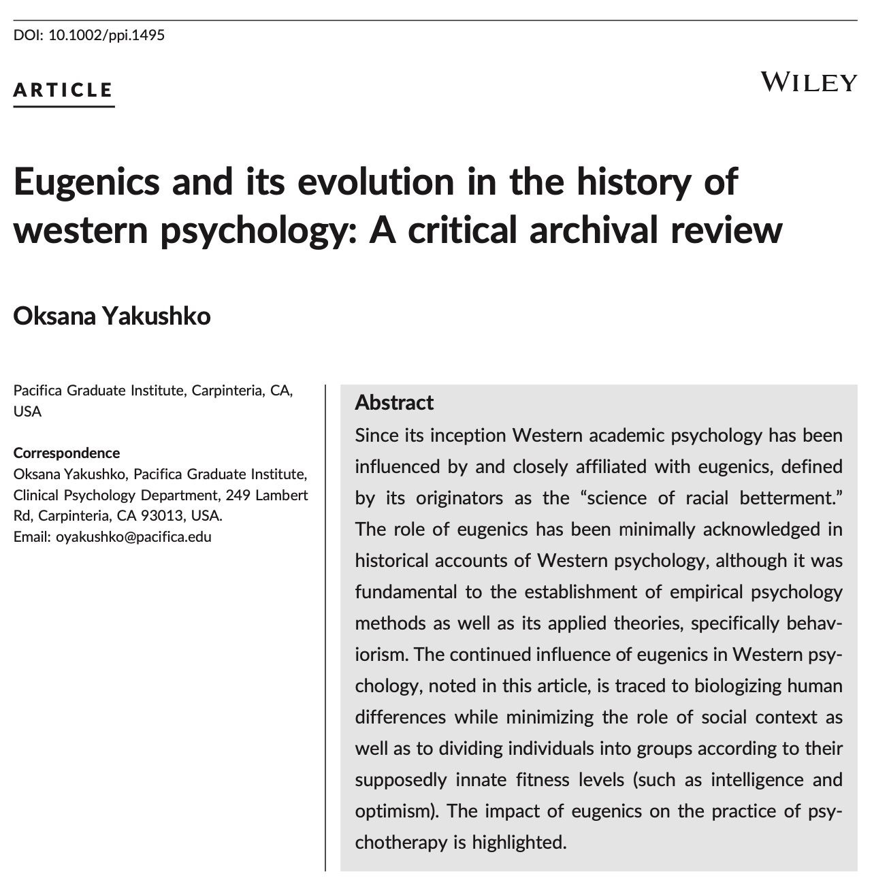
```

> Thus, it was American psychology, drawing on British evolutionary and eugenic developments, that became a key force in further expanding eugenic focus in both the discipline and society, including through specific emphasis on what constituted a "healthy" human being. 

> A review of the official publications of American eugenic societies reveals that 31 presidents of the American Psychological Association between 1892 (Stanley G. Hall's presidency) and 1947 (Carl Rogers's presidency) were publicly listed as leaders of various eugenic organizations. Numerous other American psychology leaders, while not listed in these eugenic leadership rosters, nevertheless produced or openly supported eugenic works. For example, S. Franz (APA president in 1920) and J. Dashiell (APA president in 1938), while not listed as eugenic leaders, published numerous positive reviews of eugenic works with titles such as "The Field of Eugenic Reform". 

> M. Washburn, APA president in 1921, one of few female APA presidents, not only published positive reviews of eugenic books but also produced studies on supposed differences in national character showing the “striking national difference” apparently found between Jewish participants' lack of empathy in contrast to their non‐Jewish counterparts (Washburn, 1923, p. 429).

## APA Presidents

<https://www.apa.org/about/governance/president/former-presidents>

## Psychology Awards

APA gives the [E. L. Thorndike Career Achievement Award](https://www.apa.org/about/awards/div-15-thorndike) to recognize achievements in educational psychology; the [Granville Stanley Hall Award](https://www.apadivisions.org/division-7/awards/hall) for achievements in Developmental Psychology; and the [Robert M. Yerkes Award](https://www.apa.org/about/awards/div-19-yerkes) for achievements in Military Psychology by non-psychologists.

The Association for Psychological Sciences (APS) gives the [James McKeen Cattell Fellow Award](https://www.psychologicalscience.org/members/awards-and-honors/cattell-award) for contributions to applied research

The Society for Experimental Psychology gives the [Howard Crosby Warren Medal](https://www.sepsych.org/warren_medal.php) for outstanding achievement in experimental psychology.

## APA Apology

<https://www.apa.org/about/policy/racism-apology>

<https://www.apa.org/about/apa/addressing-racism/historical-chronology>

## Psychological tools

```{r}

```

## Mental Testing

CATTELL, J. McK. (1890). V.—MENTAL TESTS AND MEASUREMENTS. Mind, os-XV(59), 373–381. https://doi.org/10/dhn9nc

```{r}
knitr::include_graphics("imgs/Cattell_mental_testing.jpg")
```

## What's Next

Read chapter 4 [Intelligence testing](https://www.crumplab.com/cognition/textbook/intelligence-testing.html) from the textbook.

Watch the next mini-lecture in for this learning module, and then complete quizzes and assignments of your choice


