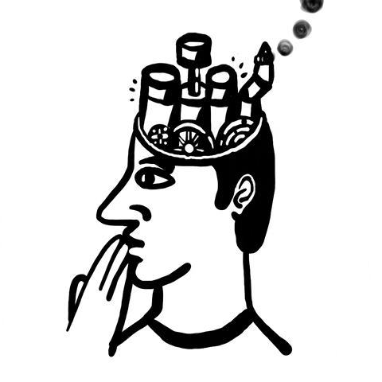
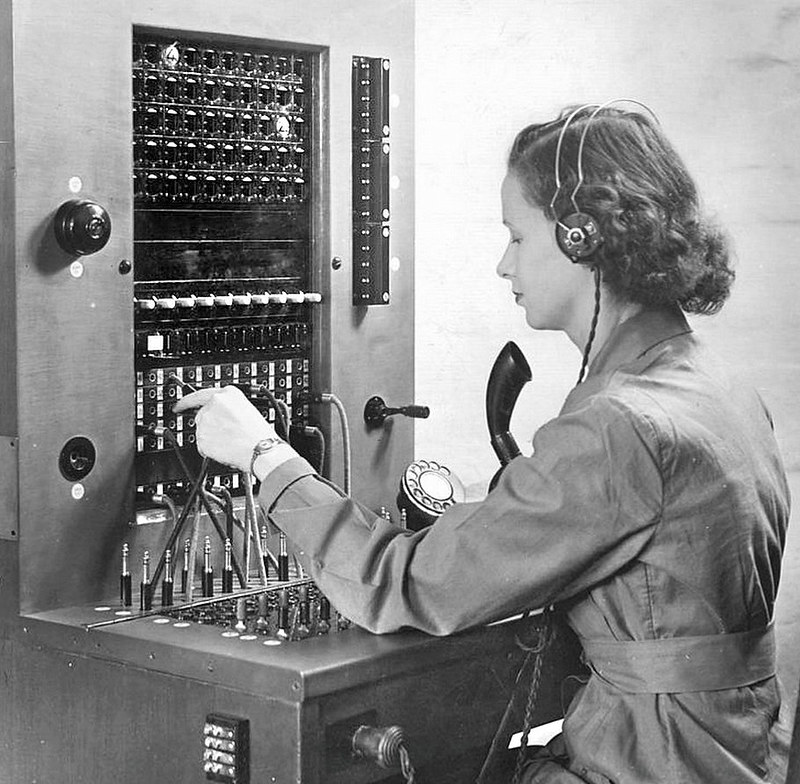
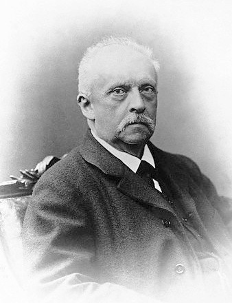
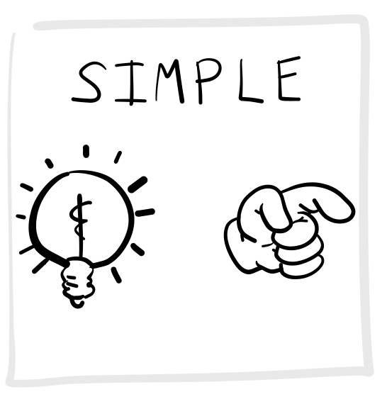
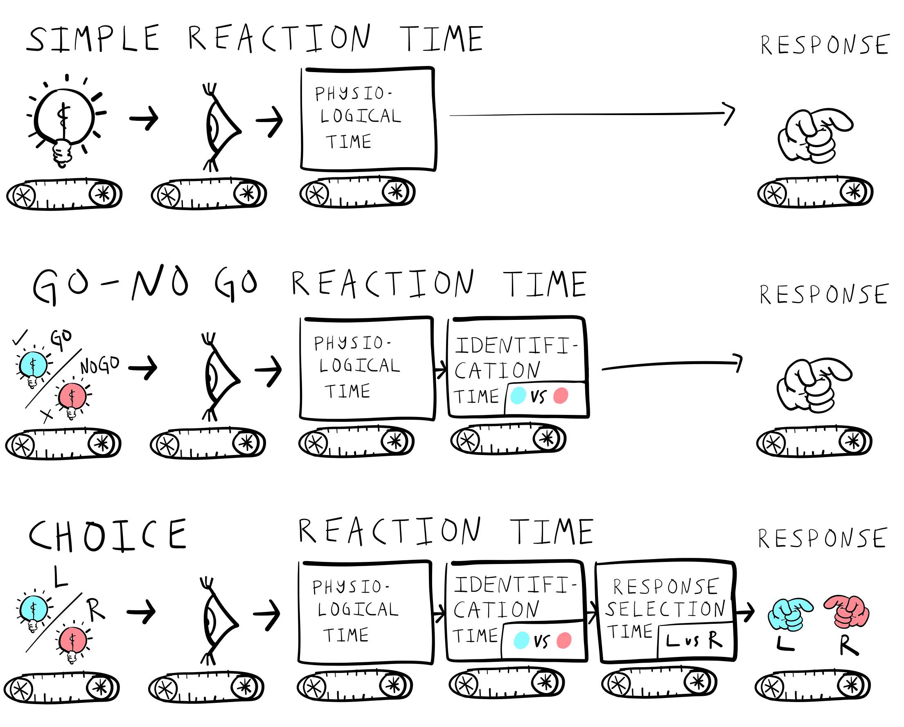
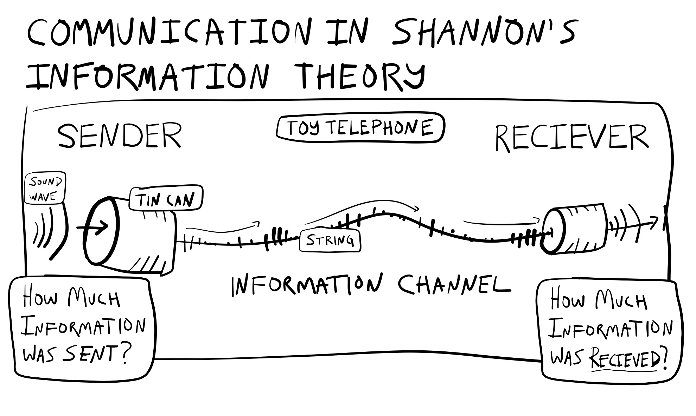
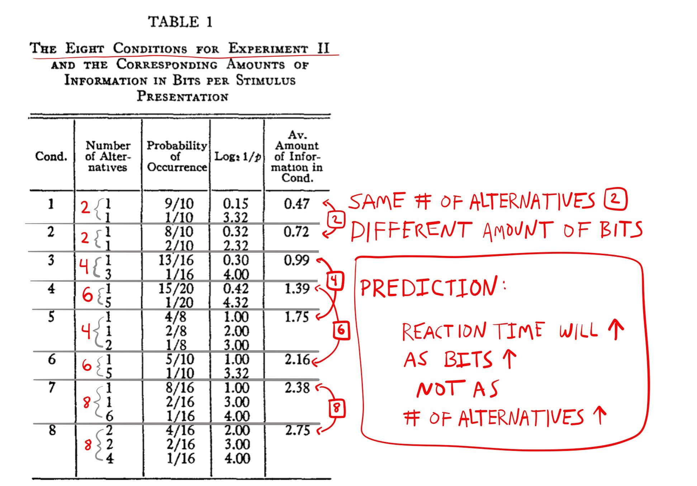
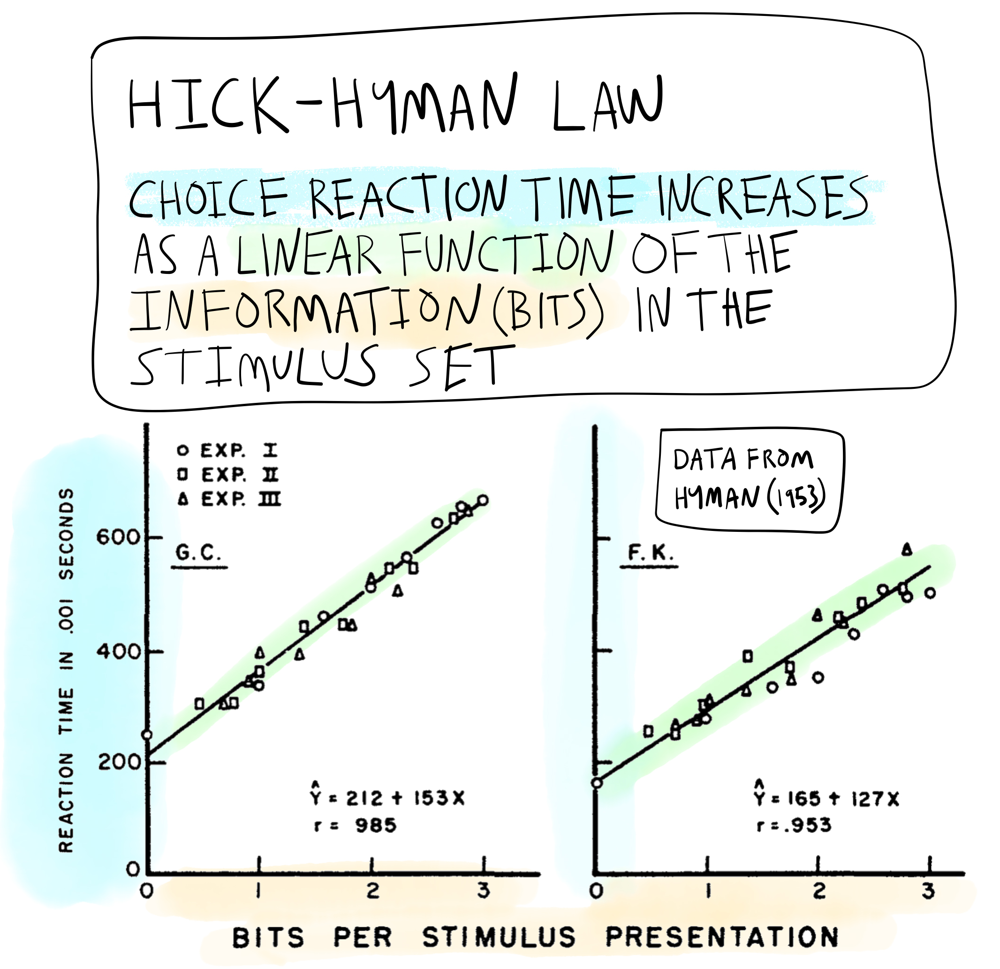

```{r setup, include=FALSE}
knitr::opts_chunk$set(echo = FALSE,
                      fig.align = "center",
                      out.width = "80%")
library(fontawesome)
```

## Reminders

Reading is Chapter 7 on [Information Processing](https://www.crumplab.com/cognition/textbook/information-processing.html)

**Grades**

**Discussion Boards**


##  Roadmap

### 1. Revolutions and Metaphors {.bolder}
### 2. Donders and Processing stages {.greyout}
### 3. Information Theory {.greyout}
### 4. Hick-Hyman Law {.greyout}

## Metaphors and explanation

:::: {.row}
::: {.col-md-6}

Cognitive psychology often uses metaphors as an aid for explanation

*Metaphorical Explanation*

The structure and function of one thing is used to roughly describe another thing

:::

::: {.col-md-6}

```{r}

```

:::
::::

## Revolutions and metaphors

Big metaphors in cognition roughly track technological revolutions

1. Industrial Revolution
2. Technological Revolution
3. Digital Revolution

## Industrial Revolution

Cognition is like a factory assembly line

```{r}
knitr::include_graphics("imgs/assembly_line.jpg")
```


## Technological Revolution

Cognition is like a telephone network

```{r, out.width="50%"}

```

## Digital Revolution

Cognition is like a computer

```{r, out.width="50%"}
knitr::include_graphics("imgs/computer.gif")
```

##  Donders and Processing stages

### 1. Revolutions and Metaphors {.greyout}
### 2. Donders and Processing stages {.bolder}
### 3. Information Theory {.greyout}
### 4. Hick-Hyman Law {.greyout}

## Mental Chronometry


:::: {.row}
::: {.col-md-6}

Using measures of time to make inferences about cognitive processes

:::

::: {.col-md-6}

```{r}
knitr::include_graphics("imgs/stopwatch.jpg")
```

:::
::::

## How fast can a nerve transmit a signal? 

Infinitely fast? 

Or, with a certain speed?

## Hermann von Helmholtz (1821-1894)

:::: {.row}
::: {.col-md-6}

Measured nerve conduction speeds in sciatic nerve of a frog

Range of 24.6 - 38.4 meters per second


:::

::: {.col-md-6}

```{r}

```

:::
::::

## FC Donders (1818-1889)

:::: {.row}
::: {.col-md-6}

Dutch Ophthalmologist

Used mental chronometry to measure mental processing times

:::

::: {.col-md-6}

```{r}
knitr::include_graphics("imgs/donders4.jpg")
```

:::
::::

## Physiological Reaction time

:::: {.row}
::: {.col-md-6}

First used in astronomy

Referred to individual human error in the timing of recording observations of stars

Time taken for light to hit the eye, then be transduced and conducted along nerves to produce a response

:::

::: {.col-md-6}

```{r}
knitr::include_graphics("imgs/telescope.jpg")
```

:::
::::

## Donders' idea

The time associated with unique stages of mental processing could be measured by systematically asking people to complete tasks of increasing complexity...

## Donders' Tasks

Donders measured reaction times in increasingly complex tasks

Simple reaction time

Go-No Go

Choice reaction time

## Simple Reaction Time

:::: {.row}
::: {.col-md-6}

Simplest reaction time task

Participants wait for ANY stimulus

And, respond as quickly as possible when the stimulus occurs

**Measures "physiological" reaction time**

:::

::: {.col-md-6}

```{r, out.width="50%"}

```

:::
::::

## Go-No Go

:::: {.row}
::: {.col-md-6}

Participants wait for a specific stimulus (GO)

Respond only to the GO stimulus

Withhold response to other stimuli

**Requires stimulus identification**

:::

::: {.col-md-6}

```{r, out.width="50%"}
knitr::include_graphics("../../textbook/imgs/Donders_GoNoGo.png")
```

:::
::::

## Choice Reaction Time

:::: {.row}
::: {.col-md-6}

There are multiple possible stimuli

Respond to each with a unique response

**stimulus identification and response selection**

:::

::: {.col-md-6}

```{r, out.width="50%"}
knitr::include_graphics("../../textbook/imgs/Donders_Choice.png")
```

:::
::::

## Donder's processing stages

```{r}
knitr::include_graphics("../../textbook/imgs/Donders_assembly.png")
```

## Assumed mental times

```{r}

```

## Donders subtractive logic

Estimating identification time

```{r}
knitr::include_graphics("../../textbook/imgs/Donders_id_time.jpg")
```

## Donders subtractive logic

Estimating response selection time

```{r}
knitr::include_graphics("../../textbook/imgs/Donders_RT_time.png")
```

## Issues with subtractive logic

What happens if two processing stages can both occur in parallel at the same time?

## 1950s and beyond

Interest in reaction time studies was revived in the 1950s

And, the metaphor for explaining cognitive processes shifts from an assembly line metaphor to a telecommunications metaphor

## PRP effect

PRP stands for the Psychological Refractory Period (Welford, 1952)

Theoretical debate about the PRP effect reflects the metaphorical shift

## Basic PRP effect

:::: {.row}
::: {.col-md-6}

Responding to a first stimulus can sometimes delay a response to a second stimulus, especially if the stimuli are presented quickly, one after the other

:::

::: {.col-md-6}

```{r}
knitr::include_graphics("../../textbook/imgs/PRP_effect.jpg")
```

:::
::::

## Explanations of the PRP effect

Welford described a few:

1. Could reflect hard-wired properties of signalling among nerve fibers
2. Could reflect participants expectations...short delays might be more surprising, and the surprise lengthens the response
3. *PRP reflects a central mechanism with a single-channel of limited capacity...*

## A single channel decision mechanism

> In its bare essentials this theory assumes, firstly, a number of sensory input mechanisms each capable of receiving data and storing it for a limited period so that, for example, a short series of signals can be received as a unit. Secondly, it assumes a number of effector mechanisms containing both central and peripheral elements and capable of carrying out a series of actions such as the pressing and release of a key or a series of taps (Vince, 1949) as a single unit. Thirdly, between these two it postulates a single-channel decision mechanism. This is regarded as being of limited capacity in the sense that it takes a finite time to process information and can thus only deal with a limited amount of information in a given time


##  Information Theory

### 1. Revolutions and Metaphors {.greyout}
### 2. Donders and Processing stages {.greyout}
### 3. Information Theory {.bolder}
### 4. Hick-Hyman Law {.greyout}

## Claude Shannon (1916-2001)

:::: {.row}
::: {.col-md-6}

"Father of Information Theory"

A Mathematical Theory of Communication (1948)

Founded digital circuit theory (1937)


:::

::: {.col-md-6}

```{r}
knitr::include_graphics("imgs/ClaudeShannon_MFO3807.jpg")
```

:::
::::

## Information theory intro

Information theory was NOT originally developed as a theory in psychology

It is a set of mathematical formalisms to describe communication systems

Measurement tools from information theory became popular in Cognitive Psychology beginning around 1950

## Information Channel

:::: {.row}
::: {.col-md-6}

An information channel has three parts:

A sender, a channel, and a receiver

Two questions: 

How much information was sent? 

How much was received?

:::

::: {.col-md-6}

```{r, out.width="100%"}

```

:::
::::

## Example information channels

Toy telephone (two cans and a wire)

Real telephone networks

What about people talking to each other?

## Channel Capacity

Important concept from information theory

The amount of information that can be transmitted and received through a communication channel

## Measuring information: H

Shannon proposed to measure information in terms of entropy, or the amount of uncertainty in a system of messages:

$H(X) = -1*\sum_\text{i=1}^n P(x_i) * log_2 P(x_i)$

## Why a formula is useful

Capacity limitations for information channels could be measured and assigned a value

Content of signals could be analyzed in terms of how much information they carry

Amount of information lost during transmission could be quantified

Led to improvements in telecommunications systems and technology

## Meaning of H?

Shannon’s formula defines information in terms of the predictability of a sequence of messages.

More predictable sequences = Low information

Less predictable sequences = High information

## Consider three books

A book that contained the letter A repeatedly

A book that you read, enjoyed, and found meaningful

A book that contained completely random sequences of letters

## Computing H

<https://www.crumplab.com/cognition/textbook/information-processing.html#computing-h>

## Bits of information

Shannon's formula uses a base 2 logarithm which produces a number in the unit of [bits](https://en.wikipedia.org/wiki/Bit).

Bits can be used to measure the total number of discrete events in a system of messages

## Bits and Unique events

```{r}
knitr::include_graphics("../../textbook/imgs/Shannon_bits.jpg")
```

## A simple communication system

Let's review H, Bits, and Information together by examining a simple communication system involving four possible messages:

A B C D

<https://www.crumplab.com/cognition/textbook/information-processing.html#h-bits-predictability-and-information>

##  Hick-Hyman Law

### 1. Revolutions and Metaphors {.greyout}
### 2. Donders and Processing stages {.greyout}
### 3. Information Theory {.greyout}
### 4. Hick-Hyman Law {.bolder}

## Information theory and cognition

Ideas from information theory were imported into cognitive psychology around the 1950s

## Information processing capacity

A big idea was to describe limitations in "information processing" abilities

E.g., how much "information" can you process?

## Hick-Hyman Law

A promising early demonstration suggesting that **choice reaction time** performance may be fundamentally governed by the amount of information in a set of choice stimuli.

Specifically, choice reaction time increases a linear function of the information in the set of choice stimuli.


## Choice Reaction Time Task

:::: {.row}
::: {.col-md-6}

Participants are presented with one stimulus at a time from a set of stimuli

Participants identify each stimuli with a unique response as fast as possible

:::

::: {.col-md-6}

```{r}
knitr::include_graphics("../../textbook/imgs/Donders_Choice.png")
```

:::
::::

## Set-size effects

Prior research had shown that choice reaction time increases with set-size 

e.g., average response time to respond to any stimulus goes up and up, as the number of alternatives in the set increases

## Explaining set-size effects...

Why does mean reaction time go up when the number of possible choices goes up?

## Hick and Hyman's idea

Perhaps people were responding to the amount of information in the choice set, and not simply the number of the alternatives.

If people were responding to the amount information, then they should be sensitive to the predictability of individual alternatives.

## Confounds

Choice stimuli were usually presented randomly to participants.

This meant the number of alternatives and the amount of information in a set was confounded.

## Deconfounding alternatives and information

Need to independently manipulate the number of alternatives, and the amount of information

## Hyman (1953)

Hyman, R. (1953). Stimulus information as a determinant of reaction time. Journal of Experimental Psychology, 45(3), 188–196. https://doi.org/cq3kjd

## Experiment 1

A choice-reaction time task with 8 different conditions, corresponding to the number of alternatives in a set, from 1 to 8. 

In each condition, all stimuli were presented randomly.

Thus, the amount of bits in each condition was ranged from 0 to 3 (bits for 1 to 8 alternatives are: 0, 1, 1.58, 2, 2,32, 2,58, 2,81, and 3).

## Experiment 1 results

Reaction time increased linearly with number of alternatives...

BUT, the number of alternatives, was completely confounded with the amount of bits.

## Experiment II

```{r}

```

## Results

```{r}

```

## Hick-Hyman Law

Choice reaction time increases linearly as a function of the information (bits) in the stimulus set

## Implications for Behaviorism

- Behaviorists looked for lawful regularities connecting a stimulus with a subsequent response

- Hick-Hyman law showed a case where responses to a stimulus did not depend on the stimulus that was presented!

- People were not only responding to the stimulus in front of them, their performance was also determined by the relative predictability of other stimuli that were not presented.

## Debate about Hick-Hyman Law

Information theory was not an explanation, it was just another way to describe the experimental manipulation

Further research showed some violations to the Hick-Hyman Law (practiced subjects, non-linear trends)

## Explanations

Why does choice reaction time mostly increase linearly as a function of information?

Hick's match to template hypothesis...

Hick's binary logic test hypothesis...

Kornblum's priming explanations

## What's next

Complete the quiz for this learning module on Blackboard, and/or the writing assignments by the due date.

The next learning learning module is Memory I


