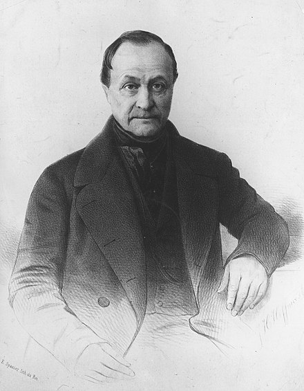

```{r setup, include=FALSE}
knitr::opts_chunk$set(echo = FALSE)
```

# A regular slide with text


Here is some text that I would like to say. It is a paragraph of text. 

Most of the time I would not make a slide with a paragraph. It would be too much text. So, instead of a paragraph. Point form would be better.

## This is a basement level slide

Need to click down to go to this slide

# This is the next right-ward slide

Another slide

# bold and italics

This is a **bolded** word.

This is an *italicized* word

# A regular slide with a list

The following items are important:

1. This thing
2. Another thing, that is this
    - here are some additional sub points
    - and another one
3. A third thing, is this one
    -  and another things

# Multicolumn Text and a picture

:::: {.row}
::: {.col-md-6}

Here is some text that I would like to say. It is a paragraph of text. Most of the time I would not make a slide with a paragraph. It would be too much text. So, instead of a paragraph. Point form might work better

:::

::: {.col-md-6}

```{r, out.width ="100%"}
knitr::include_graphics("imgs/Bartlett_homme.png")
```

:::
::::

# try multi-column

:::: {.container-fluid}
:::: {.row}
::: {.col-md-6}

word 1

:::

::: {.col-md-6}

word 2

:::
::::
::::

# Full-screen picture

```{r, out.width ="100%"}
knitr::include_graphics("imgs/Bartlett_homme.png")
```


# Text, quote and picture

:::: {.row}
::: {.col-md-8}

Here is something Auguste Comte said:

> Well, not really, this is just a test quote to see what it would look like if someone said something.

:::

::: {.col-md-4}

```{r, out.width ="100%"}

```
Auguste Comte

(x-x)

:::
::::


# Regular column atop multicolumn

Sometimes you might say something as general concept, like a distinction that has two parts. 

:::: {.row}
::: {.col-md-6}

Distinction 1

>- Has this thing
>- This thing
>- and this thing

:::

::: {.col-md-6}

Distinction 2

>- Has this thing
>- This thing
>- and this thing

:::
::::

# Something in the middle {.center .middle}

# regular markdown table

| Syntax      | Description | Test Text     |
| :---        |    :----:   |          ---: |
| Header      | Title       | Here's this   |
| Paragraph   | Text        | And more      |


# R markdown table

```{r}
library(kableExtra)
knitr::kable(head(cars)) %>%
  kable_styling("striped")
```

# {.nocolor}

```{r, out.width ="100%"}
knitr::include_graphics("imgs/Bartlett_homme.png")
```


# No color in the title {.nocolor}

here is some text that I would like to say. It is a paragraph of text. Most of the time I would not make a slide with a paragraph. It would be too much text. So, instead of a paragraph. Point form might work better

# Overview slide

<span class="highlighted_box"> 1. Hello </span>

<span class="greyed_box"> 2. Hello </span>

<span class="greyed_box"> 3. Hello </span>

<span class="greyed_box"> 4. Hello </span>

# fragments

:::: {.r-stack}
::: {.fragment}
one
:::

::: {.fragment}
two
:::

::: {.fragment}
three
:::

::::

# background color {data-background-color="aquamarine"}


change background color
