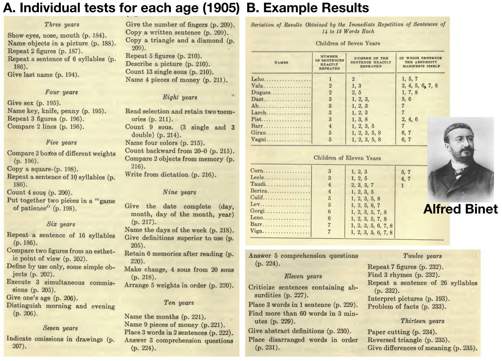

# Eugenics and Psychology

| Word Count|Reading Time |
|----------:|:------------|
|      10643|53.2 minutes |

<!--
Chapter goals

1. Motivate the history lesson, why is it worth learning this history?
2. Brief history of eugenics to explain scale
3. Connection to psychology and cognition

-->

## Chapter Overview

This chapter describes the eugenics movement and some of its connections with the larger discipline of psychology and research into cognition. The separate histories of eugenics, psychology, and the cognitive sciences have all filled many volumes of books. Although these topics are too large to cover adequately in a single chapter, it is worth visiting them to appreciate the socio-historical context around cognitive research, how it is has influenced society, and how research questions have changed over time to address different kinds of questions. 

## Eugenics, psychology and the cognitive sciences

Including a chapter about eugenics is not very common in introductory psychology textbooks. I have introductory cognitive psychology textbooks that do not mention eugenics even once. When I learned about histories of psychology and cognitive psychology, the topic of eugenics came up very infrequently. One reason for the lack of coverage might be that cognitive psychology and the cognitive sciences became established academic disciplines well after the primary eugenics movements had come and gone; and, eugenics may be viewed as "ancient history" or irrelevant to discussions of modern day cognitive sciences. My view is that the rise and gradual fall of the eugenics movement is inextricably intertwined with psychology especially between the turn of the 20th century (1890s-ish) and 1950s (ish). Although the cognitive sciences were established between the 1950s and 1980s, research into cognitive abilities had been ongoing for decades prior to the so-called "cognitive revolution". The eugenics movement substantially influenced early branches of research into cognitive abilities, and shaped the kinds of questions, tools/methods, and applications that the research enterprise held for society, and the development of the cognitive sciences, then and now.

Last chapter we learned that Sir Francis Galton was interested in mental abilities because of his research into individual differences in the vividness of mental imagery. However, I failed to mention that Galton was also interested in Eugenics, which is important to recognizing why Galton conducted the research in the first place. From our modern perspective, it is easy to assume that early psychologists conducted their work because they were interested in understanding how parts of human and animal psychology works. However, for many psychologists (like Galton) who were involved in the Eugenics movement, there was another reason for the research, to help forward the cause of Eugenics. What was the Eugenics movement? How did it get started, what did it do, when did it end? How was psychology involved? And what does this have to do with cognition? We will address these questions in the next sections.  

## Eugenics: an overview

My training in psychology sometimes referenced the eugenics movement, but only fleetingly. I learned that a few famous statisticians and psychologists were "Eugenicists", but not much else. Here is a brief overview of eugenics, followed by elaborations on how the movement connects to psychology and the cognitive sciences. 

Galton published the first academic work on Eugenics (1865), and also coined the term. Eugenics transitioned from ideas in journal pages read by small groups of elites, into a large and complex social movement that was broadly accepted (from everyday citizens to national leaders) in numerous countries around the world. The ideology behind eugenics has some core features, but was also adaptable, potentially allowing it to more easily spread across different societies. The basic idea was that humans could be bred, like other animals, to become more intelligent as a species over generations. Proponents of eugenics aimed to control the quality of humankind over generations, and their methods of control were responsible for many human rights violations and atrocities. The legacy of eugenics campaigns has left lasting impacts on society that continues today.

The early discipline of psychology was complicit in eugenics, and large numbers of psychologists were eugenicists. The general involvement of psychology reflects the widespread acceptance of eugenics in society (psychology wasn't special in this regard); but, it was the specific aspects of psychology's involvement that warrants the descriptor "complicit". Eugenics needed ways to "scientifically" measure the physical and mental qualities of individual people. Psychologists (many of whom were also eugenicists) helped create and deploy the tests of human ability (e.g., intelligence tests) that would be used to carry out eugenics campaigns on society. Research concerned with cognitive abilities was motivated and deeply entrenched in eugenics for well over half a century (1900s-1950s). The cognitive sciences did not emerge unscathed from this historical backdrop while advancing attempts to explain how cognitive abilities work.

## Galton's Eugenics

Eugenics was an potent mix of ideas that ranged from scientific claims to social policy, religion, and visions of Utopia. Although eugenics ideology morphed over time and geographical place [@bashfordOxfordHandbookHistory2010], the basic tenets of the movement are still captured well by Galton's early writings. In 1865, Galton wrote "Hereditary talent and character" [@galtonHereditaryTalentCharacter1865], a short paper that was expanded to a book a few years later, "Hereditary Genius" [@galtonHereditaryGenius1869]. These works describe Galton's ideas about human quality-- that some humans are much more superior in quality than others-- his research claiming that the most important human qualities are hereditary (biologically inherited from parents), his fears that society was degrading all around him, and his plan to save society by creating a new scientific religion capable of engineering a supreme human race over generations, simply by controlling human reproduction.

Galton referenced the practice of dog breeding, which involves selectively mating dogs with particular physical and behavioral traits over generations of broods. Dog-breeding was a choice example, because it would have been obvious to anyone that breeding over generations can produce dramatic results: all of the many different dog breeds have been achieved through breeding. One of Galton's radical claims for the time, was that breeding should be used on humans, just like dogs, and that breeding programs would be a simple, straightforward, and already well-understood method to produce a superior race of humans over generations.

Galton's eugenics ideas did not appear in a vaccuum, and were influenced by the scientific and social context he was working in. Galton's eugenics writings appeared just after 1859, when his cousin Charles Darwin published the theory of evolution in the "origin of the species" [@darwinOriginSpecies1859]. Darwin's theory, which continues to stand today as a powerful explanatory theory of life on earth, described how animal species evolved over time through a process of natural selection. This same time period included threats to British imperialism and efforts by many nations to establish dominance and social order across the globe. Galton was an esteemed upper-class British man of science (eventually knighted in 1909), who held sexist and racist views common among his peers. For example, long before genetics would show that there is no biological basis for race, academics like Galton assumed that people from "uncivilized" countries were of much lower quality than people from "civilized" countries, and that these differences in quality must have evolved, and must be heritable. Furthermore, in the tradition of Thomas Malthus [], who is famous for speculating on the imminent collapse of society as a result of population growth; Galton feared that society would deteriorate over the generations due to increased global interactions between people across the world. Specifically, Galton feared that "natural selection" left to chance would allow inferior, low-quality and uncivilized people to reproduce, pollute the gene pool, spread inferior genes across the world, and cause the slow decline and ultimate destruction of the human race. 

Galton saw Eugenics as a way to arrest human destiny from natural selection, and use the new powers of science and technology to save humanity from itself. Eugenics was not only about improving society for one generation, it would be sold as a movement dedicated to improving humanity across the generations, for the rest of time. Although improving humanity might not seem like a frightening goal, it is worth considering  questions like: What is being improved? Who get's to decide what needs improving? What kinds of changes count as improvement? Who will benefit from the improvement? Will the costs of improvement be shared equally? In answering these questions, the eugenics movement argued that individual differences in people reflected levels of human quality, that low quality humans were a major problem for society, and that improving humanity meant identifying and eliminating low quality humans from the species. If you were not considered a high quality human by eugenics standards, then the eugenic concept of improving society could be very frightening.

## The Eugenics movement

Galton's eugenics ideas could have stayed on the page like other science fiction novels about Utopia, but unfortunately they took on a life of their own. In this section, we establish the scale of eugenics by examining its dimensions as a social movement. 

### A Timeline

The eugenics movement spread from Britain around the world and impacted different countries in similar and unique ways. For a very informative timeline on major events in the eugenics movement take a look at the [interactive timeline](https://eugenicsarchive.ca/discover/timeline) created by the Canadian funded [eugenics archive](https://eugenicsarchive.ca/) project. Although the timeline includes many events relevant to Canada's eugenics legacy, it also provides comprehensive coverage of important historical events in eugenics movements worldwide.

### From ideas to internationalization

Galton continued to expand and popularize his ideas from 1865, and coined the phrase eugenics in 1883 []. In these few decades, eugenics proponents had succeeded in blaming social problems on undesirable and inferior sub-types of humans, and instilling fear that society would collapse if these inferior humans continued to spread throughout society. By 1882, fear of undesirables spread to American immigration policy, and immigrants who were found to be "undesirable" could be denied entry to the USA []. By 1897, fear that "degenerates" would reproduce and overwhelm society led lawmakers in Michigan to propose a compulsory sterilization law (where the state would forcibly sterilize any woman deemed to be a degenerate). By the early 1900s, the first formal eugenics societies were being established. In Britain, Galton sat as the first president of the Eugenics Education Society in 1907. One year earlier, Charles Davenport formed a Eugenics committee in the American breeders association-- a pre-cursor to the Eugenics Record Office, which was the national headquarters of eugenics in the USA (located at Cold Springs Harbor Laboratory in Huntington, Long Island, NY, which still exists today). Eugenics societies spread across the world. The Oxford handbook of the history of eugenics [], has individual chapters describing the aftermath of eugenics in Britain, South Asia, Australia and New Zealand, China and Hong Kong, South Africa, Colonial Kenya, Germany, France, the Netherlands and the Dutch East Indies, the Scandinavian States, Southern Europe, Eastern Europe, Russia and the Soviet Union, Japan, Iran, the Jewish Diaspora; Cuba Puerto, Rico, and Mexico; Brazil, the United Sates, and Canada.

### Conferences and popularity

There were many national and international conferences where elites in the eugenics movement gathered to popularize and discuss eugenical solutions to improve society. The first (1912), second (1921) and third (1932) International Eugenics Congresses were held in London, and New York (last two). The tree of eugenics created for the second conference depicts how the movement saw itself as, "the self-direction of human evolution", and harmoniously integrating many fields of study to better mankind. Just like each of the countries listed above, the academic fields listed in the roots of the tree of eugenics, also have their own eugenics legacies to contend with.

In America, eugenics appealed to large segments of society and was embraced by celebrities, national leaders, and everyday people across country. Some famous americans who were strong proponents of eugenics include Alexander Graham Bell (inventor of the telephone), John Harvey Kellogg (Kellog's Corn Flakes), and Theodore Roosevelt (American President). During the height of its activity, the Eugenics Record Office trained scores of operators to disseminate information about eugenics across the states. For example, it would be common to attend a county fair and learn about eugenics at a eugenics information tent. Or, to participate in eugenics contests, like the "better babies" contests, where families had their baby's judged and won prize for having the highest quality baby (by eugenical standards). The take home message here is that the eugenics movement spread its ideology to the point were its proposals for improving society were very well known, accepted, and fanatically embraced by its strongest adherents.

### Eugenics Journals

As the tree of eugenics shows, the movement thought of itself as the culmination of many academic disciplines. Although eugenics did not succeed in perpetuating itself as a new academic department, it claimed to be a science for many years, and established many academic journals and related publications. A few English language eugenics journals include: The Eugenics Review, The Eugenical News, The Journal of Race Development, and the Annals of Eugenics. It is highly informative, eye-opening, and even terrifying to read through the papers in these journals. One notable feature of the journals was that the eugenics enterprise was not hidden, but visible and open to the reading public. This allows unusual access to the history of the movement because the development of eugenical ideology and its claims and methods for improving society are all written down in the journals, books, conference proceedings, and other propaganda (including textbooks, pamphlets, and movies). Some of the eugenics journals stopped publishing, and other renamed themselves (and continue to publish) after the eugenics movement became socially unacceptable.

### Eugenics Fears

Fear of people on the margins of society was a common feature of eugenics movements across countries. Fear was created in two ways. First, by sub-humanizing already marginalized groups of people by labeling them as mentally and physically inferior, and using adjectives like, degenerate, impure, and moral monsters, to convey how truly depraved, grotesque, disgusting, and unholy these "creatures" were. Many different groups of people were targeted by eugenics and deemed unfit, from people with physical and mental disabilities, to immigrants, and people with different colored skin from the dominant eugenics movement in a particular country. In majority white countries like Britain, Germany, Canada, Australia, and the United States, the eugenics movement forwarded an agenda of white supremacy. Non-white citizens were deemed inferior, and a common strategy was to fabricate scientific evidence showing that white people were superior in terms of eugenically desired traits (like intelligence) compared to non-whites.

Second, eugenicists suggested that marginalized groups of people would cause the collapse of society. The following characterization of "eugenics logic" is similar to what you might read in eugenics propaganda: "Inferior people are inferior because they have inferior genes. Inferior people pass on their inferior genes to their offspring when they have children, and they create inferior children with inferior genes. Also, many disgusting and inferior moral degenerates reproduce at very high rates. Society is deteriorating as we speak because so many inferior people are breeding, and society as we know it will collapse unless we do something to stop this disgusting problem."

### Positive and Negative Eugenics

Eugenics promised scientific solutions to the problems it identified in society, and presented itself as a progressive social movement. Eugenicists distinguished between positive and negative eugenics as two general directions that would help improve the human race across generations through breeding. Positive eugenics were ostensibly methods that would increase or encourage reproduction between high quality people (as determined by eugenics values), and negative eugenics involved methods for decreasing reproduction between low quality people (as determined by eugenics values). In practice, eugenics methods increased inequalities in society-- Positive eugenic methods gave more privileges to already powerful and priviliged groups, and negative eugenic methods took away priviliges from already marginilized groups, and worse. Wide-ranging positive and negative eugenics policies were deliberately deployed in many countries for many decades, and remnants of these policies continue to influence modern society in many ways.

The next section lists some of the eugenics policies that had lasting impacts on society, following this section we will turn to the discipline of psychology and it's role in the eugenics movement.

### Influences on society

Because eugenics was so widespread and common in many countries for a very long time, it had the opportunity to influence society in numerous and sometimes unexpected ways. Here is a short list. Eugenics ideology shaped the history of mental health treatment. People with mental illness were treated as genetically inferior, and negative eugenics was used to prevent people with mental illness from reproducing. One strategy was to institutionalize patients in mental hospitals that were in distant locations--which would prevent them from breeding with the general public. Another strategy was to forcibly sterilize patients against their will to ensure they could never reproduce. For example, the United States passed compulsory sterilization laws for "defectives" in X states. 

Eugenics reinforced existing forms of racism in several ways. White eugenicists were concerned that the "white race" would degenerate if it mixed with "inferior" non-white races. In America, eugenicists supported increased segregation between whites and blacks, which would limit inter-marriage; and, they supported miscegenation laws to make inter-marriage illegal. 

Eugenics was highly concerned with fertility control issues. As a result, eugenics overlapped with other progressive movements, such as the womens movement to legalize abortion. For example, Margaret Sanger, the founder of planned parenthood, was also a eugenicist. Abortion would be a welcome tool for eugenics because it could be used to terminate pregnancies that resulting in eugenically "defective" or inferior offspring. Margaret Sanger, like other eugenicists at the time in America, was also involved in the white supremacy movement, and promoted her views by giving talks to white supremacy groups. Many modern institutions and organizations have eugenic legacies in their past, and it is notable that planned parenthood has recently begun publicly acknowledging and reckoning with this history [@johnsonOpinionHeadPlanned2021;@plannedparenthoodStatementMargaretSanger2020].

Eugenics was involved in education in numerous and sometimes unexpected ways. For example, the playground movement, which debated the role and form of children's play in their development, and advocated for schools to include playgrounds, was deeply mired in eugenics [@mobilyEugenicsPlaygroundMovement2018]. Gifted school programs were created by eugenicists []. Standardized testing was invented and widely promoted by eugenicists [].

One of the most notorious outcomes of the eugenics movement occurred in Germany during world war II. While America had its eugenics societies, like the [Human Betterment Foundation](https://en.wikipedia.org/wiki/Human_Betterment_Foundation), Germany's eugenic movement had established itself beginning in 1905 as "Deutsche Gesellschaft für Rassenhygiene", or the "German Society for Racial Hygiene". Here, eugenic goals included creating a purified and superior white race, and these goals were acted upon by committing atrocities like the holocaust. The precursors of the Nazi eugenics program were already well-established by eugenicists in other countries. For example, the English statistician Karl Pearson (the inventor of Pearson's correlation co-efficient) was Galton's protege, and became the first "Galton Chair in National Eugenics" at the University College London, after Galton's death in 1911. Pearson used his statistics research for eugenics. To take one example, pearson established the journal "Annals of eugenics" in 1925, and published a series of four lengthy (approximately 400-500 pages in total) research papers that demonstrated how to "scientifically" measure Jewish children and their parents to identify eugenically inferior Jews, so that the "cold light of statistical inquiry" could be used ultimately to stop Jewish immigration to Britain. The Nazi regime would elaborate on these publicized methods and take them to their extreme conclusion, which included the genocide of an estimated six million Jews in the holocaust, and mass killing of other groups deemed to be eugenically inferior such as homosexuals, and mentally disabled people. 

The numerous Nazi war atrocities which were clearly driven by and connected to the German eugenics movement are commonly cited as a reason for the world-wide decline of the eugenics movement after world war II. In America, the previously very public eugenics movement became unpopular. Eugenics journals changed their names. Eugenics societies stopped publishing their member lists. The damaging legacy and history of eugenics movements continues to the present day, and additional coverage is beyond the scope of this chapter. For further reading on this topic consider these books [@wilsonEugenicThinking2018;@kuhlBettermentRaceRise2013;@bashfordOxfordHandbookHistory2010].

## Psychology and Eugenics

In the preceding sections my aim was to convey ideologies of eugenics, the tremendous scale and acceptance of eugenics across the world for at least half a century, and some of the fallout from the movement. In this section, we review the connections between psychology and eugenics. Unfortunately, although it is clear that psychology and psychologists were deeply involved in eugenics, it is not as clear that modern institutions of psychology have widely acknowledged or reckoned with this history. How was early and modern psychology influenced by the eugenics movement? Let's a take look.

### Emergence of Psychology

In 1879, the first experimental psychology was established by Wilhelm Wundt in Leipzig, Germany. The first psychology department in the United States was established by Geoffrey Hall at Johns Hopkins University in 1883. Psychology spread quickly as a new academic discipline that would require new infrastructure: whole new departments in universities, new journals to publish in, new Ph.D. programs to train more psychologists and spread the science of psychology. The growth of psychology occurred in tandem with the popularization of eugenics movements across the world; and, the temporal overlap is more than just a coincidence. Eugenics required tests of human mental abilities to identify eugenically inferior people from eugenically superior people. Psychologists created the tests, and established whole domains of psychology, like psychometrics, to measure individual differences in qualities of humans of interest to eugenics. Many psychologists were also proponents of eugenics: they wrote about their eugenics views in eugenics journals, and about their psychological research (that would be useful for eugenics) in psychology journals. 

I have not yet seen exhaustive historical research estimating how many psychologists were committed to the eugenics movements, in what capacity, for how long, and how their involvement differed across countries ^[and I will update this section to the extent that this information becomes available]. Nevertheless, there are some clear clues in the historical record, especially for American psychology. Yakushko [@yakushkoEugenicsItsEvolution2019] determined that 31 American Psychological Association (APA) presidents between 1892 and 1947 were affiliated with or leaders in eugenics societies. Eugenics affiliations are known from published documentation like membership lists in eugenics organizations. My first thought when I read Yakushko's numbers was: I wonder what APA meetings (the foremost professional psychological organization in the United States) were like for over half a century, while over half of the presidents (elected by other psychologists) were publicly committed to the cause of eugenics. If similar proportions of academic psychologists at large were also proponents of eugenics like their leaders, what kinds of eugenic ideology was passed on to their students and general public as they taught about human psychology? Did eugenic beliefs among psychologists influence the kinds of students they choose to admit into graduate schools? Did eugenic beliefs influence the kinds of research questions that psychologists asked? I think a total picture on these kinds of questions remains to be adequately answered by future research into the history of psychology. Although there are many ways to explore connections between psychology and eugenics, we will spend the rest of this chapter looking at the rise of mental testing, commonly termed intelligence testing, which is relevant to broad topics in cognition.

### Mental testing

Warning, my training as a cognitive psychologist mostly skipped over the topic of mental testing, especially the history and development of intelligence tests. So, this is my ongoing attempt to organize some of that history and connect it with issues in cognition. I have found the history to be complex and often extremely fraught. Although mental testing is widespread and has many proponents and use cases; mental testing is also intertwined with the eugenics movement, and the practice of mental testing has negatively impacted marginalized groups. The scientific and social merits/pitfalls of intelligence testing have been continuously debated in domains where mental testing has been introduced.

This section will cover aspects of the socio-historical context around the development of intelligence tests, a quick look at examples of early intelligence tests and how the tests work, some discussion of the concept of intelligence in relation to these tests, and some historical examples of how the tests were used in the context of the eugenics movement. 

### The intelligence test race

The Stanford-Binet test was among the first intelligence tests to be widely adopted and used in America. Alfred Binet (1857-1911) was a French psychologist who published the Binet-Simon test (with his student Theodore Simon) in 1905 [@binetNewMethodsDiagnosis1905], which described revised intelligence tests Binet was working on for over a decade prior [@nicolasProgramIndividualPsychology2014]. Lewis Terman was an American psychologist at Stanford University, who helped popularize Binet's test in America [@termanMeasurementIntelligenceExplanation1916], hence Stanford-Binet. Also in 1916, Psychologist [Henry Goddard](https://en.wikipedia.org/wiki/Henry_H._Goddard) published an English translation (by Elizabeth Kite) of five of Binet's papers on intelligence testing in a book titled "The Development of Intelligence in Children" [@kiteDevelopmentIntelligenceChildren1916]. The entire book is in the public domain and can be downloaded from the internet archive,  <@https://archive.org>.

It is convenient to start with the Stanford-Binet test, because Terman and Binet represent somewhat dueling progressive notions (for the time) about how psychological science could and should be used to improve society. These dueling notions involve the nature/nuture debate about the heritability and fixed or flexible nature of mental abilities; and the implications of that debate for enacting social policy that follow from taking different sides of the debate.

In the early 1900s, countries were finding ways to respond to social issues (crime, education, mental healthcare) with social institutions and policies, and academics were discussing how science could make responses more efficient and less resource demanding. The eugenics movement, of which Terman was a strong proponent, billed itself as a progressive movement capable of fixing societies ailments. Social problems were explained by hereditary influences, solutions included measures that would prevent "defective" people from breeding. In the domain of mental health, people labelled "feeble-minded" were institutionalized and placed under care of the state. Building, maintaining, and staffing buildings took resources; but, from the perspective of eugenics, the investment was worth the cost because the institutions allowed "defective" people to be segregated from society. Segregating and institutionalizing people for crimes or mental health reasons was a widespread practice before the advent of mental tests. From Terman's perspective, intelligence tests would have obvious benefits for negative and positive eugenics policies. For negative eugenics, mental testing would make institutionalization even more effective at segregating unwanted people from society. For example, in envisioning how testing could be applied to discover hidden "defective" schoolchildren he wrote, "it is safe to predict that in the near future intelligence tests will bring tens of thousands of these high-grade defectives under the surveillance and protection of society. This will ultimately result in curtailing the reproduction of feeble-mindedness and in the elimination of an enormous amount of crime, pauperism, and industrial inefficiency". Furthermore, intelligence testing could also be used for positive eugenics, by identifying hidden geniuses and grooming them to become national leaders; Terman wrote, "The number of children with very superior ability is approximately as great as the number of feeble-minded. The future welfare of the country hinges, in no small degree, upon the right education of these superior children. "[@termanMeasurementIntelligenceExplanation1916].

Binet did not presume that mental abilities were fixed or inherited, and he argued that presumptions about human intelligence were premature in the absence of rigorous tests providing objective evidence on the matter. Binet was also hired by the French government to address pressing issues in education. For example, without objective mental tests, French schoolchildren were already being divided up into "normal" children, sent to regular school, and "defective" children sent to special schools or otherwise institutionalized. Binet saw the existing methods for deciding the fate of children as deeply flawed, arbitrary, open to numerous forms of bias, and a drain government resources. One set of concerns involved child welfare. The lack of accurate testing meant that some normal children were accidentally being institutionalized for the wrong reasons. Relatedly, Binet speculated that education could improve mental abilities, even of "sub-normal" children. Another set of concerns involved efficiencies for society. Binet also considered that educational resources could be wasted on children not capable of learning. As a progressive, he also envisioned a high-functioning utopian society where science was able to accurately test every person for their aptitudes, and then assign people to tasks in society with utmost efficiency [@binetDevelopmentIntelligenceChild1908]. But, those lofty ideas could not be accomplished without a scientifically accurate intelligence test.

The race to develop intelligence tests was more like a relay race. Researchers were vying to create intelligence tests that withstood scientific and public scrutiny. These tests would be handed off like batons to officials involved in decision-making at the level of social institutions and government. Researchers and practitioners took different sides on the nature/nurture debate and assumed mental abilities were inherited and fixed at birth, or flexibly acquired over development. These assumptions tinted interpretation of test results, and biased decision-making and implementation of social programs. For example, what should happen to children who are mentally inferior according to an intelligence test? A eugenicist and hereditarian might argue these children should be institutionalized and refused education, because they were genetically incapable of learning, would never contribute to society, and worse would further pollute the gene pool if they had children. Alternatively, psychologists like Binet were open to the possibility that mental abilities could be developed and acquired with experience, and that education systems could be improved to meet needs of children with low to high mental abilities. The next sections explore iterations of research that culminated in Binet's intelligence test; followed by examples of how the tests were applied in the United States.

#### Cattell's mental tests

We already mentioned that Galton's research on individual differences in the vividness of mental imagery from 1880, was an early attempt to measure mental abilities associated with intelligence. Galton's work, including his eugenics ideas, inspired many psychologists to develop better mental tests. For example, James McKeen Cattell (1860-1944), published "Mental tests and Measurements" in 1890 [@cattellMENTALTESTSMEASUREMENTS1890]. Cattell made numerous contributions to American psychology, and continues to be honored by the Association for Psychological Sciences (APS) through their "James McKeen Cattell Fellow Award" for lifetime achievement. Like Galton, Cattell was also a proponent of eugenics. 

Here is the first paragraph from Cattell's paper:

---

"Psychology cannot attain the certainty and exactness of the physical sciences, unless it rests on a foundation of experiment and measurement. A step in this direction could be made by applying a series of mental tests and measurements to a large number of individuals. The results would be of considerable scientific value in discovering the constancy of mental processes, their interdependence, and their variation under different circumstances. Individuals, besides, would find their tests interesting, and, perhaps, useful in regard to training, mode of life or indication of disease. The scientific and practical value of such tests would be much increased should a uniform system be adopted, so that determinations made at different times and places could be compared and combined. "With a view to obtaining agreement among those interested, I venture to suggest the following series of tests and measurements, together with methods of making them."

---

Cattell was corresponding with Galton to make the tests, "meet with his approval", but he only indirectly references the application of mental testing to the eugenics movement (e.g., "indication of disease"), and he mentions several other reasons to pursue the creation of mental tests. In a footnote, he mentions that, "the nationality (including that of the parents), and the age, sex, occupation and state of health" should all be recorded when participants take the test". The inclusion of these measurements is consistent with eugenical aims to show that different races had inherited different mental abilities.

Cattell proposed to measure each person on ten tests:

I. Dynamometer Pressure, (to measure squeezing hand strengh). 
II. Rate of Movement (how fast you can move your hand).
III. Sensation-areas (telling apart two pin-pricks)
IV. Pressure causing Pain
V. Least noticeable difference in Weight
VI. Reaction-time for Sound
VII. Time for naming Colours 
VIII. Bi-section of a 50 cm line
IX. Judgment of 10 seconds time
X. Number of Letters remembered on once Hearing

You might notice these individual tests range across physical and mental abilities, and none of them measure a complicated concept like human intelligence. At the end of the paper, Cattell lists 50 additional tests for sight (14 tests), Hearing (8 test), Taste and Smell (3 tests), Touch and Temperature (7 tests), Sense of Effort and Movement (4 tests), Mental Time (7 test), Mental intensity (2 tests), and Mental Extensity (5 tests), that he thought should be important for the incoming discipline of Experimental Psychology. Many of the tests became useful for theorizing about how individual psychological processes work. 

By 1896, Cattell had moved from Pennsylvania to New York City, and where he published measurements of Columbia university students [@cattellPhysicalMentalMeasurements1896]. By today's standards, Cattell's test would likely raise privacy concerns about what he was planning to do with the data he collected. Cattell reported statistics on hair and eye color, height and weight, head-size, breathing capacity, color-blindness, vision, color preferences, hearing, pitch-perception, skin-sensation, hand-strength, reaction-time, perception of time and space, memory, and mental imagery. In addition, the examiner made separate judgments of each students quality (physical goodness, good student, level of intellectual ability, strong-will etc.), based on their professional opinion. Finally, students were given a lengthy questionnaire to report on their family history, medical history, and daily behaviors, and preferences (what's your favorite novel, what gives you pleasure, etc.). Cattell concludes that science should proceed to determine the interrelations between his measurements, and how much knowing one thing about a person can predict something else about them. He also concludes that "we must use our measurements to study the development of the individual and of the race, to disentangle the complex factors of heredity and environment", and that the most important thing that science can do is guide the development of man.

#### Binet's critiques

Several other psychologists inspired by Galton were also publishing results from their own mental tests around this time, including Hugo Munsterberg [@munsterbergZurIndividualPscyhologie1891], [J. Allen Gilbert](https://www.nps.gov/articles/expressions-as-diverse-as-the-landscape-selling-building.htm) [@gilbertMENTALPHYSICALDEVELOPMENT1895], and Emil Kraepelin [@kraepelinPsychologischeVersuchPsychiatre1895]. Alfred Binet was among the psychologists interested in mental testing, and well before he published his famous test, he critiqued the existing literature on mental testing in 1895 [@nicolasProgramIndividualPsychology2014]. Binet pointed out that tests were measuring physical ability (like grip strength) and basic sensory abilities; but, rarely measured what he considered higher mental abilities. Binet proposed that individual differences in higher mental abilities could be measured by simple tests, but only if the tests were mentally challenging. He proposed tests for Memory--drawing a geometric shape from memory, reproducing a sentence from memory, memory for musical notes, memory for a color, memory for 12 objects--tests for Mental Imagery; Imagination; Attention-- duration of attention, size of attentional field, performing multiple tasks at once--tests for understanding--give a definition, criticize a sentence--tests for suggestibility; for Aesthetic feeling--what are a persons preferences, are they same as artists?--tests of Moral Feelings; muscular and will power; and motor skill and glance. 
As Binet might have predicted, Cattell's initial mental testing program flopped. Cattell tried to demonstrate he could predict students' grades in college from their scores on his mental test, but he wasn't able to reliably reproduce the relationship. It seemed obvious that college grades should measure something about mental abilities. If Cattell was measuring mental abilities with his tests, then students with high scores should have high grades, and students with low scores should have low grades. Such a positive correlation would provide validity to Cattell's mental ability tests. However, multiple attempts to show that test performance positively correlated with grades, instead showed no consistent correlation. One interpretation was that Cattell's tests were not measuring mental abilities like a person's general intelligence.

### Binet-Simon Test (1905-1911)

This section describes the Binet-Simon test in more detail, including summaries of the five papers translated to English in 1916 [@kiteDevelopmentIntelligenceChildren1916]. Many variations of mental tests have been created since the Binet-Simon test, but it still serves as a useful example of an "intelligence" test. I quoted "intelligence" because we can reserve judgment on what the test measures until after we look at it. 

Binet and Simon published three papers in 1905 that motivated the need for intellgence testing [@binetNecessityEstablishingScientific1905], explained the new method [@binetNewMethodsDiagnosis1905], and demonstrated results measurement of schoolchildren and institutionalized children who had been identified as "subnormal" [@binetApplicationNewMethods1905].

#### Motivation

We have already discussed some of Binet's motivations for creating an intelligence test. Decisions about child welfare were being made in France without the benefit of objective tests of mental abilities. Binet observed many opportunities for bias in the existing procedures for making judgments about childrens' futures. He thought an objective test would be a valuable tool to guard against bias, and increase the efficiency of how the state spent resources on social programs like education. As a description of the entire research enterprise, Binet wrote, "When the work, which is here only begun, shall have taken its definite character, it will doubtless permit the solution of many pending questions, since we are aiming at nothing less than the measure of the intelligence; one will thus know how to compare the different intellectual levels not only according to age, but according to sex, the social condition, and to race; applications of our method will be found useful to normal anthropology, and also to criminal anthropology, which touches closely upon the study of the subnormal, and will receive the principal conclusion of our study." [@binetApplicationNewMethods1905].

#### Method

Binet described psychological, pedagogical, and medical batteries of tests that he used to measure individual differences in children. On the whole, the approach was very similar to Cattell, in the sense that both were measuring as many physical and mental features of children and adults they could feasibly fit into a session. The major difference was that Binet had innovated on his psychological questions. Binet had many more than Cattell's 10 questions, they covered a wider variety tasks presumed to involve higher order mental abilities, and the questions were tailored for children at different ages, from 3 to 13, in yearly increments of difficulty.

The figure below shows individual tasks that were determined to be appropriate to children in each year, from 3 to 13. Binet describes the individual tasks in great detail, along with instructions for administering each test, and scoring of each test.

To give an example of results, panel B shows performance from seven and eleven year old children on the task, "immediate repetition of sentences of 14 to 15 words each". In this task, a sentence was read aloud to a child, and the child had to repeat back the sentence exactly as many times as they could. Multiple measures of performance were taken, including total number of sentences repeated, and notes about "absurdities", occurring when the child repeated something that was determined by the examiner to be absurd. There are two important features of the results that were common to all of the tests, and that were fundamental to Binet's method. First, there were clear differences in task performance between children of different ages. For example, the younger seven year olds could recite fewer sentences than that the older eleven year olds. To my eye, the average seven year old in the table (in the middle of the group), could repeat about 3 sentences; whereas, the average eleven year old could repeat about 5 sentences. Second, there were individual differences within children of the same age. Some seven year olds recited one or two sentences, and other seven year olds recited 4 or 5 sentences.

#### Quantifying mental ability with Age

Although Binet recognized that human intelligence was a large multi-dimensional concept, he nevertheless sought methods to quantify intelligence in simple ways, like using a ruler to measure length. Objects have different lengths that can be precisely measured with a ruler. Binet wanted a test that used numbers in a similar way for intelligence: larger numbers would indicate more intelligence and smaller numbers would indicate less.

One of Binet's problems was that he had many different varieties of tests, all which gave multiple measures of performance. He wanted to mash together the test results to a single dimension of numbers that would be simple, just like a ruler. Binet chose age in years. Age was simple like a ruler, going up in increments of one year at a time. Children also developed physically and mentally as they grew into adults. Binet's basic theoretical assumption was that, on average, childrens' mental abilities steadily increased ever year until they became adults. Thus, seven year olds would have more general intelligence than five year olds, and eleven year olds would have more intelligence than ten year olds. 

At the end of the day, Binet would invent a relative scale of measurement to capture what he claimed was human intelligence. The scale was relative to the average age of children, an intuitive number. Adults and children alike could be measured, and the test would return a number in years. A precocious seven year old might have a mental age of eleven, or an adult could be shown to have the mental abilities of a three year old.

#### Comparison to Norms

Binet was well aware that none of his specific tests measured anything as complicated as intelligence. He wrote, "One test signifies nothing, let us emphatically repeat, but five or six tests signify
something. And that is so true that one might almost say, 'It matters very little what the tests are so long as they are numerous.'" [@binetNewInvestigationsMeasure1911]. What mattered more than the individual tests was Binet's innovation to compare test results from one individual to a larger group of individuals. 

Binet employed the concept of average children, and assumed that every year, on average, children made gains in intelligence. He needed real-world estimates of his theoretical average children. To create the estimates he simply measured hundreds of children of different ages on his tests. For example, he gave many three year olds his tests and recorded how they performed. In this way, Binet obtained norms or standards that could be used for comparison. For example, the data on three year olds would show a spread of results. Some three year olds received lower scores, some were in the middle, and some received higher scores on the tests. This spread of results then becomes an empirical standard representing three year mental abilities. A parent could have their three year old measured on the tests, and Binet could tell the parent how their child performed relative to the other three year olds he had measured. Or, if a child was tested and scored as having the mental abilities of a seven year old, this would roughly mean that the child performed similarly to the seven year olds that Binet had measured while he was developing his scale. 

Basing the measurement of mental abilities on a relative comparison to empirical norms is still very common in modern aptitude testing (e.g., the SAT, ACT, GRE, etc.), and otherwise known as standardized testing. One intriguing feature of the method is that the norms (e.g., what it means to be an average three year old, or four year old on the test) adjust themselves over time as more measurements are taken. For example, when Binet published his tests, he had only taken a limited number of measurements from three year olds, and these measurements served as the norms for three year olds. However, the norms for three year olds would update themselves as more three year olds were measured in the future.

#### Computing intelligence scores

In 1905, Binet had an unruly number of tests, well over 50; and, part of the testing process was to measure individual children on as many of the tests as possible. How did Binet take performance measurements from all of the tests to arrive at a single value in years that would quantify mental ability? Another way to state this question is to ask, how did Binet calculate average performance for the children in each age group, and how were the results from new children compared to the results from the existing children in Binet's database?

The answers are that Binet imposed rules for classification, and these rules determined how performance from individual tests was converted into an age in years. Binet experimented with different classification rules.

A potential rule was, "A subject has the intellectual development of the highest age at which he passes all the tests, with the allowance of one failure in the tests for that age. Thus young Ernest has passed all the tests at nine years, except one; he has also passed all the tests at ten years except one; therefore we attribute to him the mental level of ten years."[@binetDevelopmentIntelligenceChild1908]

By 1911, Binet settled on a more nuanced point system:

"Here is the rule to follow: take for point of departure, the age at which all the tests are passed; and beyond this age, count as many fifths of a year as there are tests passed. Example: a child of eight years passes all the tests of six years, 2 of seven years, 3 of eight years, 2 of nine years, 1 of ten years; he has therefore the level of six years plus the benefit of eight tests or eight-fifths years, or a year and three-fifths, equaling a level of seven years and three-fifths, or more simply 7.6. This calculation permits the appreciation of the intellectual level by means of a fraction. But it must be well understood that this fraction is so delicate an appreciation, that it does not merit absolute confidence, because it varies appreciably from one examination to another." [@binetNewInvestigationsMeasure1911].

#### Binet's use cases

Binet achieved a method that would be used throughout the world to measure mental abilities. There are some strikingly simple properties of the test that make the method very seductive. The big idea was to create a large database of how children of various ages perform mental tasks, and then compare new people, measured on the same tasks, to the database. This would yield a "mental age", a simple number that represented mental abilities relative to a large and growing database.

One of Binet's use cases was to guard against bias when making decisions about child-welfare. Teachers might send children away to institutions just because they were unruly, and without an objective test of mental ability, the teacher could claim the unruly students were mentally unfit for school. Or, some children may have already been unjustly institutionalized, and without any objective way to show these children belong in a regular school, they would be forced to stay in the institution. Indeed, a major part of Binet's early demonstrations involved testing institutionalized children [@binetNecessityEstablishingScientific1905]. On the one hand, he used these results to further validate his tests, because he was able to show that institutionalized children had lower "mental ages", when compared to non-institutionalized children. Thus, low scores on his tests could be used to justify institutionalizing children. On the other hand, Binet also found cases where institutionalized children were shown to be of "normal" intelligence relative to their non-institutionalized peers. Thus, scores on the tests could potentially be used to improve unjust treatment of children.

#### Meaning of the measure

We have just reviewed one of the first so-called "intelligence" tests developed by psychologists. However, up to this point we have mostly avoided giving a definition to the word intelligence. So, what is a definition of the word intelligence? And, does the Binet-Simon test actually measure intelligence according to that definition? If not, what does it measure?

**Operational definitions** are a research tool commonly used in psychology that will help us evaluate these issues. Operational definitions are used by individual researchers to specify the meaning of their own terms. For example, Binet could employ an operational definition of intelligence in terms of his own test. Here, the word intelligence would cease to have any common everyday meaning, and would only be used as a shorthand term to refer to patterns of performance on the test. And of course, just calling a test an "intelligence" test, doesn't mean that it measures the everyday meaning of intelligence. Clear operational definitions can benefit research because they allow researchers to communicate effectively, with clarity, and with terms that are limited to the context of the research. Operational definitions can also cause confusion, especially when researchers choose terms that already have well-established meaning in everyday usage. For example, using "intelligence" as a name for a test could easily confuse people who might assume the name was actually meaningful with respect to the everyday concept of intelligence.

Considering how operational definitions work, I can not give a clear answer about whether or not Binet's test actually measures intelligence. There are two problems. First, not everyone agrees on what intelligence is in the first place. Second, without an agreed upon definition, it is difficult to justify why each component of Binet's test actually measures some component of intelligence in a meaningful way.

Wikipedia gives the following definition of [intelligence](https://en.wikipedia.org/wiki/Intelligence):

"Intelligence has been defined in many ways: the capacity for logic, understanding, self-awareness, learning, emotional knowledge, reasoning, planning, creativity, critical thinking, and problem-solving. More generally, it can be described as the ability to perceive or infer information, and to retain it as knowledge to be applied towards adaptive behaviors within an environment or context."

From my perspective, the meaning of intelligence is large, varied, and has different meanings for different people, just like the word cognition. As a result, it is difficult for any test to claim that it measures something as diffuse as intelligence. An analogy might be to music. Imagine someone claiming they had a music test that measured whether a given recording had more or less music, like a person could be claimed to have more or less intelligence. Music is so highly diverse that it would be ridiculous (in my opinion) to try to measure all of music on a single scale with a "music test". Plus, who get's to define what music get's counted as music? The surrounding issues that you might imagine would emerge from debates about a fictional music test, also surround debates about what intelligence tests mean.

Although I won't say I know what intelligence means, and I won't claim that the Binet-Simon test measures intelligence, I will claim that the Binet-Simon test can be inspected, and it is possible to assess the meaning of the measurement based on the procedures of testing that Binet described. For example, Binet used a process of trial-and-error to create mini-tests of different abilities that were age-appropriate. Specifically, Binet arranged the tests such that most children of a given age were able to complete the tests assigned to their own age group, and complete the tests assigned to younger age groups, but not complete tests assigned to older age groups. Also, Binet chose tests that produced variation within an age group--some children of the same age would do better or worse on the same test. Binet measured many children of all age groups on the tests. Then he proposed to compare new children, measured on the same tests, to his growing database.

So what does the Binet-Simon test measure? It measures how a child's performance on Binet's chosen mini-tests, compares to performance on the same mini-tests by groups of children of different ages. This is not a straightforward measure like a ruler, where one inch on the ruler, is one inch in the world. Although the Binet-Simon test produces a number in years, that refers to "mental age"; the number is deceiving because it depends on many components. The components include the actual mini-tests that Binet chose, the children that Binet tested to form the empirical comparison group, and the classification rules that Binet used to assign years to children based on their test performance. Changes to any or all of these many components would change how a child would be scored, and what the score would actually mean.

### Mental testing and eugenics in America

After the Binet-Simon test was translated to English, it was popularized in America as the Stanford-Binet test. Even though the test had numerous issues and was not actually a test of intelligence, it was nevertheless used in a widespread way throughout America. Many of the American psychologists who would use the new intelligence test were also advocates and members or leaders in eugenics societies. As a result, intelligence testing was used in America as a tool to further the cause of the eugenics movement.

#### The Alpha-Beta test

In 1917, the same year that America entered World War I, the APA appointed committees to study the situation and prepare for action [@yerkesPsychologyRelationWar1918], and the National Research Council created a Psychology Committee to examine similar issues [@yoakumArmyMentalTests1920]. Many psychologist members of these committees were also members and proponents of eugenics, including: Robert Yerkes, Madison Bentley, Edward Thorndike, John B. Watson, Walter D. Scott, Robert Woodworth, and Carl Seashore (all of whom would take a turn as APA president).

War was a topic of considerable debate among eugenics societies [@kuhlBettermentRaceRise2013], interesting in improving their race over generations. It was clear that many men would perish during war. On the one hand, according to the logic of eugenics, if "low-quality" men tended to perish, then war could be positive for eugenics, because those men would no longer be around to breed. On the other hand, "high-quality" men could be killed, and that would be a negative, because their genes would be lost as well. Additionally, a practical issue stood in the way, there was no process to measure the eugenic quality of soldiers, and then use that information to bias who is likely to live or die during war. Eugenicists were advocates of using intelligence tests on soldiers to help make personnel selection decisions, such as who gets to become an officer, and who gets to have a high probability of being killed by being sent to the front. 

American Psychologist Robert Yerkes (APA president in 1917) overarching goal was establish a "mental census" of Americans, and then use that information to improve American society from a eugenics point of view. Although he urged testing of all Americans, Yerkes only carried out the largest mass testing on American men for the draft, administering the test to 1.75 million adults [@yerkesEugenicBearingMeasurements1923]. There were two versions of the test (inspired along the lines of the Stanford-Binet test). The "alpha" test was created for soldiers who could read, and the "beta" test was created for soldiers who could not.

In his 1923 report, "Eugenic Bearing of Measurements of Intelligence in the United States Army.", Yerke's describes methods and results from the testing efforts, and lists the five main reasons to conduct such widespread testing:

"
(a). In the discovery of men whose superior ability recommends their advancement.
(b) In the prompt segregation in the Development Battalions of intellectually inferior men whose inaptitude would retard the training of the unit.
(c) In building organizations of equal or appropriate strength.
(d) In selecting suitable men for various army occupations or for special
training in the technical schools.
(e) In eliminating the feeble-minded.
"

#### Scientific Racism

Eugenics ideology typically included racist beliefs about the superior or inferior eugenic qualities of different ethnic groups [@turdaRaceScienceEugenics2010]. The Alpha-beta tests of 1.75 million American men also yielded results that fit existing eugenic ideology about inherent differences in intelligence between ethnic groups. For example, psychologist Carl Brigham, wrote an entire book analyzing the results of the Alpha-Beta tests [@brighamStudyAmericanIntelligence1922]. He concluded that white Americans had superior intelligence to black Americans and immigrants. He also created dire warnings about the future of America, suggesting that American intelligence was rapidly declining. He warned that although American deterioration was imminent, it could be prevented through public action and laws. For example, eugenically inferior immigrants could be kept out of the country. And, increased segregation of whites and blacks, along with laws against intermarriage could prevent further mixing of the races.

As we discussed earlier, it is not entirely clear what these so-called intelligence tests measure, or what intelligence itself actually refers to. Nevertheless, proponents of eugenics were quick to claim that results from the tests really did legitimately measure supposedly intrinsic and genetically inherited qualities of humans that made some superior and others inferior. Alternative interpretations, such as the tests measured culturally acquired aptitudes, took additional time to be seriously considered. Unfortunately, racist motivations would continue to daunt intelligence testing in America, and an extended history is beyond the current scope of this chapter. Before, we conclude this chapter and examine future developments in the cognitive sciences, I cover two more historical examples related to intelligence testing and American Society.

#### Mental health

The eugenics movement deeply impacted public policy and stigma around mental health. We already mentioned that American eugenics proponents successfully petitioned for laws to legalize forcible sterilization of people deemed to be "feeble-minded". The invention of intelligence tests was heralded as a new scientific tool that aid in the identification of "feeble-minded" people, so that they could be segregated and/or sterilized. Psychologist Henry Goddard provides a case example of connecting intelligence testing to the eugenics agenda for treating mental health issues. 

Goddard was Director of Research at the Vineland Training School for Feeble-Minded Girls and Boys in Vineland, New Jersey; and had published an English translation of Binet's work in 1916 [@kiteDevelopmentIntelligenceChildren1916]. Robert Yerke's visited Goddard and used his facilities at Vineland, during the development of the Alpha-Beta test. Goddard was heavily involved in eugenics, and one illustrative example is from his 1927 article, "Who is a Moron?" [@goddardWhoMoron1927]. 

Goddard describes new terms for categorizing levels of "feeble-mindedness" based on intelligence tests. For example, "idiots" had the mental age of two-year old children, "imbeciles" had the intelligence of three to seven year olds. Goddard invented the term "moron" to describe people with the same supposed intelligence as eight to twelve year olds. The rest of the article describes eugenic ideology in the form of panic about how society is in danger unless it acts to solve the moron problem. The moron's were a problem because they appeared normal, and might only be identified with an intelligence test. As a result, hidden morons passing as normal people were running amok in society, and they also had many children, so they were potentially deteriorating the gene-pool by breeding. He considered extreme eugenic solutions, and wrote, "perhaps our ideal should be to eventually eliminate all the lower grades of intelligence and have no one who is not above the twelve-year intelligence level", but he also cautioned that eliminating half of society would be impossible and even undesirable. Instead, Goddard proposed that moron's could be cured through education, and become very useful to society as workers who would very happily do the jobs they were trained to do.

The overarching issues in mental health were very similar to what happened in the military. Intelligence tests were being forwarded as legitimate scientific measures of human quality that should be used to make decisions about the welfare of American citizens and their position in society.

#### Education and The Black Psychologists

As a final example, the methods involved in intelligence testing became widespread in education in the form of standardized testing. Similar to previous examples, proponents of eugenics were involved in these efforts. For example, the SAT was created by Carl Brigham, shortly after he published his book on "A study of American Intelligence" [@brighamStudyAmericanIntelligence1922]. The eugenical ideals were that tests could be used to sort children in terms of their quality, and then give more resources to the education of superior children, and fewer resources to the education of inferior children. 

Testing of american children showed achievement gaps between different ethnic groups. And, to fast forward into the 1960s, there was growing concern among Black Psychologists (only 1% of a primarily white discipline at the time) that educational testing and decision-making policy was harming outcomes for Black children. In 1968, the [Association of Black Psychologists](https://abpsi.org) (ABPsi) was formed as a national organization during the San Francisco meeting of the American Psychological Association (APA) [for a more complete history see, @williamsHistoryAssociationBlack1974]. The ABPsi was formed both to address needs within the small community of Black Psychologists that were not being met by the APA, and to petition the APA to address many broader concerns. For example, the ABPsi adopted the following statement on testing:

"The Association of Black Psychologists fully supports those parents who have chosen to defend their rights by refusing to allow their children and themselves to be subjected to achievement, intelligence, aptitude and performance tests, which have been and are being used to:

1. Label black children as uneducable;
2. Place black children in special classes;
3. Potentiate inferior education; .
4. Assign black children to lower educational tracks than whites:
5. Deny black children higher educational opportunities; and
6. Destroy positive intellectual growth and development ofblack children."

The ABPsi's calls for a moratorium on testing [see also, @williamsWhatHappenedABPsi1978; @gravesMoratoriumAfricanAmerican2011] in 1969 were not supported by the APA , whose membership also had financial interests in the large educational testing industry. Although there were efforts to maintain a relationship with the APA, the ABPsi formally became a distinct professional organization and has been publishing it's own journal since 1974. They have also been on the forefront of modern research on the impact and legacy of eugenics and racism in Psychology. Finally, although testing is still widespread in America, a moratorium on intelligence testing of Black children was accomplished in 1979 through advocacy of Black Psychologists in California [@frisbySciencePoliticsBest2016], where the practice remains illegal today.

## Cognition: Testing abilities vs. testing theories

This textbook is aimed at providing an overview of research into cognition. One piece of that history involves psychologists who were advocates of the  eugenics movement, who created tests of cognitive abilities with the purpose of applying those tests on society to further the aims of the eugenics movement. The role of eugenics in motivating the need to create tests of cognitive ability, and in spreading the use of those tests across society is not commonly discussed in introductory textbooks. However, the historical context raises important questions about how the enterprise of scientific research contributes to societies that fund it, and we should be mindful of these issues as we move onto other topics in cognition. For example, it is clear that psychologists researching human cognition can produce tools of questionable merit that become widely adopted in society, and that continue to have positive and negative outcomes for different groups of people in society. 

The next chapter begins to transition back to more conventional areas in cognitive psychology, like the domains of learning and memory. We will continue to see many more examples of cognitive tasks that are very similar, if not essentially the same, as the mini-tests used as part of intelligence scales. However, rather than testing for the purpose of measuring and classifying a person, we will discuss examples where cognitive tasks are used to test theories and claims about how cognition works.

<!--

A last issue to 

Thes

The comparison to emwhich still occurs in all sort of modern aptitude testing, 

Initially, Binet's overall approach was very similar to Cattell's. He had three inventories of tests to measure psychological, pedagogical, and medical qualities of schoolchildren. 

Overall approach was similar to Cattell, had three inventories of tests, including psychological, pedagogical, and medical tests (similar to Cattell's tests).

Binet innovated over time, and honed in on the following basic tests.

how it worked
- different tests for each age group from 3 to 13. (1908), revised to include larger ranges (1911)
- The measurement strategy was to define "normal" in terms of age, with reference to an empirical distribution. 
- Binet assumed that children's mental abilities develop over time, and that mental abilities and general intelligence steadily increase year over year. He also invoked the ideas of averages. 

- cognitive psychology is a newer discipline compared to developmental psychology, social psych etc., but like those other branches of psychology, which have origins in eugenics, cognition has some too.

, and that a child's age in years 

- The procedures used by intelligence testers after Binet's test were popularized reflected elements of Cattell and Binet's ideas. Binet influenced how individual items on the test were created. They would be mentally challenging, tap different mental abilities, and be short enough to finish a whole test in 20 minutes. Cattell influenced how the tests would be validated, by examining whether performance on mental tests was correlated with outcomes in the real world.

#### Nature/Nurture

#### Translating Binet

- Binet calls for the need to develop consistent definitions and tests. Treatment of "subnormals" is already happening, and the lack of definitions and precise tests is problematic for anyone interested in determining whether the conditions can be improved. Progressive movements were also interested in mental testing. How would society attempt to ameliorate mental problems

- discusses examples of previous French writers proposing to stratify types of mental disorders (proto-DSM), and early examples of biased testing.

- develops three suites of measurements psychological, pedagogical, and medical

- measures different ages of presumably normal children  in grade schools..finds differences between children and ages, and measures institutionalized children (presumably subnormal)...finds differences and creates three rough groups idiots (little no language), imbeciles (some language), morons (Goddard's term), that have different ranges of spared mental abilities. Moron's are hard to tell from normal.

-The measure of mental age, "When our series, a portion of which we have given in this article, is completed, when instead of resting upon the exami- nation of only 10 or 15 subjects, it rests upon 100, we shall proceed by comparing the supposed subnormal with the average normal of each age, and we shall thus see to what average age he cor- responds for each kind of test." in Application of the New Methods to the Diagnosis of the In- tellectual Level among Normal and Subnormal Children in Institutions and in the 

- development of intelligence, describes abilities for children from 3 - 13 age, measured from prescribed tests of increasing complexity (some more "objective measures", and others more subjective...e.g., write a good definition of justice).

- false positives for instiutionalization, educational efficiencey, city of the future.

One test signifies nothing, let us emphatically repeat, but five or six tests signify something.

"And that is so true that one might almost say,
"It matters very little what the tests are so long as they are numerous."

- Nature nuture debate about hereditary components of intelligence (binet more tentative, eugenics proponents were usually strong hereditarians)...consequences for social policy were hanging in the balance. How should spending on schools be optimized? If some children are defective and incapable of learning, they shouldn't be given resources.

- corporatization of IQ testing https://www.pearsonclinical.co.uk/information/AboutUs.aspx

The individual items on the test were more like what Binet proposed

Combinations of Cattell's and Binet's 

and Alfred Binet [@].

At almost the same time Alfred Binet

How did Cattell use his tests to measure intelligence, even though none of the individual tests measured intelligence? 

What is intelligence anyway, and who gets to define it? If someone calls a test an "intelligence test", does it mean that it is testing "intelligence"? If a scientist calls a test an intelligence test, does it automatically mean the test is scientific? 

differences between 

people on the basis of their race from the beginning to the

racism from the very beginning to the present

Fields in psychology divide themselves for many different reasons, and although the topic of intelligence testing could fit inside cognitive psychology, it also fits inside other branches like psychometrics (the development of psyhcological tests), or individual differences

for over half a century, more than half of the presidents of the foremost professional psychological organization in the United States were in positions of power, and confirmed eugenicists.

Unlike planned parenthood who has denounced their founder's views on eugenics, I am not aware of any formal 

It is interesting to look at some of the people involved at the inception of long-standing institutions in american psychology, like the American Psychological Assocation (APA), and its original journal Psychological Review. The first two presidents of the APA, Granville Hall (1892) and George Ladd (1893) were eugenicists who founded (Hall) and co-edited (Ladd) the Journal of Race Development. The next president of the APA was James McKeen Cattell, also a prominent eugenicist. His psychological research at Columbia had failed to produce a useable intelligence test, and he transitioned into publishing. He founded Psychological Review for the APA, and he bought the journal Science, where he served as editor for 50 years. The first issue of psychological review features articles by the intellectual founder of eugenics (and other psychologist/eugencists), Sir Francis Galton, where he describes his uncanny ability to do arithmetic using smells [@galtonArithmeticSmell1894]. 

Psychological Review (in print since 1895)

-->

<!--

education could improve the lives of 

Binet 

In reading Binet's work on intelligence testing, he appears to carefully av, but it is very clear that he was aware of the movement and had a different perspective on the uses intelligence tests. Binet did not accept the hereditarian as a given, and thought the nature/nurture debate was

In France, Binet was grappling with how psychology could inform social-policy education of schoolchildren in France. 

Terman was a committed eugenicist. 

, are useful representatives of differing motivations animating the creation of intelligence tests. 

were motivated to develop and use intelligence tests for related but different perspectives on their potential to improve society. One

Terman was a eugenicist, and saw a role for intelligence testing to improve society immediately and over generations. Binet

Terman was a 

Both psychologists saw immense social utility in technology for mental testing that could improve society.

Although Binet is often credited with creating the first intelligence test, I'll say that he was the winner of the race to make such a test. There were several previous attempts to create tests of mental abilities. 

Psychologists in the eugenics movement since Galton, had been trying to develop intelligence for years. Remember, the eugenics movement strongly desired scientifically credible tests that could identify whether a person had inferior or superior intelligence. Lewis Terman was also a prominent eugenicist (member of the Human Betterment Foundation) and thought testing the mental abilities of schoolchildren would help isolate "defective" children from society (so they couldn't reproduce), and to identify gifted children who would be groomed into national leaders. Terman wrote of schoolchildren that, "it is safe to predict that in the near future intelligence tests will bring tens of thousands of these high-grade defectives under the surveillance and protection of society. This will ultimately result in curtailing the reproduction of feeble-mindedness and in the elimination of an enormous amount of crime, pauperism, and industrial inefficiency...The number of children with very superior ability is approximately as great as the number of feeble-minded. The future welfare of the country hinges, in no small degree, upon the right education of these superior children. "[@termanMeasurementIntelligenceExplanation1916]. 
-->

<!--

Psychologists were involved in creating tests of human mental abilities that eugenicists would nee

One reason for the coincidence was that eugenics movements relied upon and used psychology to advance eugenics agendas. Ad

Are these influences

modern psychology and the cognitive sciences at all influenced by eugenics? 

the tremendous scale of the eugenics movements, components of ideology

Using similar tactics to categorize their own citizens as eugenically inferior, the Nazis then systematically 

. Before the Nazi regime committed the holocaust in world war II, the eugenics movement in Britain had

The eugenics movement sometimes overlapped with other progressive movements, such as the women's movement to win abortion rights. For example, fertility control was a major concern for eugenics. High-quality women would be needed to bear the children of high-quality men. Also, methods to terminate pregnancies that could result in defective children, such as abortion, 

One of the most notorious outcomes of the eugenics movement was the holocaust. 

The methods used by eugenicists to 

In practice, positive eugenic social policies were a way to give more priviledges to already highly priviledged groups of peopl.

gave more privileges to already privileged groups of people, and negative eugenic social polices led to human rights violations and cul ulholocaust during world war II.

This eugenics logic was applied to many different groups of people at the margins of society. The early 1900s had many social problems, and eugenics provided a kind of simple solution. The problem was probably genetic in nature, and could be bred out of existance using eugenics. 

Second, by suggesting that the society-as-we-know-it will collapse because marginalized people are spreading 

Eugenics gained steam by stoking fear about marginalized people in society. For example, 

The eugenics movement had enormous challenges to face if it was to successfully control human breeding over generations. 

The eugenics movement set up numerous academic journals (), and attempted to gain legitimacy as a scientific field in it's own right.

coordinated itself in public through large conferences and academic journals, and many notable people were involved. By 1923, 

Before we do that, let's consider some of the practical challenges that eugenics would have to deal with.

A big idea of eugenics was that the human race can be improved over generations through breeding. Imagine for the moment that a eugenics movement took over the entire world and began improving the human race through breeding processes. What kinds of issues would the movement need to negotiate in order to effectively pursue the eugenics agenda?

A major issue is what constitutes improvement? Who gets to decide what human qualities are desirable versus undesirable. Which qualities should be improved over generations of breeding, and which qualities should be removed? Galton and his adherents wrote volumes on this topic, and they claimed that human intelligence was one of the most important qualities of humans, and that human intelligence should and could be improved through breeding.

Another major set of issues was how to accomplish the task of breeding humans. For example, eugenics wouldn't work if people were left to their own devices to reproduce randomly with each other. Instead, two kinds of general eugenics policies were required to exert control over people and their mating behavior. Positive eugenics were methods for increasing reproduction between high quality people, and negative eugenics were methods for decreasing reproduction between low quality people. 

Testing was another issue. Eugenics needed to create reliable and scientifically accurate tests of human quality, such as intelligence tests. These would be needed to measure the quality of an individual person, and the results could then be used to encourage them (positive eugenics) or prevent them (negative eugenics) from reproducing in the future.

Scientific validity was another issue. A core claim of eugenics was that important human qualities like intelligence were biologically determined and hereditary; which made it possible (according to eugenics) to use breeding programs to alter qualities like intelligence over the generations. The whole idea that the human race could be improved through eugenics would seem to fall apart if the desirable parts of humans were not inherited, but instead learned.

-->

<!--for eugenics, the nature/nurture debate was about how much society could be improved through breeding programs, and then the leftover part was how much could be improved through training.

-->

<!--

So, it would be necessary to provide evidence of the claim so that 

Other major issues were testing people to figure out which humans were good or bad quality in the first place. And, wouldn't breeding only work on hereditary qualities...so, does science know if these human qualities are actually inherited in the first place?

Let's assume for the moment that there were tests of different human qualities, like tests for intelligence

what does improvement mean? Improved from what to what? Eugenics had to make value judgments on which human qualities were desirable and thus potargets of improv

Here are basic tenets of eugenics. A major assumption is that individual differences in human quality are primarily determined by genetics. 

Galton was afraid that his society was about to deteriorate over time

that his society was in a very precarious position.

that, as a result of increasing global interactions between people of different "races",

contact between people across the globe

This was well before the science of genetics clearly tossed out the biologic

To imagine the perspective of Galton, an esteemed upper-class British man of science (eventually knighted in 1909), the process of random natural selection had created relatively superior human beings compared to other animals; but, had not created all humans of equal quality. In particular, it was clear to Galton that people from "uncivilized" countries were of much lower quality than people from "civilized" countries. 

Superior superior parents have superior children. Inferior parents have inferior children. The human race could become supreme if it found a way to increase breeding between superior people, and decrease breeding between inferior people. Eugenics was the social engineering movement that would help society achieve the supreme human race over generations by controlling how people breed.

ust like there are many different kinds of dogs, that were created by breeding dogs with particular physical traits together over generations; there could be 

Perhaps a part of his work was to understand how psychological processes work, but it was also about service of the eugenics movement.

Sir Francis Galton coined and proposed "Eugenics" in a journal article and book on the topics on mental abilities

Early branches of research into cognitive abilities were influenced by the eugenics movement

research into cognitive abilities had been ongoing 

During this time research into cognitive abilities occurred for different reasons 

which pre-dated cognitive sciences developed across the 1950s to 1970s. During the eugenics movement, research into cognitive abilities occurred 

The eugenics movement

Although many aspects of the modern cognitive sciences were developed in the 1950s, 60s, and 70s,

These topics are too large to cover adequately in a single chapter, so the history is focused toward topics in cognition such as intelligence testing, and capacity limitations in mental abilities.

-->

<!--

## Summer 2020 (COVID-19 Pandemic Summer in Brooklyn)

Here's a bit of personal history. I spent the summer of 2020 mostly holed up in my Brooklyn apartment because of the COVID-19 pandemic. I wasn't teaching in the summer, so I was fortunate enough to be at home anyway. For a whole bunch of reasons I spent the whole summer learning about the eugenics movement and its connections with psychology. I was shocked at what I learned, and learning the history changed the way I think about psychology, and about cognitive psychology. Although some of the historical events are "shocking" because they are so terrible, I was also shocked and upset that my own education and time spent as a researcher had failed to make me aware of the history. I continue to think that psychology and its disciplines like cognitive psychology have many positive things to offer people and society. But, the legacy of eugenics shows that psychology and psychologists can produce research with dire consequences for humanity, that continue to this day, to reverberate throughout society.

## A brief history of psychology

How do people remember and understand history?

I used to have a rough sketch to summarize the history of psychology for myself. It went like this. Psychology was the general scientific discipline of the mind, and had grown out philosophy. There were a few early psychologists in the late 1800s who invented experimental methods for studying the mind. Academic interest in psychology spread quickly. Psychologists trained students, created psychology departments and research laboratories, and new journals to publish their findings. There were many different schools of thought about how psychology should proceed as a science. In the early 1900s some psychologists used introspection to examine their own minds. There were debates like the nature/nurture debate and the imageless thought debate. There was the dark ages of behaviorism in America, where only objective measures of stimuli and responses were allowed in psychology. Not everyone was a behaviorist the whole time, and eventually there was a "cognitive revolution" against behaviorism in the 1960s and 70s, and it became scientifically acceptable again to study how the mind works, even if cognitive processes are unobservable.

The above is not an accurate history of psychology. It is an example of how I loosely organized my understanding of the history. How people form and use beliefs about the world around them is an interesting aspect of cognition. Additionally, the process of changing beliefs given new information is

-->

then the associationists and behaviorists took over

Galton proposes Eugenics

The rise of eugenics as a global social movement

Involvement of psychology

Intelligence testing and its impacts
  - the intelligence test race
  - Stanford Binet
  - Alpha-Beta
  - Who is a moron?
  - Standardized testing in schools, bias, california
