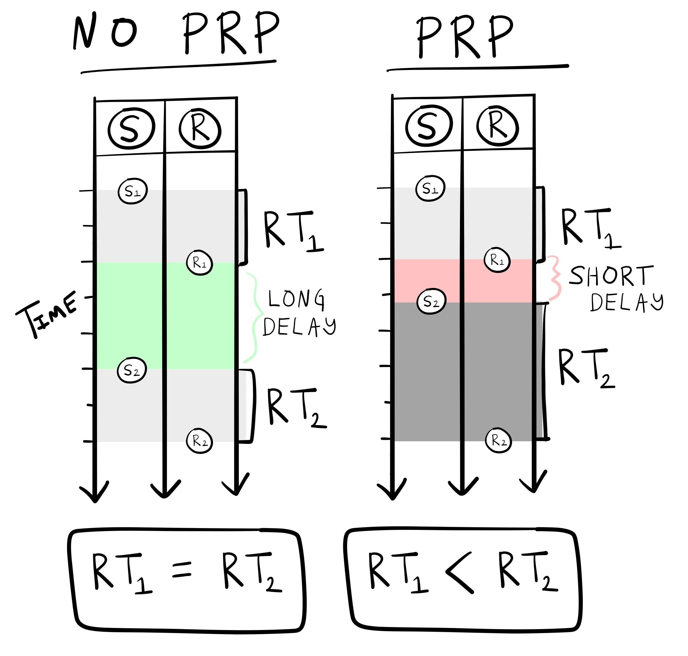

# Information Processing

| Word Count|Reading Time |
|----------:|:------------|
|       4176|20.9 minutes |

## Overview

This chapter overviews **information processing** as a concept in cognition. I mentioned at the beginning of this textbook, that Ulrich Neisser ^[who wrote the first textbook called *Cognitive Psychology* in 1967] defined cognition as "all processes by which the sensory input is transformed, reduced, elaborated, stored, recovered, and used" [@neisserCognitivePsychology1967]. Neisser's definition embraces the information processing tradition in cognition. Sensory input contains "information" about the world, and cognition is characterized as the "processing" of that information. However, just like there were many forms and ideas about behaviorism, there are different forms and ideas about information processing in cognition. We will examine the notions of *processing stages*, *information*, and *capacity limitations*, which became popular research topics around the 1950s and 60s.

Some alliterative themes about cognitive research are also introduced. We begin the chapter with the *four Rs*: a theme suggesting that explanations in cognition are guided by metaphors to technological revolutions throughout history. In the main body, we look at information processing stages in cognition in terms of an assembly-line metaphor from the industrial revolution. Then, we examine newer perspectives on information processing inspired by computational metaphors from the digital revolution. At the end of the chapter I introduce the *four Ms*: Metaphor, Mechanism, Method, and Multiplicity. Cognitive psychology is full of metaphors for cognitive mechanisms, packed with different methods, and although it can be collected under a title like "Cognitive psychology", it can also be viewed as a multiplicity, rather than a mono-dimensional research enterprise with unitary goals.

## Four Rs: Industrial, Technological, Digital, and Cognitive Revolutions

"Revolution" is used to describe periods in history where some innovation led to dramatic changes in society. For example, the [industrial revolution](https://en.wikipedia.org/wiki/Industrial_Revolution) in Western Europe and America involved creating large-scale machines and factories to mechanize the means of production; and, is identified as launching the world into an unprecedented period of sustained growth (e.g., population growth, socio-economic growth). The [second industrial revolution](https://en.wikipedia.org/wiki/Second_Industrial_Revolution) (AKA technological revolution), brought the introduction of electricity, telephones for communication, planes, trains, and automobiles for transportation, and new systems for infrastructure like sewage and water supply networks. Eras associated with the introduction of technology are also described in terms of ages, like the [machine age](https://en.wikipedia.org/wiki/Machine_Age), [atomic age](https://en.wikipedia.org/wiki/Atomic_Age), [jet age](https://en.wikipedia.org/wiki/Jet_Age), [space age](https://en.wikipedia.org/wiki/Space_Age). A more recent revolution was the [digital revolution](https://en.wikipedia.org/wiki/Digital_Revolution) involving introduction of computer technology, which led into the [information age](https://en.wikipedia.org/wiki/Information_Age). According to wikipedia, the next age could be the [imagination age](https://en.wikipedia.org/wiki/Imagination_age), where computer technology will allow for an immersive virtual reality experience, and the economy will be primarily driven by "imagination work" ^[¯\_(ツ)_/¯].

Psychologists use "revolutionary" terms to describe historical periods of research in psychology. For example, the "cognitive revolution" generally refers to the period of experimental psychology following "radical behaviorism". The figurative imagery implies that "cognitive psychologists" rebelled and overthrew the "behaviorist orthodoxy", but there was no abrupt transition. The elements of the so-called "cognitive revolution" are less obvious, and cognitive and historical psychologists debate the meaning of the term [@millerCognitiveRevolutionHistorical2003;@greenwoodUnderstandingCognitiveRevolution1999;@sperryImpactPromiseCognitive1993].

I juxtapose the technological revolutions in relation to cognition primarily for metaphorical purposes. As I will describe briefly in the next section, metaphors are very commonly used to describe how cognition works. We will use technological revolutions as metaphors to describe concepts of "information processing" in cognition. 

### Assembly-line metaphor of cognition

::: floatright50

**A crayon assembly line**

<iframe src="https://www.youtube.com/embed/ZQ_MEFVx5jM" title="YouTube video player" frameborder="0" allow="accelerometer; autoplay; clipboard-write; encrypted-media; gyroscope; picture-in-picture" allowfullscreen></iframe>
:::

A major innovation of the industrial revolutions was the introduction of machines and factories to automate production. These are physical devices that process and transform raw materials into other refined states, that are further transformed and or assembled into goods or final products. For example, a factory assembly-line for making crayons involves successive processing stages, such as: heating wax in vat, coloring and stirring the liquid, filtering, pouring and drying and forming the wax into malleable rolls, extruding the rolls of colored wax through perforated metal plates (with holes the size of crayons), drying the newly formed crayons, and placing them in machines to wrap and package them. The assembly-line metaphor is also used in cognition, and refers to the idea that there are separate stages of processing that transform the "raw materials" of sensation into the "final products" of cognition and action.

### Computer metaphor of the mind

A major innovation of the digital revolution was the introduction of computing technology. The rise of the computer sciences also occurred in tandem with the growth of modern cognitive psychology. For example, the "[cognitive sciences](https://en.wikipedia.org/wiki/Cognitive_science)" are considered an interdisciplinary discipline with major contributions from and cross-fertilization of ideas between cognitive psychology, computer science, philosophy, linguistics, neuroscience and anthropology. Like the factory assembly line, computers have been used as prominent metaphors for cognition. Across this and remaining chapters we will encounter several different computer metaphors for cognition. Sometimes cognitive theories are very literal with the metaphor, and cognition is broken down into parts resembling actual physical components of a digital computer. In other cases, cognition is described in terms of more abstract computational processes and algorithms rather than concrete components.

<!--
This could go in the modeling chapter?

The behaviorists we just finished reading about successfully squeezed in the study of behavior as a topic of inquiry in its own right. They did this by criticizing mentalism on one side for being unscientific (lacking objectivity and too metaphysical); but, they also had to contend with physiologists on the other side. Physiology was not lacking objectivity-- there were liquids, organic tissues, and electrical impulses that could be readily observed. The behaviorists sought to legitimize the objective study of behavior at a macroscopic level, while conceding that physiological processes were obviously causing the behavior at a microscopic level. In distinguishing between behavioral and physiological levels of analysis, behaviorism also made a case against needing to justify itself in terms of lower-level mechanisms. For example, Skinner's system had no mechanisms for any of the behaviors in the system. There were no physical counterparts to reflex strength, or to a reflex reserve. These were not mechanisms, they were just terms he used in his descriptive system. Skinner chose terms that loosely referred to physical entities, but did not extend the metaphors any further. Notably, Skinner argued that the goal was not to explain the mechanisms of behavior, but instead to control and manipulate behavior, and his system was capable of doing that without referring to mechanisms.

-->

## The mechanization of cognition

Our first metaphorical theme is between cognition and machines in the industrial revolution. We have already seen examples of the metaphor. For example, Descartes likened human and animal physiology to a complicated plumbing machine, like the one he saw in the royal gardens. However, Descartes was a dualist who argued that the biological machine of the human body was merely a receptacle for psychic forces. Nevertheless, he inspired physiological psychology and modern neuroscience, which have the aims of explaining cognitive processes in terms of their physical/bio-chemical substrates. 

Machines offer a reductive perspective on explanation, where the goal is to explain how the parts of a machine work together to produce the behavior of the machine. Man-made machines are physical contraptions whose actions obey the known physical laws of the universe, and whose various states are determined by how the machine is assembled and connected together. Presumably, the person(s) who put a machine together in some sense understood the machine well enough to put it together and make it work. At the same time, I don't know every detail of how much of the technology I use in daily life works. However, I assume that someone can explain how my phone works. Similarly, if humans encountered an alien technology, and no human knew how it worked, then I would guess that many people would attempt to "[reverse-engineer](https://en.wikipedia.org/wiki/Reverse_engineering)" the machine to figure out how it works. Reverse-engineering involves de-constructing an existing machine into its constituent parts to figure out how the machine works. For that matter, humans and animals are space creatures living on the planet earth, and research in psychology and neuroscience is attempting to "reverse-engineer" how our biological machines work.

Machines set a compelling standard for explanation, especially if the standard is to demonstrate explanation by successfully manufacturing a working machine. For example, if the inner workings of the machine of cognition can be "explained" to this standard, then along with other technology, cognition could be manufactured and innovated upon. By analogy, this could include ways to repair, restore, and preserve cognition, as well as create new ways for cognition to work and function. As with the prospects of behavioral engineering, cognitive technologies also raise a host of ethical questions. 

At the same time, psychology does not always have the goal of achieving a machine-based explanation. For example, some of the behaviorists in the previous chapter deliberately side-stepped mechanistic explanations as a goal. For example, Skinner acknowledged that behavior was ultimately rooted in physical mechanisms, but he argued that behavior itself could also be studied at a macroscopic level, without referring to it's microscopic mechanisms. He sometimes used terms that loosely referred to mechanisms. For example, a "reflexes" had "strength", and were emitted after some "impulse" reached a "threshold". All of these terms could refer to various physical mechanisms; however, Skinner was careful to say that none of them were intended to refer to any real mechanism. They were simply abstract and arbitrary terms in his system that he could have chosen different names for. As a result, many components of Skinner's theory were not intended to be explained at a lower-level. 

For example, you might ask, how does an impulse surpass a threshold and trigger a reflex, what is the mechanism? In Skinner's system this question could be viewed as incoherent by definition. He defined those terms not to have any reference to physical mechanisms. Of course, it is possible to wonder about what physiological mechanisms do give rise to the behaviors in Skinner's descriptive system, but the investigation of such mechanisms was not in the same domain as behaviorism.

In my view, behaviorists had an awkward relationship with mechanistic explanations. They were critical of domains that lacked mechanisms, such as mentalistic and introspectionist psychology; but, also carefully avoided having to describe mechanisms for their domain of psychology. Instead, they were content with terms that had metaphorical connotations of mechanisms, as long as the terms were operationally defined and useful for a descriptive system of behavior.

As we step past the behaviorist era in to the cognitive one, we will see a shift in explanatory style from purely descriptive systems to a greater emphasis on mechanistic lines of questioning and mechanistic accounts of cognitive processes. This shift sometimes involves actual physical mechanisms in the brain, body, and environments; but, the shift also involves usage of metaphorical mechanisms. Metaphorical mechanisms may sound like an oxymoron, but they are very common in science. The general strategy is first to find a simple model system that is "like" a more complicated system under investigation; and then use the simple model as a "metaphor" to describe or generate insights about the more complicated system.

## Donders' Processing Stages

Up to this chapter we have traced a line through psychology from Galton in 1865 to the period of behaviorism. There are several other starting points we could have chosen. For example, in the same year, 1865, Dutch Physiologist F. C. Donders presented behavioral experiments on human reaction times to support the beginnings of a mechanistic theory of cognitive operations [@kosterPreface1969]. I will characterize Donders work as using an assembly line metaphor of cognition. In an assembly line, raw material is sent from one stage of processing to another, and a product is formed at the end of the whole process. In cognition, sensory input is the raw material that is transformed in successive stages of processing. In an assembly-line, each stage of processing does a particular job, and takes an amount of time. Similarly, in cognition, Donders assumed that there were individual stages of processing (for different jobs of cognition), and that each job took some amount of time. He developed a method for identifying different stages of cognitive processing and estimating how long each of them took to complete. His was work was translated into English with the title, "On the speed of mental processes" [@dondersSpeedMentalProcesses1868].

### Donders mental chronometry and processing stages

Donders was a physiologist and impressed with emerging work on the speed of nerve conduction. Earlier physiologists (Johannes Muller) said the velocity of nerve conduction could be infinitely fast, or unknowable. But, in 1849, [Hermann von Helmolz](https://en.wikipedia.org/wiki/Hermann_von_Helmholtz), succeeded in measuring nerve transmission speeds in a frog in the range of 24-36 metres per second.

The empirical observation that nerve conduction was not infinitely fast was very important for Donders. As a physiologist he assumed that thinking processes of the mind were controlled by organs in the brain. If the exchange of signals in the nervous occurred infinitely fast, he assumed that processes of thought might also occur infinitely fast. However, the discovery that nerves had physical properties limiting how fast they conducted signals suggested to Donders thoughts might have some measurable speed, so he set out record the speed thought. 

### Physiological reaction time 

First, Donders pointed to the concept of physiological reaction time, which came first from astronomy [@canalesExitFrogEnter2001]. Astronomers made observations about locations of heavenly bodies in the sky, and entered positional coordinates and times of observations about those bodies into their record books. Different observatories around the world would share records. Theories of planetary motion could be tested by comparing the predictions about where planets should be at different times, to the recorded data about where planets were observed to be at different times. There were discrepancies between theory and data. Astronomer Adolphe Hirsch wondered how much of the discrepancies were due to human error. Some of the human observers might have slightly faster perceptions than other human observers, and this could introduce error into the entries they made into the astronomical records. Hirsch set out to measure each observers "physiological" reaction time.

Imagine you are an astronomer about to look at star through a telescope. As soon as the light from the star hits your eyeball, how long will it take for you to be able to react to the light? Donders called this "physiological time" in reference to the time it would take for the light stimulus to be transduced through the eye into nervous activity that would eventually lead to a muscle. Hirsch had already developed methods to precisely measure an individuals "physiological reaction time", and used those measures to correct the astronomical records from human error. Donders had a different usage for the method. He wrote:

> "The idea occurred to me to interpose into the process of the physiological time some new components of mental action. If I investigated how much this would lengthen the physiological time, the would, I judged reveal the time required for the interposed term."

### Donders mental reaction times

Donders conducted many human reaction time experiments using tactile, visual and auditory stimuli. All of the experiments used a similar method. A subject was presented with a stimulus, and they responded to the stimulus as quickly and accurately as possible. Donders measured reaction times, which was defined as the amount of time between the onset of the stimulus and a subsequent response. Note, reaction times continue to be used in cognitive psychology, and their definition remains the same.

A basic question was whether different sense organs had different physiological reaction times. But, Donders was more interested in the additional "mental" time it might take to perform increasingly complex tasks before making a response to the stimuli. The tasks that Donders used to increase complexity are still widely used. In the remaining description of Donders work, I will use the modern terms for the tasks, and present a generic summary of Donders findings and conclusions. 

::: floatright25

:::

The most basic reaction time task is called a *simple reaction time task*. In this task, subjects are presented with a stimulus, and asked to respond to as quickly as possible, as soon as they detect it. Donders would consider the reaction times from this task as "physiological reaction times".

::: floatright25

:::

Donders invented the idea of having subjects perform a slightly more complicated task that is now referred to as the *GO-NO GO* task. In this task, subjects are presented with a stimulus, but they only make a response if the stimulus is the target stimulus. For example, one might see a blue or red stimulus, and the response would be required only if the stimulus was blue (a GO response). No response would be required if the stimulus was red (a NO GO trial).

::: floatright25

:::

An even more complicated version of the task is referred to as an *alternative forced-choice task*. For example, a subject could be asked to respond to a blue stimulus by pressing a left button, and to respond to a red stimulus by pressing a right button. This would be called a 2-AFC (two-alternative forced choice) task, or a choice reaction time task.

### Donders subtractive stage logic

Donders used subtraction of reaction times between tasks to estimate the speed of mental operations. He assumed that mental operations occurred in successive stages like an assembly line, and that each stage took an average amount time. 

The fastest reaction time should be the physiological time given by the simple reaction time task. This one involved a minimum of mental processing. Reaction times should increase in length if mental processing had to occur before a response was made. 

For example, the GO-NO GO task should produce a longer reaction time than the simple reaction time task. This is because the task requires an additional mental operation of stimulus identification. In the GO-NO GO task, the stimulus must be identified as the target stimulus before a response is made. 

If it took 170 milliseconds to make a response in the GO - NO GO task, and 150 milliseconds to make a response in the simple reaction time task, Donders took the difference of 20 milliseconds (by subtraction 170-150 = 20) to indicate the time taken by the mental operation. In this example, Donders might say the mental process of identification takes 20 milliseconds. 

The subtraction logic could be applied to infer the times associated with subsequent stages of processing. For example, reaction times in a two alternative forced choice task (2AFC) are longer than in a GO-NO GO task. Following Donders logic, a 2AFC task involves yet another mental operation, *response selection*. For example, in this task the stimulus must be identified before a response is made, and then the correct response (e.g., right or left) must be selected before the final response is made. The stage of stimulus identification is assumed to occur before the subsequent stage of response selection.

But, by subtracting the reaction time in the 2AFC task, from the reaction time in the GO-NO GO task, Donders argued that the amount of time for response selection could be separated from the amount of time for stimulus identification.

## Beyond Donders

It has been $2021 - 1865 = 156$ years since Donders proposed subtraction logic to measure stages of mental processing time. What happened to research using human reaction times, the concept of processing stages, and his subtraction method over that period of time?

### Reaction time research

The measurement of reaction times to make inferences about cognitive processes became widespread, and remains a very common measurement tool in cognition. For example, we already discussed Cattell's associative reaction time research from 1886, which was clearly inspired by Donders. In 1890, Jastrow reviewed the promising uses of reaction time methods in psychology in a book called, *Time relations of mental phenomena* [@jastrowTimerelationsMentalPhenomena1890]. Reaction times would be used throughout every decade to study cognitive processes in humans, even throughout the behaviorist period. We will continue to discuss reaction time research throughout this chapter and others.

### Processing Stages

Donders concept of mental processing stages disappeared for a while during the behaviorist era. Although some behaviorists (like Tolman and Hull) were willing to speculate about intervening processes between a stimulus and response, other forms of behaviorism were not interested in whatever mental operations might be taking place. As a result, the possibility that there was a mental processing stage for stimulus-identification, response-selection, or other mental operations, was not of scientific interest.

The concept of processing stages came back in different ways, and we will see more examples in the chapters on memory and attention. As a historical sidenote, Donders ideas become popular again in cognition roughly 100 years after his publication. His centenary was celebrated at the second [Attention and Performance](http://www.attentionandperformance.org) conference in 1968, held in the Netherlands. This invited-speaker conference series still runs today, and publishes books containing the papers presented at the conference. Many of the articles from the early conference years established a role for the concept of processing stages in cognition. One example to mention briefly is the [psychological refractory period](https://en.wikipedia.org/wiki/Psychological_refractory_period).

#### PRP: Psychological Refractory Period

British psychologist A. T. Welford drew attention to the *Psychological Refractory Period* in a 1952 paper [@welfordPsychologicalRefractoryPeriod1952, see also @welfordEvidenceSinglechannelDecision1959]. In the preceding war years a great deal of basic research on human reaction times was conducted for the war effort. For example, the ability to make a quick reaction could be important for a pilot. As a result, empirical studies were conducted to identify useful information about human reaction times. Useful information could include how to make reactions more efficient, or to discover limitations in reaction times that could be addressed. For example, if people are pressing buttons or flicking switches in a cockpit, how should the cockpit be designed to improve the speed and accuracy of the responses?

Welford observed the psychological refractory period from existing reaction time research, and discussed possible explanations of the finding in terms of processing stages. The basic PRP effect was that responding to one stimulus can sometimes delay a response to second stimulus, especially if they are presented quickly, one after the other. 

::: floatright50

:::

The conditions to observe the PRP effect are depicted on the right. In the task, participants are presented with stimuli (S) one after the other, and they asked to response (R) as fast as possible to each of them (e.g., by pressing a button). The long-delay  condition highlights an important difference between two successive stimuli. In this case, the second stimulus ($S_2$) appears after a long temporal delay following the response ($R_1$) to the first stimulus $S_1$. When this delay is long enough, the average reaction time to the first and second stimulus are generally the same ($RT_1 = RT_2$). However, when the delay is shortened, the PRP effect is observed. What happens in performance is that the average reaction time to the second stimulus is longer than the average reaction time to the first stimulus ($RT_1 < RT_2$). This lengthening of the second response time is an example of the so-called "psychological refractory period".

The PRP effect is a reliable finding in reaction time research, and since Welford hundreds of papers have been published on the phenomena. Note, as we move forward, we will discuss many findings like the PRP effect that have inspired large numbers of research papers. The term *paradigm* is commonly used to refer to collections of research activity that are relatively focused on specific phenomena or tasks. For example, we could refer to the maze-running research discussed last chapter as a paradigm using the task of maze-running. The PRP paradigm is full of papers testing explanations of the PRP phenomena. My purpose in bringing up the PRP literature is not for us to become experts in this one phenomena; instead, the PRP effect provides a clear example of the metaphorical use of processing stages to provide a quasi-mechanical explanation of the phenomena.

So, why does the PRP effect occur? Why is the second response time lengthened if the second stimulus is presented shortly after a previous response? In 1959, Welford described five different theoretical accounts. One possibility was a physical explanation in terms of limitations of signalling among nerve fibres. Another theory had to do with preparedness or expectancy, maybe the shorter duration caused people to be more surprised, and it was the surprise that lengthened the second response. The fifth hypothesis involved a *central mechanism with a single-channel of limited capacity*, and was summarized as follows [@welfordEvidenceSinglechannelDecision1959]:

> "In its bare essentials this theory assumes, firstly, a number of sensory input mechanisms each capable of receiving data and storing it for a limited period so that, for example, a short series of signals can be received as a unit. Secondly, it assumes a number of effector mechanisms containing both central and peripheral elements and capable of carrying out a series of actions such as the pressing and release of a key or a series of taps (Vince, 1949) as a single unit. Thirdly, between these two it postulates a single-channel decision mechanism. This is regarded as being of limited capacity in the sense that it takes a finite time to process information and can thus only deal with a limited amount of information in a given time."

The mechanism being proposed was like the processing stages of a serial assembly-line. A stimulus is first processed in the perceptual stage, and then moved to the next central processing stage. The central processing stage produces the decision to make a response to the stimulus. This decision is sent to a response production stage, and the response is made. Furthermore, the central processing stage was claimed to be "capacity limited". For example, what if it could only deal with one decision at a time? This would create a *bottleneck* in performance. If a second stimulus entered the central stage it would have to *wait in line* until the decision to respond to the first stimulus was sent to the next stage.

Welford and others (Craik [@craikTheoryHumanOperator1948], Hick [@hickDiscontinuousFunctioningHuman1948], Davis [@davisHumanOperatorSingle1957], Fraisse [@fraissePeriodeRefractairePsychologique1957], and Broadbent [@broadbentMechanicalModelHuman1957,@broadbentPerceptionCommunication1958]) were part of a new wave of researchers proposing mechanistic metaphors, in the form of *information processing channels* as explanations for cognitive operations. The second half of this chapter elaborates on the bigger ideas behind those proposals.

### Subtractive logic

Donders subtractive logic is nifty idea, but it doesn't necessarily produce correct inferences about cognitive operations. One issue is the distinction between *serial and parallel* processing. If the intervening mental operations between a stimulus and response really do work like a simple *serial* assembly-line, then the subtractive logic can work quite well. In this case, the mental operations occur one after another in series. In this case the total reaction associated with a task involving two or more mental operations (that occur in serial stages), can be inferred by subtracting reaction times from tasks involving one fewer mental operation. However, the serial assembly line is just a metaphor, people don't really have serial assembly lines in their head (although sometimes their behavior can be usefully interpreted that way). A major problem occurs for subtractive logic if operations can be completed in parallel (e.g., at the same time). Another problem occurs if the stages are unpredictable, and therefore it does not make sense to subtract times that are not constants. 

To address some of the inferential problems with subtractive for making inferences about putative processing stages, Saul Sternberg introduced another method called *additive-factors logic* [@sternbergDiscoveryProcessingStages1969a]. Finally, subtractive logic became commonly used in neuro-imaging research to find areas of brain activity that appear unique to specific task demands. [@alexanderDondersDeadCortical2015].

<!-- general issues with the metaphor 

- appeals to mechanism
- assembly lines do things in order, and each stage takes time...the subtractive logic does apply to orderly assembly lines
- what if cognition is not so orderly?
- Does the interpretation of what a task might logically involve force a conclusion that about stages of processing? Do stages of processing actually exist, or are they convenient metaphors? 

-->

## The computerization of cognition

## Shannon's Information Theory

<!-- cybernetics, macy conference 

slow squeezing out of eugenics (still of interest to some of the researchers)
interdisciplinary

-->

## Hick-Hyman Law

## Miller's Magic number 7

## Four Ms: Metaphor, Mechanism, Method, and Multiplicity

E.g., if people are responding to "information" in the stimulus, how are they doing it? What is the mechanism how does it work?

