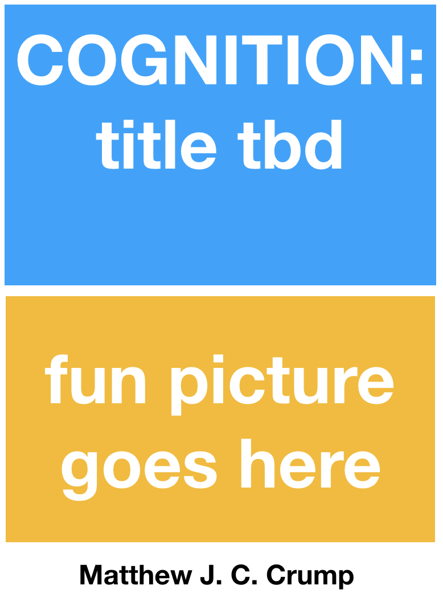

--- 
title: Instances of Cognition
subtitle: Findings, Explanations, Applications, and Implications
author: "Matthew J. C. Crump"
site: bookdown::bookdown_site
titlegraphic: "imgs/cover.png"
description: An introduction to cognitive psychology and open educational resource
documentclass: crumpbook
classoption:
  - oneside
  - '12pt'
bibliography: CogPsyTextbook.bib
csl: apa-fullnote.csl
link-citations: yes
---

# Welcome {-}

 This is an open-educational textbook and set of course materials for an introductory undergraduate course in cognition. **Presently these materials are under development**, with an anticipated first draft ready for Fall 2021.
