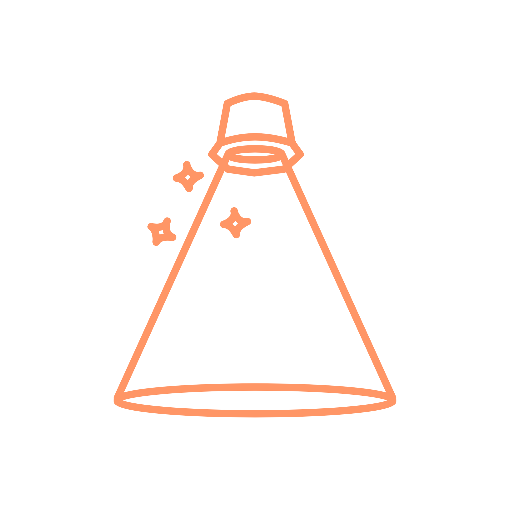
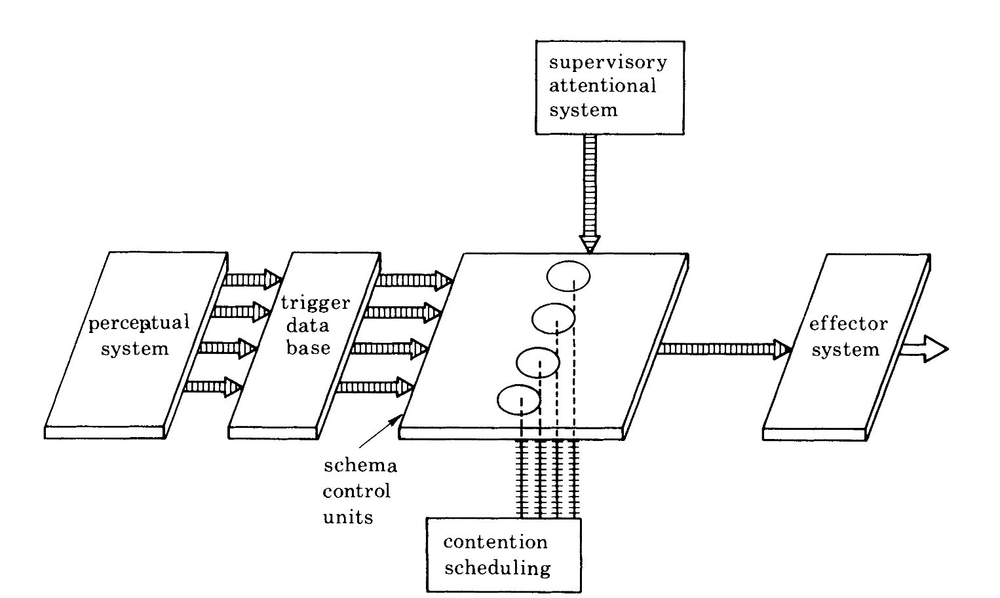
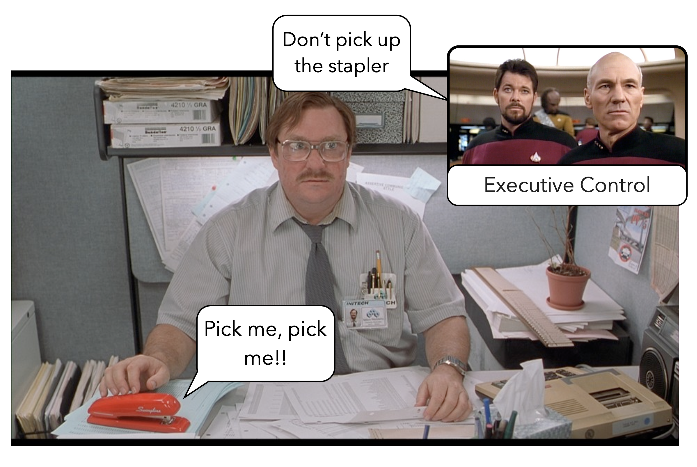
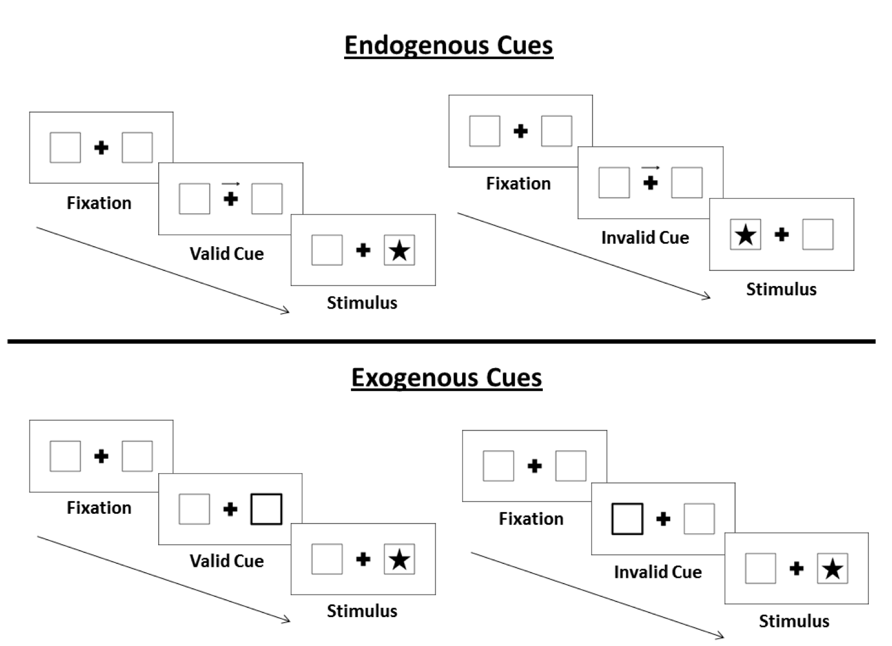
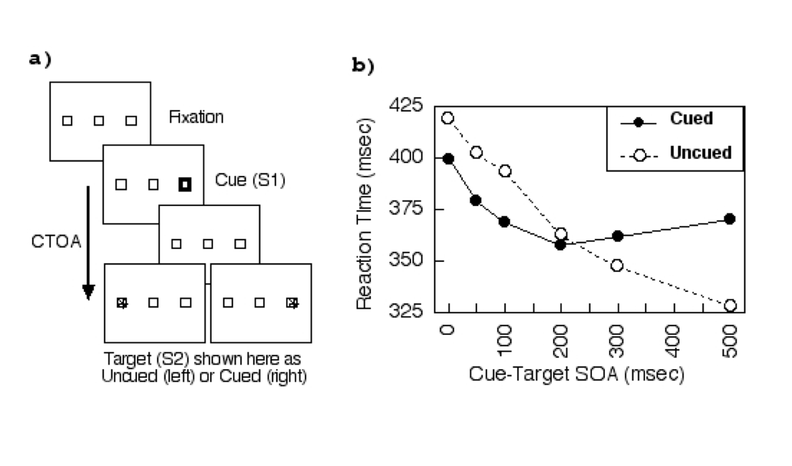
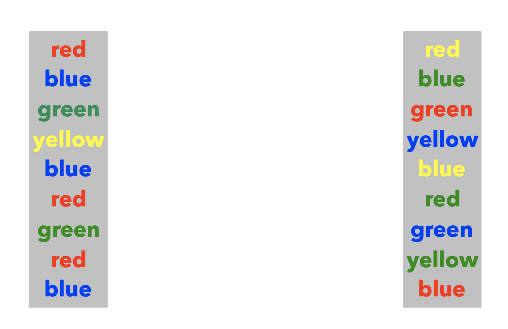
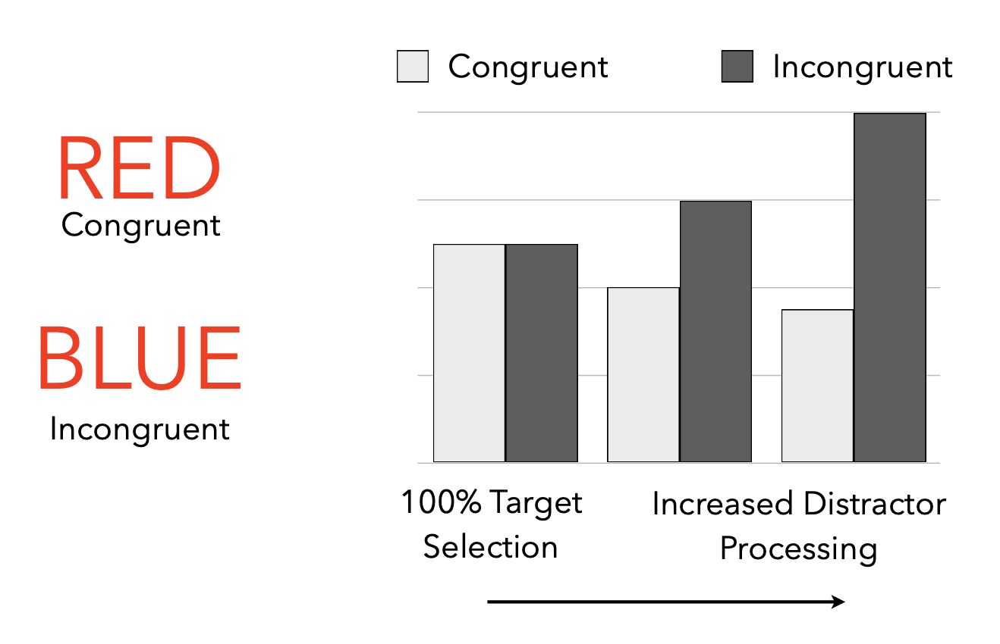
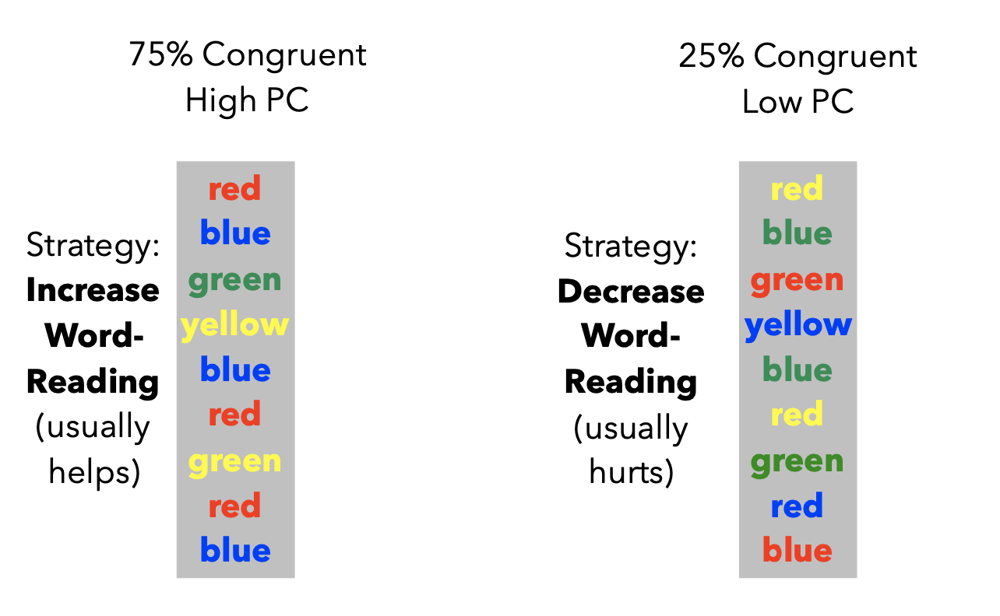
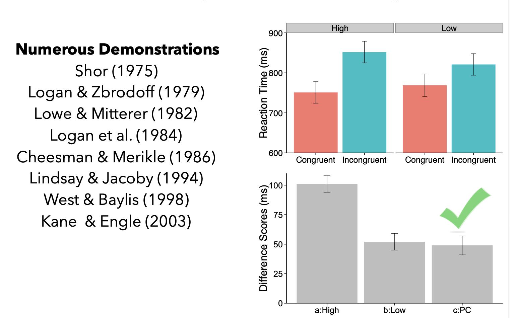
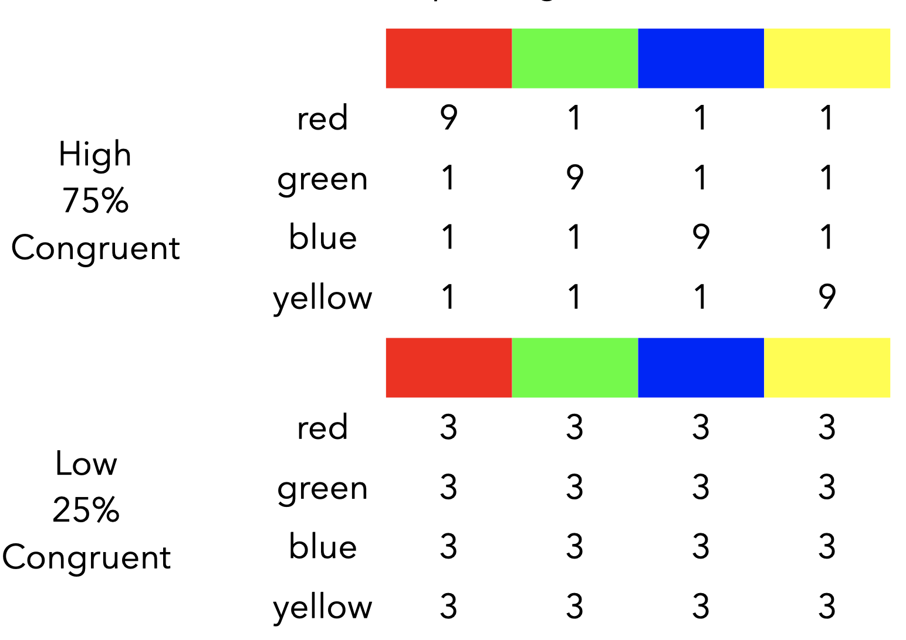

```{r setup, include=FALSE}
knitr::opts_chunk$set(echo = FALSE,
                      fig.align = "center",
                      out.width = "80%")
library(fontawesome)
```

# Reminders from last class

There are no textbook chapter readings for this learning module.

#  Roadmap

::: {.pop_box_2} 
1 Attentional Concepts and Phenomena
:::
::: {.grey_box} 
2 Stroop Effect
:::
::: {.grey_box} 
3 Class Experiment
:::

# What is Attention?

> Everybody knows what attention is... - William James

# What is Attention?

- How we prioritize our mental resources
- How we select relevant from irrelevant information
- How we focus
- How we ignore

# Metaphors of attention

There are different perspectives on the kinds of processes that are involved in attention abilities

Theories of attention use a variety of metaphors

# Spotlight Metaphor

:::: {.row}
::: {.col-md-6}

>- Attention acts like a spotlight

>- Attention shines "extra" cognitive resources on selected information

>- Attention highlights attended information

:::

::: {.col-md-6}

```{r}

```

:::
::::

# Filter Metaphor

:::: {.row}
::: {.col-md-6}

>- Attention acts like a filter

>- Attention prevents unwanted information from further cognitive processing

:::

::: {.col-md-6}

```{r}

```

:::
::::

# Attentional Distinctions

:::: {.row}
::: {.col-md-6}

**Endogenous Attention**

>- Internal "orienting" of attention
>- Voluntary decision to attend to some information and not others

:::

::: {.col-md-6}

**Exogenous Attention**

>- External "orienting" of attention
>- Some stimuli automatically cause people to attend to them (e.g., loud noises)

:::
::::


# Controlled vs automatic influences

:::: {.row}
::: {.col-md-6}

**Controlled**

>- Effortful
>- Voluntary
>- Deliberate
>- usually resource limited
>- slow

:::

::: {.col-md-6}

**Automatic**

>- Effortless
>- fast, rapid, ballistic
>- Involuntary

:::
::::

# Attentional Theory

There are multiple theoretical frameworks for understanding attention 

>- (see additional reading on blackboard for a review)
>- Strayer, D. A., & Drews, F. A. (2007). Attention. In F. T. Durso (Ed.), Handbook of Applied Cognition (2nd Edition, p. 26). John Wiley & Sons, Ltd.


# Attention to Action

Norman and Shallice's **Attention to Action** theory 

```{r, out.width="75%"}

```

::: {.smaller_25}
Figure from Shallice, T. (1982). Specific Impairments of Planning. Philosophical Transactions of the Royal Society of London. Series B, Biological Sciences, 298, 199–209.


:::

# S-R learning and Supervisory Attention

```{r}

```


# Attention tasks and phenomena

>- Researchers devise laboratory tasks that require attentional processing

>- Measures of task performance are used to demonstrate phenomena of attention, and to test theories of attention

# Some Attentional phenomena

>- [Cocktail party effect](https://en.wikipedia.org/wiki/Cocktail_party_effect)
>- [Utilization Behavior](https://en.wikipedia.org/wiki/Utilization_behavior)
>- [Change Blindness](https://en.wikipedia.org/wiki/Change_blindness)

# Visual Search and pop-out

```{r}
knitr::include_graphics("imgs/visual_search.png")
```

# Change Blindness

<iframe width="560" height="315" src="https://www.youtube.com/embed/EARtANyz98Q" title="YouTube video player" frameborder="0" allow="accelerometer; autoplay; clipboard-write; encrypted-media; gyroscope; picture-in-picture" allowfullscreen></iframe>

# Attentional Cuing

>- What are the consequences of attending to something?

>- How can we measure what attention does to information processing?

# Posner Cuing task

```{r}

```

# Inhibition of Return

```{r}

```


#  Roadmap

::: {.grey_box} 
1 Attentional Concepts and Phenomena
:::
::: {.pop_box_2} 
2 Stroop Effect
:::
::: {.grey_box} 
3 Class Experiment
:::

# Selective Attention

>- The ability to "selectively" focus or process task-relevant information 
>- and ignore or avoid processing task-irrelevant information
>- Selective attention abilities are commonly studied in congruency tasks, like the Stroop Task

# Stroop Effect

```{r}

```

# Measuring Selective Attention

```{r}

```

# List-wide proportion congruent

```{r}

```

# List-wide proportion congruent results

```{r}

```

# Explanation

>- What processes are responsible for the list-wide proportion congruent effect?

>- Strategic Account
>- Learning Account

# Strategic Account

Participants can predict congruency of upcoming trial

>- 75% congruent-> Prepare in advance of trial to attend to word dimension (because it is easy and fast)
>- 25% congruent -> Prepare in advance of trial to ignore word dimension 

# Learning Account

:::: {.row}
::: {.col-md-6}

>- Some Stroop items are presented more than others
>- RTs are faster for more frequent (more practice) than less frequent items

:::

::: {.col-md-6}

```{r}

```

:::
::::


# Processing accounts

>- Voluntary Strategies

>- Simple stimulus-response learning

#  Roadmap

::: {.grey_box} 
1 Attentional Concepts and Phenomena
:::
::: {.grey_box} 
2 Stroop Effect
:::
::: {.pop_box_2} 
3 Class Experiment
:::

# Testing Voluntary Control

Let’s conduct an in-class experiment on the Stroop experiment

# Question

Can people voluntarily control how they attend to word-information?

# Logic

>- If people can choose to ignore word information then the Stroop effect should get smaller

>- If people can increase their focus on word information then the Stroop effect should get larger

# Instructional Manipulation

:::: {.row}
::: {.col-md-6}

**IGNORE WORD** Instructions

>- Tell people to **ignore** word information while they do a Stroop task

:::

::: {.col-md-6}

**FOCUS on WORDS** Instructions

>- Tell people to **focus** on word information while they do a Stroop task

:::
::::

# Predictions

>- What do we predict will happen?
>- What would our results look like in a graph?


# Let's try it out

Click this link to participate


# What's next

Take the quiz and complete any additional assignments

Next week is the second last module of the term, on langauge


