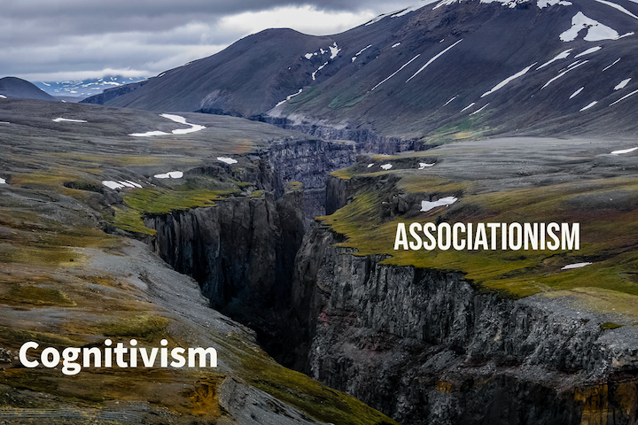
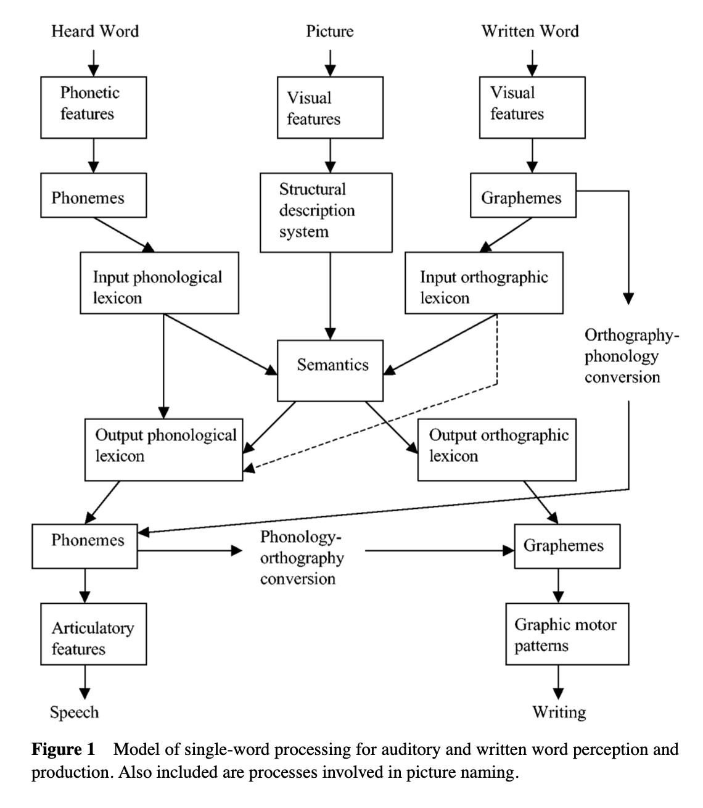
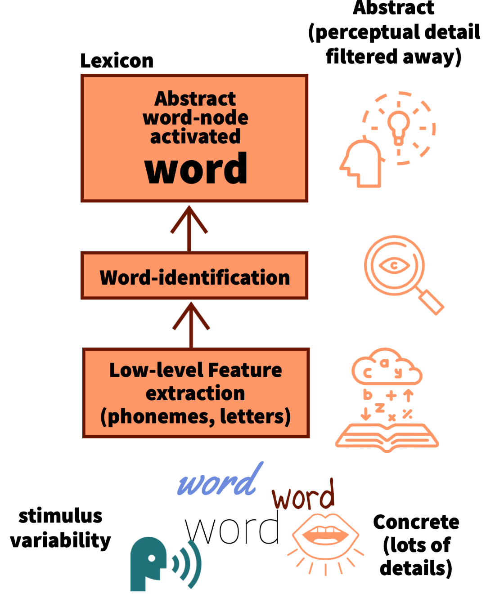
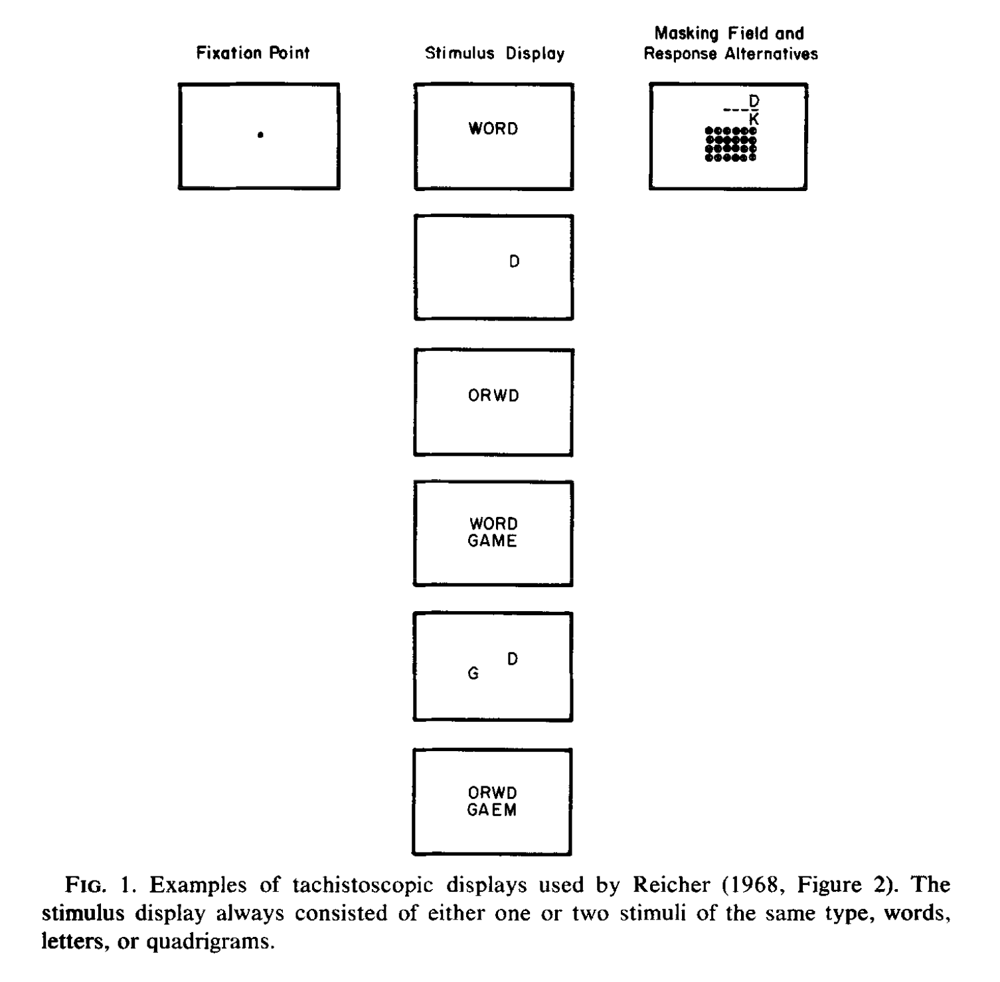
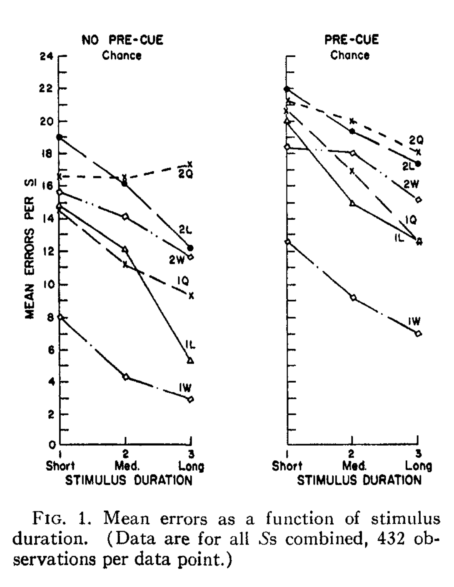
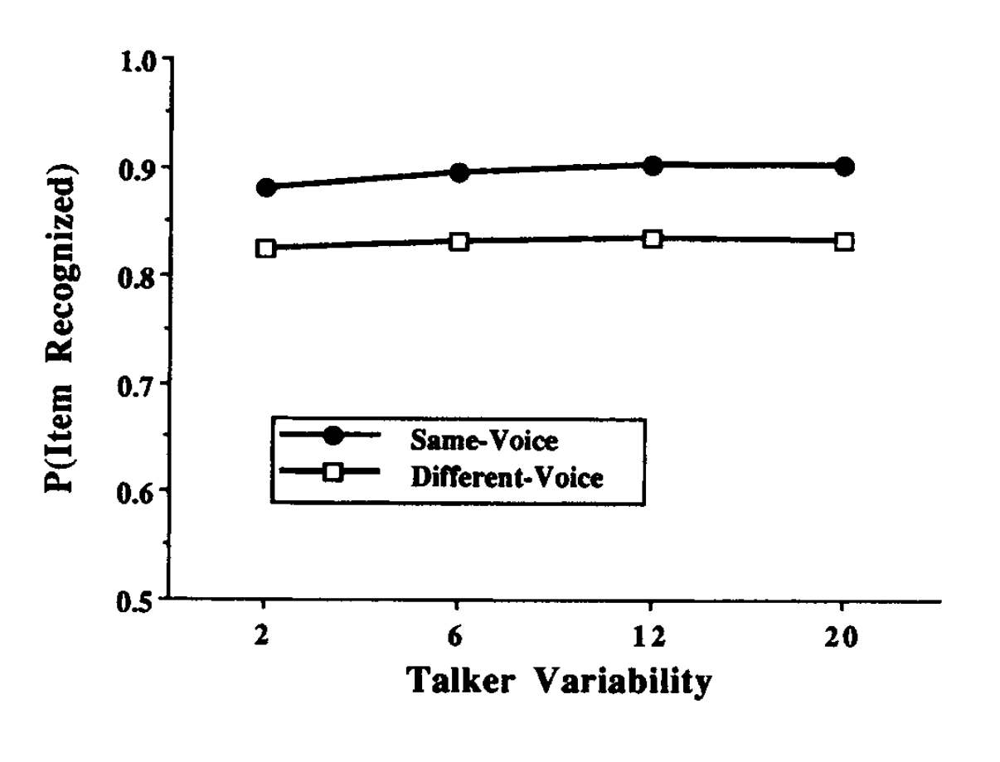

```{r setup, include=FALSE}
knitr::opts_chunk$set(echo = FALSE,
                      fig.align = "center",
                      out.width = "80%")
library(fontawesome)
```

# Reminders from last class

There are no textbook chapter readings for this learning module.

Assigned empirical article is on blackboard

>- Stasenko, A., & Gollan, T. H. (2019). Tip of the tongue after any language: Reintroducing the notion of blocked retrieval. Cognition, 193, 104027. https://doi.org/10.1016/j.cognition.2019.104027

# {data-background-image="imgs/language.jpg"}

# What is Language?

:::: {.row}
::: {.col-md-6}

>- Language is a big topic
>- Much too big to cover in one mini-lecture

>- Currently available as a download from google scholar...

:::

::: {.col-md-6}

```{r}
knitr::include_graphics("imgs/Yule.png")
```

:::
::::

# Cognitive psychology of Language

>- Cognition researchers are interested in understanding how language abilities work.

>- Research has generated numerous theories about how language might work

>- and, has discovered numerous phenomena that could be relevant to understanding how language works

# {data-background-image="imgs/debate.jpg"}

# General vs. Special processing Theories

A major debate has focused on general vs. special processing theories of language

:::: {.row}
::: {.col-md-6}

**General Process**

Language abilities are mediated by general cognitive processes (perception, attention, learning, memory, motor control)

:::

::: {.col-md-6}

**Special Process**

Language abilities are mediated by specialized processes that are unique to language

:::
::::

# Skinner and Chomsky

Psycholinguistists and the cognitive psychology of language emerged in the 1950s and 1960s as a part of the "cognitive revolution"

The transition from behaviorism to cognitivism is exemplified by dueling perspectives from B. F. Skinner and Noam Chomsky

## Skinner's Verbal Behavior

:::: {.row}
::: {.col-md-6}

>- 1957, Skinner publishes [Verbal Behavior](https://en.wikipedia.org/wiki/Verbal_Behavior)
>- Applies his behaviorist approach to language
>- Optimistic that behaviorist principles could be used to predict and control language behavior

:::

::: {.col-md-6}

```{r}
knitr::include_graphics("imgs/VerbalBehavior.jpg")
```

:::
::::

## Chomsky's Book review

:::: {.row}
::: {.col-md-6}

>- In 1959, Noam Chomsky [reviewed Skinner's book](https://chomsky.info/1967____/)
>- Argued that language abilities are too complex to be described by functional analysis
>- Argued that language results from inborn cognitive processes that need to be understood

:::

::: {.col-md-6}

```{r}
knitr::include_graphics("imgs/chomsky.jpg")
```

:::
::::

# A rift

:::: {.row}
::: {.col-md-6}

>- Many cognitive models of language invoke specialized processes

>- General associative learning and memory explanations of language were "associated" with Behaviorism

>- Since the 1950s, there has been several advances on both sides

:::

::: {.col-md-6}


```{r, out.width="100%"}

```


:::
::::


# Specialized processing theories

>- Chomsky's Transformational Grammar

>- Information Processing stage models

## Chomsky's Transformational Grammar

> Language is a process of free creation; its laws and principles are fixed, but the manner in which the principles of generation are used is free and infinitely varied. Even the interpretation and use of words involves a process of free creation

## Surface and deep structure

>- **Surface structure**: that part of a sentence that can be segmented and labeled by conventional parsing

>- **Deep structure**: an underlying form that contains information necessary for meaning

>- **Transformational grammar**: the laws that govern the transformation of one structure into another

## Example system of transformation

Math is a system of transformation

>- $A=B$ is the same as $B=A$
>- $4x=8$ is the same as $x=8/4$

>- In these examples, the surface form of the equations are different, but the deep meaning of the equations is the same

## Transformational grammar is a hypothesis

>- Transformational grammar assumes there is a kind of "math" for language
>- We can generate and understand many different surface forms for the same expressions (different sentences can have same meaning)
>- Therefore, we must have a process that allows us to compute the deep structure that equates the surface forms. This process realizes the transformational grammar, and somehow knows the rules for transformation

## Innateness

>- **Chomsky's controversial claim**: Essential components of language are innate, and hard-wired (not learned).
>- Particular grammars are not innate, but humans possess an innate schema for information processing specific for language


# Information Processing stage models

:::: {.row}
::: {.col-md-6}

>- Stage models describe language as a coordinated network of individual specialized sub-systems for inputting and outputting language related information

::: {.smaller_25}
Martin, R. C. (2003). Language Processing: Functional Organization and Neuroanatomical Basis. Annual Review of Psychology, 54(1), 55–89. https://doi.org/10.1146/annurev.psych.54.101601.145201

:::


:::

::: {.col-md-6}

```{r, out.width="100%"}

```

:::
::::

# Lexical Abstraction Assumptions

:::: {.row}
::: {.col-md-6}

>- Stage theories assume feature abstraction
>- Words come in many perceptual formats
>- Words activate abstract concepts
>- Perceptual details are lost across processing stages 


:::

::: {.col-md-6}

```{r, out.width="100%"}

```

:::
::::

# Problems for stage theories

:::: {.row}
::: {.col-md-6}

Assumptions of stage models can be tested with experimental data:

>- Feed-forward processing
>- loss of perceptual detail

:::

::: {.col-md-6}

```{r, out.width="100%"}
knitr::include_graphics("imgs/giphy.gif")
```


:::
::::

# Language Phenomena

>- Word  Superiority Effect
>- Memory for speaker voices

# Word Superiority Effect

:::: {.row}
::: {.col-md-6}

>- How does pattern recognition for words and letters work?

>- Stage model suggests bottom-up order: basic visual features, then letters, then words


:::

::: {.col-md-6}

```{r, out.width="100%"}

```

:::
::::

## Word Superiority Effect

**Question:** Does letter recognition depend on context?

>- Reicher, G. M. (1969). Perceptual recognition as a function of meaningfulness of stimulus material. Journal of Experimental Psychology, 81(2), 275–280. https://doi.org/10.1037/h0027768

>- Wheeler, D. D. (1970). Processes in word recognition. Cognitive Psychology, 1(1), 59–85. https://doi.org/10.1016/0010-0285(70)90005-8


## Method and results

:::: {.row}
::: {.col-md-6}

```{r}

```


>- Letter recognition is enhanced when the letter appears in the context of a word compared to alone or in other non-word contexts
:::

::: {.col-md-6}

```{r}

```

:::
::::

## Implications

>- If word recognition depends on an earlier stage of letter recognition, why would letters be better recognized in the context of words than non-word contexts?

>- Could word-level recognition occur before letter recognition?
>- What stage of processing is performance in the task measuring?

# Memory for Speaker Voice


:::: {.row}
::: {.col-md-6}

>- People can effortlessly hear words spoken by different people with different sounding voices

>- Some stage models assume a **speaker normalization** stage that converts different voice sounds into standardized abstract features to activate each spoken word


:::

::: {.col-md-6}

```{r, out.width="100%"}

```

:::
::::

## Question

>- What happens to memory for perceptual details of spoken words?

:::: {.row}
::: {.col-md-6}

**Speaker Normalization hypothesis**:

People should not be able to remember details of what words sounded like, because the language processing system eliminates perceptual details during normalization

:::

::: {.col-md-6}

**General memory perspective**

People can encode and retrieve many details of their experiences...this should apply to how words sounded when they were encoded

:::
::::

## Recognition memory for spoken words

>- Palmeri, T. J., Goldinger, S. D., & Pisoni, D. B. (1993). Episodic encoding of voice attributes and recognition memory for spoken words. Journal of Experimental Psychology: Learning, Memory, and Cognition, 19(2), 309. https://doi.org/10.1037/0278-7393.19.2.309

## Methods

>- Participants listened to 300 spoken words
>- Each word spoken twice
  >- Half spoken by same voice
  >- Half spoken by different voice
  
>- Test was recognition memory for each word

## Results

:::: {.row}
::: {.col-md-6}

>- Memory was better for words spoken in the same versus different speaker voice

:::

::: {.col-md-6}

```{r}

```

:::
::::

## Implications

>- Findings are consistent with a role for general learning and memory processes in word processing

# General vs. Special processing Theories

A major debate has focused on general vs. special processing theories of language

:::: {.row}
::: {.col-md-6}

**General Process**

Language abilities are mediated by general cognitive processes (perception, attention, learning, memory, motor control)

:::

::: {.col-md-6}

**Special Process**

Language abilities are mediated by specialized processes that are unique to language

:::
::::

# General learning and memory theories

>- Computational models of semantic knowledge have been successfully built from general learning and memory principles

>- Jamieson, R. K., Johns, B. T., Vokey, J. R., & Jones, M. N. (2022). Instance theory as a domain-general framework for cognitive psychology. Nature Reviews Psychology. https://doi.org/10/gpd7zt

>- LSA, BEAGLE, HAL, ITS, Word2Vec

# Modelling semantics

>- Train model on a large corpus of text (millions of sentences) to approximate human experience
>- Model extracts statistical associations about how words co-occur in context with other words
>- Most recent language models (GPT-3) can perform remarkably well on language tasks

# Open AI DEMO

# Tip of the Tongue

>- Stasenko, A., & Gollan, T. H. (2019). Tip of the tongue after any language: Reintroducing the notion of blocked retrieval. Cognition, 193, 104027. https://doi.org/10.1016/j.cognition.2019.104027


# What's next

Take the quiz and complete any additional assignments

Next week is the last module of the term on Judgment and Decision-making.


