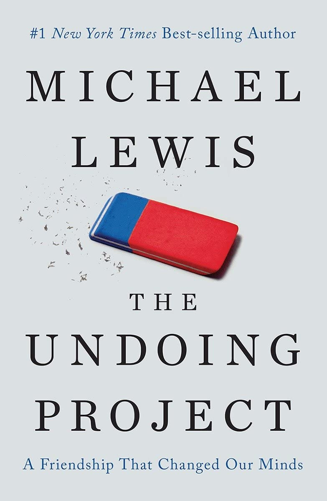
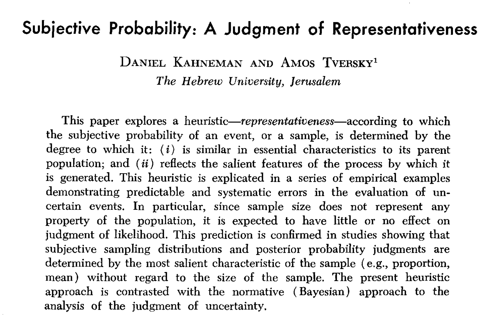
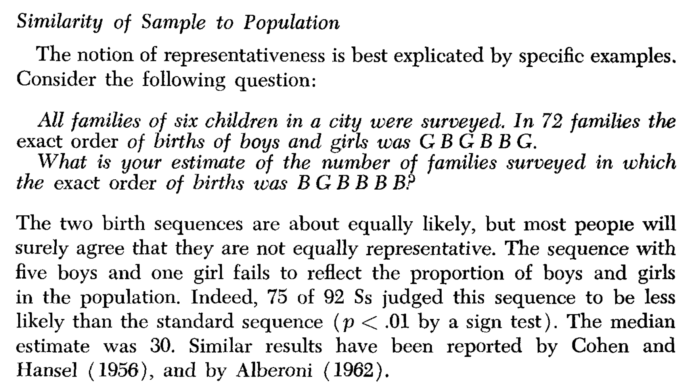
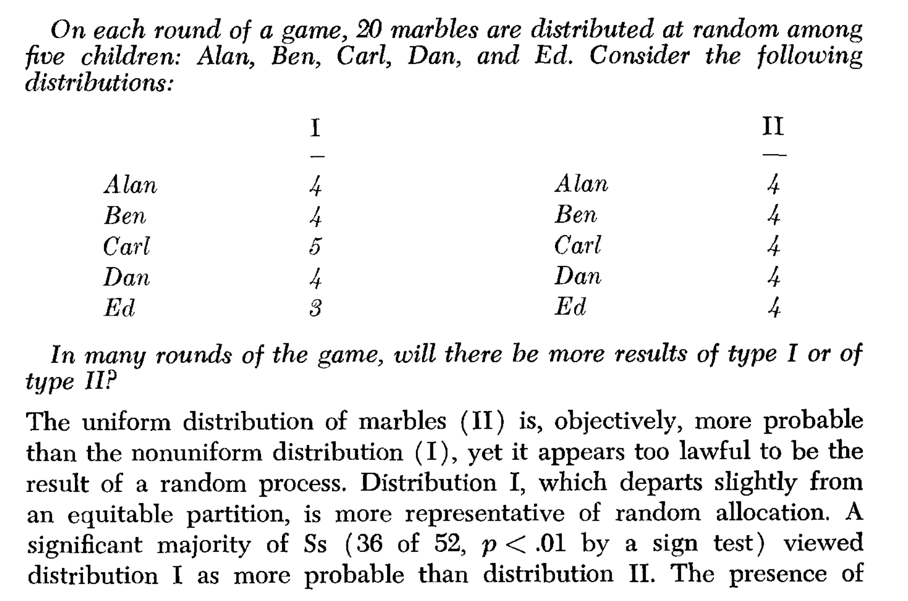
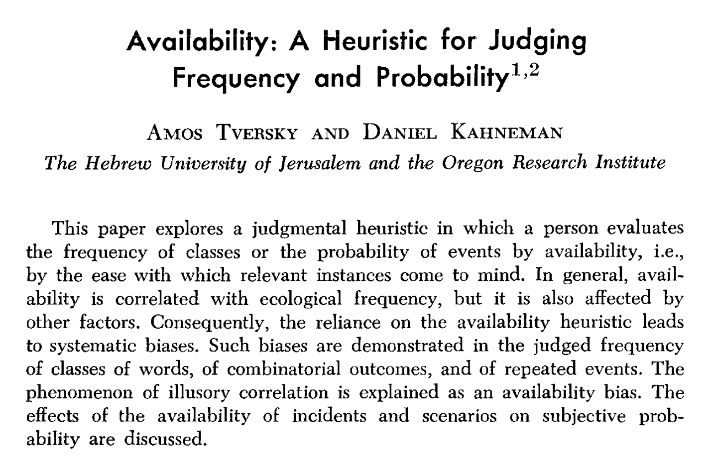
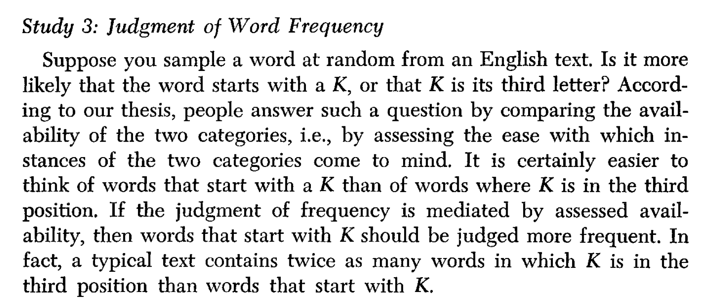
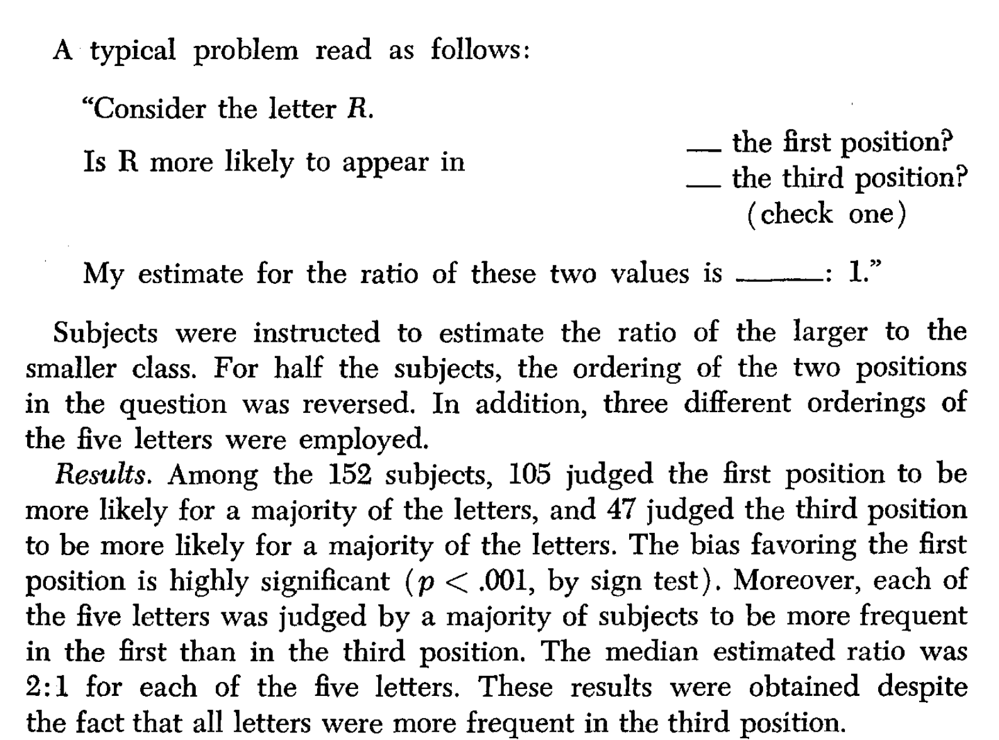
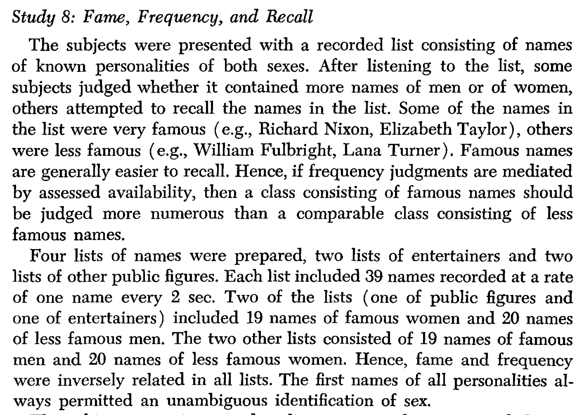
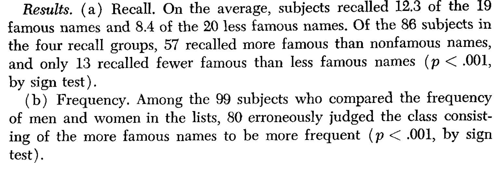
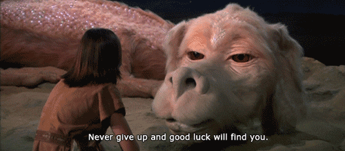

```{r setup, include=FALSE}
knitr::opts_chunk$set(echo = FALSE,
                      fig.align = "center",
                      out.width = "80%")
library(fontawesome)
```

# Reminders from last class

There are no textbook chapter readings for this learning module.

Assigned empirical article is on blackboard

>- Shen, O., Rabinowitz, R., Geist, R. R., & Shafir, E. (2010). Effect of Background Case Characteristics on Decisions in the Delivery Room. Medical Decision Making, 30(4), 518–522. https://doi.org/10.1177/0272989X09353451


# {data-background-image="imgs/JDM.jpg"}

# Judgment and Decision-making questions

>- How do people judge, evaluate, and assess information in their environment?
>- How do people make choices?
>- What influences peoples judgments and decisions?

# Everyday examples

How do you go about making judgments and decision in everyday life?

:::: {.row}
::: {.col-md-6}

::: {.fragment}
**Buying a new X**

>- Research options on the web
>- Watch informative youtube videos
>- Ask friends
>- list pros and cons
>- buy the one that is right for you

:::

:::

::: {.col-md-6}

::: {.fragment}

**Buying a new Y**

>- had a spur of the moment feeling
>- liked the thing
>- bought it for no good reason

:::

:::
::::

# Distinctions

Judgments and decisions can be made in more or less controlled ways

:::: {.row}
::: {.col-md-6}

**Controlled**

>- Slow, effortful
>- Deliberate
>- Employs a reasoning process

:::

::: {.col-md-6}

**Automatic**

>- Fast, easy
>- potentially unconscious
>- habitual

:::
::::

# Cognitive Biases

There are many biases that shape our judgments and decisions 

>- Check out the wikipedia [list of cognitive biases](https://en.wikipedia.org/wiki/List_of_cognitive_biases)

# Issues with Cognitive Biases

>- Useful to be aware of potential biases to our personal judgment and decision making processes
>- Biases are not necessarily bad or wrong
>- Biases can reflect the operation of basic cognitive processes

# Heuristics

>- Rules of thumb that give close approximations

>- Availability Heuristic
>- Representativeness Heuristic

# A tale of two papers

>- Kahneman, D., & Tversky, A. (1972). Subjective probability: A judgment of representativeness. Cognitive Psychology, 3(3), 430–454. https://doi.org/10.1016/0010-0285(72)90016-3

>- Tversky, A., & Kahneman, D. (1973). Availability: A heuristic for judging frequency and probability. Cognitive Psychology, 5(2), 207–232. https://doi.org/10.1016/0010-0285(73)90033-9

# Kahneman & Tversky

:::: {.row}
::: {.col-md-4}

```{r}

```

:::

::: {.col-md-4}

```{r}
knitr::include_graphics("imgs/fast_slow.jpg")
```

:::

::: {.col-md-4}

```{r}

```

:::
::::

# Judgments of frequency and probability

>- How many words do you know?
>- What are the chances you will receive more than two calls from a telemarketer today?

>- How do people make judgments of frequency and probability?

# Kahneman and Tversky (1972)

```{r}

```

# Big Question and Idea

>- **Question:** How do people judge frequencies and probabilities?

>- **Idea:** People use heuristics that are usually good approximations

>- **Representativeness heuristic**: People judge frequencies and probabilities of events, or sample, based on:
   >- similarity to parent population
   >- whether the event has salient stereotypical features
   
# Logical implications

>- If people use the representativeness heuristic, then decisions about frequency and probability should be biased by representative examples

# Empirical Demonstrations

>- Kahneman and Tversky (1972) presented several examples where simple judgments about frequency and probability were biased by representativeness

# Similarity of Sample to Population

```{r}

```

# Looking more random

```{r}

```


# Tversky & Kahneman (1973)

```{r}

```

# Big Question and Idea

>- **Question:** How do people judge frequencies and probabilities?

>- **Idea:** People use heuristics that are usually good approximations

>- **Availability heuristic**: People judge frequencies and probabilities of events, or sample, based on:
   >- how easy particular examples can be brought to mind
   >- more available instances are thought to be more likely
   
# Logical implications

>- If people use the availability heuristic, then decisions about frequency and probability should be biased by availability
>- people should also be sensitive to self-assessments of availability

# Empirical Demonstrations

>- Tversky and Kahneman (1973) presented several examples where people were sensitive to availability, and where availability biased judgments of frequency and probability

# Assessments of Availability 1

**Question**: Are people sensitive to their own ability to generate examples?

**Method**: Show participants 9 letters (TAPCERHOB or XUZONLCJM)

>- **Estimate condition:** How many words can you make in 2 minutes
>- **Construct condition:** Make as words as you can in 2 minutes

**Result**: Very high positive correlation between estimate and actual number of words generated

# Assessments of Availability 2

**Question**: Are people sensitive to their own ability to generate examples?

**Method**: Generate items from categories (flowers, Russian novelists)

>- **Estimate condition:** How many examples can you generate in 2 minutes
>- **Construct condition:** Generate as many examples as you can in 2 minutes

**Result**: Very high positive correlation between estimate and actual number of examples generated

# Inference so far

>- People appear to be sensitive to example availability

>- People can quickly estimate whether they can produce many or few examples

>- Estimates of availability correlated well with how many examples people actually produced

# Judgment of Word Frequency

```{r}

```

# Results

```{r}

```

# Fame, Frequency and Recall

```{r}

```

# Results

```{r}

```

# General Takeaway

>- Cognitive processes such as learning and memory can influence judgment and decision-making
>- Basic memory processes make some examples easier to bring to mind, and people can be biased by the examples they are thinking about


# Cognitive Biases

Try the optional writing assignment for this learning module as a way to explore more cognitive biases

>- Check out the wikipedia [list of cognitive biases](https://en.wikipedia.org/wiki/List_of_cognitive_biases)

# Read the empirical paper

>- Shen, O., Rabinowitz, R., Geist, R. R., & Shafir, E. (2010). Effect of Background Case Characteristics on Decisions in the Delivery Room. Medical Decision Making, 30(4), 518–522. https://doi.org/10.1177/0272989X09353451


# What's next

Take the quiz and complete any additional assignments

This is the last learning module of the semester!

The final exam will occur during final exam week, see blackboard for more information

# Congratulations

First, give yourself a congrats for getting this far in the course:

```{r}

```

# Clapping for you

I was really impressed with your hard work and thoughtful reactions to the writing assignments

```{r}

```

# Last Words

I hope to meet y'all in person, keep up the hard work, and all the best in your future endeavors!!

```{r}

```


