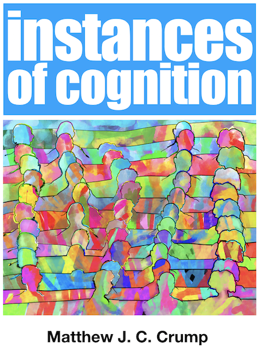

```{r setup, include=FALSE}
knitr::opts_chunk$set(echo = FALSE)
library(fontawesome)
```

## Roadmap

### 1. What this course is about? {.bolder}

### 2. Course Resources {.greyout}

### 3. Syllabus and Logistics {.greyout}

### 4. Questions {.greyout}


## What is Cognition?

::: {.bigger}
1. Questions
2. Methods
3. Findings
4. Explanations
5. Applications
6. Implications
:::

## Cognitive Questions...

What kinds of questions about cognition are researchers asking and seeking answers to?

1. How do you remember what you ate for breakfast? 
2. How do you remember something that happened when you were a kid? 
3. How do you learn a language? 
4. How do you know how to say a sentence? 
5. How do you think your next thought? 
6. How do you imagine things? 
7. How do you learn new skills, like walking, riding a bike, playing a musical instrument, playing a sport, or a game?
8. How do you learn new information, and how can you study more efficiently? How do you recognize peoples faces? 
9. How do you know a tree is a tree and not some other object? How do you make plans for the future? 
10. Do you have an inner voice and if so how do you use it? 
11. How do you make decisions in your daily life?
12. and, many more similar questions

## Roadmap

### 1. What this course is about? {.greyout}

### 2. Course Resources {.bolder}

### 3. Syllabus and Logistics {.greyout}

### 4. Questions {.greyout}


## Course Resources

::: {.bigger}
1. Blackboard
2. Course Website
3. Textbook
:::

## Blackboard

We will use blackboard for:

1. Online lectures with Blackboard Collaborate
    - lectures will be recorded, and rewatched
2. Course Announcements
    - Make sure your email is up to date
3. Quizzes, assignments, and exams
4. Links to material on course website

## Course Website

We will also use an external course website:

<https://www.crumplab.com/cognition/>

1. Most current Syllabus
2. Links to textbook
3. Lecture slide decks
4. Other resources as needed

## Course Textbook

:::: {.row}
::: {.col-md-6}

The textbook is:

1. A free open-educational resource
2. Web-book, available as pdf and epub
3. Still in progress...

:::

::: {.col-md-6}

```{r, out.width="50%"}

```


:::
::::

## Using the textbook

Chapters from the textbook will be assigned as readings for each week.

See the [schedule in the syllabus](https://www.crumplab.com/cognition/articles/course_docs/Fall_2021_Psyc_2530_syllabus.html#course-structure-1) for each week's assigned readings. 

## Contributing to the textbook

I am writing this textbook as an open-educational resource, which means that other people can copy, edit, re-use, re-mix and help improve the textbook.

There may be opportunities for you to help improve the textbook as a part of bonus assignments for this course. Details forthcoming across the semester.

## Other resources

Throughout the semester additional reading material may be assigned. Any additional material will be made available for free through blackboard or the course website

## Roadmap

### 1. What this course is about? {.greyout}

### 2. Course Resources {.greyout}

### 3. Syllabus and Logistics {.bolder}

### 4. Questions {.greyout}


## A regular slide with a list

The following items are important:

1. This thing
2. Another thing, that is this
    - here are some additional sub points
    - and another one
3. A third thing, is this one
    -  and another things

## Multicolumn Text and a picture

:::: {.row}
::: {.col-md-6}

Here is some text that I would like to say. It is a paragraph of text. Most of the time I would not make a slide with a paragraph. It would be too much text. So, instead of a paragraph. Point form might work better

:::

::: {.col-md-6}


:::
::::

## slide with a link

here is a link <https://crumplab.com>


## Text, quote and picture

:::: {.row}
::: {.col-md-8}

Here is something Auguste Comte said:

> Well, not really, this is just a test quote to see what it would look like if someone said something.

:::

::: {.col-md-4}


:::
::::


## Regular column atop multicolumn

Sometimes you might say something as general concept, like a distinction that has two parts. 

:::: {.row}
::: {.col-md-6}

### Distinction 1

- Has this thing
- This thing
- and this thing

:::

::: {.col-md-6}

### Distinction 2
- Has this thing
- This thing
- and this thing

:::
::::

## Something in the middle {.center .middle}

## regular markdown table

| Syntax      | Description | Test Text     |
| :---        |    :----:   |          ---: |
| Header      | Title       | Here's this   |
| Paragraph   | Text        | And more      |


## R markdown table

```{r}
library(kableExtra)
knitr::kable(head(cars)) %>%
  kable_styling("striped")
```

## {.nocolor}


## No color in the title {.nocolor}

here is some text that I would like to say. It is a paragraph of text. Most of the time I would not make a slide with a paragraph. It would be too much text. So, instead of a paragraph. Point form might work better

## Overview slide

### 1. Big thing one {.bolder}

### 2. Big thing two {.greyout}

### 3. Big thing three {.greyout}

### 4. Big thing four {.greyout}


