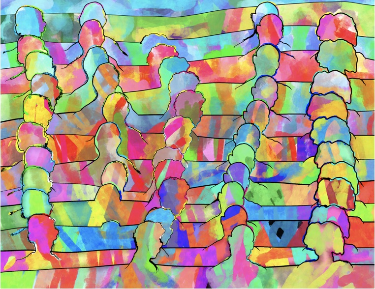

```{r setup, include=FALSE}
knitr::opts_chunk$set(echo = FALSE)
library(fontawesome)
```

## Reminders from last week

Readings are chapter 1 [What is cognition?](https://www.crumplab.com/cognition/textbook/what-is-cognition.html) and 2 [Mental Imagery](https://www.crumplab.com/cognition/textbook/mental-imagery.html) from the textbook.

A quiz will be posted TODAY, August 30th, and open until Sunday, September 12th. It will cover material from the first two chapters, with a focus on the second chapter.

## Roadmap: Instances of Cognition

### 1. Questions of Cognition {.bolder}
### 2. Methods {.greyout}
### 3. Findings {.greyout}
### 4. Explanations {.greyout}
### 5. Applications {.greyout}
### 6. Implications {.greyout}

## Instances of Cognition

```{r, out.width="80%"}

```

## Museum Metaphor

:::: {.row}
::: {.col-md-6}

- Like a museum has many rooms and artifacts, there are a great diversity of ideas, approaches in cognition.

- Museum's are too big to see all in one day, or even a semester, just like cognition

:::

::: {.col-md-6}

```{r, out.width="100%"}
knitr::include_graphics("imgs/Met.jpg")
```


:::
::::

## Tour guide of cognition

```{r, out.width="100%"}
knitr::include_graphics("imgs/the-met_fifth-avenue-map_020516_floor1.jpg")
```

## Questions of Cognition

1. What is cognition?
2. What kind of questions are researchers asking and answering in cognition

## Defining Cognition

:::: {.row}
::: {.col-md-6}

Ulric Neisser defined cognition in 1967 as:

> "...all processes by which the sensory input is transformed, reduced, elaborated, stored, recovered, and used."

This definition is still current, but we will expand on it in this course

:::

::: {.col-md-6}

```{r, out.width="75%"}
knitr::include_graphics("imgs/Neisser_cp.jpg")
```


:::
::::

## Prospects of Cognition

Neisser is also quoted as saying:

> "If X is an interesting or socially important aspect of memory, then psychologists have hardly ever studied X"

Cognition is partly an unfulfilled promise...Lot's of work has been done, there are many more interesting questions to ask...

## Research Questions

Research questions are typically about **how** some cognitive ability works. For example:

1. How do you control body movements, from finger movements to facial expressions? 
2. How do you pay attention or ignore others?
3. How did you forget what you were doing while you were in the middle of doing something? 
5. How do you learn to read, and know the meaning of words? 
6. How can you train your brain to get better at something? 

## Research Domains

Research questions are often grouped into domains of specialization. Some of the textbook chapters are grouped by domain. Some general domains in cognition include:

Learning, Memory, Attention, Perception, Reasoning, Categorization, Concept formation, judgment and decision-making, Language, semantic knowledge, skill-acquisition, music perception, motor control, cognitive control, creativity, emotion...

## Answering research questions?

How do cognitive researchers figure out *how* cognitive abilities work?

```{r,out.width="80%", fig.align="center"}
knitr::include_graphics("imgs/questions.jpg")
```


## METHODS

### 1. Questions of Cognition {.greyout}
### 2. Methods {.bolder}
### 3. Findings {.greyout}
### 4. Explanations {.greyout}
### 5. Applications {.greyout}
### 6. Implications {.greyout}

## The research cycle

:::: {.row}
::: {.col-md-6}

The research cycle involves a wide variety of methods--such as the scientific method--that researchers use to generate knowledge about cognition.

:::

::: {.col-md-6}

```{r, out.width="75%"}
knitr::include_graphics("../../textbook/imgs/The_Scientific_Method.png")
```


:::
::::

## FINDINGS

### 1. Questions of Cognition {.greyout}
### 2. Methods {.greyout}
### 3. Findings {.bolder}
### 4. Explanations {.greyout}
### 5. Applications {.greyout}
### 6. Implications {.greyout}

## EXPLANATIONS

### 1. Questions of Cognition {.greyout}
### 2. Methods {.greyout}
### 3. Findings {.greyout}
### 4. Explanations {.bolder}
### 5. Applications {.greyout}
### 6. Implications {.greyout}

## APPLICATIONS

### 1. Questions of Cognition {.greyout}
### 2. Methods {.greyout}
### 3. Findings {.greyout}
### 4. Explanations {.greyout}
### 5. Applications {.bolder}
### 6. Implications {.greyout}

## IMPLICATIONS

### 1. Questions of Cognition {.greyout}
### 2. Methods {.greyout}
### 3. Findings {.greyout}
### 4. Explanations {.greyout}
### 5. Applications {.greyout}
### 6. Implications {.bolder}

## Questions

## Next week

Readings are chapter 1 [What is cognition?](https://www.crumplab.com/cognition/textbook/what-is-cognition.html) and 2 [Mental Imagery](https://www.crumplab.com/cognition/textbook/mental-imagery.html) from the textbook.

A quiz will be posted on Monday, August 30th, and open until Sunday, September 12th. It will cover material from the first two chapters, with a focus on the second chapter.


