```{r setup, include=FALSE}
knitr::opts_chunk$set(echo = FALSE,
                      fig.align = "center",
                      out.width = "80%")
library(fontawesome)
```

## Reminders

Readings are from chapter 2 on [Mental Imagery](https://www.crumplab.com/cognition/textbook/mental-imagery.html)

##  Roadmap

### 1. Mental imagery and introspection {.bolder}
### 2. Aphantasia and Hyperphantasia {.greyout}
### 3. Imagery and Memory {.greyout}
### 4. The imagery debate and mental scanning {.greyout}

## Mental imagery

Mental imagery is the subjective experience of internal perception-like sensations. Some examples include:

1. Visual imagery, or "seeing" pictures in your mind's eye
2. Auditory imagery, or  "hearing" sounds/music in your head
3. Taste/smell imagery

## Vividness of mental imagery

:::: {.row}
::: {.col-md-6}

In 1880, Sir Francis Galton conducted early research on the vividness of mental imagery.

[Read his original work here](https://archive.org/details/b22462375)

:::

::: {.col-md-6}

```{r, out.width ="100%"}
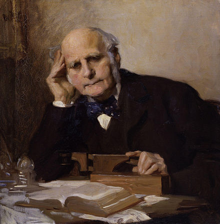
```

:::
::::

## Statistics of Mental Imagery

```{r}
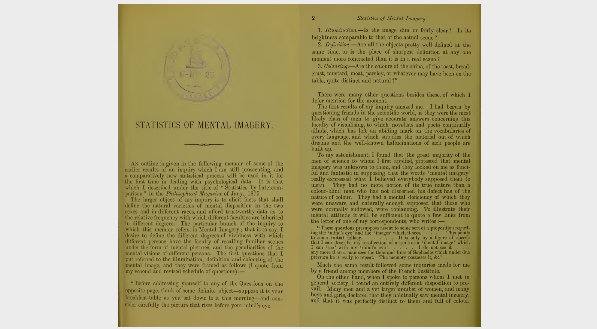
```

## What Galton did...

Galton asked 100 "distinguished men" to describe the vividness of their mental imagery.

He used a "Breakfast table task"...

## Breakfast Table task

> Think of some definite object – suppose it is your breakfast-table as you sat down to it this morning – and consider carefully the picture that rises before your mind’s eye.

1. Illumination. – Is the image dim or fairly clear? Is its brightness comparable to that of the actual scene ?

2. Definition – Are all the objects pretty well defined at the same time, or is the place of sharpest definition at any one moment more contracted than it is in a real scene?

3. Colouring – Are the colours of the china, of the toast, bread-crust, mustard, meat, parsley, or whatever may have been on the table, quite distinct and natural?

## What would you say?

Imagine what you last ate in your mind's eye. How would you rate the vividness of your mental imagery?

1. Extremely vivid, like you are eating it all over again in real life
2. Vivid, you can picture it pretty well
3. Fuzzy, not really life-like, but you can remember it
4. No imagery, not at all life-like, no mental pictures

## What did Galton find?

Galton found a wide range of individual differences in self-reported mental imagery abilities

## Extremely vivid

> Brilliant, distinct, never blotchy.

> Quite comparable to the real object. I feel as though I was dazzled, e.g., when recalling the sun to my mental vision.

> In some instances quite as bright as an actual scene.

## Medium vivid

> Fairly clear, not quite comparable to that of the actual scene. Some objects are more sharply defined than others, the more familiar objects coming more distinctly in my mind.

## Not vivid

> My powers are zero. To my consciousness there is almost no association of memory with objective visual impressions. I recollect the breakfast table, but do not see it.

## Introspection

Galton employed the method of introspection.

Introspection involves "inspecting" and describing the qualities of your own subjective mental experience.

## Titchener's Introspectionism


:::: {.row}
::: {.col-md-6}

E. B. Titchener was an American Psychologist who advocated Introspectionist approaches to answering questions about psychological phenomena.

:::

::: {.col-md-6}

```{r, out.width ="100%"}
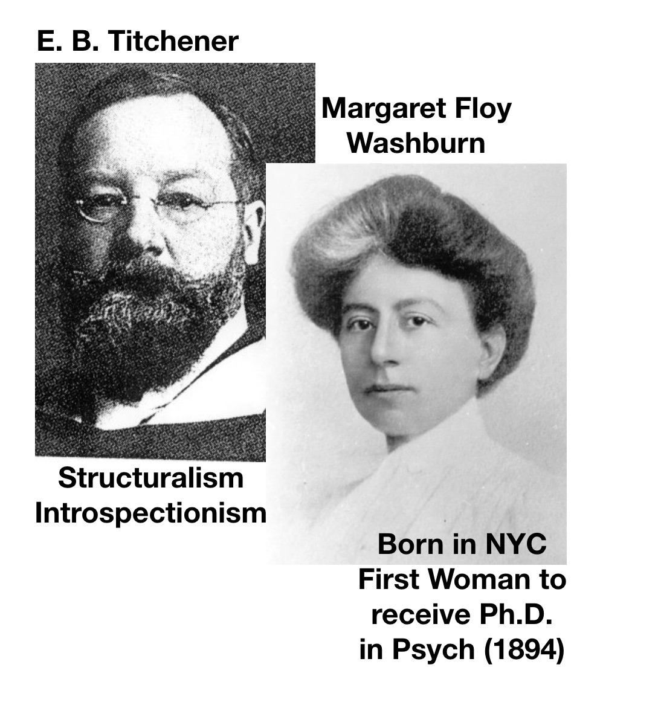
```

:::
::::

## Replicating Galton's findings

In the early 1900s, several American psychologists also measured individual differences in mental imagery using Galton's task, and other kinds of questionnaires.

- they generally found similar results as Galton

## Titchener's questionnaire


French, F. C. (1902). Mental imagery of students: A summary of the replies given to Titchener’s questionary by 118 juniors in Vassar college. Psychological Review, 9(1), 40. https://doi.org/10/cqj438

```{r}
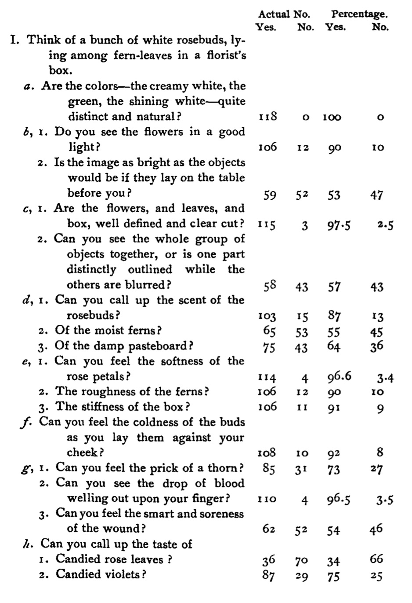
```

## Limitations of Introspectionism?

If you were trying to investigate cognitive abilities, what would be some limitations of introspection?

## Some issues

Common complaints about introspection include:

1. The measure is subjective
2. The measure is not independently observable or easily verifiable
3. People might be lying
4. People might not be able to describe their own mental processes
5. Different descriptions could actually refer to the same experience

## The decline of introspectionism

In American psychology, the method of introspectionism was heavily criticized by Behaviorists, and lost popularity across the early 1900s. 

We discuss the Behaviorist period in chapter 6.

##  Roadmap

### 1. Mental imagery and introspection {.greyout}
### 2. Aphantasia and Hyperphantasia {.bolder}
### 3. Imagery and Memory {.greyout}
### 4. The imagery debate and mental scanning {.greyout}

## Back to the future

Let's fast-forward to mental imagery in the 2010s...

```{r, out.width ="70%"}
knitr::include_graphics("imgs/BTF.gif")
```

## Zeman 2010

```{r}
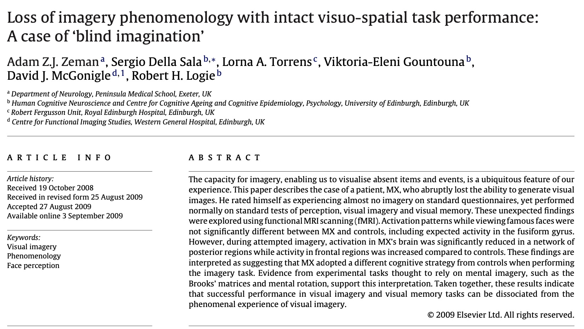
```

## Marks 1973

Zeman and colleagues used an updated questionnaire to measure vividness of mental imagery

```{r, out.width="70%"}
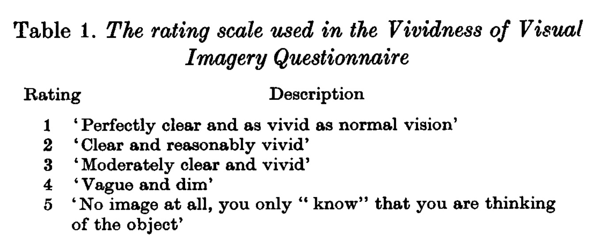
```

## VVIQ items

```{r}
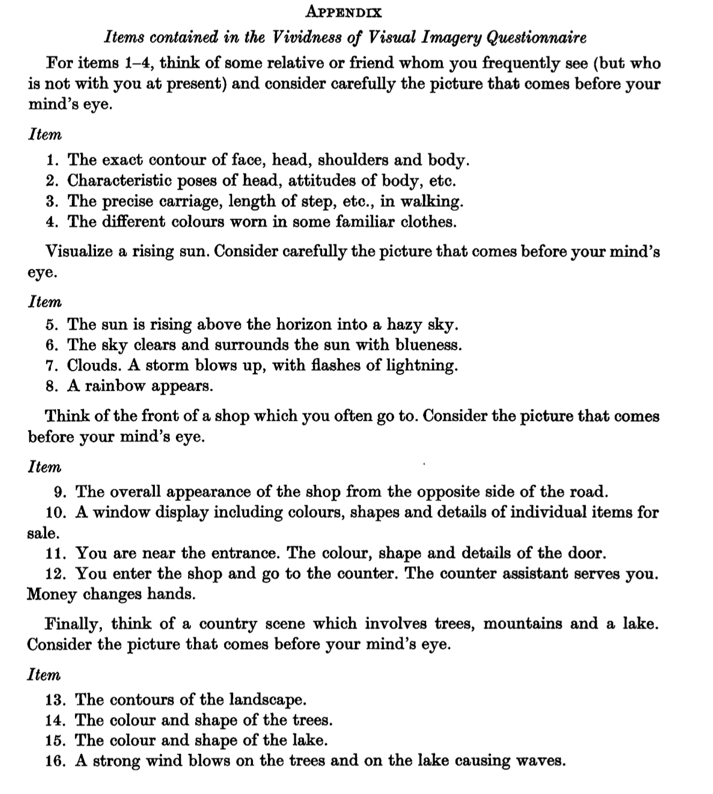
```

## Aphantasia

[In 2015, Zeman and colleagues](https://www.sciencedirect.com/science/article/abs/pii/S0010945215001781?via%3Dihub) described a small group of participants who reported essentially non-existent mental imagery on the VVIQ test.

They coined the phrase "Aphantasia" to refer the condition of experiencing limited or no mental imagery.

## Hyperphantasia

Hyperphantasia refers to the opposite extreme, where people report very vivid and life-like mental imagery

## Media interest

In the past 10 years, Zeman's research is often picked up in the media, and generates popular interest

For example, this work was recently featured in the New York Times <https://www.nytimes.com/2021/06/08/science/minds-eye-mental-pictures-psychology.html>

## Extra-ordinary claims

From the NYT article, 

> Joel Pearson, a cognitive neuroscientist at the University of New South Wales who has studied mental imagery since 2005, said hyperphantasia could go far beyond just having an active imagination. “It’s like having a very vivid dream and not being sure if it was real or not,” he said. “People watch a movie, and then they can watch it again in their mind, and it’s indistinguishable.”

## Aphantasia.com

<https://aphantasia.com>

A website and online community for people interested in aphantasia and hyperphantasia

## Beyond introspection

Questionnaires provide subjective report measurements based on introspection

[Brain imaging techniques](https://en.wikipedia.org/wiki/Neuroimaging) have also been used to provide converging evidence about mental imagery

## Visual imagery and the brain

:::: {.row}
::: {.col-md-6}

[Milton et al., 2021](https://academic.oup.com/cercorcomms/article/2/2/tgab035/6265046)

:::

::: {.col-md-6}

```{r, out.width ="100%"}
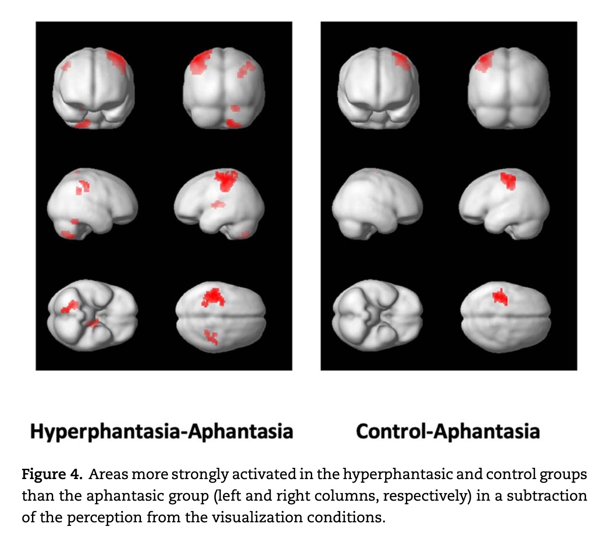
```

:::
::::

## Decoding dreams

Horikawa, T., Tamaki, M., Miyawaki, Y., & Kamitani, Y. (2013). Neural decoding of visual imagery during sleep. Science, 340(6132), 639–642. https://doi.org/10.1126/science.1234330


##  Roadmap

### 1. Mental imagery and introspection {.greyout}
### 2. Aphantasia and Hyperphantasia {.greyout}
### 3. Imagery and Memory {.bolder}
### 4. The imagery debate and mental scanning {.greyout}

## Mnemonics

[Mnemonics](https://en.wikipedia.org/wiki/Mnemonic) are techniques known to help people retain information

Mental imagery has been used as a mnemonic device

## Method of Loci


:::: {.row}
::: {.col-md-6}

[The method of loci](https://en.wikipedia.org/wiki/Method_of_loci) involves associating pieces of information with locations in a familiar environment

By mentally walking through the environment, you can remember the items you associated with each location.

:::

::: {.col-md-6}

```{r}
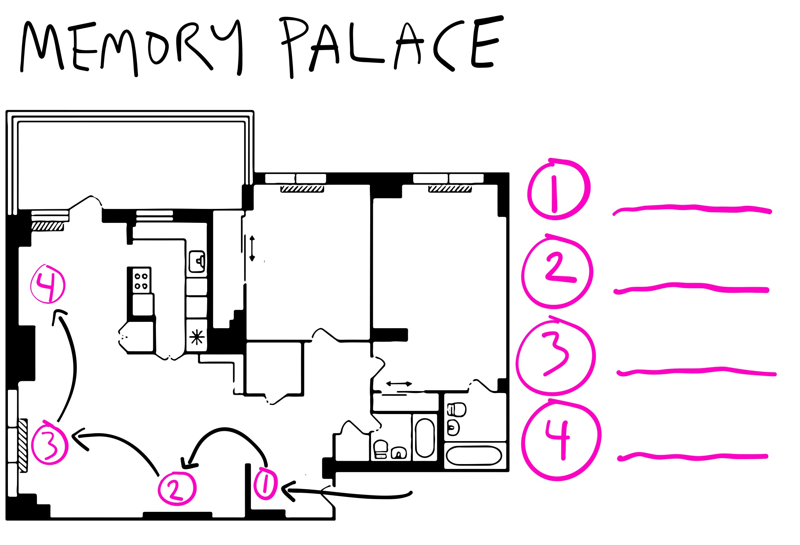
```


:::
::::

## Paivio 1963

Paivio, A. (1963). Learning of adjective-noun paired associates as a function of adjective-noun word order and noun abstractness. Canadian Journal of Psychology/Revue Canadienne de Psychologie, 17(4), 370. https://doi.org/10/d2s523

## Question

Are more imageable words easier to remember than less imageable words?

## Memory task

Had participants learn adjective-noun pairs. 

Manipulated whether the nouns were more concrete or abstract

| Concrete pairs                          | Abstract Pairs           |
|-----------------------------------------|--------------------------|
| Ingenious-Inventor                      | Ingenious-Interpretation |
| Technical-Advertisement                 | Technical-Discourse      |
| Massive-Granite                         | Massive-Rebellion        |
| Subtle-Magician                         | Subtle-Prejudice         |
| Profound-Philosopher                    | Profound-Analysis        |

## Paivio's Procedure

```{r}
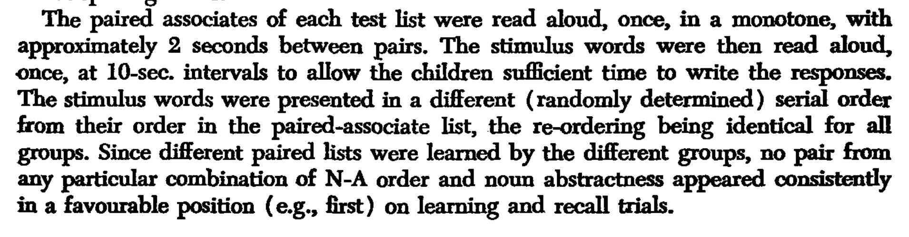
```

## Results

```{r}
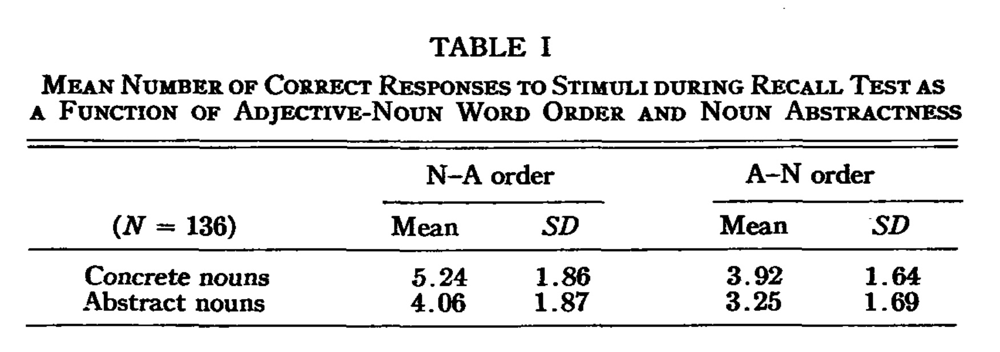
```

## Explanation?

What makes more "visualizable" words be easier to remember?

Is mental imagery required to explain Paivio's results?

##  Roadmap

### 1. Mental imagery and introspection {.greyout}
### 2. Aphantasia and Hyperphantasia {.greyout}
### 3. Imagery and Memory {.greyout}
### 4. The imagery debate and mental scanning {.bolder}

## The imagery debate

In the 1960s, 70s and 80s mental imagery again became a topic of interest.

There was a renewed debate about mental imagery, and the nature of cognitive representations

## Cognitive representations

A cognitive representation refers to the idea that our cognition has some type of format...

E.g., visual information can be stored digitally as pixels, on photographic film, as drawings on paper, on magnetic tape, or even described with words...

An ongoing question is what are the representations underlying our cognition?

## Mental imagery representations

:::: {.row}
::: {.col-md-6}

### Analog/pictorial

Image-like representation

Analogs of pictures

:::

::: {.col-md-6}

### Propositional

Representation based on symbols and rules

Not image-like

:::
::::

## Mental scanning experiments

A creative attempt to investigate the format of cognitive representations for mental imagery.

Kosslyn, S. M., Ball, T. M., & Reiser, B. J. (1978). Visual images preserve metric spatial information: Evidence from studies of image scanning. Journal of Experimental Psychology: Human Perception and Performance, 4(1), 47. https://doi.org/10/c8z6r3

## Procedure

```{r, out.width="50%"}
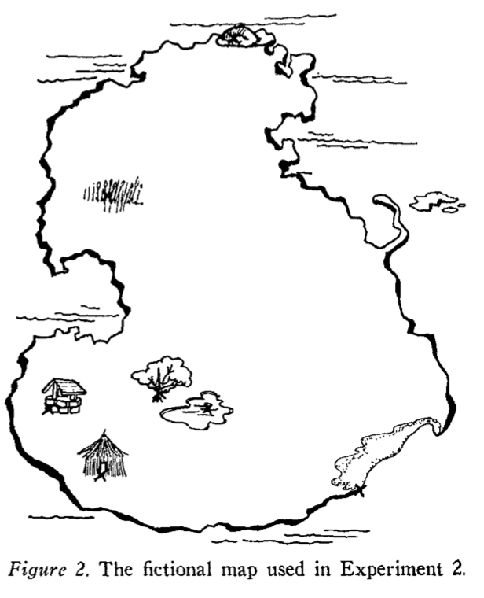
```

## Kosslyn's question

Imagine the island in your head...

How long will it take for people to mentally scan their attention from one location on the island to another?

Will mental scanning times depend on how far away the locations are...even though they are imagined distances?

## Possible results

```{r}
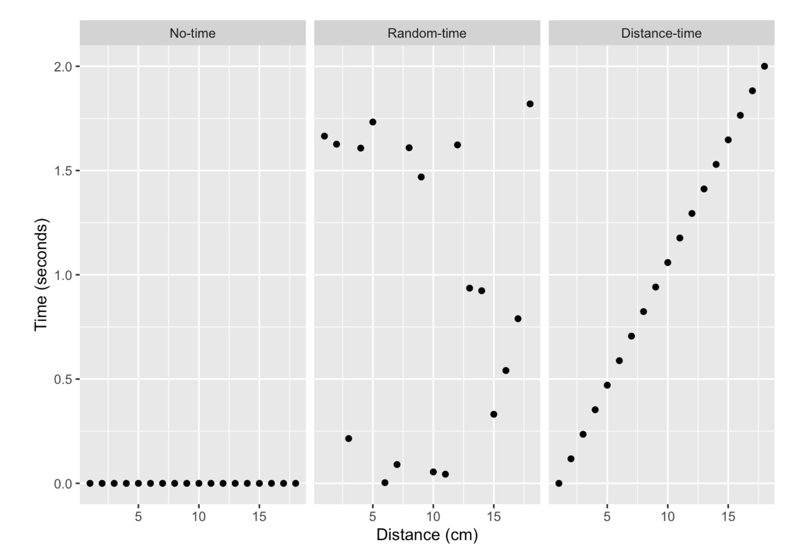
```

## Results

```{r, out.width="70%"}
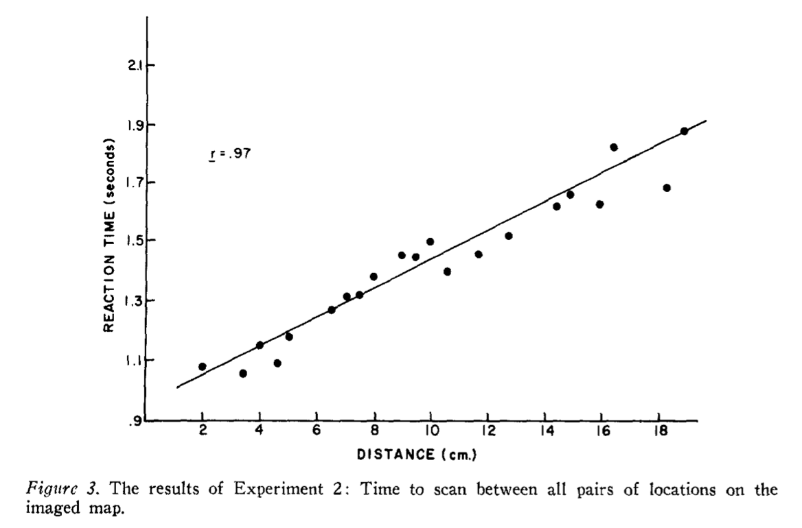
```

## Inferences

The time to mentally scan an image appears to be influenced by spatial distances in the actual image

What do these results mean for cognitive representations of mental imagery?

## Kosslyn's pictures

The evidence is consistent with the pictorial or analog representation assumption.

It takes time to scan real images as a function of distance scanned.

but..

## Pylyshyn's Propositions

The evidence could be consistent with other accounts too. The island could be represented in terms of propositions, and it could take time to process relational information between locations.

Example of propositional knowledge

The island contains objects

The rock is on the north end of the island

The grass is on the north-west side of the island.

The grass is south-west of the rock


## Summary

1. Since Galton, research has consistently suggested there are large individual differences in mental imagery
2. Mental imagery is a debated construct in cognition, and has been used to consider questions of cognitive representation
3. As we will learn next class, early mental imagery research was conducted for reasons you might find surprising

## Back to Galton

In 1880, why was Galton so interested in mental imagery?

A quote from his paper:

> The larger object of my inquiry is to elicit facts that shall define the natural varieties of mental disposition in the two sexes and in different races, and afford trustworthy data as to the relative frequency with which different faculties are inherited in different degrees.

## Questions and Next class

Readings are chapter 3 [Eugenics and Psychology](https://www.crumplab.com/cognition/textbook/eugenics-and-psychology.html) from the textbook.

Week 1 quiz is on blackboard...you have unlimited attempts until Sunday, Sept 12 at 11:59pm.

Quiz 2 will be posted Monday, Sept 20.


<!--

## Extras

## Mental Rotation

## Where is my mind?

-->


