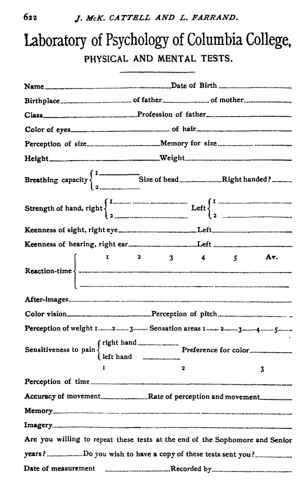

```{r setup, include=FALSE}
knitr::opts_chunk$set(echo = FALSE,
                      fig.align = "center",
                      out.width = "80%")
library(fontawesome)
```

## Reminders from last class

Reading for today was chapter 4 [Intelligence testing](https://www.crumplab.com/cognition/textbook/intelligence-testing.html) from the textbook.

Quiz 2 will be posted today Monday, Sept 20. The quiz will be open for 1 week. Q

Quiz 2 covers chapter 3 and 4

##  Roadmap

### 1. The intelligence test race {.bolder}
### 2. Binet-Simon Test {.greyout}
### 3. Mental testing and Eugenics {.greyout}
### 4. Critical responses {.greyout}

## What is intelligence?


:::: {.row}
::: {.col-md-6}

### Everyone knows what that means

```{r}

```

:::

::: {.col-md-6}

### Hmmm, the more I think about it...

```{r}
knitr::include_graphics("imgs/200-1.gif")
```

:::
::::

## Questions to consider

1. What is intelligence?
2. What are intelligence tests and what do they measure?
3. How have these tests been used in society?
4. Reasonable people have diverging opinions about the above questions
5. This class explores the historical context and development of IQ tests

## The intelligence test race

- The eugenics movement desired "scientific" tests that could convincingly measure individual differences in mental ability

- A eugenics goal was to develop mental tests, test whole segments of society, then deploy positive and negative eugenic social policies on people depending on their test results

- Several psychologists committed to the eugenics movement attempts to develop suitable mental tests

## Turn of the century (1900)

Psychologists around the world are developing tests to measure people on numerous dimensions (mental, physical, health, etc.)

National governments (UK, Germany, France, USA) are beginning to use, or consider using tests in conjunction with social policy and decision-making.

## James Mckeen Cattell (1860-1944)

:::: {.row}
::: {.col-md-6}

Founding Editor of Psychological Review (1894)

APA president (1895)

Bought the journal [Science](https://www.wikiwand.com/en/Science_(journal)), edited it for many years

Removed from position at Columbia for expressing opposition to American involvement in World War I

:::

::: {.col-md-6}

```{r}
knitr::include_graphics("imgs/Cattell.jpg")
```

:::
::::

## Cattell as Galton's acolyte

Cattell visited Galton in UK, popularized Galton's psychological and eugenics mission in the USA

- Conducted research in the style of Galton, motivated by eugenics

- Attempted to develop mental tests to measure individual differences in human quality

## Men of science

Galton and Cattell both tried to demonstrate that "men of science" in England and the US had inherited superior traits

:::: {.row}
::: {.col-md-6}

### Galton

```{r}
knitr::include_graphics("imgs/Galton_men_of_science.png")
```

:::

::: {.col-md-6}

### Cattell

```{r}
knitr::include_graphics("imgs/Cattell_men_of_science.jpg")
```

:::
::::

## Cattell's mental tests

CATTELL, J. McK. (1890). V.—MENTAL TESTS AND MEASUREMENTS. Mind, os-XV(59), 373–381. https://doi.org/10/dhn9nc

```{r}
knitr::include_graphics("imgs/Cattell_mental_testing.jpg")
```

## Testing Columbia students

Cattell, J. M., & Farrand, L. (1896). Physical and mental measurements of the students of Columbia University. Psychological Review, 3(6), 618. https://doi.org/10/ckms9q

:::: {.row}
::: {.col-md-6}

```{r,out.width="100%"}

```

:::

::: {.col-md-6}

```{r,out.width="100%"}

```

:::
::::


## Cattell's tests weren't predictive

Efforts to predict Columbia students grades (a potential measure of their intelligence) from Cattell's tests were not successful.

## Binet's Critiques

As mentioned previously, several other psychologists around the world were attempting to develop their own versions of mental tests

Alfred Binet was a French Psychologist who critiqued Cattell's tests for lacking face-validity

Binet argued that Cattell's tests weren't very mentally challenging...

##  Binet-Simon Test

### 1. The intelligence test race {.greyout}
### 2. Binet-Simon Test {.bolder}
### 3. Mental testing and Eugenics {.greyout}
### 4. Critical responses {.greyout}

## Binet's Motivation


:::: {.row}
::: {.col-md-6}

The French government was already enacting social policies to institutionalize "unfit" children

Children were being sent-away on the basis of subjective judgments from teacher's and parents.

Binet thought objective mental tests would allow for a more rational decision-policy that could be used to optimize the process.


:::

::: {.col-md-6}

```{r,out.width="100%"}
knitr::include_graphics("imgs/Binet.jpg")
```

:::
::::

## Translated to English in 1916

Kite, E. S. (1916). The development of intelligence in children (The Binet-Simon Scale). Williams & Wilkins Company.

You can read it all [here](https://archive.org/details/developmentofint00binerich)


## Binet's testing method

:::: {.row}
::: {.col-md-6}

Binet created a variety puzzle-like tasks

Chose tasks that he thought required mental processing

Systematically measured how children of different ages perform on each tasks

:::

::: {.col-md-6}

```{r}
knitr::include_graphics("imgs/Binet_items.jpg")
```

:::
::::

## Basic Results 1

:::: {.row}
::: {.col-md-6}

```{r,out.width="100%"}
knitr::include_graphics("imgs/Binet_caption.png")
```

:::

::: {.col-md-6}

```{r,out.width="100%"}
knitr::include_graphics("imgs/Binet_results.jpg")
```

:::
::::

## Quantification problem

Binet had a large number of results from many children on many tests

And, he recognized that "intelligence" was a complex, multi-dimensional, fuzzy concept

He sought a method to distill his measurements into a convenient and simple scale...his solution was mental age.

## Equating mental ability with Age

- Age was simple like a ruler, going up in increments of one year at a time. 

- Children develop physically and mentally as they grow, and this development is reflected in their age

- Binet assumed that children’s mental abilities steadily increased ever year until they became adults. 

## Linking Age to mini-test results

> One test signifies nothing, let us emphatically repeat, but five or six tests signify something. And that is so true that one might almost say, 'It matters very little what the tests are so long as they are numerous.' - Binet

No single mini-test indicates anything about your "mental age"...

## Norm-based comparison

Binet's measurements had meaning through comparison to empirical norms.

Empirical norms are existing measurements of how other children performed on the test

The large empirical database allowed Binet to assess how anyone performs the mini-tests compared to the groups of children he measured.

## Algorithms for computing mental age

:::: {.row}
::: {.col-md-6}

```{r,out.width="100%"}
knitr::include_graphics("imgs/Binet_rule1.jpg")
```

:::

::: {.col-md-6}

```{r,out.width="100%"}
knitr::include_graphics("imgs/Binet_rule2.jpg")
```

:::
::::

## Correlating mental age with school performance

```{r}
knitr::include_graphics("imgs/Binet_school.png")
```

## Meaning of modern IQ?

Binet's scale was in "mental" years

Modern "intelligence tests" use a standardized scale, often termed IQ or intelligence quotient

Binet died in 1911, and his strategy for mental testing was quickly adopted by American psychologists for the purposes of the eugenics movement.

##  Mental testing and Eugenics

### 1. The intelligence test race {.greyout}
### 2. Binet-Simon Test {.greyout}
### 3. Mental testing and Eugenics {.bolder}
### 4. Critical responses {.greyout}

## Human Betterment Foundation

:::: {.row}
::: {.col-md-6}

[Human Betterment Foundation](https://en.wikipedia.org/wiki/Human_Betterment_Foundation)
was an American Eugenics organization on the east coast

:::

::: {.col-md-6}

```{r,out.width="100%"}
knitr::include_graphics("imgs/HBF_ad.jpeg")
```

:::
::::

## Member List

```{r}
knitr::include_graphics("imgs/HBF_memberlist.jpg")
```

## Lewis Terman

:::: {.row}
::: {.col-md-6}

American Psychologist (1877-1956) at Stanford University

APA president (1923)

Eugenics leader and advocate

Popularized Binet-Simon test in USA as Stanford-Binet test

:::

::: {.col-md-6}

```{r,out.width="100%"}

```

:::
::::

## Terman's Stanford-Binet revision

:::: {.row}
::: {.col-md-6}

Terman advocated for widespread intelligence testing across America

1916, published a revised version of Binet's test for Americans.

:::

::: {.col-md-6}

```{r, out.width="100%"}
knitr::include_graphics("imgs/Terman_book.jpg")
```

:::
::::

## Terman's eugenic motivations

> it is safe to predict that in the near future intelligence tests will bring tens of thousands of these high-grade defectives under the surveillance and protection of society. This will ultimately result in curtailing the reproduction of feeble-mindedness and in the elimination of an enormous amount of crime, pauperism, and industrial inefficiency.

> The number of children with very superior ability is approximately as great as the number of feeble-minded. The future welfare of the country hinges, in no small degree, upon the right education of these superior children.

## Eugenical concerns about war

World war I had broken out in 1914...

Eugenicists were debating whether war would help or hurt the causes of eugenics

War could eliminate "unfit" people, but could be randomly killing "fit" and "unfit" people.

Eugenicists were interested in using mental tests in the war effort

## American Psychologists in WWI

Yerkes, R. M. (1918). Psychology in relation to the war. Psychological Review, 25(2), 85–115. https://doi.org/10/dhdj4j

APA created several committees to determine how psychologists could help the war effort.

Many of them were committed to the eugenics movement, and one-time APA presidents, including Robert Yerkes, Madison Bentley, Edward Thorndike, John B. Watson, Walter D. Scott, Robert Woodworth, and Carl Seashore

## The Alpha-Beta Test

:::: {.row}
::: {.col-md-6}

Alpha-Beta tests involved mass testing of 1.75 million Americans

A "mental census" for the Army


:::

::: {.col-md-6}

Psychologist Robert M Yearkes (1876-1956)

```{r,out.width="100%"}
knitr::include_graphics("imgs/yerkes_large.jpg")
```

:::
::::

## Examples

:::: {.row}
::: {.col-md-6}

Alpha test was for literate soldiers

Beta test was for illiterate soldiers

:::

::: {.col-md-6}

```{r, out.width="100%"}
knitr::include_graphics("imgs/Yerkes_alpha_test.png")
```

:::
::::

## Racial bias

Yearkes argued the results showed that whites had superior intelligence compared to blacks and immigrants

## Application and Interpretation

```{r}
knitr::include_graphics("imgs/Yearkes_explanation.png")
```

## Scientific Racism

## Continued racism

## IQ testing and mental health

## Goddard's "who is a moron?"

##  Critical responses

### 1. The intelligence test race {.greyout}
### 2. Binet-Simon Test {.greyout}
### 3. Mental testing and Eugenics {.greyout}
### 4. Critical responses {.bolder}

## Formation of the ABPsi

## Black Psychologists in APA

## 1960s

## Outcomes 

## Crane 1994


## Questions and Next class

Next class is Wednesday, Sept 22.

Read chapter 5 [Associations](https://www.crumplab.com/cognition/textbook/intelligence-testing.html) from the textbook.

Reminder: Quiz 2 will be posted today Monday, Sept 20. The quiz will be open for 1 week.

Quiz 2 covers chapter 3 and 4


