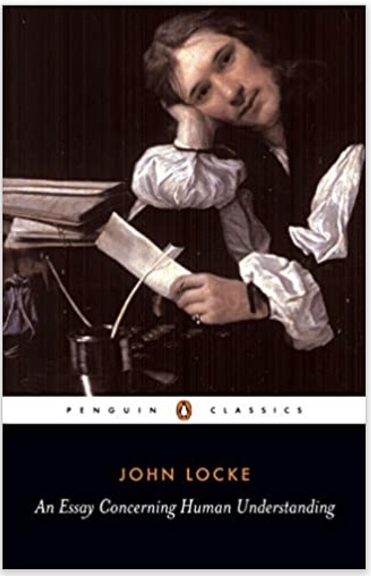
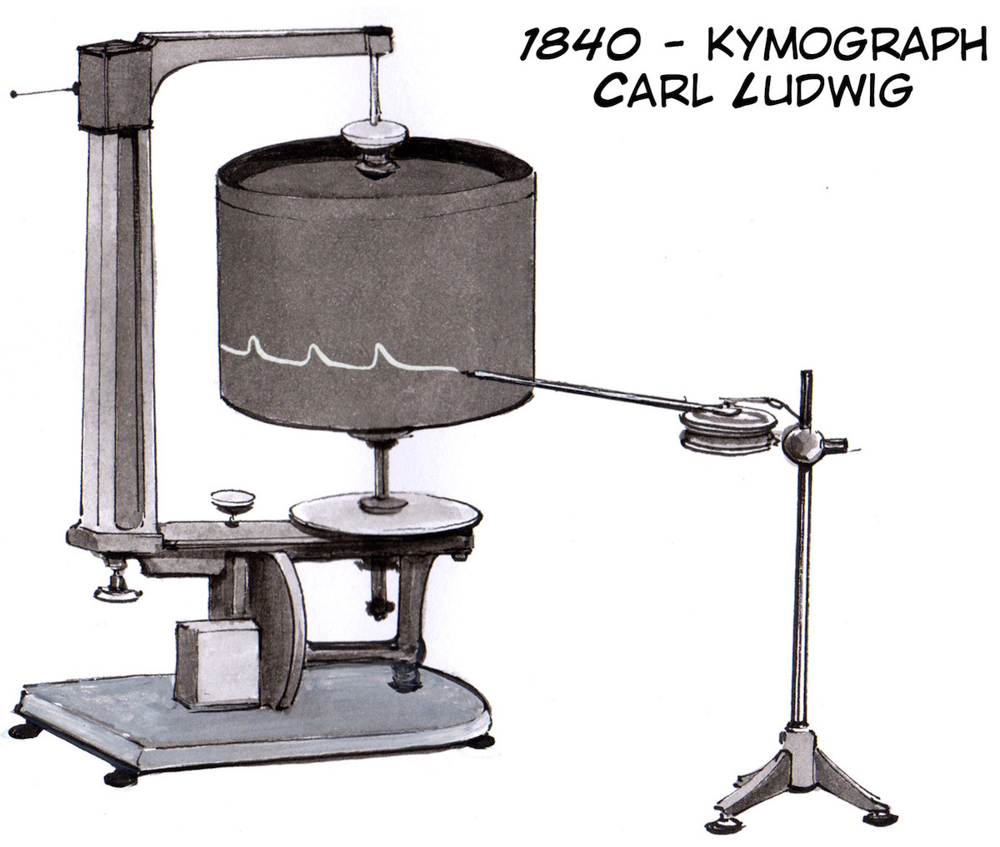

```{r setup, include=FALSE}
knitr::opts_chunk$set(echo = FALSE,
                      fig.align = "center",
                      out.width = "80%")
library(fontawesome)
```

## Reminders from last class

Reading for today was chapter 5 [Associations](https://www.crumplab.com/cognition/textbook/associations.html) from the textbook.

Quiz 2 is open until Sunday, September 26th, and covers chapter 3 and 4

##  Philosophy and Associationism

### 1. Philosophy and Associationism {.bolder}
### 2. Cattell's Associations {.greyout}
### 3. Thorndike's Puzzle Boxes {.greyout}
### 4. Pavlov's Classical Conditioning {.greyout}

## Precursors to Experimental Psychology

- Philosophy and Associationism
- Natural Science
- Evolution

## Philosophy

For many centuries before Psychology, questions about cognition were posed by philosophers

## Epistemology

The branch of philosophy concerned with knowledge...

What is knowledge? How do we know something?

:::: {.row}
::: {.col-md-6}

```{r}
knitr::include_graphics("imgs/Stiller_knowledge.gif")
```

:::

::: {.col-md-6}

```{r}
knitr::include_graphics("imgs/Information.gif")
```

:::
::::

## Rationalism

[Rationalism](https://en.wikipedia.org/wiki/Rationalism) holds that knowledge is derived from logic and reason

Some rationalist philosophers include:

[René Descartes](https://en.wikipedia.org/wiki/Rationalism#René_Descartes_(1596–1650)) (1596–1650)

[Baruch Spinoza](https://en.wikipedia.org/wiki/Rationalism#Baruch_Spinoza_(1632–1677)) (1632–1677)

[Gottfried Leibniz](https://en.wikipedia.org/wiki/Rationalism#Gottfried_Leibniz_(1646–1716)) (1646–1716)

## Empiricism

[Empiricism](https://en.wikipedia.org/wiki/Empiricism) emphasized a role for observation and evidence collection in knowledge creation.

- e.g., suggests that people acquire knowledge through their sense organs

- Invites questions about how the process of knowledge acquisition works

## The Associationist School

[The Associationist School](https://en.wikipedia.org/wiki/Associationism#Associationist_School) included empiricist philosophers who speculated further on the nature of mental processes that produced knowledge from experience. 

## John Locke (1632 – 1704)

:::: {.row}
::: {.col-md-6}

Discusses 'Association of Ideas" as a non-rational process

Suggests some associations are "natural and good", and maintained by reasoning

Suggests associations can also be arbitrary because they depend on a persons history of experience

:::

::: {.col-md-6}

```{r}

```

:::
::::

Excerpt from Chapter 33, An Essay Concerning Human Understanding

From a wrong connexion of ideas. Some of our ideas have a natural correspondence and connexion one with another: it is the office and excellency of our reason to trace these, and hold them together in that union and correspondence which is founded in their peculiar beings. Besides this, there is another connexion of ideas wholly owing to chance or custom. Ideas that in them-selves are not all of kin, come to be so united in some men's minds, that it is very hard to separate them; they always keep in company, and the one no sooner at anytime comes into the understanding, but its associate appears with it; and if they are more than two which are thus united, the whole gang, always inseparable, show themselves together.

This connexion made by custom. This strong combination of ideas, not allied by nature, the mind makes in itself either voluntarily or by chance; and hence it comes in different men to be very different, according to their different inclinations, education, interests, &c. Custom settles habits of thinking in the understanding, as well as of determining in the will, and of motions in the body: all which seems to be but trains of motions in the animal spirits, which, once set a going, continue in the same steps they have used to; which, by often treading, are worn into a smooth path, and the motion in it be-comes easy, and as it were natural. As far as we can comprehend thinking, thus ideas seem to be produced in our minds; or, if they are not, this may serve to explain their following one another in an habitual train, when once they are put into their track, as well as it does to explain such motions of the body. A musician used to any tune will find that, let it but once begin in his head, the ideas of the several notes of it will follow one another orderly in his understanding, without any care or attention, as regularly as his fingers move orderly over the keys of the organ to play out the tune he has begun, though his unattentive thoughts be else-where a wandering. Whether the natural cause of these ideas, as well as of that regular dancing of his fingers be the motion of his animal spirits, I will not determine, how probable soever, by this instance, it appears to be so: but this may help us a little to conceive of intellectual habits, and of the tying together of ideas.

## Principles of Association

*The principle of contiguity* states that strength of association depends on the proximity of events in space and time. Events that are closer to each other are associated more strongly. 

*The principle of similarity* states that more similar events will develop stronger associations than less similar events. 

*The principle of frequency* is that events that co-occur more frequently will be be associated more strongly than less frequent events. 

*The recency principle* suggests stronger associations for recent events than more remote events.

## Putting the claims to the test

Associationist claims are specific enough that they can be evaluated with evidence. As a result, it becomes possible to use the scientific method to assess claims about associations and cognition.

Some basic claims include:

1. People have associations between concepts

2. New associations can be learned

3. Some associations are stronger than others

##  Cattell's Associations

### 1. Philosophy and Associationism {.greyout}
### 2. Cattell's Associations {.bolder}
### 3. Thorndike's Puzzle Boxes {.greyout}
### 4. Pavlov's Classical Conditioning {.greyout}

## Cattell's Experimental Psychology

James McKeen Cattell (early mental tester) also conducted experimental psychology research

General goal was to use experiments to test theories of cognitive processes, especially those related to the formation of associations

## Mental Chronometry

Mental chronometry involves measuring the amount of time necessary to complete a task or mental operation

## Naming Time research

Cattell, J. M. (1886). The time it takes to see and name objects. Mind, 11(41), 63–65. https://doi.org/10/b6fr5r

Question?

Methods?

Results?

Let's take a quick look at the paper

## Question

**Big questions...**

How long does it take for a person to will or think something? 

What processes are occurring during the temporal interval?

**Specific question..**

How long does it take to see and name an objects like a color or letter?

## Method

:::: {.row}
::: {.col-md-6}

Presented stimuli on a rotating drum

Visible through a slit in a screen

Measured the rate participants could read stimuli as they passed through the slit

:::

::: {.col-md-6}

Kymograph 

```{r}

```

:::
::::

## Results

Took about 200 to 333 ms to read each letter, when slit was 1cm in diameter

Letter naming speed increases when slit is wider (can preview upcoming letters)

"Of the nine persons experimented on four could read the letters faster when five were in view at once, but were not helped by a sixth letter; three were not helped by a fifth and two not by a fourth letter. This shows that while one idea is in the centre, two, three or four additional ideas may be in the background of consciousness."

"Other experiments I have made show that we can recognise a single colour or picture in a slightly shorter time than a word or letter, but take longer to name it. This is because in the case of words and letters the association between the idea and name has taken place so often that the process has become automatic, whereas in the case of colours and pictures we must by a voluntary effort choose the name."

## Association time research

Cattell, J. M. (1887). Experiments on the association of ideas. Mind, 12(45), 68–74. https://doi.org/10/d9bv2m

## Question

Big Questions...

How are concepts formed without words? What mental processes take place when an object is named? using a familiar or second-language?

Specific questions...

How long does it take to recall an association, such as saying the name of an object?

## Method and Results

```{r}
knitr::include_graphics("imgs/Cattell_associations.jpg")
```

## Summary so far

Associationist ideas from philosophy provided some starting points for theorizing about how cognition works

Early experimental psychologists conducted experiments to measure association formation processes

Association learning was also soon studied in non-human animals

##  Thorndike's Puzzle Boxes

### 1. Philosophy and Associationism {.greyout}
### 2. Cattell's Associations {.greyout}
### 3. Thorndike's Puzzle Boxes {.bolder}
### 4. Pavlov's Classical Conditioning {.greyout}

## Human and Animal Cognition


## Edward Thorndike ((1874-1949))

:::: {.row}
::: {.col-md-6}

Student of Cattell

One of the first psychologists to apply experimental laboratory techniques to ask questions about association learning in animals

Later focused on Educational Psychology

Also a leader in the eugenics movement

:::

::: {.col-md-6}

```{r}
knitr::include_graphics("../../textbook/imgs/Edward_thorndike.png")
```

:::
::::

## Animal intelligence

Published his animal cognition research in a doctoral thesis

Thorndike, E. L. (1898). Animal intelligence: An experimental study of the associative processes in animals. The Psychological Review: Monograph Supplements, 2(4), i–109. https://doi.org/10/bk48z2

## Puzzle box research

:::: {.row}
::: {.col-md-6}

"Escape Rooms" for animals

Thorndike investigated how cats, dogs, and chicks learned to escape from his puzzle-box contraptions

:::

::: {.col-md-6}

```{r}
knitr::include_graphics("../../textbook/imgs/Thorndike_puzzle_box_1898.png")
```

:::
::::


## The subjective experience of kittens

> “We say that the kitten associates the sound”kitty kitty" with the experience of nice milk to drink, which does very well for a common-sense answer. It also suffices as a rebuke to those who would have the kitten ratiocinate about the matter, but it fails to tell what real mental content is present. Does the kitten feel “sound of call, memory-image of milk in a saucer in the kitchen, thought of running into the house, a feeling, finally, of ‘I will run in?’” Does he perhaps feel only the sound of the bell and an impulse to run in, similar in quality to the impulses which make a tennis player run to and fro when playing? The word association may cover a multitude of essentially different processes, and when a writer attributes anything that an animal may do to association his statement has only the negative value of eliminating reasoning on the one hand and instinct on the other…To give to the word a positive value and several definite possibilities of meaning is one aim of this investigation."

## Testing ideas about animal cognition

> “Surely every one must agree that no man now has a right to advance theories about what is in animals’ minds or to deny previous theories unless he supports his thesis by systematic and extended experiments. My own theories… will doubtless be opposed by many. I sincerely hope they will, provided the denial is accompanied by actual experimental work. In fact I shall be tempted again and again in the course of this book to defend some theory, dubious enough to my own mind, in the hope of thereby inducing some one to oppose me and in opposing me to make the experiments I have myself had no opportunity to make yet.”

## Basic results

Animals could learn to escape from the boxes

Animals got faster at escaping with practice

How were the animals solving the problem? How were they getting faster? What kinds of associations were involved?

## Possible stages of association

```{r}

```

##  Pavlov's Classical Conditioning

### 1. Philosophy and Associationism {.greyout}
### 2. Cattell's Associations {.greyout}
### 3. Thorndike's Puzzle Boxes {.greyout}
### 4. Pavlov's Classical Conditioning {.bolder}

## Physiology and Psychology

## Descarte's Reflexes

## Pavlov's Liquids

## Classical Conditioning

## Simple Acquisition

## Extinction

## Spontaneous Recovery

## Conditioning and Drug tolerance

## Conditioning and Perception

## Questions and Next class

Next class is Monday, Sept 27th.

Read chapter 5 [Associations](https://www.crumplab.com/cognition/textbook/intelligence-testing.html) from the textbook.

Reminder: Quiz 2 covers chapter 3 and 4 and is posted until Sunday, Sept 26th.

Quiz 3 will be posted on Monday, Sept 27. Quiz 3 will be open for 1 week, and will cover chapters 5 and 6


