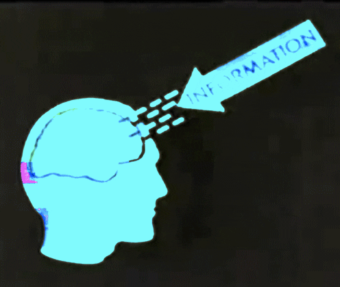

```{r setup, include=FALSE}
knitr::opts_chunk$set(echo = FALSE,
                      fig.align = "center",
                      out.width = "80%")
library(fontawesome)
```

## Reminders from last class

Reading for today was chapter 5 [Associations](https://www.crumplab.com/cognition/textbook/associations.html) from the textbook.

Quiz 2 is open until Sunday, September 26th, and covers chapter 3 and 4

##  Philosophy and Associationism

### 1. Philosophy and Associationism {.bolder}
### 2. Cattell's Associations {.greyout}
### 3. Thorndike's Puzzle Boxes {.greyout}
### 4. Pavlov's Classical Conditioning {.greyout}

## Precursors to Experimental Psychology

- Philosophy and Associationism
- Natural Science
- Evolution

## Philosophy

For many centuries before Psychology, questions about cognition were posed by philosophers

## Epistemology

The branch of philosophy concerned with knowledge...

What is knowledge? How do we know something?

:::: {.row}
::: {.col-md-6}

```{r}
knitr::include_graphics("imgs/Stiller_knowledge.gif")
```

:::

::: {.col-md-6}

```{r}

```

:::
::::

## Rationalism

## Empiricism

## The Associationist School

## Principles of Association

## Putting the claims to the test

Associationist claims are specific enough that they can be evaluated with evidence. As a result, it becomes possible to use the scientific method to assess claims about associations and cognition.

Some basic claims include:

1. People have associations between concepts

2. New associations can be learned

3. Some associations are stronger than others

##  Cattell's Associations

### 1. Philosophy and Associationism {.greyout}
### 2. Cattell's Associations {.bolder}
### 3. Thorndike's Puzzle Boxes {.greyout}
### 4. Pavlov's Classical Conditioning {.greyout}

## Cattell's Experimental Psychology

James McKeen Cattell (early mental tester) also conducted experimental psychology research

General goal was to use experiments to test theories of cognitive processes, especially those related to the formation of associations

## Mental Chronometry

Mental chronometry involves measuring the amount of time necessary to complete a task or mental operation

## Naming Time research

Cattell, J. M. (1886). The time it takes to see and name objects. Mind, 11(41), 63–65. https://doi.org/10/b6fr5r


## Question

## Method

## Results

## Association time research

## Question

## Method

## Results

##  Thorndike's Puzzle Boxes

### 1. Philosophy and Associationism {.greyout}
### 2. Cattell's Associations {.greyout}
### 3. Thorndike's Puzzle Boxes {.bolder}
### 4. Pavlov's Classical Conditioning {.greyout}

## Human and Animal Cognition

## Edward Thorndike

## Puzzle box research

##  Pavlov's Classical Conditioning

### 1. Philosophy and Associationism {.greyout}
### 2. Cattell's Associations {.greyout}
### 3. Thorndike's Puzzle Boxes {.greyout}
### 4. Pavlov's Classical Conditioning {.bolder}

## Physiology and Psychology

## Descarte's Reflexes

## Pavlov's Liquids

## Classical Conditioning

## Simple Acquisition

## Extinction

## Spontaneous Recovery

## Questions and Next class

Next class is Monday, Sept 27th.

Read chapter 5 [Associations](https://www.crumplab.com/cognition/textbook/intelligence-testing.html) from the textbook.

Reminder: Quiz 2 covers chapter 3 and 4 and is posted until Sunday, Sept 26th.

Quiz 3 will be posted on Monday, Sept 27. Quiz 3 will be open for 1 week, and will cover chapters 5 and 6


