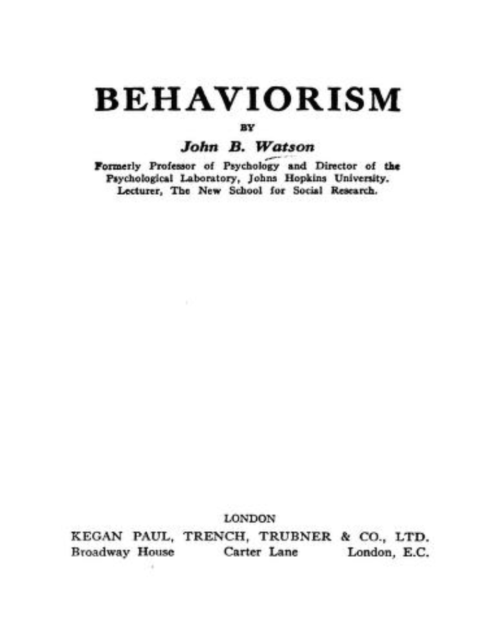
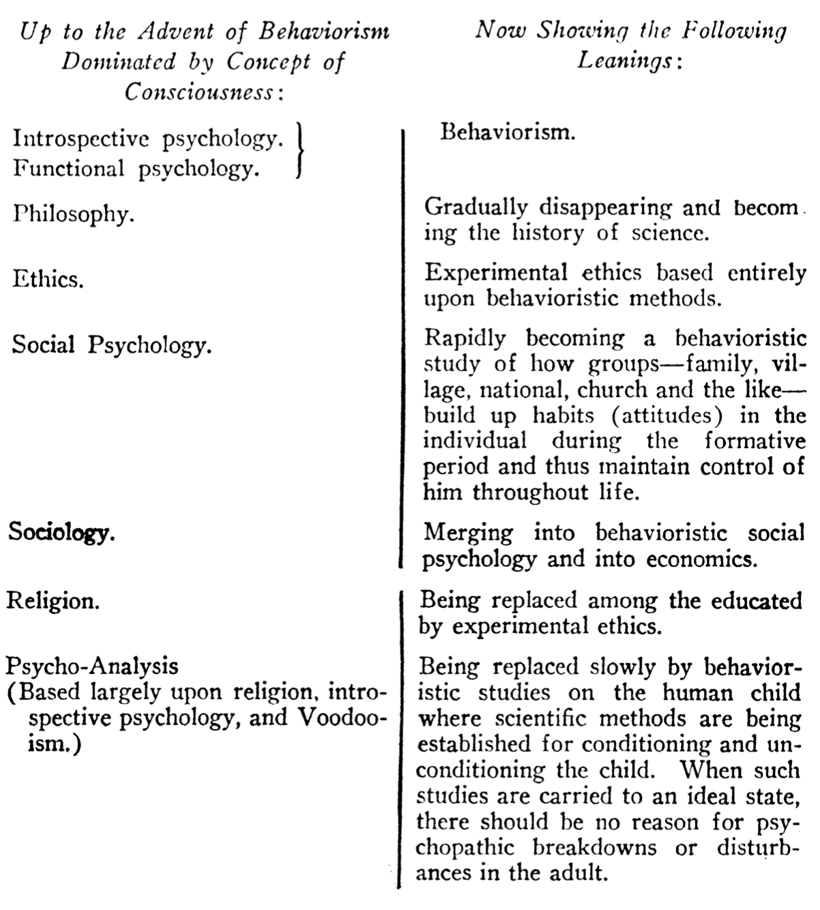
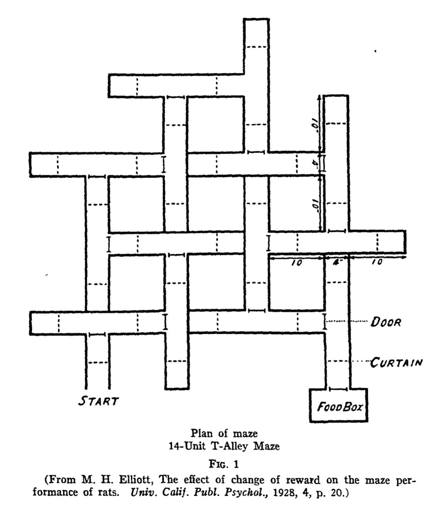
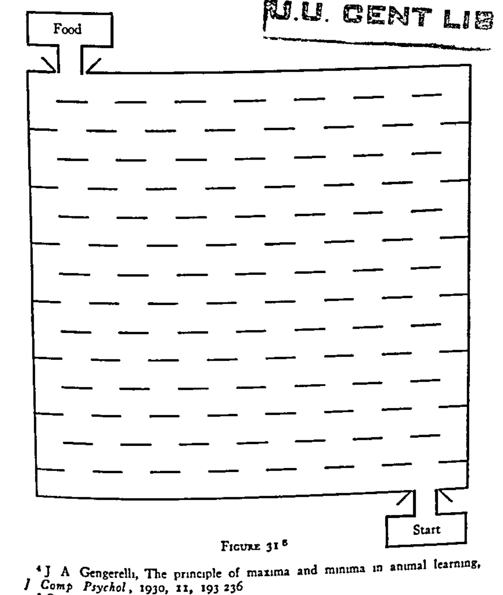
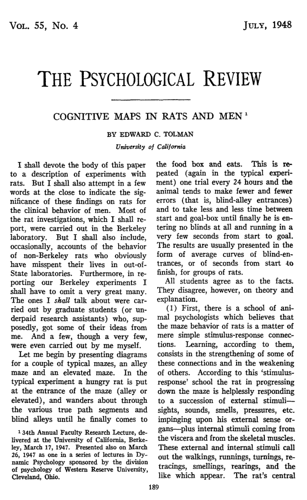
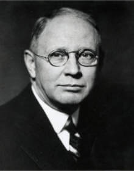
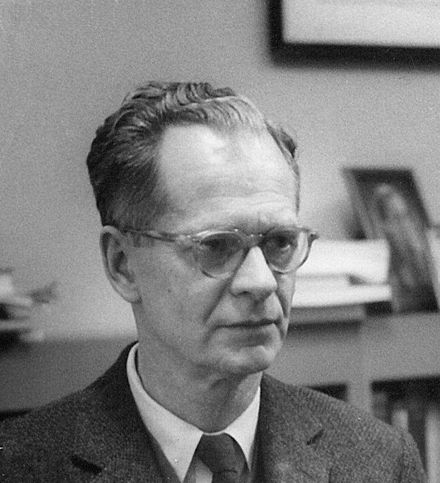

```{r setup, include=FALSE}
knitr::opts_chunk$set(echo = FALSE,
                      fig.align = "center",
                      out.width = "80%")
library(fontawesome)
```

## Reminders

This is the mini-lecture for learning module 5 on Behaviorism.


##  Roadmap

### 1. Positivism {.bolder}
### 2. Watson's Behaviorism {.greyout}
### 3. Tolman's Behaviorism {.greyout}
### 4. Hull's Behaviorism {.greyout}
### 5. Skinner's Behaviorism {.greyout}

## Explanation

- A goal of this course is to examine explanations of cognitive processes

- The era of behaviorism developed "functional" explanations in the tradition of positivism

- A major goal of behaviorism was to predict and control behavior

## The Rabbit Hole

A modern example of using big data for prediction and control over human behavior...

[The Rabbit Hole podcast](https://www.nytimes.com/column/rabbit-hole)

Note: there is an assignment around this podcast if you are interested in listening to it

## Let's rewind

We're going back to the period roughly between 1910s and 1940s, when the school of behaviorism was a dominant perspective in American psychology.

```{r}
knitr::include_graphics("imgs/rewind.gif")
```


## Comte's Positivism

:::: {.row}
::: {.col-md-6}

Created Positivism, "father of sociology"

Early philosopher of science

Argued that science and society develop through three stages: **theological**, **metaphysical**, and **positive**

:::

::: {.col-md-6}

[Auguste Comte](https://plato.stanford.edu/entries/comte/) (1798-1857)

```{r,out.width="100%"}
knitr::include_graphics("../../textbook/imgs/Auguste_Comte.jpg")
```

:::
::::

## Comte's stages of explanation

- *In the theological phase,* phenomena are explained by supernatural powers. For example, the mind is attributed to soul or spiritual forces.

- *The metaphysical stage* replaces the supernatural forces with abstractions. For example, the mind is psychic forces. 

- *In the positive stage* a description system is achieved that can mathematically describe, predict, and control a process of interest

## Scientific Utopianism

:::: {.row}
::: {.col-md-6}

Comte sought to extend his positivism to improve society

**Motto of Positivism:** "Love as a principle and order as the basis; progress as the goal."

Comte also proposed a [humanistic religion based on positivism](https://en.wikipedia.org/wiki/Religion_of_Humanity) to replace the catholic church

:::

::: {.col-md-6}

Positivist temple in Brazil

```{r,out.width="100%"}
knitr::include_graphics("imgs/Templo_Positivista_em_Porto_Alegre.JPG")
```

:::
::::

## Positivism and Behaviorism

- Behaviorism was a science in the tradition of positivism

- We will see many themes from positivism in the next examples of behaviorists

- Behaviorism was not monolithic, and different behaviorists a variety of goals


##  Watson's Behaviorism

### 1. Positivism {.greyout}
### 2. Watson's Behaviorism {.bolder}
### 3. Tolman's Behaviorism {.greyout}
### 4. Hull's Behaviorism {.greyout}
### 5. Skinner's Behaviorism {.greyout}

## J. B. Watson (1878-1958)

:::: {.row}
::: {.col-md-6}

Early proponent of behaviorism

- APA president in 1915

- Listed as a researcher in the Eugenical News

- Fired in 1920 due to a divorce scandal, left psychology, but continued to push behaviorism ideas

:::

::: {.col-md-6}

[J. B. Watson](https://en.wikipedia.org/wiki/John_B._Watson)

```{r,out.width="100%"}
knitr::include_graphics("../../textbook/imgs/John_Broadus_Watson.jpg")
```

:::
::::

## Little Albert

:::: {.row}
::: {.col-md-6}

Watson attempted to generalize Pavlovian conditioning to humans by training an infant to show fear responses to many kinds of stimuli

[Little Albert](https://en.wikipedia.org/wiki/Little_Albert_experiment) was exposed to objects (e.g., white rat, masks, burning newspapers) and sounds that caused traumatic reactions.

Watson apparently planned to "de-sensitize" the infant, but the infant was removed before the experiment was finished

:::

::: {.col-md-6}

```{r,out.width="100%"}
knitr::include_graphics("imgs/Little-albert.jpg")
```

:::
::::

## Watson's Behaviorism

:::: {.row}
::: {.col-md-6}

You can read [Watson's Behaviorism](https://archive.org/details/in.ernet.dli.2015.78133) by downloading it from the internet archive.

:::

::: {.col-md-6}

```{r,out.width="100%"}

```

:::
::::

## S-R positivism

Watson follows Comte’s positivism to criticize psychology and replace it with behaviorism. 

- He argues that introspective psychology had a strong religious background (e.g, Comte’s theological stage), invoking God-concepts to explain the mind

- That introspective psychology referred to abstract entities like consciousness which were unscientific (e.g., Comte’s metaphysical stage). 

- He then advanced behaviorism as the proper scientific discipline to study people and animals (the positive stage).

## Watson's S-R system

:::: {.row}
::: {.col-md-6}

Watson identified terms like stimuli and response, and made grand claims about possible functional relationships between them...

but did not supply a detailed mathematical analysis of assumed lawful connections between stimuli and responses. 

:::

::: {.col-md-6}

```{r, out.width="100%"}
knitr::include_graphics("../../textbook/imgs/Watson_SR.png")
```

:::
::::

## Social engineering


Watson envisioned how a science of behaviorism would enable social engineering at a broad scale..

:::: {.row}
::: {.col-md-6}

```{r, out.width="100%"}
knitr::include_graphics("../../textbook/imgs/Watson_society_S.png")
```

:::

::: {.col-md-6}

```{r, out.width="100%"}
knitr::include_graphics("../../textbook/imgs/Watson_society_R.png")
```

:::
::::

## Watson's Utopia


:::: {.row}
::: {.col-md-6}

In the tradition of positivism, Watson also described how Behaviorism would become a whole new way of life to "improve" society.

:::

::: {.col-md-6}

```{r,out.width="100%"}

```

:::
::::

##  Tolman's Behaviorism

### 1. Positivism {.greyout}
### 2. Watson's Behaviorism {.greyout}
### 3. Tolman's Behaviorism {.bolder}
### 4. Hull's Behaviorism {.greyout}
### 5. Skinner's Behaviorism {.greyout}

## E. C. Tolman (1886-1959)

:::: {.row}
::: {.col-md-6}

Early "Cognitive" Behaviorist

Studied maze-learning abilities in rats

:::

::: {.col-md-6}

```{r, out.width="100%"}
knitr::include_graphics("../../textbook/imgs/Tolman_portrait.jpg")
```

:::
::::

## Molar definition of Behavior

Behaviorists were attempting to carve out space between mentalistic psychology and physical physiology

Tolman argues in favor of a molar definition of Behavior, that behaviors are things in and of themselves that could be studied, irrespective of their "molecular" units.

> 'Behavior' has distinctive properties all its own. These are to be identified and described irrespective of whatever muscular, glandular, or neural processes underlie them. These new properties, thus distinctive of molar behavior, are presumably strictly correlated with and, if you will, dependent upon, physiological motions. But descriptively and per se they are other than these motions.

> A rat running a maze, a cat getting out of a puzzle box, a man driving home to dinner, a child hifing from a stranger, a woman doing her washing or gossiping over the telephone, a pupil marking a mental test sheet, a psychologist reciting a list of nonsense syllables, my friend and I telling one another our thought and feelings– these are behaviors (qua molar). And it must be noted that in mentioning no one of them have we referred to, or, we blush to confess it, for the most part even known, what were the exact muscles and glands, sensory nerves, and motor nerves involved. For these responses somehow had other sufficiently identifying properties of their own.

## Purposive and cognitive components

Tolman argued that a science of behaviorism should include description of goals, purposes, and cognitive aspects of behavior

Early on he suggested that cognition was merely descriptive of a behavior, and later on he developed cognitive process explanations of maze running in rats

## Maze learning

:::: {.row}
::: {.col-md-6}

Tolman created many mazes, and investigated how rats learn to navigate the maze to find food reward at the end

:::

::: {.col-md-6}

```{r, out.width = "100%"}

```

:::
::::

## Evidence for purposive behavior

:::: {.row}
::: {.col-md-6}

Tolman manipulated level of hunger, and whether or not rats received food reward at the end of a maze

*Result:* The "Hungry-Reward" group learned the maze fastest over many days

*Inference:* The "Hungry-Reward" rats had more "purpose", which drove them to learn the maze more efficiently

:::

::: {.col-md-6}

```{r, out.width = "100%"}
knitr::include_graphics("../../textbook/imgs/Tolman_hunger.png")
```

:::
::::

## Evidence for cognitive behavior

:::: {.row}
::: {.col-md-6}

Gingerelli's maze gave rats many options to get from start to finish

*Results:* Rats learned to take the shortest paths

*Inference:* Rats were showing adaptive optimization of their behavior

:::

::: {.col-md-6}

```{r, out.width = "100%"}

```

:::
::::

## Temporal discrimination

:::: {.row}
::: {.col-md-6}

Tolman "detained" rats in a left or right chamber for long or short periods of time

*Result:* Rats took the shorter route to the food

*Inference:* Rats could discriminate between different temporal intervals and use the information to guide their navigation decisions

:::

::: {.col-md-6}

```{r, out.width = "100%"}
knitr::include_graphics("../../textbook/imgs/Tolman_Temporal.png")
```

:::
::::

## Cognitive maps in Rats and Men

:::: {.row}
::: {.col-md-6}

Tolman, E. C. (1948). Cognitive maps in rats and men. Psychological Review, 55(4), 189–208. https://doi.org/10.1037/h0061626

Reviews much of his maze running research

Develops the idea that people and animal build "mental maps" of their environments, and then use them to navigate their surroundings

:::

::: {.col-md-6}

```{r, out.width="100%"}

```

:::
::::

## Latent learning

:::: {.row}
::: {.col-md-6}

Group I always got food at the end

Group II and III did not get food until a specific day, marked by the X

*Result:* Group II and III did not learn quickly until they started received food, then they learned very quickly

*Inference:* Group II and III were building a map of the maze (latent learning) and could use this knowledge to quickly navigate the maze when they were motivated by food.

:::

::: {.col-md-6}

```{r, out.width="100%"}
knitr::include_graphics("../../textbook/imgs/Tolman_latentresults.png")
```

:::
::::

## Breeding Rats for "intelligence"

Tolman, E. C. (1924). The inheritance of maze-learning ability in rats. Journal of Comparative Psychology, 4(1), 1. https://doi.org/10/d737hx

Like Thorndike, Tolman and his student Tryon analogized the maze-running procedure as a tool to measure individual differences in rat intelligence.

They attempted to breed rats to perform better on mazes over generations. Tolman reported that selective breeding did show differences in maze performance in the first generation, but not in the second generation. His student Tryon repeated a selective breeding experiment over 11 years and many more generations and found similar results.

##  Hull's Behaviorism

### 1. Positivism {.greyout}
### 2. Watson's Behaviorism {.greyout}
### 3. Tolman's Behaviorism {.greyout}
### 4. Hull's Behaviorism {.bolder}
### 5. Skinner's Behaviorism {.greyout}

## Clark L. Hull

:::: {.row}
::: {.col-md-6}

Early Mathematical psychologist

Attempted to specify descriptive terms for a science of behavior (terms like stimulus and response, and also terms for drives and motivations), and to use math to describe lawful patterns linking terms in the system.

:::

::: {.col-md-6}

```{r, out.width="100%"}

```

:::
::::

## Hull Example

$_SE_R = _SH_R × D × V × K$

Where:

- $_SE_R$ is an excitatory potential (likelihood that the organism would produce response r to stimulus s),

- $_SH_R$ is the habit strength (derived from previous conditioning trials),

- $D$ is drive strength (determined by, e.g., the hours of deprivation of food, water, etc.),

- $V$ is stimulus intensity dynamism (some stimuli will have greater influences than others, such as the lighting of a situation)

- $K$ is incentive (how appealing the result of the action is).

##  Skinner's Behaviorism

### 1. Positivism {.greyout}
### 2. Watson's Behaviorism {.greyout}
### 3. Tolman's Behaviorism {.greyout}
### 4. Hull's Behaviorism {.greyout}
### 5. Skinner's Behaviorism {.bolder}

## B. F. Skinner (1904-1990)

:::: {.row}
::: {.col-md-6}

"Radical" Behaviorist

Created Operant Conditioning

:::

::: {.col-md-6}

```{r, out.width="100%"}

```

:::
::::

## The behavior of organisms (1938)

You can read Skinner's book where he develops and advances his behaviorism [here](https://archive.org/details/in.ernet.dli.2015.191112).


## Operant Conditioning

Skinner distinguished between Type S and Type R learning

:::: {.row}
::: {.col-md-6}

Type S is like Pavlovian conditioning

An S-R relationship already exists before conditioning (e.g., food triggers salivation), and conditioning transfers control over the response from a UCS (food) to a new stimulus (tone).

:::

::: {.col-md-6}

Type R learning refers to "operant behavior"

"Operants" are any behavior that animals do somewhat spontaneously

Type R learning involves gaining stimulus control over the behavior, so that some stimulus will cause the behavior to occur with regularity.

:::
::::

## Lever pressing

:::: {.row}
::: {.col-md-6}

Skinner placed rats in boxes equipped with a lever

Rats would spontaneously hit the lever (the operant behavior)

Skinner developed methods to systematically predict and control lever-pressing behavior in the box

:::

::: {.col-md-6}

```{r, out.width="100%"}
knitr::include_graphics("../../textbook/imgs/Skinner_Box.png")
```

:::
::::

## Simple Operant conditioning

```{r}
knitr::include_graphics("../../textbook/imgs/Skinner_Results.png")
```

## Interpreting results

:::: {.row}
::: {.col-md-6}

Skinner chose a simple behavior to measure

He measured rates of response (lever-pressing per unit time) under different conditions

:::

::: {.col-md-6}

```{r, out.width="100%"}
knitr::include_graphics("../../textbook/imgs/Skinner_slope.png")
```

:::
::::

## Describing results

:::: {.row}
::: {.col-md-6}

Skinner showed operant forms of learning that were similar to Pavlov's conditions

He set out to develop an abstract description system capable of predicting and controlling lever pressing

:::

::: {.col-md-6}

```{r, out.width="100%"}
knitr::include_graphics("../../textbook/imgs/Skinner_description.png")
```

:::
::::

## Skinner's System: Reflex Strength

Skinner's system involved his own set of terms and lawful relationships. The terms were intended as abstractions, and the laws were supposed to be empirically verified regularities in behavior. 

Reflexes were any operant behavior

Reflex strength referred to probability of making a response

## Skinner's principles

One goal was to experimentally derive principles that seem to predict and control behaviors of interest

> **The Law of Threshold** The intensity of the stimulus must reach or exceed a certain critical value (called the threshold) in order to elicit a response. 

> **The Law of Latency** An interval of time (called the latency) elapses between the beginning of the stimulus and the beginning of the response. 

> **The Law of the Magnitude of the Response** The magnitude of the response is a function of the intensity of the stimulus. 
 
> **The Law of After-Discharge** The response may persist for some time after the cessation of the stimulus

## Applications: Project Pigeon

:::: {.row}
::: {.col-md-6}

In [project pigeon](https://en.wikipedia.org/wiki/Project_Pigeon), Skinner trained pigeons to pilot guided missiles

:::

::: {.col-md-6}

```{r, out.width="100%"}
knitr::include_graphics("imgs/pigeon.jpg")
```

:::
::::

## Walden two

:::: {.row}
::: {.col-md-6}

Again in the general positivist tradition, Skinner wrote a Utopia fiction called Walden two

Describes how behavioral engineering through elaborate operant conditioning could improve the lives of 1000 people in a commune, by ensuring they would live happy, productive, and conflict-free lives

:::

::: {.col-md-6}

```{r, out.width="100%"}
knitr::include_graphics("imgs/Walden_Two_cover.jpg")
```

:::
::::

## What's next

Complete the quiz for this learning module on Blackboard, and/or the writing assignments by the due date.

This is the last learning module before the first midterm


