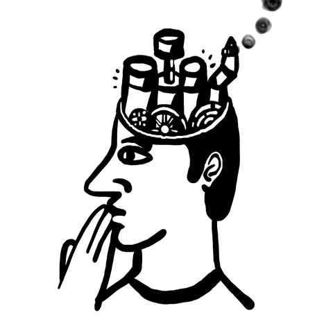
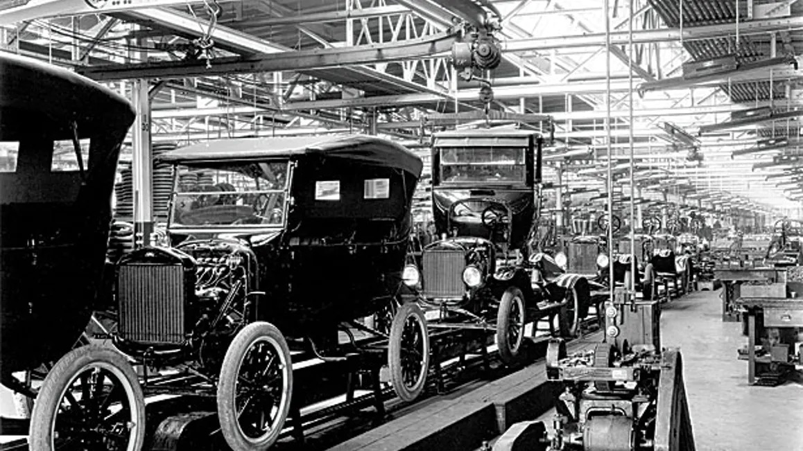
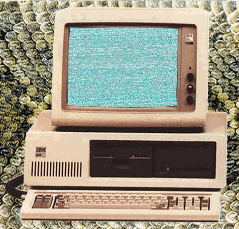
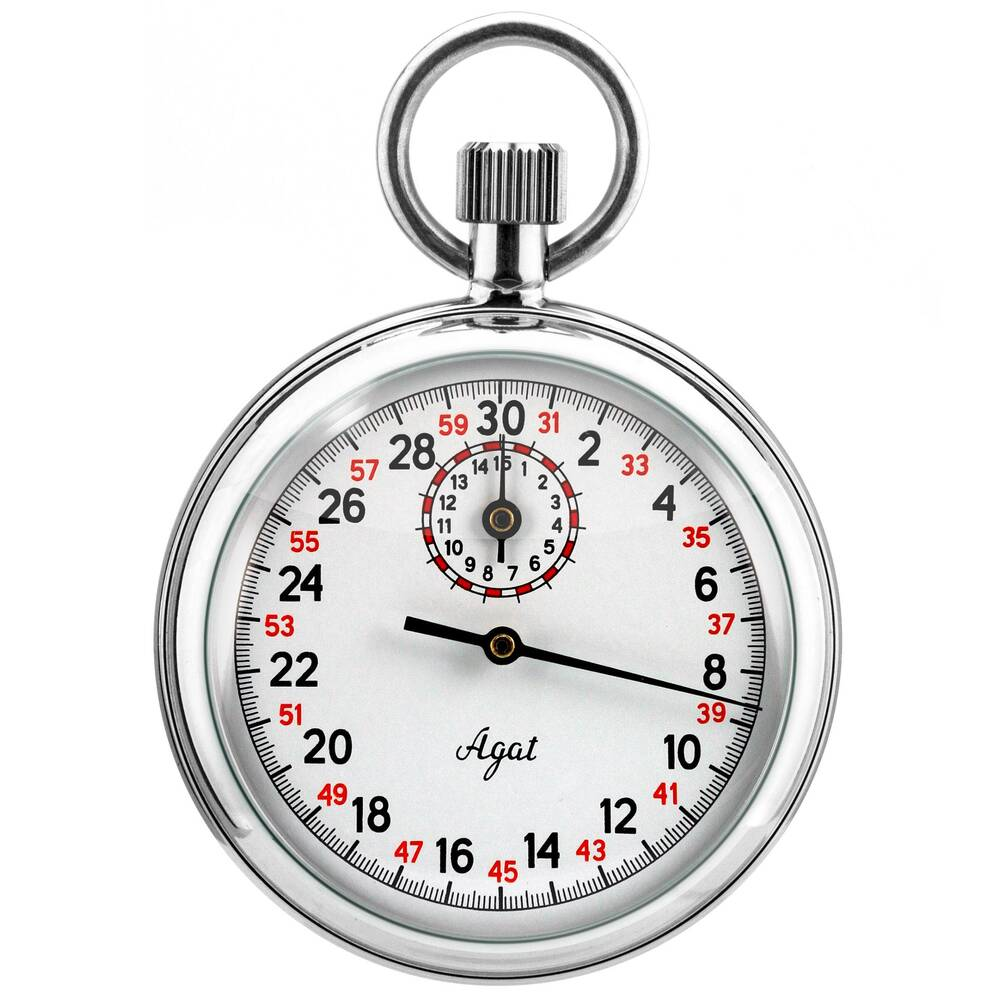

```{r setup, include=FALSE}
knitr::opts_chunk$set(echo = FALSE,
                      fig.align = "center",
                      out.width = "80%")
library(fontawesome)
```

## Reminders from last class

Reading is Chapter 7 on [Information Processing](https://www.crumplab.com/cognition/textbook/information-processing.html)

**Your midterm grade is posted on Blackboard**

**Quiz 5 will begin on Wednesday** 

##  Roadmap

### 1. Revolutions and Metaphors {.bolder}
### 2. Donders and Processing stages {.greyout}
### 3. Information Theory {.greyout}
### 4. Hick-Hyman Law {.greyout}

## Metaphors and explanation

:::: {.row}
::: {.col-md-6}

Cognitive psychology often uses metaphors as an aid for explanation

*Metaphorical Explanation*

The structure and function of one thing is used to roughly describe another thing

:::

::: {.col-md-6}

```{r}

```

:::
::::

## Revolutions and metaphors

Big metaphors in cognition roughly track technological revolutions

1. Industrial Revolution
2. Technological Revolution
3. Digital Revolution

## Industrial Revolution

Cognition is like a factory assembly line

```{r}

```


## Technological Revolution

Cognition is like a telephone network

```{r, out.width="50%"}

```

## Digital Revolution

Cognition is like a computer

```{r, out.width="50%"}

```

##  Donders and Processing stages

### 1. Revolutions and Metaphors {.greyout}
### 2. Donders and Processing stages {.bolder}
### 3. Information Theory {.greyout}
### 4. Hick-Hyman Law {.greyout}

## Mental Chronometry


:::: {.row}
::: {.col-md-6}

Using measures of time to make inferences about cognitive processes

:::

::: {.col-md-6}

```{r}

```

:::
::::

## How fast can a nerve transmit a signal? 

## Hermann von Helmholtz

## Donders

## Physiological Reaction time

##  Information Theory

### 1. Revolutions and Metaphors {.greyout}
### 2. Donders and Processing stages {.greyout}
### 3. Information Theory {.bolder}
### 4. Hick-Hyman Law {.greyout}

##  Hick-Hyman Law

### 1. Revolutions and Metaphors {.greyout}
### 2. Donders and Processing stages {.greyout}
### 3. Information Theory {.greyout}
### 4. Hick-Hyman Law {.bolder}


## Questions and Next class

Next class is Wednesday, Oct 20th.

Reading is Chapter 7 on [Information Processing](https://www.crumplab.com/cognition/textbook/information-processing.html)

**Quiz 5 will begin on Wednesday** 


