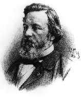
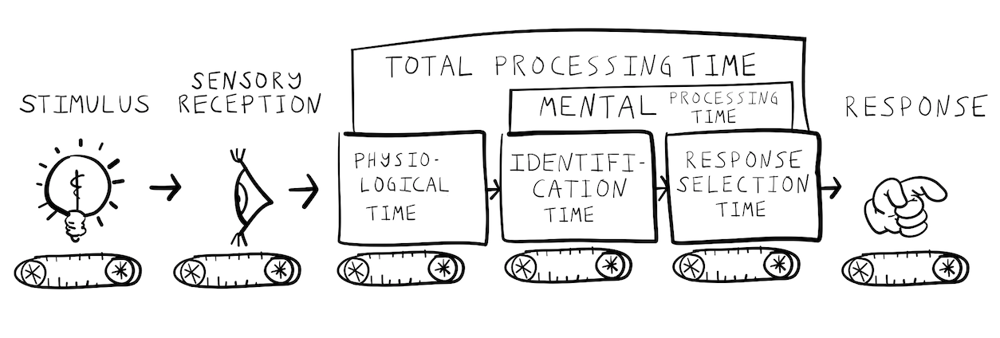

```{r setup, include=FALSE}
knitr::opts_chunk$set(echo = FALSE,
                      fig.align = "center",
                      out.width = "80%")
library(fontawesome)
```

## Reminders from last class

Reading is Chapter 7 on [Information Processing](https://www.crumplab.com/cognition/textbook/information-processing.html)

**Your midterm grade is posted on Blackboard**

**Quiz 5 will begin on Wednesday** 

##  Roadmap

### 1. Revolutions and Metaphors {.bolder}
### 2. Donders and Processing stages {.greyout}
### 3. Information Theory {.greyout}
### 4. Hick-Hyman Law {.greyout}

## Metaphors and explanation

:::: {.row}
::: {.col-md-6}

Cognitive psychology often uses metaphors as an aid for explanation

*Metaphorical Explanation*

The structure and function of one thing is used to roughly describe another thing

:::

::: {.col-md-6}

```{r}
knitr::include_graphics("imgs/industrial_brain.gif")
```

:::
::::

## Revolutions and metaphors

Big metaphors in cognition roughly track technological revolutions

1. Industrial Revolution
2. Technological Revolution
3. Digital Revolution

## Industrial Revolution

Cognition is like a factory assembly line

```{r}
knitr::include_graphics("imgs/assembly_line.jpg")
```


## Technological Revolution

Cognition is like a telephone network

```{r, out.width="50%"}
knitr::include_graphics("imgs/telephone.jpg")
```

## Digital Revolution

Cognition is like a computer

```{r, out.width="50%"}
knitr::include_graphics("imgs/computer.gif")
```

##  Donders and Processing stages

### 1. Revolutions and Metaphors {.greyout}
### 2. Donders and Processing stages {.bolder}
### 3. Information Theory {.greyout}
### 4. Hick-Hyman Law {.greyout}

## Mental Chronometry


:::: {.row}
::: {.col-md-6}

Using measures of time to make inferences about cognitive processes

:::

::: {.col-md-6}

```{r}
knitr::include_graphics("imgs/stopwatch.jpg")
```

:::
::::

## How fast can a nerve transmit a signal? 

Infinitely fast? 

Or, with a certain speed?

## Hermann von Helmholtz (1821-1894)

:::: {.row}
::: {.col-md-6}

measured nerve conduction speeds in sciatic nerve of a frog

range of 24.6 - 38.4 meters per second


:::

::: {.col-md-6}

```{r}
knitr::include_graphics("imgs/Hermann_von_Helmholtz.jpg")
```

:::
::::

## FC Donders (1818-1889)

:::: {.row}
::: {.col-md-6}

Dutch Ophthalmologist

Used mental chronometry to measure mental processing times

:::

::: {.col-md-6}

```{r}

```

:::
::::

## Physiological Reaction time

:::: {.row}
::: {.col-md-6}

First used in astronomy

Referred to individual human error in the timing of recording observations of stars

Time taken for light to hit the eye, then be transduced and conducted along nerves to produce a response

:::

::: {.col-md-6}

```{r}

```

:::
::::

## Donders' idea

The time associated with unique stages of mental processing could be measured by systematically asking people to complete tasks of increasing complexity...

## Donders' Tasks

Donders measured reaction times in increasingly complex tasks

Simple reaction time

Go-No Go

Choice reaction time

## Simple Reaction Time

:::: {.row}
::: {.col-md-6}

Simplest reaction time task

Participants wait for ANY stimulus

And, respond as quickly as possible when the stimulus occurs

**Measures "physiological" reaction time**

:::

::: {.col-md-6}

```{r, out.width="50%"}
knitr::include_graphics("../../textbook/imgs/Donders_simple.png")
```

:::
::::

## Go-No Go

:::: {.row}
::: {.col-md-6}

Participants wait for a specific stimulus (GO)

Respond only to the GO stimulus

Withhold response to other stimuli

**Requires stimulus identification**

:::

::: {.col-md-6}

```{r, out.width="50%"}
knitr::include_graphics("../../textbook/imgs/Donders_GoNoGo.png")
```

:::
::::

## Choice Reaction Time

:::: {.row}
::: {.col-md-6}

There are multiple possible stimuli

Respond to each with a unique response

**stimulus identification and response selection**

:::

::: {.col-md-6}

```{r, out.width="50%"}
knitr::include_graphics("../../textbook/imgs/Donders_Choice.png")
```

:::
::::

## Donder's processing stages

```{r}

```

## Assumed mental times

```{r}
knitr::include_graphics("../../textbook/imgs/Donders_task_stages.jpg")
```

## Donders subtractive logic

Estimating identification time

```{r}
knitr::include_graphics("../../textbook/imgs/Donders_id_time.jpg")
```

## Donders subtractive logic

Estimating response selection time

```{r}
knitr::include_graphics("../../textbook/imgs/Donders_RT_time.png")
```

## Issues with subtractive logic

What happens if two processing stages can both occur in parallel at the same time?

## 1950s and beyond

Interest in reaction time studies was revived in the 1950s

During this time period, the metaphor for explaining cognitive processes shifts from the assembly line metaphor, to a telecommunications metaphor

## PRP effect

PRP stands for the Psychological Refractory Period (Welford, 1952)

Theoretical debate about the PRP effect reflects the metaphorical shift

## Basic PRP effect

:::: {.row}
::: {.col-md-6}

Responding to a first stimulus can sometimes delay a response to a second stimulus, especially if the stimuli are presented quickly, one after the other

:::

::: {.col-md-6}

```{r}
knitr::include_graphics("../../textbook/imgs/PRP_effect.jpg")
```

:::
::::

## Explanations of the PRP effect

Welford described a few:

1. Could reflect hard-wired properties of signalling among nerve fibers
2. Could reflect participants expectations...short delays might be more surprising, and the surprise lengthens the response
3. *PRP reflects a central mechanism with a single-channel of limited capacity...*

## A single channel decision mechanism

> In its bare essentials this theory assumes, firstly, a number of sensory input mechanisms each capable of receiving data and storing it for a limited period so that, for example, a short series of signals can be received as a unit. Secondly, it assumes a number of effector mechanisms containing both central and peripheral elements and capable of carrying out a series of actions such as the pressing and release of a key or a series of taps (Vince, 1949) as a single unit. Thirdly, between these two it postulates a single-channel decision mechanism. This is regarded as being of limited capacity in the sense that it takes a finite time to process information and can thus only deal with a limited amount of information in a given time


##  Information Theory

### 1. Revolutions and Metaphors {.greyout}
### 2. Donders and Processing stages {.greyout}
### 3. Information Theory {.bolder}
### 4. Hick-Hyman Law {.greyout}


##  Hick-Hyman Law

### 1. Revolutions and Metaphors {.greyout}
### 2. Donders and Processing stages {.greyout}
### 3. Information Theory {.greyout}
### 4. Hick-Hyman Law {.bolder}


## Questions and Next class

Next class is Wednesday, Oct 20th.

Reading is Chapter 7 on [Information Processing](https://www.crumplab.com/cognition/textbook/information-processing.html)

**Quiz 5 will begin on Wednesday** 


