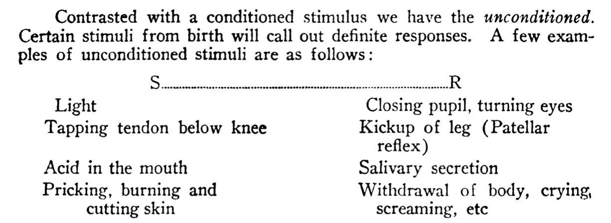
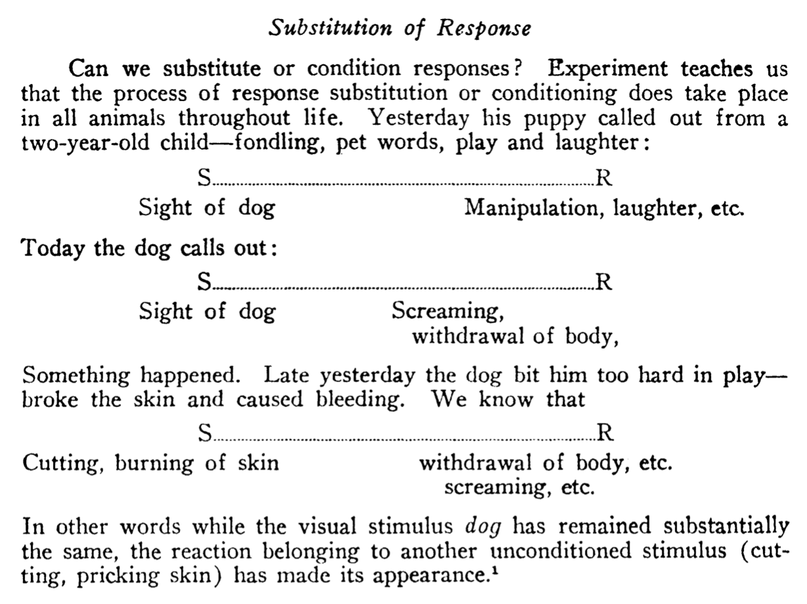

```{r, include = FALSE}
source("global_stuff.R")
```

# Behaviorism

```{r, cache=FALSE}
word_count <- wordcountaddin::word_count("C6_Behaviorism.Rmd")
wpm <- 200
reading_time <- paste0(round(word_count/wpm, 1), " minutes")
info <- data.frame(word_count,reading_time)
colnames(info) <- c("Word Count","Reading Time")
knitr::kable(info)
```

## Overview

Last chapter introduced associationism as an example of early ideas about how processes of cognition might work. This chapter covers the school of behaviorism, which rose to prominence in American psychology in the early 20th century (roughly between 1920s to 1960s). Depending on who is telling the history, behaviorism could be the dark ages of psychology that stood in the way of modern cognitive psychology, or a fore-bearer paving the way. 

This chapter describes the following attributes of behaviorism. First, an achievement of behaviorism was to legitimatize human and animal behavior as a topic of scientific inquiry in its own right. In this way, behaviorism carved out space between psychologies focused on intangible mental processes and physical brain-based processes. Second, behaviorism was constructed as a scientific system in the positivist tradition, which adds context to how I will present the goals and background ideas of the movement. Third, there were many versions of behaviorism because there were many researchers who developed and popularized their own brands. Fourth, perhaps because behaviorism was very large (occupying the time of many researchers), it is populated by controversial figures credited with creating and expanding the movement. The core claims and goals of behaviorism continue to have implications for the cognitive sciences and society in general today.

## The Rabbit Hole: To explain or not to explain?

One of the goals of this textbook is to examine how empirical evidence is used to test and develop explanations about how cognition works. In my view, the task of explaining how cognition works is an important goal of research into cognitive abilities. Why is explanation important? I think there are several reasons. Tentative theories provide guidance and clues about how to focus research inquiries, and good explanations can lead to the development of useful applications and technologies. I also think that explanations are intrinsically interesting and worthwhile for understanding ourselves and our relationship to the world around us. At the same time, not everyone agrees that explanation is intrinsically important or useful. 

For the moment, let's consider a fictional future where the science of cognition has been fully developed in great detail, with rock-solid explanations about how human and animal cognition works. Presumably, the theories and findings would have useful applications. Perhaps, the theories would explain new ways to help people restore lost cognitive abilities or expand upon existing cognitive abilities, or make machines capable of cognitive abilities. Although the basic science of cognition is interested in explaining cognition for reasons beside possible applications, it is clear that the ability to manipulate and control cognitive abilities is likely to emerge from a mature cognitive science capable of explaining how cognitive abilities work. Indeed, in the fictional future, it is easy to imagine that future societies maintained funding of cognitive science because of its high potential to discover methods to manipulate and control cognition, that could lead to new applied fields like cognitive engineering and technology. It is also easy to imagine that tools to manipulate and control cognition could be scary, especially if they were used for nefarious purposes. Finally, as some forms of behaviorism argued, it is possible to develop methods for manipulating and controlling cognition and behavior in the absence of theory and explanation.

### Youtube, machine-learning, and internet behaviorism

The basic ideas of behaviorism have not disappeared, and they are being used in modern society in extraordinary ways to control and manipulate cognition and behavior. Let's start with a modern example to motivate a closer inspection of the history of behaviorism and its implications for understanding how cognition works. 

The  example is from a podcast called the [Rabbit Hole, by New York Times columnist Kevin Roose](https://www.nytimes.com/column/rabbit-hole). The series is generally about "what the internet is doing do us?". The first story in the podcast is a haunting account of how a young man's life was influenced in major ways by watching YouTube videos over a period of several years. How could watching YouTube videos have such a major impact on someone's life? The answer lies in the powerful behavior changing methods being deployed on the internet by many companies. 

YouTube presents video content that users access through a web-browser. Web-browsers allow people to interact with the internet in many ways, like searching for content or clicking links on a webpage. Web-browsers also allow web-sites to embed code to harvest data about how people behave when they are on a website. For example, YouTube can store the history of videos that you watched, the order of videos that you clicked on, the amount of time spent watching each video, and many other kinds of user data (e.g., your location, your comment history, etc.). Furthermore, the behavioral data collected by websites can be combined with statistical techniques (like [machine learning](https://en.wikipedia.org/wiki/Machine_learning)) to generate predictions about future user behavior.

YouTube collected massive amounts of video watching behavior data from their users, and then used advanced machine learning algorithms to predict and ultimately control and manipulate user behavior. For example, one goal was to improve the video recommendation algorithm, which seems like a useful goal for users of YouTube. Improving the recommendation algorithm would help users find content they wanted to watch--very practical. YouTube also had the goal of increasing the amount of time that people spent watching YouTube videos. If people watched more videos, then they would see more advertisements, and that would help YouTube's bottom line. 

YouTube used the behavioral data they collected to generate predictions about what new videos to recommend to people in order to maximize their viewing time, and keep them watching YouTube videos as long as possible.

For some YouTube users, like the man in the podcast, the recommendation algorithm has deeply impacted their belief systems and behavior. For example, this user spent hours per day watching YouTube videos, many of which were selected by the recommendation algorithm. Initially, his viewing habits included searches for quirky music videos, but over time the algorithm suggested new content that increased his viewing time. This new content happened to politically polarizing content that became increasingly extreme on the far-right of the political spectrum. The user credits watching YouTube videos with his life decisions to become interested in and affiliated with white nationalist movements. Interestingly, the YouTube algorithm may also be involved in taking him in and out of this rabbit hole. For example, after becoming involved in far-right movements he continued to watch YouTube, which continued to suggest videos that would increase his viewing time. At this point in his viewing history, he became slightly more engaged by videos on the left-side of the political spectrum, and credits watching those videos with his decision to cease his involvement in far-right politics.

Although the cognitive sciences have been around for quite some time, there is no widely agreed upon theory or explanation of cognition that can be used to systematically control and manipulate behavior. Nevertheless, YouTube's algorithms that predict future viewing behavior from large databases of past viewing behavior appear highly successful in manipulating video watching times. In addition to the above anecdote, in 2017, the Wall Street Journal reported YouTube hit a new milestone--1 billion hours of YouTube had been watched in a single day ^[that's 41.6 million days worth of videos, or 114,155 years worth of video]. Viewing time had increased ten times from 2012, thanks to the introduction of predictive algorithms credited with driving the behavioral change. At the close of this chapter, we will return to the YouTube example to examine their algorithm as a modern case of implementing behavioral principles at massive scale. Next, we will examine the behaviorist approach to asking and answering questions about cognition.

## Enter Behaviorism

The previous chapters described characters in the historical play of psychology that set the stage for the entry of behaviorism. I'll cast one group as the "mentalists" and the other group as the "physicalists". The mentalists were interested in examining so-called "mental" processes of cognition. For example, Galton assumed that subjective experiences of mental images was a real thing that differed among people, and that could be an object of scientific inquiry. Titchener had developed introspectionism, where people could be trained to carefully, systematically, and "accurately" describe their inner mental experiences; and, those experiences were regarded as worthy of scientific inquiry. Even Thorndike entertained the notion that animals experience mental simulations (e.g., about the possibility of food reward following escape from a puzzle box) that link associations between a stimulus situation and an eventual reward. The "physicalists" were interested in examining and understanding the physiological basis of psychological processes. For example, Pavlov's goal was to measure how stimulus-response learning processes were reflected in the production of glandular secretions. In the play, both sides criticized each other on several grounds-- the mentalists lacked objective measures and definitions, the physiologists were too reductive and weren't studying cognition. 

I'll add a few additional backdrops framing the entry of behaviorism.
One backdrop I term scientific credentialism, which involves making claims about the kind of credentials that a field of study must possess in order to be considered a "true" science; and, for psychology, a concern, even obsession, with claiming possession of those credentials so that it would be recognized by society and other sciences as a proper science in its own right. The concern that psychology should become a science is related to the backdrops of [positivism](https://en.wikipedia.org/wiki/Positivism), and scientific [utopianism](https://en.wikipedia.org/wiki/Utopia#Utopianism). There are many philosophies of science that define the credentials of science in different ways, and prominent strains of behaviorism were constructed in the positivist tradition. Scientific utopianism refers broadly to the notion that society can be improved through science and technology. I briefly discuss positivism and scientific utopianism before we turn to the main act...behaviorism.

### Positivism

[Auguste Comte](https://plato.stanford.edu/entries/comte/) (1798–1857) created positivism as a part of founding [sociology](https://en.wikipedia.org/wiki/Sociology). He was a French philosopher writing during a period of social upheaval ^[e.g., the [1848 French revolution](https://en.wikipedia.org/wiki/Revolutions_of_1848) to remove the monarchy]. His work is an early example of a [philosophy of science](https://en.wikipedia.org/wiki/Philosophy_of_science) attempting to define attributes and processes of science, as well as hierarchical relations between scientific disciplines. He argued that science and society develops through theological, metaphysical, and positive stages to explain natural phenomena. In the theological phase, phenomena are explained by supernatural powers. For example, the mind is attributed to soul or spiritual forces. The metaphysical stage replaces the supernatural forces with abstractions. For example, the mind is psychic forces. In the positive stage a description system is achieved, whereby the scientific process will eventually describe the nouns and verbs of a phenomena. The nouns are the features of a phenomena, and the verbs are the mathematical laws that describe actions of the features. For example, the work of B.F. Skinner (at the end of this chapter), is an example of reducing cognition and behavior to a descriptive system in the positive tradition.

### Scientific Utopianism

Utopias take on many forms. In literature, [writers](https://en.wikipedia.org/wiki/List_of_utopian_literature) have envisioned more perfect utopian societies. In America, numerous attempts at [utopian communities](https://en.wikipedia.org/wiki/List_of_American_utopian_communities) have been made over centuries. Similarly, utopias have routinely been envisioned in academic discourse. For example, working with [Henri Saint-Simon](https://en.wikipedia.org/wiki/Henri_de_Saint-Simon) Auguste Comte extended his views on positivism to society at large, and envisioned utopic societies that would embrace scientific understanding and follow the motto of positivism: "Love as a principle and order as the basis; progress as the goal" ^[Social discourse in Brazil was influenced by positivism and Ordem and Progresso remains the national motto]. Comte also proposed a humanistic religion based on science to replace the Catholic church. 

Comte's ideas were popularized in England through [John Stuart Mill](https://en.wikipedia.org/wiki/John_Stuart_Mill), who published "Auguste Comte and Positivism" in 1865. Coincidentally, 1865 was the same year that Galton published his first paper on eugenics [@galtonHereditaryTalentCharacter1865]. Like Comte, Galton envisioned a utopic future where society could be improved through eugenics. Galton also proposed that eugenics attain the status of science and religion. Unfortunately, like so many fictional utopias that turned dystopic, as previous chapters have discussed, the real-world movement of eugenics led to many injustices. The rise of behaviorism in psychology coincided with the eugenics movement, and many behaviorists were committed to eugenics. Additionally, on occasion, behaviorism was forwarded by a few prominent psychologists as a scientific method to achieve utopias through social engineering.

## Associationism, Conditioning and Behaviorism

::: floatrightbox50

Robert Yerkes was a eugenicist and APA president who conducted the alpha-beta intelligence tests of the American military in World War I. He was also a comparative psychologist and studied animal cognition. Pavlov also became interested in eugenics (even after eugenics journals were outlawed in Russia in the 1920s), and conducted experiments on inheritance of temperament in dogs [@rossiianovIvanPavlovMoral2017].

:::

The more immediate backdrops to behaviorism were covered in the last chapter, these are the ideas of associationism and the discovery of classical conditioning by Pavlov. Pavlov's extended lectures on his work were translated in to English in 1927, however his methods were introduced to American psychologists much earlier. Pavlov won the Nobel prize in 1904 for his conditioning work in physiology; and in 1909, Yerkes and Margulis [@yerkesMethodPawlowAnimal1909] published descriptions of his methods in "The method of Pawlow in animal psychology" ^[In this publication Ivan P. Pavlov was written as J. P. Pawlow.].

Pavlov's methods and findings arrived in America at the same time that psychologists were aiming to establish themselves as a real science. Psychologists were already investigating associative processes in animal cognition (e.g., Thorndike), and humans using reaction times (e.g., Cattell). And, perhaps the physiological nature of Pavlov's methods appeared attractive as a "more scientific" way to measure associative learning. It is certainly the case that Pavlovian conditioning was inspirational to [John B. Watson](https://en.wikipedia.org/wiki/John_B._Watson) (1878-1958), the "arch-prophet" ^[according to Tolman] of Behaviorism. As we will cover shortly, Watson's behaviorism consisted of grand claims that psychology should become a science of stimulus-response learning.

In the remaining sections, instances of behaviorism are explored further by examining prominent individuals and their individual flavors of behaviorism. There were/are many behaviorists, but this chapter limits discussion to J. B. Watson, [Edward Tolman](https://en.wikipedia.org/wiki/Edward_C._Tolman) (1886–1959), [Clark L. Hull](https://en.wikipedia.org/wiki/Clark_L._Hull) (1884-1952) and [Burrhus F. Skinner](https://en.wikipedia.org/wiki/B._F._Skinner) (1904–1990).

## Watson's "Salesman" Behaviorism

J. B. Watson is one of the controversial figures I alluded to earlier. He is credited with ushering in behaviorism, and although he did push it in, he also left psychology soon after.

Watson completed his Ph.D. at the University of Chicago in 1903. By 1908, he became chair of the Psychology department at Johns Hopkins University. In 1913, he launched a critique of introspectionist methodology in his "Behaviorist Manifesto" titled, "Psychology as the Behaviorist Views it" [@watsonPsychologyBehavioristViews1913]. Watson became APA president in 1915, and in the society meeting that year he argued that psychology should adopt the methods of Pavlov to become a science of conditioned reflexes and stimulus-response learning [@watsonPlaceConditionedreflexPsychology1916]. 

Watson published some work on conditioned reflexes, but is most infamous for his "[Little Albert](https://en.wikipedia.org/wiki/Little_Albert_experiment)" experiment in 1920, which was an attempt to generalize Pavlovian conditioning to humans [@watsonConditionedEmotionalReactions1920]. This study was conducted before ethical standards for protecting human subjects in research, like those in the [Belmont Report](https://en.wikipedia.org/wiki/Belmont_Report), were codified and enforced in America. The experiment was supposed to have two phases, but only the first phase was conducted. In the baseline phase, an eleven month old infant ("little Albert") was exposed to stimuli such as a white rat, rabbit, dog, masks, burning newspapers and shown to elicit no fear response. During the fear-conditioning phase, whenever the infant was shown a white rat, Watson created a loud sound by striking a steel bar with a hammer. This caused the infant to become very distressed (crying, crawling away). Watson continued to "condition" the infant in this manner until he became afraid of the white rat in the absence of the sound. Watson went on to measure the infant becoming distressed to other objects in an apparent demonstration of generalized fear-conditioning. Watson apparently planned to "de-sensitize" the infant, using an extinction procedure. However, the infant was removed from the hospital where Watson was conducting his study before the planned de-sensitization could take place.

Also in 1920, Watson was fired from his position at John Hopkins as a part of a divorce scandal. He took an advertising job in New York and did not continue as an academic. However, he continued to publish popular science books, such as "Behaviorism" in 1924, and books on using behaviorist techniques for parenting. 

Watson's role in psychology can take on a positive light. In 1957, shortly before his death, he received the gold medal from the American Psychological Association for his contributions to the field. Proponents of the modern  field of [applied behavior analysis](https://en.wikipedia.org/wiki/Applied_behavior_analysis) have argued that historical descriptions of Watson's views that appear in textbooks have been inaccurate, and should be corrected so that Watson can be better appreciated  [@toddWhatPsychologyHas1994]. For example, in the 1970s many textbooks published claims that Watson was conducting early experiments in sex research while having an affair with his graduate student. However, historical research into those allegations have been inconclusive [@benjaminJohnWatsonAlleged2007].

Watson has also been presented in a very negative light. For example, in the book *Scientific Pollyannaism*, Yakushko describes Watson as an advocate of eugenics, and that his research was "filled with what could be described as sadistic experiments on infants and young children, many of whom Watson acknowledges to be orphans or children who were institutionalized under his care at a children’s hospital." [@yakushkoScientificPollyannaismInquisition2019]. Watson was listed as new active researcher in the "Eugenics Research Association" by the publication Eugenical News, but he was kicked out of that association as well when we has fired during his divorce.

Watson wrote widely on behaviorist techniques that parents could use to raise more superior children. These writings reiterated themes from eugenics on how superior parents can breed superior children, but allowed space for behaviorist interventions to play some role for gifted parents to nurture their children into even more gifted beings than would be possible by genetics alone. For example, the following quote appears in a book co-authored by Watson.

> "Superior parents have no guarantee that their children will be superior. No one can predict the qualities that will arise from their combination, for millions of possibilities are equally open. Superior parents must watch and help their children with the same anxious care that others must use. Of course we know that gifted parents are much more likely to produce gifted children, inferior parents inferior children."  [@jenningsSuggestionsModernScience1918].

Although Watson left academia when he was fired in 1920, he did not stop experimenting on children. Instead, he wrote about applying his behaviorist techniques on his own children, and described thought-experiments where he wished he could electrify his son Billy's toys, and then shock the other son Jimmy when ever he tried to touch them, as a way to teach him to avoid Billy's toys [@watsonPsychologicalCareInfant1928]. Paraphrasing from Yakushko [pg 107, @yakushkoScientificPollyannaismInquisition2019], she discusses family survivors of Watson's experimentation and notes that his children claimed they were damaged by his behaviorist parenting: Polly Watson became an alcoholic and was regularly hospitalized for suicide attempts. John Watson died of a bleeding ulcer that he attributed to his father's feeding schedule. William Watson published scathing personal letters about his fathers abuse in Life Magazine. Billy Watson committed suicide in his 30s. James Watson, the youngest son, became a vocal critic of his father and gave public interviews about recovering from Watson's abuse.

### Elements of Watson's Behaviorism

Watson coined the term behaviorism in 1913 [@watsonPsychologyBehavioristViews1913;@schneiderHistoryTermRadical1987] and left academia in 1920, taking up a sales position in New York City. However, he continued to express and sell his behaviorism by publishing popular science books, such as "Behaviorism" [@watsonBehaviorism1924, which was published in several revisions up to 1958]. On my reading of Watson, the elements of his behaviorism are largely ideological and often flamboyant. I attempt a summary of his views, and then provide a few quotes. 

Watson was concerned that psychology was not scientific enough. He criticized introspectionist methods because they did not provide objective and verifiable measures. He promoted Pavlov's discovery of conditioned reflexes as the new empirical strategy that would make psychology a real science; and, argued that psychology could be reduced to associative learning of stimulus-response relationships. He argued behaviorism's scientific goal was to establish empirical laws that would enable control and manipulation over stimulus-response learning. He envisioned behaviorism's societal goal as creating new applied fields like behavioral engineering, and a new behaviorist religion based on scientific ethics. There is a strong parallelism to the scientific utopianism of eugenics. Watson was a member of eugenics organizations, and although he later criticizes aspects of eugenics (notably after his membership was removed), he offered behaviorism as a supplement rather than wholesale replacement of eugenics. For example, eugenics was concerned with improving humans over generations from the side of genetic inheritance. Watson did not deny the role of genetic influences, but saw an opportunity to promote his behaviorism as the scientific way to improve humans within a generation from the perspective of environmental or learned influences. In this way, nature and nurture could be controlled and manipulated through eugenics and behaviorism to create a more perfect society.

### Watson's stimulus-response positivism

In his book Behaviorism, Watson follows Comte's positivism to criticize psychology and replace it with behaviorism. He argues that introspective psychology had a strong religious background (e.g, Comte's theological stage), invoking God-concepts to explain the mind; and, that appeals to abstract entities like consciousness were unscientific (e.g., Comte's metaphysical stage). He then advanced behaviorism as the proper scientific discipline (the positive stage).

Watson defined behaviorism as, "a natural science that takes the whole field of human adjustments as its own...[and that while it is interested in the physiology of parts of humans and animals it]...is intrinsically interested in what the whole animal will do from morning to night and form night to morning".

He further explains that "the interest of the behaviorist in man's doings is more than the interest of the spectator--he wants to control man's reactions as physical scientists want to control and manipulate other natural phenomena. It is the business of behavioristic psychology to be able to predict and to control human activity. To do this it must gather scientific data by experimental methods. Only then can the trained behaviorist predict, given the stimulus, what reaction will take place; or, given the reaction, state what the situation or stimulus is that has caused the reaction."

### Watson's S-R System

In positivism a descriptive scientific system is achieved when there are terms for describing features of a phenomena, and functions describing actions of the features, such that they come under predictable control. Watson saw the possibility for stimulus-response learning to become such a system. Elements of Watson's S-R system are described below with figures showing original text [from, @watsonBehaviorism1924].

::: floatrightbox50

```{r}
knitr::include_graphics("imgs/Watson_SR.png")
```

:::

Stimuli (in the environment) and responses (observable behaviors of humans and animals) and were both identifiable, and according to the idea of associationism, were linked together. Watson stated the problem for behaviorism as finding the functional relationship between stimuli and responses, such that one could be predicted or ascertained from the other.

One set of behaviors involved pre-existing stimulus-response associations in the form of unconditioned responses.

```{r,out.extra="class = 'centerfigureshadow'", fig.align="center"}

```

All remaining behavior was involved newly acquired or learned stimulus-responses associations. Watson generalized Pavlov's concept of conditioning to cover learned behaviors. He presented conditioning as a widely applicable process that could potentially allow a wide-range of stimuli to become a substitute for triggering a wide-range of responses.

```{r,out.extra="class = 'centerfigureshadow'", fig.align="center"}

```

Watson's S-R system was more like speculative fiction than a fully worked out system in the positivist tradition. He identified terms like stimuli and response, and made grand claims about possible functional relationships between them, but did not supply a detailed mathematical analysis of assumed lawful connections between stimuli and responses. Instead, he jumped straight to envisioning how future society could control its citizenry using behavioral engineering. He formulated societal level manipulations in terms of stimulus-response questions (see below), and was hopeful that behaviorism could help make predictions about outcomes of such interventions.

```{r,out.extra="class = 'centerfigureshadow'", fig.align="center"}
knitr::include_graphics("imgs/Watson_Society_S.png")
```

Similarly, he imagined desired outcomes for society, and implied that behavioral engineering would be able to construct the appropriate stimuli to force the behaviors he considered desirable.

```{r, out.extra="class = 'centerfigureshadow'", fig.align="center"}
knitr::include_graphics("imgs/Watson_Society_R.png")
```

Finally, Watson promoted behaviorism as more than the correct scientific way to do psychology. It was an academic social movement, in the tradition of scientific utopias, that was sweeping the nation. For example, in the figure below, Watson describes how psychology, philosophy, ethics, social psychology, sociology, religion, and psycho-analysis were all becoming behaviorist systems or disappearing if they were not.

```{r, out.extra="class = 'centerfigureshadow'", fig.align="center"}
knitr::include_graphics("imgs/Watson_sweep.png")
```

## Tolman's "cognitive" behaviorism

## Hull's mathematical behaviorism

## Skinner's "Radical" Behaviorism

## Modern Behaviorism

## Internet Behaviorism

