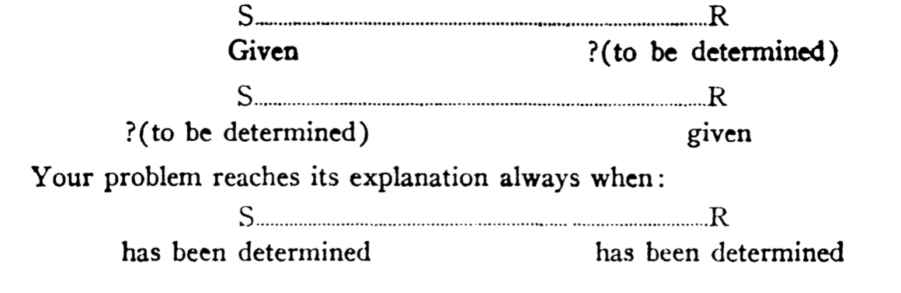
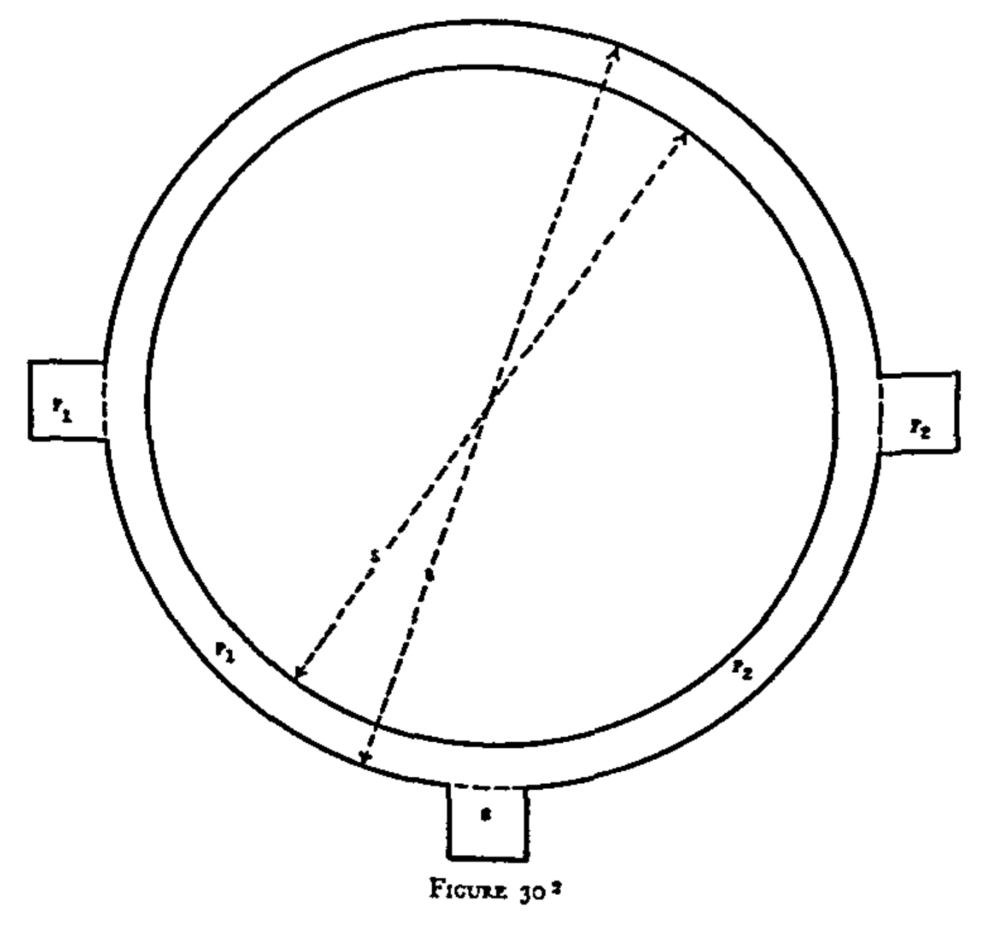
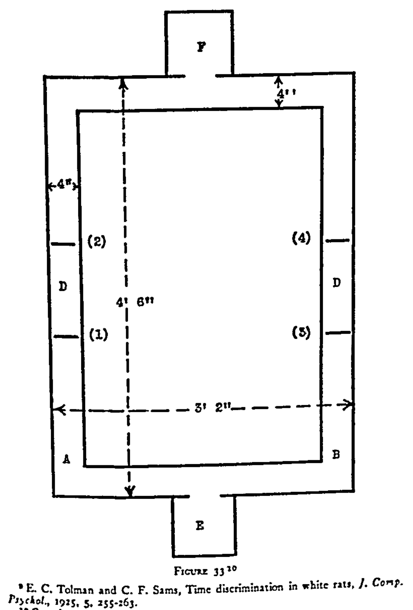
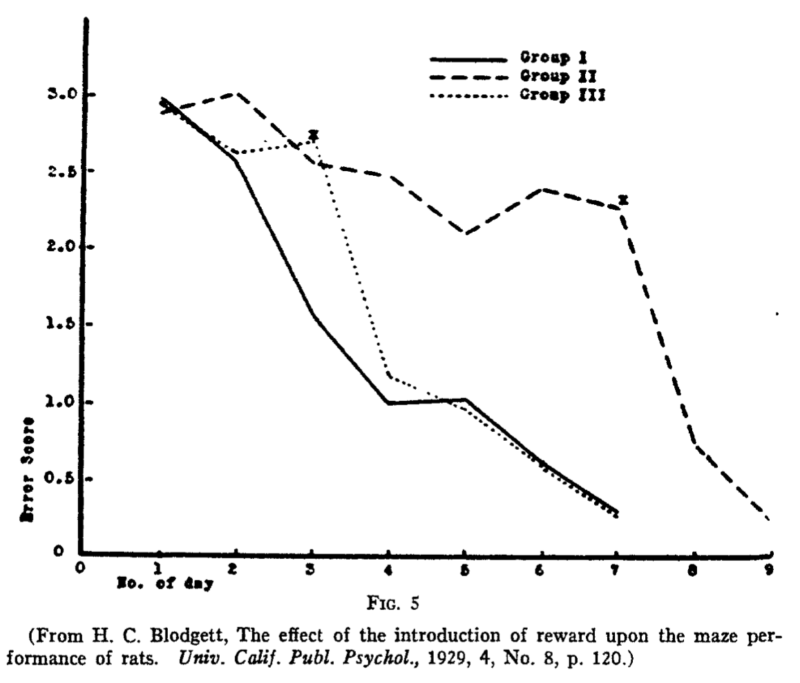

```{r, include = FALSE}
source("global_stuff.R")
```

# Behaviorism

```{r, cache=FALSE}
word_count <- wordcountaddin::word_count("C6_Behaviorism.Rmd")
wpm <- 200
reading_time <- paste0(round(word_count/wpm, 1), " minutes")
info <- data.frame(word_count,reading_time)
colnames(info) <- c("Word Count","Reading Time")
knitr::kable(info)
```

## Overview

Last chapter introduced associationism as an example of early ideas about how processes of cognition might work. This chapter covers the school of behaviorism, which rose to prominence in American psychology in the early 20th century (roughly between 1920s to 1960s). Depending on who is telling the history, behaviorism could be the dark ages of psychology that stood in the way of modern cognitive psychology, or a fore-bearer paving the way. 

This chapter describes the following attributes of behaviorism. First, an achievement of behaviorism was to legitimatize human and animal behavior as a topic of scientific inquiry in its own right. In this way, behaviorism carved out space between psychologies focused on intangible mental processes and physical brain-based processes. Second, behaviorism was constructed as a scientific system in the positivist tradition, which adds context to how I will present the goals and background ideas of the movement. Third, there were many versions of behaviorism because there were many researchers who developed and popularized their own brands. Fourth, perhaps because behaviorism was very large (occupying the time of many researchers), it is populated by controversial figures credited with creating and expanding the movement. The core claims and goals of behaviorism continue to have implications for the cognitive sciences and society in general today.

## The Rabbit Hole: To explain or not to explain?

One of the goals of this textbook is to examine how empirical evidence is used to test and develop explanations about how cognition works. In my view, the task of explaining how cognition works is an important goal of research into cognitive abilities. Why is explanation important? I think there are several reasons. Tentative theories provide guidance and clues about how to focus research inquiries, and good explanations can lead to the development of useful applications and technologies. I also think that explanations are intrinsically interesting and worthwhile for understanding ourselves and our relationship to the world around us. At the same time, not everyone agrees that explanation is intrinsically important or useful. 

For the moment, let's consider a fictional future where the science of cognition has been fully developed in great detail, with rock-solid explanations about how human and animal cognition works. Presumably, the theories and findings would have useful applications. Perhaps, the theories would explain new ways to help people restore lost cognitive abilities or expand upon existing cognitive abilities, or make machines capable of cognitive abilities. Although the basic science of cognition is interested in explaining cognition for reasons beside possible applications, it is clear that the ability to manipulate and control cognitive abilities is likely to emerge from a mature cognitive science capable of explaining how cognitive abilities work. Indeed, in the fictional future, it is easy to imagine that future societies maintained funding of cognitive science because of its high potential to discover methods to manipulate and control cognition, that could lead to new applied fields like cognitive engineering and technology. It is also easy to imagine that tools to manipulate and control cognition could be scary, especially if they were used for nefarious purposes. Finally, as some forms of behaviorism argued, it is possible to develop methods for manipulating and controlling cognition and behavior in the absence of theory and explanation.

### Youtube, machine-learning, and internet behaviorism

The basic ideas of behaviorism have not disappeared, and they are being used in modern society in extraordinary ways to control and manipulate cognition and behavior. Let's start with a modern example to motivate a closer inspection of the history of behaviorism and its implications for understanding how cognition works. 

The  example is from a podcast called the [Rabbit Hole, by New York Times columnist Kevin Roose](https://www.nytimes.com/column/rabbit-hole). The series is generally about "what the internet is doing do us?". The first story in the podcast is a haunting account of how a young man's life was influenced in major ways by watching YouTube videos over a period of several years. How could watching YouTube videos have such a major impact on someone's life? The answer lies in the powerful behavior changing methods being deployed on the internet by many companies. 

YouTube presents video content that users access through a web-browser. Web-browsers allow people to interact with the internet in many ways, like searching for content or clicking links on a webpage. Web-browsers also allow web-sites to embed code to harvest data about how people behave when they are on a website. For example, YouTube can store the history of videos that you watched, the order of videos that you clicked on, the amount of time spent watching each video, and many other kinds of user data (e.g., your location, your comment history, etc.). Furthermore, the behavioral data collected by websites can be combined with statistical techniques (like [machine learning](https://en.wikipedia.org/wiki/Machine_learning)) to generate predictions about future user behavior.

YouTube collected massive amounts of video watching behavior data from their users, and then used advanced machine learning algorithms to predict and ultimately control and manipulate user behavior. For example, one goal was to improve the video recommendation algorithm, which seems like a useful goal for users of YouTube. Improving the recommendation algorithm would help users find content they wanted to watch--very practical. YouTube also had the goal of increasing the amount of time that people spent watching YouTube videos. If people watched more videos, then they would see more advertisements, and that would help YouTube's bottom line. 

YouTube used the behavioral data they collected to generate predictions about what new videos to recommend to people in order to maximize their viewing time, and keep them watching YouTube videos as long as possible.

For some YouTube users, like the man in the podcast, the recommendation algorithm has deeply impacted their belief systems and behavior. For example, this user spent hours per day watching YouTube videos, many of which were selected by the recommendation algorithm. Initially, his viewing habits included searches for quirky music videos, but over time the algorithm suggested new content that increased his viewing time. This new content happened to politically polarizing content that became increasingly extreme on the far-right of the political spectrum. The user credits watching YouTube videos with his life decisions to become interested in and affiliated with white nationalist movements. Interestingly, the YouTube algorithm may also be involved in taking him in and out of this rabbit hole. For example, after becoming involved in far-right movements he continued to watch YouTube, which continued to suggest videos that would increase his viewing time. At this point in his viewing history, he became slightly more engaged by videos on the left-side of the political spectrum, and credits watching those videos with his decision to cease his involvement in far-right politics.

Although the cognitive sciences have been around for quite some time, there is no widely agreed upon theory or explanation of cognition that can be used to systematically control and manipulate behavior. Nevertheless, YouTube's algorithms that predict future viewing behavior from large databases of past viewing behavior appear highly successful in manipulating video watching times. In addition to the above anecdote, in 2017, the Wall Street Journal reported YouTube hit a new milestone--1 billion hours of YouTube had been watched in a single day ^[that's 41.6 million days worth of videos, or 114,155 years worth of video]. Viewing time had increased ten times from 2012, thanks to the introduction of predictive algorithms credited with driving the behavioral change. At the close of this chapter, we will return to the YouTube example to examine their algorithm as a modern case of implementing behavioral principles at massive scale. Next, we will examine the behaviorist approach to asking and answering questions about cognition.

## Enter Behaviorism

The previous chapters described characters in the historical play of psychology that set the stage for the entry of behaviorism. I'll cast one group as the "mentalists" and the other group as the "physicalists". The mentalists were interested in examining so-called "mental" processes of cognition. For example, Galton assumed that subjective experiences of mental images was a real thing that differed among people, and that could be an object of scientific inquiry. Titchener had developed introspectionism, where people could be trained to carefully, systematically, and "accurately" describe their inner mental experiences; and, those experiences were regarded as worthy of scientific inquiry. Even Thorndike entertained the notion that animals experience mental simulations (e.g., about the possibility of food reward following escape from a puzzle box) that link associations between a stimulus situation and an eventual reward. The "physicalists" were interested in examining and understanding the physiological basis of psychological processes. For example, Pavlov's goal was to measure how stimulus-response learning processes were reflected in the production of glandular secretions. In the play, both sides criticized each other on several grounds-- the mentalists lacked objective measures and definitions, the physiologists were too reductive and weren't studying cognition. 

I'll add a few additional backdrops framing the entry of behaviorism.
One backdrop I term scientific credentialism, which involves making claims about the kind of credentials that a field of study must possess in order to be considered a "true" science; and, for psychology, a concern, even obsession, with claiming possession of those credentials so that it would be recognized by society and other sciences as a proper science in its own right. The concern that psychology should become a science is related to the backdrops of [positivism](https://en.wikipedia.org/wiki/Positivism), and scientific [utopianism](https://en.wikipedia.org/wiki/Utopia#Utopianism). There are many philosophies of science that define the credentials of science in different ways, and prominent strains of behaviorism were constructed in the positivist tradition. Scientific utopianism refers broadly to the notion that society can be improved through science and technology. I briefly discuss positivism and scientific utopianism before we turn to the main act...behaviorism.

### Positivism

::: {.floatright25 data-latex=""}

```{r}
knitr::include_graphics("imgs/Auguste_Comte.jpg")
```

:::

[Auguste Comte](https://plato.stanford.edu/entries/comte/) (1798–1857) created positivism as a part of founding [sociology](https://en.wikipedia.org/wiki/Sociology). He was a French philosopher writing during a period of social upheaval ^[e.g., the [1848 French revolution](https://en.wikipedia.org/wiki/Revolutions_of_1848) to remove the monarchy]. His work is an early example of a [philosophy of science](https://en.wikipedia.org/wiki/Philosophy_of_science) attempting to define attributes and processes of science, as well as hierarchical relations between scientific disciplines. He argued that science and society develops through theological, metaphysical, and positive stages to explain natural phenomena. In the theological phase, phenomena are explained by supernatural powers. For example, the mind is attributed to soul or spiritual forces. The metaphysical stage replaces the supernatural forces with abstractions. For example, the mind is psychic forces. In the positive stage a description system is achieved, whereby the scientific process will eventually describe the nouns and verbs of a phenomena. The nouns are the features of a phenomena, and the verbs are the mathematical laws that describe actions of the features. For example, the work of B.F. Skinner (at the end of this chapter), is an example of reducing cognition and behavior to a descriptive system in the positive tradition.

### Scientific Utopianism

Utopias take on many forms. In literature, [writers](https://en.wikipedia.org/wiki/List_of_utopian_literature) have envisioned more perfect utopian societies. In America, numerous attempts at [utopian communities](https://en.wikipedia.org/wiki/List_of_American_utopian_communities) have been made over centuries. Similarly, utopias have routinely been envisioned in academic discourse. For example, working with [Henri Saint-Simon](https://en.wikipedia.org/wiki/Henri_de_Saint-Simon) Auguste Comte extended his views on positivism to society at large, and envisioned utopic societies that would embrace scientific understanding and follow the motto of positivism: "Love as a principle and order as the basis; progress as the goal" ^[Social discourse in Brazil was influenced by positivism and Ordem and Progresso remains the national motto]. Comte also proposed a humanistic religion based on science to replace the Catholic church. 

Comte's ideas were popularized in England through [John Stuart Mill](https://en.wikipedia.org/wiki/John_Stuart_Mill), who published "Auguste Comte and Positivism" in 1865. Coincidentally, 1865 was the same year that Galton published his first paper on eugenics [@galtonHereditaryTalentCharacter1865]. Like Comte, Galton envisioned a utopic future where society could be improved through eugenics. Galton also proposed that eugenics attain the status of science and religion. Unfortunately, like so many fictional utopias that turned dystopic, as previous chapters have discussed, the real-world movement of eugenics led to many injustices. The rise of behaviorism in psychology coincided with the eugenics movement, and many behaviorists were committed to eugenics. Additionally, on occasion, behaviorism was forwarded by a few prominent psychologists as a scientific method to achieve utopias through social engineering.

## Associationism, Conditioning and Behaviorism

::: {.floatrightbox50 data-latex=""}

Robert Yerkes was a eugenicist and APA president who conducted the alpha-beta intelligence tests of the American military in World War I. He was also a comparative psychologist and studied animal cognition. Pavlov also became interested in eugenics (even after eugenics journals were outlawed in Russia in the 1920s), and conducted experiments on inheritance of temperament in dogs [@rossiianovIvanPavlovMoral2017].

:::

The more immediate backdrops to behaviorism were covered in the last chapter, these are the ideas of associationism and the discovery of classical conditioning by Pavlov. Pavlov's extended lectures on his work were translated in to English in 1927, however his methods were introduced to American psychologists much earlier. Pavlov won the Nobel prize in 1904 for his conditioning work in physiology; and in 1909, Yerkes and Margulis [@yerkesMethodPawlowAnimal1909] published descriptions of his methods in "The method of Pawlow in animal psychology" ^[In this publication Ivan P. Pavlov was written as J. P. Pawlow.].

Pavlov's methods and findings arrived in America at the same time that psychologists were aiming to establish themselves as a real science. Psychologists were already investigating associative processes in animal cognition (e.g., Thorndike), and humans using reaction times (e.g., Cattell). And, perhaps the physiological nature of Pavlov's methods appeared attractive as a "more scientific" way to measure associative learning. It is certainly the case that Pavlovian conditioning was inspirational to [John B. Watson](https://en.wikipedia.org/wiki/John_B._Watson) (1878-1958), the "arch-prophet" ^[according to Tolman] of Behaviorism. As we will cover shortly, Watson's behaviorism consisted of grand claims that psychology should become a science of stimulus-response learning.

In the remaining sections, instances of behaviorism are explored further by examining prominent individuals and their individual flavors of behaviorism. There were/are many behaviorists, but this chapter limits discussion to J. B. Watson, [Edward Tolman](https://en.wikipedia.org/wiki/Edward_C._Tolman) (1886–1959), [Clark L. Hull](https://en.wikipedia.org/wiki/Clark_L._Hull) (1884-1952) and [Burrhus F. Skinner](https://en.wikipedia.org/wiki/B._F._Skinner) (1904–1990).

## Watson's "Salesman" Behaviorism

::: {.floatright25 data-latex=""}
```{r}
knitr::include_graphics("imgs/John_Broadus_Watson.jpg")
```
:::

J. B. Watson is one of the controversial figures I alluded to earlier. He is credited with ushering in behaviorism, and although he did push it in, he also left psychology soon after.

Watson completed his Ph.D. at the University of Chicago in 1903. By 1908, he became chair of the Psychology department at Johns Hopkins University. In 1913, he launched a critique of introspectionist methodology in his "Behaviorist Manifesto" titled, "Psychology as the Behaviorist Views it" [@watsonPsychologyBehavioristViews1913]. Watson became APA president in 1915, and in the society meeting that year he argued that psychology should adopt the methods of Pavlov to become a science of conditioned reflexes and stimulus-response learning [@watsonPlaceConditionedreflexPsychology1916]. 

Watson published some work on conditioned reflexes, but is most infamous for his "[Little Albert](https://en.wikipedia.org/wiki/Little_Albert_experiment)" experiment in 1920, which was an attempt to generalize Pavlovian conditioning to humans [@watsonConditionedEmotionalReactions1920]. This study was conducted before ethical standards for protecting human subjects in research, like those in the [Belmont Report](https://en.wikipedia.org/wiki/Belmont_Report), were codified and enforced in America. The experiment was supposed to have two phases, but only the first phase was conducted. In the baseline phase, an eleven month old infant ("little Albert") was exposed to stimuli such as a white rat, rabbit, dog, masks, burning newspapers and shown to elicit no fear response. During the fear-conditioning phase, whenever the infant was shown a white rat, Watson created a loud sound by striking a steel bar with a hammer. This caused the infant to become very distressed (crying, crawling away). Watson continued to "condition" the infant in this manner until he became afraid of the white rat in the absence of the sound. Watson went on to measure the infant becoming distressed to other objects in an apparent demonstration of generalized fear-conditioning. Watson apparently planned to "de-sensitize" the infant, using an extinction procedure. However, the infant was removed from the hospital where Watson was conducting his study before the planned de-sensitization could take place.

Also in 1920, Watson was fired from his position at John Hopkins as a part of a divorce scandal. He took an advertising job in New York and did not continue as an academic. However, he continued to publish popular science books, such as "Behaviorism" in 1924, and books on using behaviorist techniques for parenting. 

Watson's role in psychology can take on a positive light. In 1957, shortly before his death, he received the gold medal from the American Psychological Association for his contributions to the field. Proponents of the modern  field of [applied behavior analysis](https://en.wikipedia.org/wiki/Applied_behavior_analysis) have argued that historical descriptions of Watson's views that appear in textbooks have been inaccurate, and should be corrected so that Watson can be better appreciated  [@toddWhatPsychologyHas1994]. For example, in the 1970s many textbooks published claims that Watson was conducting early experiments in sex research while having an affair with his graduate student. However, historical research into those allegations have been inconclusive [@benjaminJohnWatsonAlleged2007].

Watson has also been presented in a very negative light. For example, in the book *Scientific Pollyannaism*, Yakushko describes Watson as an advocate of eugenics, and that his research was "filled with what could be described as sadistic experiments on infants and young children, many of whom Watson acknowledges to be orphans or children who were institutionalized under his care at a children’s hospital." [@yakushkoScientificPollyannaismInquisition2019]. Watson was listed as new active researcher in the "Eugenics Research Association" by the publication Eugenical News, but he was kicked out of that association as well when we has fired during his divorce.

Watson wrote widely on behaviorist techniques that parents could use to raise more superior children. These writings reiterated themes from eugenics on how superior parents can breed superior children, but allowed space for behaviorist interventions to play some role for gifted parents to nurture their children into even more gifted beings than would be possible by genetics alone. For example, the following quote appears in a book co-authored by Watson.

> "Superior parents have no guarantee that their children will be superior. No one can predict the qualities that will arise from their combination, for millions of possibilities are equally open. Superior parents must watch and help their children with the same anxious care that others must use. Of course we know that gifted parents are much more likely to produce gifted children, inferior parents inferior children."  [@jenningsSuggestionsModernScience1918].

Although Watson left academia when he was fired in 1920, he did not stop experimenting on children. Instead, he wrote about applying his behaviorist techniques on his own children, and described thought-experiments where he wished he could electrify his son Billy's toys, and then shock the other son Jimmy when ever he tried to touch them, as a way to teach him to avoid Billy's toys [@watsonPsychologicalCareInfant1928]. Paraphrasing from Yakushko [pg 107, @yakushkoScientificPollyannaismInquisition2019], she discusses family survivors of Watson's experimentation and notes that his children claimed they were damaged by his behaviorist parenting: Polly Watson became an alcoholic and was regularly hospitalized for suicide attempts. John Watson died of a bleeding ulcer that he attributed to his father's feeding schedule. William Watson published scathing personal letters about his fathers abuse in Life Magazine. Billy Watson committed suicide in his 30s. James Watson, the youngest son, became a vocal critic of his father and gave public interviews about recovering from Watson's abuse.

### Elements of Watson's Behaviorism

Watson coined the term behaviorism in 1913 [@watsonPsychologyBehavioristViews1913;@schneiderHistoryTermRadical1987] and left academia in 1920, taking up a sales position in New York City. However, he continued to express and sell his behaviorism by publishing popular science books, such as "Behaviorism" [@watsonBehaviorism1924, which was published in several revisions up to 1958]. On my reading of Watson, the elements of his behaviorism are largely ideological and often flamboyant. I attempt a summary of his views, and then provide a few quotes. 

Watson was concerned that psychology was not scientific enough. He criticized introspectionist methods because they did not provide objective and verifiable measures. He promoted Pavlov's discovery of conditioned reflexes as the new empirical strategy that would make psychology a real science; and, argued that psychology could be reduced to associative learning of stimulus-response relationships. He argued behaviorism's scientific goal was to establish empirical laws that would enable control and manipulation over stimulus-response learning. He envisioned behaviorism's societal goal as creating new applied fields like behavioral engineering, and a new behaviorist religion based on scientific ethics. There is a strong parallelism to the scientific utopianism of eugenics. Watson was a member of eugenics organizations, and although he later criticizes aspects of eugenics (notably after his membership was removed), he offered behaviorism as a supplement rather than wholesale replacement of eugenics. For example, eugenics was concerned with improving humans over generations from the side of genetic inheritance. Watson did not deny the role of genetic influences, but saw an opportunity to promote his behaviorism as the scientific way to improve humans within a generation from the perspective of environmental or learned influences. In this way, nature and nurture could be controlled and manipulated through eugenics and behaviorism to create a more perfect society.

### Watson's stimulus-response positivism

In his book Behaviorism, Watson follows Comte's positivism to criticize psychology and replace it with behaviorism. He argues that introspective psychology had a strong religious background (e.g, Comte's theological stage), invoking God-concepts to explain the mind; and, that appeals to abstract entities like consciousness were unscientific (e.g., Comte's metaphysical stage). He then advanced behaviorism as the proper scientific discipline (the positive stage).

Watson defined behaviorism as, "a natural science that takes the whole field of human adjustments as its own...[and that while it is interested in the physiology of parts of humans and animals it]...is intrinsically interested in what the whole animal will do from morning to night and form night to morning".

He further explains that "the interest of the behaviorist in man's doings is more than the interest of the spectator--he wants to control man's reactions as physical scientists want to control and manipulate other natural phenomena. It is the business of behavioristic psychology to be able to predict and to control human activity. To do this it must gather scientific data by experimental methods. Only then can the trained behaviorist predict, given the stimulus, what reaction will take place; or, given the reaction, state what the situation or stimulus is that has caused the reaction."

### Watson's S-R System

In positivism a descriptive scientific system is achieved when there are terms for describing features of a phenomena, and functions describing actions of the features, such that they come under predictable control. Watson saw the possibility for stimulus-response learning to become such a system. Elements of Watson's S-R system are described below with figures showing original text [from, @watsonBehaviorism1924].

::: {.floatrightbox50 data-latex=""}

```{r}

```

:::

Stimuli (in the environment) and responses (observable behaviors of humans and animals) and were both identifiable, and according to the idea of associationism, were linked together. Watson stated the problem for behaviorism as finding the functional relationship between stimuli and responses, such that one could be predicted or ascertained from the other.

One set of behaviors involved pre-existing stimulus-response associations in the form of unconditioned responses.

```{r, eval=knitr::is_html_output(), echo=FALSE,out.extra="class = 'centerfigureshadow'", fig.align="center"}
knitr::include_graphics("imgs/Watson_unconditioned.png")
```

```{r, eval=knitr::is_latex_output(), echo=FALSE, fig.align="center"}
knitr::include_graphics("imgs/Watson_unconditioned.png")
```

All remaining behavior was involved newly acquired or learned stimulus-responses associations. Watson generalized Pavlov's concept of conditioning to cover learned behaviors. He presented conditioning as a widely applicable process that could potentially allow a wide-range of stimuli to become a substitute for triggering a wide-range of responses.

```{r, eval=knitr::is_html_output(), echo=FALSE,out.extra="class = 'centerfigureshadow'", fig.align="center"}
knitr::include_graphics("imgs/Watson_conditioned.png")
```

```{r, eval=knitr::is_latex_output(), echo=FALSE, fig.align="center"}
knitr::include_graphics("imgs/Watson_conditioned.png")
```


Watson's S-R system was more like speculative fiction than a fully worked out system in the positivist tradition. He identified terms like stimuli and response, and made grand claims about possible functional relationships between them, but did not supply a detailed mathematical analysis of assumed lawful connections between stimuli and responses. Instead, he jumped straight to envisioning how future society could control its citizenry using behavioral engineering. He formulated societal level manipulations in terms of stimulus-response questions (see below), and was hopeful that behaviorism could help make predictions about outcomes of such interventions.

```{r, eval=knitr::is_html_output(), echo=FALSE,out.extra="class = 'centerfigureshadow'", fig.align="center"}
knitr::include_graphics("imgs/Watson_Society_S.png")
```

```{r, eval=knitr::is_latex_output(), echo=FALSE, fig.align="center"}
knitr::include_graphics("imgs/Watson_Society_S.png")
```

Similarly, he imagined desired outcomes for society, and implied that behavioral engineering would be able to construct the appropriate stimuli to force the behaviors he considered desirable.

```{r, eval=knitr::is_html_output(), echo=FALSE,out.extra="class = 'centerfigureshadow'", fig.align="center"}
knitr::include_graphics("imgs/Watson_Society_R.png")
```

```{r, eval=knitr::is_latex_output(), echo=FALSE, fig.align="center"}
knitr::include_graphics("imgs/Watson_Society_R.png")
```

Finally, Watson promoted behaviorism as more than the correct scientific way to do psychology. It was an academic social movement, in the tradition of scientific utopias, that was sweeping the nation. For example, in the figure below, Watson describes how psychology, philosophy, ethics, social psychology, sociology, religion, and psycho-analysis were all becoming behaviorist systems or disappearing if they were not.

```{r, eval=knitr::is_html_output(), echo=FALSE,out.extra="class = 'centerfigureshadow'", fig.align="center"}
knitr::include_graphics("imgs/Watson_sweep.png")
```

```{r, eval=knitr::is_latex_output(), echo=FALSE, fig.align="center"}
knitr::include_graphics("imgs/Watson_sweep.png")
```

## Tolman's "Purposive" behaviorism

> "All students agree as to the facts. They disagree, however, on theory and explanation." -- Tolman, 1948 [@tolmanCognitiveMapsRats1948]

::: {.floatright25 data-latex=""}
```{r}
knitr::include_graphics("imgs/Tolman_portrait.jpg")
```
:::

[Edward C. Tolman's](https://en.wikipedia.org/wiki/Edward_C._Tolman) (1886-1959) flavor of behaviorism incorporated elements that are common in modern cognitive psychology. In 1932, he wrote "Purposive Behavior in Animals and Men" [@tolmanPurposiveBehaviorAnimal1932], which summarizes his research and views on behaviorism. In presenting his view, Tolman points out that numerous authors, such as "Holt, Perry, Singer, de Laguna, Hunter, Weiss, Lashley" had been developing their own versions of behaviorism, and refers to Roback's "Behaviorism and Psychology", for "the best analysis and bibliography of the different varieties of behaviorims extant to 1923". I mention the diversity of views to emphasize the difficulty of treating the period of behaviorism as single monolithic entity. Instead, much like there are numerous views on cognition today, there were numerous views on behaviorism. Similarly, it is worth noting that there were many non-behaviorist views on psychology and non-behaviorist lines of research that were ongoing throughout the so-called period of behaviorism.

After some training in Germany, Tolman received his Ph.D. at Harvard under [Edwin Holt](https://en.wikipedia.org/wiki/Edwin_Holt) in 1915, who had worked under [Hugo Munsterberg](https://en.wikipedia.org/wiki/Hugo_Münsterberg). He is well-known for his research on maze-learning in rats, which is the focus of this section. 

<!--In addition to basic research on learning processes in rats, Tolman also had an applied side. For example, following world war II, he wrote "Assessment of Men" [], which describes how he coordinated psychological testing for personnel assignment in the division, X. -->

### Molar definition of behavior

Tolman suggested that Watson had given a "molecular" definition of behaviorism, which supplied important units like stimulus and response, and reduced behavior to "strict physical and physiological muscle-twitches". Tolman ^[and others, Holt, de Laguna, Weiss] argued in favor of a "molar" definition of behaviorism, which is the idea that behaviors are things in and of themselves that could be studied, irrespective of their "molecular" units. To quote from Tolman:

> "An act qua 'behavior' has distinctive properties all its own. These are to be identified and described irrespective of whatever muscular, glandular, or neural processes underlie them. These new properties, thus distinctive of molar behavior, are presumably strictly correlated with and, if you will, dependent upon, physiological motions. But descriptively and per se they are other than these motions."

> "A rat running a maze, a cat getting out of a puzzle box, a man driving home to dinner, a child hifing from a stranger, a woman doing her washing or gossiping over the telephone, a pupil marking a mental test sheet, a psychologist reciting a list of nonsense syllables, my friend and I telling one another our thought and feelings-- these are behaviors (qua molar). And it must be noted that in mentioning no one of them have we referred to, or, we blush to confess it, for the most part even known, what were the exact muscles and glands, sensory nerves, and motor nerves involved. For these responses somehow had other sufficiently identifying properties of their own."

### Purposive and cognitive determinants

Watson's stimulus-response behaviorism identify S and R as the important objective units of analysis, and they neglect or deliberately ignore the purpose of behavior, and potential cognitive processes intervening between perception of a stimulus and final production of a response. In suggesting that behavior should be studied as a wholisitic molar unit in and of itself, Tolman further argued that additional terms were necessary to describe the purposes and cognitive mechanisms of behavior. In some sense, Tolman's ideas appeared to revisit the intangible mental operations that inspired behaviorist critiques of "mentalist" psychology. However, Tolman also proceeded in the positivist tradition and was at pains to clarify that his new terms were intended only as descriptors. For example, just like it would be OK to describe a stimulus as being "green", without implying anything about an inner mental experience of seeing a green object; Tolman thought it would be useful and necessary for a science of behavior to describe behaviors as having purposes and cognitions--but only for descriptive purposes, and not to imply the inner mental processes.

The following quotes show Tolman building his argument to use terms for purpose and cognition to more fully describe behavior.

> "Behavior in our sense, always seems to have the character of getting to or getting-from a specific goal object, or goal situation. The complete identification of an single behavior act requires, that is, a reference first to some particular goal object or objects which that act is getting to, or, it may be, getting from, or both. Thus, for example, the rat's behavior of "running the maze" has as its first and perhaps most important identifying feature the fact that it is a getting to food".

> "To sum up, the complete descriptive identification of any behavior act per se requires descriptive statements relative to (a) the goal-object or objects, being got to or from, (b) the specific pattern of commerces with means-objects involved in this getting to or from, and (c) the facts exhibited relative to the selective identification of routes and means-objects as involving short (easy) commerces with means-objects for thus getting to or from"

> "But surely any "tough minded" reader will by now be up in arms. For it is clear that thus to identify behaviors in erms of goal-objects, and patterns of commerces with means-objects as selected short ways to get to or from the goal-objects, is to imply something perilously like purposes and cognitions. And, this surely will be offensive to any hard headed, well brought up psychology of the present day"

> "And yet, there seems to be no other way out. Behavior as behavior, that is, as molar, is purposive and is cognitive. These purposes and cognitions are of its immediate descriptive warp and woof. It no doubt is strictly and completely dependent upon an underlying manifold of physics and chemistry, but initially and as a matter of first identification, behavior as behavior reeks of purpose and of cognition."

> "Finally, however, it must nonetheless be emphasized that purposes and cognitions which are thus immediately, immanently, in behavior are wholly objective as to definition. They are defined by characters and relationships which we observe out there in the behavior. We, the observers, watch the behavior of the rat, the cat, or the man, and note its character as a getting to such and such by means of such and such a selected pattern of commerces-with. It is we, the independent neutral observers, who note these perfectly objective characters as immanent in the behavior and have happened to choose the terms purpose and cognition as generic names for such characters."

### The rat in the maze

Tolman formulated his behaviorism in the context of laboratory research on maze-running behavior in the white rat. His 1932 book [@tolmanPurposiveBehaviorAnimal1932] arguing for the inclusion of goals and cognitions in a descriptive science of behavior also provides a sizeable review of maze-running research conducted to that date. Many other researchers besides Tolman, including J. B. Watson, used maze-running procedures to study behavior.

Maze-running procedures were similar to Thorndike's puzzle boxes. Typically, an animal like a white rat was placed in a physical maze, and then its behavior was observed as it moved about the maze, usually in search of a food reward. More importantly, manipulations were introduced to test ideas about the processes underlying the animals abilities to navigate the maze. Tolman ran experiments and assembled evidence from other labs to build evidence in favor of his view that animals had goals and cognitions (in his behaviorist sense). Some examples of the procedures and findings used to make inferences about purposive and cognitive behavior in the white rate are next.

#### Purposive behavior

::: {.floatrightbox50 data-latex=""}

```{r}
knitr::include_graphics("imgs/Tolman_AlleyMaze.png")
```

:::

Tolman argued that behaviors were obviously goal-driven and should be described in terms of goals and purposes. To support this argument, he showed that maze running behavior could be influenced by apparent goals or motivational drives. The figure depicts one of Tolman's "Alley Mazes". The maze had a start point where the rat entered, and an end point where it could receive food reward. In between, the rat had to navigate the maze, which contained several corridors, doors, and curtains, and many "blind-alleys" leading to an empty wall. In general, rats explore the maze and eventually find the food reward. The behavior of the rat can be measured in different ways, such as the total amount of time taken to succesfully navigate the maze. In the following experiment, Tolman measured the number of errors an animal made during navigation. An error is counted whenever the rat enters a blind-alley entrance.

::: {.floatrightbox50 data-latex=""}

```{r}
knitr::include_graphics("imgs/Tolman_hunger.png")
```

:::

In one experiment [@tolmanDegreesHungerReward1930], Tolman manipulated level of hunger and amount of reward. Rats ran the maze when they were either very hungry or not very hungry. Additionally, for both groups, food was either given as a reward at the end of the maze, or food was not given. The results of the experiment are shown in the figure, plotting error scores. Note also, that the experiment was conducted over many days.

In general, all groups of rats showed fewer errors across the days of the experiment (on day one, the lines started with a high number of errors, and trend downward over days to a lower number of errors). This means that the rats made fewer wrong turns as they gained experience with navigating the maze over days. 

More specifically, the hunger and reward manipulations clearly influenced the number of errors that rats made over days. And, Tolman interpreted the data as consistent with the goal-driven or purposive behavior. The error scores for the "hungry reward" group showed the largest decreases over days compared to the other groups. According to Tolman, these rats were driven by hunger and motivated by the reward they would receive at the end. Over days, they apparently learned how to navigate the maze in an efficient manner, to get the food as quickly as possible, and without making wrong turns.

By comparison, the "Hungry non-reward" rats showed a decrease in errors across days, but the decrease was not as large as the first group. These rats were driven by hunger, but they were not as motivated to get to the end of the maze because there was no food at the end. Similarly, both "less hungry" groups showed small decreases in number of errors over days. This was consistent with having little drive to search for food in an efficient manner.

#### Cognitive Behavior

Tolman also argued that behavior should be described in terms of cognitive acts. He used choice and discrimination behavior in rats as evidence. The form of the argument was to first to demonstrate that a rat could distinguish between two option (discrimination), and then show that the rat's behavior showed a preference (choice) toward one of the options. This kind of behavior was characterized as being cognitive because it implied a process of considering costs and benefits of different options, and making choices to take actions that would help the animal achieve its goals.

::: {.floatrightbox50 data-latex=""}

```{r}

```

:::

Tolman credits De Camp [@decampRelativeDistanceFactor1920] with connecting the results of a distance discrimination experiment to the argument that behavior should be described with cognitive features. The figure shows De Camp's circular maze. The rat entered the maze at the bottom starting point. The maze had two rooms on the left and right of the circle that could contain food. In the first phase, the right room was blocked, and food could be found in the left room. The rat's could either go the short way (turn left), or the long-way, (turn right and go around the circle). De Camp showed that with practice, rat's showed a preference for the shortest path. In a second, phase, the left room was blocked, and the right room contained the food. Again, after practice, the rat's showed a preference to turn right and take the shortest path to the food. This behavior was aptly described as cognitive, because the rats appeared to be weighing the option to go the long or short way, and choosing the shortest way to achieve their goal.

::: {.floatrightbox50 data-latex=""}

```{r}
knitr::include_graphics("imgs/Tolman_Minima.png")
```

:::

Tolman points to another interesting experiment by Gengerelli [@gengerelliPrincipleMaximaMinima1930], showing that rats can learn to take the shortest or most efficient path through a maze. The figure shows Gengerelli's maze, which looks kind of like a [bean machine](https://en.wikipedia.org/wiki/Bean_machine). The maze included numerous choice points where a rat could decide to turn left or right and take an open pathway or not. For example, imagine how many ways you could solve the maze with by drawing a line from the start to the finish. There are many ways, and some are longer than others. Gengerelli showed that, given multiple attempts, rats will begin taking shorter paths to get the food reward at the end. 

::: {.floatrightbox50 data-latex=""}

```{r}

```

:::

As a last example, Tolman [@samsTimeDiscriminationWhite1925] showed that rats were capable of temporal discrimination, and appear to make choices while navigating a maze that reduce the amount of time taken to get a food reward. Tolman's temporal discrimination maze is shown in the figure. Rats started at the entrance (E), and attempted to find the food in the room on the other side (F). However, when the rats took the A corridor to the left, or the B corridor to the right, they were detained for different amounts of time in the "detention" rooms (D) on both sides of the maze. For example, rats would be detained for one to two minutes on the left side, or three to four minutes on the right side. After the first phase were rats experienced the delays, they were allowed to navigate the maze without being detained. The rat's showed a preference to take the route associated with the shortest temporal delay.

### Tolman's inheritance project: A rat model of eugenics

Animals like rats have been used in research for many purposes. The animal may be an object of the research in its own right, or used as a model example to investigate something else, or both. For example, rats are commonly used as models for human disorders such as eating disorders and schizophrenia. One goal of research using animal models of disorders is to develop cures for the disorder in rats that could generalize to humans.

Tolman conducted animal research using rats that had elements of both styles of research. He was interested in the behavior of rats as an object of study in its own right, but also as a model in at least two respects. First, Tolman was interested in using rats as model for building a descriptive science of behavior that could be generalized to other animals. In this first respect, Tolman used his maze-running experiments to argue in favor of expanding the terms in the descriptive science of behaviorism--specifically, behaviorism should include terms for describing the purposive and cognitive aspects of behaviors. Second, Tolman initiated another line of maze-running experiments that I will describe as Tolmans' rat model of eugenics.

One aim of Galton's eugenics was to measure differences in eugenically desired traits (like intelligence), and then selectively breed humans to increase those traits (assuming they had a genetic basis) over time. Tolman and his student Robert Tryon attempted something similar in rats [for a review see, @innisTolmanTryonEarly1992], they selectively bred rats for maze-running ability over generations. On the one hand, these experiments could be described without the term eugenics, and instead described as experiments on the genetic bases of maze-running behavior in rats. On the other hand, the connection to eugenics is clear enough, and existed before Tolman. For example, early comparative psychologists Edward Thorndike and Robert Yerkes were prominent eugenicists; and Thorndike described his puzzle box research as a preliminary step toward measuring individual differences in animal intelligence.

Like Thorndike, Tryon analogized the maze-running procedure as a tool to measure individual differences in rat intelligence. Measures of time and efficiency in navigating the maze were used as proxies for rat intelligence, and not surprisingly, there were reliable individual differences in rat maze-running performance [@tryonIndividualDifferences1942]. Tolman first attempted a breeding program to create "bright" versus "dull" strains of maze-running rats [@tolmanInheritanceMazelearningAbility1924]. In this work, Tolman exposed rats to a maze and measured individual differences in maze-running efficiency. He then bred "bright" rats together, and separately bred "dull" rats together. He did this over two generations, so there was a parent generation, an $F_1$ generation and an $F_2$ generation. Tolman reported that selective breeding did show differences in maze performance in the first generation, but not in the second generation. His student Tryon repeated a selective breeding experiment over 11 years and many more generations and found similar results [@tryonGeneticDifferencesMaze1940]. 

### Cognitive maps in rats and men

To wrap up our discussion of Tolman, I will point quickly at his 1948 paper in Psychological Review called "Cognitive maps in rats and men" [@tolmanCognitiveMapsRats1948. This paper reflects Tolman's thinking 16 years later. He reviews maze-running research up to 1948, and appears to have shifted away from his descriptive stance on cognitive aspects of behavior. In 1932, Tolman was careful to argue that his use of words like "cognitive" or "purpose" were meant only as descriptive terms of behavior, and they were not intended to imply the existence of internal mentalistic-type processing. In 1948, Tolman expresses a much more cognitive interpretation, where "cognitive" is used to refer to a process, or intervening set of operations between the stimulus and response, that is fundamental to the behavior. In particular, Tolman argues that rats learn cognitive maps of the mazes they are running. This is the idea that the rat has some kind of internal map-like representation of the maze that they use to inform their choices while running the maze. One line of evidence supporting Tolman's position came from experiments on latent-learning.

#### Latent-learning as evidence for cognitive maps

::: {.floatrightbox25 data-latex=""}

```{r}
knitr::include_graphics("imgs/Tolman_latentmap.png")
```

:::

Tolman credits Bodgett [@blodgettEffectIntroductionReward1929] with introducing the concept of latent learning to maze-running experiments. Latent learning refers to something an animal apparently learned without expressing the learning in performance. Bodgett demonstrated latent learning by giving three groups of rats different kinds of experience with running the maze. 

::: {.floatrightbox50 data-latex=""}

```{r}

```

:::

Group I (represented by the solid line) always received food reward in the chamber at the end of the maze. The results show that group made fewer and fewer errors across days. Group II (the dotted line) did not get food reward at the end maze until day three. Day three is marked with an X. Up to day three, group II did not show a great reduction in number of errors, but after day three they did show a  very large reduction in errors. Group III (the dashed line) did not get food reward at the end of the maze unitl day 7. That group did not show major decreases in errors until after day, when they showed a dramatic decrease in errors. Here is a quote from Tolman showing how he connected these findings with the notion of a cognitive map:

> "It will be observed that the experimental groups as long as they were not finding food did not appear to learn much. (Their error curves did not drop.) But on the days immediately succeeding their first finding of the food their error curves did drop astoundingly. It appeared, in short, that during the non-rewarded trials these animals had been learning much more than they had exhibited. This learning, which did not manifest itself until after the food had been introduced, Blodgett called "latent learning." Interpreting these results anthopomorphically, we would say that as long as the animals were not getting any food at the end of the maze continued to take their time in going through it -- they continued to enter many blinds. Once, however, they knew they were to get food, they demonstrated that during these preceding non-rewarded trials they had learned where many of the blinds were. They had been building up a 'map,' and could utilize the latter as they were motivated to do so".

#### Implications for society

Tolman's earlier work was very much in the tradition of positivism we have been discussing. One aspect of that tradition involved developing descriptive systems for natural phenomena under investigation. In his behaviorism days, Tolman argued that cognitive terminology should be used to describe behaviors, but not to imply any cognitive operations. Later on, he shows an inclination toward cognitivism, which would involve legitimizing so-called cognitive processes as a topic of scientific inquiry. In Tolman's case, he suggested that cognitive maps were entities or operations, and not just descriptors, that should be considered as units of study.

Scientific utopianism is another tradition of positivism. For example, Watson's vision of behaviorism included grandiose claims about how society would be improved by behaviorism. Tolman was more circumscribed than Watson, but in the positivist tradition chose to devote the final pages of his psychological review paper to speculate on how his concept of cognitive maps in rats could be generalized to humans for the benefit of society. Whatever his prior views were on eugenics, and considering that he was writing in 1948 after eugenics was in decline following the atrocities of world war II, his recommendations for improving society were much more inclusive by comparison. He likened navigating a maze to living in the world, and suggested that people needed to acquire "comprehensive" and rational maps of the world. People for too long had acquired narrow-minded maps and pursued courses of action that could lead to violent conflict. Instead, Tolman wrote:

> "the child-trainers and the world-planners of the future can only, if at all, bring about the presence of the required rationality (i.e., comprehensive maps) if they see to it that nobody's children are too over-motivated or too frustrated. Only then can these children learn to look before and after, learn to see that there are often round-about and safer paths to their quite proper goals--learn that is to realize that the well-beings of [all people] are mutually interdependent".

## Hull's mathematical behaviorism

<!--
According to wikipedia, Hull was recruited to Yale by James Rowland Angell (president of Yale) and former psychologist who ran a nationally celebrated Eugenics laboratory (according to Yakushko)..working in the context of the Yale IHR institute
-->

::: {.floatright25 data-latex=""}
```{r}
knitr::include_graphics("imgs/clark-l-hull.jpg")
```
:::

[Clark L. Hull's](https://en.wikipedia.org/wiki/Clark_L._Hull) (1884-1952) flavor of behaviorism was again in the positivist tradition, but more focused on using math to specify functional relationships between units of behavior. In the positive tradition, a scientific theory is tentative and pragmatic. It is useful if it works for purposes of manipulation and control. Mathematical formulations are not strictly necessary, but they are often useful in describing functional relationships for purposes of prediction. 

::: {.floatrightbox50 data-latex=""}

Hull also worked during the eugenics era in American psycholgoy. He was recruited to Yale in 1929 by then president [James R. Angell](https://en.wikipedia.org/wiki/James_Rowland_Angell), who was previously a psychologist running a nationally recognized eugenics laboratory. Hull was recruited into Yale's burgeoning new enterprise, the Institute for Human Relations (IHR). Hull was hired as a mental tester, and among his first grant applications to the institute was a program of eugenics (see also the role of eugenics in the early Yale psychology department [@doyleMeasuringProblemsHuman2014] and more on Hull's influence in the IHR [@morawskiOrganizingKnowledgeBehavior1986]).

:::
 
To contrast with Hull, Watson did not attempt to formulate any precise mathematical theory linking the terms in his system. Watson used simple terms like stimulus and response, and put them in a mock "algebra". For example, one could state "S -> R?", and solve the equation by experimentally determining what responses $R$ were caused by some stimuli $S$.

Hull's work is one example of attempting both to specify descriptive terms for a science of behavior (terms like stimulus and response, and also terms for drives and motivations), and to use math to describe supposedly lawful patterns linking terms in the system. There was a hope in this exercise that behavior itself was lawful. If so, behavior could be observed and fitted to the terms in the equations. Then, assuming the equation correctly described the lawful aspects of the behavior, it was supposed to predict how behavior would unfold under given circumstances specified by the equation.

Here is an example ^[taken from wikipedia] of Hull's formula for behavior described in "Principles of Behavior" [@hullPrinciplesBehaviorIntroduction1943]:

$_SE_R = _SH_R × D × V × K$

Where:

- $_SE_R$ is an excitatory potential (likelihood that the organism would produce response r to stimulus s),

- $_SH_R$ is the habit strength (derived from previous conditioning trials),

- $D$ is drive strength (determined by, e.g., the hours of deprivation of food, water, etc.),

- $V$ is stimulus intensity dynamism (some stimuli will have greater influences than others, such as the lighting of a situation)

- $K$ is incentive (how appealing the result of the action is).

Hull's mathematical theory did not succeed in explaining and predicting behavior in any general sense. But, it did succeed in inspiring other psychologists to adopt mathematical formulations to describe psychological processes. We will return to the topic of mathematical and computational models in a later chapter, which are now a routine part of theorizing in cognitive psychology.

## Skinner's "Radical" Behaviorism

::: {.floatright25 data-latex=""}
```{r}
knitr::include_graphics("imgs/bf_skinner.jpg")
```
:::

[Burrhus F. Skinner](https://en.wikipedia.org/wiki/B._F._Skinner) (1904–1990) received his Ph.D. at Harvard in 1931, where he spent the majority of his later academic career. Skinner had a profound impact on psychology and cognitive psychology both in terms of his ideas and the number of graduate students he mentored that would continue to shape the field. Skinner is often associated with the term "radical behaviorism", and although he did refer to his work this way on occasion, the term was in use more broadly to describe behaviorist ideas as "radical" in relation to other ideas in psychology [for more see, @schneiderHistoryTermRadical1987].

Skinner is well-known for introducing the method of operant conditioning, which he distinguishes from classical conditioning shown by Pavlov. Skinner uses the terms type R learning for operant conditioning, and type S learning for Pavlovian conditioning. In this section we will examine the method of operant conditioning, a few major findings from operant conditioning research, and Skinner's attempt to create a descriptive system  of behavior in the positivist tradition.

### Operant Conditioning

In type S Learning, an S-R relationship is already established before conditioning begins. For example, the unconditioned stimulus (e.g., food) elicits a response (e.g., salivating) before any acquisition phase. Through the process of pairing a neutral stimulus (e.g., a tone) with the unconditioned stimulus, the neutral stimulus can acquire the ability to trigger the response on its own.

In type R learning, S-R relationships may not exist or may not be known prior to conditioning. Skinner pointed out that many responses in animal behavior occur with different frequencies, without being triggered by any obvious stimulus in the environment. He termed these behaviors operants. For example, a rat placed in a box will show many behaviors (e.g., walking, licking, scratching, sniffing, an so on). These individual behaviors will repeat over time, and some behaviors will occur more frequently than others. All of these behaviors could be considered operants, which are the repertoire of behaviors that an animal can perform. Before type R learning, the operant behavior could be said to have some probability of occurring on its own. The goal of type R learning was to gain control over the operant behavior, such that the occurrence and frequency of the behavior could be made predictable.

Operant conditioning is commonly used to train behaviors in animals such that they perform a desired action in response to a stimulus, or perform the action in a predictable manner in a given situation. For example, I think I accidentally conditioned our two cats Coco-Max, and Mr. Ernie Cactus, using type R learning. Both cats show the "operant behavior" of sometimes running into the living room. They do this at least a few times every day, and they did this before their crinkly bag of cat snacks were kept in a drawer in the living room. When I give the cats snacks, I take the bag out, open it up, and hand out the snacks. The bag makes a distinct crinkly noise, just like the sound of the treats when the bag is shook. The cats have been given many snacks in the living room...and we can consider this something like an operant conditioning procedure. Now, the behavior of cats running into the living room is very much under stimulus control. It appears that my cats have a keen sense of hearing, whenever they hear the drawer move a little bit, or the bag crinkle, or shake, they come galloping into the living room from any corner of the apartment. 

#### Lever pressing in the Skinner box

Skinner demonstrated operant conditioning in rats using a "Skinner-box" and a lever-pressing device. Unlike Thorndike's puzzle boxes, where animals demonstrated learning by escaping the boxes as quickly as possible; Skinner's boxes were constructed to contain the animal and create an environment where a particular behavior could be efficiently observed and measures.

::: {.floatright50 data-latex=""}
```{r}
knitr::include_graphics("imgs/Skinner_Box.png")
```
:::

The example skinner box to the right shows the box had space for a single rat to move about, and mechanisms for water and food delivery. The box also contained a lever the animal could press in order to receive food reward (subject to experimenter control). And, the box was set up to record any lever presses the animal made.

Lever-pressing is a good example of an operant behavior that occurs without any prior conditioning. For example,Skinner noted that rat's placed into his box for the first time would press the lever sometimes, even though the box was not associated with any food reward, and even though pressing the lever did not cause any food to be delivered. In other words, rats spontaneously pressed the lever sometimes. As a result, lever-pressing was a convenient operant behavior for type R conditioning. 

Skinner assumed that operant behavior, like pressing a lever, could become reinforced if it was paired with a reward. For example, if the lever-pressing behavior was paired with food reward, Skinner assumed that the food would reward the animal for the behavior. This would lead to the behavior being reinforced, such that the animal would increase the lever-pressing behavior. However, in order for reinforcement to occur, the behavior had to take place and be rewarded. For example, lever-pressing would be difficult to condition if the animal didn't press the lever sometimes.

Skinner's procedure for conditioning lever-pressing was very simple. He put rats in the Skinner box ad measured how many times they pressed the lever over time without any reward. This established a baseline frequency for the spontaneous occurence of the operant behavior. Then, the lever was connected to food delivery. Whenever, the animal pressed the lever, it received a food pellet. Skinner then observed the animal and measured each of the lever-presses over time.

::: {.floatright50 data-latex=""}
```{r}
knitr::include_graphics("imgs/Skinner_Results.png")
```
:::

The figure shows an example of Skinner's findings in a simple operant conditioning procedure. The Y axis shows the total number of lever presses, and the X axis shows time in minutes. The line represents lever-pressing behavior over time. The rat pressed lever for the first time after 5 minutes inside the box, and then received a food reward. Then it waited a long time (almost an hour) and pressed the lever a 2nd time, and then waited again and pressed a 3rd then 4th time. Look what happens after the 4th press. The line veers up, indicating the rat began pressing the lever at a much higher rate. 

This is an example of operant conditioning. Prior to conditioning the lever-pressing behavior occurred spontaneously and not very often. However, in the setting of the Skinner Box, and when lever-pressing was paired with food reward, the animal began showing the lever-pressing behavior with a great deal of regularity. In this sense, as a result of the conditioning procedure, the lever-pressing behaviour is said to have come under experimental control. 

#### Interpreting a cumulative response graph

Skinner had several reasons for choosing lever-pressing as a behavior to investigate in the laboratory. One reason was convenience. Lever-pressing was easy to measure, rat's exhibited the behavior spontaneously, and the behavior could be conditioned through "type R" learning. The overarching reason was to construct a descriptive theory of behavior (again in the positivist tradition), starting with lever-pressing as a very simple model of other behaviors. To appreciate these larger aims, let's take a closer look at the graphs of lever-pressing behavior over time. 

Skinner usually plotted responses over time in a cumulative graph. Cumulative means that the line represents the  "accumulation" of responses over time. In other words, at each point in time on the X axis, the vertical position of the line on the Y axis indicates the sum total number of responses occurring up to that point in time.

::: {.floatright50 data-latex=""}
```{r}
knitr::include_graphics("imgs/Skinner_Slope.png")
```
:::

Importantly, the slope of the line in the graph has a special meaning, it represents the rate of responding. The rate of responding (or response rate) is a ratio of the number of responses divided by amount of time. For example, the first 4 responses occurred in about 120 minutes, so the response rate could be calculated as $4/120 = .033$ (responses per minute). Notice the line in the graph up to the 4th response has a very shallow slope, this indicates a low rate of responding (e.g., only .033 responses per minute). After the fourth response, the slope of the line becomes much steeper, indicating a much higher rate of responding. By rough visual inspection of the graph, it looks like close to 100 lever-presses were made in about 30 minutes, or a response rate of $100/30 = 3.33$ (responses per minute).

### Reflex strength: A descriptive system

Skinner used lever-pressing behavior in the white rat as a convenient simple behavior that he could exhaustively study as a model system, which he intended to generalize to other behaviors and animals. His book "The Behavior of Organisms" [@skinnerBehaviorOrganismsExperimental1938] describes many of his experiments and findings, but also motivates and describes his positivist approach to behavior. The goal of Skinner's system was not to explain behavior, but instead to create a system for describing features and laws of behavior. If Skinner could succeed in providing a comprehensive description of how to control a simple behavior, like lever-pressing, and if other behaviors were basically like lever-pressing, then the system could be generalized to describe and control other behaviors.

We will spend a little bit more time on Skinner's system because it represents an approach to science that can lead to prediction and control of a natural phenomena (e.g., like cognition or behavior) without explaining the mechanisms of the phenomena. Skinner's descriptive approach remains very common in cognitive psychology.

#### Everyday Description

To give an example of the descriptive nature of Skinner's system, consider the figure below. The figure is a cartoon summary of how white rats typically behave in the Skinner box under different conditions. 

```{r, eval=knitr::is_html_output(), echo=FALSE,out.extra="class = 'centerfigureshadow'", fig.align="center"}
knitr::include_graphics("imgs/Skinner_description.png")
```

```{r, eval=knitr::is_latex_output(), echo=FALSE, fig.align="center"}
knitr::include_graphics("imgs/Skinner_description.png")
```

Notice the graph is purely descriptive in two senses. First, the line describes lever-pressing over time. Second, I have added terms to describe conditions and phases of the experiment. I also added letters to individual line segments to highlight how Skinner's system involved using abstract terms to describe what he argued were generalizable components of behavior. To contrast some ways we could describe this graph, first let me describe it using "everyday language", then let's use Skinner's system to describe it. 

In the acquisition phase, the animal is rewarded with food every time the lever is pressed. Initially the animal doesn't respond (A); then it responds at a low rate and learns it will receive a reward (B); after the "insight" that the responding gives a reward the animal starts pressing the button at a high rate (C); as the animal gets many rewards it becomes less hungry, the reward is less desirable, and the rate of responding starts to decrease again (D). During the extinction phase the lever-pressing behavior no longer triggers any food-reward. Initially, the animal continues to press the lever, perhaps because it expects to get the food reward (E), but over time the animal learns that pressing the lever does not bring food, so it slows or even completely stops responding (F). Finally, what happens if you keep the animal in the box after it stopped pressing the bar? Just like in Pavlovian conditioning, it is possible to observe spontaneous recover. For example, the animal may not press the lever for a while (G), but after some time it will often start pressing the lever again (H), as if it expects food, even though it is no longer getting any.

#### Systematic Description: Setting terms and laws

Skinner's system involved his own set of terms and law relationships. The terms were intended as abstractions, and the laws were supposed to be empirically verified regularities in behavior. The system could be modified over time if new experiments revealed new laws, or forced revisions of old laws. And, terms in the system could be added or subtracted depending on whether they were useful to describing behavior. 

Skinner used terms like **reflex** and **reflex strength**, but stripped them of their normal everyday meaning. For example, his reflex just refers to any operant behavior like lever-pressing, and is not to be mistaken with a "real reflex". Similarly, the strength of a reflex is an abstract quantity in the system, referring to changes in behavior over time. Reflex strength was not the magnitude of response. For example, an animal could very softly hit the lever (a weak response magnitude), but if it increased the number of times it hit the lever (while hitting it soft or hard), the reflex could be described as increasing in strength.

Other terms involved concepts like **threshold**, **latency**, **after-discharge**, which were defined by postulated laws of behavior, such as:

> **The Law of Threshold** The intensity of the stimulus must reach or exceed a certain critical value (called the threshold) in order to elicit a response. 

> **The Law of Latency** An interval of time (called the latency) elapses between the beginning of the stimulus and the beginning of the response. 

> **The Law of the Magnitude of the Response** The magnitude of the response is a function of the intensity of the stimulus. 
 
> **The Law of After-Discharge** The response may persist for some time after the cessation of the stimulus

Note that the whole enterprise of proposing [scientific laws](https://en.wikipedia.org/wiki/Scientific_law) for behavior was a hopeful one. Behaviorists were modeling themselves after other disciplines like physics, where many [physical laws](https://en.wikipedia.org/wiki/Scientific_law#Laws_of_physics) had been discovered. However, the behavior of animals can be highly complex and not easily captured by simple laws. To accommodate the complexity, Skinner postulates laws in a vague and provisional way. For example, in the law of after-discharge, the response *may* persist for some time, but it may not. He also postulated **dynamic laws** that allow parts of the system to change. Here is an example a Skinnerian dynamic law:

> **The Law of Reflex Fatigue**. The strength of a reflex declines during repeated elicitation and returns to its former value during subsequent inactivity. 

By invoking this law, Skinner allows other static properties of the system to change. He writes, "if a reflex is repeatedly elicited at a certain rate, its threshold is raised, its latency is increased, and the R/S ratio [ratio between the magnitude of the response and magnitude of the stimulus] and the after-discharge is decreased."

Finally, Skinner sometimes proposed additional hypothetical constructs like a **reflex reserve**.

> "I shall speak of the total available activity as the reflex reserve, a concept that will take an important place m the following chapters. In one sense the reserve is a hypothetical entity. It is a convenient way of representing the particular relation that obtains between the activity of a reflex and its subsequent strength. But I shall later show in detail that a reserve is clearly exhibited in all its relevant properties during the process that exhausts it and that the momentary strength is proportional to the reserve and therefore an avail- able direct measure The reserve is consequently very near to being directly treated experimentally, although no local or physiological properties are assigned to it."

#### Example Skinnerian Description

Let's bring back the cartoon figure showing general trends in rat lever-pressing behavior over time and different experimental conditions, and use Skinner's system to describe the behavior.

```{r, eval=knitr::is_html_output(), echo=FALSE,out.extra="class = 'centerfigureshadow'", fig.align="center"}
knitr::include_graphics("imgs/Skinner_description.png")
```

```{r, eval=knitr::is_latex_output(), echo=FALSE, fig.align="center"}
knitr::include_graphics("imgs/Skinner_description.png")
```

The rat has an initial **reflex reserve** giving it some propensity to make the reflex. Prior to acquisition, some unknown impulse causes a **threshold** to be reached, and the **reflex** is spontaneously emitted. The impulse doesn't occur often, or the threshold is very high, so the **reflex strength** is low overall because it occurs infrequently.

During the acquisition phase the animal is inserted into the box. During *A*, the reflex threshold is not exceeded, and no reflexes are emitted. During *B*, some impulse spontaneously passed the reflex threshold, and the reflex was emitted at a low rate. Now, we must invoke another law:

> "**The Law of Conditioning of Type R** If the occurrence of an operant is followed by presentation of a reinforcing stimulus the strength is increased."

During *B*, the reflex strength increases because it is reinforced. This is observed in behavior as an increase in response rate. During **C**, the reflex strength, and perhaps even the reflex reserve, has grown substantially. This is shown in behavior by the increase in response rate. However, during *D*, the response rate begins to decline. This could indicate some part of the system is changing, like the threshold is raised requiring a greated impulse to trigger the reflex. Or, the hypothetical **reflex reserve** could be invoked. The reserve could be "running dry", and observed in behavior by a decrease in response rate. 

During the extinction phase, reflex continues to occur even though it is not reinforced (E). The continuation of the reflex can be partly described by **after-discharge**. However, an additional law can be stated to describe the reduction of the rate of responding:

> **The Law of Extinction of Type R.** If the occurrence of an operant already strengthened through conditioning is not followed by the reinforcing stimulus, the strength is decreased.

During E and F, the extinction law describes how the reflex strength is decreased. This is observed in behavior as a rate reduction. Finally, spontaneous recovery (H) can be described by incomplete extinction.

### Applications of operant conditioning

Skinner's operant conditioning research was application oriented from the very beginning. The purpose of exhaustively describing the properties and relations of a simple behavior like lever-pressing was to achieve a generalizable system useful for controlling manipulating other behaviors. Skinner used his methods succesfully for applications like training animals [@skinnerHowTeachAnimals1951]. 

One interesting example is Skinner's [project pigeon](https://www.bfskinner.org/project-pigeon/), conducted during world war II. Guided missile technology had not been perfected, and missiles were missing their targets. Skinner had the idea to place pigeons inside of missiles, and train them to guide missiles toward their target. Pigeons are very good at pecking, and through operant conditioning, they could be trained to repeatedly peck on a visual target. In this way, a missile could be guided toward a target using the pecking from a pigeon as a steering wheel for the missile. More broadly, operant conditioning techniques are very commonly used in modern animal training [@pryorModernAnimalTraining2014].

Techniques inspired by Skinner's operant conditioning research have also found applications for people. For example, the field of [applied behavior analysis](https://en.wikipedia.org/wiki/Applied_behavior_analysis). Here, positive and negative reinforcements are used to increase or decrease wanted or unwanted behaviors in humans.

### Implications: Skinner's Utopia

Skinner's system of behaviorism was constructed in the tradition of positivism that we have been discussing throughout this chapter. Just like Watson and Tolman, Skinner extended his ideas outside the realm of science to the realm of society. His views on the extension appeared to change over time. 

In concluding his book in 1938, Skinner wrote, "The book represents nothing more than an experimental analysis of a representative sample of behavior. Let him extrapolate who will". He suggested that anyone who understood what he was saying could easily make the extrapolation themselves, but resisted spelling out any major speculations.

However, just like Watson had envisioned a society guided by his behaviorism, by 1948, Skinner tried his hand at Utopian science fiction and wrote, [Walden Two](https://en.wikipedia.org/wiki/Walden_Two) [@skinnerWaldenTwo1948]. The story describes how behavioral engineering through elaborate operant conditioning could improve the lives of 1000 people in a commune, by ensuring they would live happy, productive, and conflict-free lives. The commune also planned to used genetic engineering to eliminate undesirable offspring in the future, and engaged in other eugenic practices like preventing marriage between people with low or incompatible IQs. In a 1976 preface to the book, Skinner reflects on his motivations for writing it, and develops an argument that society will collapse unless it finds ways to modify itself, and that *Walden two* could be a good example of a place to start.

## Exit Behaviorism?

This chapter is getting too long, so I will keep this summary short. As I said in the introduction, depending on who is telling the history, behaviorism could be the dark ages of psychology that stood in the way of modern cognitive psychology, or a fore-bearer paving the way. There were many behaviorisms, and many aspects of this collected "school" of psychology have been discarded, but many have also be retained.

A commonality in the behaviorism we discussed was that they all followed positivism in rejecting theological and metaphysical "explanations" of natural phenomena. For example, they all criticized introspectionist and mentalist psychology as being unscientific, or still in the religious or metaphysical stage. The rejection of mentalism was a denial of cognition, but perhaps only a pragmatic one--that is, it was useful to deny a role for cognition until it was needed in the system, and then it wouldn't be denied anymore. Remember, the goal of the descriptive system was to predict and control behavior. If the system could be constructed without reference to "cognition", then "cognition" was not necessary for the system to achieve its goal of prediction and control. This was not necessarily a denial that people had cognition. 

As we follow the slow transition from behaviorism to cognitivism the wholesale denial of cognitive operations is a position that is often discarded. However, other aspects of positivism are not as readily discarded in cognitivism, such as the format of theorizing, and the rejection of theological and metaphysical considerations. At the same time, cognitivism grows up in a period of post-positive thinking, which leads to a multiplicity of viewpoints. For example, it is possible to have multiple theories for the same phenomena, each with different strengths, limitations, internal working structure (or not), and general usefulness (e.g., for generating new research questions, or applications, or other insights). So, in the years "post-behaviorism", we find a diversity of approaches to cognition including some new and a continuance of old approaches. 

In the next chapter, we examine the concept of information processing and the introduction of "information theory" to psychology. This is a story about how ideas from computer science and communication technology would shape the questions we ask and answer about cognition.


<!--
During the acqusition phase
 

For example, the law of the magnitude of the response is easy to break, because it possible who
 

Skinner also proposed "dynamic laws". The whole Ent of proposing laws 


hypothetical entities


increased its response rate over time, it was described as showing an increased strength in response


n animal could hit the lever softly or swiftly


, and not to the magnitude of a given response.

Here are some example terms: 


declaring supposed laws of behavio


Rather than using very abstract terms like A, B, C, and D, Skinner's system included words that helped convey the purpose of each term in the system. Importantly, the terms were not intended to describe any real causal mechanisms, but just as a way to describe components of the behavior. For example, Skinner uses the terms **reflex** and **reflex strength**; but, he strips them of their normal everyday meaning.  Skinner's system can be viewed as a set of terminology and abstract relations to describe observable ways that reflex strength changes over time, especially in response to experimentally manipulated factors.

To further explain the system and the intended meaning of the descriptive terminology, let's examine the acquisition, extinction and spontaneous recovery phases.

Prior to the acquisition phase (not represented on the graph), the animal is known to sometimes exhibit lever-pressing with some frequency. Skinner's system would say that a reflex exists (lever-pressing) and it has some existing strength (amount of times it occurs). Different animals might have different reflex strengths (baselines for lever-pressing) at the beginning.


Skinner use terms like "threshold" to describe to describe non-response behavior. 


The observed behavior that the animal is known make the lever-pressing response spontaneously, even before being rewarded, is described with 


Skinner assumes that the lever-pressing "reflex" begins

reflex from any other meaning, and uses it only to refer to some behavior. Similarly, **reflex strength** refers to an abstraction in his system


For example, Skinner 


provides an encompassing account of his findings up until in 1938.


and attempt to organize them within a descriptive system.


A line with a shallow slope equals a low rate of responding. 


The first lever press with food reward occurred at 5 minutes, then x elapsed and the second press at . 

In this rat, the lever was pressed once at X time

operant behavior like lever pressing could 


, and the animal performs the behaviors sometimes without being triggered by any stimuli. 


A goal of type R learning was to gain control over the operant behavior, such that the occurrence and frequency of the behavior could be make predictable

Skinner's positivism ideals...
 - aim for a completely descriptive science of behavior
 - terms have no meaning beyond description
 - identify the laws of behavior within the descriptive system
 - do all of this in a very simple model...lever-pressing

Skinner's operant conditioning

Some elaboration on skinner's applicaiton of descriptive terms
 - show a graph of cumulative bar-pressing
 - discuss concepts of threshold, strength etc. in terms of the graph
 
Skinner's utopianism
 Walden two

-->


