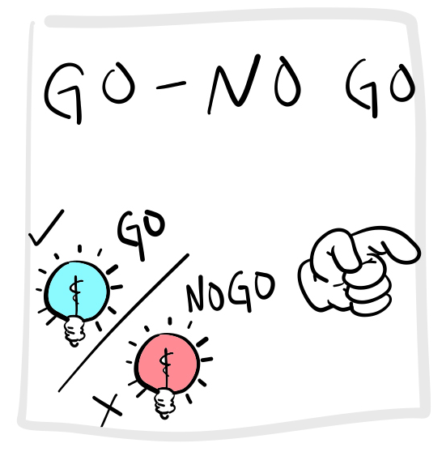
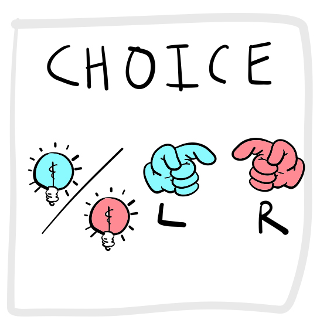
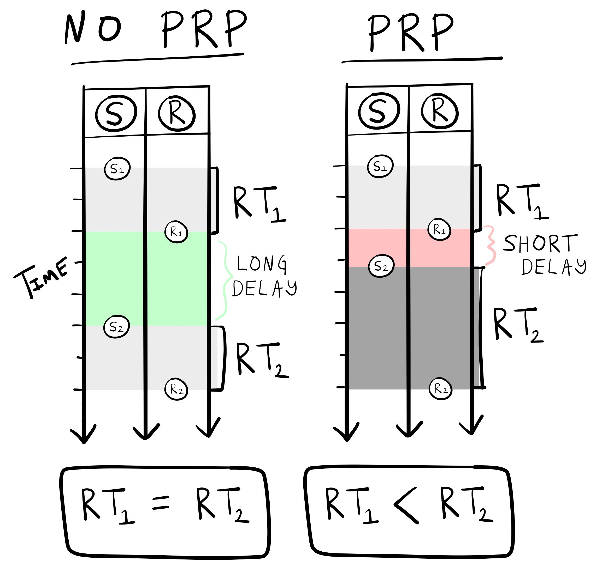
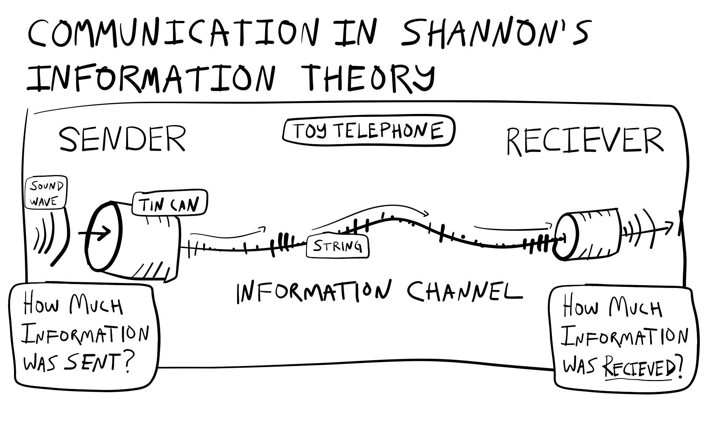
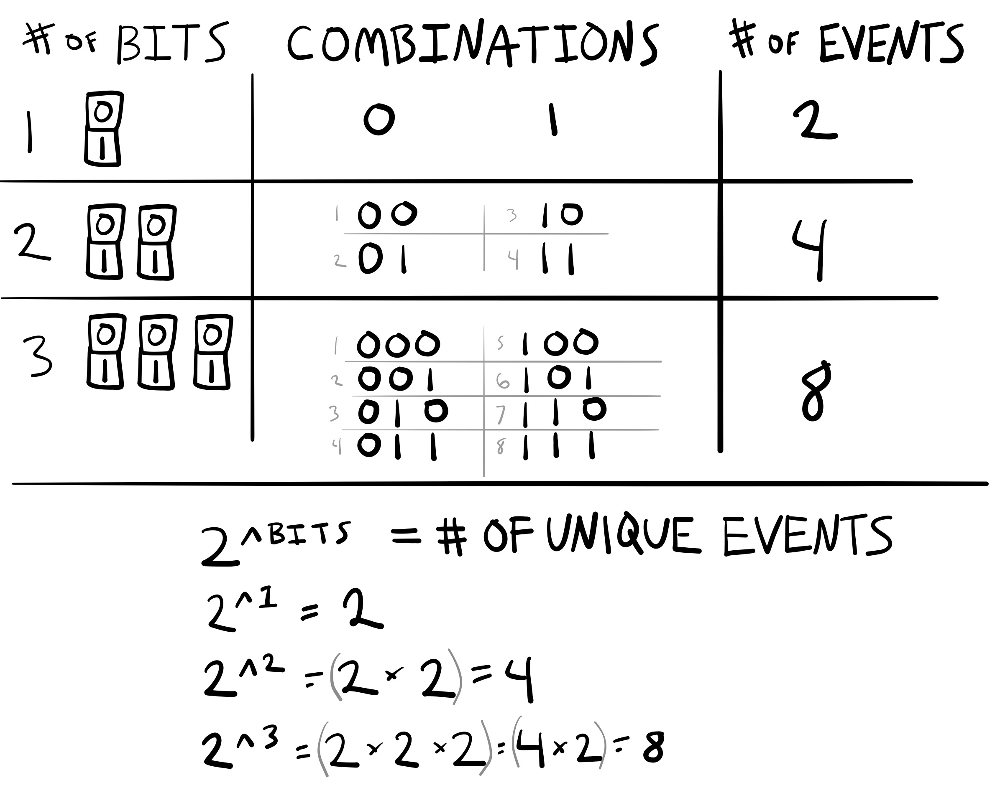
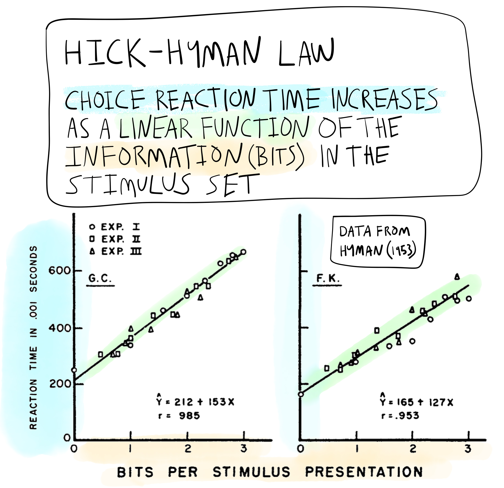

---
output:
  pdf_document: default
  html_document: default
---
```{r, include = FALSE}
source("global_stuff.R")
```

# Information Processing

```{r, cache=FALSE}
word_count <- wordcountaddin::word_count("C7_Information_Processing.Rmd")
wpm <- 200
reading_time <- paste0(round(word_count/wpm, 1), " minutes")
info <- data.frame(word_count,reading_time)
colnames(info) <- c("Word Count","Reading Time")
knitr::kable(info)
```

::: {.floatrightbox25 data-latex=""}


```{r}

```

:::

## [Learning module](https://www.crumplab.com/cognition/articles/modules/L6_Information_processing.html) {-}

See the [learning module page](https://www.crumplab.com/cognition/articles/modules/L6_Information_processing.html) for video lectures, slide-decks and assignments.

## Overview

This chapter overviews **information processing** as a concept in cognition. I mentioned at the beginning of this textbook, that Ulrich Neisser ^[who wrote the first textbook called *Cognitive Psychology* in 1967] defined cognition as "all processes by which the sensory input is transformed, reduced, elaborated, stored, recovered, and used" [@neisserCognitivePsychology1967]. Neisser's definition embraces the information processing tradition in cognition. Sensory input contains "information" about the world, and cognition is characterized as the "processing" of that information. However, just like there were many forms and ideas about behaviorism, there are different forms and ideas about information processing in cognition. We will examine the notions of *processing stages*, *information*, and *capacity limitations*, which became popular research topics around the 1950s and 60s.

Some alliterative themes about cognitive research are also introduced. For example, we begin the chapter with the *four Rs*, referring to the industrial, technological, digital and "cognitive" revolutions. The first three revolutions introduced many new machines that changed the course of human history. Some of these machines also had an influence on explanation of cognition. In particular, over the decades, mechanistic explanations of cognitive phenomena have been closely inspired by the working elements of machines modern for the time. In this chapter, we introduce the "assembly-line", "telephone", and "computer" metaphors of cognition, and examine how the first two technologies shaped the concept of information processing. The computer metaphor will be expanded upon in later chapters.

## Four Revolutions: Industrial, Technological, Digital, and "Cognitive"

"Revolution" is used to describe periods in history where some innovation led to dramatic changes in society. For example, the [industrial revolution](https://en.wikipedia.org/wiki/Industrial_Revolution) in Western Europe and America involved creating large-scale machines, factories and *assembly-lines* to mechanize the means of production; and, is credited with launching the world into an unprecedented period of sustained growth (e.g., population growth, socio-economic growth). The [second industrial revolution](https://en.wikipedia.org/wiki/Second_Industrial_Revolution) (AKA technological revolution), brought the introduction of electricity, *telephones for communication*, planes, trains, and automobiles for transportation, and new systems for infrastructure like sewage and water supply networks. Eras associated with the introduction of technology are also described in terms of ages, like the [machine age](https://en.wikipedia.org/wiki/Machine_Age), [atomic age](https://en.wikipedia.org/wiki/Atomic_Age), [jet age](https://en.wikipedia.org/wiki/Jet_Age), [space age](https://en.wikipedia.org/wiki/Space_Age). A more recent revolution was the [digital revolution](https://en.wikipedia.org/wiki/Digital_Revolution) involving introduction of *computer technology*, which led into the [information age](https://en.wikipedia.org/wiki/Information_Age). According to wikipedia, the next age could be the [imagination age](https://en.wikipedia.org/wiki/Imagination_age) involving immersive virtual reality experiences and an economy primarily driven by "imagination work" ^[hmmm...].

Psychologists have also used "revolutionary" terms to describe historical periods of research in psychology. For example, the "cognitive revolution" generally refers to the period of experimental psychology following "radical behaviorism". The figurative imagery implies that "cognitive psychologists" rebelled and overthrew the "behaviorist orthodoxy". However, the transition between the two schools of thought was very gradual, and several aspects of behaviorism were retained as a part of modern cognition [for additional descriptions of the "cognitive revolution" see, @millerCognitiveRevolutionHistorical2003;@greenwoodUnderstandingCognitiveRevolution1999;@sperryImpactPromiseCognitive1993]. In this sense, "revolution" is not a great metaphor for the emergence of cognitive psychology . For example, cognitive psychologist [George Mandler](https://en.wikipedia.org/wiki/George_Mandler) notes, "The term 'revolution' is probably inappropriate—there were no cataclysmic events, the change occurred slowly in different sub-fields over some 10 to 15 years, there was no identifiable flash-point or leader, and there were no Jacobins" [@mandlerOriginsCognitiveEvolution23].

It is no secret that people use metaphors all of the time. And, in later chapter we will discuss a central role for metaphors as a process in cognition. For example, metaphors can shape how people think of one thing in terms of another. The "cognitive revolution" could lead you to imagine a fight against the ruling behaviorists. In this case, the revolution metaphor is not very fitting or insightful. The metaphor does not illuminate important historical aspects of the behaviorism-cognitive transition. Using the metaphor could exaggerate the importance of some historical elements over others by highlighting attention toward elements that fit the metaphor, and misdirecting examination of elements that do not fit the metaphor. However, in other cases a metaphorical relationship can fit very well, be useful for explanation, and even generate insights. 

As I will describe briefly in the next section, metaphors are very commonly used to describe how cognition works. We will use technological revolutions as metaphors to describe concepts of "information processing" in cognition. The introduction of "information processing" concepts occurred during the transition from behaviorism to cognitivism, and involved mechanistic metaphors from the industrial revolution (the factory and assembly line), and the technological revolution (the telephone).

### Assembly-line metaphor of cognition

::: {.floatright50 data-latex=""} 

**A crayon assembly line**

```{r}
if (knitr::is_html_output(excludes="epub")){
  cat('<iframe src="https://www.youtube.com/embed/ZQ_MEFVx5jM" title="YouTube video player" frameborder="0" allow="accelerometer; autoplay; clipboard-write; encrypted-media; gyroscope; picture-in-picture" allowfullscreen></iframe>"')
}
```

:::


A major innovation of the industrial revolution was the introduction of machines and factories to automate production. These are physical devices that process and transform raw materials into other refined states, that are further transformed and or assembled into goods or final products. For example, a factory assembly-line for making crayons involves successive processing stages, such as: heating wax in vat, coloring and stirring the liquid, filtering, pouring and drying and forming the wax into malleable rolls, extruding the rolls of colored wax through perforated metal plates (with holes the size of crayons), drying the newly formed crayons, and placing them in machines to wrap and package them. The assembly-line metaphor is also used in cognition, and refers to the idea that there are separate stages of processing that transform the "raw materials" of sensation into the "final products" of cognition and action. We examine this metaphor in the section on Donders and his use of mental chronometry to measure assumed stages of processing.

### Telephone metaphor of cognition

A major innovation of the technological revolution was the introduction of [communication technology](https://en.wikipedia.org/wiki/Telecommunication) like the [telegraph](https://en.wikipedia.org/wiki/Electrical_telegraph) and [telephone](https://en.wikipedia.org/wiki/Telephone). This technology allowed people to communicate in real-time over long distances, from one device connected by wire to another device. There was a great demand for telephone technology, and the demand was met by creating a massive network of wires to connect phones to each other. Before automation, the telephone network was managed by human operators who worked at central nodes in the network. A caller who picked up a phone to place a call would be immediately connected to a human telephone operator, and would ask to be connected to another phone. The operator received the instructions and the made the physical connection in the network to connect the incoming call to the destination phone. Around the time of world war II, several psychologists began using elements of the telephone system as a metaphor for cognitive processing. After Donders' processing stages, we examine the concept of "information" processing which was borrowed largely from telecommunication theory and technology.

### Computer metaphor of cognition

A major innovation of the digital revolution was the introduction of computing technology. The rise of the computer sciences also occurred in tandem with the growth of modern cognitive psychology. For example, the "[cognitive sciences](https://en.wikipedia.org/wiki/Cognitive_science)" are considered an interdisciplinary discipline with major contributions from and cross-fertilization of ideas between cognitive psychology, computer science, philosophy, linguistics, neuroscience and anthropology. Like other transformational technology, computers have been used as prominent metaphors for cognition. Sometimes cognitive theories are very literal with the metaphor, and cognition is broken down into parts resembling actual physical components of a digital computer. In other cases, cognition is described in terms of more abstract computational processes and algorithms rather than concrete components. Although computers are highly relevant to the "information processing" theme of this chapter, further elaboration on the computational metaphor of cognition will be reserved for upcoming chapters.

<!--

This could go in the modeling chapter?

The behaviorists we just finished reading about successfully squeezed in the study of behavior as a topic of inquiry in its own right. They did this by criticizing mentalism on one side for being unscientific (lacking objectivity and too metaphysical); but, they also had to contend with physiologists on the other side. Physiology was not lacking objectivity: there were liquids, organic tissues, and electrical impulses that could be readily observed. The behaviorists sought to legitimize the objective study of behavior at a macroscopic level, while conceding that physiological processes were obviously causing the behavior at a microscopic level. In distinguishing between behavioral and physiological levels of analysis, behaviorism also made a case against needing to justify itself in terms of lower-level mechanisms. For example, Skinner's system had no mechanisms for any of the behaviors in the system. There were no physical counterparts to reflex strength, or to a reflex reserve. These were not mechanisms, they were just terms he used in his descriptive system. Skinner chose terms that loosely referred to physical entities, but did not extend the metaphors any further. Notably, Skinner argued that the goal was not to explain the mechanisms of behavior, but instead to control and manipulate behavior, and his system was capable of doing that without referring to mechanisms.

-->


## The mechanization of cognition

Our first metaphorical theme is between cognition and machines in the industrial revolution. We have already seen examples of the metaphor. For example, Descartes likened human and animal physiology to a complicated plumbing machine, like the one he saw in the royal gardens. However, Descartes was a dualist who argued that the biological machine of the human body was merely a receptacle for psychic forces. Nevertheless, he inspired physiological psychology and modern neuroscience, which have the aims of explaining cognitive processes in terms of their physical/bio-chemical substrates. 

Machines offer a reductive perspective on explanation, where the goal is to explain how the parts of a machine work together to produce the behavior of the machine. Man-made machines are physical contraptions whose actions obey the known physical laws of the universe, and whose various states are determined by how the machine is assembled and connected together. Presumably, the person(s) who put a machine together in some sense understood the machine well enough to put it together and make it work. At the same time, I don't know every detail of how much of the technology I use in daily life works. However, I assume that someone can explain how my phone works. Similarly, if humans encountered an alien technology, and no human knew how it worked, then I would guess that many people would attempt to "[reverse-engineer](https://en.wikipedia.org/wiki/Reverse_engineering)" the machine to figure out how it works. Reverse-engineering involves de-constructing an existing machine into its constituent parts to figure out how the machine works. For that matter, humans and animals are space creatures living on the planet earth, and research in psychology and neuroscience is attempting to "reverse-engineer" how our biological machines work.

Machines set a compelling standard for explanation, especially if the standard is to demonstrate explanation by successfully manufacturing a working machine. For example, if the inner workings of the machine of cognition can be "explained" to this standard, then along with other technology, cognition could be manufactured and innovated upon. By analogy, this could include ways to repair, restore, and preserve cognition, as well as create new ways for cognition to work and function. As with the prospects of behavioral engineering, cognitive technologies also raise a host of ethical questions. 

At the same time, psychology does not always have the goal of achieving a machine-based explanation. For example, some of the behaviorists in the previous chapter deliberately side-stepped mechanistic explanations as a goal. For example, Skinner acknowledged that behavior was ultimately rooted in physical mechanisms, but he argued that behavior itself could also be studied at a macroscopic level, without referring to it's microscopic mechanisms. He sometimes used terms that loosely referred to mechanisms. For example, a "reflexes" had "strength", and were emitted after some "impulse" reached a "threshold". All of these terms could refer to various physical mechanisms; however, Skinner was careful to say that none of them were intended to refer to any real mechanism. They were simply abstract and arbitrary terms in his system that he could have chosen different names for. As a result, many components of Skinner's theory were not intended to be explained at a lower-level. 

For example, you might ask, how does an impulse surpass a threshold and trigger a reflex, what is the mechanism? In Skinner's system this question could be viewed as incoherent by definition. He defined those terms not to have any reference to physical mechanisms. Of course, it is possible to wonder about what physiological mechanisms do give rise to the behaviors in Skinner's descriptive system, but the investigation of such mechanisms was not in the same domain as behaviorism.

In my view, behaviorists had an awkward relationship with mechanistic explanations. They were critical of domains that lacked mechanisms, such as mentalistic and introspectionist psychology; but, also carefully avoided having to describe mechanisms for their domain of psychology. Instead, they were content with terms that had metaphorical connotations of mechanisms, as long as the terms were operationally defined and useful for a descriptive system of behavior.

As we step past the behaviorist era in to the cognitive one, we will see a shift in explanatory style from purely descriptive systems to a greater emphasis on mechanistic lines of questioning and mechanistic accounts of cognitive processes. This shift sometimes involves actual physical mechanisms in the brain, body, and environments; but, the shift also involves usage of metaphorical mechanisms. Metaphorical mechanisms may sound like an oxymoron, but they are very common in science. The general strategy is first to find a simple model system that is "like" a more complicated system under investigation; and then use the simple model as a "metaphor" to describe or generate insights about the more complicated system. In the next section we look at the concept of mental processing stages and the assembly-line metaphor from the industrial revolution.

## Donders' Processing Stages

Up to this chapter we have traced a line through psychology from Galton in 1865 to the period of behaviorism. There are several other starting points we could have chosen. For example, in the same year, 1865, Dutch Physiologist F. C. Donders presented behavioral experiments on human reaction times to support the beginnings of a mechanistic theory of cognitive operations [@kosterPreface1969]. I will characterize Donders work as using an assembly line metaphor of cognition. In an assembly line, raw material is sent from one stage of processing to another, and a product is formed at the end of the whole process. In cognition, sensory input is the raw material that is transformed in successive stages of processing. In an assembly-line, each stage of processing does a particular job, and takes an amount of time. Similarly, in cognition, Donders assumed that there were individual stages of processing (for different jobs of cognition), and that each job took some amount of time. He developed a method for identifying different stages of cognitive processing and estimating how long each of them took to complete. His was work was translated into English with the title, "On the speed of mental processes" [@dondersSpeedMentalProcesses1868].

### Donders mental chronometry and processing stages

Donders was a physiologist and impressed with emerging work on the speed of nerve conduction. Earlier physiologists (Johannes Muller) said the velocity of nerve conduction could be infinitely fast, or unknowable. But, in 1849, [Hermann von Helmholtz](https://en.wikipedia.org/wiki/Hermann_von_Helmholtz), succeeded in measuring nerve transmission speeds in a frog in the range of 24-36 meters per second.

The empirical observation that nerve conduction was not infinitely fast was very important for Donders. As a physiologist he assumed that thinking processes of the mind were controlled by organs in the brain. If the exchange of signals in the nervous occurred infinitely fast, he assumed that processes of thought might also occur infinitely fast. However, the discovery that nerves had physical properties limiting how fast they conducted signals suggested to Donders thoughts might have some measurable speed, so he set out record the speed thought. 

### Physiological reaction time 

First, Donders pointed to the concept of physiological reaction time, which came first from astronomy [@canalesExitFrogEnter2001]. Astronomers made observations about locations of heavenly bodies in the sky, and entered positional coordinates and times of observations about those bodies into their record books. Different observatories around the world would share records. Theories of planetary motion could be tested by comparing the predictions about where planets should be at different times to the recorded data about where planets were observed to be at different times. There were discrepancies between theory and data. Astronomer Adolphe Hirsch wondered how much of the discrepancies were due to human error. Some of the human observers might have slightly faster perceptions than other human observers, and this could introduce error into the entries they made into the astronomical records. Hirsch set out to measure each observers "physiological" reaction time.

Imagine you were an astronomer about to look at a star through a telescope. As soon as the light from the star hits your eyeball, how long will it take for you to react to the light? Donders called this "physiological time" in reference to the time it would take for the light stimulus to be transduced through the eye into nervous activity that would eventually lead to a muscle response. Hirsch had already developed methods to precisely measure an individual's "physiological reaction time", and used those measures to correct the astronomical records from human error. Donders had a different usage for the method. He wrote:

> "The idea occurred to me to interpose into the process of the physiological time some new components of mental action. If I investigated how much this would lengthen the physiological time, this would, I judged reveal the time required for the interposed term."

### Donders mental reaction times

Donders conducted many human reaction time experiments using tactile, visual and auditory stimuli. All of the experiments used a similar method. A subject was presented with a stimulus, and they responded to the stimulus as quickly and accurately as possible. Donders measured reaction times, which was defined as the amount of time between the onset of the stimulus and a subsequent response. Note, reaction times continue to be used in cognitive psychology, and their definition remains the same.

A basic question was whether different sense organs had different physiological reaction times. But, Donders was more interested in the additional "mental" time it might take to perform increasingly complex tasks before making a response to the stimuli. The tasks that Donders used to increase complexity are still widely used. In the remaining description of Donders work, I will use the modern terms for the tasks, and present a generic summary of Donders findings and conclusions. 

::: {.floatright25 data-latex=""} 
```{r}
knitr::include_graphics("imgs/Donders_simple.png")
```
:::

The most basic reaction time task is called a *simple reaction time task*. In this task, subjects are presented with a stimulus, and asked to respond to as quickly as possible, as soon as they detect it. Donders would consider the reaction times from this task as "physiological reaction times".

::: {.floatright25 data-latex=""} 
```{r}

```
:::

Donders invented the idea of having subjects perform a slightly more complicated task that is now referred to as the *GO-NO GO* task. In this task, subjects are presented with a stimulus, but they only make a response if the stimulus is the target stimulus. For example, one might see a blue or red stimulus, and the response would be required only if the stimulus was blue (a GO response). No response would be required if the stimulus was red (a NO GO trial).

::: {.floatright25 data-latex=""} 
```{r}

```
:::

An even more complicated version of the task is referred to as an *alternative forced-choice task*. For example, a subject could be asked to respond to a blue stimulus by pressing a left button, and to respond to a red stimulus by pressing a right button. This would be called a 2-AFC (two-alternative forced choice) task, or a choice reaction time task.

### Donders subtractive stage logic

Donders used subtraction of reaction times between tasks to estimate the speed of mental operations. He assumed that mental operations occurred in successive stages like an assembly line, and that each stage took an average amount time. 

```{r, eval=knitr::is_html_output(), echo=FALSE,out.extra="class = 'centerfigureshadow'", fig.align="center"}
knitr::include_graphics("imgs/Donders_Assembly.png")
```

```{r, eval=knitr::is_latex_output(), echo=FALSE, fig.align="center"}
knitr::include_graphics("imgs/Donders_Assembly.png")
```


The fastest reaction time should be the physiological time given by the simple reaction time task. This one involved a minimum of mental processing. Reaction times should increase in length if mental processing had to occur before a response was made. 

```{r, eval=knitr::is_html_output(), echo=FALSE,out.extra="class = 'centerfigureshadow'", fig.align="center"}
knitr::include_graphics("imgs/Donders_task_stages.jpg")
```

```{r, eval=knitr::is_latex_output(), echo=FALSE, fig.align="center"}
knitr::include_graphics("imgs/Donders_task_stages.jpg")
```


For example, the GO-NO GO task should produce a longer reaction time than the simple reaction time task. This is because the task requires an additional mental operation of stimulus identification. In the GO-NO GO task, the stimulus must be identified as the target stimulus before a response is made. 

```{r, eval=knitr::is_html_output(), echo=FALSE,out.extra="class = 'centerfigureshadow'", fig.align="center"}
knitr::include_graphics("imgs/Donders_id_time.jpg")
```

```{r, eval=knitr::is_latex_output(), echo=FALSE, fig.align="center"}
knitr::include_graphics("imgs/Donders_id_time.jpg")
```


If it took 170 milliseconds to make a response in the GO - NO GO task, and 150 milliseconds to make a response in the simple reaction time task, Donders took the difference of 20 milliseconds (by subtraction 170-150 = 20) to indicate the time taken by the mental operation. In this example, Donders might say the mental process of identification takes 20 milliseconds. 


The subtraction logic could be applied to infer the times associated with subsequent stages of processing. For example, reaction times in a two alternative forced choice task (2AFC) are longer than in a GO-NO GO task. Following Donders logic, a 2AFC task involves yet another mental operation, *response selection*. For example, in this task the stimulus must be identified before a response is made, and then the correct response (e.g., right or left) must be selected before the final response is made. The stage of stimulus identification is assumed to occur before the subsequent stage of response selection.

```{r, eval=knitr::is_html_output(), echo=FALSE,out.extra="class = 'centerfigureshadow'", fig.align="center"}
knitr::include_graphics("imgs/Donders_RT_time.png")
```

```{r, eval=knitr::is_latex_output(), echo=FALSE, fig.align="center"}
knitr::include_graphics("imgs/Donders_RT_time.png")
```


But, by subtracting the reaction time in the 2AFC task, from the reaction time in the GO-NO GO task, Donders argued that the amount of time for response selection could be separated from the amount of time for stimulus identification.

## Beyond Donders

It has been $2021 - 1865 = 156$ years since Donders proposed subtraction logic to measure stages of mental processing time. What happened to his subtraction logic, research on human reaction times, and the concept of processing stages?

### Subtractive logic

Donders subtractive logic is a nifty idea, but it doesn't necessarily produce correct inferences about cognitive operations. One issue is the distinction between *serial and parallel* processing. If the intervening mental operations between a stimulus and response really do work like a simple *serial* assembly-line, then the subtractive logic can work quite well. In this case, the mental operations occur one after another in series. In this case the total reaction time associated with a task involving two or more mental operations (that occur in serial stages), can be inferred by subtracting reaction times from tasks involving one fewer mental operation. However, the serial assembly line is just a metaphor. A major problem occurs for subtractive logic when operations can be completed in parallel (e.g., at the same time). In this case, different stages of processing might be occurring at the same time, and measurements of additional time spent on a mental task would not necessarily reflect separate stages of processing. Another problem occurs if the stages are unpredictable, and therefore it does not make sense to subtract times that are not constants. 

To address some of the inferential problems with subtractive for making inferences about putative processing stages, Saul Sternberg introduced another method called *additive-factors logic* [@sternbergDiscoveryProcessingStages1969a]. Finally, subtractive logic became commonly used in neuro-imaging research to find areas of brain activity uniquely correlated with specific task demands [@alexanderDondersDeadCortical2015]. 

### Reaction time research

The measurement of reaction times to make inferences about cognitive processes became widespread, and remains a very common measurement tool in cognition. For example, we already discussed Cattell's associative reaction time research from 1886, which was clearly inspired by Donders. In 1890, Jastrow reviewed the promising uses of reaction time methods in psychology in a book called, *Time relations of mental phenomena* [@jastrowTimerelationsMentalPhenomena1890]. Reaction times would be used throughout every decade to study cognitive processes in humans, even throughout the behaviorist period. We will continue to discuss reaction time research throughout this chapter and others.

### Processing Stages

Donders' concept of mental processing stages disappeared for a while during the behaviorist era. Although some behaviorists (like Tolman and Hull) were willing to speculate about intervening processes between a stimulus and response, other forms of behaviorism were not interested in whatever mental operations might be taking place. As a result, the possibility that there was a mental processing stage for stimulus-identification, response-selection, or other mental operations, was not of scientific interest.

The concept of processing stages came back in different ways, and we will see more examples in the chapters on memory, attention, and computational modeling. As a historical side-note, Donders' ideas become popular again in cognition roughly 100 years after his publication. His centenary was celebrated at the second [Attention and Performance](http://www.attentionandperformance.org) conference in 1968, held in the Netherlands. This invited-speaker conference series still runs today, and publishes books containing the papers presented at the conference. Many of the articles from the early conference years established a role for the concept of processing stages in cognition. One example to mention briefly is the [psychological refractory period](https://en.wikipedia.org/wiki/Psychological_refractory_period).

#### PRP: Psychological Refractory Period

British psychologist A. T. Welford drew attention to the *Psychological Refractory Period* in a 1952 paper [@welfordPsychologicalRefractoryPeriod1952, see also @welfordEvidenceSinglechannelDecision1959]. In the preceding war years a great deal of basic research on human reaction times was conducted for the war effort. For example, the ability to make a quick reaction could be important for a pilot. As a result, empirical studies were conducted to identify useful information about human reaction times. Useful information could include how to make reactions more efficient, or to discover limitations in reaction times that could be addressed. For example, if people are pressing buttons or flicking switches in a cockpit, how should the cockpit be designed to improve the speed and accuracy of the responses?


Welford observed the psychological refractory period from existing reaction time research, and discussed possible explanations of the finding in terms of processing stages. The basic PRP effect was that responding to one stimulus can sometimes delay a response to second stimulus, especially if they are presented quickly, one after the other. 

::: {.floatright50 data-latex=""} 

```{r}

```

:::

The conditions to observe the PRP effect are depicted on the right. In the task, participants are presented with stimuli (S) one after the other, and they asked to response (R) as fast as possible to each of them (e.g., by pressing a button). The long-delay  condition highlights an important difference between two successive stimuli. In this case, the second stimulus ($S_2$) appears after a long temporal delay following the response ($R_1$) to the first stimulus $S_1$. When this delay is long enough, the average reaction time to the first and second stimulus are generally the same ($RT_1 = RT_2$). However, when the delay is shortened, the PRP effect is observed. What happens in performance is that the average reaction time to the second stimulus is longer than the average reaction time to the first stimulus ($RT_1 < RT_2$). This lengthening of the second response time is an example of the so-called "psychological refractory period".

The PRP effect is a reliable finding in reaction time research, and since Welford hundreds of papers have been published on the phenomena. Note, as we move forward, we will discuss many findings like the PRP effect that have inspired large numbers of research papers. The term *paradigm* is commonly used to refer to collections of research activity that are relatively focused on specific phenomena or tasks. For example, we could refer to the maze-running research discussed last chapter as a paradigm using the task of maze-running. The PRP paradigm is full of papers testing explanations of the PRP phenomena. My purpose in bringing up the PRP literature is not for us to become experts in this one phenomena; instead, the PRP effect provides a clear example of the metaphorical use of processing stages to provide a quasi-mechanical explanation of the phenomena.

So, why does the PRP effect occur? Why is the second response time lengthened if the second stimulus is presented shortly after a previous response? In 1959, Welford described five different theoretical accounts. One possibility was a physical explanation in terms of limitations of signalling among nerve fibers. Another theory had to do with preparedness or expectancy, maybe the shorter duration caused people to be more surprised, and it was the surprise that lengthened the second response. The fifth hypothesis involved a *central mechanism with a single-channel of limited capacity*, and was summarized as follows [@welfordEvidenceSinglechannelDecision1959]:

> "In its bare essentials this theory assumes, firstly, a number of sensory input mechanisms each capable of receiving data and storing it for a limited period so that, for example, a short series of signals can be received as a unit. Secondly, it assumes a number of effector mechanisms containing both central and peripheral elements and capable of carrying out a series of actions such as the pressing and release of a key or a series of taps (Vince, 1949) as a single unit. Thirdly, between these two it postulates a single-channel decision mechanism. This is regarded as being of limited capacity in the sense that it takes a finite time to process information and can thus only deal with a limited amount of information in a given time."

The mechanism being proposed was like the processing stages of a serial assembly-line. A stimulus is first processed in the perceptual stage, and then moved to the next central processing stage. The central processing stage produces the decision to make a response to the stimulus. This decision is sent to a response production stage, and the response is made. Furthermore, the central processing stage was claimed to be "capacity limited". For example, what if it could only deal with one decision at a time? This would create a *bottleneck* in performance. If a second stimulus entered the central stage it would have to *wait in line* until the decision to respond to the first stimulus was sent to the next stage.

Welford and others (Craik [@craikTheoryHumanOperator1948], Hick [@hickDiscontinuousFunctioningHuman1948], Davis [@davisHumanOperatorSingle1957], Fraisse [@fraissePeriodeRefractairePsychologique1957], and Broadbent [@broadbentMechanicalModelHuman1957,@broadbentPerceptionCommunication1958]) were part of a new wave of researchers applying recent concepts from telecommunications science and technology to human cognition. For example, the concept of a single-channel decision mechanism that processed information in a capacity limited manner was inspired by telephone technology. The remaining half of this chapter elaborates on the metaphor how it informed the concept of information processing in cognition.


<!-- general issues with the metaphor 

- appeals to mechanism
- assembly lines do things in order, and each stage takes time...the subtractive logic does apply to orderly assembly lines
- what if cognition is not so orderly?
- Does the interpretation of what a task might logically involve force a conclusion that about stages of processing? Do stages of processing actually exist, or are they convenient metaphors? 

-->

## Cybernetics and the Macy Conferences

If you noticed, we've been jumping around a little bit in historical time. Last chapter we ended with Skinner circa 1938, and this chapter we went back to the time of Donders (circa 1868), and forward in time to the Attention and Performance conference of 1968. That leaves roughly a 30 year gap between 1938 and 1968 that we didn't talk much about. This was a dense historical period that greatly informed the formation of the cognitive sciences. Among other things,  there was another world war, the invention of nuclear weapons, the invention of digital computers, and the gradual transition in American psychology from behaviorism to cognitivism. This time period was also home to the Macy Conferences and Cybernetics, which provide a useful perspective on the transitional period.

[The Macy conferences](https://en.wikipedia.org/wiki/Macy_conferences) were held (160 over 19 years) in New York between 1941 and 1960. These conferences were sponsored by the [Josiah Macy J. Foundation](https://en.wikipedia.org/wiki/Josiah_Macy_Jr._Foundation) and involved attendees from a wide variety of academic backgrounds to encourage interdisciplinary interactions and exchange of ideas. For example, many attendees were academics from the disparate fields of psychology, philosophy, anthropology, physiology, linguistics, genetics, and math and computer science (and others). And, rather than discussing specialty topics of little relevance to other fields, they were interested in discussing potential overlaps and bigger issues require sharing and integration of methods between fields. 
Many of these exchanges revolved around a movement called [cybernetics](https://en.wikipedia.org/wiki/Cybernetics). Cybernetics still exists as a field, but is also recognized as the beginning of what is now called the cognitive sciences. Cybernetics also played a transitional role in American psychology by bridging elements of behaviorism with later cognitivism.

[Norbert Weiner](https://en.wikipedia.org/wiki/Norbert_Wiener) is the father of cybernetics, a trans-disciplinary approach concerned with "control and communication in the animal and the machine" [@wienerCyberneticsControlCommunication1948]. Mathematician [A. K. Kolmogorov](https://en.wikipedia.org/wiki/Andrey_Kolmogorov),  cybernetics was "concerned with the study of systems of any nature which are capable of receiving, storing and processing information so as to use it for control." [see also many more definitions of cybernetics in @umplebyDefinitionsCybernetics2008]. 

In Kolmogorov's sense, Skinner's behaviorism was an example of cybernetics with some important missing elements-- he was studying principles of behavioral control in an animal system, but he was not too concerned about internal processes that might be responsible for receiving, storing, and processing information. Cybernetics had a much broader vision of control, which was to understand the principles of any type system that appeared to regulate itself, including humans, animals, and even machines. The hope was that the principles would be somewhat generalizable across systems and allow insights from area to foster innovations in another. For example, if principles of cognitive processing in humans could be better understood, then perhaps machines could be made to operate by those principles, which could lead to artificial forms of intelligence. Thus, sharing findings and methods between domains was encouraged because of the potential for new and unexpected insights. 

In other words, cybernetics was OK with psychologists exploring mechanistic metaphors for cognitive processing. For example, from a cybernetics perspective, a psychologist might benefit from learning something about telecommunications technology because those methods could provide a model system for understanding something about how people communicate. Whatever insights were extracted could in turn be useful for understanding communication in other systems, like animals, machines, or other networks using a communication concept. Indeed, major advancements in telecommunication technology were being discussed at the Macy conferences, and the attending psychologists were very quick to to apply those advancements to an emerging cognitive psychology. One of the major advancements was Claude Shannon's "Information Theory", which is described first, followed by two ways that it was applied as a metaphor for cognition.

## Shannon's Information Theory

There were numerous attendees at the cybernetics conferences whose contributions to the cybernetics movement were also foundational for the cognitive sciences. Most relevant for our current purposes was the American mathematician [Claude Shannon](https://en.wikipedia.org/wiki/Claude_Shannon) (1916 – 2001). His 1937, master's degree (MIT) was titled "A Symbolic Analysis of Relay and Switching Circuits" [@shannonSymbolicAnalysisRelay1938]. This was a theoretical paper about the math and logic behind the telephone exchange networks of the day. The exchanges had been automated so that they no longer required a human operator to connect one phone to another, and Shannon's analysis suggested more efficient designs for switches making the connections. The very same math would later be fundamental for the design of circuits in digital computers. In 1940 Shannon completed his Ph.D. titled, "An Algebra for Theoretical Genetics" [@shannonAlgebraTheoreticalGenetics1940] based on his work at the Eugenic Record Office at Cold Springs Harbor Laboratory. During world war II, he worked at Bell lab's on "A mathematical theory of cryptography", which involved methods to send and receive messages on communication lines that might have many other listeners besides the intended recipient. Then, in 1948-49 he published what is now called "Information theory" in his book "The Mathematical theory of communication" [@shannonMathematicalTheoryCommunication1949].

Information Theory was not developed as a theory for cognition or psychology. It offers a way to mathematically describe general elements of communication systems, and found useful applications in many domains including psychology. We will focus on two ideas from information theory that became popular in early cognitive research. These are the concept of an information channel, and the idea that information can be measured and quantified using Shannon's formula for entropy ($H$).

### Information channels

An information channel has three major parts-- a sender, a channel, and a receiver--and two big questions, how much information was sent? And, how much was received?

```{r, eval=knitr::is_html_output(), echo=FALSE,out.extra="class = 'centerfigureshadow'", fig.align="center"}

```

```{r, eval=knitr::is_latex_output(), echo=FALSE, fig.align="center"}

```


A toy telephone system made out of tin cans and string is a great example of a simple information channel. In this system, one person speaks into a tin-can on one end. There is a hole in the bottom of the can, and a knot is securely blocking the hole so that the remaining length of string can be unrolled for a distance and connected to another tin can. The person on the other end is holding the second can up to their ears, and listening to the message from the sender. If you have never made this toy, it's just that simple, and it works. 

The speaker's vocal chords push air through their mouth creating air-waves in the range of audible frequencies. The waves project into the can and through a process of physical resonance the wave pattern in the air is transferred to the can, which begins to wave with similar frequencies. The can is connected to the string which starts waving in the same way, carrying the wave across the string to the other can. Now the other can starts to wave too, which shapes the air in the can and causes new-air waves to be emitted. These air-waves travel through the air into the ear canal of the person listening on the other end. The outer, middle, and inner then begin vibrating as well and transduce the mechanical waves into nerve impulses, and eventually the receiver listens to the message, and maybe says something back, repeating the process. 

Acts of cognition are important bookends to this story. From the beginning  we can ask how it is that someone can speak a message at all (or pick up a can, or make a toy telephone), and at the end we can ask how someone hears and understands a message, and decides to respond to it or not. However, for our immediate purposes we will not focus on those psychological aspects, but instead return to some of the questions about the information channel, which is the medium through which the message passes.

An information channel is a general concept with an important property called capacity. An information channel could be a tin-can telephone with a real string connecting two devices, or it could be a wireless cell-phone connected through more advanced technology involving very high frequency waves. Both kinds of phones have a limited ability to send signals, this is called the channel capacity. For example, you can hook up one can to another and hear someone speak on the other end. In loose terms, we could say a string has the capacity to support one message. However, if you hook up more cans to the same string, and allow many people to take at once, the quality of the signal at the receiving end will become increasingly worse. In this sense, the string has a limited amount of capacity to transmit a signal.

Questions about information capacity were fundamental for improving telecommunications technology. For example, what was the information capacity of a physical telephone line, how many calls could it support? What happens when the capacity is exceeded? How could the systems be improved to increase the capacity and support more calls? Could the lines support other kinds of signals? How much? What other kinds of signals?

So far I have used the word information to describe the signal transmitted from a sender to a receiver. The channel that transmits the signal is called the information channel, and we now have the idea that the channel could be limited in capacity. So, an information channel can only transmit a limited amount of information. A really basic next question is...how much?

### Measuring Information: H

One of Shannon's mathematical contributions was to propose a definition for quantifying the amount of information. His formula defines information in terms of entropy, or the amount of uncertainty in a system of messages, and is called Shannon's H:

$H(X) = -1*\sum_\text{i=1}^n P(x_i) * log_2 P(x_i)$

I will explain what this formula means in a moment. For Shannon's communication theory, it had several useful properties. A formula for quantifying information meant that capacity limitations of information channels could be measured and assigned a value indicating how much information they could carry. Additionally, the content of signals could be analyzed and described in terms of how much information was contained in the signal. Finally, when signals are sent across an information channel and received at the other end, sometimes parts of the signal are lost during transmission. The amount of information lost could now be described and accounted for with Shannons's H.

Shannon's formula defines information in terms of the predictability of a sequence of messages. This is subtly different from the amount of things in a message. For example, if you are asking yourself what does "information" mean in everyday usage, you might think about books, websites, or videos that are sources of information. If we are using the number of things to measure the amount of information, then we might say that long books have more information than short books because long books have more words, and thus convey more information in that sense. Shannon emphasizes a different aspect of information in his definition. For example, imagine a really long book with 1,000 pages, but the only word printed in it is the letter "A" as many times as possible on every page. Shannon's formula would say this book transmits zero information because the message is 100% predictable. If you imagine the book as "sending out a message", and then ask how much **new** information is obtained from reading the book, the answer could be zero. For example, I imagine a book-reviewer saying they didn't bother reading it because they already knew it was full of *A*s. In Shannon's theory, communication of information does not occur if the receiver already knows the content of the message.

By contrast, according to Shannon's definition, the amount of information in a message increases as it becomes more unpredictable. For example, a short book could contain many sentences with words in new combinations that you had never encountered before. When you read the book, you find almost every new statement to be unexpected and surprising. According to Shannon, this kind of book contains much more information than the book of As, which has a long message that is entirely expected. 

Shannon's definition also takes the definition of information to an oddly extreme place. By definition more random messages have more information,and the ultimate message carrying the most possible information is total randomness ^[this is also why H refers to entropy, which is a physics concept for randomness or disorder in a system]. One way to conceptualize this is to think of total randomness as containing all possible messages in a system. For example, consider Borel's (1913) infinite monkey theorem [@borelMecaniqueStatiqueIrreversibilite1913], which says that a room full of monkeys typing letters on a keyboard for infinity will eventually produce any text, even the works of Shakespeare. So, even though most of the books written by the typing monkeys will be totally incoherent, they are producing all of the possible ways to print letters in books, so in that sense that they are writing all of the books that make sense, and all of the ones that don't ^[as in Borges [Library of Babel](https://en.wikipedia.org/wiki/The_Library_of_Babel)], which according to Shannon, is a lot of information. 

I bring up this last example so you do not equate Shannon's definition of information with the meaningfulness of the stimulus. As we dive into the formula next, we will see it is just a single number to describe the amount of randomness in a system. If the system was a coin that could transmit one of two messages--heads or tails--then, Shannon's H is simply a measure of how fair or biased the coin is. A fair coin is completely random, and transmits the maximal amount of information. A biased coin comes up heads or tails more often, is more predictable, and transmits less information.

### Computing H

Let's use the coin flipping example to compute H, or the amount of information according to Shannon's formula. Here is the formula again:

$H(X) = -1*\sum_\text{i=1}^n P(x_i) * log_2 P(x_i)$

The capital X refers to the set of discrete events that can occur in a series of messages. In a coin toss there are two events, heads or tails. The term $P(x_i)$ refers to the probability that each event occurs, and $log_2 P(x_i)$ refers to taking the logarithm base 2 of that same probability. To state what the formula says in a sentence: multiply ($*$) the probability of an event ($P(x_i)$) by it's logarithm base 2 and find the product, do the same for all events (from i= 1 to n, the number of events), add all of the products up ($\sum_\text{i=1}^n$), and then multiply the final sum by -1.

The table below shows the calculation of H for a fair coin. A fair coin has two possible events, heads or tails, and each event has the same .5 probability of occurring.

```{r}
library(dplyr)
library(tibble)

events <- c("Heads","Tails")
i <- 1:2
p <- c(.5,.5)
log2_p <- log2(c(.5,.5))
p_log2_p <- p*log2_p
sum_H <- sum(p_log2_p)
H <- -1*sum_H

df <- tibble(events,
             i,
             p,
             log2_p,
             p_log2_p)

names(df) <- c("Events",
               "$i$",
               "$P(x_i)$",
               "$log_2 P(x_i)$",
               "$P(x_i)*log_2 P(x_i)$"
                )

df <- df %>%
  rbind(c("sum","","","$\\sum_\\text{i=1}^n$",as.character(sum_H))) %>%
  rbind(c("H","","","$-1*\\sum_\\text{i=1}^n$",as.character(H)))

if(knitr::is_html_output()) knitr::kable(df)
if(knitr::is_latex_output()) knitr::kable(df,escape = FALSE)
```

To walk through the table, in the first row we have the calculations for heads. The probability of heads is .5.

$P(x_i) = .5$

The logarithm base 2 of .5 is -1. 

$log_2 P(x_i = .5) = -1$ 

Multiplying the two together gives -.5.

$P(x_i)*log_2 P(x_i) = .5 * -1 = -.5$

In row two, we see the same calculations because the probability of tails is also .5. The last steps of the formula involve summing up the products in the last column.

$\sum=-.5 + -.5 = -1$ 

Finally to convert to a positive number, the sum is multiplied by a -1, (-1 * -1 = 1). So, for a fair coin, $H = 1$.

### Bits of information

Shannon's formula uses a base 2 logarithm which produces a number in the unit of [bits](https://en.wikipedia.org/wiki/Bit). If you are not familiar with bits, they are the building blocks of modern digital computers. One bit represents a single binary operator that can take on one of two possible states. For example, a coin could represent a bit. If we stipulated that a coin could only land heads or tails, then it would function the same as a binary operator with two possible states. Other kinds of binary operators include logic, where a logical statement can be either TRUE or FALSE. It is also possible to express numbers using binary symbols. In this case, numbers are represented with only two symbols 0 or 1.

Bits can be used to measure the total number of discrete events in a system of messages. Let's see how.

A single bit has two states, 0 or 1. So, we could use a single bit to represent two unique states, like heads or tails.

How many states can two bits represent? This would involve counting all of the unique ways of combining the states from two bits, for example, the first and second bit could be 0 (00), the first bit could be zero and the second a one (01), and so on. All of four possibilities are: 00, 01, 10, and 11. The figure below shows the relationship between number of bits, and the number of unique events that can be represented by combining bits together. 

```{r, eval=knitr::is_html_output(), echo=FALSE,out.extra="class = 'centerfigureshadow'", fig.align="center"}

```

```{r, eval=knitr::is_latex_output(), echo=FALSE, fig.align="center"}

```

The relationship between number of bits and number of unique events they can code is defined by raising 2 to the number of $Bits$:

$2^\text{Bits} = \text{number of events}$

The figure shows some examples of computing the number of unique combinations that can be coded with up to three bits. 

### H, Bits, predictability and Information

Let's put all of these concepts together in thinking about a set of messages in Shannon's communication system. Remember, a sender sends a message to a received across an information channel. In this system and important question is how much information is in the message? How much capacity to transmit information does the channel have? And, how much information is received or lost in transmission? Shannon's formula provides a way to calculate answers to these questions; however, in order to do the calculations the message needs to be converted into discrete events so that it can be measured in terms of bits.

Let's consider a simple communication system where a sender can only send one of four events: A, B, C, or D. How many bits are needed to represent these four events? From the figure above we can see that the answer is four bits.

If a sender is communicating only discrete events like As, Bs, Cs, and Ds, then Shannon's formula provides a way to measure the amount of uncertainty in the message. 

The most uncertainty occurs when the message is completely random. By definition, this means that the sender randomly chooses to send As, Bs, Cs, and Ds with equal probability. This is like a four-sided coin flip (if that was possible). Each of the probabilities is .25, or 1/4. In this situation, the receiver has no way of predicting which event will occur as they receive the message. It is maximally uncertain. Watch what happens when we compute H using Shannon's formula, we compute $H = 2$, which is the same as the number of bits needed to represent each of the four events:

```{r}
library(dplyr)
library(tibble)

events <- c("A","B","C","D")
i <- 1:4
p <- c(.25,.25,.25,.25)
log2_p <- log2(c(.25,.25,.25,.25))
p_log2_p <- p*log2_p
sum_H <- sum(p_log2_p)
H <- -1*sum_H

df <- tibble(events,
             i,
             p,
             log2_p,
             p_log2_p)

names(df) <- c("Events",
               "$i$",
               "$P(x_i)$",
               "$log_2 P(x_i)$",
               "$P(x_i)*log_2 P(x_i)$"
                )

df <- df %>%
  rbind(c("sum","","","$\\sum_\\text{i=1}^n$",as.character(sum_H))) %>%
  rbind(c("H","","","$-1*\\sum_\\text{i=1}^n$",as.character(H)))

if(knitr::is_html_output()) knitr::kable(df)
if(knitr::is_latex_output()) knitr::kable(df,escape = FALSE)

```

We have just seen that when a communication involves a maximally unpredictable set of events, Shannon's formula for H returns the number of bits needed to represent each of the unique events in the message. In other words, the number of bits represents an upper bound on the amount of information in a message, in this case it represents maximal uncertainty when the events occur with equal probability.

What if the events do not occur with equal probability? This would mean that some of the events are more likely than others. In Shannon's system, whenever some events are more likely than others something special happens at the receiving end of the message. The receiver is now able to predict some of the message. For example, if the message 70% As, 10% Bs, 10% Cs, and 10% Ds, the receiver would be able to predict that each event has a high probability of being an A, and a low probability of being a B, C, or D. Let's enter this situation into the formula for H and see what happens:

```{r}
library(dplyr)
library(tibble)

events <- c("A","B","C","D")
i <- 1:4
p <- c(.7,.1,.1,.1)
log2_p <- log2(p)
p_log2_p <- p*log2_p
sum_H <- sum(p_log2_p)
H <- -1*sum_H

df <- tibble(events,
             i,
             p,
             log2_p,
             p_log2_p)

names(df) <- c("Events",
               "$i$",
               "$P(x_i)$",
               "$log_2 P(x_i)$",
               "$P(x_i)*log_2 P(x_i)$"
                )

df <- df %>%
  rbind(c("sum","","","$\\sum_\\text{i=1}^n$",as.character(sum_H))) %>%
  rbind(c("H","","","$-1*\\sum_\\text{i=1}^n$",as.character(H)))

if(knitr::is_html_output()) knitr::kable(df)
if(knitr::is_latex_output()) knitr::kable(df,escape = FALSE)

```

In this case, H is computed as 1.35, which means that events in the message require less than 2 bits. There are still four events, but one of them is more predictable then the others. If we made one of the events even more predictable (e.g., like A = .97), then the amount of bits needed would decrease and get closer to zero.


```{r}
library(dplyr)
library(tibble)

events <- c("A","B","C","D")
i <- 1:4
p <- c(.97,.01,.01,.01)
log2_p <- log2(p)
p_log2_p <- p*log2_p
sum_H <- sum(p_log2_p)
H <- -1*sum_H

df <- tibble(events,
             i,
             p,
             log2_p,
             p_log2_p)

names(df) <- c("Events",
               "$i$",
               "$P(x_i)$",
               "$log_2 P(x_i)$",
               "$P(x_i)*log_2 P(x_i)$"
                )

df <- df %>%
  rbind(c("sum","","","$\\sum_\\text{i=1}^n$",as.character(sum_H))) %>%
  rbind(c("H","","","$-1*\\sum_\\text{i=1}^n$",as.character(H)))

if(knitr::is_html_output()) knitr::kable(df)
if(knitr::is_latex_output()) knitr::kable(df,escape = FALSE)

```

If one of the event occurs 100% of the time, and the others occur 0% of the time, then H=0. What happens in the formula is that $log2(1) = 0$, and $log2(0)= -infinity$. By convention, the negative infinities are turned into 0s, which results in a sum of 0s, such that $H=0$.

```{r}
library(dplyr)
library(tibble)

events <- c("A","B","C","D")
i <- 1:4
p <- c(1,0,0,0)
log2_p <- log2(p)
p_log2_p <- c(0,0,0,0)
sum_H <- sum(p_log2_p)
H <- -1*sum_H

df <- tibble(events,
             i,
             p,
             log2_p,
             p_log2_p)

names(df) <- c("Events",
               "$i$",
               "$P(x_i)$",
               "$log_2 P(x_i)$",
               "$P(x_i)*log_2 P(x_i)$"
                )

df <- df %>%
  rbind(c("sum","","","$\\sum_\\text{i=1}^n$",as.character(sum_H))) %>%
  rbind(c("H","","","$-1*\\sum_\\text{i=1}^n$",as.character(H)))

if(knitr::is_html_output()) knitr::kable(df)
if(knitr::is_latex_output()) knitr::kable(df,escape = FALSE)

```


### Summary

In the next sections we will see examples of how Shannon's information theory was applied in psychology. To summarize the preceding sections, here is what we have learned. 

Shannon characterized communication as involving an information channel that transmits discrete messages from a sender to a receiver. He measured the amount of information transmitted in terms of bits. Messages with more unpredictable events transmit more information, measured in bits, than messages with more predictable events. A message that contains 100% predictable events transmits no information because the receiver does not need to receive the message to know what the contents are. A message that is 100% random transmits the maximal amount of information, because the receiver is unable to predict the events, and "learns" something new about the message every time. Messages with intermediate levels of predictability transmit an intermediate amount of information between 0 (maximum predictable) and the number of bits (maximum uncertainty) representing all possible events in the message.

## Hick-Hyman "Law"

Let's connect back to two previous issues. First, we have been discussing mechanistic metaphors of cognition. Shannon's ideas about communication along an information channel were applied as metaphors that had potential to provide insight cognitive processes. Second, in our previous discussions of research we saw examples of reaction time methods. This section discusses the Hick-Hyman "Law", which was a very promising application of information theory to findings in the study of choice reaction-times. The word "Law" is quoted because the findings are referred to this way in the literature, but there are edge-cases where the law does not always hold up.

### Choice Reaction time

A basic choice reaction time (CRT) task was already described in the Donders section. Here it is again. In a choice reaction study a participant is presented with one stimulus per trial, and instructed to identify the stimulus as quickly and accurately as possible by making a unique response to the stimulus. For example, the stimulus could be an X or an O, and the response could be to say "X" out loud (when an X is presented), or to say "O" out loud (when an O is presented). The response could be made in different ways too. For example, the buttons on a computer keyboard are often used in reaction time studies, so the "X" on a keyboard could be used to respond to an X, and the "O" on a keyboard could be used to respond to an O.

There are many variations on the general choice reaction time procedure. For example, if you were the experimenter, you could manipulate the kind of stimuli presented, the number of trials, the number of times a stimulus is presented, the kind of response made to each stimulus. You could make the stimuli more difficult to identify by degrading them, you could make the responses easier or harder to make by making the required movements more or less natural. You could give people more or less practice, and measure how consistent they are over time, or whether they get faster or not. All of these kinds of manipulations and more have been conducted and reported in the choice reaction time literature. As you might imagine, this research enterprise produces many patterns of data, because it turns out that several factors make reaction times faster or slower.

When researchers are presented with an overwhelming amount of data, they often look for regular patterns in the data. This helps to summarize the data into more manageable and understandable units. This practice of looking for prominent and predictable patterns in data is similar to the process of identifying "laws" about a natural phenomena. During the behaviorism period there was interest in discovering laws of behavior, and this same interest applied to research on choice reaction time. For example, a general question was, "what are the laws governing choice-reaction time?". What makes choice-RT faster or slower? Before Hick and Hyman came along, prior work had produced one very reliable finding.

### The number of alternatives increases choice-RT

The law-like finding was that choice reaction time increased as the number of alternatives increased. For example, in a choice-RT study it is possible to vary the number of unique stimulus-response pairs. A task could have two stimuli and two responses, or four stimuli and four responses, or any number of stimuli and corresponding responses. The set of possible stimulus-response pairs are called the alternatives ^[the choice-RT task is also called an N-AFC task, where N specifies the number of alternatives (A) in the forced choice (FC) task.]. 

When researchers manipulated the number of alternatives in the task, they found that average response time to respond to any stimulus goes up and up, as the number of alternatives increases.

### Number of alternatives or "Information" in the message?

[William E. Hick](https://en.wikipedia.org/wiki/W._E._Hick) (1912 – 1974) was a British psychologist [and member of the British cybernetics "Ratio club", @hollandOriginsBritishCybernetics2011], and [Ray Hyman](https://en.wikipedia.org/wiki/Ray_Hyman) an American psychologist, who both had the insight to examine findings in the choice reaction-time literature from the perspective of Shannon's information theory. They both developed experimental methods to test the idea that people might be sensitive to the amount of "information" in stimulus set, rather than simply the number of alternatives.

The metaphor was that the experimenter is sending information to the subject over the course of the choice reaction time experiment. One question was whether the subjects' ability to process the message was influenced by the amount of information in the message. Prior research had already shown findings that were consistent with an information theory interpretation. 

For example, choice reaction times were faster when there were two alternatives compared to four alternative. Typically, stimuli were presented randomly on each trial. So, from Shannon's information theory, a task with two unpredictable alternatives carried 1 bit of information, but a task with four unpredictable alternatives carried 2 bits of information. The question for Hick and Hyman was whether increasing the number of alternatives (2 vs 4) was slowing people down for some reason, or whether it was really increases to the amount of information (1 bit vs 2 bits) that was slowing people down (perhaps because more information required more processing time). The problem was that the number of alternatives and amount of information in bits was completely confounded in prior experiments. The solution was to conduct new experiments that de-confounded the relationship between number of alternatives and amount of information.

### Deconfounding alternatives from information

The solution was to create different versions of a choice-reaction time task that independently varied the number alternatives and the amount of information. In this kind of experiment it would be possible to determine whether reaction times were being influenced by the number of alternative, the amount of information, or both.

We have already seen some ways to manipulate the amount of information in a message. One is to change the number of unique alternatives sent in the message, and the other is to change the predictability of each of event in the message. For example, in the preceding section we saw that communication with four equi-probable events (A, B, C, D) required 2 bits of information. However, if one of the events (A) was more probable than the others, the number of bits information was reduced. As a result, it would be possible to have different versions of a choice reaction time task that held the number of alternatives constant (e.g., four), but changed the predictability of the alternatives, which would vary the amount of information in the task.

### The experiments

Hick published his results in 1952 [@hickRateGainInformation1952], and Hyman published his in 1953 [@hymanStimulusInformationDeterminant1953]. We will take a quick look at Hyman's experimental conditions and findings.

#### Experiment I (Hyman 1953)

The first experiment was a choice-reaction time task with 8 different conditions, corresponding to the number of alternatives, from 1 to 8. In each condition, all stimuli were presented randomly. Thus, the amount of bits in each condition was ranged from 0 to 3 (bits for 1 to 8 alternatives are: 0, 1, 1.58, 2, 2,32, 2,58, 2,81, and 3). As others had found, Hyman's subjects showed a strong linear relationship between bits and reaction time. Reaction time increased linearly with amount of bits. Note, however, in Experiment I, the number of alternatives, was completely confounded with the amount of bits.

#### Experiment II (Hyman 1953)

The second experiment varied the amount information in bits and the number of alternatives separately, again across 8 conditions. A table showing the design of each of the 8 conditions is shown below, along with some mark-up to highlight important features of the design.

```{r, eval=knitr::is_html_output(), echo=FALSE,out.extra="class = 'centerfigureshadow'", fig.align="center"}
knitr::include_graphics("imgs/Hyman_e2.jpg")
```

```{r, eval=knitr::is_latex_output(), echo=FALSE, fig.align="center"}
knitr::include_graphics("imgs/Hyman_e2.jpg")
```

The first two conditions both had 2 alternatives each, however, the choices were more predictable in the first than second condition. In condition 1, the first alternative occurred more often (9/10 times) than the second alternative (1/10 times). In condition 2, the first alternative still occurred more often than the second, but was slightly less predictable (8/10 vs 2/10 times). Using Shannon's formula to calculate the number bits in each condition, Hyman reports .47 bits for condition 1, and .72 bits for condition 2. If reaction times are influenced by the number of alternatives, then they should be the same in condition 1 and 2, because they both had the same number of alternatives (two each). If reaction times are influenced by the amount of information (measured in bits), then they should be slower in condition 2 compared to condition 1, because condition 2 required more bits (it was less predictable).

The table shows six other conditions. Hyman constructed similar conditions for four, six and eight alternatives. For example, conditions 3 vs 5 both had four alternatives, but condition 5 had more bits (1.99) because the individual choices were less predictable. Similarly, conditions 4 and 6 both had six alternatives, but condition six had more bits because it's alternatives were less predictable. Finally, conditions 7 and 8 both had eight alternatives, but condition 8 was more unpredictable than condition 7.

#### The results

Hyman reported results from four subjects, the graph below shows original results from two of his participants. Note, Hyman had conducted a third experiment where he manipulated the amount of information separately from the number of alternatives in a slightly different way. All told, his subjects had completed three experiments worth of choice reaction time experiments. All of them had different numbers of alternatives, and separately manipulated amounts of information measured in bits. The big finding can be stated by the Hick-Hyman Law: choice-reaction time increased as a linear function of the information (measured in bits) in the stimulus set. Critically, it was not the number of number alternatives that was making people slower, it seemed to the amount of information in the stimulus set.

```{r, eval=knitr::is_html_output(), echo=FALSE,out.extra="class = 'centerfigureshadow'", fig.align="center"}

```

```{r, eval=knitr::is_latex_output(), echo=FALSE, fig.align="center"}

```


### Implications for Behaviorism

I could imagine some behaviorists being disturbed by the results of Hick and Hyman's findings. On the one hand, they should have been very impressed because the results appeared so orderly and lawful. Hick and Hyman might have discovered a natural law about humans and stimulus-response processes. Not only were behaviorists interested in stimulus-response processes, the discovery of behavioral laws was of paramount importance to the enterprise of behaviorism. 

On the other hand, the problem with the Hick-Hyman law was that it violated ideological aspects of behaviorist assumptions. For example, behaviorists were interested in understanding the lawful regularities connecting a stimulus with a subsequent response. But, consider what Hick and Hyman had shown. Their finding was that a response to a stimulus **did not depend on the stimulus that was presented**; instead, the speed of responding to the presented stimulus apparently depended **on the predictability of the other stimuli that could have been presented instead**. In other words, people were not only responding to a stimulus, they were also responding to all the other stimuli that were not presented. Or, we could say that responses to one stimulus were being influenced by expectations about other stimuli in the set of possible stimuli. Thus, the Hick-Hyman law was a complicating factor for theories of behaviorism that were not acknowledging a role for non-presented stimuli and/or expectations about stimuli to influence behavior. Furthermore, the whole information processing metaphor was a step away from behaviorism, because it implied the existence of intervening mental operations between a stimulus and response--and, it came along with a mathematical system in Shannon's communication theory, that could potentially be useful for describing the nature of the mental operations.

### Debate about interpretation

Hick and Hyman were not the only psychologists incorporating information theory into psychology, and their example was chosen to fit with the theme of reaction time measurements in this chapter. The 1950s saw many psychologists relate their observations in terms of information theory. However, the application of information theory to psychology also fell out of favor for several reasons in the 1960s, even though it continued to re-appear throughout the decades, and remains an important tool in modern cognitive research.

#### Information theory was not a psychological theory

A primary issue was that "information theory" was not a theory of psychological process. It was just simple mathematical formula to summarize the uncertainty (information) in a set of stimuli. It was interesting that reaction times were linearly related to the uncertainty in the stimulus set, but this observation in and of itself did not explain the mechanism. What was causing reaction times to follow the "information" in the stimulus set? Information theory did not provide an answer, it just provided a measure.

#### The Hick-Hyman law could be violated

The potential discovery of law relating stimulus set information to reaction time performance generated interest among other researchers, and it didn't take very long for the Hick-Hyman law to show some inconsistencies [for a review see, @proctorHickLawChoice2018]. 

One example was the role of practice, which leads to performance improvements in most tasks including choice-reaction time tasks. Teichner & Krebs reviewed the literature on practice effects in 1974 [@teichnerLawsVisualChoice1974], and suggested that the Hick-Hyman law may not apply for highly practiced subjects. For example, a highly practiced subject would be fast in all conditions, no matter how many alternatives there were. In these cases, reaction-time performance would not depend on the amount of information in the stimulus-set, but instead on factors to do with practice.

Another example was the supposed linear relationship between number of bits and reaction-time. Most studies had used a small range of alternatives (2 - 32, or 1-5 bits). In 1963, Siebel [@seibelDiscriminationReactionTime1962] created a task that had up to 1032 alternatives, and found that practiced subjects showed very little difference in reaction times compared to a task with 31 alternatives. He suggested the Hick-Hyman Law might only apply to a small range of set-sizes that was common in the literature. But, in 1966, Hilgendorf [@hillgendorfInformationInputResponse1966] used yet another task capable of presenting 1000 alternatives, and found that the Hick-Hyman law did show a linear relationship with reaction time, even across the large range in set-size.

As a whole, the choice reaction time procedure is similar to the PRP paradigm. It has generated hundreds of experiments and idiosyncratic findings, and by now, many different theories and explanations of the results. Below, we consider a few explanations of Hick and Hyman's findings.

#### Hick's explanations

Hick considered four categories of explanations for the finding that reaction times increase as a function of uncertainty in the stimulus set. And, they were all different from the behaviorist approach we saw last chapter. For example, Hick used mechanistic metaphors to describe possible operations that might be taking place in between a stimulus-response, and he considered how these operations might be able to account for his data.

One idea was a match-to-template hypothesis. If a person had to identify a stimulus as being one of four stimuli, they could compare it to mental templates of each of the alternatives, and then they could respond as soon as they matched the current stimulus to one of the templates. If the comparison was conducted in serial (one after the other), then the set-size of alternatives should increase the reaction time. This is because people would, on average, need to make more mental comparisons between a perceived stimulus and the additional mental templates. However, the match-to-template hypothesis would only explain why reaction time would increase as a function of set-size, and not as a function of the uncertainty of the alternatives.

Another idea was that people were somehow using binary logic to aid the task of stimulus identification. For example, a single stimulus from a set could be found by progressively applying binary tests. Consider finding one stimulus from a set of eight by asking binary questions with a yes/no answer. Here it takes three bits, or three binary decisions to identify the stimulus. For example:

1. Is the stimulus in the first four items? Yes (if no, then it must be in the last four. We'll assume it is in the first four)
2. Is the stimulus in the first two? No, then it must be in the second two (3rd or 4th item).
3. Is the stimulus the 3rd item? Yes, you have found it; or No, it must be the 4th item, and you have found it.

#### A tale of two confounds: Priming Explanations

The Hick-Hyman law came from experiments attempting to de-confound the influence of set-size (number of alternatives) from the possible influence of stimulus uncertainty (information in bits) on choice reaction-time performance. However, the manipulations to hold set-size constant, and vary predictability of the individual stimuli in the set could create new confounds. For example, when you change stimulus probabilities such that some stimuli occur more than others, you may also change the number of immediate repetitions of two successive stimuli.

Another well-known finding in the reaction time literature is called *repetition priming*. For example, if you respond to an *A* stimulus, and then you have to respond to the same stimulus again on the next trial, your response time is typically faster compared to trials when the previous stimulus was not repeated. In other words, *repetition priming* is the finding of faster responses to a repeated stimulus compared to a non-repeated stimulus. 

In contrast to Hick's explanation of his findings in terms the operation of mental processes, Kornblum suggested the Hick-Hyman law was just an artifact of repetition priming [@kornblumChoiceReactionTime1967]. For example, conditions with fewer alternatives also tended to have more stimulus repetition trials compared to conditions with more alternatives. Similarly, conditions with more predictable and frequent stimuli tended to have more stimulus repetition trials compared to conditions with less predictable and frequent stimuli. On average, reaction time performance would be faster for conditions that had more immediate repetition trials compared to conditions that did not. This is an example where one finding (the Hick-Hyman law) is "explained" in terms another finding (repetition priming). I quote "explained", because repetition priming is also a phenomena that requires explanation, and the practice of describing one unexplained phenomena by referring to another unexplained phenomena, although useful, does not produce an explanation of the processes accounting for either finding.

## Information theory and beyond

The research trajectory of the Hick-Hyman law is a good example of common research patterns in cognitive psychology. Somebody produces a new finding, like the Hick-Hyman law. This new finding generates many experiments to "kick-the-tires" of the basic finding. Several process theories of the finding are also generated to explain the findings. Then further experiments are conducted to test implications of the process theories. At the same time, confounding factors might be identified, and these could suggest that totally different processes might be at play. Very often, the outcome of decades of research results in a large collection of somewhat conflicting findings, many claims about possible confounds and alternative explanations, and also many theoretical process models that go some distance in explaining some of the findings. For example, in their 2018 review of the modern literature stemming from the Hick-Hyman law, Proctor and Schneider [@proctorHickLawChoice2018] discuss a large collection of sometimes conflicting findings, and many categories of models that take different approaches to the explain the Hick-Hyman law. They also suggest the findings and the models have the potential to be useful and possibly generate further insights into human performance processes or other processes if they end up becoming a useful metaphor for other domains.

Information theory and the idea of information processing stages will pop-up again in the next chapters because these ideas continue to be used as metaphors in cognitive psychology. In the next chapter, we begin our discussion of memory processes, which in my opinion are fundamental to many other cognitive abilities. After the memory chapters, we will continue to explore how memory processes may be involved with, and potentially explain some aspects of cognition reserved for the later chapters.


<!--

should mention Hick's correlational research with IQ in 1951

Do this later maybe

## Four Ms: Metaphor, Mechanism, Method, and Multiplicity

E.g., if people are responding to "information" in the stimulus, how are they doing it? What is the mechanism how does it work?


-->

<!--
At the end of the chapter I introduce the *four Ms*: Metaphor, Mechanism, Method, and Multiplicity. Cognitive psychology is full of metaphors for cognitive mechanisms, packed with different methods, and although it can be collected under a title like "Cognitive psychology", it can also be viewed as a multiplicity, rather than a mono-dimensional research enterprise with unitary goals. 
-->


