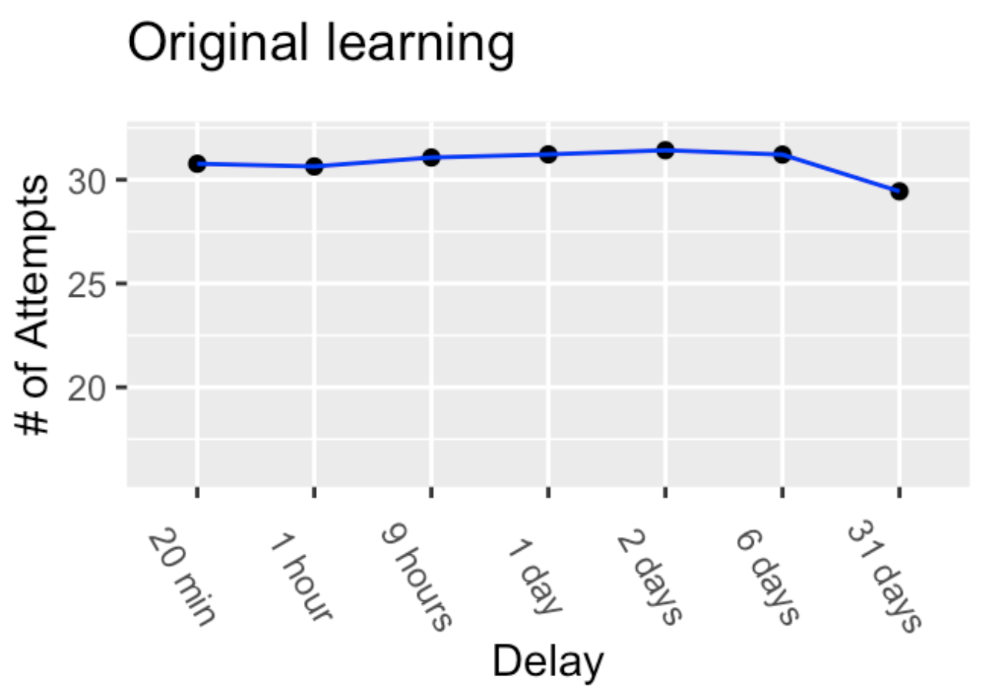
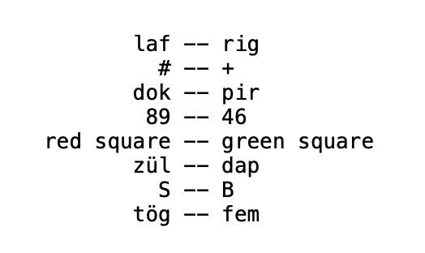
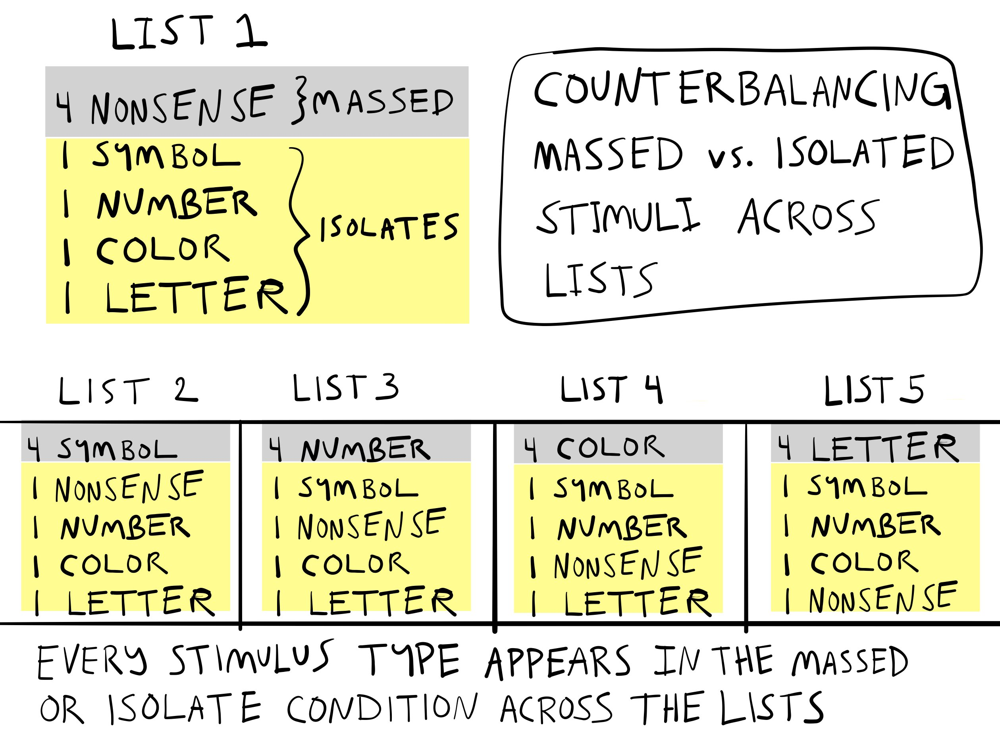

```{r, include = FALSE}
source("global_stuff.R")
```

# Memory 

```{r, cache=FALSE}
word_count <- wordcountaddin::word_count("C8_Memory.Rmd")
wpm <- 200
reading_time <- paste0(round(word_count/wpm, 1), " minutes")
info <- data.frame(word_count,reading_time)
colnames(info) <- c("Word Count","Reading Time")
knitr::kable(info)
```

## Chapter Overview

This chapter provides a compressed overview of memory research in cognition. Like other topics in this book, there has been a great deal of memory research that is too large to fit into one chapter. My personal bias is that memory processes are very important for many cognitive abilities, and further discussion of phenomena and theory from the memory domain will occur in later chapters. This overview will cover a couple early memory researchers, the emergence of different research traditions in the study of memory, and discovery of important memory processing principles.

## Some questions about memory

What is it like for you to remember something from your past? How many events from your life experience can you remember? Why can you remember something from years ago, but forget a phone number or other new information from seconds ago? How do you preserve your experiences so that they can be remembered later on? Why is it sometimes hard to remember something, but later the answer pops in your head? How can you improve your memory? How can you forget things you don't want to think about? What other animals besides humans have memories? How are memories encoded, stored, and retrieved in the brain? How do people use their environment to help them remember things?

I could keep this list of quesitons going, and I'm sure you could too. I find all of these questions about memory very interesting, and even though memory research hasn't solved all of the mysteries, research on memory systems has yielded some answers about these questions and more. 

Memory research has been central in cognitive psychology because it refers to a mental process intervening between a stimulus and response. Not surprisingly, memory processes were neglected by Behaviorists for the same reason, who instead reframed memory in terms of learning processes. Even though it seems sensible that learning and memory should go together, the study of associative learning and memory have developed separate traditions in the literature. Despite these differences, memory research occurred before, during, and after the period of behaviorism in American psychology. For example, psychologists in other countries were interested in memory and made numerous contributions to understanding basic aspects of memory. 

## Early Memory Research

Let's talk about early memory research in two pairs. The first pair is Hermann Ebbinghaus from Germany, and Sir Frederic Bartlett from Britain. Ebbinghaus is famous for his research on forgetting, and Bartlett is known for his book on 'Remembering'. Both of them studied tasks that required repeated remembering, and both made inferences from task performance about the nature of memory processes.

The second pair is Bluma Zeigarnik from Lithuania, and Hedwig von Restorff from Germany, two female psychologists both of whom discovered memory phenomena during the behaviorist period, and both of whose findings were subsequently named after them: the Zeigarnick effect, and the von Restorff effect.

### Ebbinghaus's Forgetting


[Hermann Ebbinghaus](https://en.wikipedia.org/wiki/Hermann_Ebbinghaus) (1850 – 1909) is credited with making the first experimental investigations of human memory. His methods pre-date and resemble many aspects of modern memory research. Working in Berlin, in 1885, he published "Über das Gedächtnis. Untersuchungen zur experimentellen Psychologie", which was later translated to English as "[Memory: A Contribution to Experimental Psychology](https://archive.org/details/memorycontributi00ebbiuoft)"[@ebbinghausUberGedachtnisUntersuchungen1885].

#### What did Ebbinghaus do?

Remember the chapter on Associationism and the philosophers who explained the mind by associations between ideas? Ebbinghaus was kind of experimental philosopher who used experiments to put the philosophical principles of association formation to the test. He was the first to systematically measure the rates with which newly learned information is acquired and forgotten.

#### Methods

He devised a serial learning task to measure recitation of a list of items from memory. He used artificial stimuli to populate his lists so that pre-existing familiarity with the items would not interfere with the learning process. His stimuli were nonsense syllables ^[sometimes still used today] with a CVC structure (consonant-vowel-consonant), and were made up from randomly combining letters (see table below). Ebbinghaus noted making over 2300 syllables. He was also a remarkable subject and conducted all of his experiments on himself. 

In 2015, a pair of researchers from Amsterdam attempted to replicate Ebbinghaus' procedure [@murreReplicationAnalysisEbbinghaus2015]. They followed the original procedure closely and found similar results to Ebbinghaus. So, let's look at the modern replication to get a better sense of Ebbinghaus' task and findings.

A first point to mention, is that the task is very laborious, because it involves a single person learning many long lists of nonsense syllables. If you have ever suffered to rote memorize something, the Ebbinghaus procedure is like your worst nightmare. To give you a better sense, I created a single list similar to one used in the replication. Each nonsense syllable was created by randomly choosing triplets of consonants, vowels, and consonants ^[Note, these nonsense syllables are generated by a script in the programming language R, which is also used to write this whole book. As a result, the letters that appear in the table below will change over time, as I re-run the script to make other changes to the book. I removed nonsense syllables that are legal scrabble words in Enghlish. Nevertheless, it is possible that there are other recognizable words, the appearance of which is not intended, and is a side effect of using a random process to choose the letters for each syllable]. Ebbinghaus, and one of the authors from the replication, learned to recite whole lists, just like this, one row at a time, perfectly from memory. 

```{r}
three_letter <- scan(file="resources/3_letter_words.txt",what = character(),sep = "\n")

consonants <- c("B","C","D","F","G","H","J","K","L","M","N","P",
                "Q","R","S","T","V","W","X","Y","Z")
vowels <- c("A","E","I","O","U")

cvc <- function(){
syl <- paste0(sample(consonants)[1],sample(vowels)[1],sample(consonants)[1])
}

big_list <- replicate(2000,cvc())
small_list <- big_list[big_list %in% three_letter == FALSE]
list_one <- matrix(small_list[1:(8*13)], ncol=13,nrow=8)

list_one <- cbind(rows=1:8,as.data.frame(list_one))
names(list_one) <- c("lists/syllables",1:13)
knitr::kable(list_one)
```

In the first phase, rows of 8 nonsense syllables were learned to a criterion called "one-time perfect". One-time perfect meant to recite a whole row in order by memory, just one time. To get to "one-time perfect", the syllables were practiced by reading a row out loud in order. Practice attempts were repeated as many times as necessary. After one perfect recitation, the next row was learned and so on. There was a rigorous learning schedule spread over many days so that 70 lists could be learned.

In the second phase, each row was re-learned after a delay. The delays were 20 minutes, 1 hour, 9 hours, or 1, 2, 6, or 31 days. After each delay period, lists were shown again and relearned. The number of relearning attempts needed to recite a rows perfectly was counted.

#### Original Learning

Ebbinghaus considered the feat of reciting a single row of nonsense syllables by memory an example of learning new associations. Something like associations was the connecting glue between the syllables. Before the associations were established he was unable to recite all of the syllables from memory. However, practicing was assumed to establish associative connections between syllables. And, after enough practice attempts it was totally possible to recite a row of 13 nonsense syllables one time from memory. So, some kind of new learning must have happened to enable the recitation.

::: {.floatright50 data-latex=""}


```{r}

```

:::

The first phase of the experiment measured how many practice attempts were needed to learn a row of 13 nonsense syllables. The results from the 2015 replication [reported in their table 1] are shown in the figure. The blue line shows around 30-32 practice attempts were needed to memorize a single row in the first phase. Each dot represents the number of practice attempts for sets of rows that would be paired with particular delays to test forgetting and relearning.

#### Savings in Relearning

Ebbinghaus was most interested in what would happen in the second phase. For example, what would happen to his ability to recite a row of nonsense syllables if he waited 20 minutes, 1 hour, 9 hours, or up to 1, 2, 6, and 31 days before trying to recite the list over again? He decided to measuring savings in re-learning to find out.

If memory for a learned row was not perfect after a delay, then it would not be possible to recite a row perfectly from memory. The row would have to be relearned. The question was how many relearning attempts would be needed to reach the same criterion as before...one-time perfect. If it took 30 practice attempts in the original learning phase, would there be any savings in relearning? That is, would the number of relearning attempts be less than 30? The data from the original and re-learning phases are shown below.

The blue line always shows the number of attempts needed during original learning. The black line shows the number of attempts needed during re-learning. The y-axis shows the number of attempts, and the x-axis shows the amount of delay between original learning and re-learning.

```{r, echo=FALSE}
library(tibble)
library(ggplot2)
library(patchwork)

# data from Murre & Dros 2015
conditions <- 1:7 
delays <- c(20,60,60*9,60*24,60*48,60*6*24, 60*31*24)
delay_names <- c("20 min","1 hour","9 hours","1 day","2 days","6 days","31 days")
initial_learning <- c(30.77,30.64,31.07,31.22,31.42,31.21,29.44)
relearning <- c(16.26,19.22,22.48,21.33,24.19,25.97,28.23)

ebbinghaus_rep <- tibble(
  conditions,delays,delay_names,initial_learning,relearning
)

relearning <- ggplot(ebbinghaus_rep, aes(x=conditions,y=relearning))+
  geom_point()+
  geom_line()+
  geom_line(color="blue",aes(y=initial_learning))+
  geom_point(aes(y=initial_learning))+
  scale_x_discrete(limits=1:7,labels=delay_names)+
  ylab("# of Attempts")+
  xlab("Delay")+
  ggtitle("2015 Replication \n (Murre & Dros)")+
  theme(axis.text.x = element_text(angle = 300))

original <- ggplot(ebbinghaus_rep, aes(x=conditions,y=initial_learning))+
  geom_point()+
  geom_line(color="blue")+
  scale_x_discrete(limits=1:7,labels=delay_names)+
  coord_cartesian(ylim=c(16,32))+
  ggtitle("Original learning")+
  ylab("# of Attempts")+
  xlab("Delay")+
  theme(axis.text.x = element_text(angle = 300))

relearning_log <- ggplot(ebbinghaus_rep, aes(x=delays,y=relearning))+
  geom_point()+
  geom_line()+
  geom_line(color="blue",aes(y=initial_learning))+
  geom_point(aes(y=initial_learning))+
  ggtitle("Re-learning")+
  ylab("# of Attempts")+
  xlab("Delay (minutes)")

relearning+original/relearning_log

```

What happened after a 20 minute delay? First, memory for a row was not perfect. Instead, around 16 re-learning attempts were needed to reach the once-time perfect criterion. However, even though a row could not be remembered perfectly after a 20 minute delay, the savings in re-learning showed that the original learning was "gone but not completely forgotten". The savings in relearning was computed as the difference between original learning and relearning, or $30.77-16.26 = 14.51$. In other words, 14.5 practice attempts were saved, or not necessary, in order to get back to the same level of performance. 

What happened as the delays got longer and longer, up to 31 days? There are two ways to look at this. First, the larger plot on the left shows that the relearning attempts go up from 16 to 28, as the delay increases from 20 minutes to 31 days. This shows that the ability to recite a row appears to degrade more and more over time. However, even by 31 days, there is still some small amount of savings in relearning, suggesting the ability had not degraded entirely.

Second, the smaller plot on the bottom right shows the same findings, except the x-axis expresses the delays in minutes. Here, the x-axis goes from 20 to 44640 (the number of minutes in 31 days). This way of plotting the data makes it easier to see an an exponential trend in the number of re-learning attempts. The exponential trend suggests that the rate of forgetting, or the rate this ability degrades changes over time.

Specifically, the rate of forgetting is very high after initial learning but the rate slows down over time. For example, between 0 and 20 minutes from original learning, the number of relearning attempts needed goes from 0 to 16. By two days, the number of relearning attempts goes to 24. However, the rate of forgetting is greatly reduced as the delay gets longer. Between 2 days and 31 days, the number of re-learning attempts goes from 24 to 28. Taking re-learning attempts as a measure of forgetting, there was a big increase from 0 to 24 in the first 2 days, but a much smaller increase from 24-28 over the next 29 days.

#### Exponential Forgetting

::: {.floatright50 data-latex=""}


```{r}
knitr::include_graphics("imgs/Ebbinghaus_exp.jpg")
```

:::

In other words, Ebbinghaus found an exponential forgetting curve. Early on after learning there is fast forgetting. Lots of forgetting occurs in a short period  of time. Later on, the rate of forgetting slows down, and there is less forgetting over longer periods of time. It's like going to Las Vegas and spending most of your money on the first day, and then losing your small amount of remaining money slowly over the rest of week.

#### Spacing effects

Ebbinghaus also demonstrated the effects of spacing out practice on learning and memory performance. Two ways to practice a new skill, like learning a series of nonsense syllables, are to mass or space practice attempts. Massing practice attempts mean to lump attempts together and take few breaks between attempts. Spacing refers to adding breaks between practice attempts. Ebbinghaus showed that adding spacing between practice attempts improved his memory performance.

If you search [Google Scholar](https://scholar.google.com/) with terms like "massed practice", "spaced vs massed practice", and "distributed practice" you will find many papers examining how the schedule of practice attempts influences learning and memory in many different tasks. In general, the practice schedule does matter, it can change how fast you learn something and how long you retain information. For example, a meta-analysis in 1999 looked at evidence for spacing effects in 63 studies, which used a wide range of different tasks [@donovanMetaanalyticReviewDistribution1999]. Overall they found that spaced practice benefited learning compared to massed practice. So, should you always space practice to improve your learning? Well, they also found the size of the benefit depended on the task. So, before you space all of your practice, try searching google scholar to see if there is any research on the skill you are trying to learn. There may be recommendations for "best-practice" schedules to help you optimize your skill acquisition. 

#### Serial Position effect

Ebbinghaus also showed early evidence of serial position effects in memory. Just like "spacing effects", if you search "serial position effect" in google scholar, you will again find hundreds of papers on the phenomena. The basic finding is that your memory for items in a list can depend on the order in which you received the items. In many cases there are primacy and recency effects. Memory is often better for the first (primacy) and last items (recency) compared to the items in the middle.

#### Process explanations

It is worth flipping through Ebbinghaus' book on his memory research. It is available [here from the internet archive](https://archive.org/details/memorycontributi00ebbiuoft). He ran many experiments and tested ideas about the underlying operations of memory processes. In particular, I will refer you for additional reading to his chapter VII, called "Retention and obliviscence as a function of the time". Here, Ebbinghaus considers four explanations about how a memory process may hold onto knowledge over time ("retention") and/or lose knowledge over time ("obliviscence"). In his discussion, he anticipates the concept of memory traces which is important in many modern theories.

### Bartlett's Remembering

[Sir Frederic Bartlett](https://en.wikipedia.org/wiki/Frederic_Bartlett) (1886 - 1969) was British psychologist, and is well-known for his book "Remembering" published in 1932 [@bartlettRemembering1932] recounting his extensive experiments on remembering, imaging, and perceiving. Bartlett took the word **remembering** very literally and played a prominent role in establishing a reconstruction based view of human memory. Before discussing the reconstruction idea, and Bartlett's experiments that supported it, let's begin with a few simple, but wrong physical metaphors of memory.

#### Memory is a file drawer

File drawers a physical systems for storing and retrieving information. Information on paper is placed into files and stored in cabinets. The files could be tagged for ease of later retrieval. Information is retrieved by looking up the correct file and taking it out of the file drawer. The only contents that get saved in memory are what goes into the file system. Failures of memory could include, 1) not getting placed into the drawer, 2) getting misfiled, 3) destruction of information due to some outside source (e.g., water, fire), and so on.

#### Memory is a camera

Cameras, like the ones on modern cell phones, can record and save streams of visual and auditory information. Cameras provide a veridical record of light in the world hitting the lense over time. In this system, memory failures could include failing to capture an event in the record, noisy input quality, noisy playback quality, or degradation of the storage material.

#### Memory is a bent-wire

One more quick metaphor, memory as a bent-wire. Consider a brand new metal wire that is completely straight. It get's bent into a clothes hanger, then it get's bent into a hook for reaching something, then it get's thrown out, and bent in the trash, and so on. The wire doesn't have a hard-drive where it can store pictures of times it got bent. Instead, those memories are imprinted on the wire. The bends in the wire reflect the history of experiences.

#### Memory is none of these things

The above physical metaphors for memory have some properties in common with human memory. The file drawer and camera can encode, store, and retrieve information, and make errors and mistakes. However, people display many more interesting memory failures than the physical metaphors. The physical memory devices do not produce memory distortion. They do not remember new information that was not in the file, or on the hard-drive. Importantly, people produce memory distortions all of the time. Two examples of memory distortions are claiming to remember events that did not occur, or exagerating events that did occur. Bartlett's work is important for demonsrating evidence of memory distortions as fundamental to the process of remembering.

#### Memory is re-membering

The word re-member literally means to take pieces (members) that were previously together, and put them back together again. Bartlett imagines memory as a [humpty-dumpty](https://en.wikipedia.org/wiki/Humpty_Dumpty) process, where the broken up parts of previous experiences are put back together again by memory. On this reconstructive view, memories are not like replaying a video from a past experience. Instead, the memory process reconstructs elements of prior experiences into a whole. These reconstructed experiences **feel like** events from the past, but they are approximated reconstructions of those events. Some modern memory theories take this stance even further and claim that people do not really have "memories" that are stored or retrieve at all. Instead, we have the mental ability to construct experiences, both new ones (as in dreaming or imagination) that feel new, and new ones that convincingly feel like they occurred in the past.

Bartlett assumed that re-membering is guided by an overarching schema, or someone's general understanding. He assumed it was possible for memory to become distorted during reconstruction, and that reconstructed events could become shifted toward the schema used to aid reconstruction. If some information was missing during reconstruction, then those features of the reconstructed memory would be substituted by the schema, thus rendering the recreated memory more similar to the general schema than the peculiar details of an original experience.

#### Method of Serial Reproduction

Bartlett's reconstructionist view of memory was informed by his "method of serial reproduction". This was similar to Ebbinghaus' method of learning lists by practicing them over and over. The major difference was that Bartlett gave his subjects something to remember, then he had them remember it over-and-over again. He measured how the content of each remembering attempt changed over time. We will look briefly at two of his examples, the war of the ghosts, and L'Portraite D'homme.

#### War of the Ghosts

Bartlett had subjects (who were also British) read a story called the "War of the Ghosts", which was a folk-lore story about indigenous Americans. Then, he asked his subjects to write down the story from memory. After they were finished, he had them write it down again from memory. Then, again, and again. It's a little bit like the children's [game of telephone](https://en.wikipedia.org/wiki/Chinese_whispers), where a message is passed from one child to another. What happens to the message at the end? It is usually morphed into something very different from the first message. Bartlett found similar results in his serial reproduction task, where subjects were essentially playing telephone with their own memory of a story.

As people kept reproducing the story from memory, they introduced new details, and left out original details. Additionally, the retold story seemed to head toward a common direction. It was as if his subjects pre-existing biases and general notions about the characters and situations in the story were guiding how they retold the story. Bartlett used these observations to suggest that memory reconstruction was being guided by "schemas". Schemas are scripts that are supposed to guide how memory reconstructs information. Bartlett's schemas often referred to central tendencies or stereotypical generalizations about the content he showed his subjects.

#### L'Portraite D'homme

Another example of serial reproduction involved drawing faces. He gave people a picture of a mask. Then he took the picture away, and asked his participants to draw the it from memory. Over days and months, he had the same people attempt to draw the picture from memory many more times. The astonishing finding was that as people re-drew the picture, it became less and less mask-like, and more and more face-like.

```{r, eval=knitr::is_html_output(), echo=FALSE,out.extra="class = 'centerfigureshadow'", fig.align="center"}
knitr::include_graphics("imgs/Bartlett_homme.png")
```

```{r, eval=knitr::is_latex_output(), echo=FALSE, fig.align="center"}
knitr::include_graphics("imgs/Bartlett_homme.png")
```

Bartlett interpreted this finding as evidence that people reconstructed their memories based on schemas. His participants knew they were attempting to reconstruct face-like thing, and as they redrew the item from memory, over time they replaced elements of the original mask with elements from their schema for faces. With enough reproductions, the participants were relying mostly on their schematic knowledge, and their drawings slowly morphed into faces rather than masks.

#### Reproducing Bartlett

Some of Bartlett's experiments and specific findings have not been replicated by other researchers. For example, in 2012, Carbon and Albrecht [@carbonBartlettSchemaTheory2012] tried five different replications of the Bartlett's face drawing procedure, but they did not show that people's reproductions became more face-like over time. They used Bartlett's mask stimuli, and even stressed to subjects that the task was to redraw the "face" from memory. Their subjects drawings did change over reproductions by becoming less detailed, but they did not appear to converge on a prototypical face.

At the same time, some of Bartlett's results have been replicated. For example in 1999, Bergmann and Roediger [@bergmanCanBartlettRepeated1999] replicated a version of the war of the ghosts. They were able to show that subjects did introduce major and minor distortions to recall of the story during a first, second, and third recall session. As they note, if you read Bartlett's book (which is highly recommended and fun to read), you will find he did not explain his experimental protocol in precise detail, which makes it difficult to repeat what he did.

Finally, although some of Bartlett's individual findings may not stand the test of time, there are many reproducible findings showing that memory can be distorted in interesting ways. So, even though memory reconstruction may not always head toward a schema, memory does appear to involve some kind of constructive process capable of returning sometimes accurate and sometimes distorted impressions of past experiences.

#### Meaningful memory

One of the big implications of Bartlett's ideas is that memory can depend on meaning. Again we will unpack this principle throughout because it is obvious, at least to me, what it means for something to be meaningful. In a general way, your memory for particular events can be influenced by how you think about and understand those events. In other words, it's not just the number of times that you practice something, or whether or not you include breaks in your practice schedule that will makes things stick. Making new things meaningful with respect to old things you already understand can influence the process as well.

### The Zeigarnik effect

Research on human memory has yield many experimental procedures intended to demonstrate a particular kind of memory phenomena, or test an explanation of a phenomena, or both. Many of the phenomena are also called "effects", sometimes credited person who first demonstrated the phenomena. And, just like we saw earlier with Bartlett, sometimes the effect and explanation becomes well-known, even if it isn't reliably reproduced. Another example in this vein is the Zeigarnik effect.

In 1927, Bluma Zeigarnik conducted several experiments showing that uncompleted tasks are remembered better than completed tasks [@zeigarnikFinishedUnfinishedTasks1968]. I've always thought of the Zeigarnik effect as the "to-do list" effect. I think about tasks on the list, but I don't think about tasks I've already completed. Sadly for me, I often forget to think about the tasks on the list too...

In any case, Zeigarnik ran several experiments with a simple design. Participants were given a variety of tasks that took about 3- 5 minutes to complete. The tasks could be math, or drawing, or threading a needle. Partway through some of the tasks, she interupted people and asked them to start on a new task. At the end of the experiment, the participants had completed some of the tasks, and others remained incomplete. Zeigarnik then had participants recall all of the tasks. Across several experiments she reliably found that people recalled more of the incompleted tasks than the completed tasks. One explanation was the goal to a complete a task created psychological tension that could only be resolved by completing the task. This goal-based tension is not resolved when a task is interrupted, and leads to differences in memory completed and incompleted tasks.

In a recent historical review of Zeigarnik's life and research, Macleod notes that her findings have been difficult to replicate. For example, 1968, Van Bergen published several replication attempts and found that her participants did not show systematic differences in their memory for completed and incompleted tasks. He also notes that additional research on the basic effect  of "task-interruption" on later recall of tasks from memory has not been forthcoming. So, in many ways the status of this effect as a reliable influence on memory remains unclear.

I bring up this example because it reflects several broader issues in memory research. One is that some findings are not reproducible for many reasons. Maybe the effect happens for some people and not others, or maybe it just doesn't happen much at all. Individual memory effects can be neat an interesting. For example, after learning about Zeigarnik effect myself many years ago, I thought, "that's neat...maybe I should complete some tasks on my to-do list so that I no longer think about them". Last, the research pursuit of individual memory effects can be a red-herring, especially if the motivation for examining the effect is unclear, and the effect is not reproducible. 

### The von Restorff effect

A historical review of Hedwig von Restorff and her now famous demonstrations that distinctiveness influences memory [@vonrestorffUberWirkungBereichsbildungen1933] is also provided by Macleod [@macleodZeigarnikRestorffMemory2020]. Von Restorff applied the figure/ground concept from Gestalt theory to memory domain. A basic idea from Gestalt theory was that representations of individual experiences are wholistic, involving  objects (figure) and their surrounding context (ground). Von Restorff took this idea and asked how memory might depend on factors that isolate figure from ground. In perception a chameleon can be camouflaged and difficult to isolate from its surrounding. Or, a bright and conspicuous flower can stand out in a distinctive way, against dull colorless backgrounds. Would the same principles of distinctiveness apply to memory? It turns out, they do, and unlike the Zeigarnik effect, Von Restorff's findings have been reproduced many times, and in different ways. Here is what she did. 

::: {.floatright50 data-latex=""}


```{r}

```

:::

Participants were tested on their memory for 5 lists. Each list had 8 pairs of items. An example of a list is presented to the right. Each list had four pairs that were similar. These were called "massed" pairs. Think of them as providing a dull grey background. The other four pairs were all different. These were called "isolates". They are like a colorful flower, in that they stand out from the massed pairs. The "massed" pairs in the list below were the four pairs of nonsense-syllables. The "isolates" were the remaining four pairs.

#### Counterbalancing

Von Restorff used a technique called *counter-balancing* in her experiment. Counter-balancing can be used to reduce the concern that the outcome of the experiment was due to a stimulus confound. For example, Von Restorff would show participants her lists, have a conversation brief conversation with them, and then ask the participants to recall each pair from the list. Her question was whether the "isolated" pairs would be recalled with greater accuracy than the "massed" pairs. In the list above, this would mean better recall for "# -- +, 89 -- 46, red square -- green square, and S -- B", compared to the other four pairs that were all nonsense-syllables. This is what Von Restorff found, but you might be concerned that there was a stimulus confound. For example, maybe nonsense syllables are hard to remember compared to these other pairs. 

::: {.floatright50 data-latex=""}


```{r}

```

:::

Von Restorff guarded against the stimulus confound interpretation by *counter-balancing*. This is why there were 5 lists in total. In the first list, the massed pairs were nonsense syllables, but the "isolated" pairs were used for the massed pairs in the other four lists. For example, the second list could have four massed symbol pairs (like # -- +), and the remaining four pairs would be "isolates" from the kinds of pairs. The third list could have four massed number pairs, and so on. The counterbalancing scheme is illustrated in the figure for further clarity.

#### Memory and Distinctiveness

Importantly, Von Restorff averaged across the counterbalancing lists to look at the effect of "massed"  vs "isolated" pairs on memory. She found that "isolated" pairs were recalled at higher rates than "massed pairs, and she found this reliably across the lists. For example, when there were four symbol pairs (like list 2 in the figure), memory for the other isolated pairs (in yellow) was better than memory for the symbol pairs.  In list 3, memory for the four number pairs was worse compared to the isolated pairs. To quote from the English translation, across the conditions, "the number of hits is higher in the isolated constellation than in the corresponding massed constellation, regardless of type of material." This last point is intriguing. Von Restorff had shown that particular stimuli were more or less memorable, not in and of themselves, but in relation to how distinct they were from other stimuli in the set.

The finding that distinctive items can be remembered better than non-distinctive items has been reproduced many times, with many different kinds of stimuli. However, although the finding is well known, explanations of the finding continue to be debated. At this juncture we will not head into that debate just yet. One of the reasons for the debate, is that there are many different models and theories of memory, so naturally there are differing perspectives on the role of distinctiveness in memory.


<!--
[Hermann Ebbinghaus](https://en.wikipedia.org/wiki/Hermann_Ebbinghaus) (1850 – 1909) is recognized as conducting some of the first experiments on human memory processes. In 1885, he published "Über das Gedächtnis. Untersuchungen zur experimentellen Psychologie", which was later translated to English as "Memory: A Contribution to Experimental Psychology".


Ebbinghaus recognized that people had many pre-existing associations from their experience with the world, and he saw this as a problem for experimental investigation. For example, people might have different associations between the same two objects because of their different histories of experience with the two objects. Furthermore, he was interested in how association formation worked from the beginning, when new associations were being formed. For these kinds of reasons, he decided to create artificial stimuli for experiments. These are stimuli that would be unfamiliar, and would have no pre-existing associations. The use of unfamiliar or artificial stimuli to control for experience in cognitive experiments remains common today.

#### Reciting sequences of nonsense syllables

I should also mention that Ebbinghaus conducted his memory experiments on himself ^[single-subject research is not as common as a research tradition, but see @vossLongtermAssociativeMemory2009 who conducted a lengthy experiment on himself to estimate his long-term capacity for remembering associations between pictures]. Here is what he did.

First, he made artificial stimuli that were random combinations of consonants and vowels, called CVC strings because they were composed of three letters, a consonant, a vowel, and another consonant. Here is an example of a list of 10 CVC strings, or nonsense syllables:

> BEK DUV XAQ WEM ZAL FIV PUH KAB MEL JOX

Try reading this list out loud one time. After you are doing reading the syllables once, how well do you think you could remember them all from memory? For example,close your eyes, or look away from the screen, and then attempt to recite the syllables from memory in order from first to last. Were you able to successfully recite all 10 syllables in perfect order?

Ebbinghaus followed a similar procedure, but he allowed for practice. For example, Ebbinghaus first conducted a learning phase. In the learning phase he repeatedly practiced reciting the list from memory until he could go through the whole list in perfect order. In this way, he was able to measure how many learning attempts were required to perfectly "memorize" the list.

Ebbinghaus did many experiments and learned many different lists of different lengths. He was interested in factors that would help him learn a list, factors that would cause him to forget the list, and factors that help him to relearn the lists. We'll look quickly at forgetting, and then at the concept of re-learning.

#### Forgetting Curves

Ebbinghaus measured the first forgetting curves by waiting different amounts of time before he tried to recite on of his learned lists. Perhaps not surprisingly, he found that his ability to recite a list of syllables in perfect order got worse over time. However, he was also able to show a systematic relationship between time and the disruption of his recitation from memory.

-->

  
## Separating traditions in memory research

-overview the idea

## Memory as information processing
  
Information processing tradition  
- Miller
  -chunking (coding)
- STM/LTM models
  
## Memory Principles 

Subjective processing tradition
- memory principles
- Tulving (subjective organization)
 - and memory distinctions
 - Semantic vs episodic
 

 
