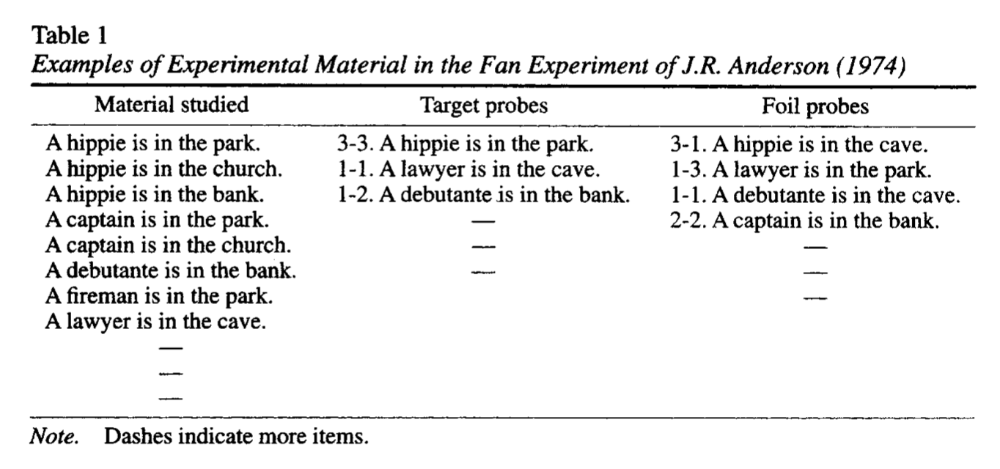

```{r, include = FALSE}
source("global_stuff.R")
```

# Memory II

```{r, cache=FALSE}
word_count <- wordcountaddin::word_count("C9_Memory_II.Rmd")
wpm <- 200
reading_time <- paste0(round(word_count/wpm, 1), " minutes")
info <- data.frame(word_count,reading_time)
colnames(info) <- c("Word Count","Reading Time")
knitr::kable(info)
```

## Chapter Overview

This chapter continues to discuss memory research in cognition. In the last chapter we reviewed some early memory research that led into an information processing approach to memory in the 1960s. In this chapter we will pick up our discussion from this time period onward. I will also focus less on models of memory, and more on tasks, phenomena, and principles of memory. We will return to formal explanations in the computational modeling chapter.

## Verbal Learning and Verbal Behavior

The period of behaviorism in American psychology had a sizeable influence on the character of memory research that would follow in the 1950s, 60s, and 70s. And, itt is worth mentioning one of the transitional points between behaviorism and cognitive approaches to explain why so much of this chapter will be about memory for words.

In 1938, B.F. Skinner published his book on a behaviorist approach to animal learning. However, Skinner also sought to apply his behaviorism to people, and all of their behavior as well. In 1947, Skinner's William James lectures at Harvard developed an extension of behaviorism to human language. The idea was that human language involved verbal behavior, and that principles of behaviorism could be applied to the domain of verbal behavior. Just like a science of behaviorism could determine how environmental stimuli could be manipulated to control a behavioral response in an animal, behaviorism could also determine the functional principles controlling the output of verbal responses in people. His lectures were widely circulated in unpublished form, and were eventually published in 1957, in the book "Verbal Behavior" [@skinnerVerbalBehavior1957]. At the same time, other domains like psycholinguistics were also developing, and Noam Chomsky famously critiqued the prospects of a behaviorist science of human language in his review of Skinner's book [@chomskyReviewVerbalBehavior1959]. One of the issues caught hanging in the balance was whether or not cognitive processes would be necessary for a successful account of language.

Subsequently, behaviorist and cognitivist research streams emerged on topics of verbal behavior. Skinner's behaviorist approach to verbal behavior was followed up in behaviorist journals in the 60s, and some research in that tradition continued at a small pace [@eshlemanQuantifiedTrendsHistory1991]. In 1962, following a growing interest in verbal behavior from the emerging cognitive tradition [@coferOriginsJournalVerbal1978], a new journal was created called "The Journal of Verbal Learning and Verbal Behavior", and later renamed "Journal of memory and language" in 1985. Many other journals published memory research over that time period, but I am highlighting this journal for three reasons. First, the papers in that journal track several notable developments in memory  that we will discuss in this chaper. Second, the journal shows how ideas from the study of associative learning guided the renewed interest in experimental research on human memory. Last, if you ever wondered why memory research uses words as stimuli so often, it might have something to do with the verbal learning and verbal behavior phase of memory research.

To make one more historical note, the growing divide between Skinner's operant behaviorism and cognitive psychology is nicely documented in Blough and Millward's 1965 review, "Learning: Operant Conditioning and Verbal Learning". They begin by quoting Kendler saying "In general, learning theorists understand each other much better than did their ancestors of two decades ago. Neobehaviorists, S-R functionalists, and statistical theorists can communicate easily with each other. Skinnerians also find it easy to communicate among themselves". The paper then reviews operant conditioning research in part A, and verbal learning in part B, with little overlap between the two research traditions. Their review of verbal learning also provides a bird's eye view of the increasingly wide-ranging empirical and theoretical concerns that was becoming a new era of cognitive psychology. Much of the work revolved around learning and memory.

## Memory Methodology

We have already seen a few different memory tasks in the last chapter. Ebbinghaus memorized lists of nonsense syllables. Bartlett had his method of serial reproduction. Von Restorff had people memorize pairs of items. There was also the immediate memory span task, and memory for lists of words testing with free-recall. There are many more memory tasks that have been used in the study of learning and memory. Some of these tasks become very popular and generate bursts of research interest. In this section, I will describe some general properties of memory tasks, and throughout the rest of this chapter we will encounter specific examples of the tasks in action. 

Memory tasks typically involve two phases: encoding and retrieval. Generally speaking, the encoding phase involves the presentation of stimuli for a later memory test in the retrieval phase. For example, there were two phases in the free-recall experiments from last chapter showing the serial-position effect. In the encoding phase, participants were presented with a list of words. In the retrieval phase, participants were asked to recall as many words as they could. The encoding and retrieval phases could also overlap depending on how the experiment was conducted. For example, a participant could encode some items, then try to remember them, then encode some new items, and so on. 

Memory tasks typically involve experimental manipulation of factors in the encoding and retrieval phases. One aim of the experiments is to determine which factors influence performance in the memory task. Another aim can be to test theories of memory processes. For example, some theories may make predictions about the extent to which the factors will influence memory performance. The addition of experimental manipulations can change almost any aspect of the basic task setup. 

Some common manipulations include the following. The kind of information or stimuli presented or learned in the task. Stimuli can be words, pictures, artificial stimuli like nonsense syllables, or sounds, movies, sentences, and more. The frequency of presentation of items. The order of presentation of items. The temporal delay between the encoding phase and the later memory test. Manipulations can also include what the participant does to information during the encoding phase, or how they are asked to remember it in the retrieval phase. If you can think of something that might increase or decrease your ability to remember information, I'd say there is a good chance that a memory researcher may have tried the manipulation at some point in a published experiment.

Memory tasks also involve different methods for measuring memory performance. For example, in the free recall task, a participant could be given a blank sheet of paper and asked to write down as many words as they can remember, in any order. In this task, memory performance could be measured as the number of words correctly written down. There are other tasks as well, such as the recognition task. In a recognition memory task, the retrieval phase involves presenting items to a participant, and having them judge whether the item is new (not presented in the encoding phase) or old (was presented in the encoding phase). Importantly, memory performance depends on the task used to measure memory. 

### Issues with measuring memory: the case of recognition

The recognition task is a good example to alert you to a common interpretation problem in memory research. The issue is that the choice and structure of a task can easily influence measurements of memory performance. For example, in a recognition memory task the retrieval phase involves a person making judgments about stimuli they have seem before, and stimuli they have not seen before. Old items from the encoding phase may be presented, and the correct answer is to identify them as old. New items that were not shown in the encoding phase are also presented, and the correct answer is to identify them as new. 

One of the issues is that participants can always achieve 100% correct on the old items. All they have to do is say "old" for every item in the test, both old and new items. In this case, it would be obvious that the participant was not discriminating between old and new items, because they would also be 100% incorrect on the new items. This thought experiment highlights the fact that the recognition task can involve a discrimination judgment between old and new items. The ability to tell the difference between old and new items is commonly measured by hits and false alarms.

#### Hits, False Alarms, misses and correct rejecdtions

Hits and false alarms come from an analysis technique called [signal detection theory](https://en.wikipedia.org/wiki/Detection_theory) [@greenSignalDetectionTheory1966], commonly used to describe performance in recognition memory tasks. The table below shows the relationship between response in a recognition memory task, and terms in signal detection theory:

|   |  OLD ITEM |  NEW ITEM |
|---|-----------|-----------|
| RESPOND OLD  |  HIT (Correct Answer) | FALSE ALARM  (Incorrect Answer) |
| RESPOND NEW  |  MISS (Incorrect Answer) | CORRECT REJECTION  (Correct Answer) |

A hit is correctly identifying an old item as old. A false alarm is incorrectly identifying a new item as old. We will not go more deeply into signal detection at this point. However, the hit and false alarm rates can be used to measure whether a person can discriminate between old and new items. If the hit and false alarms are equal, like 100% hits and 100% false alarms, then the person is not showing evidence they can tell the difference between old and new items. However, if the hit rate is greater than the false alarm rate, like 80% hits and 20% false alarms, then the person is showing evidence they can make the discrimination. The important aspect is that memory performance in the recognition task is assessed with both hit and false alarm, and not solely on the basis of one measure like proportion correct (hit rate).

#### Choosing the lures (new items)

The discrimination aspect of the recognition task raises the issues of which items to use as lures or new items in the task. Memory researchers sometimes use the word *lures* to describe new items in a recognition memory test, referring to whether or not participants  will take the bait and claim to have recognized the lure even though it was not presented in the encoding phase. The issue with choosing lures or new items, is that recognition performance will improve or worsen depending on whether the lures are easy or hard to discriminate from the old items. 

Imagine an encoding phase were you read a list of 20 words that all began with the letter A. Then, in a recognition test you read one word at a time, and were asked to judge whether the word was old (from the list) or new (not from the list). How well do you think you would perform this task if all of the new words also began with the letter A, compared to a situation where all of the new words began with the letter Z? The recognition task would be very easy when all of the new words started with Z, and were obviously different from the words that began with A in the original list. The recognition task would be harder if the new words started with A, and were chosen to be very similar words to the studied list.

The take home message from this discussion is that performance in a memory task may not necessarily involve memory processes, but could involve other cognitive abilities and processes that participants use to perform the task at hand. Memory researchers are well aware of these nuances, and are often at pains to experimentally control aspects of memory tasks to rule out confounding processes or interpretations. I raise these general issues of interpretation to encourage a little bit of caution when reading through the next section on memory phenomena. Here we will go through a list of findings from memory tasks. These findings are suggestive of general principles about how memory works, but they also reflect the specific ways that people perform laboratory tasks used in memory research.

## Memory Phenomena

The term memory phenomena refers to findings from performance in laboratory-based memory tasks. It could refer more broadly to everyday aspects of memory as well. For example, the feeling of *déjà vu* is an experience where people feel as though they have lived through a present moment before. This section will focus mostly on laboratory-based phenomena. There are more laboratory phenomena of memory than can fit in this chapter, so I have chosen some that are in my estimation reasonably representative of the very large literature. I will start by reminding you of some phenomena we have already discussed, and then continue with a small laundry list of newer phenomena.

### Temporal Delay

As we know from Ebbinghaus' research on the forgetting curve, memory performance tends to decline with increasing temporal delays between encoding and retrieval. Memory experiments often include a manipulation of delay, such as a short delay of 5 to 20 minutes, to longer delays of days, weeks, or months. In general, memory performance is usually worse after longer than shorter delays. But, memory can change in interesting ways over time, and manipulations of delay are known to interact with other factors too.

### Distinctiveness

Von Restorff showed that memory for a set of "isolated" items that were all different from one another was better compared to a set of "massed" items that were all similar to one another. In other words, memory performance in her task was better for the distinctive items. There have been many demonstrations that distinctiveness can influence later memory performance, and researchers continue to be interested in distinctiveness phenomena.

### Serial Position

In the last chapter saw that the order of items in a list (serial position) influenced memory performance in a free recall task. People generally recalled more words from the beginning (primacy) and ending (recency) of the list, compared to the words in the middle of the list. The relative size of primacy and recency effects can also depend on the format of the memory test (e.g., recall vs. recognition) [@oberauerUnderstandingSerialPosition2003].

### Mental Imagery

If you remember way back to the chapter on mental imagery, we learned about Paivio's work showing that memory performance is better for words that evoke more imagery than words that do not.

### Stimulus effects: Picture Superiority

Not surprisingly, the format of stimuli used in memory experiments influence memory performance. The picture superiority effect provides one example. As the old saying goes, "A picture is worth a thousand words", which apparently works for memory too. Several papers have reported that pictures are remembered better than words, in both recall tasks [@paivioWhyArePictures1968] and recognition tasks [@gehringRecognitionMemoryWords1976]. 

More recently, Hockley showed the picture superiority effect extended to another kind of recognition task called "associative recognition" [@hockleyPictureSuperiorityEffect2008]. In this task participants saw pairs of items in the encoding phase. The item pairs were concrete noun words, or pairs of line drawings. In the recognition phase, participants saw word or picture pairs from the encoding phase, or rearranged versions of the pairs. Participants were better at recognizing the old pairs when they were pictures compared to words.

### Frequency effects

The frequency or number of times you encounter an item can influence later memory performance. For example, memory recall can improve for items presented more than once during learning [@petersonRecencyFrequencyPairedassociate1962,@petersonShorttermVerbalMemory1966].

The number of times an item is presented during an encoding phase can also influence performance in a recognition task. For example, Hintzman showed a case where item frequency had no effect on recognition accuracy, but did influence the speed of recognition judgments [@hintzmanRecognitionTimeEffects1969]. However, this was a curious case, and I bring it up to quickly mention the concept of *ceiling* and *floor* effects. A ceiling effect occurs when performance is at the top a scale and can't go upward any further. For example, in Hintzman's study, participants were close 100% accurate in their recognition judgments for all items. The task was easy enough that they were at the ceiling after seeing an item only one time, and the remaining presentations of the item did not improve their performance, because they were already perfect. A *floor* effect is the opposite case, where performance is at the bottom of a scale, and is unable to go down further. Even though Hintzman's participants had near perfect recognition memory, the effect of item frequency was still evident on the reaction time measure. Recognition judgments became faster as the number of item presentations increased.

Although higher frequency of experience generally translates to greater memorability, there are exceptions to the rule. In the previous examples, the frequency manipulation was applied in the encoding phase, and some items were presented more than others before the memory test. What about frequency effects for stimuli like words that have been encountered by participants outside of the context of a memory experiments? Some words occur with high frequency in the natural language, which means you encounter the words fairly often. For example, here are some very high frequency words: the, and, a to, said, in, was, you, but, that, etc. Low frequency words occur less often, and some examples are: aardvark, magnolia, caboose, filament, cassette, harmonize. In memory a task, the words presented during an encoding phase can be manipulated by their frequency of occurrence in the natural language. Interestingly, manipulations of word frequency influence memory performance in different ways depending on the task. For example, in a free recall task people generally recall more high frequency words than low frequency words; however, in a recognition task, people often recognize low frequency words more accurately than high frequency words [@greggWordFrequencyRecognition1976,@balotaTestexpectancyWordfrequencyEffects1980].

### Presentation rate and spacing

The role of frequency invites further questions the conditions surrounding the presentation and repetition of the item. For example, for how long is the item presented during the encoding phase? If the item will be repeated again, when will it be repeated? It could be repeated right away, or after some number of other items have been presented. The factors of presentation time and spacing between repetitions both influence memory performance. 

::: {.floatright50 data-latex=""}


```{r}
knitr::include_graphics("imgs/Melton_1970.jpg")
```

:::

The joint effects of presentation rate and spacing of repetitions are shown in the graph, and taken from an experiment by Melton and Shulman [@meltonSituationRespectSpacing1970]. The encoding phase varied how long participants viewed each word, and used presentation rates of 1.3, 2.3, and 4.3 seconds. The graph shows that probability of recall goes up as participants had more time with each word during the encoding phase. This experiment also included repetitions of some words throughout the encoding phase. Importantly, the repetitions were separated, or spaced out, by 0, 2, 4, 8, 20, or 40 intervening words. The graph shows in general that recall probability is higher for words presented twice, compared to only once. But, it also shows an effect of the spacing manipulation. Recall was improved for repetitions that were more spaced out compared to repetitions that occurred with fewer intervening events.

### Retro-active and pro-active interference

Memory tasks may involve multiple lists of stimuli, or multiple encoding and retrieval phases. Memory performance for a particular list, or performance in one of the tests, can depend on the other lists and tests. These influences are generally termed retroactive and proactive interference, and have been objects of research interest for man years [@brittRetroactiveInhibitionReview1935].

#### Retroactive interference

Retroactive interference refers to cases when subsequent learning activities in the future influence prior learning from the past. Retroactive interference can be observed in designs with multiple phases, and is the finding that memory performance for items from a first phase can depend on tasks performed in a second phase. 

Postman provides a clear example [@postmanRetroactiveInhibitionRecall1952]. In a first phase (called original learning), subjects encoded 24 nonsense syllables and were then given a memory test. In a second phase (called interpolated learning), subjects in the experimental group were given 24 new nonsense syllables to remember, and subjects in a control group read the *New Yorker* magazine instead. In the final phase, everyone was retested for the items from the first list. 

In general, everyone was better on the first test compared to the second retest. In other words, everyone forgot some of the nonsense syllables between the first and second test. However, the experimental group showed even more forgetting than the control group. Remember, the experimental group had to learn a second list of nonsense syllables after the first. This second learning is described as "retroactively" interfering with memory for items from the first list. Postman also showed in that more retroactive interference occurred when memory was tested with a recall procedure compared to a recognition procedure.

#### Proactive interference

Proactive interference happens when previous learning activities from the past interferes with current learning activities in the present. For example, Ebbinghaus experienced proactive interference as he was learning his lists of nonsense syllables. In this case, his memory for a current list was influenced by the number of lists that he had previously learned. 

::: {.floatright50 data-latex=""}

```{r}
knitr::include_graphics("imgs/Underwood_1957.png")
```

:::

This figure from Underwood [@underwoodInterferenceForgetting1957] shows evidence of proactive interference compiled across several studies involving learning lists of items. The y-axis measures the percent of items recalled for a current list, the x-axis shows how many other lists had been previously learned. The curve shows that recall is very high when few lists were previously learned, and recall gets worse and worse as more lists were previously learned.

### Number of associates and the Fan effect

People have extensive background experience with words as they appear in natural language. Importantly, words in natural language are not like random collections of words often used in memory tests. Instead, words appear in sentences in highly structured ways. One important aspect of the structure is word frequency: some words appear more than others in the language. Another important aspect is **word co-occurrence**: words occur together with other words in sentences. Some words co-occur with many other words, and have a high number of associates; whereas, other words co-occur with fewer other words, and have a small number of associate. More generally, any item can be paired with more or less associates, referred to as the item's fan (associated items). And, the size of an item's fan influences memory processes [@andersonFanEffectNew1999]. For example, the time to recognize an item increases as its fan, or the number of associated items increases.

Anderson demonstrated fan effects in a memory test for propositional sentences [@andersonRetrievalPropositionalInformation1974]. Participants studied sentences describing two concepts, a *person* in a *location*. Examples are presented below. Across the studied sentences, each concept was associated with one, two, or three facts. For example, the "hippie" person appeared in three locations, "park", "church", and "bank" (fan of 3). Similarly, the "park" location was visited by three people, the "hippie", "captain", and "fireman" (fan of 3). The lawyer only appeared in the cave, so both had a fan of 1.


```{r, eval=knitr::is_html_output(), echo=FALSE,out.extra="class = 'centerfigureshadow'", fig.align="center"}

```

```{r, eval=knitr::is_latex_output(), echo=FALSE, fig.align="center"}

```

During the memory test subjects were shown original sentences that they had studied (target probes), or re-arranged sentences (foil probes) containing new pairings of the same people in different locations. Anderson showed that participants recognition time to accept target sentences, and to reject foil sentences increased as the fan for each word in the test sentence increased. A reproduction of the data reported by Anderson is shown in the figure below. 

```{r}
library(tibble)
library(ggplot2)

fan <- tibble(rts = c(1.11,1.17,1.22,
                       1.17,1.2,1.22,
                       1.15,1.23,1.36,
                       1.2,1.22,1.26,
                       1.25,1.36,1.29,
                       1.26,1.47,1.47),
              person = as.factor(rep(1:3,6)),
              locations = as.factor(rep(rep(1:3,each=3),2)),
              type = rep(c("Targets","Foils"),each=9)
)

ggplot(fan, aes(y=rts,x=person,group=locations,
                color=locations))+
  geom_line()+
  facet_wrap(~type)+
  ylab("Reaction Time (seconds)")+
  xlab("Person Facts") 

```

All of the target sentences were studied during the encoding phase. It took longer to recognize a target sentence as the "person" and/or location "words" in the sentence had more facts associated with them. In general it took longer to reject the foil sentences, but it also took longer as a function of the number facts associated with each word in the sentence. So, a "fan effect" was observed for both studied sentences and re-arranged (foil) sentences.


### Meaningfulness

Meaningfulness influences memory performance, but the construct of meaningfulness is not as straightforward as some of the previous factors. Two examples of meaningfulness effects in memory are presented below. In general, more meaningful stimuli are more memorable than less meaningful stimuli.

### The self-reference effect

The self-reference effect suggests that relating information to yourself can help you remember it better [@donovanMetaanalyticReviewDistribution1999]. The original study [@rogersSelfreferenceEncodingPersonal1977] had participants encode lists adjectives in different ways to contrast shallow versus meaningful processing of the words. Shallow processing involved judging whether or not the word had big or small letters, or rhymed with another word. The most meaningful task presented adjectives along with the question, "Describes you?". Subjects simply had to respond "yes" or "no". The results showed memory for adjectives was highest for the words in the self-reference condition, when subjects had to consider whether or not the word described them.

### Meaningful context

bransfordContextualPrerequisitesUnderstanding1972

### Context effects


<!--
## List of memory journals

- Verbal Learning and Verbal Behavior
- Journal of Memory and Language
- Journal of experimental psychology: Learning, Memory, and Cognition
- Journal of experimental psychology: General
- Journal of Memory
- Memory and Cognition
- Memory
- Canadian Journal of Experimental Psychology
- Psychonomic Bulletin and Review
- Psychological Review
-->


<!--
## This or That Psychology

A guiding theme for this chapter is the concept of a dichotomy. Dichotomies are a very common research strategy (for better or worse) throughout all of psychology, including cognition, and they are most definitely used in memory research. A dichotomy is a binary variable that divides something into two sides: this or that. In psychology, dichotomous variables are often used to describe properties of psychological phenomena. For example, here are a few binary oppositions common in cognition:

1. Conscious vs. Unconscious
2. Single system vs. multiple system
3. Serial vs. Parallel
4. Automatic vs. controlled
5. Explicit vs. implicit

Let's try applying these dichotomies to describe a psychological phenomena like the recency effect. For example, according to the multi-store model, the recency effect is a "conscious" phenomena. It is also a "multiple system" phenomena because people make the "controlled" and "explicit" decision to "serially" rehearse words in the short-term memory buffer. The use of dichotomies adds descriptive flavor to a psychological phenomena. At the same time, the terms don't always uniformly fit. For example, the long-term recency effect by Tzang isn't described very well by the same terms. In that case, people were using conscious, controlled, and explicit processes to count backwards in 3s while receiving words in the encoding phase. Nevertheless, a long-term recency effect was observed. Perhaps there is a "single" memory system that "automatically" causes the long-term recency effect by "unconsciously" or "implicitly" biasing how people perform the free recall task.

In memory research, researchers commonly propose different sorts of dichotomies about the processes involved in memory phenomenon. Experiments are sometimes constructed to test dichotomous claims in attempt to determine whether a phenomena is "this kind of thing" or "that kind of thing". This research strategy was famously criticized by Alan Newell in the 1970s [], who suggested that "playing 20 questions with nature" that would inevitably fail as a research strategy in cognition. And, we will return to Newell's critcism after becoming more familiar and comfortable with the use of dichotomies in cognitive research. In the next section we will continue our discussion of multiple-system approaches to memory, where dichotomies are commonly used to distinguish between different kinds of systems. For example, in the multi-store model, the short-term system is *capacity-limited*, but the long-term system is not. The sensory register *automatically* represents new information from sensory channels, but the short-term store requires a *controlled* decision by the subject to enter representations into the rehearsal loop. 


-->
  
## Memory Principles 

Subjective processing tradition
- memory principles
- Tulving (subjective organization)
 - and memory distinctions
 - Semantic vs episodic
