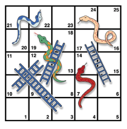

```{r, include = FALSE}
source("global_stuff.R")
```

# Practice problems {.unnumbered}

"8/27/2020 | Last Compiled: `r Sys.Date()`"

*This chapter is here as a supplement for students who are looking for exercises to work on coding skills outside of class.* The labs in this course are designed to develop practical data analysis skills in R, and conceptual knowledge about statistics by using R as a way to interact with statistical phenomena. I assume that students may be new to coding. Don't worry, if you are a student in this course, we will gradually introduce coding concepts throughout the course. 

Learning how to code takes time and effort, and can be intensely frustrating at the beginning. When I was learning programming for the first time as an undergraduate, my advisor (John Vokey) showed me a computer on a desk and told me this was where I would teach myself to program...then he pointed to a large hole in the drywall underneath the desk and said, "that is where you kick the wall".

Learning how to teach coding is also very hard. I've been trying to do this for years. However, when I stumble across methods that seem promising, and/or have been immensely helpful to me, I like to advertise them. For example a few years ago I came across a completely different approach to learning programming at the website [Project Euler](https://projecteuler.net), which I highly recommend. That website presents a series of problems, usually mathematical ones, like what is the sum of the first 1000 prime numbers? The challenge is to use any programming language to find the correct answer. When submit correct answers, you unlock a forum where other post their working code (in many different languages).

he idea of Project Euler is to learn basic programming skills by trying to solve concrete problems. You might not know the syntax for how to make the computer accomplish a particular goal that you have, but you have a particular goal in mind, so you use that in your search to figure out how to make a programming language do something.

The problems here are inspired by the Project Euler. In past classes I have sometimes assigned the problems with very little guidance about how to do anything in R, and then the class and I have sat around puzzling things out for a couple weeks. This time, I am listing the problems, along with some tips and videos, and eventually example code for all of the problems. Although some of these problems involve statistics, most of them do not. But, they are all intended to be concrete enough so that you know what the question is asking you to accomplish.

I think it is worthwhile to try and solve these problems yourself. At the same time, it can be really helpful to have example solutions when you get stuck. *P.S. my favorite problem is the snakes and ladders simulation, I think that if you can learn to solve that problem by yourself in R, you are well on your way to being able to solve all sorts of data-analysis problems, and if you give that problem a try and solve it, congrats, I think that's pretty impressive of you*.

## Programming Challenges I

What is the purpose of these problems, and why should you try to solve them? An important overarching goal in learning to code is to become justifiably confident in your ability to write scripts to solve problems. At the end of the day you will be applying your skills to new problems without textbook answers, and your ability to solve these problems rests in learning how to write new code that works. This is not an abstract problem, and instead requires practice with writing code to solve new problems. The following problem sets are designed primarily with this aim in mind. Solving these problems will simultaneously develop your ability to write scripts to solve new problems, as well as give you hands on exposure to learning the syntax of the R language. These problems are not written specifically for the R language, and the solving the same problems in another language is a useful strategy for learning the syntax of another language.

The problems are roughly ordered in terms of difficulty, with easier problems first and harder problems second. All of the problems can be solve by combining the foundational programming concepts already discussed. That is, they can be solved by declaring variables, using logic statements, and for loops to create algorithms that solve each problem. Some of the problems require writing functions, which is a more formal and general way of writing algorithms. Many of the problems can be solved very quickly and efficiently by writing only a few lines of code, and by using intrinsic functions already supplied by the R programming language. For each of the problems you might consider writing different solutions to explore different syntax options.

## Easier Problems

<div class="videoWrapper">  <iframe width="560" height="315" src="https://www.youtube.com/embed/50ElzpX7MOE" frameborder="0" allow="accelerometer; autoplay; encrypted-media; gyroscope; picture-in-picture" allowfullscreen></iframe> </div>

1.  Do simple math with numbers, addition, subtraction, multiplication, division
2.  Put numbers into variables, do simple math on the variables
3.  Write code that will place the numbers 1 to 100 separately into a variable using for loop. Then, again using the seq function.
4.  Find the sum of all the integer numbers from 1 to 100.
  - you can use the `sum()` function on a vector of numbers
  - How would you do this without using the sum function? For example, how could you use a for loop to accomplish this task?
5.  Write a function to find the sum of all integers between any two values.

```{r,eval=FALSE}
# syntax for writing a function

function_name <- function(input_name){
  #body where you modify input
  return(name_of_output)
}

# running the function
function_name(some_input)
```


6.  List all of the odd numbers from 1 to 100.
  - you could use the `seq()` function
  - How could you do this without using the `seq()` function? Consider using the mod function `%%`, which evaluates whether or not there is a remainder when dividing one number by another.
  
```{r}
# four divided by two gives no remainder
# the mod function shows 0
4%%2

# 5 divided by two gives a remainder
# the mod function shows 1
5%%2
```

7.  List all of the prime numbers from 1 to 1000.


<div class="videoWrapper">  <iframe width="560" height="315" src="https://www.youtube.com/embed/2k_K7rZezMU" frameborder="0" allow="accelerometer; autoplay; encrypted-media; gyroscope; picture-in-picture" allowfullscreen></iframe> </div>

8.  Generate 100 random numbers
  - check out the `runif` function
  - to look at the help file run `?runif` in the console. In general `?function_name` will show the help file for any function in R.
9.  Generate 100 random numbers within a specific range
  - `runif` can do this
10. Write your own functions to give descriptive statistics for a vector variable storing multiple numbers. Write functions for the following without using R intrinsics: mean, mode, median, range, standard deviation
  - It's ok to use `sum()` and `length()`
  - be creative and see if you can find multiple solutions. Here is an example for two ways to compute the mean.
  
```{r}
# using sum and length
mean_A <- function(x){
  return(sum(x)/length(x))
}

some_numbers <- c(1,2,3,4,5)
mean_A(some_numbers)

# no intrinsics
mean_B <- function(x){
  counter <- 0
  total_sum <-0
  for(i in x){
    total_sum <- total_sum+i
    counter<-counter+1
  }
  return(total_sum/counter)
}

mean_B(some_numbers)

```

  
11. Count the number of characters in a string variable
  - use `strsplit()` to split a character vector
```{r}
a <- "adskfjhkadsjfh"
strsplit(a,split="")

# note that strsplit returns its result in a list
b <-strsplit(a,split="")
b[[1]] # access all elements in list 1
b[[1]][1] # access first element of list 1

# lists can be unlisted
d <- unlist(strsplit(a,split=""))
d  # all elements in character vector
d[1] #first element

```

12. Count the number of words in a string variable
  - use `strsplit`
```{r}
a <- "this is a sentence"
strsplit(a,split=" ") # use a space as the splitting character
```

13. Count the number of sentences in a string variable
  - consider splitting by the `.` character
14. Count the number of times a specific character occurs in a string variable
  - `table()` function can help count individual occurences
```{r}
a <- c(1,3,2,3,2,3,2,3,4,5,4,3,4,3,4,5,6,7)
table(a)
```
  - How would you do this without the table function?
15. Do a logical test to see if one word is found within the text of another string variable.
  - For example given the word hello, can you run a test to see if it is contained in the test sentence?
```{r}
test_word <- "hello"
test_sentence <-"is the word hello in this sentence"
```
  
  - consider using `%in%`

```{r}
a <- c(1,2,3,4,5)
b <- 5
d <- 8

# question is b in a?
b%in%a

# is d in a?
d%in%a

```


16. Put the current computer time in milliseconds into a variable

```{r}
print(as.numeric(Sys.time())*1000, digits=15)
```


17. Measure how long a piece of code takes to run by measuring the time before the code is run, and after the code is run, and taking the difference to find the total time

18. Read a .txt file or .csv file into a variable
  - `scan()` is a general purpose text input function
  - `read.csv()` will read .csv files
19. Output the contents of a variable to a .txt file
  - `write.csv()`
20. Create a variable that stores a 20x20 matrix of random numbers
  - here's how you make a matrix full of 0s
```{r}
a <- matrix(0, ncol=20,nrow=20)
```

21. Output any matrix to a txt file using commas or tabs to separate column values, and new lines to separate row values
  - `write.csv()`

## Harder Problems

### FizzBuzz

List the numbers from 1 to 100 with the following constraints. If the number can be divided by three evenly, then print Fizz instead of the number. If the number can be divided by five evenly, then print Buzz instead of the number. Finally, if the number can be divided by three and five evenly, then print FizzBuzz instead of the number. The answer could look something like this:

```{block} 
1, 2, Fizz, 4, Buzz, Fizz, 7, 8, Fizz, Buzz, 11, Fizz, 13, 14, FizzBuzz, 16, 17, Fizz, 19, Buzz, Fizz, 22, 23, Fizz, Buzz, 26, Fizz, 28, 29, FizzBuzz, 31, 32, Fizz, 34, Buzz, Fizz, 37, 38, Fizz, Buzz, 41, Fizz, 43, 44, FizzBuzz, 46, 47, Fizz, 49, Buzz, Fizz, 52, 53, Fizz, Buzz, 56, Fizz, 58, 59, FizzBuzz, 61, 62, Fizz, 64, Buzz, Fizz, 67, 68, Fizz, Buzz, 71, Fizz, 73, 74, FizzBuzz, 76, 77, Fizz, 79, Buzz, Fizz, 82, 83, Fizz, Buzz, 86, Fizz, 88, 89, FizzBuzz, 91, 92, Fizz, 94, Buzz, Fizz, 97, 98, Fizz, Buzz
```

  - Here a few bits that might be useful
  
  
```{r}
# a number mod three will return 0 if it divides evenly
6%%3
# a number mod five will return 0 if it divides evenly
10%%5

# examples of replacing elements of a vector
a<-c(1,2,3,4,5)
a[3]<-"Fizz"
a

# notice that a starts as a numeric vector
# but changes to an all character vector after "Fizz" is added
```

### Frequency Counts

Take text as input, and be able to produce a table that shows the counts for each character in the text. This problem is related to the earlier easy problem asking you to count the number of times that a single letter appears in a text. The slightly harder problem is the more general version: count the frequencies of all unique characters in a text.

  - here's the easy way to do this
```{r}
a<-"some text that has some letters"
table(unlist(strsplit(a,split="")))
```
  - Can you do this without using table? Attempt this problem using `data.frame`. Here are some more tips

```{r}
# data.frame is data format that produces named columns of data

# creates two vectors
numbers <-c(1,2,3,4,5)
letters <-c("a","b","c","d","e")

# make a data.frame from two vectors
new_df <- data.frame(numbers,letters)
print(new_df)

# access individual columns of dataframe
new_df$numbers
new_df$letters

# get names of data.frame
names(new_df)

# break the problem into steps
# first part of problem is to identify all unique character in the string
a<-c(1,2,3,4,5,2,2,3,2,3)
unique(a)
b<-"a string with some letters"
unique(unlist(strsplit(b,split="")))

# second part is to go through each of the unique letters in the list of unique letters, and for each count the number of times they appear in the original text
# store the results in a data.frame with two columns, one with the letter names, and another with the counts


```


### Test the Random Number Generator

Test the random number generator for a flat distribution. Generate a few million random numbers between 0 and 100. Count the number of 0s, 1s, 2s, 3s, etc. all the way up to 100. Look at the counts for each of the numbers and determine if they are relatively equal. For example, you could plot the counts in Excel to make a histogram. If all of the bars are close to being flat, then each number had an equal chance of being selected, and the random number generator is working without bias.


```{r,eval=FALSE}
a<-runif(100,0,100)
hist(a)
```

### Create a multiplication table

Generate a matrix for a multiplication table. For example, the labels for the columns could be the numbers 1 to 10, and the labels for the rows could be the numbers 1 to 10. The contents of each of the cells in the matrix should be correct answer for multiplying the column value by the row value.

```{r}
# you can multiply all numbers in a vector in one go
a<-c(1,2,3,4,5,6,7,8,9,10)
a*2

# you can nest loops
for(i in 1:3){
  for(j in 1:3){
    print(i*j)
  }
}

```


### Encrypt and Decrypt the Alphabet

Turn any normal english text into an encrypted version of the text, and be able to turn any decrypted text back into normal english text. A simple encryption would be to scramble the alphabet such that each letter corresponds to a new randomly chosen (but unique) letter.
  - The following code shows an example using numbers
  
```{r}
original_sequence <- c(1,2,3,4,5,2,2,3,2,4,5,2)
numbers <- unique(original_sequence)
scrambled_numbers <- sample(numbers)
encryption_key <- data.frame(numbers,scrambled_numbers)

encrypt_numbers <-function(input_sequence,key){
  encrypted_sequence<-c()
  for(i in 1:length(input_sequence)){
    original_number <- input_sequence[i]
    new_number <- key[key$numbers==original_number,]$scrambled_numbers
    encrypted_sequence[i] <- new_number
  }
  return(encrypted_sequence)
}

encrypt_numbers(original_sequence,encryption_key)

```
  
  - here is a different approach making use of the `factor()` function
  
```{r}
original_sequence <- c(1,2,3,4,5,2,2,3,2,4,5,2)
original_sequence <- as.factor(original_sequence)
levels(original_sequence) # show names of levels in factor
new_sequence <- original_sequence # copy
levels(new_sequence)<-c(5,4,3,2,1) # rename the levels
new_sequence # all elements are now changed
```


### Snakes and Ladders

```{r 3snl, echo=FALSE,dev='png'}

```

Your task here is to write an algorithm that can simulate playing the above depicted Snakes and Ladders board. You should assume that each roll of the dice produces a random number between 1 and 6. After you are able to simulate one played game, you will then write a loop to simulate 1000 games, and estimate the average number of dice rolls needed to successfully complete the game.

```{r}
# rolling a dice with sample
sample(c(1,2,3,4,5,6),1)
sample(c(1,2,3,4,5,6),1)
sample(c(1,2,3,4,5,6),1)
```

  -tip: consider a simpler version of the problem. How many times do you need to roll a dice so that all of the dice rolls add up to 25 or greater?

```{r}

# try one simulation
total_sum<-0
number_of_rolls<-0
while(total_sum < 25){
  number_of_rolls <- number_of_rolls+1
  total_sum <-total_sum+sample(c(1,2,3,4,5,6),1)
}
number_of_rolls

# record the results from multiple simulations

save_rolls <- c()
for(sims in 1:100){
  total_sum<-0
  number_of_rolls<-0
  while(total_sum < 25){
    number_of_rolls <- number_of_rolls+1
    total_sum <-total_sum+sample(c(1,2,3,4,5,6),1)
  }
  save_rolls[sims] <- number_of_rolls
}
mean(save_rolls)

```
  
  - how do you add in a representaion of the board, so that you change which square the player is on depending on whether they land on a ladder or snake.


### Dice-rolling simulations

Assume that a pair of dice are rolled. Using monte carlo-simulation, compute the probabilities of rolling a 2, 3, 4, 5, 6, 7, 8, 9, 10, 11, and 12, respectively.

### Monte Hall problem

The monte-hall problem is as follows. A contestant in a game show is presented with three closed doors. They are told that a prize is behind one door, and two goats are behind the other two doors. They are asked to choose which door contains the prize. After making their choice the game show host opens one of the remaining two doors (not chosen by the contestant), and reveals a goat. There are now two door remaining. The contestant is asked if they would like to switch their choice to the other door, or keep their initial choice. The correct answer is that the participant should switch their initial choice, and choose the other door. This will increase their odds of winning. Demonstrate by monte-carlo simulation that the odds of winning is higher if the participant switches than if the participants keeps their original choice.

### 100 doors problem

Problem: You have 100 doors in a row that are all initially closed. You make 100 passes by the doors. The first time through, you visit every door and toggle the door (if the door is closed, you open it; if it is open, you close it). The second time you only visit every 2nd door (door 2, 4, 6, etc.). The third time, every 3rd door (door 3, 6, 9, etc.), etc, until you only visit the 100th door.

Question: What state are the doors in after the last pass? Which are open, which are closed?

### 99 Bottles of Beer Problem

In this puzzle, write code to print out the entire "99 bottles of beer on the wall"" song. For those who do not know the song, the lyrics follow this form:

X bottles of beer on the wall X bottles of beer Take one down, pass it around X-1 bottles of beer on the wall

Where X and X-1 are replaced by numbers of course, from 99 all the way down to 0.

### Random Tic-Tac-Toe

Imagine that two players make completely random choices when playing tic-tac-toe. Each game will either end in a draw or one of the two players will win. Create a monte-carlo simulation of this "random" version of tic-tac-toe. Out 10,000 simulations, what proportion of the time is the game won versus drawn?


