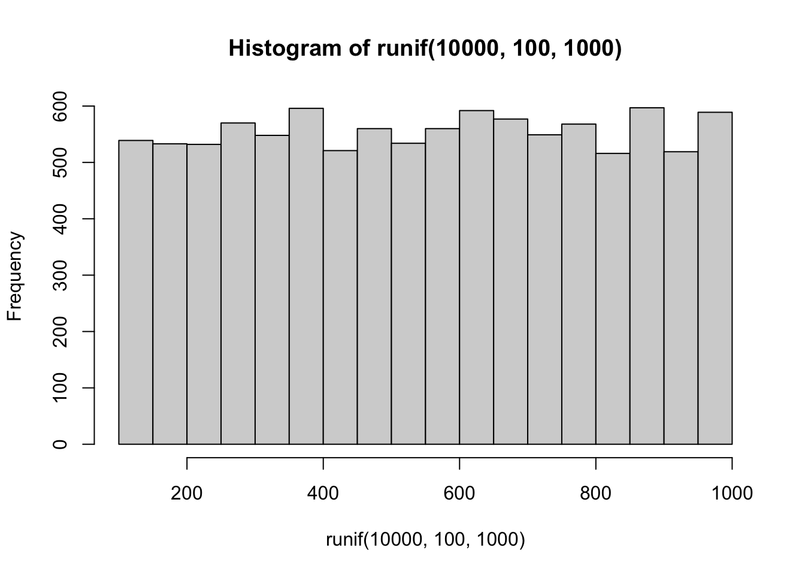
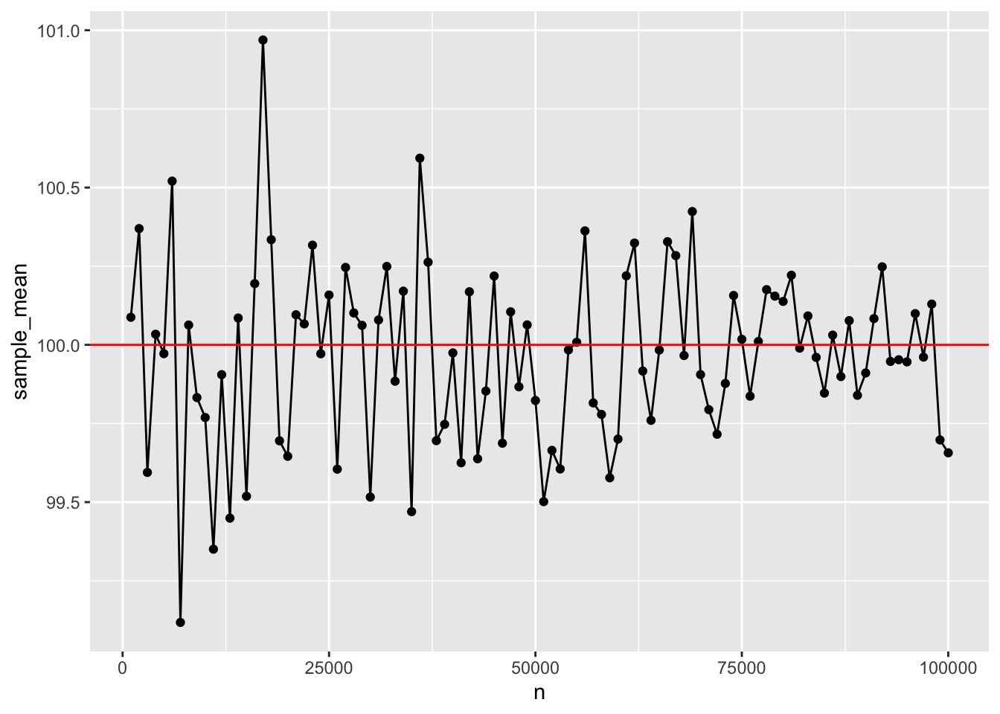
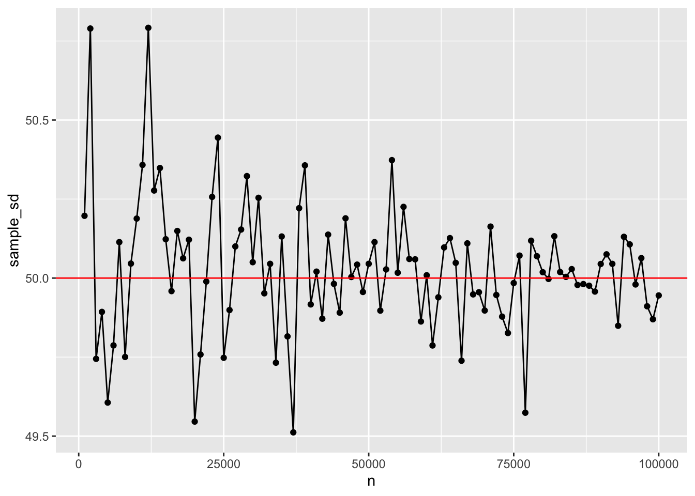

# Distributions I

"9/2/2020 | Last Compiled: 2020-12-14"

## Reading

@vokeyThinkingData7th2018, Chapters 5 & 6 on additional descriptive statistics, and recovering the distribution; and @abdiExperimentalDesignAnalysis2009, Appendices C & D.

## Overview

<div class="videoWrapper">  <iframe width="560" height="315" src="https://www.youtube.com/embed/YQC3QlRNHwI" frameborder="0" allow="accelerometer; autoplay; encrypted-media; gyroscope; picture-in-picture" allowfullscreen></iframe> </div>

We are about to spend three entire labs devoted to understanding and working with distributions. We will cover topics that closely relate to the main statistics lecture, but also take advantage of R to examine distributions in a more direct and hands manner that is not possible without a programming environment.

This lab has one practical section and two conceptual sections.

Practical I
  - Sampling from distributions in R

Conceptual I
  - Monte-Carlo simulation
  
In a research context data is collected in the form of measurements under various conditions. The data is a **sample**, representing only the outcomes that **did** happen. Generally, researchers recognize that there is **variability** in their measuring process, so the **sample data could have been different**. When analyzing data we are interested both in what did happen, and what could have happened in terms of the pattern of numbers. To really understand the issues at play, we need to take a deep dive into distributions and understand what happens when we take samples from them.
  
## Practical I: Sampling from distributions in R

### What is a distribution?

I will take an informal approach to defining distributions. We can think of a distribution as the place or machine controlling where numbers come from. In other words, distributions are number creation machines. We get to define them, and our choices determine the kinds of numbers that can be produced from a distribution.

More formally, a probability distribution defines the probabilities that particular numbers can be drawn or sampled from the distribution.

### Creating your own distributions in R with `sample()`

R has several built-in functions for sampling from common distributions (discussed later). Before we look at those, let's make our own using `sample()`.

Here is the input syntax for `sample(x, size, replace = FALSE, prob = NULL)`. `x` is a vector with one or more elements, `size` is how many samples to take from the elements in the vector, `replace` can be set to TRUE or FALSE (controlling whether sampling is done with or without replacement), and `prob` is a vector of probabilities controlling the probability of sampling each element in the vector `x`.

When we use sample, we can create discrete distributions and sample from them. By, default every element has an equal probability of being sampled.

1. Create a distribution with two equally possible numbers, sample from it twice:


```r
sample(x= 1:2, size = 2)
#> [1] 1 2
```

2. Create a distribution with two equally possible numbers, sample from it 10 times (note must set replace=TRUE, because we are sampling more items than exist in the vector):


```r
sample(x= 1:2, size = 10, replace = TRUE)
#>  [1] 1 2 2 2 1 1 1 1 2 1
```

3. Create a distribution with where the first number has a probability of 90% of being sampled, and the second number has a probability of 10% of being sampled, sample from it 10 times


```r
sample(x= 1:2, size = 10, replace = TRUE, prob=c(.9,.1))
#>  [1] 1 1 1 2 1 1 1 1 1 1
```

4. Create a distribution to model a coin flip for an unbiased coin, flip the coin 10 times, have the distribution return "heads" or "tails".


```r
sample(x = c("heads","tails"), size=10, replace= TRUE) 
#>  [1] "heads" "heads" "tails" "tails" "tails" "heads" "heads" "heads" "heads"
#> [10] "tails"
```

5. Create a distribution that has the numbers 1 to 1000, and allows them to be sampled with equal probability. Sample 10 numbers from this distribution without replacement (if you have sampled one number, you are not allowed to sample it again because it has been taken out):


```r
sample(x= 1:1000, size = 10, replace = FALSE)
#>  [1] 195 130 884 296 985 967 655 511 667 442
```

### Normal distribution

To sample random deviates from a normal distribution, use the `rnorm(n, mean = 0, sd = 1)` function. `n` is the number of observations to sample, `mean` is the mean of the normal distribution, and `sd` is the standard deviation of the normal distribution.

1. Two ways to sample 10 numbers from a normal distribution with mean = 0, and standard deviation = 1.


```r
rnorm(n= 10,mean = 0, sd = 1)
#>  [1]  0.7507135  1.2885156 -0.1181898 -0.3109193 -2.7237272  0.9839745
#>  [7] -0.4655029  0.2585130  1.0485176  0.9370757

rnorm(10,0,1)
#>  [1]  2.3865434  0.4312720 -0.4052384  1.1844978  1.6142325 -0.5250654
#>  [7] -1.0776366 -0.1900261 -0.9026587  0.3735507
```

2. Visualize the sample quickly with `hist()`


```r
my_sample <- rnorm(100,0,1)
hist(my_sample)
```


3. Visualize the sample with ggplot2 using `geom_histogram()`. A requirement here is that the sample data is formatted in a `data.frame` first. I create a data frame with 100 observations in a `sample_data` column, and I add a `sample` column which contains all 1s, to refer to the fact that all of the numbers in sample_data belong to sample #1.


```r
my_data <- data.frame(sample_data = rnorm(100,0,1),
                      sample = 1)

library(ggplot2)

ggplot(my_data, aes(x=sample_data))+
  geom_histogram()
```


4. Visualizing multiple samples with individual histograms with ggplot2. Let's say we want to sample 25 values from a normal distribution, but we want to repeat this process four times. We will have samples 1 to 4, each containing 25 observations. We also want to generate four histograms to quickly look at each of the four samples. We can do this by setting up our dataframe to represent this situation, and by using `facet_wrap()`.

Note: the use of the `rep()` function is new, it creates a vector that repeats the numbers from 1 to 4, 25 times each. This way, the first 25 rows in the dataframe represent the 25 observations in sample 1, the next 25 rows represent the observations in sample 2, and so on.


```r
my_data <- data.frame(sample_data = rnorm(100,0,1),
                      sample = rep(1:4, each=25))

ggplot(my_data, aes(x=sample_data))+
  geom_histogram()+
  facet_wrap(~sample)
```


### Uniform Distribution (rectangle distribution)

A uniform distribution is an equal probability distribution, where all numbers in between the smallest and largest have an equal probability of being sampled.

Use `runif(n, min = 0, max = 1)` to sample numbers from a uniform distribution. `n` is the number of observations, `min` is the starting minimum value, `max` is the largest value.

1. Sample and plot 1000 values from a uniform distribution between 0 and 1.


```r
hist(runif(1000,0,1))
```


2. Sample and plot 10000 values from a uniform distribution between 100 and 1000.


```r
hist(runif(10000,100,1000))
```



3. Take one sample of 100 numbers from a uniform distribution between 0 and 1. Then, for this one sample return a count of how many numbers are less than the value .05.


```r
my_sample <- runif(100,0,1)
length(my_sample[my_sample < .05])
#> [1] 5
```

### Other distributions

R contains many distributions to sample numbers from. The list can be found by `?distributions`. Here a few more examples:

Exponential distribution


```r
hist(rexp(1000,rate =2))
```


Binomial Distribution


```r
hist(rbinom(100,1,prob=c(.5,.5)))
```


Weibull distribution


```r
hist(rweibull(n=1000, shape=2, scale = 1))
```


### Other descriptive statistics

In Chapter 5, Vokey and Allen discuss skewness and kurtosis as additional descriptive statistics that describe the shapes of sets of numbers. Functions for skewness and kurtosis can be obtained in R by installing additional packages such as the `moments` packages.

1. Compute the mean, sd, skewness, and kurtosis for a sample of 1000 observations from a normal distribution:


```r
library(moments)
my_sample <- rnorm(1000,0,1)
mean(my_sample)
#> [1] -0.0416809
sd(my_sample)
#> [1] 1.001718
skewness(my_sample)
#> [1] -0.1607327
kurtosis(my_sample)
#> [1] 2.969609
hist(my_sample)
```


2. Compute the mean, sd, skewness, and kurtosis for a sample of 1000 observations from a right-skewed exponential distribution.


```r
my_sample <- rexp(1000,2)
mean(my_sample)
#> [1] 0.4883312
sd(my_sample)
#> [1] 0.4653218
skewness(my_sample)
#> [1] 1.752688
kurtosis(my_sample)
#> [1] 7.173032
hist(my_sample)
```


## Conceptual I: Monte carlo simulations

Many of the next conceptual sections in our labs will involve a process called Monte carlo simulation. In short, a Monte Carlo simulation is one where a sampling process is carried out hundreds or thousands of times in order to estimate how the sampling process behaves over the long run. Monte Carlo simulations can be conducted very easily in R, because we can write scripts to make R repeatedly sample things, and then we can measure and assess the samples we created.

Monte-carlo simulations can be used as a tool to demonstrate statistical facts and concepts, and we will take the opportunity to use this tool in many different ways throughout this course. The purpose of this conceptual section is to introduce you to running Monte-Carlo simulations, and show you that they can be done in different ways.

In general we will:

1. Simulate a repeated sampling process
2. Save what was sampled on each iteration
3. Sample as many times as we want (usually a few thousand)
4. Evaluate our simulation

And, most important, we will identify important statistical concepts and use monte-carlo simulations to demonstrate our understanding of these concepts. 

### Fair coin

A coin is fair if it comes up heads equally often as tails in the long run. Let's consider how we could use a simulation to demonstrate this idea. We need to 

1. Have a way to sample the outcomes of a binary variable
2. Take several samples
3. Look at if we get an equal number of "heads" or "tails" in the long run.

There is more than one way to use R to accomplish these goals. Here, we use the `sample` function, and sample 1s for heads, and 0s for tails. We also create a `for` loop, and repeat a sampling process 100 times. Each iteration we flip a coin, save the result, and calculate the proportion of heads and tails so far. We save everything in a data.frame, and plot the proportion of heads as we go from 1 to 100 flips. We should see the proportion get closer to .5 as we increase the number of flips.


```r
#initialize variables
flip <- c()
outcome <- c()
proportion_heads <- c()
proportion_tails <- c()

# run the simulation
for(i in 1:1000){
  flip[i] <- i
  outcome[i] <- sample(x = c(1,0), size = 1)
  proportion_heads[i] <- sum(outcome)/length(outcome)
  proportion_tails[i] <- 1-proportion_heads[i]
}

# create a dataframe with saved data
sim_data <- data.frame(flip,
                       outcome,
                       proportion_heads,
                       proportion_tails)

# plot the simulation results
ggplot(sim_data, aes(x=flip,y=proportion_heads))+
  geom_point()+
  geom_line()+
  geom_hline(yintercept=.5, color="red")
```


### Samples become the population as n increases

A fundamental concept in sampling is that samples of numbers become increasingly like their parent population (or distribution) as the size of the sample (n or number of observations in the sample) increases. Let's demonstrate an example of this phenomena.

Our parent population will be a normal distribution with mean =100, and sd = 50. We want to conduct a simulation that takes a sample across different ranges of n. Then for each sample, we will calculate a sample statistic such as the mean and standard deviation. These sample statistics should become closer and closer to the "true" parent distribution parameters as n increases.


```r
#initialize variables
n <- seq(1000,100000,1000)
sample_mean <- c()
sample_sd <- c()

#run simulation
for(i in 1:length(n)){
  sim_sample <- rnorm(n[i], mean = 100, sd = 50)
  sample_mean[i] <- mean(sim_sample)
  sample_sd[i] <- sd(sim_sample)
}

# organize results in dataframe
sim_data <- data.frame(n,
                       sample_mean,
                       sample_sd)

# graph results
ggplot(sim_data,aes(x=n,y=sample_mean))+
  geom_point()+
  geom_line()+
  geom_hline(yintercept=100, color="red")
```



```r

ggplot(sim_data,aes(x=n,y=sample_sd))+
  geom_point()+
  geom_line()+
  geom_hline(yintercept=50, color="red")
```



## Lab 3 Generalization Assignment

### Instructions

In general, labs will present a discussion of problems and issues with example code like above, and then students will be tasked with completing generalization assignments, showing that they can work with the concepts and tools independently. 

Your assignment instructions are the following:

1. Work inside the R project "StatsLab1" you have been using
2. Create a new R Markdown document called "Lab3.Rmd"
3. Use Lab3.Rmd to show your work attempting to solve the following generalization problems. Commit your work regularly so that it appears on your Github repository.
4. **For each problem, make a note about how much of the problem you believe you can solve independently without help**. For example, if you needed to watch the help video and are unable to solve the problem on your own without copying the answers, then your note would be 0. If you are confident you can complete the problem from scratch completely on your own, your note would be 100. It is OK to have all 0s or 100s anything in between. 
5. Submit your github repository link for Lab 3 on blackboard.
6. There are four problems to solve

<div class="videoWrapper">  <iframe width="560" height="315" src="https://www.youtube.com/embed/kvPVWdEWm6k" frameborder="0" allow="accelerometer; autoplay; encrypted-media; gyroscope; picture-in-picture" allowfullscreen></iframe> </div>

### Problems

1. Create five samples of 25 observations from a normal distribution with mean 200, and standard deviation 100. Compute the mean of each sample, and plot the means in a graph using ggplot2. (1 point)

2. Additionally calculate the standard deviation of each sample from above. Use the standard deviations for error bars, and produce another graph with the means along with error bars using ggplot2. (1 point)

---

The last two problems concern the concept of using a sample to estimate a property of the population or distribution the sample came from. For example, if we know the mean of a sample, can we be confident that the population has the same mean? If we were trying to guess at the population mean, what statistics from the sample should we use?

Some sample statistics are "biased", and may systematically under or overestimate a population parameter. Others are "unbiased", in this case the sample statistic tends to correctly estimate the population parameter over the long run.

3. Demonstrate that the sample mean across a range of n, is an unbiased estimator of the population mean using a monte-carlo simulation. (2 points).

- The population is a normal distribution with mean = 10, standard deviation = 5.
- Test a variety of n (sample size), including n = 2, 5, 10, 50, and 100
- For each sample size n, your task is to draw 10,000 samples of that size, then for each sample, calculate the sample mean. If the mean is unbiased, then we expect that "on average" the sample means will be the same as the population mean. To determine if this is true, compute the mean of the sample means that you produce to see if it is close to the population mean. 
- Show the mean of the sample means for each sample size.

4. Use a monte carlo simulation to compare the standard deviation formulas (divide by N vs N-1), and show that the N-1 formula is a better unbiased estimate of the population standard deviation, especially for small n. (2 points)

- Use the same normal distribution and samples sizes from above
- Rather than computing the mean for each sample, compute both forms of the standard deviation formula, including the sample standard deviation that divides by N-1, and the regular standard deviation that divides by N
- You should have 10,000 samples for each sample size, and 10,000 standard deviations for each the sample and regular standard deviation. Your task is to find the average of each, for each sample-size.
- Which of the standard deviations is more systematically biased? That is, which one is systematically worse at estimating the population standard deviation?
