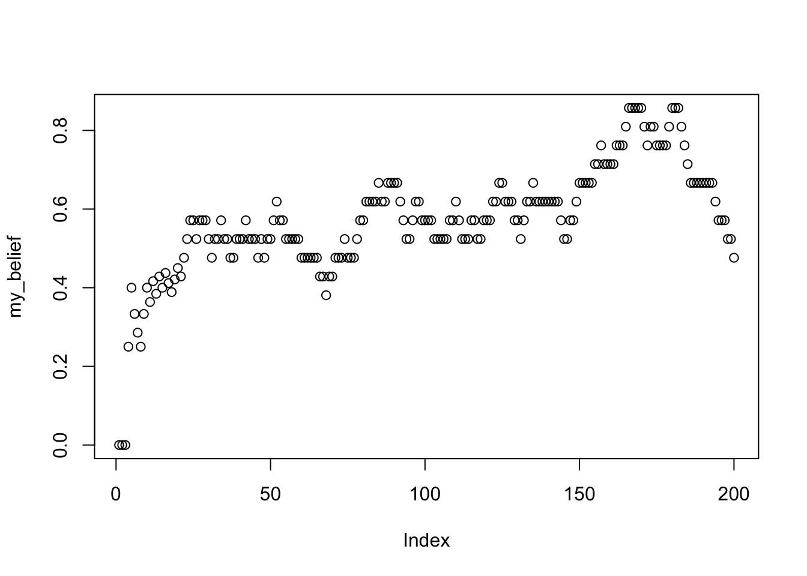

# Distributions II

"9/17/2020 | Last Compiled: 2020-12-14"

## Reading

@vokeyThinkingData7th2018, Chapter 16; @crumpAnsweringQuestionsData2018, [4.1 - 4.7](https://crumplab.github.io/statistics/probability-sampling-and-estimation.html#how-are-probability-and-statistics-different); @abdiExperimentalDesignAnalysis2009, Appendix C.

## Overview

In lecture you are learning about basic probability. In this lab we will continue to learn about working with distributions in R, and we will examine issues relating to basic probability.

We will look at three conceptual issues with probability, and gain practical skills in R for organizing and managing simulation data that will be useful for the rest of this course. In all of the examples we will generate events from particular distributions and examine them.

1. Concept I: Probabilistic event generation
2. Concept II: Experiencing probability
3. Concept III: Subjective Probability

<div class="videoWrapper">  <iframe width="560" height="315" src="https://www.youtube.com/embed/h4EvG2e65O8" frameborder="0" allow="accelerometer; autoplay; clipboard-write; encrypted-media; gyroscope; picture-in-picture" allowfullscreen></iframe> </div>

## Concept I: Probabilisitic event generation

In this concept section we will use R to generate events with specified probabilities. We will mainly use the `sample()` function, which we are already familiar with. This concept section explores probabilistic event generation in a few different ways by examining a few probability problems:

### Dice Problems

1. Use R to roll a fair six-sided die, and show that each number comes up equally frequently in the long run. Roll the die 10,000 times, report how many times each number (1-6) was rolled.

Each number should come up about 10000/6 = 1666.667 times.


```r
rolls <- sample(1:6,1000, replace=TRUE)
table(rolls)
#> rolls
#>   1   2   3   4   5   6 
#> 185 158 155 163 164 175
```

2. With a pair of six-sided dice it is possible to roll the numbers 2 to 12. Use a simulation of 10000 rolls (of a pair of dice) in R to calculate the probability of rolling each of the possible numbers.


```r
one <- sample(1:6,1000, replace=TRUE)
two <- sample(1:6,1000, replace=TRUE)
combined <- one+two
table(combined)/1000
#> combined
#>     2     3     4     5     6     7     8     9    10    11    12 
#> 0.025 0.058 0.084 0.086 0.137 0.180 0.155 0.109 0.081 0.060 0.025
```
Let's compare the result of the simulation to the known probabilities. First, we need to determine the number of ways that each number can be obtained by rolling a pair of dice. We can use R to do this as well:


```r
first <- rep(x= 1:6, each = 6)
second <- rep(x= 1:6, times = 6)
sum_rolls <- first+second
table(sum_rolls)/length(sum_rolls)
#> sum_rolls
#>          2          3          4          5          6          7          8 
#> 0.02777778 0.05555556 0.08333333 0.11111111 0.13888889 0.16666667 0.13888889 
#>          9         10         11         12 
#> 0.11111111 0.08333333 0.05555556 0.02777778

## compare
sim_result <- table(combined)/1000
true_probs <- table(sum_rolls)/length(sum_rolls)

## Difference
true_probs-sim_result
#> sum_rolls
#>             2             3             4             5             6 
#>  0.0027777778 -0.0024444444 -0.0006666667  0.0251111111  0.0018888889 
#>             7             8             9            10            11 
#> -0.0133333333 -0.0161111111  0.0021111111  0.0023333333 -0.0044444444 
#>            12 
#>  0.0027777778
```
### Event generators

Remember that you can use `sample()` to generate events with specific probabilities:

1. Generate P("A") = .8, and P("B") =.2, run the generator 20 times.


```r
sample(c("A","B"), 20, replace = TRUE, prob = c(.8, .2))
#>  [1] "A" "A" "B" "A" "A" "A" "A" "A" "A" "B" "A" "A" "A" "A" "A" "A" "A" "A" "B"
#> [20] "A"
```

2. Generate letters from the alphabet such that each letter could occur with equal probability. Generate 50 letters:

Note, conveniently, R contains a variable called `letters`, that is a vector of lowercase letters (and an uppercase one called LETTERS)


```r
letters
#>  [1] "a" "b" "c" "d" "e" "f" "g" "h" "i" "j" "k" "l" "m" "n" "o" "p" "q" "r" "s"
#> [20] "t" "u" "v" "w" "x" "y" "z"

LETTERS
#>  [1] "A" "B" "C" "D" "E" "F" "G" "H" "I" "J" "K" "L" "M" "N" "O" "P" "Q" "R" "S"
#> [20] "T" "U" "V" "W" "X" "Y" "Z"
```


```r
sample(letters,50,replace=TRUE)
#>  [1] "r" "d" "m" "g" "p" "k" "q" "o" "d" "k" "v" "d" "y" "x" "g" "u" "f" "j" "d"
#> [20] "z" "z" "t" "h" "f" "c" "g" "j" "m" "g" "e" "q" "p" "o" "m" "v" "l" "r" "u"
#> [39] "f" "h" "s" "k" "w" "l" "q" "s" "z" "w" "w" "k"
```

3. Create a random string generator that creates strings of random letters. For example a string of 5 random letters could look like "fjwud". Generate 50 random letter strings, each with 5 random letters in it.


```r
my_letters <- sample(letters,50*5,replace=TRUE)

# turn the vector into a matrix with 5 columns
my_strings <- matrix(my_letters, ncol=5)

# each row is a word, need to collapse the column to create a string
paste(my_strings[1,], collapse="")
#> [1] "deqpd"

# loop to collapse all of the rows into words
random_strings <-c()
for(i in 1:dim(my_strings)[1]){
  random_strings[i] <- paste(my_strings[i,], collapse="")
}

random_strings
#>  [1] "deqpd" "zrrfj" "ghaoj" "xwemf" "qxtvu" "pygmr" "hbqka" "vhzoi" "zwvfd"
#> [10] "atlqy" "fcbjy" "xrdms" "quqgb" "uuxrw" "svlao" "ojtcr" "pbxzn" "yshvl"
#> [19] "oxynn" "aygqi" "bsrau" "xruqy" "rukxd" "jztop" "cjhiu" "bpgtx" "egwbs"
#> [28] "eqeol" "upswv" "cndnz" "ttpvw" "gylcw" "jrekt" "hbono" "xevpm" "pqivb"
#> [37] "tlhtk" "oblzq" "sarqw" "lpjfh" "kgauv" "zvgcy" "vyzfv" "qtwwj" "gisgy"
#> [46] "jwtfv" "hgsgi" "bepid" "lhvjj" "zpnzv"
```

## Concept II: Experiencing probability

People talk about probabilities all of the time. For example, tomorrow might have a 10% chance of rain, and a fair coin has a 50% chance of landing heads or tails, are both common examples. We have already begun to look at how probabilities behave in lab 3, when [we used R to flip a coin to demonstrate that a coin is fair in the long run](https://crumplab.github.io/psyc7709Lab/articles/Lab3_Distributions_I.html#fair-coin-1). We expand on that demonstration here.

One takeaway point from the coin flipping example is that P(heads) = .5 (probability of getting a heads equals 50%), is only true "in the long run". In the short run, you could get a bunch of tails.

### Short-run coin flipping

1. Consider flipping a fair coin ten times. What are the possible outcomes? And what is the probability of each of the outcomes? Let's answer this question with a simulation in R.

Some of the possible outcomes are 10 Tails or 10 Heads, or any combination of heads and tails in between, which can be described as 0 heads to 10 heads.


```r
sim_results <- replicate(10000,
                         sample( c(1,0), 10, replace=TRUE)
                         )
number_of_heads <- colSums(sim_results)
table(number_of_heads)/10000
#> number_of_heads
#>      0      1      2      3      4      5      6      7      8      9     10 
#> 0.0007 0.0096 0.0423 0.1208 0.2032 0.2453 0.2100 0.1143 0.0428 0.0100 0.0010

# alternative solution using rbinom

number_of_heads <- rbinom(10000,10,prob=.5)
table(number_of_heads)/10000
#> number_of_heads
#>      0      1      2      3      4      5      6      7      8      9     10 
#> 0.0007 0.0102 0.0458 0.1115 0.2045 0.2480 0.2119 0.1142 0.0428 0.0089 0.0015
```
2. If you flipped a coin 10000 times, you would find many different kinds of short-run sequences. For example, HH, HT, TH, and TT. What is the probability of each of these kinds of sequences?


```r
flips <- sample(c("H","T"), 10000, replace=TRUE)

sequence <- c()
for(i in 2:length(flips)){
  first_element <- flips[i-1]
  second_element <- flips[i]
  sequence[i-1] <- paste0(first_element,second_element)
}

table(sequence)/sum(table(sequence))
#> sequence
#>        HH        HT        TH        TT 
#> 0.2499250 0.2528253 0.2528253 0.2444244

## 3 element sequences

flips <- sample(c("H","T"), 10000, replace=TRUE)

sequence <- c()
for(i in 3:length(flips)){
  first_element <- flips[i-2]
  second_element <- flips[i-1]
  third_element <- flips[i]
  sequence[i-1] <- paste0(first_element,
                          second_element,
                          third_element)
}

table(sequence)/sum(table(sequence))
#> sequence
#>       HHH       HHT       HTH       HTT       THH       THT       TTH       TTT 
#> 0.1297259 0.1245249 0.1236247 0.1263253 0.1246249 0.1254251 0.1263253 0.1194239
```

## Concept III: Subjective Probability

Vokey & Allen discuss the Bayesian concept of subjective probability, which is the practice of assigning probabilities to beliefs, and updating probabilities about the belief through a data-gathering process.

In this concept section we use R to demonstrate a basic example of belief updating.

First, we create a sequence of events. We will stick with coin flips. Let's create a situation where event probability changes at some point, and our task will be to collect data and determine if we can update our beliefs about the world.

So, we will flip a fair coin 100 times, and then flip a biased coin 100 times. The biased coin will be more likely to come up heads (60%).


```r
simulated_sequence <- c(rbinom(100,1,.5),
                        rbinom(100,1,.6))
```

Next, imagine that you have no idea what kind of coins were being flipped, and all you have is the sequence of flips. You start at the first coin flip, and go through all of them, each time you will use the data to update your belief about the coin.


```r
my_knowledge <- c()
my_belief <- c()
for(i in 1:length(simulated_sequence)){
  
    my_knowledge[i] <- simulated_sequence[i]
    my_belief[i] <- sum(my_knowledge)/length(my_knowledge)
    
}

plot(my_belief)
```


What do your beliefs about the probability of getting heads look like if you only allow yourself to remember the last 20 coin flips?

When would you be confident you had the correct belief about the probability of getting a heads?


```r

simulated_sequence <- c(rbinom(100,1,.5),
                        rbinom(100,1,.6))

my_knowledge <- c()
my_belief <- c()
for(i in 1:length(simulated_sequence)){
  
    my_knowledge[i] <- simulated_sequence[i]
    if(i <= 20){
      my_belief[i] <- sum(my_knowledge)/length(my_knowledge)
    }else{
      my_belief[i] <- sum(my_knowledge[i:(i-20)])/length(my_knowledge[i:(i-20)])
    }
    
}

plot(my_belief)
```




## Lab 4 Generalization Assignment

### Instructions

In general, labs will present a discussion of problems and issues with example code like above, and then students will be tasked with completing generalization assignments, showing that they can work with the concepts and tools independently. 

Your assignment instructions are the following:

1. Work inside the R project "StatsLab1" you have been using
2. Create a new R Markdown document called "Lab4.Rmd"
3. Use Lab4.Rmd to show your work attempting to solve the following generalization problems. Commit your work regularly so that it appears on your Github repository.
4. **For each problem, make a note about how much of the problem you believe you can solve independently without help**. For example, if you needed to watch the help video and are unable to solve the problem on your own without copying the answers, then your note would be 0. If you are confident you can complete the problem from scratch completely on your own, your note would be 100. It is OK to have all 0s or 100s anything in between. 
5. Submit your github repository link for Lab 4 on blackboard.
6. There are five problems to solve

<div class="videoWrapper">  <iframe width="560" height="315" src="https://www.youtube.com/embed/cT27lOvn4qk" frameborder="0" allow="accelerometer; autoplay; clipboard-write; encrypted-media; gyroscope; picture-in-picture" allowfullscreen></iframe> </div>


### Problems

1. Estimate the letter occurrence probabilities of all 26 letters in English by measuring a paragraph of English text from wikipedia. (hint use `strsplit()` to split a paragraph into individual letters) (1 point).


```r
my_paragraph <- "This is a paragraph, with some stuff in it. This is another sentence in the paragraph"
the_letters <- unlist(strsplit(my_paragraph, split=""))
the_letters
#>  [1] "T" "h" "i" "s" " " "i" "s" " " "a" " " "p" "a" "r" "a" "g" "r" "a" "p" "h"
#> [20] "," " " "w" "i" "t" "h" " " "s" "o" "m" "e" " " "s" "t" "u" "f" "f" " " "i"
#> [39] "n" " " "i" "t" "." " " "T" "h" "i" "s" " " "i" "s" " " "a" "n" "o" "t" "h"
#> [58] "e" "r" " " "s" "e" "n" "t" "e" "n" "c" "e" " " "i" "n" " " "t" "h" "e" " "
#> [77] "p" "a" "r" "a" "g" "r" "a" "p" "h"
```


2. Generate "random" strings of letters that are sampled from a distribution where letter occurrence probability is the same as natural English. Use the probabilities for each letter from this [wikipedia article](https://en.wikipedia.org/wiki/Letter_frequency), or use your own estimates from the previous question (2 points).

3. Generate a random walk of 10,000 steps. In a random walk, you are simulating the process of randomly taking a step up or down, as if you are on an infinite staircase. At each step you flip a coin. If you get heads you go up one step, if you get tails you go down one step. Start on step 0, then simulate a random walk for 10,000 steps. Your vector should preserve the step number for each step. For example, if the the first three steps were all heads, then the vector would begin with 0,1,2,3, which indicates a single step up each time. Plot the first 1,000 steps. (1 point)

4. What was the most positive and most negative step reached out of 10,000? (1 point)

5. What was the longest run of steps where all steps were positive numbers. For example, in the sequence: 1,2,3,2,1,0,-1,-2,-1,-2,-1,0,1,2,3; the answer is 5 because the first five values were all positive, and this was the longest sequence of positive values. (1 point).
