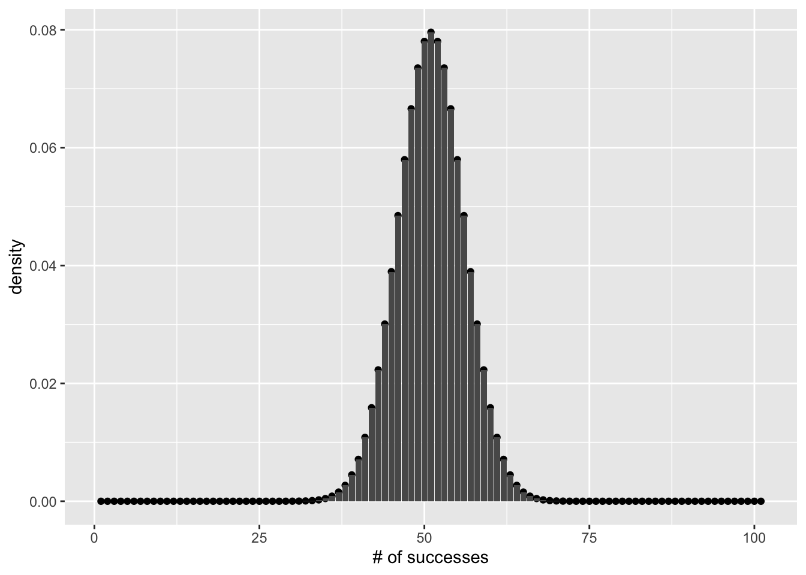

# Binomial Test

"10/8/2020 | Last Compiled: 2020-12-14"

>Extraordinary claims require extraordinary evidence (ECREE) -  Carl Sagan

## Readings

@vokeyThinkingData7th2018, Chapter 11; @abdiExperimentalDesignAnalysis2009, appendix D and E on the binomial test.

<div class="videoWrapper">  <iframe width="560" height="315" src="https://www.youtube.com/embed/MNzuV0x5x1w" frameborder="0" allow="accelerometer; autoplay; clipboard-write; encrypted-media; gyroscope; picture-in-picture" allowfullscreen></iframe> </div>

Imagine a wise pigeon that you can ask any Yes or No question. You ask the question. The pigeon responds by pecking Yes or No. How many answers would the pigeon need to get correct in row before you were willing to believe the pigeon knew the correct answer to every question?

If someone claimed that they had a magical and wise pigeon that knew the answer to every Yes or No question, how would you put it to the test? How many questions would you ask, when would you would be satisfied that the extraordinary claim was TRUE or FALSE?

We can consider these kinds of questions from the perspective of a binomial test. And, as it happens, binomial tests are often used on pigeons in real research. For example, pigeons are excellent at classifying visual patterns into different categories, and binomial tests are often used as a part of the process of establishing that a pigeon actually possesses some visual skill/ability to make the discrimination, and is not simply getting lucky.

## Overview

1. Practical I: Conducting a binomial test in R
2. Concepts I: Binomial model foundations
3. Concepts II: Task design and binomial models

## Practical I: Conducting a binomial test in R

We have already conducted binomial tests in R in previous labs when we discussed coin flipping examples. However, we did not use the language of a binomial test. In this practical example, we go over a couple different ways to conduct a binomial test in R.

### Classification performance example

Binomial tests are commonly used in situations where a researcher wants to know whether or not a subject was guessing, or truly was able to perform some task. For example, in comparative cognition, a pigeon researcher might ask whether a pigeon can discriminate between different classes of visual stimuli, such as red vs. green, or circles vs. squares, or buildings vs. trees. 

Imagine a pigeon was given a 2AFC task (two-alternative forced-choice task) to discriminate between pictures of circular shapes and angular shapes. On each trial the pigeon is shown two pictures, one circular and one angular. They are rewarded when they correctly peck on the circular shape.

Pigeon A received 100 trials, and pecked the correct circular shape on 65% of the trials. We can conduct and report a binomial test as follows, using the `binom.test()` function.


```r
?binom.test
binom.test(x = 65,
           n = 100,
           p = .5,
           alternative='greater')
#> 
#> 	Exact binomial test
#> 
#> data:  65 and 100
#> number of successes = 65, number of trials = 100, p-value = 0.001759
#> alternative hypothesis: true probability of success is greater than 0.5
#> 95 percent confidence interval:
#>  0.5639164 1.0000000
#> sample estimates:
#> probability of success 
#>                   0.65
```
A researcher might report the results of a binomial test this way:

Pigeon A was 65% correct (p < .05, binomial test). 

Pigeon A was 65% (p <= .0018, binomial test).

It is also possible to embed the results of a binomial test into the text of an .Rmd document. First, save the results to a variable:


```r
test_results <- binom.test(x = 65,
           n = 100,
           p =.5,
           alternative='greater')

test_results$p.value
#> [1] 0.001758821

# values can embedded using `r test_results$p.value`
```

So, it is now possible to write:


Pigeon A was 65% correct (p <= 0.0017588)

### Examining the report:

```
Exact binomial test

data:  65 and 100
number of successes = 65, number of trials = 100,
p-value = 0.001759
alternative hypothesis: true probability of success is greater than 0.5
95 percent confidence interval:
 0.5639164 1.0000000
sample estimates:
probability of success 
                  0.65 
```

The `binom.test()` function returns a printout of some of your inputs (number of successes, number of trials), and most importantly, returns a p-value. The **p-value** refers to probability. However, the precise meaning of the p-value depends on the `alternative = c("two.sided", "less", "greater")` input. 

We will focus on the "less", or "greater" options, because the "two.sided" is more contentious (and there are multiple interpretations of how/whether two-sided tests should be done).

For now, we will also ignore the alternative hypothesis and confidence interval sections. In my view neither of these outputs are a part of the binomial test.

### What can we conclude?

In our example, I chose `alternative= "greater"`, and we found that the p-value was 0.001759. What does this mean?

Officially, the probability that a 50/50 binomial process could produce 65 or more successes out of 100 by chance is p = .001759. More specifically, the 50/50 binomial process is one where there is 50% chance of a success, and a 50% chance of a failure. This is just like the coin flipping examples, except we are using success and failure as the two possible outcomes instead of heads or tails. 

### What does this have to do with the pigeon

Remember the research example. A pigeon chose the correct shape 65/100 times. What can we say about the pigeon? Does it have the ability to classify circular shapes from angular shapes? When we "answer" this question with a binomial test, we are using a "compared to what" strategy. Clearly the pigeon is not perfectly good at the discrimination, otherwise the pigeon would have got 100%. How about compared to chance? 

What is chance here? Imagine if we removed the pigeon entirely, and replaced the pigeon with a coin. On each trial we flip a coin to choose one of the two shapes. Clearly, the coin "knows nothing about shapes", and all of the coins "choices" would be "random guesses". What is a coin flip capable of doing? Could a coin get 65/100 correct?

The binomial test tells us something about what the coin could have done. The answer is not about the pigeon. We learned that the binomial process (the coin), is capable of producing 65/100 or greater with only a very small probability (.001759). 

### Facts and Inferences

In our example we have a few facts. The pigeon got 65/100 correct. A coin-flipping process could get 65 or more heads out of 100 with a small probability of .001759.

After the facts, you could engage in inferences by attempting to relate the behavior of the pigeon to the coin. For example, I would say that it is very unlikely that the 65% correct could be explained by chance. This gives me some confidence that pigeon wasn't just guessing. Just guessing wouldn't do as well as the pigeon very often. If this is all the information I had to go on, I would probably also bet the pigeon would have a similar level of performance, or do even better if was given another 100 trials. 

## Concepts I: Binomial model foundations

Although we can use the `binom.test()` function to conduct a binomial test, we can also use the family of binom functions that we have already come across occasionally. 

For example, if there are 100 trials, there are a limited number of possible outcomes. There could be 0 successes all the way to 100 successes. That's it. If we model this in terms of 50% for a success/failure, then this histogram shows the binomial distribution for this situation:


```r
library(ggplot2)
qplot(y=dbinom(0:100,100,.5))+
  geom_bar(stat='identity',position="dodge")+
  ylab('density')+
  xlab('# of successes')
```


Remember two things. First, this is a discrete probability distribution. Each of the number of successes is an integer, you can't have 5.5 successes. Also, each of the successes is associated with a particular probability. The area under the curve should sum to 1, reflecting the fact that there is a 100% chance that one of the outcomes will occur:


```r
sum(dbinom(0:100,100,.5))
#> [1] 1
```

To return to our example, what is the probability of getting 65 or more successes? 


```r
sum(dbinom(65:100,100,.5))
#> [1] 0.001758821
```

This is the same probability that `binom.test()` returned.

### The test and the model

A binomial test is often conducted to make inferences about a data point. So, for example, you flipped a coin 10 times and got 7 heads out of 10. The binomial test is:


```r
sum(dbinom(7:10,10,.5))
#> [1] 0.171875
```

which, is the same as the p-value in:


```r
binom.test(x=7,n=10,alternative="greater")
#> 
#> 	Exact binomial test
#> 
#> data:  7 and 10
#> number of successes = 7, number of trials = 10, p-value = 0.1719
#> alternative hypothesis: true probability of success is greater than 0.5
#> 95 percent confidence interval:
#>  0.3933758 1.0000000
#> sample estimates:
#> probability of success 
#>                    0.7
```
It is worth recognizing that the above example only scratches the surface of the full binomial model. For example, there are 11 possible outcomes, 0 heads to all 10 heads. Each of the outcomes has it's own probability. Here is a table that shows all of the probabilities for all of the possible outcomes:


```r
coin_flips <- data.frame( number_of_heads = 0:10,
                          probability = dbinom(x=0:10,size=10,prob= .5),
                          cumulative = pbinom(0:10, size = 10, prob = .5),
                          rev_cumulative = pbinom(-1:9, 10, .5, lower.tail=FALSE))
knitr::kable(coin_flips)
```


| number_of_heads| probability| cumulative| rev_cumulative|
|---------------:|-----------:|----------:|--------------:|
|               0|   0.0009766|  0.0009766|      1.0000000|
|               1|   0.0097656|  0.0107422|      0.9990234|
|               2|   0.0439453|  0.0546875|      0.9892578|
|               3|   0.1171875|  0.1718750|      0.9453125|
|               4|   0.2050781|  0.3769531|      0.8281250|
|               5|   0.2460938|  0.6230469|      0.6230469|
|               6|   0.2050781|  0.8281250|      0.3769531|
|               7|   0.1171875|  0.9453125|      0.1718750|
|               8|   0.0439453|  0.9892578|      0.0546875|
|               9|   0.0097656|  0.9990234|      0.0107422|
|              10|   0.0009766|  1.0000000|      0.0009766|

We consider the value of thinking about the full model in the next section.

## Concepts II: Task design and binomial models

Consider this. If it is appropriate to conduct a binomial test, then the situation under consideration can be described by a binomial process. In other words, it is possible to describe all of the possible outcomes of the experiment before conducting it.

For example, in the pigeon experiment, there were 100 trials. Each trial involved a decision that was correct or incorrect. So, there are only 101 total possible outcomes (0/100 to 100/100 correct). **The possibilities are defined by the design of the task**. If there were only 10 trials in the experiment, there would only be 11 possible outcomes.

Why does this matter? The relationship between task design and statistical model can greatly influence the kinds of inferences that a researcher would be comfortable making about the data. And, recognizing this connection allows a researcher to **design the experiment to allow strong inferences in the first place**.

For example, I showed a pigeon a truck and a car and told it to peck on the truck. It correctly pecked the truck. This was a 1 trial experiment, with a 50% chance of being correct. Should I claim that my pigeon can tell the difference between cars and trucks based on this evidence? After all, it was 100% correct. 

My point is 100% correct is not good enough evidence when there is only 1 trial to the experiment. It is obvious that chance will get 100% correct 50% of the time, so the pigeon could have easily been "guessing".

If the pigeon correctly chose the truck 100% of the time over 10 different choices, I would start to think maybe the pigeon "knows" something. This is because I know it would be more unlikely to get "10-in-a-row" by chance. 

### Setting task parameters

There are costs and benefits to changing task design. Some costs could include a longer experiment that takes more time and resources to run. Some benefits include being more confident that you are measuring "non-chance" phenomena.

If you were designing a task to evaluate a subject making correct or incorrect decisions, how many trials would you want to have in your experiment? Here are some possibilities:


```r
# 1 trial
task_designs <- data.frame( number_of_heads = 0:1,
                          probability = dbinom(x=0:1,size=1,prob= .5),
                          cumulative = pbinom(0:1, size = 1, prob = .5),
                          rev_cumulative = pbinom(-1:0, 1, .5, lower.tail=FALSE))
knitr::kable(task_designs)
```


| number_of_heads| probability| cumulative| rev_cumulative|
|---------------:|-----------:|----------:|--------------:|
|               0|         0.5|        0.5|            1.0|
|               1|         0.5|        1.0|            0.5|

```r

# 2 trials
task_designs <- data.frame( number_of_heads = 0:2,
                          probability = dbinom(x=0:2,size=2,prob= .5),
                          cumulative = pbinom(0:2, size = 2, prob = .5),
                          rev_cumulative = pbinom(-1:1, 2, .5, lower.tail=FALSE))
knitr::kable(task_designs)
```


| number_of_heads| probability| cumulative| rev_cumulative|
|---------------:|-----------:|----------:|--------------:|
|               0|        0.25|       0.25|           1.00|
|               1|        0.50|       0.75|           0.75|
|               2|        0.25|       1.00|           0.25|

```r

# 3 trials
task_designs <- data.frame( number_of_heads = 0:3,
                          probability = dbinom(x=0:3,size=3,prob= .5),
                          cumulative = pbinom(0:3, size = 3, prob = .5),
                          rev_cumulative = pbinom(-1:2, 2, .5, lower.tail=FALSE))
knitr::kable(task_designs)
```


| number_of_heads| probability| cumulative| rev_cumulative|
|---------------:|-----------:|----------:|--------------:|
|               0|       0.125|      0.125|           1.00|
|               1|       0.375|      0.500|           0.75|
|               2|       0.375|      0.875|           0.25|
|               3|       0.125|      1.000|           0.00|

```r

# etc...
```

I could keep listing more tables and increasing the number of trials by 1 each time. And, each time I would generate another binomial model. Each of these tables represent all of the possible outcomes in each of the different designs, as well as the probabilities that each of the outcomes would occur by chance. The general rule of thumb is that as the number of trials increase, the range of possible outcomes by chance narrows toward 50% successes and 50% failures.

Consider a value that is very close to 50%, like 51%. If you found a participant performed at 51% you might want to say that level of performance could easily have been obtained by chance. However, that inference strongly depends on the number of trials.

For example, if there are 100 trials, then the probability of getting 51% correct or greater are pretty good.


```r
binom.test(51,100,.5,alternative="greater")
#> 
#> 	Exact binomial test
#> 
#> data:  51 and 100
#> number of successes = 51, number of trials = 100, p-value = 0.4602
#> alternative hypothesis: true probability of success is greater than 0.5
#> 95 percent confidence interval:
#>  0.4234107 1.0000000
#> sample estimates:
#> probability of success 
#>                   0.51
```

However, if there are 1000 trials...


```r
binom.test(510,1000,.5,alternative="greater")
#> 
#> 	Exact binomial test
#> 
#> data:  510 and 1000
#> number of successes = 510, number of trials = 1000, p-value = 0.274
#> alternative hypothesis: true probability of success is greater than 0.5
#> 95 percent confidence interval:
#>  0.4835011 1.0000000
#> sample estimates:
#> probability of success 
#>                   0.51
```
And if there are 10,000 trials...


```r
binom.test(5100,10000,.5,alternative="greater")
#> 
#> 	Exact binomial test
#> 
#> data:  5100 and 10000
#> number of successes = 5100, number of trials = 10000, p-value = 0.02329
#> alternative hypothesis: true probability of success is greater than 0.5
#> 95 percent confidence interval:
#>  0.501726 1.000000
#> sample estimates:
#> probability of success 
#>                   0.51
```


<!-- A binomial test is often used to reject the possibility that a data pattern could be explained by a binomial process. In human studies, it is worth pointing out that it is -->


<!-- However, the use of binomial tests for inference, especially in human studies involving choice behavior is questionable. For example, a binomial process has several formal properties, such as independence. Each coin flip in the model is completely independent. However, several studies have shown that people are not very good at generating random sequences--their choices are not independent. So, if we believe that people are not very good at being random like a binomial process, why would we ever care to test the probability that a binomial process could explain human data? We already have very good reasons for rejecting a binomial model in the first place. -->

## Lab 7 Generalization Assignment

<div class="videoWrapper">  <iframe width="560" height="315" src="https://www.youtube.com/embed/4SAWdBVgy18" frameborder="0" allow="accelerometer; autoplay; clipboard-write; encrypted-media; gyroscope; picture-in-picture" allowfullscreen></iframe> </div>

### Instructions

In general, labs will present a discussion of problems and issues with example code like above, and then students will be tasked with completing generalization assignments, showing that they can work with the concepts and tools independently. 

Your assignment instructions are the following:

1. Work inside the R project "StatsLab1" you have been using
2. Create a new R Markdown document called "Lab7.Rmd"
3. Use Lab7.Rmd to show your work attempting to solve the following generalization problems. Commit your work regularly so that it appears on your Github repository.
4. **For each problem, make a note about how much of the problem you believe you can solve independently without help**. For example, if you needed to watch the help video and are unable to solve the problem on your own without copying the answers, then your note would be 0. If you are confident you can complete the problem from scratch completely on your own, your note would be 100. It is OK to have all 0s or 100s anything in between. 
5. Submit your github repository link for Lab 7 on blackboard.

### Problems

1. A test-taker answered 50 true/false questions and received a score of 60% correct. Report the results of a binomial test and explain whether you think the test-score could be produced by the test-taker randomly guessing on each question. (2 points)

2. An examiner wants to make a TRUE/FALSE test, but is still deciding how many questions they will include. They want to make sure that it would be very difficult to simply randomly guess and be able to score any higher than 55% percent. How many questions would the examiner need to use to be confident that scores of 55% or higher were not produced by chance? (2 points)

3. A test has 5 TRUE/FALSE questions (each with one right answer) and 5 multiple choice questions with four choices each (each with only one right answer). 

 - create a sampling distribution or probability distribution to illustrate how a random chance process could perform on this test. (1 point)
 - What is the probability that randomly guessing on each question could allow a person to receive 75% or greater on this test? (1 point)
