# Chi Square

"10/8/2020 | Last Compiled: 2020-12-14"

## Reading

@vokeyThinkingData7th2018, Chapter 13.

## Overview

This lab provides a conceptual foundation for understanding the chi square test using R.

<div class="videoWrapper">  <iframe width="560" height="315" src="https://www.youtube.com/embed/gJ5qR_ebDvk" frameborder="0" allow="accelerometer; autoplay; clipboard-write; encrypted-media; gyroscope; picture-in-picture" allowfullscreen></iframe> </div>

## Background

### A brief history

Karl Pearson described the chi-square test in 1900 [@pearsonCriterionThatGiven1900]. Also see @plackettKarlPearsonChiSquared1983 for additional context about the development of this test. Relatedly, Pearson had an undeniably large impact on the discipline of statistics; although a socio-historical account is beyond the scope of this lab, it is worth pointing out that Pearson (like many of his contemporaries) was heavily involved in the eugenics movement [@semmelKarlPearsonSocialist1958], and he not only developed statistical techniques, but also applied them to those causes (interested readers could see examples in Pearson's publications in eugenics journals).

### Chi-square distributions have fundamental properties that make them widespread in statistics

The chi-square ($\chi^2$) test, statistic, and associated distribution are fundamental to many other aspects of statistics. A full accounting of the many connections and mathematical relationships is beyond the scope of this lab (but see wikipedia articles on the [chi-square test](https://en.wikipedia.org/wiki/Chi-squared_test), and [chi-square distribution](https://en.wikipedia.org/wiki/Chi-square_distribution) ).

### Debate about correct usage

The chi-square test has multiple uses in psychology, including tests of independence and goodness of fit. The "correct" usage of chi-square tests is not without debate. For example, roughly 50 years after Pearson, @lewisUseMisuseChisquare1949 wrote a lengthy paper describing "uses and misuses" of chi-square tests in psychology. There were several replies by other authors who were identified as "misusing" the chi-square test. More recently, the suggestions of @lewisUseMisuseChisquare1949 were revisited by @delucchiUseMisuseChisquare1983. These papers scratch the surface of the many uses and misuses of chi-square tests in psychology. An ongoing goal in our labs is to develop your conceptual understanding of the statistics you use so that you can justify why your usage is appropriate to your analysis. 

### Connection to previous lab concepts

In previous labs we have conducted statistical inference by adopting similar general procedures. We obtain sample data. We consider how the sample could have arisen by random sampling, and construct a sampling distribution. Then we compare our sample data to the sampling distribution to see if it was likely or unlikely to have been produced by chance. Sometimes we have simulated the sampling distribution, and other times we have used formulas to compute precise probabilities.

The chi-square test is another specific example of the general procedure described above. We can obtain sample data, compute a $\chi^2$  statistic for the sample data, and then compare that statistic to a reference null distribution to determine the probability of obtaining that value by chance.

## Practical I: `chisq.test()` in R

Base R comes with several functions for chi-square tests, including `chisq.test()` and the family of $\chi^2$ distribution functions: `dchisqu()`, `pchisqu()`, `qchisqu()`, and `rchisqu()`.

### chisq.test()

The `chisq.test()` function performs basic tests of independence for vectors and contingency tables.


```r
?chisq.test
```


#### Test for a frequency vector

Inputting a single vector of values conducts a chi-square test with N-1 degrees of freedom. The test assumes equal probability of outcome by default, and reports the chi-square sample statistic, as a well as the p-value associated with a $\chi^2$ distribution with N-1 degrees of freedom.

Toss a coin 50 times and receive 20 heads and 30 tails. Conduct a chi-square test of independence, and assume the theoretically expected frequencies are 25 and 25.


```r
my_vals <- c(20,30)
(xsq <- chisq.test(my_vals))
#> 
#> 	Chi-squared test for given probabilities
#> 
#> data:  my_vals
#> X-squared = 2, df = 1, p-value = 0.1573

xsq$statistic
#> X-squared 
#>         2
xsq$observed
#> [1] 20 30
xsq$expected
#> [1] 25 25
xsq$residuals
#> [1] -1  1


sum(((xsq$observed - xsq$expected)^2) / xsq$expected)
#> [1] 2
```

It is possible to specify different theoretical probabilities:


```r
my_vals <- c(20,30)
chisq.test(my_vals, p = c(.25,.75))
#> 
#> 	Chi-squared test for given probabilities
#> 
#> data:  my_vals
#> X-squared = 6, df = 1, p-value = 0.01431
```

The vector can be any length, e.g., roll a dice 120 times and count the number of times each number from 1 to 6 occurs, then conduct a chi-square test of independence:


```r
my_vals <- c(20,30,10,10,30,30)
chisq.test(my_vals)
#> 
#> 	Chi-squared test for given probabilities
#> 
#> data:  my_vals
#> X-squared = 22.308, df = 5, p-value = 0.0004576
```

### Independence test for a contingency table

A matrix describing a contingency table with positive values in rows and columns can also be inputted directly to the function. Here, the null hypothesis is that the "joint distribution of the cell counts in the contingency table is the product of row and column marginals". The degrees of freedom is defined as  $(r-1)(c-1)$, where $r$ is the number of rows and $c$ is the number of columns. 

The following example is from the help file:


```r
M <- as.table(rbind(c(762, 327, 468), c(484, 239, 477)))
dimnames(M) <- list(gender = c("F", "M"),
                    party = c("Democrat","Independent", "Republican"))
(Xsq <- chisq.test(M))  # Prints test summary
#> 
#> 	Pearson's Chi-squared test
#> 
#> data:  M
#> X-squared = 30.07, df = 2, p-value = 2.954e-07
Xsq$observed   # observed counts (same as M)
#>       party
#> gender Democrat Independent Republican
#>      F      762         327        468
#>      M      484         239        477
Xsq$expected   # expected counts under the null
#>       party
#> gender Democrat Independent Republican
#>      F 703.6714    319.6453   533.6834
#>      M 542.3286    246.3547   411.3166
Xsq$residuals  # Pearson residuals
#>       party
#> gender   Democrat Independent Republican
#>      F  2.1988558   0.4113702 -2.8432397
#>      M -2.5046695  -0.4685829  3.2386734
Xsq$stdres     # standardized residuals
#>       party
#> gender   Democrat Independent Republican
#>      F  4.5020535   0.6994517 -5.3159455
#>      M -4.5020535  -0.6994517  5.3159455
Xsq$p.value
#> [1] 2.953589e-07
Xsq$statistic
#> X-squared 
#>  30.07015
```


## Conceptual I: $\chi^2$ distribution, sample statistic, and test

Chi-square ($\chi^2$) statistics can be confusing because $\chi^2$ can refer to distributions, a sample statistic, and statistical inference tests. 

The $\chi^2$ **distribution** is a family of distributions that arise when you sum the squared values of random samples from a unit normal distribution:

$\chi^2 = \sum_{i=1}^k Z_i^2$

Where, $Z_i^2$ is a random deviate from a unit normal distribution (mean = 0, sd =1), and $k$ is the number of random samples (also known as the degrees of freedom, or number of samples free to independently vary). When $k=1$, the $\chi^2$ distribution is a unit normal distribution squared.

The $\chi^2$ **sample statistic** is a formula that can be applied to frequency data to summarize the amount by which the observed frequencies differ from theoretically expected frequencies.

$\chi^2 = \sum{\frac{(\text{Observed} - \text{Expected})^2}{\text{Expected}}}$

$\chi^2 = \sum_{i=1}^n{\frac{(\text{O}_i - \text{E}_i)^2}{\text{E}_i}}$

$\chi^2$ **statistical tests** (such as a test of independence, or goodness of fit) are used for inference about the role of chance in producing observed frequency data. The process involves computing the $\chi^2$ sample statistic on observed frequency data, then comparing the obtained value to a $\chi^2$ distribution with the same degrees of freedom as the sample. The probability of obtaining the $\chi^2$ sample statistic or larger generally approximates the probability that an independent random sampling process could have produced deviations from the expected frequencies as large as or larger than that found in the sample.

### The $\chi^2$ sample statistic

Below are two ways of writing the formula for the $\chi^2$ sample statistic.

$\chi^2 = \sum{\frac{(\text{Observed} - \text{Expected})^2}{\text{Expected}}}$

$\chi^2 = \sum_{i=1}^n{\frac{(\text{O}_i - \text{E}_i)^2}{\text{E}_i}}$

The $\chi^2$ sample statistic is used to summarize obtained frequency data, specifically in a way that relates the obtained frequencies to theoretically expected frequencies.

For example, if you tossed a coin 50 times, and found the following observed frequencies of heads and tails, you could compare them to the expected frequencies if the coin was fair.


```r
coin_toss <- data.frame(outcome = c("H","T"),
                        O = c(23,27),
                        E = c(25,25))
knitr::kable(coin_toss)
```


|outcome |  O|  E|
|:-------|--:|--:|
|H       | 23| 25|
|T       | 27| 25|
Thus, each outcome has an observed value ($O_i$) and expected value ($E_i$), and $\chi^2$ can be computed:


```r
library(dplyr)

coin_toss <- coin_toss %>%
  mutate(d = O - E) %>%
  mutate(d_sq = d^2) %>%
  mutate(div = d_sq/E )

knitr::kable(coin_toss)
```


|outcome |  O|  E|  d| d_sq|  div|
|:-------|--:|--:|--:|----:|----:|
|H       | 23| 25| -2|    4| 0.16|
|T       | 27| 25|  2|    4| 0.16|

```r

# compute chi-square
sum(coin_toss$div)
#> [1] 0.32

# compute chi-square 
O <- c(23,27)
E <- c(25,25)
sum(((O-E)^2)/E)
#> [1] 0.32

# compute chi-square
chisq.test(x=c(23,27))
#> 
#> 	Chi-squared test for given probabilities
#> 
#> data:  c(23, 27)
#> X-squared = 0.32, df = 1, p-value = 0.5716
```
The above shows two ways to compute $\chi^2$ for this example, including using the base R function $chisq.test()$. The obtained value of .32 in our case is fairly small because the differences between the obtained and expected frequencies were fairly small. If the differences were larger, then the $\chi^2$ sample statistic would be much larger, e.g:


```r
chisq.test(x=c(47,3))
#> 
#> 	Chi-squared test for given probabilities
#> 
#> data:  c(47, 3)
#> X-squared = 38.72, df = 1, p-value = 4.892e-10
```
Both times the base R function returned the $\chi^2$ sample statistic (computed from the data and assumed theoretical frequencies). The function also return information about degrees of freedom (df), and a p-value. These additional values refer to information from a $\chi^2$ distribution. Under appropriate conditions, the $\chi^2$ sample statistic can be compared to a $\chi^2$ distribution for the purposes of statistical inference.

### The $\chi^2$ distribution

The shape of $\chi^2$ distribution depends on a parameter called $k$. When, $k = 1$, the $\chi^2$ distribution is defined as the unit normal distribution squared.


```r
# normal histogram
hist(rnorm(10000,0,1), breaks = 100)
```

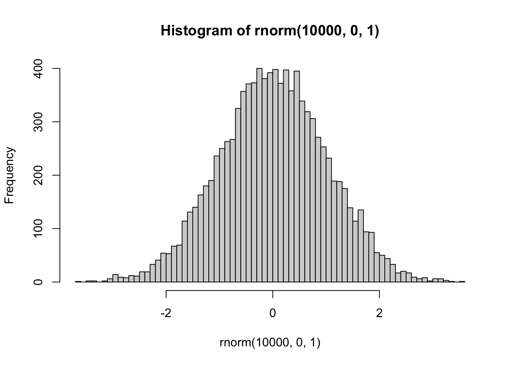

```r

# chi-squared with k = 1
hist(rnorm(10000,0,1)^2, breaks = 100)
```

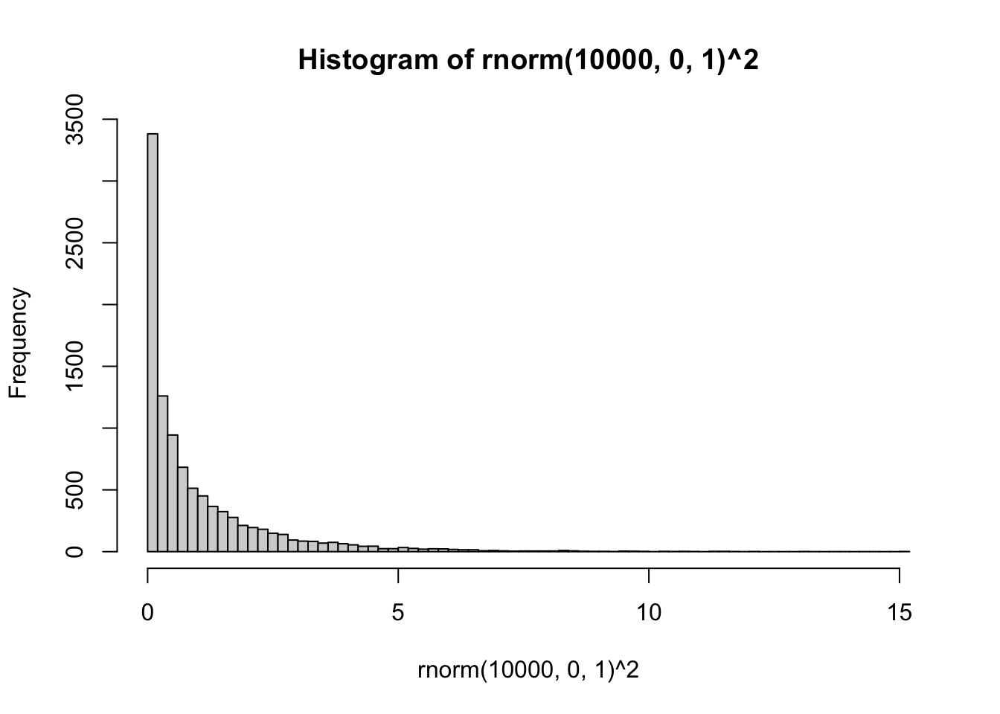

R has distribution functions for $\chi^2$, including `dchisq()`, `pchisq()`, `qchisq()`, `rchisq()`. So, if we sampled random deviates using `rchisq()`, with k = 1 (equivalent to df = 1), we should get the same histogram as above:


```r
hist(rchisq(10000,1), breaks=100)
```

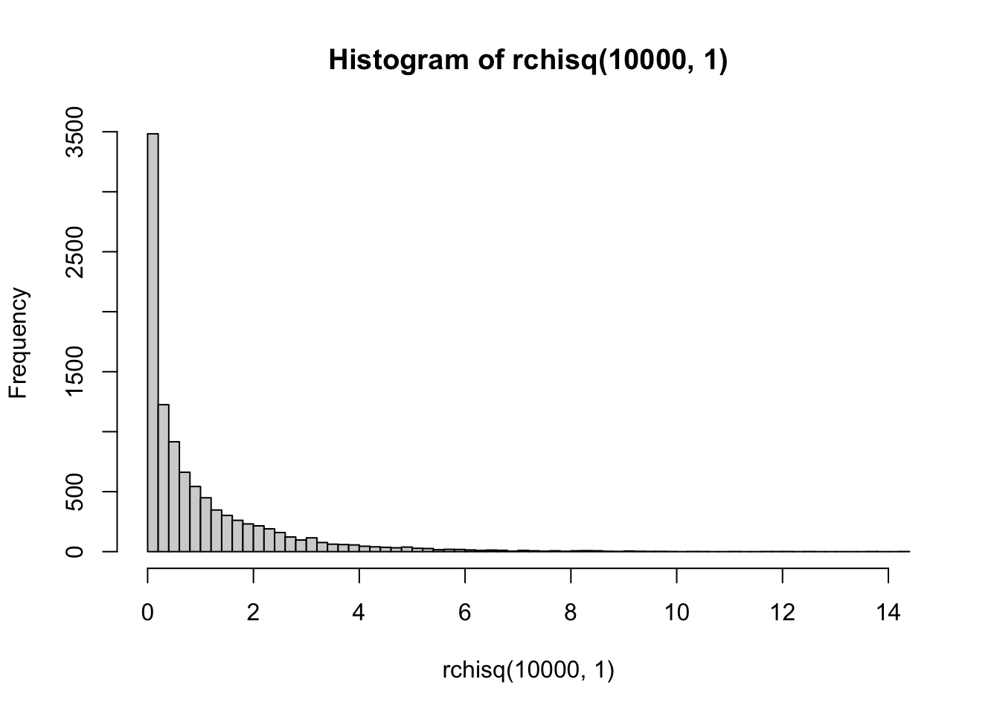

So, at its simplest, $\chi^2$ is just the normal distribution squared.

When $k > 1$, the $\chi^2$ distribution is defined as:

$\chi^2 = \sum_{i=1}^k Z_i^2$

Where, $Z_i$ are independent samples from a unit normal distribution. In other words, $\chi^2$ is the distribution of the **sum of squared values** from a unit normal distribution, and $k$ is the number of independent samples in each squared sum.

To clarify, let's use R:


```r
# k = 1
from_normal <- replicate(10000, rnorm(1,0,1)^2)
from_chisq  <- rchisq(10000,1)
plot_df <- data.frame(values = c(from_normal,
                                 from_chisq),
                      source = c("normal^2","chisq"))

library(ggplot2)
ggplot(plot_df, aes(x=values))+
  geom_histogram(bins=100)+
  ggtitle("k=1")+
  facet_wrap(~source)
```

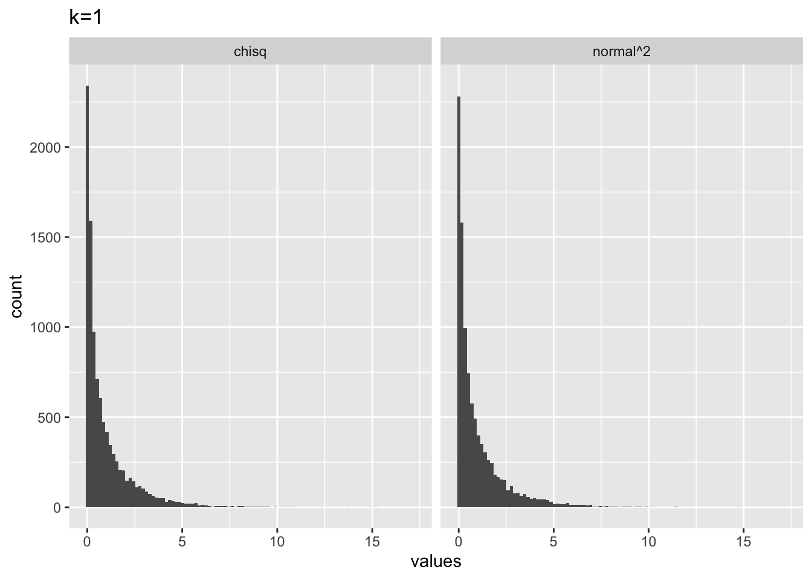


```r
# k = 2
from_normal <- replicate(10000, sum(rnorm(2,0,1)^2))
from_chisq  <- rchisq(10000,2)
plot_df <- data.frame(values = c(from_normal,
                                 from_chisq),
                      source = c("normal^2","chisq"))

library(ggplot2)
ggplot(plot_df, aes(x=values))+
  geom_histogram(bins=100)+
  ggtitle("k=2")+
  facet_wrap(~source)
```

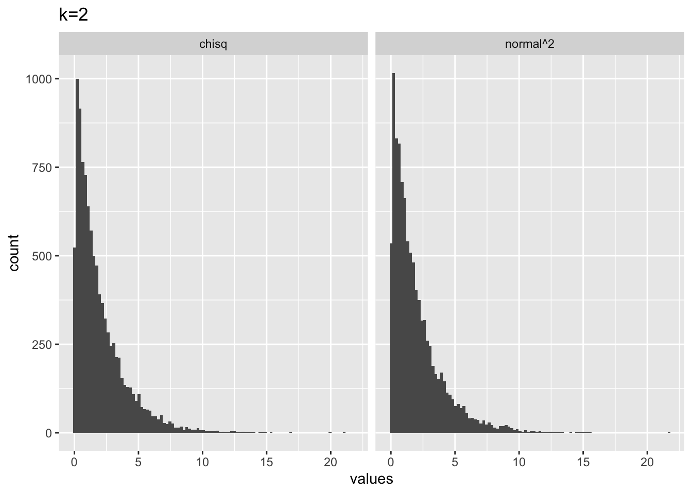


```r
# k = 3
from_normal <- replicate(10000, sum(rnorm(3,0,1)^2))
from_chisq  <- rchisq(10000,3)
plot_df <- data.frame(values = c(from_normal,
                                 from_chisq),
                      source = c("normal^2","chisq"))

library(ggplot2)
ggplot(plot_df, aes(x=values))+
  geom_histogram(bins=100)+
  ggtitle("k=3")+
  facet_wrap(~source)
```

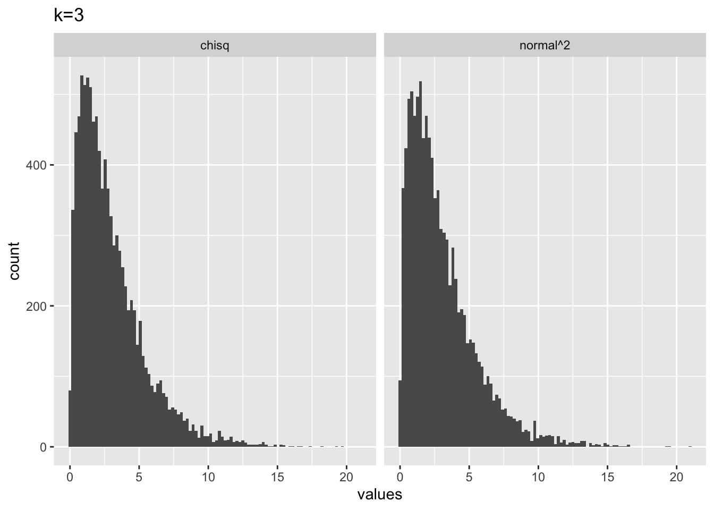


```r
# k = 5
from_normal <- replicate(10000, sum(rnorm(5,0,1)^2))
from_chisq  <- rchisq(10000,5)
plot_df <- data.frame(values = c(from_normal,
                                 from_chisq),
                      source = c("normal^2","chisq"))

library(ggplot2)
ggplot(plot_df, aes(x=values))+
  geom_histogram(bins=100)+
  ggtitle("k=5")+
  facet_wrap(~source)
```

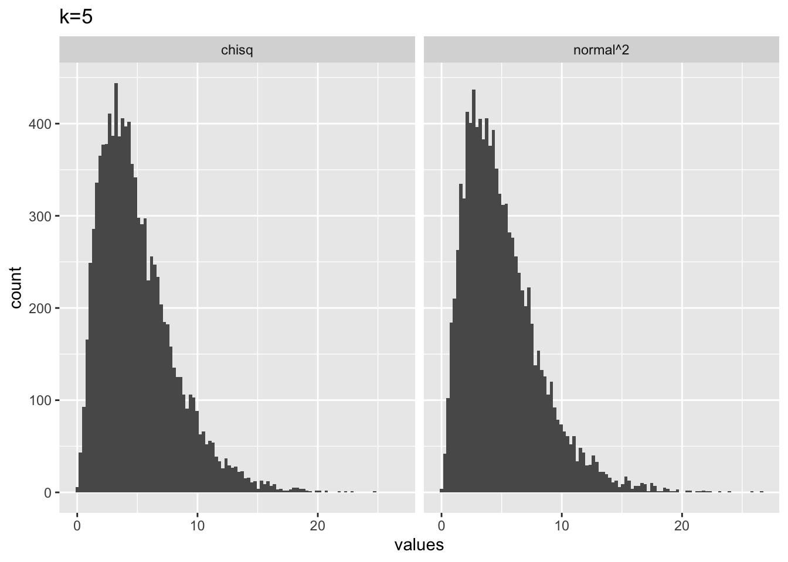

We can get a glimpse of what the $\chi^2$ distribution looks like across a range of $k$ by plotting the pdf (probability density function), using `dchisq()`.


```r

plot_df <- data.frame(values = c(dchisq(x=seq(0,20,length.out = 100), df=1),
                                 dchisq(x=seq(0,20,length.out = 100), df=3),
                                 dchisq(x=seq(0,20,length.out = 100), df=5),
                                 dchisq(x=seq(0,20,length.out = 100), df=9),
                                 dchisq(x=seq(0,20,length.out = 100), df=11)
                                 ),
                      x = rep(seq(0,20,length.out = 100),5),
                      k = as.factor(rep(c(1,3,5,9,11), each = 100))
                      )

ggplot(plot_df, aes(x = x, y=values, color=k, group=k))+
  geom_line()+
  ylab("density")+
  xlab("chi-squared")+
  scale_x_continuous(breaks=0:20)
```

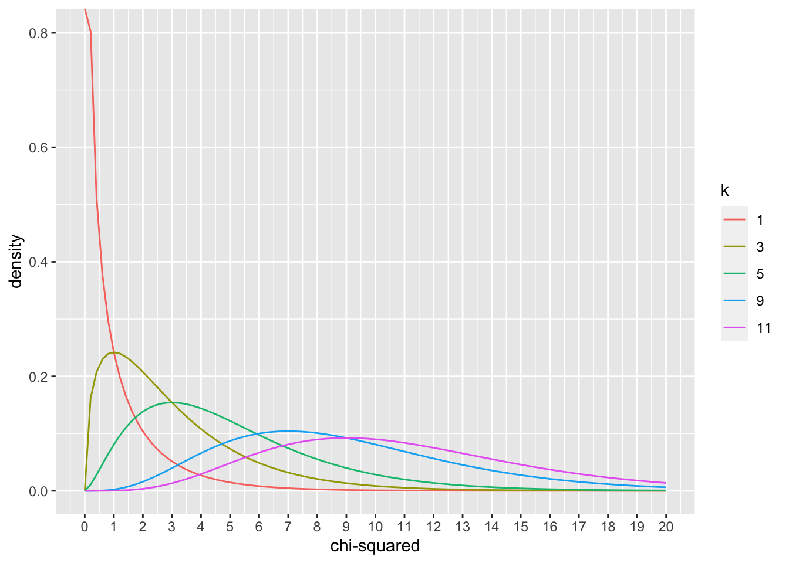
### Developing intuitions about $\chi^2$

1. Let's say you randomly sampled 5 numbers from a unit normal distribution (mean = 0 and sd =1), and then you squared those numbers, and then added them all up. What would you expect this number to be?


```r
a<- replicate(10000,sum(rnorm(5,0,1)^2))
hist(a)
```

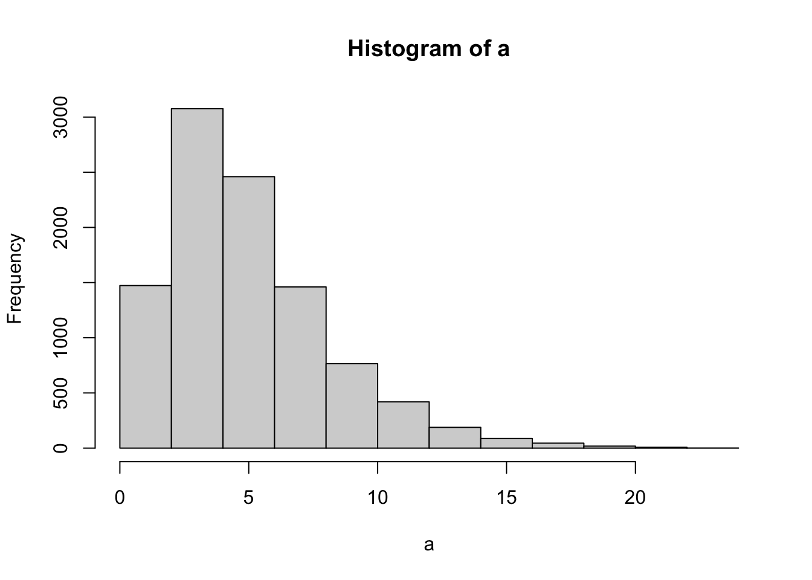


The answer is that this number will be distributed as a $\chi^2$ with $k=5$, referring to the situation of summing the squares of 5 samples from a unit normal distribution.

2. Why does the $\chi^2$ distribution change shape as $k$ increases? If $k$ was a big number like 60, what kind of shape could I expect? If I know $k$, what should I expect the mean of the $\chi^2$ distribution to be? Answering these questions requires building intuition about $\chi^2$.

In the following, I will take random samples from a unit normal distribution:

What is the expected mean of a unit normal distribution?


```r
mean(rnorm(10000,0,1))
#> [1] -0.003677052
```

If we square all of the values that we sample from a unit normal distribution (equivalent to $\chi^2$ with $k=1$), then what would the mean of those squared values be?


```r
mean(rnorm(10000,0,1)^2)
#> [1] 1.007915
```

It turns out the answer is 1. There will be no negative values because we are squaring everything. About 68% of the values in a unit normal are between -1 and 1, so squaring all of those will make values between 0 and 1, the rest of the values get increasingly bigger than 1. They all balance out at 1, which is the mean of a squared normal distribution. In other words, the mean of a $\chi^2$ is the same as the $k$ parameter, also called degrees of freedom.

For example, the mean of 10,000 numbers drawn from a $\chi^2$ with k = 10, is:


```r
mean(rchisq(10000,10))
#> [1] 9.991172
```

Another way to think about this is to recognize that the expected value (mean) from a squared unit normal distribution is 1. So, if you take 10 values from that distribution (i.e., when k = 10), then you are planning to sum up the 10 values that you get, and the expected value for each is 1...summing up 10 ones, gives you 10. The same expectations can be applied to $\chi^2$ distributions of any $k$.

## Conceptual II: Examining the approximation

In lecture we discussed that the binomial distribution converges on the normal distribution in the long run. This is one of the properties that allows the $\chi^2$ distribution to approximate properties of the binomial distribution. 

First, we can visually see that a binomial distribution becomes normally distributed in the long run by simulation. Each simulation involves 10,000 sets of coin flips. The first histogram involves a set of 10 coin flips, and displays the frequency of each possible outcome (# of heads)s. The second histogram shows sets of 100 coin flips. Here, the range of possible outcomes increases, and they appear to be distributed more normally. **As the number of flips in the set increases, the distribution of possible outcomes approaches a normal distribution**.


```r
# flip a coin 10 times
hist(rbinom(10000,10,.5), breaks=seq(0,10,1))
```

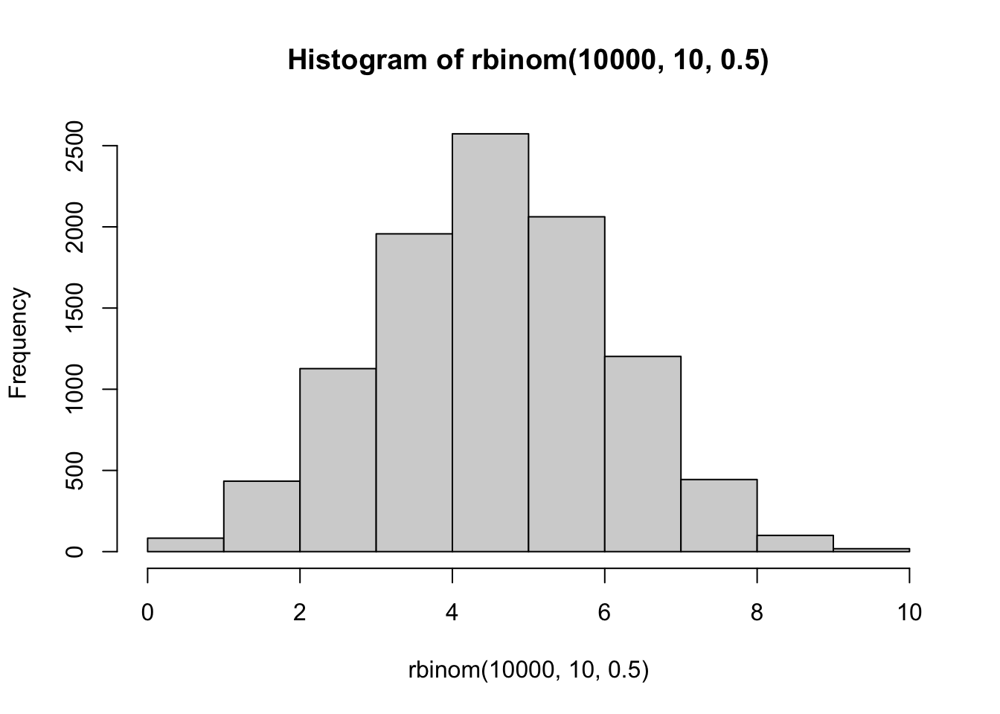

```r

# flip a coin 100 times
hist(rbinom(10000,100,.5), breaks=seq(20,80,1))
```

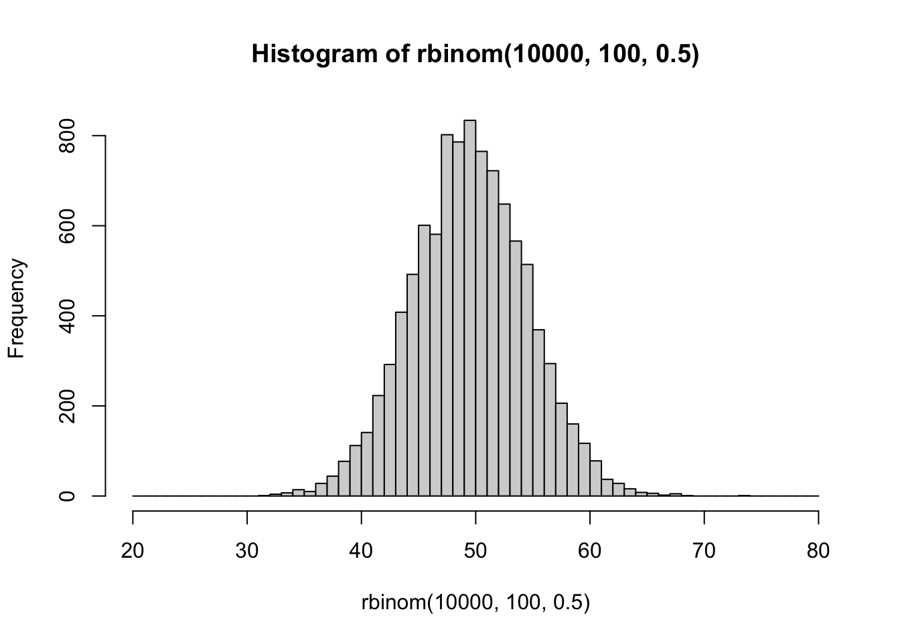
Second, let's develop a sense of the idea that the $\chi^2$ test is approximation of the binomial test. 

Consider another coin flipping scenario. Let's say a coin is flipped 10 times, and there are 2 heads. What is the p-value for a two-tailed test, specifically the probabiltiy of getting 2 or less heads, or 8 or more heads.?

We could use the binomial test, and compute the exact probability.


```r
pbinom(2,10,.5, lower.tail = TRUE)*2
#> [1] 0.109375
```

We could also use a $\chi^2$ test as an approximation:


```r
chisq.test(c(2,8))
#> 
#> 	Chi-squared test for given probabilities
#> 
#> data:  c(2, 8)
#> X-squared = 3.6, df = 1, p-value = 0.05778
```

In this case there wouldn't be a good reason to use the $\chi^2$ test, because the binomial test provides an exact probability. Also, because the expected frequencies are very small here, the p-value $\chi^2$ test is about half as small as it should be.

However, if we consider sets of coin flips that are much larger than 10, we increase the expected frequencies (which allows closer convergence to a normal distribution), and the $\chi^2$ and binomial tests both return p-values that are increasingly similar.


```r
pbinom(40,100,.5, lower.tail = TRUE)*2
#> [1] 0.05688793
chisq.test(c(40,60))
#> 
#> 	Chi-squared test for given probabilities
#> 
#> data:  c(40, 60)
#> X-squared = 4, df = 1, p-value = 0.0455
```


```r
pbinom(450,1000,.5, lower.tail = TRUE)*2
#> [1] 0.001730536
chisq.test(c(450,550))
#> 
#> 	Chi-squared test for given probabilities
#> 
#> data:  c(450, 550)
#> X-squared = 10, df = 1, p-value = 0.001565
```


```r
pbinom(4900,10000,.5, lower.tail = TRUE)*2
#> [1] 0.04658553
chisq.test(c(4900,5100))
#> 
#> 	Chi-squared test for given probabilities
#> 
#> data:  c(4900, 5100)
#> X-squared = 4, df = 1, p-value = 0.0455
```

## Lab 9 Generalization Assignment

<div class="videoWrapper">  <iframe width="560" height="315" src="https://www.youtube.com/embed/n4RchGANJWg" frameborder="0" allow="accelerometer; autoplay; clipboard-write; encrypted-media; gyroscope; picture-in-picture" allowfullscreen></iframe> </div>


### Instructions

In general, labs will present a discussion of problems and issues with example code like above, and then students will be tasked with completing generalization assignments, showing that they can work with the concepts and tools independently. 

Your assignment instructions are the following:

1. Work inside the R project "StatsLab1" you have been using
2. Create a new R Markdown document called "Lab9.Rmd"
3. Use Lab9.Rmd to show your work attempting to solve the following generalization problems. Commit your work regularly so that it appears on your Github repository.
4. **For each problem, make a note about how much of the problem you believe you can solve independently without help**. For example, if you needed to watch the help video and are unable to solve the problem on your own without copying the answers, then your note would be 0. If you are confident you can complete the problem from scratch completely on your own, your note would be 100. It is OK to have all 0s or 100s anything in between. 
5. Submit your github repository link for Lab 9 on blackboard.

### Problems

1. The following paper links to open data, and describes a design where two chi-square tests are performed for Experiment 1 (A copy of this paper will be made available).

Silver, A. M., Stahl, A. E., Loiotile, R., Smith-Flores, A. S., & Feigenson, L. (2020). When Not Choosing Leads to Not Liking: Choice-Induced Preference in Infancy. Psychological Science, 0956797620954491.

Obtain the data from the online repository, show your code for loading it into R, then conduct the same tests reported in Experiment 1 that the authors conducted. These include one binomial test, and two chi-square tests. Briefly report your re-analysis, and discuss whether you obtained the same values as the authors did (6 points). 

**Important Note:** In my own re-analysis I was able to obtain all of the same values that the authors provided in their results section. However, in my view the authors also misused the chi-square test, especially for the test of independence involving age. So, it is ok if you are unable to reproduce that analysis. However, it is instructive to try and reproduce what the authors did to form an opinion about whether the test was applied in a sound manner.

**Solution script**: I am also providing the .rmd for lab 9 that I wrote in the solution video here <https://github.com/CrumpLab/psyc7709Lab/blob/master/lab_solutions/Lab9.Rmd>.

**Update on misuse of chi-square test in the above paper**. As we discussed in class and in the solution video, it appears we accidentally found an example in the recent literature where a chi-square test was used incorrectly. In the solution video I didn't provide a clear reason to demonstrate why the chi-square test was misused. So, I thought I would write an addendum to this lab.

To recap, the authors measured a choice made by 21 infants. The age of each infant was measured in months (to two decimal places). They reported a chi-square test of independence to determine whether age was independent of the choice. For example, they reported: $\chi^2$ (19,N=21) =18.24,p=.506. These values are in some sense correct. For example:


```r
pchisq(18.24, 19, lower.tail = FALSE)
#> [1] 0.5064639
```

However, it appears that the authors treated the infant's ages, measured a continuous variable, as a categorical variable. And, as it happened, there were two infants who happened to be exactly 11.66 months old. As a result, there were 21 infants, and 20 different age categories. If a contingency table is constructed to represent 20 age categories, and 2 choice options, you get a 20x2 table. This table has (20-1)(2-1) = 19 degrees of freedom. In my solution video I showed an example of how the authors might have constructed that table from their data, and I was able to obtain the same chi-square value that they reported, suggesting that they did construct such a table.

There are several problems here. One of the problems that I will focus on is the conversion of a continuous age variable into a categorical variable. I was expecting the authors to bin ages, say into two categories: younger vs. older. Instead, they used each infant's age as a category level. It happened to be the case that two infants had exactly the same age (11.66 months), but if that hadn't happened, the table would have had 21 levels for age (because there were 21 infants).

Consider what occurs if you treat each subject as a unique level in a contingency table, especially in an experiment that involves the subject making a single choice between two alternatives. We will see that the answer is, you always get the same chi-square value. No matter what the subjects do.

Here is an example contingency table with 5 subjects. In this case, each column represents a subject. Row 1 represents choice A, and row 2 choice 2. Each subject makes a choice, and their choice is counted in the appropriate row.


```r
replicate(5,sample(c(1,0),2))
#>      [,1] [,2] [,3] [,4] [,5]
#> [1,]    1    1    0    1    0
#> [2,]    0    0    1    0    1
```

This is a contingency table, so it is possible to compute a chi-square test on this table.


```r
chisq.test(replicate(5,sample(c(1,0),2)))
#> 
#> 	Pearson's Chi-squared test
#> 
#> data:  replicate(5, sample(c(1, 0), 2))
#> X-squared = 5, df = 4, p-value = 0.2873
```
However, look at what happens. We obtain a chi-squared value of 5. And, this is what will always happen, no matter what choices each subject makes:

Every time this function runs, the choices made by each simulated subject are randomized. However, no matter what happens, the chi-square value is always five. 


```r
chisq.test(replicate(5,sample(c(1,0),2)))
#> 
#> 	Pearson's Chi-squared test
#> 
#> data:  replicate(5, sample(c(1, 0), 2))
#> X-squared = 5, df = 4, p-value = 0.2873
```
This is effectively what the authors did. For example, consider what would happen to the authors data if they excluded the two infants who had the exact same age. That table would have choices from 19 infants.

We can simulate any possible outcome this way:


```r
chisq.test(replicate(19,sample(c(1,0),2)))
#> 
#> 	Pearson's Chi-squared test
#> 
#> data:  replicate(19, sample(c(1, 0), 2))
#> X-squared = 19, df = 18, p-value = 0.3918
```

No matter choices the infants make (either A or B), they will always make one of them, and not the other. And, the observed chi-square value will always be the same as the number of subjects. So, this test does more to confirm the number of the infants used in the experiment than it does to assess the independence of age from the choices. 

Finally, if you create a contingency table where each subject has their own category level...and then conduct a chi-square test of independence to see if the subjects are independent from the choices that they made, I would think the major problem there is that the subjects couldn't be independent of the choices they made, because they were the ones making the choices.


<!-- ## Conceptual III: Testing independence -->

<!-- A common use of $\chi^2$ tests is to examine frequency data and determine whether the obtained frequencies are expected or unexpected, depending on some theoretical expectations for the frequencies. -->

<!-- It is worth looking at a simple example. Karl Pearson's first example from 1900 involved a dice rolling experiment, which is described in Example II. Let's look an even simpler example: -->

<!-- ### Example I -->

<!-- You have a die, you roll it 120 times, and you count how many times each of the possible numbers (1 to 6) are rolled. You assume the die is fair, and that each side should come up 1/6 times, or on average 20 times each. You obtain these counts and compute $\chi^2$. In this case the test statistic computed from the data is $\chi^2 = 9$. -->

<!-- ```{r} -->
<!-- die_rolls <- data.frame(side = 1:6, -->
<!--                         observed = c(27,13,24,16,25,15), -->
<!--                         expected = rep(20,6)) -->

<!-- knitr::kable(die_rolls) -->

<!-- chisq.test(die_rolls$observed) -->
<!-- ``` -->
<!-- You want to make an inference about the data, specifically you want to know whether the data could have been obtained from a fair coin. It is possible to use a $\chi^2$ test for purposes of inference in this case, **but it is important to recognize the alternative options at your disposal, and how they are related or not related to the $\chi^2$ test**. -->

<!-- 1) We have already covered the permutation test in this course. A situation involving rolling a die 120 times and counting the outcomes across six categories (1 to 6), could be expressed as a permutation test. As a result, exact probabilities for every possible outcome can be computed for this situation. We do not need to do a $\chi^2$ test, which would only be an approximation to the exact probabilities. However, it would be practically difficult to do the permutation test, because it would involve 120! factorial possible outcomes. -->

<!-- 2) We have already covered the randomization test in this course. We could sample randomly from the possible permutations and use a monte-carlo simulation to estimate the probabilities of any outcome. -->

<!-- 3) We could use a $\chi^2$ test, but this would involve recognizing that the $\chi^2$ test, under some conditions, provides a pretty approximation to the true null distribution for this situation. -->

<!-- #### A simulation example -->

<!-- Let's do a randomization test for this situation to illustrate the above considerations more clearly: -->

<!-- We can use `sample` and `table` to simulate the process of rolling a die 120 times, and counting how many of each number was rolled. -->
<!-- ```{r} -->
<!-- table(sample(1:6,120, replace=TRUE)) -->
<!-- ``` -->

<!-- We can also compute the observed $\chi^2$ for a new simulated experiment: -->

<!-- ```{r} -->
<!-- chisq.test(table(sample(1:6,120, replace=TRUE)))$statistic -->
<!-- ``` -->

<!-- So, if we wanted to quickly simulate the whole experiment 10000 times, we could generate a sampling distribution of $\chi^2$ values. -->

<!-- ```{r} -->
<!-- sampling_chi <- replicate(10000,chisq.test(table(sample(1:6,120, replace=TRUE)))$statistic) -->
<!-- ``` -->

<!-- Now, we could ask what proportion of times did we get a value of 9 or greater? -->

<!-- ```{r} -->
<!-- length(sampling_chi[sampling_chi > 9])/10000 -->
<!-- ``` -->

<!-- And we get a similar answer as we did using the $\chi^$ test earlier. -->

<!-- There is an important difference to apprehend here. The sampling distribution of $\chi^2$ that we just made is not the same as a $\chi^2$ distribution. -->

<!-- For example, we could repeat our randomization test, but use a different sample statistic to summarize the observed data. If I wanted to summarize the amount error between observed frequencies and expected frequencies, I could just as easily sum up the absolute differences between the two: -->

<!-- ```{r} -->
<!-- die_rolls$observed-die_rolls$expected -->
<!-- abs(die_rolls$observed-die_rolls$expected) -->
<!-- sum(abs(die_rolls$observed-die_rolls$expected)) -->
<!-- ``` -->

<!-- I could use the sum of the absolute difference as the sample statistic, and create sampling distribution for that: -->

<!-- ```{r} -->

<!-- sampling_chi_abs <- replicate(10000,sum(abs(table(sample(1:6,120, replace=TRUE)) - 20))) -->

<!-- ``` -->

<!-- And, then see what the probability is of getting a value larger than 32: -->

<!-- ```{r} -->
<!-- length(sampling_chi_abs[sampling_chi_abs > 32])/10000 -->
<!-- ``` -->

<!-- In this case we get a lower probability. And, I have created a kind of complicated situation for inference because I am now pointing to three different null distributions. First, we have the $\chi^2$ distribution with df = 5 (which we are still in the process of understanding). Second, we have the sampling disrtribution of $\chi^2$ from the randomization test. Third, we have a sampling distribution of the sum of the absolute differences between observed and expected values. In my view, these are all legitimate null distributions that could be used for inference. -->

<!-- ### Limitations -->

<!-- The $\chi^2$ test is an approximation. In many situations the true-null distribution is expected to converge onto the properties of $\chi^2$ distributions, which is why the test can be appropriate for generating probabilities about a null-hypothesis. -->

<!-- However, because the $\chi^2$ test is an approximation, there are situations where the approximation falls apart. This is especially a problem when the theoretical frequencies are small. -->

<!-- For example, let's repeat our die rolling experiment, buy only roll the die 6 times, and each time count how many times we get each number: -->

<!-- ```{r} -->
<!-- die_rolls <- data.frame(side = 1:6, -->
<!--                         observed = c(0,1,0,0,0,5), -->
<!--                         expected = rep(1,6)) -->

<!-- knitr::kable(die_rolls) -->

<!-- chisq.test(die_rolls$observed) -->
<!-- ``` -->

<!-- Notice, R returns a warning that the $\chi^2$ approximation may be incorrect. What is the issue? -->

<!-- First, rolling a die 6 times and counting the occurrence of each number out of 6 involves a discrete number of possible outcomes. There are $6^6 = 46656$ possible outcomes. -->

<!-- ```{r} -->
<!-- possibility_matrix <- matrix(0,nrow=46656,ncol=6) -->

<!-- row_count<-0 -->
<!-- for(p1 in 1:6){ -->
<!--   for(p2 in 1:6){ -->
<!--     for(p3 in 1:6){ -->
<!--       for(p4 in 1:6){ -->
<!--         for(p5 in 1:6){ -->
<!--           for(p6 in 1:6){ -->
<!--             row_count<-row_count+1 -->
<!--             possibility_matrix[row_count,] <- c(p1,p2,p3,p4,p5,p6) -->
<!--           } -->
<!--         } -->
<!--       } -->
<!--     } -->
<!--   } -->
<!-- } -->

<!-- count_each <- function(observation, to_count){ -->
<!--   counts <- c() -->
<!--   for(i in 1:length(to_count)){ -->
<!--     counts[i]<-length(observation[observation==to_count[i]]) -->
<!--   } -->
<!--   return(counts) -->
<!-- } -->

<!-- count_matrix <- matrix(0,nrow=46656,ncol=6) -->
<!-- for(i in 1:46656){ -->
<!--   count_matrix[i,] <- count_each(possibility_matrix[i,], 1:6) -->
<!-- } -->

<!-- chi_squared_possibilities <- rowSums(((count_matrix-1)^2)/1) -->
<!-- hist(chi_squared_possibilities, breaks=100) -->
<!-- table(chi_squared_possibilities) -->
<!-- 180/46656 -->
<!-- 6/46656 -->

<!-- hist(rchisq(46656,5),breaks=100) -->

<!-- pchisq(20,5,lower.tail=FALSE) -->

<!-- ``` -->


<!-- ### Example II -->

<!-- Karl Pearson's first example from 1900 involved a dice rolling experiment, described below: -->

<!-- ```{r,echo=FALSE} -->
<!-- knitr::include_graphics("imgs/pearson_dice.png") -->
<!-- ``` -->

<!-- We will use R to reconstruct this example. First, the experiment involved rolling 12 die at once, then counting how many of them showed a five or a six. This was repeated 26306 times. -->

<!-- Our first task is to determine the **Theoretical Frequency** for the outcome of this experiment. These values are listed by Pearson in the above table. Can we reproduce them? -->

<!-- We assume that the 12 die are fair with odds 2/6 to get a 5 or 6. The expected frequencies can be obtained from a binomial distribution, where it is possible to have 0 to 12 "successes" (rolling a 5 or 6), and each success has 2/6 probability of occurring. -->

<!-- ```{r} -->
<!-- round(dbinom(x = 0:12, -->
<!--              size = 12, -->
<!--              prob = 2/6)*26306, digits=0) -->
<!-- ``` -->

<!-- So, we could make two parts of the above table: -->

<!-- ```{r} -->
<!-- chi_square_table <- data.frame( -->
<!--   Num_dice_5_or_6 = 0:12, -->
<!--   Theoretical_frequency = round(dbinom(x = 0:12, -->
<!--              size = 12, -->
<!--              prob = 2/6)*26306, digits=0) -->
<!-- ) -->

<!-- knitr::kable(chi_square_table) -->
<!-- ``` -->

<!-- Pearson's colleague Professor W. F. R. Weldon apparently took the time out of his day to roll 12 die 26306 times, and each time counted how many 5s and 6s occurred, these values are in the "Observed Frequency" column. We would have to enter them in by hand to our table: -->

<!-- ```{r} -->
<!-- chi_square_table <- data.frame( -->
<!--   Num_dice_5_or_6 = 0:12, -->
<!--   Theoretical_frequency = round(dbinom(x = 0:12, -->
<!--              size = 12, -->
<!--              prob = 2/6)*26306, digits=0), -->
<!--   Observed_frequency = c(185,1149,3265,5475,6114, -->
<!--                          5194,3067,1331,403,105,14,4,0) -->
<!-- ) -->

<!-- knitr::kable(chi_square_table) -->

<!-- ``` -->

<!-- Now, the question is whether the observed frequencies differ from the theoretically expected ones? A first step toward deciding this question is to **compute the deviations between the Theoretical and Expected Frequencies**. -->

<!-- ```{r} -->
<!-- library(dplyr) -->

<!-- chi_square_table <- chi_square_table %>% -->
<!--   mutate(Deviation = Observed_frequency-Theoretical_frequency) -->

<!-- knitr::kable(chi_square_table) -->

<!-- ``` -->

<!-- We notice that **there are deviations**. The observed frequencies are **not exactly the same** as the theoretical frequencies. This deviation from the expectation is also termed **error**. It is the difference between what is expected to occur, and what did occur. -->

<!-- However, a major question is **are the deviations unusual or expected?**. We **expect** that there will **always be some deviations** in this situation because the values of each die are determined by random sampling. The chi-square test provides a method to compare the observed deviations with a sampling distribution of expected deviations due to chance. -->

<!-- The next step is to **summarize** the deviations in some convenient way to produce a descriptive sample statistic. This is done with: -->

<!-- $\chi^2 = \sum{\frac{(\text{Observed} - \text{Expected})^2}{\text{Expected}}}$ -->

<!-- $\chi^2 = \sum{\frac{\text{Deviations}^2}{\text{Expected}}}$ -->

<!-- Here are Pearson's calculations: -->

<!-- ```{r, echo=FALSE} -->

<!-- knitr::include_graphics("imgs/pearson_error.png") -->

<!-- ``` -->

<!-- And, we accomplish the same with: -->

<!-- ```{r} -->

<!-- chi_square_table <- chi_square_table %>% -->
<!--   mutate(e_2 = Deviation^2) %>% -->
<!--   mutate(e_2_m = e_2/Theoretical_frequency) -->

<!-- knitr::kable(chi_square_table) -->
<!-- ``` -->

<!-- Finally, the computed chi-square value ($\chi^2$) is: -->

<!-- ```{r} -->
<!-- sum(chi_square_table$e_2_m, na.rm=TRUE) -->
<!-- ``` -->

<!-- Our value is ever so slightly different from Pearson's (43.87), and these differences appear to be due to rounding differences in the Theoretical frequencies for a couple events.  -->

<!-- ### What is $\chi^2$ telling us? -->

<!-- $\chi^2 = \sum{\frac{(\text{Observed} - \text{Expected})^2}{\text{Expected}}}$ -->

<!-- $\chi^2$ is a sample statistic that conveniently summarizes the difference between a set of observed frequencies and theoretically expected frequencies. For each event frequency, the deviation or difference between observed and expected is computed, and then squared, and then divided by the expected frequency. All of these values are then summed to produce a single number, $\chi^2$. In general, $\chi^2$ will approach 0 as the deviations between observed and expected frequencies become smaller, and $\chi^2$ grows larger as the deviations grow larger. -->

<!-- ### Compared to what? -->

<!-- For this example, our big question is to better understand the obtained $\chi^2 = 43.64$. Is this value big or small, expected or unexpected? To answer these kinds of questions, we need to make a comparison. Pearson compares his obtained value to the "null-distribution". This is the distribution of chi-square values that would be expected by chance alone.  -->

<!-- Pearson developed analytic formulas allowing direct calculation of the probabilities associated obtaining particular values of $\chi^2$ under a null-distribution, for example, calculated the probability of obtaining $\chi^2 = 43.87$ as: -->

<!-- ```{r, echo=FALSE} -->
<!-- knitr::include_graphics("imgs/pearson_p.png") -->
<!-- ``` -->

<!-- ### Simulated $\chi^2$ distributions -->

<!-- As a an alternative to Pearson's method, we can use R to create a sampling distribution of $\chi^2$ for the null hypothesis by simulation. -->

<!-- The first step to do that is to simulate Pearson's dice rolling experiment, which allows us to "pretend" rolling 12 dice 26306 times, and counting up how many times a five or six is rolled out of 12. -->

<!-- ```{r} -->
<!-- table(rbinom(26306,12,2/6)) -->
<!-- ``` -->

<!-- Now we can simulate observed frequencies for this experiment, and compute a chi_squared statistic each time. Each time we see a new $\chi^2$ value, showing what happened by chance alone for each simulated experiment. -->

<!-- ```{r} -->
<!-- Theoretical_frequency <- round(dbinom(x = 0:12, -->
<!--              size = 12, -->
<!--              prob = 2/6)*26306, digits=0) -->

<!-- simulated_observed <- table(rbinom(26306,12,2/6)) -->

<!-- deviations_squared <- (simulated_observed-Theoretical_frequency[1:length(simulated_observed)])^2 -->

<!-- chi_squared <- sum(deviations_squared/Theoretical_frequency[1:length(simulated_observed)]) -->

<!-- ``` -->

<!-- To get a good sense of the kinds of values that $\chi^2$ could take by chance alone, we conduct the above 10,000 times in a monte-carlo simulation, to produce a $\chi^2$ distribution. -->

<!-- ```{r} -->

<!-- Theoretical_frequency <- round(dbinom(x = 0:12, -->
<!--              size = 12, -->
<!--              prob = 2/6)*26306, digits=0) -->

<!-- # run monte-carlo -->
<!-- chi_square_dist <- c() -->
<!-- for(i in 1:10000){ -->
<!--   simulated_observed <- table(rbinom(26306,12,2/6)) -->

<!--   deviations_squared <- (simulated_observed-Theoretical_frequency[1:length(simulated_observed)])^2 -->

<!--   normalized_deviations <- deviations_squared/Theoretical_frequency[1:length(simulated_observed)] -->

<!--   chi_squared <- sum(normalized_deviations[is.infinite(normalized_deviations) == FALSE]) -->

<!--   chi_square_dist[i] <- chi_squared -->
<!-- } -->

<!-- # plot -->
<!-- library(ggplot2) -->

<!-- sim_data <- data.frame(num_sims = 1:10000, -->
<!--                        chi_square = chi_square_dist) -->

<!-- ggplot(sim_data ,aes(x=chi_square))+ -->
<!--   geom_histogram(bins=60, color='orange', fill='black', breaks=0:100) + -->
<!--   geom_vline(xintercept = 43, color='red') -->

<!-- length(chi_square_dist[chi_square_dist > 43])/10000 -->

<!-- ``` -->


<!-- ### General principles -->

<!-- Pearson's chi square test has some convenient mathematical properties that allow for direct calculation of probabilities associated with a null chi-square distribution. We have seen that a monte-carlo simulation process produces similar results.  -->

<!-- More generally, we can accomplish the goals of a chi-square test in multiple ways, as long as we can 1) define a useful sample statistic, and 2) estimate the sampling distribution of that statistic under some set of asssumptions (usually the null). -->

<!-- For example, Pearson defined the sample statistic $\chi^2$ as: -->

<!-- $\chi^2 = \sum{\frac{(\text{Observed} - \text{Expected})^2}{\text{Expected}}}$ -->

<!-- This formula does a good job of distilling the deviations between expected and theoretical frequencies down to a single number. However, consider this formula: -->

<!-- $|\chi|_ = \sum|(Observed-Expected)|$ -->

<!-- The above is a sample statistic I just made up, and I'm calling it absolute chi. It is just the sum of the absolute deviations between observed and expected. And, we could use a monte-carlo simulation process to find the sampling distribution for this statistic under the null as well: -->

<!-- ```{r} -->
<!-- Theoretical_frequency <- round(dbinom(x = 0:12, -->
<!--              size = 12, -->
<!--              prob = 2/6)*26306, digits=0) -->

<!-- # run monte-carlo -->
<!-- chi_abs_dist <- c() -->
<!-- for(i in 1:10000){ -->
<!--   simulated_observed <- table(rbinom(26306,12,2/6)) -->

<!--   chi_abs <- sum(abs(simulated_observed-Theoretical_frequency[1:length(simulated_observed)])) -->
<!--   chi_abs_dist[i] <- chi_abs -->
<!-- } -->

<!-- sim_data <- data.frame(num_sims = 1:10000, -->
<!--                        chi_abs = chi_abs_dist) -->

<!-- ggplot(sim_data ,aes(x=chi_abs))+ -->
<!--   geom_histogram(bins=60, color='orange', fill='black')+ -->
<!--   geom_vline(xintercept = sum(abs(chi_square_table$Deviation)), -->
<!--              color='red') -->

<!-- length(chi_abs_dist[chi_abs_dist > sum(abs(chi_square_table$Deviation))])/10000 -->

<!-- ``` -->


<!-- ### A vector of frequencies -->

<!-- The following compute a chi-squared test on a single vector. Without further specification, the assumption is that each of possibilities have an equal probability of occurring, and the p-value reflects the probability of obtaining a chi-square or larger for the given situation. -->

<!-- This computes a p value from a chi-square distribution with df = 2. -->

<!-- ```{r} -->
<!-- chisq.test(x=c(100,100,130)) -->
<!-- ``` -->

<!-- It is also possible to "simulate" the p-value through a monte-carlo process, much like the ones we have been using. In this case, there is no df (degrees of freedom), because the sampling distribution is estimated by simulation, and not approximated using a chi-square distribution with df = 2. -->

<!-- ```{r} -->
<!-- chisq.test(x=c(100,100,130), simulate.p.value = TRUE, B=10000) -->
<!-- ``` -->

<!-- We could reproduce our simulation as follows. The above example involves a total of 330 events, if they were all equally likely to fall into the categories A, B, C, then the expected frequency for each event is 110, 110, and 110.  -->

<!-- ```{r} -->
<!-- sim_chi_square <- replicate(10000, sum(((table(sample(1:3,330,replace=TRUE))-110)^2)/110)) -->
<!-- length(sim_chi_square[sim_chi_square > 5.4545])/10000 -->

<!-- hist(sim_chi_square) -->
<!-- ``` -->

<!-- ### A contingency table -->

<!-- The `chisq.test()` also accepts matrices, which are common for tests of independence. Consider the example from wikipedia <https://en.wikipedia.org/wiki/Chi-squared_test#Example_chi-squared_test_for_categorical_data>. -->

<!-- ```{r, echo=FALSE} -->
<!-- knitr::include_graphics('imgs/wikipedia_chi.png') -->
<!-- ``` -->

<!-- ```{r} -->
<!-- frequency_matrix <- matrix(c(90,60,104,95, -->
<!--                            30,50,51,20, -->
<!--                            30,40,45,35),ncol=4,nrow=3,byrow=TRUE) -->
<!-- chisq.test(frequency_matrix) -->
<!-- ``` -->
<!-- To illustrate the steps involved, let's first compute the expected frequencies. -->

<!-- ```{r} -->
<!-- # calculate expected frequencies assuming Independence -->
<!-- expected_matrix <- matrix(0,ncol=4,nrow=3) -->
<!-- column_sums <- colSums(frequency_matrix) -->
<!-- row_sums <- rowSums(frequency_matrix) -->
<!-- for(i in 1:dim(frequency_matrix)[1]){ -->
<!--   for(j in 1:dim(frequency_matrix)[2]){ -->
<!--     expected_matrix[i,j] <- column_sums[j] * row_sums[i]/sum(frequency_matrix) -->
<!--   } -->
<!-- } -->
<!-- expected_matrix -->

<!-- # Or use linear algebra -->
<!-- t(colSums(frequency_matrix) %*% t(rowSums(frequency_matrix)/650)) -->
<!-- ``` -->

<!-- Next, we compute $\chi^2$: -->

<!-- ```{r} -->
<!-- sum(((frequency_matrix-expected_matrix)^2)/expected_matrix) -->
<!-- ``` -->

<!-- Now, what is the reference null distribution to compare this value too? Pearson's answer is that the null distribution is well approximated by a chi-square distribution with df = 6. -->

<!-- ```{r} -->
<!-- ?pchisq -->
<!-- pchisq(24.5712,df=6, lower.tail=FALSE) -->
<!-- ``` -->

<!-- Finally consider how we could simulate the sampling the distribution, rather than approximate it with a chi-square distribution. -->

<!-- ```{r} -->
<!-- event_probabilities <- expected_matrix/rowSums(expected_matrix) -->
<!-- simulated_dist <- c() -->
<!-- for(iterations  in 1:10000){ -->
<!--   sim_events <- matrix(0,ncol=4,nrow=3) -->
<!--   for(i in 1:3){ -->
<!--     sim <- table(sample(1:4, -->
<!--                  size=sum(expected_matrix[i,]), -->
<!--                  replace=TRUE, -->
<!--                  prob = event_probabilities[i,])) -->
<!--     sim_events[i,]<-sim -->
<!--   } -->
<!--   sim_chi <- sum(((sim_events-expected_matrix)^2)/expected_matrix) -->
<!--   simulated_dist[iterations] <- sim_chi -->
<!-- } -->

<!-- hist(simulated_dist) -->
<!-- length(simulated_dist[simulated_dist > 24.5712])/10000 -->
<!-- ``` -->


<!-- ```{r} -->

<!-- chi_sq <- rep(0,1000000) -->
<!-- for(i in 1:2){ -->
<!--   a <- rnorm(1000000,0,1)^2 -->
<!--   chi_sq <- chi_sq+a -->
<!-- } -->

<!-- hist(chi_sq) -->

<!-- pchisq(5,2,lower.tail=FALSE) -->
<!-- length(chi_sq[chi_sq > 5])/1000000 -->


<!-- ``` -->


