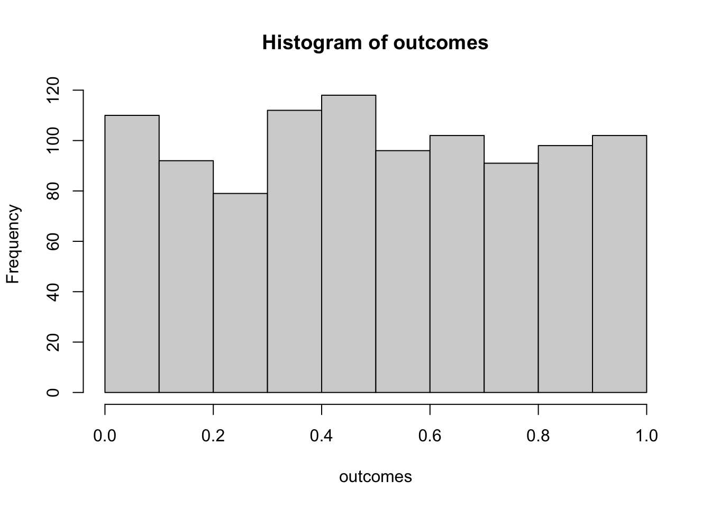
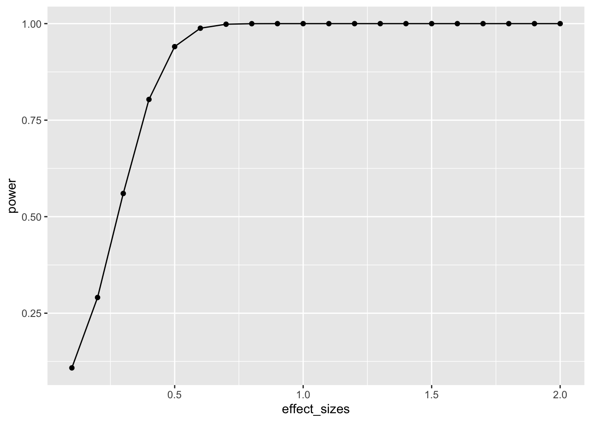
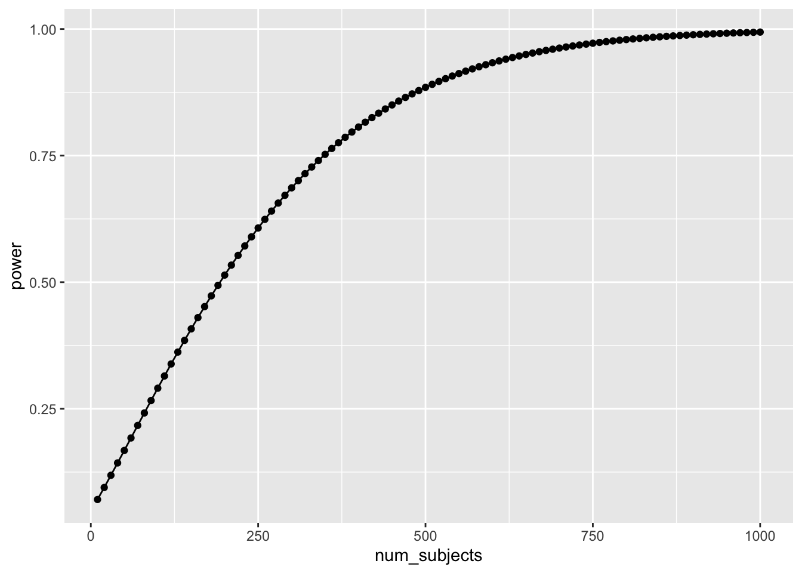
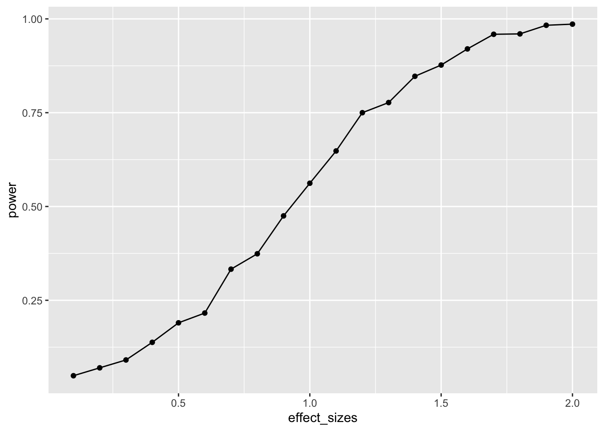
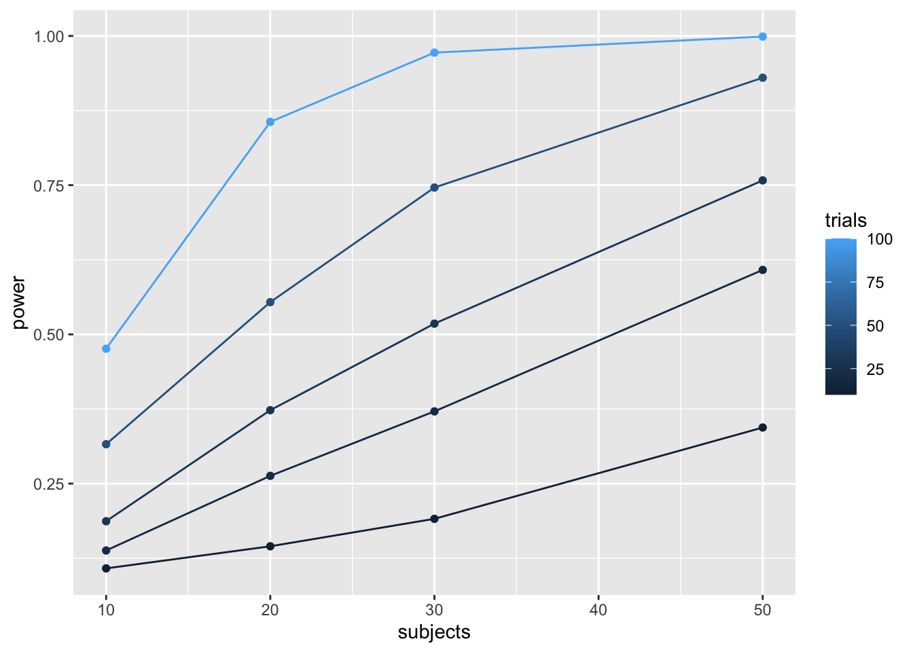
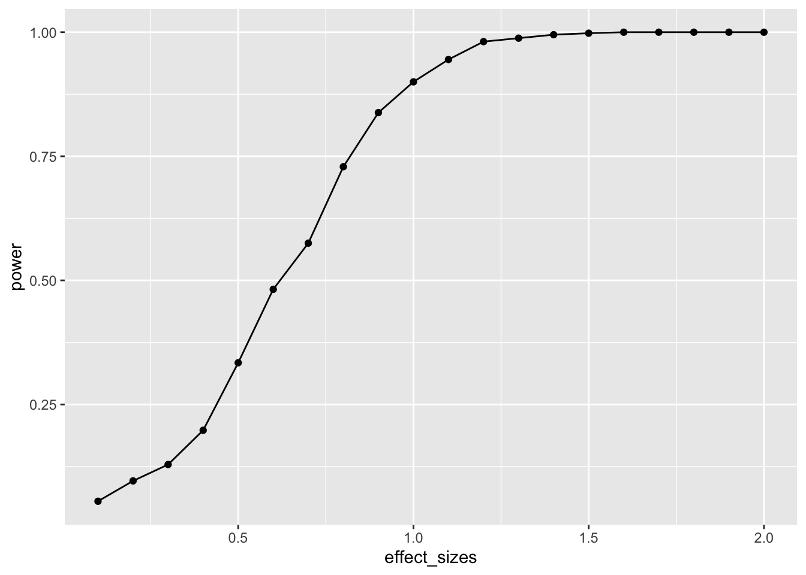
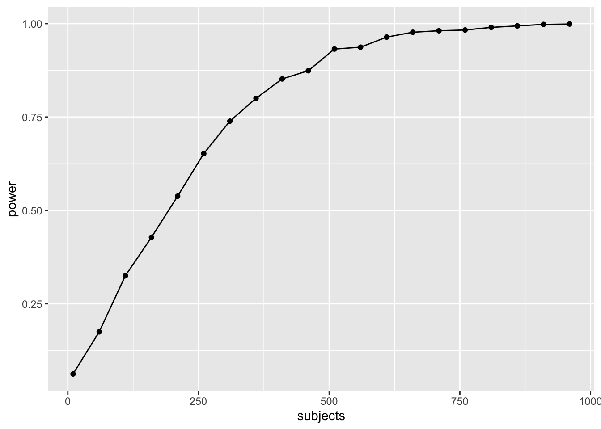
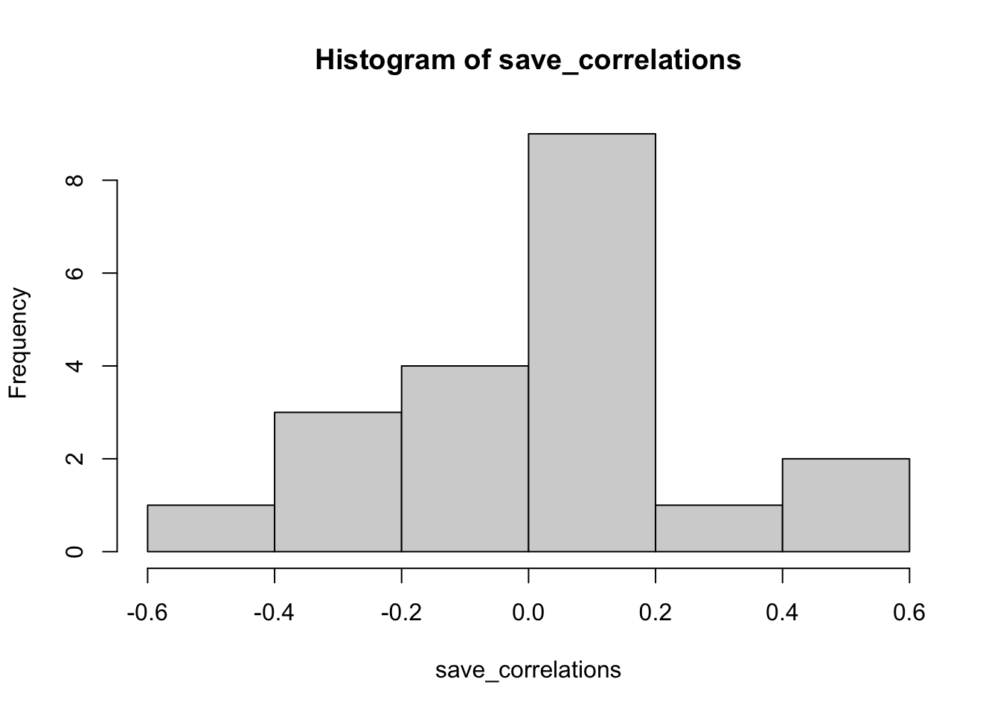
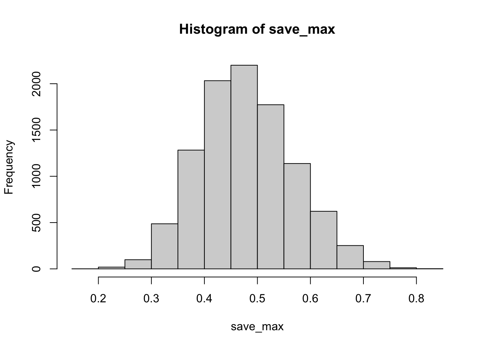
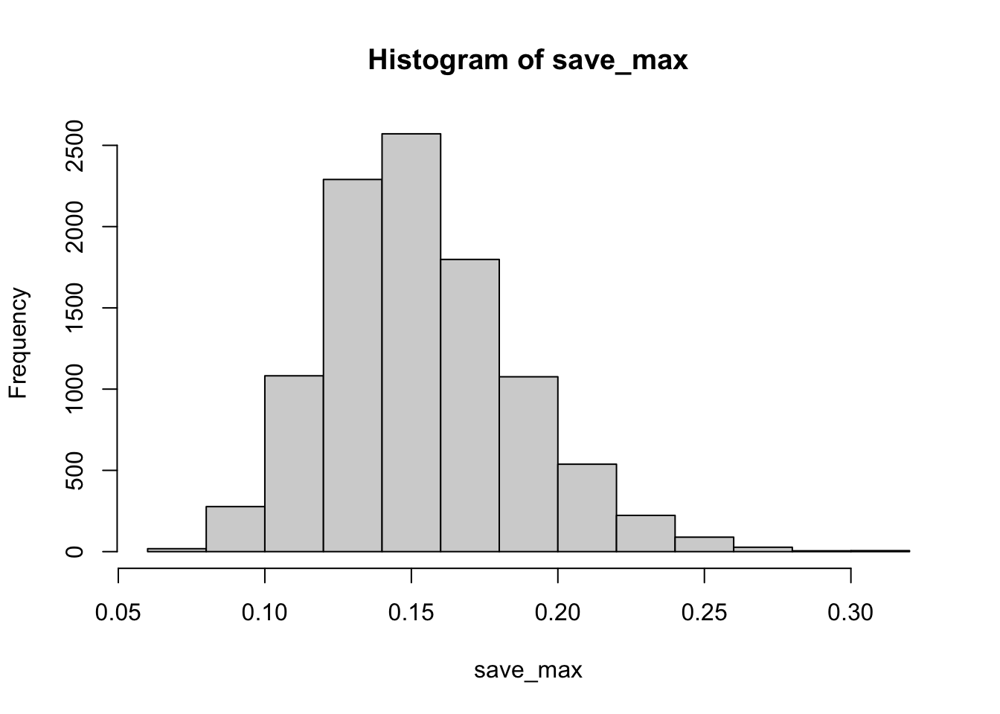

# Simulation and Power Analysis {.unnumbered}

"11/8/2020 | Last Compiled: 2020-12-14"

## Reading

@crumpAnsweringQuestionsData2018, Chapter 12 on [Effect size and power](https://crumplab.github.io/statistics/thinking-about-answering-questions-with-data.html)

## Overview

Part of the semester long project is to conduct a simulation-based power-analysis. This document provides some background on power-analyses and use of simulations for sample-size and design planning. Attempts will be made to integrate additional examples in the remaining labs this semester and next as we move on to more complicated designs and statistical tests.

1. Develop a deeper understanding of the assumptions behind statistical tests
2. Sample-size planning and power-analysis
3. Understand how real data ought to behave given the assumptions you are making about the data.

## Null-hypothesis

In general, the null-hypothesis is the hypothesis that your experimental manipulation didn't work. Or, the hypothesis of no differences.

We can simulate null-hypotheses in R for any experimental design. We do this in the following way:

1. Use R to generate sample data in each condition of a design
2. Make sure the sample data comes from the very same distribution for all conditions (ensure that there are no differences)
3. Compute a test-statistic for each simulation, save it, then repeat to create the sampling distribution of the test statistic.
4. The sampling distribution of the test-statistic is the null-distribution. We use it to set an alpha criterion, and then do hypothesis testing.

### Null for a t-test


```r
# samples A and B come from the same normal distribution
A <- rnorm(n=10,mean=10, sd=5)
B <- rnorm(n=10,mean=10, sd=5)

# the pvalue for this one pretend simulation
t.test(A,B,var.equal=TRUE)$p.value
#> [1] 0.4465779

# running the simulation
# everytime we run this function we do one simulated experiment and return the p-value
sim_null <- function(){
  A <- rnorm(n=10,mean=10, sd=5)
  B <- rnorm(n=10,mean=10, sd=5)
  return(t.test(A,B,var.equal=TRUE)$p.value)
}

# use replicate to run the sim many times
outcomes <- replicate(1000,sim_null())

# plot the null-distribution of p-values
hist(outcomes)
```



```r

# proportion of simulated experiments had a p-value less than .05
length(outcomes[outcomes<.05])/1000
#> [1] 0.048
```

We ran the above simulation 1000 times. By definition, we should get approximately 5% of the simulations returning a p-value less than .05. If we increase the number of simulations, then we will get a more accurate answer that converges on 5% every time.

## Alternative hypothesis

The very general alternative to the null hypothesis (no differences), is often called the **alternative** hypothesis: that the manipulation does cause a difference. More specifically, there are an infinite number of possible alternative hypotheses, each involving a difference of a specific size.

Consider this. How often will we find a p-value less than .05 if there was a mean difference of 5 between sample A and B. Let's use all of the same parameters as before, except this time we sample from different distributions for A and B.


```r
  A <- rnorm(n=10,mean=10, sd=5)
  B <- rnorm(n=10,mean=15, sd=5)
  t.test(A,B,var.equal=TRUE)$p.value
#> [1] 0.04564235

# make the mean for B 15 (5 more than A)
sim_alternative <- function(){
  A <- rnorm(n=10,mean=10, sd=5)
  B <- rnorm(n=10,mean=15, sd=5)
  return(t.test(A,B,var.equal=TRUE)$p.value)
}

# use replicate to run the sim many times
outcomes <- replicate(1000,sim_alternative())

# plot the distribution of p-values
hist(outcomes)
```


```r

# proportion of simulated experiments had a p-value less than .05
length(outcomes[outcomes<.05])/1000
#> [1] 0.556
```

We programmed a mean difference of 5 between our sample for A and B, and we found p-values less than .05 a much higher proportion of the time. This is sensible, as there really was a difference between the samples (we put it there).

## Power and Effect Size

**Power**: the probability of rejecting a null-hypothesis, given that there is a true effect of some size.

**Effect-size**: In general, it's the assumed size of the difference. In the above example, we assumed a difference of 5, so the assumed effect-size was 5.

There are many other ways to define and measure effect-size. Perhaps the most common way is Cohen's D. Cohen's D expresses the mean difference in terms of standard deviation units. In the above example, both distributions had a standard deviation of 5. The mean for A was 10, and the mean for B was 15. Using Cohen's D, the effect-size was 1. This is because 15 is 1 standard deviation away from 10 (the standard deviation is also 5).

When we calculated the proportion of simulations that returned a p-value less than .05, we found the power of the design to detect an effect-size of 1. 

Power depends on three major things:

1. Sample-size
2. Effect-size
3. Alpha-criterion

Power is a property of a design. The power of a design increases when sample-size increases. The power of a design increases when the actual true effect-size increases. The power of a design increases then the alpha criterion increases (e.g, going from .05 to .1, making it easier to reject the null).

## Power analysis with R

There are many packages and functions for power analysis. Power analysis is important for planning a design. For example, you can determine how many subjects you need in order to have a high probability of detecting a true effect (of a particular size) if it is really there. 

### pwr package

Here is an example of using the `pwr` package to find the power for an independent sample t-test, with n=10, to detect an effect-size of 1. This answer is similar to our simulations answer. The simulation would converge on this answer if we increased the number of simulations.


```r
library(pwr)
pwr.t.test(n=10,
           d=1,
           sig.level=.05,
           type="two.sample",
           alternative="two.sided")
#> 
#>      Two-sample t test power calculation 
#> 
#>               n = 10
#>               d = 1
#>       sig.level = 0.05
#>           power = 0.5620066
#>     alternative = two.sided
#> 
#> NOTE: n is number in *each* group
```

As I mentioned there are many functions for directly computing power in R. Feel free to use them. In this class, we learn how to use simulation to conduct power analyses. This can be a redundant approach that is not necessary, given there are other functions we can use. Additionally, we will not get exact solutions (but approximate ones). Nevertheless, the existing power functions can be limited and may not apply to your design. The simulation approach can be extended to any design. Learning how to run the simulations will also improve your statistical sensibilities, and power calculations will become less of a black box.

Two more things before moving onto simulation: power-curves, and sample-size planning.

### power-curves

A design's power is in relation to the true effect-size. The same design has different levels of power to detect different sized effects. Let's make a power curve to see the power of a t-test for independent samples (n=10) to detect a range of effect-sizes


```r
effect_sizes <- seq(.1,2,.1)
power <- sapply(effect_sizes, 
          FUN = function(x) {
            pwr.t.test(n=100,
            d=x,
            sig.level=.05,
            type="two.sample",
            alternative="two.sided")$power})
plot_df <- data.frame(effect_sizes,power)

library(ggplot2)
ggplot(plot_df, aes(x=effect_sizes,
                    y=power))+
  geom_point()+
  geom_line()
```



This power curve applies to all independent-sample t-tests with n=10. It is a property, or fact about those designs. Every design has it's own power curve. The power curve shows us what **should** happen (on average), when the **true** state of the world involves effects of different sizes.

If you do not know the power-curve for your design, then you do not know how sensitive your design is for detecting effects of particular sizes. You might accidentally be using an under powered design, with only a very small chance of detecting an effect of a size you are interested in. 

If you do know the power-curve for your design, you will be in a better position to plan your experiment, for example by modifying the number of subjects that you run. 

### Sample-size planning

Here is one way to plan for the number of subjects that you need to find an effect of interest. 

1. Establish a smallest effect-size of interest
2. Create a curve showing the power of your design as a function of number of subjects to detect the smallest effect-size of interest.

It's not clear how you establish a smallest effect-size of interest. But let's say you are interested in detecting an effect of at least d = .2. This means that two conditions would differ by at least a .2 standard deviation shift. If you find something smaller than that, let's say you wouldn't care about it because it wouldn't be big enough for you to care. How many subjects do you need to have a high powered design, one that would almost always reject the null-hypothesis?

This is for an independent samples t-test:


```r
num_subjects <- seq(10,1000,10)
power <- sapply(num_subjects, 
          FUN = function(x) {
            pwr.t.test(n=x,
            d=.2,
            sig.level=.05,
            type="two.sample",
            alternative="two.sided")$power})
plot_df <- data.frame(num_subjects,power)

library(ggplot2)
ggplot(plot_df, aes(x=num_subjects,
                    y=power))+
  geom_point()+
  geom_line()
```



Well, it looks like you need many subjects to have high power. For example, if you want to detect the effect 95% of the time, you would need around 650 subjects. It's worth doing this kind of analysis to see if your design checks out. You don't want to waste your time running an experiment that is designed to fail (even when the true effect is real).

## Simulation approach to power calculations

The simulation approach to power analysis involves these steps:

1. Use R to sample numbers into each condition of any design.
2. You can set the properties (e.g., n, mean, sd, kind of distribution etc.) of each sample in each condition, and mimic any type of expected pattern
3. Analyze the simulated data to obtain a p-value (use any analysis appropriate to the design)
4. Repeat many times, save the p-values
5. Compute power by determining the proportion of simulated p-values that are less than your alpha criterion.

For all simulations, increasing number of simulations will improve the accuracy of your results. We will use 1000 simulations throughout. 10,000 would be better, but might take just a little bit longer.

### Simulated power for a t-test

A power curve for n=10.


```r
# function to run a simulated t-test
sim_power <- function(x){
  A <- rnorm(n=10,mean=0, sd=1)
  B <- rnorm(n=10,mean=(0+x), sd=1)
  return(t.test(A,B,var.equal=TRUE)$p.value)
}

# vector of effect sizes
effect_sizes <- seq(.1,2,.1)
# run simulation for each effect size 1000 times
power <- sapply(effect_sizes, 
          FUN = function(x) {
            sims <- replicate(1000,sim_power(x))
            sim_power <- length(sims[sims<.05])/length(sims)
            return(sim_power)})
# combine into dataframe
plot_df <- data.frame(effect_sizes,power)

# plot the power curve
ggplot(plot_df, aes(x=effect_sizes,
                    y=power))+
  geom_point()+
  geom_line()
```



In this case, there is no obvious benefit to computing the power-curve by simulation. The answer we get is similar to the answer we got before using the `pwr` package, but our simulation answer is more noisy. Why bother the simulation?

One answer to the why bother question is that you can simulate deeper aspects of the design and get more refined answers without having to work through the math.

### Simulating cell-size

Many experimental designs involve multiple measurements, or trials, for each subject in each condition. How many trials should we require for each subject in each condition? Traditional power analysis doesn't make it easy to answer this question. However, the power of a design will depend not only on the number subjects, but also the number trials used to estimate the mean for each subject in each condition. 

Consider a simple Stroop experiment. The researcher is interested in measuring a Stroop effect of at least d=.1 (e.g., the difference between mean congruent trials is .1 standard deviations smaller than mean incongruent trials). How many subjects are required? And, how many trials should each subject perform in the congruent and incongruent conditions? Let's use simulation to find out.


```r
# function to run a simulated t-test
# nsubs sets number of subjects
# ntrials to change number of trials
# d sets effect size
# this is a paired sample test to model Stroop
sim_power <- function(nsubs,ntrials,d){
  A <- replicate(nsubs,mean(rnorm(n=ntrials,mean=0, sd=1)))
  B <- replicate(nsubs,mean(rnorm(n=ntrials,mean=d, sd=1)))
  return(t.test(A,B,paired=TRUE)$p.value)
}

# vectors for number of subjects and trials
n_subs_vector <- c(10,20,30,50)
n_trials_vector <- c(10,20,30,50,100)

# a loop to run all simulations
power <- c()
subjects <- c()
trials <- c()
i <- 0 # use this as a counter for indexing
for(s in n_subs_vector){
  for(t in n_trials_vector){
    i <- i+1
    sims <- replicate(1000,sim_power(s,t,.1))
    power[i] <- length(sims[sims<.05])/length(sims)
    subjects[i] <- s
    trials[i] <- t
  }
}

# combine into dataframe
plot_df <- data.frame(power,subjects,trials)

# plot the power curve
ggplot(plot_df, aes(x=subjects,
                    y=power,
                    group=trials,
                    color=trials))+
  geom_point()+
  geom_line()
```



```r

# a vectorized version of the loop
# run simulation for each effect size 1000 times

# power <- outer(n_subs_vector,
#                n_trials_vector,
#                FUN = Vectorize(function(x,y) {
#                   sims <- replicate(100,sim_power(x,y))  
#                   sim_power <- length(sims[sims<.05])/length(sims)
#                   return(sim_power)
#                }))
```

To my eye, it looks like 30 subjects with 100 trials in each condition would give you a very high power to find a Stroop effect of d=.1.

## Closing thoughts

The simulation approach is powerful and flexible. It can be applied whenever you can formalize your assumptions about the data. And, your simulations can be highly customized to account for all kinds of nuances, like different numbers of subjects, different distributions, assumptions about noise, etc. If you are wondering what your design can do, maybe you should simulate it.

## More example(s)

As I find time I will try to add more examples here, especially out of the box examples to illustrate how simulation can be applied.

### One-Way ANOVA

Let's extend our simulation based approach to the one-way ANOVA. Let's assume a between-subjects design, with one factor that has four levels: A, B, C, and D. There will be 20 subjects in each group. What is the power curve for this design to detect effects of various size? Immediately, the situation becomes complicated, there are numerous ways that the means for A, B, C, and D could vary. Let's assume the simplest case, three of them are the same, and one of them is different by some amount of standard deviations. We will compute the main effect, and report the proportion of significant experiments as we increase the effect size for the fourth group.


```r
# function to run a simulated t-test
sim_power_anova <- function(x){
  A <- rnorm(n=20,mean=0, sd=1)
  B <- rnorm(n=20,mean=0, sd=1)
  C <- rnorm(n=20,mean=0, sd=1)
  D <- rnorm(n=20,mean=(0+x), sd=1)
  df <- data.frame(condition = as.factor(rep(c("A","B","C","D"),each=20)),
                   DV = c(A,B,C,D))
  aov_results <- summary(aov(DV~condition,df))
  #return the pvalue
  return(aov_results[[1]]$`Pr(>F)`[1])
}

# vector of effect sizes
effect_sizes <- seq(.1,2,.1)
# run simulation for each effect size 1000 times
power <- sapply(effect_sizes, 
          FUN = function(x) {
            sims <- replicate(1000,sim_power_anova(x))
            sim_power <- length(sims[sims<.05])/length(sims)
            return(sim_power)})
# combine into dataframe
plot_df <- data.frame(effect_sizes,power)

# plot the power curve
ggplot(plot_df, aes(x=effect_sizes,
                    y=power))+
  geom_point()+
  geom_line()
```



It looks like this design (1 factor, between-subjects, 20 subjects per group) has high power to detect an effect of d=1, specifically when one of the groups differs from the others by d=1.

However, most effects in psychology are smalls, d=.2 is very common. How, many subjects does this design require to have high power (let's say above .95, although most people use .8) to detect that small effect?


```r
sim_power_anova <- function(x){
  A <- rnorm(n=x,mean=0, sd=1)
  B <- rnorm(n=x,mean=0, sd=1)
  C <- rnorm(n=x,mean=0, sd=1)
  D <- rnorm(n=x,mean=.2, sd=1)
  df <- data.frame(condition = as.factor(rep(c("A","B","C","D"),each=x)),
                   DV = c(A,B,C,D))
  aov_results <- summary(aov(DV~condition,df))
  #return the pvalue
  return(aov_results[[1]]$`Pr(>F)`[1])
}

# vector of effect sizes
subjects <- seq(10,1000,50)
# run simulation for each effect size 1000 times
power <- sapply(subjects, 
          FUN = function(x) {
            sims <- replicate(1000,sim_power_anova(x))
            sim_power <- length(sims[sims<.05])/length(sims)
            return(sim_power)})
# combine into dataframe
plot_df <- data.frame(subjects,power)

# plot the power curve
ggplot(plot_df, aes(x=subjects,
                    y=power))+
  geom_point()+
  geom_line()
```



The simulations suggests we need about 560 subjects in each group to have power .95 to detect the effect (d=.2). That's a total of 2240 subjects. Reality can be surprising when it comes to power analysis. It is better to be surprised about your design before you run your experiment, not after.

### Correlation between traits and behavior

A common research strategy is to measure putative correlations between people's traits and their behavior. For example, a researcher might prepare a questionnaire with several questions. Perhaps the questions are about their political views, or about their life satisfaction, or anything else. The research might ask some group of people to answer the questions, and to also perform some task. At the end of the experiment, they might ask if different kinds of people (measured by the questionnaire) perform differently on the behavioral measure. For example, we might have people answer several questions about their openness to new experiences, we might also measure their performance on a working memory task. A research question might be, do people who are more open to experience perform better on a working memory task? The answer would lie in a correlation between the answers on the questions, and the performance on the task. Let's simulate this kind of situation, say for 20 subjects. Each subject answers 20 questions, and they perform a behavioral task. At the end of the experiment, we correlate the answers on each question, with the performance on the task. What kind of correlations would we expect by chance alone? Let's say the participants are all random robots. They answer each question randomly, and their performance on the behavioral task is sampled randomly from some normal distribution. If everything is random, shouldn't we expect to find no correlations?

Details:

Let's assume that each question involves a likert scale from 1 to 7. Each person randomly picks a number from 1 to 7 for each question. Let's assume performance on the behavioral task is sampled from a normal distribution with mean = 0, and sd = 1.


```r
# get 20 random answers for all 20 subjects and 20 questions
# columns will be individual subjects 1 to 20
# rows will be questions 1 to 20
questionnaire <- matrix(sample(1:7,20*20, replace=TRUE),ncol=20)
# get 20 measures of performance on behavioral task
behavioral_task <- rnorm(20,0,1)

# correlate behavior with each question
save_correlations <-c()
for(i in 1:20){
  save_correlations[i] <- cor(behavioral_task,questionnaire[i,])
}

# show histogram of 20 correlations
hist(save_correlations)
```



The histogram shows that a range of correlations between individual questions and behavior can emerge just by chance alone. If you run the above code a few times, you will see that the histogram changes a bit because of random chance. 

Oftentimes researchers might not know which question on the questionnaire is the best question. That is, the one that best correlates with behavior. Consider a researcher who computes all of the correlations between each question and behavior, and then chooses the question with highest correlation (positive or negative) as the best question. After all, it has the highest correlation. After choosing this question, they might suggest that behavior is strongly correlated with how people answer this question.

Let's try to find out by simulation what kinds of large correlations can occur just by chance alone. We will run the above many times, and each time we will save the absolute value of the largest correlation between a question and behavior. Just how large can these correlations be by chance alone?


```r
save_max <- c()
for( j in 1:10000){
  questionnaire <- matrix(sample(1:7,20*20, replace=TRUE),ncol=20)
  behavioral_task <- rnorm(20,0,1)
  
  save_correlations <-c()
  for(i in 1:20){
    save_correlations[i] <- cor(behavioral_task,questionnaire[i,])
  }
  save_max[j] <- max(abs(save_correlations))
}

hist(save_max)
```



The simulation shows that chance alone in this situation can produce very large correlations, as large as .8 or .9 (although not very often). 

The situation changes somewhat if many more subjects are run. Let's do the same as above, but run 200 subjects, rather than 20.


```r
save_max <- c()
for( j in 1:10000){
  questionnaire <- matrix(sample(1:7,200*20, replace=TRUE),ncol=200)
  behavioral_task <- rnorm(200,0,1)
  
  save_correlations <-c()
  for(i in 1:20){
    save_correlations[i] <- cor(behavioral_task,questionnaire[i,])
  }
  save_max[j] <- max(abs(save_correlations))
}

hist(save_max)
```



Now, chance doesn't do much better than .25.
