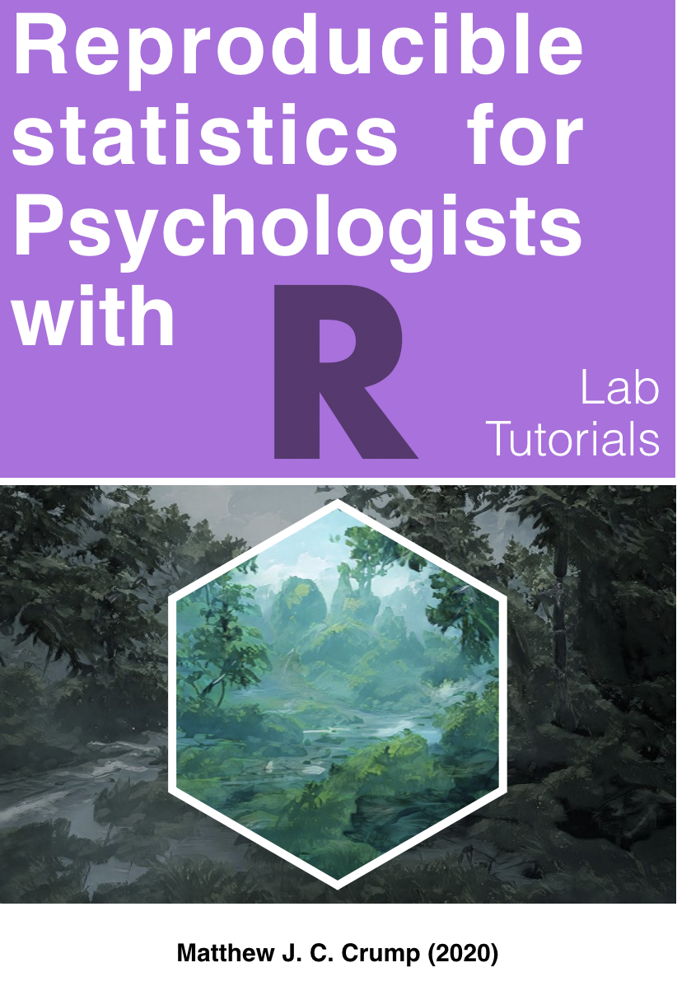

--- 
title: Reproducible statistics for psychologists with R
subtitle: Lab Tutorials
author: "Matthew J. C. Crump"
site: bookdown::bookdown_site

documentclass: book

bibliography: References.bib
csl: apa-fullnote.csl
link-citations: yes
---

# Welcome {-}

 This is a series of labs/tutorials *currently under development (2020-2021)* for a two-semester graduate-level statistics sequence in Psychology @ Brooklyn College of CUNY. The goal of these tutorials is to 1) develop a deeper conceptual understanding of the principles of statistical analysis and inference; and 2) develop practical skills for data-analysis, such as using the increasingly popular statistical software environment R to code reproducible analyses.

The first set of 13 labs roughly tracks "Thinking with Data" [@vokeyThinkingData7th2018] and "Answering questions with data" [@crumpAnsweringQuestionsData2018]; the second set of labs (to be written on a weekly basis during the Spring 2021 semester) will roughly track "Experimental Design and Analysis for Psychology" [@abdiExperimentalDesignAnalysis2009]. 

Although the primary aim is to create lab exercises that reinforce stats concepts and also train basic R coding skills for data-analysis, there are many side goals, including showing students the advantages of using R markdown and Github for creating and communicating research products. For example, aside from these tutorials, I have been developing an R package called [vertical](https://crumplab.github.io/vertical/) [@vuorreSharingOrganizingResearch2020], that highlights the advantages of learning R for researchers in psychology. And, where possible, I hope to inject some of this broader discussion about awesome R tools and how to use them into the labs (at the same time, a deep-dive requires a separate course...maybe coming soon to a browser near you).
