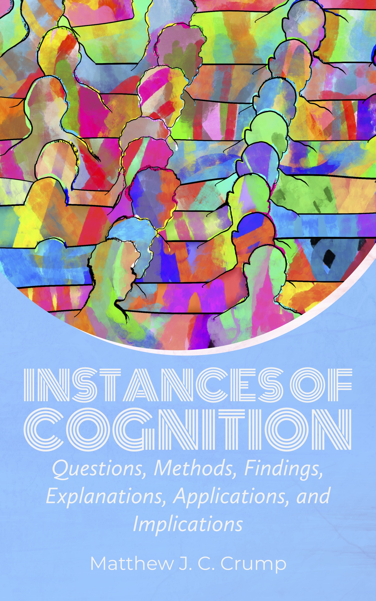

--- 
title: Instances of Cognition
subtitle: Questions, Methods, Findings, Explanations, Applications, and Implications
author: "Matthew J. C. Crump"
site: bookdown::bookdown_site
titlegraphic: "imgs/cover.jpg"
description: An introduction to cognitive psychology and open educational resource
documentclass: crumpbook
classoption:
  - oneside
  - '12pt'
bibliography: CogPsyTextbook.bib
csl: apa-fullnote.csl
link-citations: yes
---

# Welcome {-}

```{r, include=FALSE}
knitr::opts_chunk$set(cache=TRUE)
```

 This is a free, open-educational textbook and set of course materials for an introductory undergraduate course in cognition. The materials are not yet complete, and I am continuing to develop them across the Fall 2021 and Spring 2022 semesters. All of the materials are [CC BY-SA 4.0 creative-commons licensed](https://creativecommons.org/licenses/by-sa/4.0/) and free for others to use, copy, remix, re-use. 

```{r, eval=knitr::is_html_output(), echo=FALSE}
knitr::asis_output('[](https://creativecommons.org/licenses/by-sa/4.0/)')
```

The suite is developed using open-source software (R, RStudio, Bookdown). The source code for this project is available at <https://github.com/CrumpLab/cognition>. 

The suite includes:

1. This textbook: <https://www.crumplab.com/cognition/textbook>
2. A course website: <https://www.crumplab.com/cognition/>
3. Web-based slide decks for a one semester long course (see course website)
4. An exam test bank (email mcrump@brooklyn.cuny.edu)

The above material is in various stages of development, and should be complete by 2022.

We have plans to continually revise, improve, and add to this suite. In particular, a major stretch goal for the textbook is to embed lab activities in the form of web-based experiment demonstrations, and data-analysis demonstrations. Another goal is to develop tutorials showing others how to copy, use, and/or collaborate on content development.


