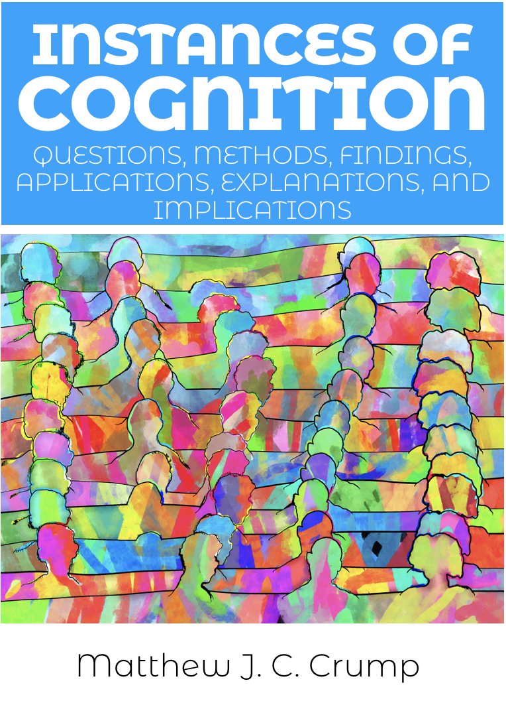

--- 
title: Cognition
subtitle: title in progress
author: "Matthew J. C. Crump"
site: bookdown::bookdown_site

documentclass: book

bibliography: CogPsyTextbook.bib
csl: apa.csl
link-citations: yes
---

# Welcome {-}

```{r, include=FALSE}
knitr::opts_chunk$set(cache=TRUE)
```

 This is an open-educational textbook and set of course materials for an introductory undergraduate course in cognition. **Presently these materials are under development**, with an anticipated first draft ready for Fall 2021.
